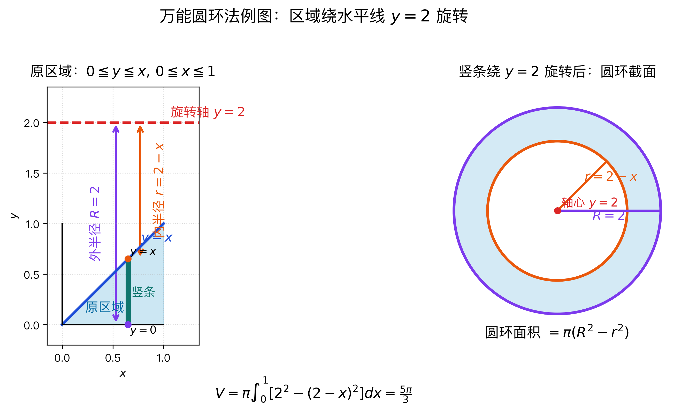

---
tags:
  - 考研数学
  - 一元函数积分学
  - 几何应用
  - 旋转体体积
---

# 绕x轴旋转的体积

## 公式（圆盘法）

曲线 $y = y(x)$ 与 $x = a$，$x = b$（$a < b$）及 $x$ 轴围成的曲边梯形绕 $x$ 轴旋转一周所得旋转体的体积：

$$V_x = \pi \int_a^b y^2(x) \, \mathrm{d}x$$

## 推导思路（微元法）

1. **取微元**：$\Delta V = \pi y^2(x) \, \mathrm{d}x$（圆盘面积 × 厚度）
2. **积分**：$V_x = \int_a^b \pi y^2(x) \, \mathrm{d}x$

> [!tip] 关键点
> - 先确定函数的定义域（如 $\sqrt{\sin x}$ 要求 $\sin x \geqslant 0$）
> - 套公式后做计算，计算量较大，重视计算能力

## 万能圆环法（绕任意水平线 $y=k$ 旋转）

> [!important] 核心原则
> 遇到绕任意水平直线 $y=k$ 旋转的问题，**不要死记新公式**，只需牢记"万能圆环法"的逻辑——一切从几何关系出发。

### 三步法

**第一步：切微元**
在图形中切出一个**垂直于 $x$ 轴**的细长条（宽度 $\mathrm{d}x$）。

**第二步：找旋转轴**
明确当前旋转轴是 $y = k$。

**第三步：确定内外半径（关键！）**

| 半径 | 含义 | 公式 |
|------|------|------|
| 外半径 $R$ | 长条离旋转轴**最远**的一端到旋转轴的距离 | $R = \lvert y_{\text{远}} - k \rvert$ |
| 内半径 $r$ | 长条离旋转轴**最近**的一端到旋转轴的距离 | $r = \lvert y_{\text{近}} - k \rvert$ |

### 体积微元

旋转出来是一个空心圆环，底面积为 $\pi R^2 - \pi r^2$：

$$\mathrm{d}V = \pi (R^2 - r^2) \, \mathrm{d}x$$

> [!tip] 特例：绕 $x$ 轴旋转
> 当 $k = 0$ 时，若图形紧贴 $x$ 轴（内半径 $r = 0$），则退化为圆盘法：
> $$\mathrm{d}V = \pi R^2 \, \mathrm{d}x = \pi y^2(x) \, \mathrm{d}x$$
> 这正是上面"圆盘法"公式的来源。

### 具体例子：绕 $y=2$ 的圆环法

> [!example] 题目
> 设区域由 $y=x$，$y=0$，$x=0$，$x=1$ 围成，即
> $$
> 0 \leq y \leq x,\quad 0 \leq x \leq 1
> $$
> 将该区域绕水平直线 $y=2$ 旋转一周，求旋转体体积。

**图的作用：**

- 左图看原区域：在每个 $x$ 处取一条竖条，竖条从 $y=0$ 到 $y=x$。
- 红色虚线是旋转轴 $y=2$，它在整个区域上方。
- 紫色箭头表示外半径 $R$：从旋转轴 $y=2$ 到竖条最远端 $y=0$。
- 橙色箭头表示内半径 $r$：从旋转轴 $y=2$ 到竖条最近端 $y=x$。
- 右图说明：这一条竖条旋转后不是实心圆盘，而是一个圆环截面。

**第一步：切竖条**

固定一个 $x$，竖条上下端分别为：

$$
y_{\text{下}}=0,\qquad y_{\text{上}}=x
$$

**第二步：找旋转轴**

旋转轴为 $y=2$，在区域上方。

**第三步：找内外半径**

外半径是离旋转轴最远的一端到 $y=2$ 的距离：

$$
R=2-0=2
$$

内半径是离旋转轴最近的一端到 $y=2$ 的距离：

$$
r=2-x
$$

因此体积微元为：

$$
\mathrm{d}V=\pi\left[R^2-r^2\right]\,\mathrm{d}x
=\pi\left[2^2-(2-x)^2\right] \mathrm{d}x
$$

所以总体积：

$$
V=\pi\int_0^1\left[2^2-(2-x)^2\right] \mathrm{d}x
$$

化简被积函数：

$$
2^2-(2-x)^2=4-(4-4x+x^2)=4x-x^2
$$

于是：

$$
V=\pi\int_0^1(4x-x^2)\,\mathrm{d}x
=\pi\left[2x^2-\frac{x^3}{3}\right]_0^1
=\frac{5\pi}{3}
$$

> [!tip] 做题结论
> 绕水平直线 $y=k$ 旋转时，半径不是函数值本身，而是“函数图像到旋转轴的距离”。本题绕 $y=2$，所以半径都要量到 $y=2$：外半径 $R=2$，内半径 $r=2-x$。

> [!warning] 易错点
> 只有绕 $x$ 轴，即绕 $y=0$ 旋转时，才可以直接把 $y=x$ 当半径写成 $\pi\int_0^1 x^2\,\mathrm{d}x$。绕 $y=2$ 时不能这样套。

## 个人笔记

