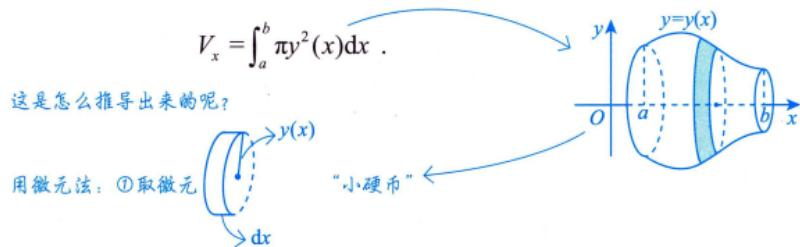

---
tags:
  - 考研数学
  - 一元函数积分学
  - 几何应用
  - 旋转体体积
---

# 绕x轴旋转的体积

## 公式（圆盘法）

曲线 $y = y(x)$ 与 $x = a$，$x = b$（$a < b$）及 $x$ 轴围成的曲边梯形绕 $x$ 轴旋转一周所得旋转体的体积：

$$V_x = \pi \int_a^b y^2(x) \, \mathrm{d}x$$

## 推导思路（微元法）

1. **取微元**：$\Delta V = \pi y^2(x) \, \mathrm{d}x$（圆盘面积 × 厚度）
2. **积分**：$V_x = \int_a^b \pi y^2(x) \, \mathrm{d}x$

> [!tip] 关键点
> - 先确定函数的定义域（如 $\sqrt{\sin x}$ 要求 $\sin x \geqslant 0$）
> - 套公式后做计算，计算量较大，重视计算能力

## 万能圆环法（绕任意水平线 $y=k$ 旋转）

> [!important] 核心原则
> 遇到绕任意水平直线 $y=k$ 旋转的问题，**不要死记新公式**，只需牢记"万能圆环法"的逻辑——一切从几何关系出发。

### 三步法

**第一步：切微元**
在图形中切出一个**垂直于 $x$ 轴**的细长条（宽度 $\mathrm{d}x$）。

**第二步：找旋转轴**
明确当前旋转轴是 $y = k$。

**第三步：确定内外半径（关键！）**

| 半径 | 含义 | 公式 |
|------|------|------|
| 外半径 $R$ | 长条离旋转轴**最远**的一端到旋转轴的距离 | $R = \lvert y_{\text{远}} - k \rvert$ |
| 内半径 $r$ | 长条离旋转轴**最近**的一端到旋转轴的距离 | $r = \lvert y_{\text{近}} - k \rvert$ |

### 体积微元

旋转出来是一个空心圆环，底面积为 $\pi R^2 - \pi r^2$：

$$\mathrm{d}V = \pi (R^2 - r^2) \, \mathrm{d}x$$

> [!tip] 特例：绕 $x$ 轴旋转
> 当 $k = 0$ 时，若图形紧贴 $x$ 轴（内半径 $r = 0$），则退化为圆盘法：
> $$\mathrm{d}V = \pi R^2 \, \mathrm{d}x = \pi y^2(x) \, \mathrm{d}x$$
> 这正是上面"圆盘法"公式的来源。

## 个人笔记

