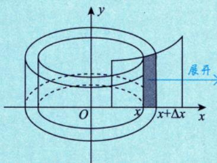
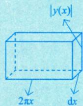

---
tags:
  - 考研数学
  - 一元函数积分学
  - 几何应用
  - 旋转体体积
---

# 绕y轴旋转的体积

## 公式（圆柱壳法）

曲线 $y = y(x)$ 与 $x = a$，$x = b$（$0 \leqslant a < b$）及 $x$ 轴围成的曲边梯形绕 $y$ 轴旋转一周所得旋转体的体积：

$$V_y = 2\pi \int_a^b x|y(x)| \, \mathrm{d}x$$

## 推导思路（微元法）

在 $x$ 轴上取微小区间 $[x, x + \Delta x]$（$\Delta x > 0$），对应的小竖条绕 $y$ 轴旋转一周形成一个**圆柱壳**（Shell）：

将圆柱壳"展开"为一个**长方体薄片**，其三个维度为：

| 维度    | 几何含义    | 对应量           |      |     |
| ----- | ------- | ------------- | ---- | --- |
| 长     | 圆柱壳底面周长 | $2\pi x$      |      |     |
| 宽     | 圆柱壳高度   | $             | y(x) | $   |
| 高（厚度） | 圆柱壳壁厚   | $\mathrm{d}x$ |      |     |

因此体积微元为：

$$\mathrm{d}V_y = \underbrace{2\pi x}_{\text{周长}} \cdot \underbrace{|y(x)|}_{\text{高度}} \cdot \underbrace{\mathrm{d}x}_{\text{厚度}}$$

对 $x$ 从 $a$ 到 $b$ 积分即得总体积。

> [!tip] 记忆方法
> $$V_x = \pi \int_a^b \square^2 \, \mathrm{d}x \quad \text{（往"口"里代）}$$
> $$V_y = 2\pi \int_a^b x|\square| \, \mathrm{d}x$$

> [!tip] 关键技巧
> 学会利用反函数，将绕 $x$ 轴旋转用 $V_y$ 的体积公式表示出来（$x$、$y$ 地位交换）

## 万能圆柱壳法（绕任意直线 $x = k$）

前面的公式是绕 $y$ 轴（即 $x = 0$）旋转的特例。下面给出一套通用逻辑，可推广到绕**任意纵向直线** $x = k$ 旋转的情况。

### 核心四步

**1. 切微元**：取一个与旋转轴平行的竖直细长条，宽度 $\mathrm{d}x$，横坐标为 $x$。

**2. 找旋转轴**：明确旋转轴为直线 $x = k$。

**3. 确定壳的"半径"与"高"**：

| 参数   | 含义         | 公式                                    |
| ---- | ---------- | ------------------------------------- |
| 半径 $r$ | 微元到旋转轴的水平距离 | $r = \|x - k\|$                        |
| 高 $h$  | 竖直细长条的长度    | $h = y_{\text{上}} - y_{\text{下}}$ |

**4. 列体积微元**：将圆柱壳"沿高剪开"展平为矩形薄板——

| 维度  | 几何含义     | 对应量      |
| --- | -------- | -------- |
| 长   | 底面周长     | $2\pi r$ |
| 宽   | 圆柱壳高度    | $h$      |
| 厚   | 微元宽度     | $\mathrm{d}x$ |

因此：

$$\mathrm{d}V = 2\pi r \cdot h \, \mathrm{d}x = 2\pi |x - k|(y_{\text{上}} - y_{\text{下}}) \, \mathrm{d}x$$

> [!tip] 水平切片的对称形式
> 若取水平切片 $\mathrm{d}y$，绕水平直线 $y = k$ 旋转，逻辑完全对称：
> - 半径：$r = |y - k|$
> - 高：$h = x_{\text{右}} - x_{\text{左}}$
> - 体积微元：$\mathrm{d}V = 2\pi |y - k|(x_{\text{右}} - x_{\text{左}}) \, \mathrm{d}y$

> [!summary] 一句话记忆
> **"壳的周长 $\times$ 壳的高 $\times$ 壳的厚"**，其中周长 $= 2\pi \times$ 到轴的距离，高 $=$ 截线长度，厚 $= \mathrm{d}x$ 或 $\mathrm{d}y$。

## 个人笔记

