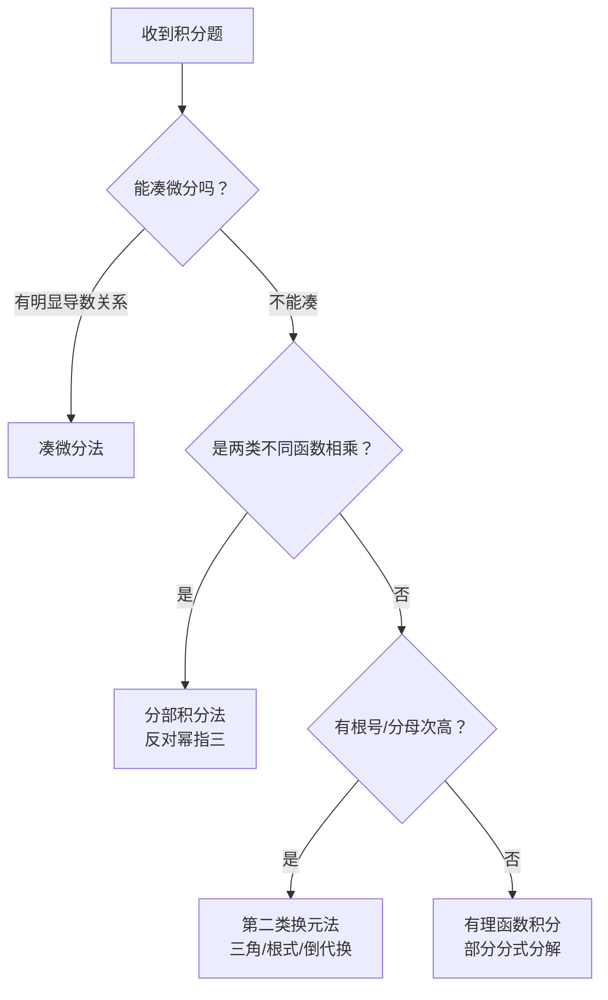
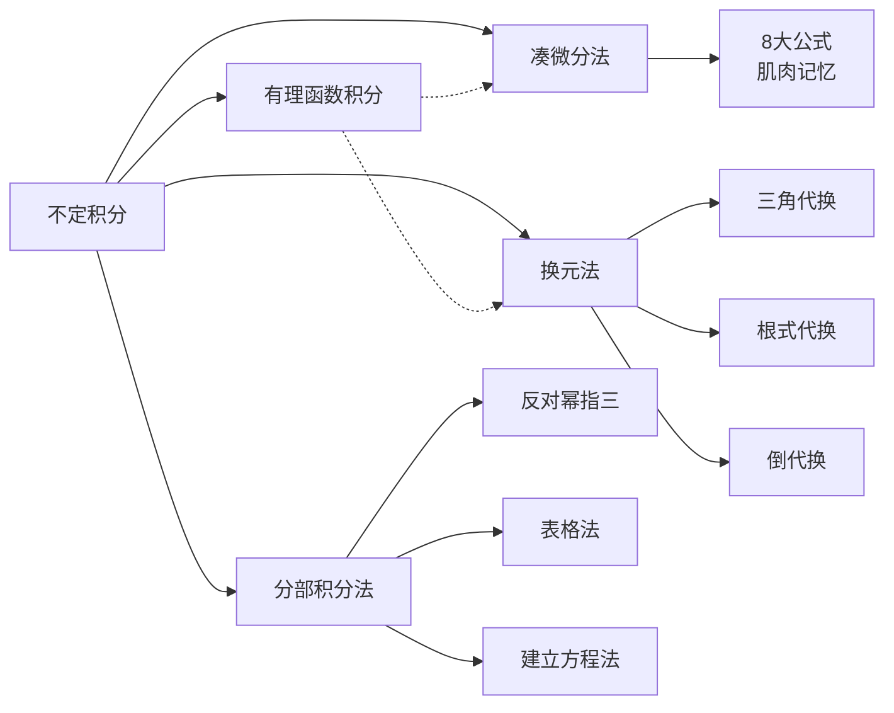

# 📝 不定积分的积分法 - 章节总结

## 📌 章节定位

**所属模块**：高数-一元函数积分学
**重要程度**：⭐⭐⭐⭐⭐
**考研要求**: 熟练掌握三大积分方法（凑微分、换元、分部积分），能综合运用

---

## 🧭 综合实战逻辑树

在考场上遇到一道陌生的不定积分题，按以下逻辑快速排查：

> [!tip] 解题优先级
> **先看能不能凑** → **再看是否两类相乘** → **最后考虑强行换元**

---

## 📚 核心方法速查

### 一、凑微分法（第一换元法）

#### 核心思想
将被积函数的一部分"塞"进微分号 $\mathrm{d}$ 后面，逆用复合函数求导法则。

$$\int f[g(x)] g'(x) \mathrm{d}x = \int f[g(x)] \mathrm{d}[g(x)] \xlongequal{u=g(x)} \int f(u) \mathrm{d}u$$

#### 破局关键
**寻找"谁是谁的导数"** —— 观察被积函数，找出导数关系

#### 8大凑微分公式（肌肉记忆级）

| 类型 | 凑微分公式 | 常见积分形式 |
|:----:|:----------|:-------------|
| **幂** | $x\mathrm{d}x = \frac{1}{2}\mathrm{d}(x^2)$ | $\int xf(x^2)\mathrm{d}x = \frac{1}{2}\int f(u)\mathrm{d}u$ |
| **根** | $\frac{\mathrm{d}x}{\sqrt{x}} = 2\mathrm{d}(\sqrt{x})$ | $\int \frac{f(\sqrt{x})}{\sqrt{x}}\mathrm{d}x = 2\int f(u)\mathrm{d}u$ |
| **负幂** | $\frac{\mathrm{d}x}{x^2} = \mathrm{d}\left(-\frac{1}{x}\right)$ | $\int \frac{f(-1/x)}{x^2}\mathrm{d}x = \int f(u)\mathrm{d}u$ |
| **对** | $\frac{1}{x}\mathrm{d}x = \mathrm{d}(\ln\vert x\vert)$ | $\int \frac{f(\ln x)}{x}\mathrm{d}x = \int f(u)\mathrm{d}u$ |
| **指** | $e^x\mathrm{d}x = \mathrm{d}(e^x)$ | $\int e^x f(e^x)\mathrm{d}x = \int f(u)\mathrm{d}u$ |
| **三** | $\cos x\mathrm{d}x = \mathrm{d}(\sin x)$ | $\int f(\sin x)\cos x\mathrm{d}x = \int f(u)\mathrm{d}u$ |
| **割** | $\sec^2 x\mathrm{d}x = \mathrm{d}(\tan x)$ | $\int f(\tan x)\sec^2 x\mathrm{d}x = \int f(u)\mathrm{d}u$ |
| **反三** | $\frac{1}{1+x^2}\mathrm{d}x = \mathrm{d}(\arctan x)$ | $\int \frac{f(\arctan x)}{1+x^2}\mathrm{d}x = \int f(u)\mathrm{d}u$ |

#### 实战技巧
> [!example] 对复杂部分求导
> 遇到非标准形式，直接对最复杂的部分 $g(x)$ 求导。
> - 若 $\mathrm{d}[g(x)] = f(x)\mathrm{d}x$（导数正好凑成剩余部分）
> - 则 $\int f(x)g(x)\mathrm{d}x = \int g(x)\mathrm{d}[g(x)]$，凑微分成功！

#### ⚠️ 致命易错点
- $\frac{1}{x}\mathrm{d}x = \mathrm{d}(\ln\vert x\vert)$ **注意绝对值！**
- 凑完微分后要确认能代入基本积分公式

---

### 二、换元法（第二换元法）

#### 核心思想
主动引入新变量 $t$ "破拆"复杂结构，适用于凑微分无能为力时。

$$\int f(x)\mathrm{d}x \xrightarrow{x=g(u)} \int f[g(u)]g'(u)\mathrm{d}u$$

#### 三大常用流派

| 流派 | 适用场景 | 换元方法 | 关键技巧 |
|:----:|:---------|:---------|:---------|
| **三角代换** | 含 $\sqrt{a^2-x^2}$ | $x = a\sin t$ | 利用 $\sin^2 t + \cos^2 t = 1$ |
| | 含 $\sqrt{a^2+x^2}$ | $x = a\tan t$ | 利用 $1 + \tan^2 t = \sec^2 t$ |
| | 含 $\sqrt{x^2-a^2}$ | $x = a\sec t$ | 利用 $\sec^2 t - 1 = \tan^2 t$ |
| **根式代换** | 含 $\sqrt[n]{ax+b}$ | 令整个根式为 $t$ | 简单粗暴 |
| | 含多个不同次根号 | 取指数最小公倍数 | 如 $\sqrt[2]{},\sqrt[3]{}$ → 令 $\sqrt[6]{}=t$ |
| **倒代换** | 分母次数比分子高两次及以上 | $x = \frac{1}{t}$ | 往往有奇效 |

> [!note] 普通二次三项式
> 若含 $\sqrt{ax^2+bx+c}$，先**配方**再作三角代换

#### ⚠️ 致命易错点
- **积分算完后，绝对不能忘记回代！** 需将结果中的 $t$ 通过反函数换回 $x$
- 三角代换时注意 $\sqrt{}$ 的处理（可能涉及取绝对值）

---

### 三、分部积分法

#### 核心思想
处理两类不同性质函数相乘的硬骨头，将难算的积分转化为易算的积分。

$$\int u \mathrm{d}v = uv - \int v \mathrm{d}u$$

#### 唯一法则：反对幂指三

> [!important] 必须牢记
> **反 > 对 > 幂 > 指 > 三**
> 排在**左边**的优先选作 $u$（去求导，越导越简单）
> 排在**右边**的选作 $v$（去积分）

| 函数类型 | 选作 | 理由 |
|:--------:|:----:|:-----|
| 反三角、对数 | $u$ | 求导后变简单 |
| 幂函数 | $u$（相对指、三） | 求导后次数降低 |
| 指数、三角 | $v$ | 积分后不增加复杂度 |

#### 考场效率神器：表格法

适用于 $P_n(x)e^{kx}$ 或 $P_n(x)\sin ax$ 等需多次分部积分的题目。

**以 $\int (x^3+2x+6)e^{2x}\mathrm{d}x$ 为例：**

| $u$ 的各阶导数 | $u$ | $u'$ | $u''$ | $u^{(3)}$ | $u^{(4)}$ |
|:---:|:---:|:---:|:---:|:---:|:---:|
| | $x^3+2x+6$ | $3x^2+2$ | $6x$ | $6$ | $0$ |
| $v^{(n)}$ 的各阶原函数 | $e^{2x}$ | $\frac{1}{2}e^{2x}$ | $\frac{1}{4}e^{2x}$ | $\frac{1}{8}e^{2x}$ | $\frac{1}{16}e^{2x}$ |

**计算方法**：左上右下错位相乘，符号 "+""-" 相间

$$\text{原式} = (x^3+2x+6)\cdot\frac{1}{2}e^{2x} - (3x^2+2)\cdot\frac{1}{4}e^{2x} + 6x\cdot\frac{1}{8}e^{2x} - 6\cdot\frac{1}{16}e^{2x} + C$$

#### 特殊题型：$e^{ax}\sin bx$ 型

> [!warning] 建立方程法
> 这类题没有尽头，需**分部积分两次后建立方程**，把原积分移项求解！

#### ⚠️ 易错点
- **$u, v$ 选反了**：导致积分越来越复杂
- **忘记表格法符号**：符号 "+""-" 相间
- **$e^{ax}\sin bx$ 型**：注意正负号，建立方程后移项求解

---

### 四、有理函数的积分（补充）

#### 计算步骤
1. 若 $n \geq m$（假分式），先化为真分式
2. 对 $Q_m(x)$ 因式分解
3. 部分分式分解
4. 对各项分别积分

#### 最简有理分式类型

| 因式类型 | 拆分结果 |
|:---------|:---------|
| 一次单因式 $(ax+b)$ | $\frac{A}{ax+b}$ |
| $k$ 重一次因式 $(ax+b)^k$ | $\frac{A_1}{ax+b} + \cdots + \frac{A_k}{(ax+b)^k}$ |
| 二次单因式 $(px^2+qx+r)$ | $\frac{Ax+B}{px^2+qx+r}$ |

---

## 📊 三大方法对比速查表

| 维度 | 凑微分法 | 换元法 | 分部积分法 |
|:----:|:---------|:-------|:-----------|
| **本质** | 逆用链式法则 | 主动引入新变量 | 交换微分对象 |
| **口诀** | 谁是谁的导数 | 破拆复杂结构 | 反对幂指三 |
| **适用** | 有明显导数关系 | 含根号、高次分母 | 两类不同函数相乘 |
| **优先级** | ⭐⭐⭐ 第一尝试 | ⭐⭐ 凑微分失败后 | ⭐⭐ 两函数相乘时 |
| **易错** | 绝对值 $\ln\vert x\vert$ | 忘记回代 | $u, v$ 选反 |

---

## 🔗 知识关联图

---

## 📖 相关笔记索引

- [[凑微分法]] - 详细的凑微分公式与例题
- [[换元法]] - 三角代换、根式代换、倒代换详解
- [[分部积分法]] - 反对幂指三法则与表格法
- [[有理函数的积分]] - 部分分式分解与三角有理式

---

**创建日期**：2026-04-06
**最后更新**：2026-04-06
