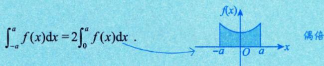
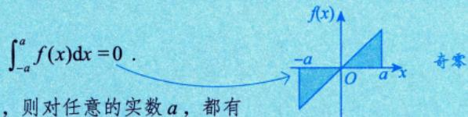

## 📖 知识导航

| 核心方法 | 关键词 | 难度 |
|:---:|:---|:---:|
| [[#核心公式：牛顿-莱布尼茨公式]] | 原函数、分段积分 | ⭐⭐ |
| [[#定积分的换元积分法]] | 换元必三换、上下限变换 | ⭐⭐⭐ |
| [[#定积分的分部积分法]] | $uv' = uv - u'v$ | ⭐⭐ |
| [[#常用公式]] | 奇偶性、周期性、区间再现、华里士 | ⭐⭐⭐⭐ |

---

## 核心公式：牛顿-莱布尼茨公式

$$\int_a^b f(x) \mathrm{d}x = F(x) \Big|_a^b = F(b) - F(a)$$

其中 $F(x)$ 是 $f(x)$ 的原函数。

### 公式证明

设 $f(x)$ 在 $[a,b]$ 上连续，构造变上限积分函数：

$$G(x) = \int_a^x f(t) \mathrm{d}t, \quad a \leqslant x \leqslant b$$

则由变限积分性质可知：

$$G(b) = \int_a^b f(t) \mathrm{d}t, \quad G(a) = 0$$

由微积分基本定理，$G'(x) = f(x)$。又已知 $F'(x) = f(x)$，故 $G(x)$ 与 $F(x)$ 都是 $f(x)$ 的原函数，从而：

$$G(x) = F(x) + C$$

因此：

$$\int_a^b f(x) \mathrm{d}x = G(b) - G(a) = F(b) - F(a)$$

> [!tip] 证明思路
> 利用变上限积分函数 $G(x)$ 作为桥梁，连接定积分（$G(b)-G(a)$）与原函数（$F(b)-F(a)$）。

### 扩展：分段有原函数的情形

若 $f(x)$ 在 $[a, b]$ 上分段有原函数，如在 $[a, c)$ 上有原函数 $F_1(x)$，在 $(c, b]$ 上有原函数 $F_2(x)$，则：

$$\int_a^b f(x) \mathrm{d}x = \int_a^c f(x) \mathrm{d}x + \int_c^b f(x) \mathrm{d}x = F_1(c - 0) - F_1(a) + F_2(b) - F_2(c + 0)$$

**收敛性判定**：
- 若 $F_1(c - 0)$、$F_2(c + 0)$ 都存在，则 $\displaystyle\int_a^b f(x) \mathrm{d}x$ **收敛**
- 若 $F_1(c - 0)$、$F_2(c + 0)$ 至少有一个不存在，则 $\displaystyle\int_a^b f(x) \mathrm{d}x$ **发散**

> [!note] 理解要点
>
> **1. 为什么要"切开"算？**
>
> 假设 $f(x)$ 在点 $c$ 处发生改变——可能是分段函数的转折点，也可能是函数值在 $c$ 点趋于无穷大。因为 $f(x)$ 在 $c$ 的左边和右边遵循不同的规律（分别对应原函数 $F_1(x)$ 和 $F_2(x)$），不能直接用一个原函数从 $a$ 算到 $b$。必须利用**积分区间的可加性**把积分切开：
> $$\int_a^b f(x) \mathrm{d}x = \int_a^c f(x) \mathrm{d}x + \int_c^b f(x) \mathrm{d}x$$
>
> **2. 为什么写成 $c - 0$ 和 $c + 0$？**
>
> 前提条件：原函数定义在 $[a, c)$ 和 $(c, b]$ 上，说明在 $c$ 点本身，原函数可能没有定义。既然不能直接把 $x = c$ 代入，只能用极限逼近：
> - $F_1(c - 0) = \lim_{x \to c^-} F_1(x)$（左极限）
> - $F_2(c + 0) = \lim_{x \to c^+} F_2(x)$（右极限）
>
> 分别对两段使用牛顿-莱布尼茨公式：
> $$\int_a^c f(x) \mathrm{d}x = F_1(c - 0) - F_1(a), \quad \int_c^b f(x) \mathrm{d}x = F_2(b) - F_2(c + 0)$$
>
> **3. "收敛"与"发散"的含义**
>
> - **收敛**：$F_1(c - 0)$ 和 $F_2(c + 0)$ 都能算出具体常数，说明尽管函数在 $c$ 点可能断开或趋于无穷，但围成的总面积有限
> - **发散**：只要有一个极限不存在（如趋于 $\infty$），总面积无限大，积分值不存在

---

## 定积分的换元积分法

### ⚠️ 核心原则：换元必三换

在进行定积分计算，令 $x = \varphi(t)$ 进行换元时，必须严格执行以下三个步骤，缺一不可：

| 步骤 | 操作 | 公式 |
|:---:|:---|:---|
| ① | **被积函数要换** | $f(x) \rightarrow f[\varphi(t)]$ |
| ② | **积分变量要换**（换微分） | $\mathrm{d}x \rightarrow \varphi'(t)\mathrm{d}t$ |
| ③ | **上下限要换** | $\displaystyle\int_{a}^{b} \rightarrow \int_{\alpha}^{\beta}$ |

#### 综合公式

$$\int_{a}^{b} f(x) \mathrm{d}x = \int_{\alpha}^{\beta} f[\varphi(t)] \varphi'(t) \mathrm{d}t$$

### 定理条件

设 $f(x)$ 在 $[a,b]$ 上连续，函数 $x = \varphi(t)$ 满足：

1. $\varphi(\alpha) = a$，$\varphi(\beta) = b$
2. $x = \varphi(t)$ 在 $[\alpha, \beta]$ 或 $[\beta, \alpha]$ 上有连续导数，且值域为 $[a,b]$

### ⚠️ 备考易错点

> [!warning] 易错点一：上下限必须严格对应
> 计算出新积分的上下限后，**不要管谁大谁小**，必须严格按照原来的下、上限顺序写。
>
> 如果出现新下限大于新上限的情况（即 $\alpha > \beta$），直接计算即可，或者利用定积分性质 $\displaystyle\int_{\alpha}^{\beta} = - \int_{\beta}^{\alpha}$ 调换上下限并变号。

> [!warning] 易错点二：注意代换区间的单调性
> 进行三角换元或倒代换时，要注意限制新变量 $t$ 的取值范围，保证 $x = \varphi(t)$ 在区间内是**单调的**（确保存在反函数）。
>
> 例如，令 $x = a \sin t$ 时，通常限制 $t \in \left[-\dfrac{\pi}{2}, \dfrac{\pi}{2}\right]$。

> [!tip] 其他注意事项
> - 换元后积分限要改变，但**不用回代**
> - $\varphi(t)$ 的值域不能超出 $[a,b]$
> - $\varphi(t)$ 在对应区间上单调

---

## 定积分的分部积分法

$$\int_a^b u(x)v'(x) \mathrm{d}x = u(x)v(x) \Big|_a^b - \int_a^b v(x)u'(x) \mathrm{d}x$$

要求 $u'(x), v'(x)$ 在 $[a,b]$ 上连续。

---

## 常用公式

### 1. 奇偶函数积分 ⭐

| 函数类型 | 积分公式 | 图示 |
|:---:|:---|:---:|
| **偶函数** | $\displaystyle\int_{-a}^a f(x) \mathrm{d}x = 2\int_0^a f(x) \mathrm{d}x$ |  |
| **奇函数** | $\displaystyle\int_{-a}^a f(x) \mathrm{d}x = 0$ |  |

### 2. 周期函数积分

设 $f(x)$ 是以 $T$ 为周期的连续函数，则对任意实数 $a$：

$$\int_a^{a+T} f(x) \mathrm{d}x = \int_0^T f(x) \mathrm{d}x$$

> [!tip] 含义
> 在长度为一个周期的区间上的定积分，与该区间的起点位置无关。

### 3. 区间再现公式

设 $f(x)$ 为连续函数，则：

$$\int_a^b f(x) \mathrm{d}x = \int_a^b f(a+b-x) \mathrm{d}x$$

> [!note] 使用技巧
> 当 $f(x)$ 复杂，但 $f(x) + f(a+b-x)$ 简单时：
> $$\int_a^b f(x) \mathrm{d}x = \int_a^b \frac{f(x) + f(a+b-x)}{2} \mathrm{d}x$$

满足以下条件之一，优先尝试区间再现：

1. **结构互补：** 分式中存在 $f(x)$ 和 $f(a+b-x)$ 的对称结构（如上面举例的根式）。
2. **特殊积分限的三角函数：** 上下限之和为 $\frac{\pi}{2}$、$\pi$、$\frac{\pi}{4}$ 等特殊角，且被积函数含有 $\sin$、$\cos$ 或 $\tan$ 的高次幂、对数或分式。
3. **“做不下去”的定积分：** 当你发现一个定积分用凑微分、分部积分都非常繁琐，且没有明显的奇偶性可用时，“区间再现”往往是破局的唯一钥匙。

**典型例题**：计算 $\displaystyle\int_0^{\frac{\pi}{4}} \ln(1 + \tan x) \mathrm{d}x$

**解**：

$$\begin{aligned}
I &= \int_0^{\frac{\pi}{4}} \ln(1 + \tan x) \mathrm{d}x \\
&= \int_0^{\frac{\pi}{4}} \ln \left[1 + \tan \left(\frac{\pi}{4} - x\right)\right] \mathrm{d}x \\
&= \int_0^{\frac{\pi}{4}} \ln \left(1 + \frac{1 - \tan x}{1 + \tan x}\right) \mathrm{d}x \\
&= \int_0^{\frac{\pi}{4}} \ln \frac{2}{1 + \tan x} \mathrm{d}x \\
&= \int_0^{\frac{\pi}{4}} \frac{\ln (1 + \tan x) + \ln \frac{2}{1 + \tan x}}{2} \mathrm{d}x \\
&= \int_0^{\frac{\pi}{4}} \frac{\ln (1 + \tan x) + \ln 2 - \ln (1 + \tan x)}{2} \mathrm{d}x \\
&= \frac{\pi}{8} \ln 2
\end{aligned}$$

### 4. 华里士公式（点火公式）⭐⭐⭐

华里士公式可快速计算 $\sin^n x$ 和 $\cos^n x$ 在特定区间上的定积分。

#### 📌 记忆口诀

> [!tip] 快速记忆
> - **奇数**：连乘到 **1**（末尾是 1）
> - **偶数**：连乘到 $\dfrac{1}{2}$ 后再乘 $\dfrac{\pi}{2}$
> - **区间扩展**：$[0, \pi]$ 乘 2，$[0, 2\pi]$ 乘 4
> - **特殊情况**：$\cos^n x$ 在 $[0, \pi]$ 和 $[0, 2\pi]$ 上奇数时为 **0**

#### 公式速查表

| 积分区间 | 函数 | $n$ 为正奇数 | $n$ 为正偶数 |
|:---:|:---:|:---|:---|
| $\left[0, \dfrac{\pi}{2}\right]$ | $\sin^n x, \cos^n x$ | $\dfrac{n-1}{n} \cdot \dfrac{n-3}{n-2} \cdots \dfrac{2}{3} \cdot 1$ | $\dfrac{n-1}{n} \cdot \dfrac{n-3}{n-2} \cdots \dfrac{1}{2} \cdot \dfrac{\pi}{2}$ |
| $[0, \pi]$ | $\sin^n x$ | $2 \times$ 基本形式 | $2 \times$ 基本形式 |
| $[0, \pi]$ | $\cos^n x$ | **0** | $2 \times$ 基本形式 |
| $[0, 2\pi]$ | $\sin^n x, \cos^n x$ | **0** | $4 \times$ 基本形式 |

#### 典型例题

**例1**：计算 $\displaystyle\int_0^{\frac{\pi}{2}} \sin^8 x \mathrm{d}x$

**解**：$n = 8$ 为正偶数，应用华里士公式：

$$\int_0^{\frac{\pi}{2}} \sin^8 x \mathrm{d}x = \frac{7}{8} \cdot \frac{5}{6} \cdot \frac{3}{4} \cdot \frac{1}{2} \cdot \frac{\pi}{2} = \frac{35\pi}{256}$$

**例2**：计算 $\displaystyle\int_0^\pi \sin^9 x \mathrm{d}x$

**解**：$n = 9$ 为大于1的奇数，应用华里士公式：

$$\int_0^\pi \sin^9 x \mathrm{d}x = 2 \cdot \int_0^{\frac{\pi}{2}} \sin^9 x \mathrm{d}x = 2 \cdot \frac{8}{9} \cdot \frac{6}{7} \cdot \frac{4}{5} \cdot \frac{2}{3} \cdot 1 = \frac{256}{315}$$

---

## 综合例题

### 例9.12：定积分定义求极限

计算 $\displaystyle\lim_{n\to \infty} \frac{1}{n}\sum_{i=1}^n [\ln(3n-2i) - \ln(n+2i)]$

**解**：

$$\begin{aligned}
\text{原式} &= \lim_{n\to \infty} \frac{1}{n}\sum_{i=1}^n \ln\frac{3n-2i}{n+2i} \\
&= \lim_{n\to \infty} \frac{1}{n}\sum_{i=1}^n \ln\frac{3-\frac{2i}{n}}{1+\frac{2i}{n}} \\
&= \int_0^1 \ln\frac{3-2x}{1+2x} \mathrm{d}x \\
&\xrightarrow{x-\frac{1}{2}=t} \int_{-\frac{1}{2}}^{\frac{1}{2}} \ln\frac{2-2t}{2+2t} \mathrm{d}t \\
&= \int_{-\frac{1}{2}}^{\frac{1}{2}} \ln\frac{1-t}{1+t} \mathrm{d}t
\end{aligned}$$

由于 $\ln\dfrac{1-t}{1+t}$ 为奇函数，所以积分为 $0$。

### 例9.13：换元法 + 华里士公式

求 $\displaystyle\int_{-1}^1 x^2\sqrt{1-x^2} \mathrm{d}x$

**解**：

被积函数为偶函数，故：

$$\int_{-1}^1 x^2\sqrt{1-x^2} \mathrm{d}x = 2\int_0^1 x^2\sqrt{1-x^2} \mathrm{d}x$$

令 $x = \sin t$，则 $\mathrm{d}x = \cos t\mathrm{d}t$。当 $t \in [0, \frac{\pi}{2}]$ 时，$x = \sin t$ 不超出 $[0, 1]$，且 $\cos t$ 在 $[0, \frac{\pi}{2}]$ 上连续。

于是：

$$\begin{aligned}
\text{原式} &= 2\int_0^{\frac{\pi}{2}} \sin^2 t \cdot \cos t \cdot \cos t \mathrm{d}t \\
&= 2\int_0^{\frac{\pi}{2}} \sin^2 t \cos^2 t \mathrm{d}t \\
&= 2\int_0^{\frac{\pi}{2}} \sin^2 t (1 - \sin^2 t) \mathrm{d}t \\
&= 2\left(\int_0^{\frac{\pi}{2}} \sin^2 t \mathrm{d}t - \int_0^{\frac{\pi}{2}} \sin^4 t \mathrm{d}t\right) \\
&= 2\left(\frac{1}{2} \cdot \frac{\pi}{2} - \frac{3}{4} \cdot \frac{1}{2} \cdot \frac{\pi}{2}\right) \\
&= 2 \cdot \frac{\pi}{2} \left(\frac{1}{2} - \frac{3}{8}\right) \\
&= \pi \cdot \frac{1}{8} = \frac{\pi}{8}
\end{aligned}$$

---

## 📚 相关链接

- [[不定积分的计算]]
- [[牛顿-莱布尼茨公式]]
- [[变限积分的计算]]

---

## 📝 学习要点

1. ⭐ **牛顿-莱布尼茨公式**是定积分计算的核心，必须熟练掌握
2. 定积分换元时注意**积分限的变化**（换元必三换）
3. 熟记**华里士公式**可以快速计算某些特殊定积分
4. 利用**奇偶性、周期性**可以简化计算
5. **区间再现公式**是重要技巧，需灵活运用
