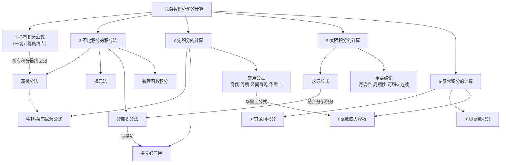

# 📝 一元函数积分学的计算 - 章节总结

## 📌 章节定位

**所属模块**：高数-一元函数积分学
**重要程度**：⭐⭐⭐⭐⭐
**考研要求**：熟练掌握不定积分、定积分、变限积分、反常积分的计算方法，能综合运用

---

## 🧭 全模块知识架构



---

## 📚 模块一：基本积分公式

> [!tip] 核心思想
> 所有的积分计算通过各种方法最后都化为基本积分公式。这是积分计算的"终点站"。

### 10组必背公式

| # | 类型 | 公式 |
|:---:|:---:|:---|
| 1 | 幂函数 | $\displaystyle\int x^k \mathrm{d}x = \frac{1}{k+1} x^{k+1} + C \quad (k \neq -1)$ |
| 2 | 对数 | $\displaystyle\int \frac{1}{x} \mathrm{d}x = \ln\vert x\vert + C$ |
| 3 | 指数 | $\displaystyle\int e^x \mathrm{d}x = e^x + C$，$\displaystyle\int a^x \mathrm{d}x = \frac{a^x}{\ln a} + C$ |
| 4 | 三角 | $\displaystyle\int \sin x \mathrm{d}x = -\cos x + C$，$\displaystyle\int \cos x \mathrm{d}x = \sin x + C$ |
| 5 | 正割/余割 | $\displaystyle\int \sec x \mathrm{d}x = \ln\vert\sec x + \tan x\vert + C$ 等 |
| 6 | 反三角 | $\displaystyle\int \frac{1}{1+x^2} \mathrm{d}x = \arctan x + C$，$\displaystyle\int \frac{1}{\sqrt{1-x^2}} \mathrm{d}x = \arcsin x + C$ |
| 7 | 双曲 | $\displaystyle\int \frac{1}{\sqrt{x^2+a^2}} \mathrm{d}x = \ln(x+\sqrt{x^2+a^2}) + C$ |
| 8 | 有理函数 | $\displaystyle\int \frac{1}{x^2-a^2} \mathrm{d}x = \frac{1}{2a}\ln\left\vert\frac{x-a}{x+a}\right\vert + C$ |
| 9 | 圆弧 | $\displaystyle\int \sqrt{a^2-x^2} \mathrm{d}x = \frac{a^2}{2}\arcsin\frac{x}{a} + \frac{x}{2}\sqrt{a^2-x^2} + C$ |
| 10 | 二次三角 | $\displaystyle\int \sin^2 x \mathrm{d}x = \frac{x}{2} - \frac{\sin 2x}{4} + C$ 等 |

> [!warning] 易错点
> - 常数 $C$ 不能遗漏
> - 对数公式中的绝对值 $\ln\vert x\vert$ 不能省
> - $k = -1$ 时幂函数公式失效，需用对数公式

---

## 📚 模块二：不定积分的积分法

> [!abstract] 子模块已有独立总结
> 详细的方法讲解、例题、知识关联图见 [[2-不定积分的积分法/📝 章节总结]]
> 以下为高度精炼的速查版本。

### 解题优先级逻辑树

```
收到积分题
  ↓
① 能凑微分吗？ ──→ 有明显导数关系 → 凑微分法（第一优先）
  ↓ 不能凑
② 是两类不同函数相乘？ ──→ 是 → 分部积分法（反对幂指三）
  ↓ 否
③ 有根号/分母次高？ ──→ 是 → 换元法（三角/根式/倒代换）
  ↓ 否
④ 是有理分式？ ──→ 是 → 有理函数积分（部分分式分解）
```

### 四大方法速查

| 方法 | 本质 | 口诀 | 适用场景 | 优先级 |
|:---:|:---:|:---:|:---:|:---:|
| **凑微分法** | 逆用链式法则 | 谁是谁的导数 | 有明显导数关系 | ⭐⭐⭐ 第一 |
| **换元法** | 主动引入新变量 | 破拆复杂结构 | 含根号、高次分母 | ⭐⭐ 第二 |
| **分部积分法** | 交换微分对象 | 反对幂指三 | 两类不同函数相乘 | ⭐⭐ 第三 |
| **有理函数积分** | 部分分式分解 | 拆分→逐项积分 | 有理分式、三角有理式 | ⭐ 兜底 |

### 换元法三大流派

| 流派 | 适用场景 | 换元方法 |
|:---:|:---:|:---:|
| **三角代换** | $\sqrt{a^2-x^2}$ / $\sqrt{a^2+x^2}$ / $\sqrt{x^2-a^2}$ | $x = a\sin t$ / $x = a\tan t$ / $x = a\sec t$ |
| **根式代换** | $\sqrt[n]{ax+b}$ 等 | 令整个根式为 $t$；多根号取指数最小公倍数 |
| **倒代换** | 分母次数比分子高两次及以上 | $x = \frac{1}{t}$ |

### 分部积分法速查

**$u, v$ 选取原则**：反 > 对 > 幂 > 指 > 三，左边选 $u$（求导），右边选 $v$（积分）

**考场效率神器——表格法**：适用于 $P_n(x)e^{kx}$ 或 $P_n(x)\sin ax$，左上右下错位相乘，符号 "+" "-" 相间。

**循环积分速杀公式（行列式记忆法）**：

$$\int \mathrm{e}^{ax} \sin bx\,\mathrm{d}x = \frac{a\mathrm{e}^{ax}\sin bx - b\mathrm{e}^{ax}\cos bx}{a^2 + b^2} + C$$

$$\int \mathrm{e}^{ax} \cos bx\,\mathrm{d}x = \frac{a\mathrm{e}^{ax}\cos bx + b\mathrm{e}^{ax}\sin bx}{a^2 + b^2} + C$$

### 有理函数积分核心

**四步流程**：假分式 → 真分式 → 因式分解 → 待定系数 → 逐项积分

**四种最简分式**：

| 类型 | 因式 | 拆分 | 积分走向 |
|:---:|:---:|:---:|:---:|
| Type 1 | 一次单因式 $ax+b$ | $\frac{A}{ax+b}$ | $\ln$ |
| Type 2 | $k$ 重一次因式 | $k$ 项 | $\ln$ + 幂函数 |
| Type 3 | 二次单因式（不可约） | $\frac{Ax+B}{px^2+qx+r}$ | $\ln$ + $\arctan$ |
| Type 4 | $k$ 重二次因式 | $k$ 项 | 递推/三角代换 |

---

## 📚 模块三：定积分的计算

### 核心公式：牛顿-莱布尼茨公式

$$\int_a^b f(x) \mathrm{d}x = F(x) \Big\vert_a^b = F(b) - F(a)$$

**证明思路**：构造变上限积分函数 $G(x) = \int_a^x f(t)\mathrm{d}t$ 作为桥梁，连接定积分与原函数。

**分段情形**：若 $f(x)$ 在 $[a,b]$ 上分段有原函数，则切开分别用牛顿-莱布尼茨公式，通过左/右极限判断收敛性。

### 定积分换元：换元必三换

| 步骤 | 操作 |
|:---:|:---|
| ① | 被积函数要换：$f(x) \to f[\varphi(t)]$ |
| ② | 积分变量要换：$\mathrm{d}x \to \varphi'(t)\mathrm{d}t$ |
| ③ | 上下限要换：$\displaystyle\int_a^b \to \int_\alpha^\beta$ |

> [!warning] 易错点
> - 换元后**不用回代**（与不定积分换元的区别）
> - $\varphi(t)$ 在对应区间上必须**单调**
> - 新上下限大小关系不管，严格按原顺序写

### 四大常用公式

#### 1. 奇偶函数积分

| 函数类型 | 公式 |
|:---:|:---|
| **偶函数** | $\displaystyle\int_{-a}^a f(x) \mathrm{d}x = 2\int_0^a f(x) \mathrm{d}x$ |
| **奇函数** | $\displaystyle\int_{-a}^a f(x) \mathrm{d}x = 0$ |

#### 2. 周期函数积分

$$\int_a^{a+T} f(x) \mathrm{d}x = \int_0^T f(x) \mathrm{d}x$$

> 长度为一个周期的积分，与起点无关。

#### 3. 区间再现公式

$$\int_a^b f(x) \mathrm{d}x = \int_a^b f(a+b-x) \mathrm{d}x$$

> **使用时机**：当 $f(x)$ 复杂但 $f(x) + f(a+b-x)$ 简单时，两式相加除以2。

#### 4. 华里士公式（点火公式）⭐⭐⭐

**记忆口诀**：
- **奇数**：连乘到 **1**
- **偶数**：连乘到 $\frac{1}{2}$ 后再乘 $\frac{\pi}{2}$
- **区间扩展**：$[0, \pi]$ 乘 2，$[0, 2\pi]$ 乘 4
- **特殊**：$\cos^n x$ 在 $[0, \pi]$ 和 $[0, 2\pi]$ 上奇数时为 **0**

| 积分区间 | 函数 | $n$ 为正奇数 | $n$ 为正偶数 |
|:---:|:---:|:---|:---|
| $\left[0, \frac{\pi}{2}\right]$ | $\sin^n x, \cos^n x$ | $\frac{n-1}{n} \cdot \frac{n-3}{n-2} \cdots \frac{2}{3} \cdot 1$ | $\frac{n-1}{n} \cdot \frac{n-3}{n-2} \cdots \frac{1}{2} \cdot \frac{\pi}{2}$ |
| $[0, \pi]$ | $\sin^n x$ | $2 \times$ 基本形式 | $2 \times$ 基本形式 |
| $[0, \pi]$ | $\cos^n x$ | **0** | $2 \times$ 基本形式 |
| $[0, 2\pi]$ | $\sin^n x, \cos^n x$ | **0** | $4 \times$ 基本形式 |

---

## 📚 模块四：变限积分的计算

### 核心求导公式

设 $F(x) = \int_{\varphi_1(x)}^{\varphi_2(x)} f(t)\mathrm{d}t$，则：

$$F'(x) = f[\varphi_2(x)] \varphi_2'(x) - f[\varphi_1(x)] \varphi_1'(x)$$

| 特殊形式 | 公式 |
|:---:|:---|
| 下限为常数 | $\frac{\mathrm{d}}{\mathrm{d}x}\int_a^x f(t)\mathrm{d}t = f(x)$ |
| 上限为常数 | $\frac{\mathrm{d}}{\mathrm{d}x}\int_x^a f(t)\mathrm{d}t = -f(x)$ |
| 上限为 $x^2$ | $\frac{\mathrm{d}}{\mathrm{d}x}\int_a^{x^2} f(t)\mathrm{d}t = f(x^2) \cdot 2x$ |

> [!important] 关键规则
> **求导变量** $x$ 与 **积分变量** $t$ 的角色：
> - 对 $F(x)$ 求导时，$t$ 被"替换"为 $x$（打工仔完成使命）
> - 被积函数中**只能含积分变量 $t$**，若含 $x$ 必须先通过换元移出

### 奇偶性、周期性传递规律

#### 速查表（背诵版）

| 原函数 $f(x)$ | 求导 $f'(x)$ | 积分 $\int_0^x f(t)\mathrm{d}t$ | 积分 $\int_a^x f(t)\mathrm{d}t$（$a \neq 0$） |
|:---:|:---:|:---:|:---:|
| **奇函数** | 偶函数 | 偶函数 | 偶函数 |
| **偶函数** | 奇函数 | 奇函数 | ⚠️ 非奇非偶 |
| **周期 $T$** | 周期 $T$ | 周期 $T$（需 $\int_0^T f = 0$） | 周期 $T$（需 $\int_0^T f = 0$） |

#### 口诀速记

| 规律 | 口诀 |
|:---:|:---:|
| 奇函数 | **"奇导偶，奇积偶"** |
| 偶函数 | **"偶导奇，偶积奇（从0起）"** |
| 周期函数 | **"周期导仍周期，周期积需归零"** |

> [!warning] 三大致命易错
> 1. 偶函数的变限积分 $\int_a^x f(t)\mathrm{d}t$（$a \neq 0$）是**非奇非偶**！只有 $\int_0^x$ 才是奇函数
> 2. 周期函数的变限积分保持周期性的前提是 $\int_0^T f(x)\mathrm{d}x = 0$
> 3. "可积" ≠ "有原函数"：可积→变限积分存在；连续→原函数存在

---

## 📚 模块五：反常积分的计算

### 两大类型

| 类型 | 形式 | 计算方法 |
|:---:|:---:|:---:|
| **无穷区间** | $\int_a^{+\infty} f(x)\mathrm{d}x$ | 求极限 $\lim_{b \to +\infty} \int_a^b f(x)\mathrm{d}x$ |
| **无界函数**（瑕积分） | $f(x)$ 在区间内无界 | 找出奇点，拆区间后求极限 |

> [!warning] 通用步骤
> ① 识别类型 → ② 找出奇点（端点/内部） → ③ 选计算方法 → ④ 判断收敛性
>
> **含绝对值的反常积分**：必须拆区间去绝对值！

### Γ 函数——反常积分秒杀工具

> [!tip] 识别信号
> 积分区间 $[0, +\infty)$，被积函数含 $x^a$ 与 $\mathrm{e}^{-bx}$ → 立即联想 Γ 函数

#### 定义与性质

**标准型**：$\Gamma(\alpha) = \int_0^{+\infty} x^{\alpha-1} \mathrm{e}^{-x}\,\mathrm{d}x \quad (\alpha > 0)$

**变形型**：$\Gamma(\alpha) = 2\int_0^{+\infty} t^{2\alpha-1} \mathrm{e}^{-t^2}\,\mathrm{d}t$

| 性质 | 公式 |
|:---:|:---|
| 递推 | $\Gamma(\alpha+1) = \alpha\,\Gamma(\alpha)$ |
| 阶乘推广 | $\Gamma(n+1) = n!$ |

**必背特殊值**：$\Gamma(1) = 1$，$\Gamma(2) = 1$，$\Gamma\!\left(\frac{1}{2}\right) = \sqrt{\pi}$

#### 四大解题模板

| 模板 | 被积函数形式 | 解法 |
|:---:|:---:|:---|
| **① 标准套用** | $x^n \mathrm{e}^{-x}$ | 直接识别 $\alpha = n+1$，结果 $n!$ |
| **② 指数带系数** | $x^n \mathrm{e}^{-kx}$ | 先换元 $kx = t$，再套用 |
| **③ 纯高斯型** | $\mathrm{e}^{-x^2}$ | $\frac{\sqrt{\pi}}{2}$ |
| **④ 必考变体** | $x^m \mathrm{e}^{-x^2}$ | 万能公式：$\frac{1}{2}\Gamma\!\left(\frac{m+1}{2}\right)$ |

> [!important] 模板④万能公式（考研极高频）
> $$\int_0^{+\infty} x^m \mathrm{e}^{-x^2}\,\mathrm{d}x = \frac{1}{2}\,\Gamma\!\left(\frac{m+1}{2}\right)$$

**速查表**：

| $m$ | 结果 |
|:---:|:---:|
| 0 | $\frac{\sqrt{\pi}}{2}$ |
| 1 | $\frac{1}{2}$ |
| 2 | $\frac{\sqrt{\pi}}{4}$ |
| 3 | $\frac{1}{2}$ |
| 4 | $\frac{3\sqrt{\pi}}{8}$ |

---

## 🧩 跨模块综合技法

### 技法一：定积分 + 换元 + 华里士公式

**典型流程**：利用奇偶性缩小积分区间 → 三角换元消根号 → 化为 $\sin^n x$ 或 $\cos^n x$ → 套用华里士公式。

**例**：$\displaystyle\int_{-1}^1 x^2\sqrt{1-x^2}\,\mathrm{d}x$

$$\xlongequal{\text{偶函数}} 2\int_0^1 x^2\sqrt{1-x^2}\,\mathrm{d}x \xlongequal{x=\sin t} 2\int_0^{\pi/2}\sin^2 t\cos^2 t\,\mathrm{d}t = \frac{\pi}{8}$$

### 技法二：变限积分 + 分部积分

当 $f(x)$ 本身是变限积分且被积函数"积不出"时（如 $e^{-t^2}$），用分部积分把 $f(x)$ 转为 $f'(x)$ 再利用求导公式。

**例**：设 $f(x) = \int_1^{x^2} e^{-t^2}\mathrm{d}t$，求 $\int_0^1 xf(x)\mathrm{d}x$

$$\xlongequal{\text{分部积分}} \frac{x^2}{2}f(x)\Big\vert_0^1 - \int_0^1 \frac{x^2}{2} \cdot 2x e^{-x^4}\,\mathrm{d}x = \frac{1}{4}(e^{-1}-1)$$

### 技法三：区间再现 + 奇偶性

当被积函数复杂但对对称区间积分时，利用区间再现公式和奇偶性化简。

**例**：$\displaystyle\int_0^{\pi/4} \ln(1+\tan x)\,\mathrm{d}x$

$$\xlongequal{\text{区间再现}} \text{与原式相加除以2} \to \frac{\pi}{8}\ln 2$$

### 技法四：定积分定义求极限

$$\lim_{n\to\infty}\frac{1}{n}\sum_{i=1}^n f\!\left(\frac{i}{n}\right) = \int_0^1 f(x)\,\mathrm{d}x$$

计算时注意利用**换元 + 奇偶性**化简。

---

## ⚠️ 全模块易错点汇总

| # | 模块 | 易错点 | 正确做法 |
|:---:|:---:|:---|:---|
| 1 | 基本公式 | 遗忘常数 $C$ | 不定积分必须加 $C$ |
| 2 | 基本公式 | $\ln\vert x\vert$ 漏绝对值 | 对数公式中的绝对值不能省 |
| 3 | 凑微分 | 凑完后套不进基本公式 | 凑之前先确认终点 |
| 4 | 换元 | 忘记回代 | 不定积分换元后必须回代 |
| 5 | 换元 | $\varphi(t)$ 不单调 | 限制新变量范围保证单调性 |
| 6 | 分部积分 | $u, v$ 选反 | 严格遵循"反对幂指三" |
| 7 | 有理函数 | $k$ 重因式漏项 | $k$ 重因式必须拆成 $k$ 项 |
| 8 | 定积分换元 | 忘记换上下限 | **换元必三换**，缺一不可 |
| 9 | 定积分换元 | 不用回代但忘了 | 定积分换元后**不用回代** |
| 10 | 华里士 | $\cos^n x$ 在 $[0,\pi]$ 奇数为0 | 背诵速查表 |
| 11 | 变限积分 | 被积函数含 $x$ 直接求导 | 必须先换元把 $x$ 移出 |
| 12 | 变限积分 | 偶函数 $\int_a^x$ 误认为奇函数 | 只有 $\int_0^x$ 才是奇函数 |
| 13 | 反常积分 | 忽略内部奇点 | 端点和内部都要检查 |
| 14 | Γ函数 | 指数对应关系搞反 | $x^n$ 对应参数 $n+1$ |
| 15 | Γ函数 | 区间非 $[0,+\infty)$ 直接套 | 先用偶函数性质化为 $2\int_0^{+\infty}$ |

---

## 📖 笔记索引

| 模块 | 笔记文件 |
|:---:|:---|
| 基本积分公式 | [[1-基本积分公式]] |
| 凑微分法 | [[2-不定积分的积分法/凑微分法]] |
| 换元法 | [[2-不定积分的积分法/换元法]] |
| 分部积分法 | [[2-不定积分的积分法/分部积分法]] |
| 有理函数积分 | [[2-不定积分的积分法/有理函数的积分]] |
| 不定积分总结 | [[2-不定积分的积分法/📝 章节总结]] |
| 定积分的计算 | [[3-定积分的计算]] |
| 变限积分求导 | [[4-变限积分的计算/求导公式]] |
| 变限积分重要结论 | [[4-变限积分的计算/重要结论]] |
| 反常积分的计算 | [[5-反常积分的计算]] |

---

**创建日期**：2026-04-21
**最后更新**：2026-04-21
