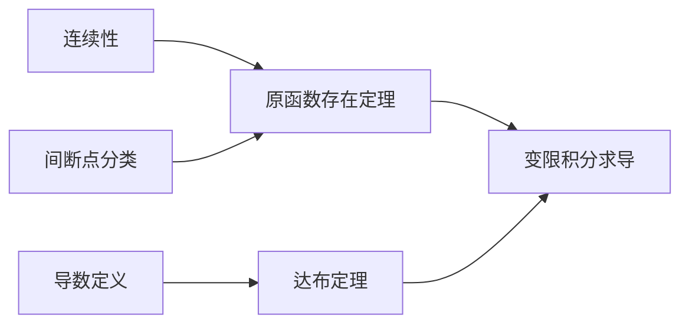

# 原函数存在定理

## 🎯 核心要点速记

> [!abstract] 一句话概括
> **连续必有原函数，间断点定死生亡** —— 连续函数必有原函数；有第一类/无穷间断点的函数没有原函数。

| 问题 | 答案 |
|------|------|
| **什么函数必有原函数？** | 连续函数 |
| **什么函数一定没有原函数？** | 有第一类间断点或无穷间断点的函数 |
| **导函数有什么特殊性质？** | 有介值性（达布定理），不连续时只能振荡 |

---

## 📌 知识点定位

**所属模块**：高数-一元函数积分学 > 不定积分
**重要程度**：⭐⭐⭐⭐
**考研要求**：理解原函数存在条件，掌握达布定理

---

## 📖 Part 1：原函数存在的充分条件

### 定理1：连续函数必有原函数

> [!theorem] 核心定理
> 若 $f(x)$ 在 $[a,b]$ 上**连续**，则函数
> $$F(x) = \int_a^x f(t)dt$$
> 在 $[a,b]$ 上可导，且 $F'(x) = f(x)$。

> [!success] 重要推论
> $$f(x) \text{ 连续} \Rightarrow \begin{cases} \displaystyle\int f(x)dx = \int_a^x f(t)dt + C \\ \\ \displaystyle\left[\int_a^x f(t)dt\right]' = f(x) \end{cases}$$
>
> **含义**：$\displaystyle\int_a^x f(t)dt$ 就是 $f(x)$ 的一个原函数！

---

> [!info] 证明思路（了解即可）
>
> 若 $x \in (a,b)$，取 $\Delta x$ 使 $x + \Delta x \in (a,b)$：
>
> $$\Delta F = F(x + \Delta x) - F(x) = \int_x^{x+\Delta x} f(t)dt$$
>
> 由**积分中值定理**：$\displaystyle\int_x^{x+\Delta x} f(t)dt = f(\xi)\Delta x$，其中 $\xi$ 介于 $x$ 与 $x + \Delta x$ 之间。
>
> 当 $\Delta x \to 0$ 时，$\xi \to x$，于是：
> $$\lim_{\Delta x \to 0} \frac{\Delta F}{\Delta x} = \lim_{\Delta x \to 0} f(\xi) = f(x)$$
>
> 即 $F'(x) = f(x)$。∎

---

## 🔴 Part 2：原函数不存在的情形

### 定理2：间断点与原函数

> [!danger] 核心结论
> **含有第一类间断点和无穷间断点的函数，在包含该间断点的区间内必没有原函数。**

### 证明核心技巧

> [!tip] 洛必达法则的妙用
> $$F'(x_0) = \lim_{x \to x_0} \frac{F(x) - F(x_0)}{x - x_0} \xlongequal{\text{洛必达}} \lim_{x \to x_0} F'(x)$$
>
> **关键**：当 $\displaystyle\lim_{x \to x_0} F'(x)$ 存在时，$F'(x_0)$ 必须等于这个极限值！

---

> [!example]- 详细证明（三种情况）
>
> 设 $F(x)$ 为 $f(x)$ 的原函数，则 $F'(x) = f(x)$。设 $x_0$ 为 $F'(x)$ 的间断点：
>
> **情况1：可去间断点（矛盾！）**
>
> 若 $\displaystyle\lim_{x\to x_0}F'(x) = A$，但 $A \neq F'(x_0)$。
>
> 然而：$F'(x_0) = \displaystyle\lim_{x \to x_0} \frac{F(x) - F(x_0)}{x - x_0} \xlongequal{\text{洛必达}} \lim_{x \to x_0} F'(x) = A$
>
> $\Rightarrow F'(x_0) = A$，与 $A \neq F'(x_0)$ **矛盾**！
>
> ---
>
> **情况2：跳跃间断点（矛盾！）**
>
> 若 $\displaystyle\lim_{x\to x_0^+}F'(x) = A_{+}$，$\displaystyle\lim_{x\to x_0^-}F'(x) = A_{-}$，但 $A_{+} \neq A_{-}$。
>
> 由于 $F(x)$ 处处可导，$F'_+(x_0) = F'_-(x_0)$，即：
> $$A_{+} = \lim_{x \to x_0^+} F'(x) = F'_+(x_0) = F'_-(x_0) = \lim_{x \to x_0^-} F'(x) = A_{-}$$
>
> 与 $A_{+} \neq A_{-}$ **矛盾**！
>
> ---
>
> **情况3：无穷间断点（矛盾！）**
>
> 若 $\displaystyle\lim_{x\to x_0}F'(x) = \infty$。
>
> 则 $F'(x_0) = \displaystyle\lim_{x \to x_0} \frac{F(x) - F(x_0)}{x - x_0} \xlongequal{\text{洛必达}} \lim_{x \to x_0} F'(x) = \infty$
>
> 但 $F'(x_0)$ 应该存在（有限值），**矛盾**！
>
> ---
>
> **结论**：导函数 $F'(x)$ 在区间内**必定没有第一类间断点和无穷间断点**。


---

## 🔵 Part 3：达布定理（导函数介值定理）

> [!theorem] 达布定理
> 设 $f(x)$ 在 $[a,b]$ 上可导，$u$ 为介于 $f'(a)$ 与 $f'(b)$ 之间的任意实数，则存在 $\xi \in (a,b)$，使得：
> $$f'(\xi) = u$$

### 核心含义

> [!important] 通俗理解
> **导函数可以不连续，但不能"跳过去"。**
>
> 若区间两端附近导数一边小于 $u$、另一边大于 $u$，中间一定存在某个点 $\xi$ 使得 $f'(\xi) = u$。

> [!info]- 证明（构造辅助函数法）
>
> 令 $F(x) = f(x) - ux$，则 $F'(x) = f'(x) - u$。
>
> 由于端点附近 $F'(x)$ 一正一负，即 $F(x)$ 在一端附近递减、另一端附近递增。
>
> 因此 $F(x)$ 在区间内部取得**极小值**。由费马引理，极值点 $\xi$ 处 $F'(\xi) = 0$。
>
> 即 $f'(\xi) = u$。∎

### 重要推论

> [!success] 非零导数必保号
> 若 $f'(x)$ 在区间内处处存在且 $f'(x) \neq 0$，则 $f'(x)$ **不可能时正时负**，只能恒正或恒负。
>
> **原因**：若一处 $f' < 0$、一处 $f' > 0$，由达布定理，中间必出现 $f'(\xi) = 0$，矛盾！

---

## 📊 Part 4：导函数性质总结（考试速记）

### 核心结论一览表

| # | 结论 | 公式 | 说明 |
|---|------|------|------|
| ① | **不一定连续** | $F$ 可导 $\not\Rightarrow$ $F'$ 连续 | 导函数可能不连续 |
| ② | **一定有介值性** | 达布定理 | 可以不连续，但不能"跳过去" |
| ③ | **只能振荡间断** | $F'$ 不连续 $\Rightarrow$ 振荡型 | 不能跳跃、不能可去 |
| ④ | **极限存在则连续** | $\displaystyle\lim_{x \to x_0} F'(x)$ 存在 $\Rightarrow$ $F'$ 连续 | 导函数特有性质 |
| ⑤ | **非零则单调** | $F' \neq 0$ $\Rightarrow$ $F$ 单调 | 介值性保证不变号 |

### 逻辑链条

```
F(x) 处处可导
    ↓
F'(x) 有介值性（达布定理）
    ↓
F'(x) 不能跳跃、不能可去
    ↓
F'(x) 不连续时只能振荡
```

```
F'(x) ≠ 0
    ↓
F'(x) 不变号（介值性）
    ↓
F(x) 单调
```

### 🎯 记忆口诀

> [!quote] 两大口诀
>
> | 口诀 | 含义 |
> |------|------|
> | **"导函数：可以抖，不能跳"** | 可以抖（不连续、振荡）；不能跳（无跳跃、无可去间断） |
> | **"不为零，不变号；导不零，原单调"** | $F' \neq 0$ $\Rightarrow$ 不变号 $\Rightarrow$ $F$ 单调 |

> [!summary] 一句话总结
> **导函数最重要的特征不是"连续"，而是"有介值性"。**
>
> 所以它可以不连续，但不能跳；只要不为 0，就不会变号，于是原函数必单调。

### 经典振荡模型速查表

> [!tip] 考研/竞赛最爱考的"振荡间断点 + 原函数存在"模型
> 这类函数的导函数在 $x=0$ 处有**振荡间断点**，但原函数**存在**。
>
> | 原函数 $F(x)$ | 导函数 $f(x) = F'(x)$ | $x=0$ 处的间断类型 |
> |--------------|----------------------|-------------------|
> | $x^2\sin\dfrac{1}{x^2}$ | $2x\sin\dfrac{1}{x^2} - \dfrac{2}{x}\cos\dfrac{1}{x^2}$ | 振荡（无界） |
> | $x^2\cos\dfrac{1}{x}$ | $2x\cos\dfrac{1}{x} + \sin\dfrac{1}{x}$ | 振荡（有界） |
> | $x^2\sin\dfrac{1}{x}$ | $2x\sin\dfrac{1}{x} - \cos\dfrac{1}{x}$ | 振荡（有界） |

---

## 📋 Part 5：易混淆概念辨析

### 对比表

| 对比项 | 一般函数 $f(x)$ | 导函数 $F'(x)$ |
|--------|----------------|----------------|
| 极限存在 $\Rightarrow$ 连续？ | ❌ 不一定 | ✅ 一定成立 |
| 不连续时的间断点类型 | 任意类型 | 只能是振荡型 |
| 是否有介值性 | 连续才有 | **一定有**（即使不连续） |

### 关键区别

> [!warning] 注意区分
>
> **对一般函数**：$\displaystyle\lim_{x \to x_0} f(x)$ 存在 $\nRightarrow$ $f(x_0) = \lim$
>
> **对导函数**：$\displaystyle\lim_{x \to x_0} F'(x)$ 存在 $\Rightarrow$ $F'(x_0) = \lim$（一定连续！）

---

## 🎯 Part 6：典型例题

### 例题：判断原函数存在性

> [!example] 判断下列函数在指定区间上是否有原函数
>
> 1. $f(x) = \text{sgn}(x)$，在 $[-1,1]$ 上
> 2. $f(x) = \begin{cases} 1, & x \geq 0 \\ 0, & x < 0 \end{cases}$，在 $[-1,1]$ 上

> [!success]- 答案与分析
>
> **分析**：两个函数在 $x=0$ 处都有**跳跃间断点**（第一类间断点）。
>
> **结论**：在包含 $x=0$ 的区间内**都没有原函数**。
>
> **理由**：由定理2，含有第一类间断点的函数在包含该点的区间内没有原函数。

---

## ⚠️ 易错点提醒

> [!danger] 三大易错点
>
> 1. **间断点类型判断**
>    - ❌ 错误：任何间断点都意味着原函数不存在
>    - ✅ 正确：只有**第一类间断点**和**无穷间断点**才能确定原函数不存在
>
> 2. **区间依赖性**
>    - 原函数存在性依赖于**具体区间**
>    - 同一函数在不同区间可能有不同的结论
>
> 3. **达布定理的理解**
>    - 导函数即使不连续也有介值性
>    - 间断点只能是第二类（振荡型）

---

## 🔗 知识关联



| 关联类型 | 内容 |
|----------|------|
| **前置知识** | 连续性、间断点分类、导数定义 |
| **相关定理** | 积分中值定理、达布定理、费马引理 |
| **应用场景** | 变限积分求导、判断原函数存在性 |

---

## 📚 练习建议

- [ ] 理解原函数存在定理的条件（连续 $\Rightarrow$ 有原函数）
- [ ] 掌握导函数间断点的特征（只能振荡）
- [ ] 了解达布定理的含义（导函数有介值性）
- [ ] 会判断给定函数是否有原函数

---

> [!personal] 个人笔记
> **做题警觉**：看到"原函数"三个字 → 立刻拉响连续性警报！
> - "原函数" = 处处可导 + 处处连续
> - 原函数必连续 → 分段函数求原函数时，分界点必须用连续性确定常数
> - 导函数不能有第一类间断点和无穷间断点 → 只能振荡
>
> **⚠️ 振荡间断点是"盲区"（2026-04-10 错题教训）**：
> - 第一类/无穷间断点 → 原函数**必不存在**，可以放心否定
> - 振荡间断点 → 原函数**可能存在**！不能靠连续性否定，要尝试构造 $F(x)$
> - 考研高频模型：$x^a\sin\frac{1}{x^b}$ 的导数，$x=0$ 处是振荡间断点，但原函数存在
> - 详见 [[错题本#错题07 原函数存在性判断振荡间断点是盲区]]
>
> **核心口诀**：**"一无穷，必没命；一振荡，看凑不凑"**

**创建日期**：2026-03-29
**最后更新**：2026-04-08
