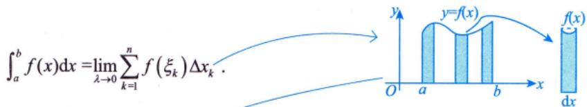

# 定积分定义

## 📌 知识点定位

**所属模块**：高数-一元函数积分学 > 定积分
**重要程度**：⭐⭐⭐⭐⭐
**考研要求**：了解定积分的概念（仅数学三），理解定积分的概念（数学一、数学二）

## 📖 定积分的定义

### 定义过程

设函数 $f(x)$ 在区间 $[a,b]$ 上有界：

1. **分割**：在 $[a,b]$ 中任意插入 $n-1$ 个分点
   $$a = x_0 < x_1 < x_2 < \cdots < x_{n-1} < x_n = b$$
   把区间 $[a,b]$ 分成 $n$ 个小区间
   $$[x_0, x_1], [x_1, x_2], \ldots, [x_{n-1}, x_n]$$
   各小区间的长度依次为
   $$\Delta x_1, \Delta x_2, \ldots, \Delta x_n$$

2. **取点**：在每个小区间 $[x_{i-1}, x_i]$ 上任取一点 $\xi_i$，作乘积
   $$f(\xi_i)\Delta x_i \quad (i=1,2,\ldots,n)$$

3. **求和**：作出和式
   $$S_n = \sum_{i=1}^n f(\xi_i)\Delta x_i$$

4. **取极限**：记 $\lambda = \max\{\Delta x_1, \Delta x_2, \ldots, \Delta x_n\}$，如果不论对 $[a,b]$ 怎样分法，也不论在小区间 $[x_{i-1}, x_i]$ 上点 $\xi_i$ 怎样取法，只要当 $\lambda \to 0$ 时，和 $S_n$ 总趋于确定的极限 $I$，则称这个极限 $I$ 为函数 $f(x)$ 在区间 $[a,b]$ 上的**定积分**，记作
   $$\int_a^b f(x)dx = \lim_{\lambda \to 0} \sum_{i=1}^n f(\xi_i)\Delta x_i$$

### 几何意义

定积分 $\int_a^b f(x)dx$ 在几何上表示：
- 当 $f(x) \geq 0$ 时：由曲线 $y = f(x)$、直线 $x = a$、$x = b$ 与 $x$ 轴所围成的**曲边梯形的面积**
- 当 $f(x) \leq 0$ 时：曲边梯形面积的**相反数**
- 一般情况：各部分面积的代数和

## 🔑 核心要点

### 定积分的实质

定积分是一个**数**（常数），不是函数！它与积分变量无关：
$$\int_a^b f(x)dx = \int_a^b f(t)dt = \int_a^b f(u)du$$

### 定积分与不定积分的区别

| 比较项 | 不定积分 $\int f(x)dx$ | 定积分 $\int_a^b f(x)dx$ |
|--------|------------------------|--------------------------|
| 本质 | 函数族（全体原函数） | 数值（面积） |
| 结果 | $F(x) + C$（含任意常数） | 具体数值 |
| 积分变量 | 有意义 | 无关（可替换） |

### 定积分存在条件

1. **充分条件**：若 $f(x)$ 在 $[a,b]$ 上**连续**，则 $f(x)$ 在 $[a,b]$ 上可积
2. **充分条件**：若 $f(x)$ 在 $[a,b]$ 上**有界**且只有**有限个间断点**，则 $f(x)$ 在 $[a,b]$ 上可积

## 📐 定积分的基本性质

### 1. 规定性质

$$\int_a^a f(x)dx = 0, \quad \int_a^b f(x)dx = -\int_b^a f(x)dx$$

### 2. 线性性质

$$\int_a^b [kf(x) \pm lg(x)]dx = k\int_a^b f(x)dx \pm l\int_a^b g(x)dx$$

### 3. 区间可加性

$$\int_a^b f(x)dx = \int_a^c f(x)dx + \int_c^b f(x)dx$$

### 4. 保号性

若 $f(x) \geq 0$，则 $\int_a^b f(x)dx \geq 0$（$a < b$）

### 5. 不等式性质

若 $f(x) \leq g(x)$，则 $\int_a^b f(x)dx \leq \int_a^b g(x)dx$（$a < b$）

## 🎯 典型例题

### 例题1：利用定积分定义求极限

求 $\lim_{n \to \infty} \frac{1}{n}\sum_{i=1}^n \frac{i}{n}$

**分析**：将其转化为定积分定义的形式

**解**：
$$\lim_{n \to \infty} \frac{1}{n}\sum_{i=1}^n \frac{i}{n} = \int_0^1 x dx = \left.\frac{x^2}{2}\right|_0^1 = \frac{1}{2}$$

### 例题2：定积分的几何意义

求 $\int_{-1}^1 \sqrt{1-x^2}dx$

**分析**：这是单位圆上半圆的面积

**解**：
$$\int_{-1}^1 \sqrt{1-x^2}dx = \frac{\pi \cdot 1^2}{2} = \frac{\pi}{2}$$

## ⚠️ 易错点

1. **定积分是数**：不能把定积分当作函数处理
2. **积分变量无关**：$\int_a^b f(x)dx = \int_a^b f(t)dt$
3. **几何意义**：注意函数正负对面积的影响
4. **分割任意性**：定义中强调"不论怎样分法"

## 🔗 知识关联

- **前置知识**：极限、函数连续性
- **后续应用**：牛顿-莱布尼茨公式、变限积分
- **相关定理**：积分中值定理、微积分基本定理

## 📚 练习建议

1. 理解定积分的"分割-取点-求和-取极限"过程
2. 掌握定积分的几何意义
3. 熟练运用定积分的基本性质

---

> [!personal] 个人笔记
> 此处记录个人理解和笔记

**创建日期**：2026-03-29
**最后更新**：2026-03-29
