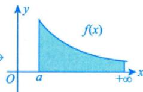
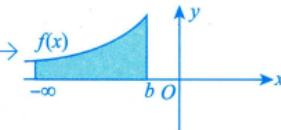
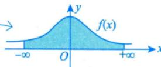
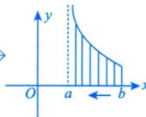
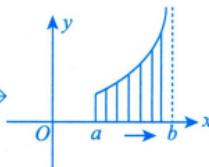
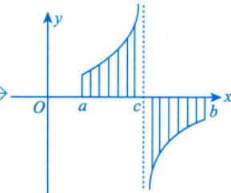

# 反常积分概念

## 📌 知识点定位

**所属模块**：高数-一元函数积分学 > 反常积分
**重要程度**：⭐⭐⭐⭐
**考研要求**：理解反常积分的概念，了解反常积分收敛的比较判别法

## 📖 反常积分的定义

反常积分（广义积分）是定积分的推广，分为两类：

### 第一类：无穷限反常积分（无穷积分）

#### 定义1：无穷区间上的积分

设函数 $f(x)$ 在 $[a, +\infty)$ 上连续，取 $t > a$，如果极限
$$\lim_{t \to +\infty} \int_a^t f(x)dx$$
存在，则称此极限为函数 $f(x)$ 在 $[a, +\infty)$ 上的**反常积分**，记作：
$$\int_a^{+\infty} f(x)dx = \lim_{t \to +\infty} \int_a^t f(x)dx$$

此时也称反常积分**收敛**；若极限不存在，则称反常积分**发散**。

#### 类似定义

$$\int_{-\infty}^b f(x)dx = \lim_{t \to -\infty} \int_t^b f(x)dx$$

$$\int_{-\infty}^{+\infty} f(x)dx = \int_{-\infty}^c f(x)dx + \int_c^{+\infty} f(x)dx$$

> [!warning] 注意
> $\int_{-\infty}^{+\infty} f(x)dx$ 收敛 $\Leftrightarrow$ $\int_{-\infty}^c f(x)dx$ 和 $\int_c^{+\infty} f(x)dx$ 都收敛

| $\int_a^{+\infty} f(x)dx$ | $\int_{-\infty}^b f(x)dx$ | $\int_{-\infty}^{+\infty} f(x)dx$ |
| :---: | :---: | :---: |
|  |  |  |
| 右端无穷 | 左端无穷 | 双端无穷 |

### 第二类：无界函数反常积分（瑕积分）

#### 定义2：无界函数的积分

设函数 $f(x)$ 在 $(a,b]$ 上连续，而在点 $a$ 的右邻域内无界，取 $\varepsilon > 0$，如果极限
$$\lim_{\varepsilon \to 0^+} \int_{a+\varepsilon}^b f(x)dx$$
存在，则称此极限为函数 $f(x)$ 在 $(a,b]$ 上的**反常积分**，记作：
$$\int_a^b f(x)dx = \lim_{\varepsilon \to 0^+} \int_{a+\varepsilon}^b f(x)dx$$

此时也称反常积分**收敛**；若极限不存在，则称反常积分**发散**。

| 瑕点在左端点 $a$ | 瑕点在右端点 $b$ | 瑕点在区间内部 $c$ |
| :---: | :---: | :---: |
|  |  |  |
| $\displaystyle\int_a^b f(x)dx = \lim_{\varepsilon \to 0^+} \int_{a+\varepsilon}^b f(x)dx$ | $\displaystyle\int_a^b f(x)dx = \lim_{\varepsilon \to 0^+} \int_a^{b-\varepsilon} f(x)dx$ | $\displaystyle\int_a^b f(x)dx = \lim_{\varepsilon_1 \to 0^+} \int_a^{c-\varepsilon_1} f(x)dx + \lim_{\varepsilon_2 \to 0^+} \int_{c+\varepsilon_2}^b f(x)dx$ |
| $x=a$ 处 $f(x) \to +\infty$ | $x=b$ 处 $f(x) \to +\infty$ | $x=c$ 处 $f(x)$ 无界（可能 $\pm\infty$） |
| 从右侧逼近瑕点 | 从左侧逼近瑕点 | 从左右两侧同时逼近瑕点 |

#### 瑕点

> [!note] 奇点概念
> 在反常积分中，一般把"∞"和瑕点**统称为奇点**。
>
> **判别前提**：在判别积分敛散性时，一个积分中**只能有一个奇点**；若出现两个及以上奇点，需**拆分**成多个只含一个奇点的积分分别判别。

函数 $f(x)$ 在某点附近无界，该点称为**瑕点**（奇点）。

常见瑕点：
- $x = a$：$\int_a^b f(x)dx$（$a$ 为瑕点）
- $x = b$：$\int_a^b f(x)dx$（$b$ 为瑕点）
- $x = c \in (a,b)$：$\int_a^b f(x)dx = \int_a^c f(x)dx + \int_c^b f(x)dx$（$c$ 为瑕点）

## 🔑 两类反常积分的对比

| 特征 | 第一类（无穷积分） | 第二类（瑕积分） |
|------|-------------------|------------------|
| **积分区间** | 无穷区间 $[a,+\infty)$ 等 | 有限区间 $[a,b]$ |
| **函数特点** | 有界函数 | 在瑕点处无界 |
| **发散原因** | 积分限趋于无穷 | 函数在瑕点处"爆炸" |
| **定义方式** | $\lim_{t \to \pm\infty}$ | $\lim_{\varepsilon \to 0^+}$ |
| **典型形式** | $\int_1^{+\infty} \frac{1}{x^p}dx$ | $\int_0^1 \frac{1}{x^p}dx$ |
| **p-积分收敛条件** | $p > 1$ | $p < 1$ |
| **几何意义** | 无界区域的面积 | 函数值无限处的面积 |

## 📐 常见反常积分

### 1. p-积分（无穷区间）

$$\int_1^{+\infty} \frac{1}{x^p}dx \begin{cases} \text{收敛}, & p > 1 \\ \text{发散}, & p \leq 1 \end{cases}$$

### 2. p-积分（无界函数）

$$\int_0^1 \frac{1}{x^p}dx \begin{cases} \text{收敛}, & p < 1 \\ \text{发散}, & p \geq 1 \end{cases}$$

### 3. 重要结论

$$\int_{-\infty}^{+\infty} e^{-x^2}dx = \sqrt{\pi}$$

$$\int_0^{+\infty} \frac{\sin x}{x}dx = \frac{\pi}{2}$$

## 🎯 典型例题

### 例题1：判断无穷积分的敛散性

判断 $\int_1^{+\infty} \frac{1}{x^2}dx$ 的敛散性。

**解**：
$$\int_1^{+\infty} \frac{1}{x^2}dx = \lim_{t \to +\infty} \int_1^t \frac{1}{x^2}dx = \lim_{t \to +\infty} \left[-\frac{1}{x}\right]_1^t = \lim_{t \to +\infty} \left(1 - \frac{1}{t}\right) = 1$$

故该积分收敛，值为 $1$。

### 例题2：判断瑕积分的敛散性

判断 $\int_0^1 \frac{1}{\sqrt{x}}dx$ 的敛散性。

**分析**：$x=0$ 是瑕点。

**解**：
$$\int_0^1 \frac{1}{\sqrt{x}}dx = \lim_{\varepsilon \to 0^+} \int_\varepsilon^1 \frac{1}{\sqrt{x}}dx = \lim_{\varepsilon \to 0^+} [2\sqrt{x}]_\varepsilon^1 = \lim_{\varepsilon \to 0^+} (2 - 2\sqrt{\varepsilon}) = 2$$

故该积分收敛，值为 $2$。

### 例题3：混合类型

判断 $\int_0^{+\infty} \frac{1}{x(1+x)}dx$ 的敛散性。

**分析**：
- $x=0$ 是瑕点（第二类）
- $x \to +\infty$ 是无穷区间（第一类）

**解**：需要拆分为两部分：
$$\int_0^{+\infty} \frac{1}{x(1+x)}dx = \int_0^1 \frac{1}{x(1+x)}dx + \int_1^{+\infty} \frac{1}{x(1+x)}dx$$

第一部分（瑕积分）：
$$\int_0^1 \frac{1}{x(1+x)}dx \sim \int_0^1 \frac{1}{x}dx \quad \text{（发散）}$$

故原积分发散。

## 🔍 反常积分与定积分的区别

| 比较项 | 定积分 | 反常积分 |
|--------|--------|----------|
| **积分区间** | 有限闭区间 $[a,b]$ | 无穷区间或含瑕点 |
| **函数要求** | 有界 | 可以无界 |
| **结果** | 一定存在（可积时） | 可能收敛或发散 |
| **计算方法** | 直接用牛顿-莱布尼茨公式 | 先求定积分再取极限 |
| **记号** | $\int_a^b f(x)dx$ | $\int_a^{+\infty} f(x)dx$ 等 |
| **几何意义** | 曲边梯形面积 | 无界区域面积（可能有限） |

## ⚠️ 易错点

1. **忽视瑕点**：$\int_{-1}^1 \frac{1}{x^2}dx$ 不能直接用牛顿-莱布尼茨公式（$x=0$ 是瑕点）
2. **双重反常**：$\int_0^{+\infty} f(x)dx$ 可能同时是两类反常积分
3. **敛散性判断**：必须两部分都收敛才收敛
4. **对称区间**：$\int_{-\infty}^{+\infty} f(x)dx \neq 2\int_0^{+\infty} f(x)dx$

## 🔗 知识关联

- **前置知识**：定积分、极限、无穷级数
- **后续应用**：概率论、物理学中的应用
- **相关概念**：无穷级数、瑕点判别

## 📚 练习建议

1. 熟练掌握两类反常积分的定义
2. 记住 p-积分的敛散性结论
3. 注意识别隐藏的瑕点

---

> [!personal] 个人笔记
> 此处记录个人理解和笔记

**创建日期**：2026-03-29
**最后更新**：2026-03-29
