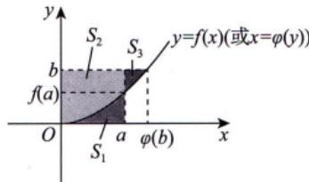
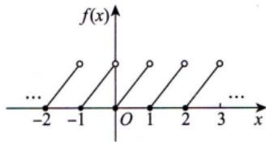

# 高数-一元函数积分学 · 错题本

> [!info] 本模块错题索引
>
> ## 📂 按知识点分类
>
> ### 🔢 反常积分/敛散性判别
>
> | 序号 | 错题标题 | 核心陷阱 | 难度 | 关联 |
> |------|----------|----------|:----:|------|
> | [01](#错题01反常积分的敛散性判别多点必拆原则) | 反常积分的敛散性判别：多点必拆原则 | 误认为无穷限是瑕点；忘记拆分多点反常积分 | ⭐⭐⭐ | — |
> | [17](#错题17反常积分发散判别加减法中严禁滥用等价无穷小) | 反常积分发散判别：加减法中严禁滥用等价无穷小 | 滥用等价无穷小；拆成两个发散积分误判收敛；$f(x)\to0$ 不是收敛充分条件 | ⭐⭐⭐ | [[错题01]] |
> | [30](#错题30反常积分含绝对值配方秒套公式vs三角换元硬算) | 反常积分含绝对值：配方秒套公式 vs 三角换元硬算 | 内部瑕点拆分正确但三角换元计算量过大导致中断；未秒套 $\arcsin$/$\ln$ 公式 | ⭐⭐⭐ | [[错题01]] [[错题17]] |
> | [31](#错题31反常积分幂函数与指数乘积分部积分递推法与γ函数秒杀) | 反常积分幂函数与指数乘积：分部积分递推法与Γ函数秒杀 | 对抽象 $n$ 用表格法导致符号混乱；不知道Γ函数定义可秒杀 | ⭐⭐⭐ | [[错题01]] |
> | [32](#错题32分段函数反常积分换元净化指数γ函数第二形态秒杀) | 分段函数反常积分：换元净化指数+Γ函数第二形态秒杀 | 官方答案凑 $(x/a)^{2\cdot5/2-1}$ 极易出错；未优先换元化简指数再套公式 | ⭐⭐⭐ | [[错题31]] |
> | [57](#错题57反常积分敛散性双瑕点区间拆分与等价放缩判别) | 反常积分敛散性——双瑕点区间拆分与等价放缩判别 | 误认为 $\tan$ 项在 $x=1$ 永远不构成瑕点；双瑕点一整段强行等价放缩；右端点不换元平移直接判 | ⭐⭐⭐⭐ | [[错题01]] [[错题17]] |
>
> ### 🔢 定积分定义/极限与积分转化
>
> | 序号 | 错题标题 | 核心陷阱 | 难度 | 关联 |
> |------|----------|----------|:----:|------|
> | [02](#错题02极限与定积分的转化夹逼准则vs定积分定义) | 极限与定积分的转化：夹逼准则vs定积分定义 | 分不清何时用夹逼、何时用定积分定义 | ⭐⭐⭐ | — |
> | [15](#错题15含捣乱项的黎曼和极限局部求极限与夹逼准则) | 含捣乱项的黎曼和极限：局部求极限与夹逼准则 | 对通项局部提前求极限；未识别"异类项"需夹逼放缩 | ⭐⭐⭐ | [[错题02]] |
> | [54](#错题54黎曼和定义三匹配条件上看限定n盯外面凑δx验里面定ξk) | 黎曼和定义"三匹配"条件：上看限定 $N$、盯外面凑 $\Delta x$、验里面定 $\xi_k$ | 误认为 $\xi_k$ 必须是右端点 $\frac{k}{N}$；上限定 $N$ 与外面乘积项 $\Delta x$ 不匹配（缩水/膨胀） | ⭐⭐⭐ | [[错题02]] [[错题15]] |
> | [83](#错题83分部积分剥离主体xn放缩夹逼证余项趋于零) | $\int_0^1 (n+1)x^n\ln(1+x)dx$：分部积分剥离主体 $\ln2$，放缩 $x^{n+1}/(1+x) \le x^{n+1}$ 夹逼 | 直接用"$x^n \to 0$ 先求极限再积分"（未证一致收敛）；放缩时误放缩分子 $x^{n+1}$ 而非分母 $1/(1+x)$；未识别 $(n+1)x^n = d(x^{n+1})$ 的凑微分信号 | ⭐⭐⭐⭐ | — |
>
> ### 🔢 变限积分求导/几何应用
>
> | 序号 | 错题标题 | 核心陷阱 | 难度 | 关联 |
> |------|----------|----------|:----:|------|
> | [03](#错题03变限积分求导与法线惯性思维导致多求一次导) | 变限积分求导与法线：惯性思维导致多求一次导 | 求出一阶导后惯性再求导；混淆 $e^{\sin^2 x}$ 与 $(e^{\sin x})^2$ | ⭐⭐ | — |
> | [09](#错题09变限积分与函数差值积分相等函数不等的逻辑陷阱) | 变限积分与函数差值：积分相等≠函数相等的逻辑陷阱 | 积分相等 $\nRightarrow$ 函数相等；以特例代一般 | ⭐⭐⭐ | — |
> | [16](#错题16取整函数变上限积分的左右导数跳跃间断点定理秒杀) | 取整函数变上限积分的左右导数：跳跃间断点定理秒杀 | 取整函数分段去括号错误；未用左右极限=左右导数定理 | ⭐⭐⭐ | [[错题13]] [[错题14]] |
> | [27](#错题27含绝对值积分泰勒展开提前取极限抹杀高阶项) | 含绝对值积分+泰勒展开：提前取极限抹杀高阶项 | $x\to0^+$ 时忽略 $t$ 穿越 $x$ 的分段；提前近似丢失 $x^2$ 项 | ⭐⭐⭐⭐ | [[错题06]] |
> | [28](#错题28变限积分换元清场极值第二充分条件) | 变限积分换元"清场"+极值第二充分条件 | $x$ 藏在 $f(x^2-t^2)$ 内部不会换元移出；不懂"哑变量"含义 | ⭐⭐⭐⭐ | [[错题06]] [[错题27]] |
> | [33](#错题33变限积分洛必达与1infty型极限判型不省略) | 变限积分+洛必达与 $1^\infty$ 型极限：判型不省略 | 省略 $\frac{\infty}{\infty}$ 判型分析；$1^\infty$ 快捷公式不熟 | ⭐⭐⭐ | — |
> | [43](#错题43变限积分方程换元剥离参变量与x0处的连续缝合) | 变限积分方程：换元剥离参变量与 $x=0$ 处的连续"缝合" | 换元除以 $x$ 和方程同除 $x$ 未声明 $x\neq0$；忘记用连续性验证 $x=0$ | ⭐⭐⭐⭐ | [[错题28]] [[错题06]] |
> | [44](#错题44含绝对值变限积分分段去绝对值后分界点必须用导数定义验证) | 含绝对值变限积分：分段去绝对值后分界点必须用导数定义验证 | 开区间公式直接套用到分界点"裸奔"；分段求导后未用左右导数定义验证拼接点 | ⭐⭐⭐⭐ | [[错题16]] [[错题13]] |
> | [68](#错题68变限积分定义的分段函数在分界点的求导与导函数连续性四步走标准模板题) | 变限积分定义的分段函数在分界点的求导与导函数连续性——"四步走"标准模板题 | 循环论证（直接代入公式算分界点导数）；挖不到 $f(0)=0$ 隐含条件；$\frac{f(x)}{x}$ 凑不出 $f'(0)$ | ⭐⭐⭐⭐ | [[错题03]] [[错题13]] [[错题14]] [[错题16]] [[错题44]] |
> | [74](#错题74变限积分的抽象凑微分先整体后局部) | 变限积分的抽象凑微分：先整体后局部 | 过早代入具体函数导致式子复杂化；算到 $\frac{\pi}{4}$ 忘记外面还有 $\arctan$ | ⭐⭐⭐ | [[错题03]] [[错题06]] |
>
> ### 🔢 定积分计算/换元与对称性
>
> | 序号 | 错题标题 | 核心陷阱 | 难度 | 关联 |
> |------|----------|----------|:----:|------|
> | [04](#错题04复合反三角函数化简与对称区间奇偶性) | 复合反三角函数化简与对称区间奇偶性 | 反三角嵌套化简；对称区间奇偶性优先意识；代数平移vs三角换元路线选择 | ⭐⭐⭐ | [[错题25]] |
> | [25](#错题25对称区间三角代换奇偶性砍半点火公式秒杀) | 对称区间三角代换：奇偶性砍半→点火公式秒杀 | 三角代换开根号绝对值陷阱；点火公式不熟 | ⭐⭐⭐ | [[错题04]] |
> | [26](#错题26区间再现公式消去x点火公式秒杀) | 区间再现公式消去 $x$ + 点火公式秒杀 | 区间再现公式不熟；点火公式前提条件忽略；$[0,\pi]$ 对称性折半 | ⭐⭐⭐ | [[错题25]] [[错题04]] |
> | [38](#错题38定积分跨越tanx瑕点牛顿莱布尼茨失效与区间劈开) | 定积分跨越 $tan x$ 瑕点：牛顿-莱布尼茨失效与区间劈开 | 原函数含 $tan x$ 未检查瑕点；错误换元 $t=sin x$ 跨象限符号失控；不拆段直接代入上下限 | ⭐⭐⭐⭐ | [[错题01]] |
> | [39](#错题39定积分超越积分分部积分抵消法积不出就找抵消) | 定积分超越积分：分部积分抵消法——"积不出就找抵消" | 拆分后孤立死磕超越积分；未识别 $\sqrt{\cos x}$ 与 $\frac{-\sin x}{\sqrt{\cos x}}$ 的导数关系；分部积分制造同构抵消 | ⭐⭐⭐⭐ | [[错题06]] [[错题22]] |
> | [40](#错题40定积分区间再现剥离x区间再现秒杀-vs-换元法推导双路径) | 定积分区间再现剥离 $x$：区间再现秒杀 vs 换元法推导双路径 | 强行分部积分产生超越积分死胡同；未识别 $[0,\pi]$ + $xf(\sin x)$ 题眼 | ⭐⭐⭐ | [[错题26]] [[错题04]] |
> | [41](#错题41对称区间奇偶剥离与非单调换元陷阱先折半后开偶次方) | 对称区间奇偶剥离与非单调换元陷阱：先折半后开偶次方 | $[-a,a]$ 上直接 $t=\sqrt[3]{x^2}$ 正负号双解崩溃；未利用奇偶性先化简；偶次换元前未折半 | ⭐⭐⭐⭐ | [[错题04]] [[错题25]] [[错题40]] |
> | [42](#错题42分段函数定积分加一减一-vs-共轭乘法策略选择与计算精度) | 分段函数定积分：加一减一 vs 共轭乘法——策略选择与计算精度 | 机械复制加一减一到 $\frac{1}{1+\sin x}$ 卡死；$\ln$ 化简负号分配律出错；未识别三角分式共轭乘法 | ⭐⭐⭐ | [[错题24]] |
> | [70](#错题70含绝对值积分的函数属性判定定义秒杀-vs-求导硬算双解法对比) | 含绝对值积分的函数属性判定——"定义秒杀 vs 求导硬算"双解法对比 | 上来就求导不先判奇偶（战术错误）；对 $\lvert x-t\rvert$ 直接求导未拆区间；下限求导漏负号；误以为"暗含 $f>0$" 选 A | ⭐⭐⭐ | [[错题04]] [[错题09]] [[错题29]] [[错题60]] |
> | [75](#错题75分部积分逆向嗅觉已知xy求int-ydx) | 分部积分逆向嗅觉：已知 $xy'$ 求 $\int y\,\mathrm{d}x$ | 暴力分离变量求 $y(x)$ 陷入计算泥潭；未识别 $xy'$ 是分部积分展开的天然产物；$\int_0^a\sqrt{a^2-x^2}\mathrm{d}x$ 未用几何意义秒算 | ⭐⭐⭐ | [[错题39]] [[错题06]] |
> | 序号 | 错题标题 | 核心陷阱 | 难度 | 关联 |
> |------|----------|----------|:----:|------|
> | [06](#错题06变限积分与分部积分不可求积先求导策略) | 变限积分与分部积分：不可求积先求导策略 | $\mathrm{e}^{-t^2}$ 不可求积→必须分部积分降维；凑微分 $\mathrm{d}(-x^4)$ | ⭐⭐⭐ | — |
>
> ### 🔢 周期函数积分性质
>
> | 序号 | 错题标题 | 核心陷阱 | 难度 | 关联 |
> |------|----------|----------|:----:|------|
> | [05](#错题05周期函数的积分性质拆分平移抵消证明套路) | 周期函数的积分性质：拆分→平移→抵消证明套路 | 区间拆分技巧；换元平移利用周期性；周期奇函数推论 | ⭐⭐⭐ | — |
> | [61](#错题61周期函数变限积分的性质周期积分黄金定律与结构分解定理) | 周期函数变限积分的性质：周期积分黄金定律与结构分解定理 | 忘记"周期函数在任意周期区间上的积分相等"；不会用 $F(x+T)-F(x)$ 验证周期性；不知道结构分解定理的秒杀应用 | ⭐⭐⭐⭐ | [[错题05]] [[周期函数性质]] |
> | [69](#错题69变限积分恒等式求周期积分求导识别周期的标准模板) | 变限积分恒等式求周期——"积分求导"识别周期的标准模板 | $\int_{x-3}^{4}$ 求导漏负号；复合求导漏 $\varphi'(x)$；拿到 $f(x+6) = f(x-3)$ 不换元直接写 $T$；忽略"不恒为常数"排除 $T=0$ | ⭐⭐⭐ | [[错题05]] [[错题33]] [[错题43]] [[错题61]] |
> | [84](#错题84取整函数小数部分的积分平均周期面积夹逼与洛必达禁用) | 取整函数小数部分的积分平均：周期面积 + 夹逼准则 | 把跳跃间断函数误套洛必达；夹逼时分子分母取界方向混乱；忘记每个周期面积为 $\frac{1}{2}$ | ⭐⭐⭐ | [[错题05]] [[错题16]] [[错题61]] |
>
> ### 🔢 原函数存在性/振荡间断点
>
> | 序号 | 错题标题 | 核心陷阱 | 难度 | 关联 |
> |------|----------|----------|:----:|------|
> | [07](#错题07原函数存在性判断振荡间断点是盲区) | 原函数存在性判断：振荡间断点是"盲区" | 不连续≠无原函数（振荡间断点可能存在）；极限计算把 $\sin\frac{1}{x}$ 误当无穷小 | ⭐⭐⭐⭐ | [[原函数存在定理]] |
>
> ### 🔢 奇偶函数原函数性质
>
> | 序号 | 错题标题 | 核心陷阱 | 难度 | 关联 |
> |------|----------|----------|:----:|------|
> | [60](#错题60奇偶函数原函数的性质变限积分统一表达与对称区间积分) | 奇偶函数原函数的性质：变限积分统一表达与对称区间积分 | 未用变限积分 $\int_a^x f(t)\mathrm{d}t$ 统一表达原函数；换元时忘记 $\mathrm{d}t = -\mathrm{d}u$；对称区间积分性质不熟 | ⭐⭐⭐ | [[微积分基本定理]] [[错题29]] |
>
> ### 🔢 定积分几何应用/面积与体积
>
> | 序号 | 错题标题 | 核心陷阱 | 难度 | 关联 |
> |------|----------|----------|:----:|------|
> | [08](#错题08反函数积分与定积分几何意义数形结合比大小) | 反函数积分与定积分几何意义：数形结合比大小 | 把 $x=\varphi(y)$ 画成关于 $y=x$ 的对称曲线；未读懂 $a<\varphi(b)$ 的几何含义 | ⭐⭐⭐ | [[反函数的导数]] |
> | [45](#错题45参数方程求面积三角函数完整周期积分性质与点火公式秒杀) | 参数方程求面积：三角函数完整周期积分性质与点火公式秒杀 | 未用周期性秒杀；半角降幂笨算而非对称性+点火公式；参数方程面积公式本质不熟 | ⭐⭐⭐ | [[错题26]] [[错题25]] |
> | [46](#错题46极坐标求面积双纽线存在域决定积分限第一象限-neq-0fracpi2) | 极坐标求面积：双纽线存在域决定积分限，第一象限 $\neq [0,\frac{\pi}{2}]$ | 见 $r^2$ 未先求存在域；主观臆断第一象限为 $[0,\frac{\pi}{2}]$；面积算出 $0$ 未警觉 | ⭐⭐⭐ | [[错题45]] |
> | [47](#错题47衰减振荡曲线面积分段积分取绝对值无穷等比级数求和) | 衰减振荡曲线面积：分段积分取绝对值+无穷等比级数求和 | 漏写绝对值致正负抵消；单拱积分后未识别等比数列模式；级数思维断层 | ⭐⭐⭐⭐ | [[错题46]] [[错题01]] |
> | [48](#错题48旋转体体积看边界选变量柱壳法反解x三角换元收尾) | 旋转体体积：看边界选变量——柱壳法反解 $x$ + 三角换元收尾 | 边界由水平线和 $y$ 轴卡死却用 $\mathrm{d}x$；不会柱壳法公式；$\sqrt{1-y^2}$ 未条件反射三角换元 | ⭐⭐⭐⭐ | [[错题46]] [[错题45]] |
> | [49](#错题49极坐标弧长正切换元变量域映射与绝对值去留) | 极坐标弧长：正切换元变量域映射与绝对值去留 | 把原变量范围错当新变量范围误判瑕点；不定积分求原函数策略合法性存疑；开平方绝对值去留需看新变量区间 | ⭐⭐⭐⭐ | [[错题19]] [[错题38]] |
> | [50](#错题50圆域绕x轴旋转积分区间混淆圆心坐标与半径) | 圆域绕x轴旋转：积分区间混淆圆心坐标与半径 | 混淆圆心纵坐标 $b$ 与半径 $k$ 作为 $x$ 投影边界；脱离图形定区间；$\sqrt{a^2-x^2}$ 未用几何意义速算 | ⭐⭐⭐ | [[错题48]] [[错题45]] |
> | [51](#错题51参数方程绕y轴旋转公式照写变量全换心法) | 参数方程绕y轴旋转："公式照写，变量全换"心法 | 参数方程误当极坐标；不会将 $t$ 代入体积公式；换微分漏 $x'(t)$ | ⭐⭐⭐ | [[错题45]] [[错题50]] |
> | [52](#错题52绕任意水平线旋转万能圆环法与找半径) | 绕任意水平线旋转："万能圆环法"与找半径 | 只会绕 $x$ 轴公式，旋转轴平移后大脑宕机；不理解公式中 $f(x)$ 是半径不是函数值 | ⭐⭐⭐ | [[错题50]] [[错题48]] |
> | [76](#错题76定积分几何应用裂项相消1infty型极限) | 定积分几何应用+裂项相消+$1^\infty$型极限 | 面积计算未判断上下边界导致负号错误；未识别裂项结构暴力求和；$1^\infty$型判型不严谨 | ⭐⭐⭐ | [[错题47]] [[错题33]] |
> | [77](#错题77绕斜线旋转体体积三种解法全掌握公式法微元法巴普斯定理) | 绕斜线旋转体体积：公式法/微元法/巴普斯定理三解法 | 绕斜线旋转不会选方法；绝对值去号判定遗漏；巴普斯定理中 $d$ 算成到坐标轴距离而非到旋转轴距离 | ⭐⭐⭐⭐ | [[错题52]] [[错题48]] |
>
> ### 🔢 定积分性质/积分不等式与保号性
>
> | 序号 | 错题标题 | 核心陷阱 | 难度 | 关联 |
> |------|----------|----------|:----:|------|
> | [10](#错题10非负连续函数积分大于零连续函数局部保号性) | 非负连续函数积分大于零：连续函数局部保号性 | 将"非负且不恒为0"误等价于"处处 $f(x)>0$"；单点大于0不产生面积 | ⭐⭐⭐ | — |
> | [11](#错题11积分值与常数比较无效放缩陷阱) | 积分值与常数比较：无效放缩陷阱 | 证"小于"却找下界；看到常数 $1$ 未联想到区间长度倒数 | ⭐⭐⭐ | — |
> | [12](#错题12复合三角函数积分比较外层单调性决定符号) | 复合三角函数积分比较：外层单调性决定符号 | 换元方向错误；忽略外层减函数会反转不等号 | ⭐⭐⭐ | — |
> | [13](#错题13变上限积分函数性质被积函数跳跃积分函数连续不可导) | 变上限积分函数性质：被积函数跳跃→积分函数连续不可导 | 硬算积分表达式而非定理秒杀；混淆 $f(x)$ 与 $F(x)$ 的间断点 | ⭐⭐⭐ | — |
> | [14](#错题14可去间断点不影响可导性极限存在即可导) | 可去间断点不影响可导性：极限存在即可导 | 误认为可去间断点→不可导；混淆 $F'(x_0)$ 与 $f(x_0)$ 的关系 | ⭐⭐⭐ | [[错题13]] |
> | [29](#错题29变限积分奇偶性判定内奇同外与积分下限陷阱) | 变限积分奇偶性判定：内奇同外与积分下限陷阱 | 复合函数奇偶性口诀不熟；忽略 $\int_{0}^{x}$ 下限为 0 才保证奇偶传递 | ⭐⭐⭐ | — |
> | [53](#错题53有界性证明放缩时机与衰减因子保护) | 有界性证明：放缩时机与衰减因子保护——不要过早把 $\mathrm{e}^{-ax}$ 放成 1 | 过早将衰减因子 $\mathrm{e}^{-ax}$ 放缩为 1，丢失与发散项 $\mathrm{e}^{at}$ 的对消机制；上界出现 $\mathrm{e}^{ax}$ 发散 | ⭐⭐⭐⭐ | — |
> | [55](#错题55定积分比较定理三积分比大小找桥梁泰勒放缩连环求导) | 定积分比较定理——三积分比大小：找桥梁、泰勒放缩、连环求导 | 被积函数处处小于 1 误以为累加能突破上界；不会构造 $g(x)=f(x)-1$ 用 $g''\to g'\to g$ 判号 | ⭐⭐⭐ | [[错题11]] [[错题53]] |
> | [56](#错题56定积分估值定理积不出函数秒杀与连环求导找最值) | 定积分估值定理——"积不出"函数秒杀与连环求导找最值 | 看到 $\frac{\sin x}{x}$ 就头铁凑微分；不知道用估值定理秒判范围；$f'(x)$ 分子看不出符号时不会拎出来当 $g(x)$ 单独判单调性 | ⭐⭐⭐ | [[错题55]] [[错题11]] |
> | [81](#错题81推广的积分中值定理构造辅助函数柯西中值定理与极限放缩) | 推广的积分中值定理：构造辅助函数+柯西中值定理证明，极限中 $\xi_n$ 的参变量依赖 | 中值点 $\xi$ 依赖于参数 $n$（变成 $\xi_n$），误将 $\xi_n$ 当常量直接求极限；放缩 $\mathrm{e}^{-x^n}$ 时未识别泰勒不等式 $\mathrm{e}^t > t$ 的取倒数技巧 | ⭐⭐⭐⭐⭐ | — |
> | [82](#错题82积分条件隐含第三点中值定理链条证二阶导数符号) | 积分条件隐含"第三点"：推广积分中值定理找第三点 $\to$ 罗尔/拉格朗日求 $f'$ $\to$ 再拉格朗日得 $f''$ 符号 | 不会从积分等式中"挖"出隐藏的第三点 $f(\eta)$；找到 $f(0)=f(\eta)$ 后未条件反射用罗尔定理；几何直观与代数推导脱节 | ⭐⭐⭐⭐⭐ | [[错题81]] |
> | [85](#错题85二阶导数控制积分两次分部积分构造权函数估值) | 二阶导数控制积分：两次分部积分构造权函数估值 | 只知道“用分部积分”但不知道权函数 $x(x-1)$ 的作用；漏掉边界项为 $0$ 的两个不同原因；估值时忘记 $\frac12\int_0^1 x(1-x)\mathrm{d}x=\frac{1}{12}$ | ⭐⭐⭐⭐ | [[错题34]] [[错题55]] [[错题56]] [[错题82]] |

> ### 🔢 不定积分/凑微分法
>
> | 序号 | 错题标题 | 核心陷阱 | 难度 | 关联 |
> |------|----------|----------|:----:|------|
> | [18](#错题18复杂指数函数不定积分导数敏感度与凑微分) | 复杂指数函数不定积分：导数敏感度与凑微分 | 复杂结构不敢下手；未优先检验指数部分的导数是否出现在表达式中 | ⭐⭐⭐ | — |
> | [58](#错题58不定积分凑微分法根式结构识别与arcsin公式秒杀) | 不定积分凑微分法：根式结构识别与arcsin公式秒杀 | 未识别 $\sqrt{x}\,\mathrm{d}x$ 可凑出 $\mathrm{d}(x^{3/2})$；看到 $\sqrt{4-x^3}$ 就想三角换元而非凑微分 | ⭐⭐⭐ | [[错题18]] |
>
> ### 🔢 不定积分/分部积分抵消法
>
> | 序号 | 错题标题 | 核心陷阱 | 难度 | 关联 |
> |------|----------|----------|:----:|------|
> | [22](#错题22指数三角混合不定积分三角恒等式配凑分部积分抵消法) | 指数三角混合不定积分：三角恒等式配凑+分部积分抵消法 | 不定积分忘记加 $+C$；未识别 $\tan^2x+1=\sec^2x$ 导数关系 | ⭐⭐ | — |
> | [34](#错题34抽象函数积分分部积分给导数降阶秒杀) | 抽象函数积分：分部积分给导数"降阶"秒杀 | 强行求 $f'(x)$ 再积分耗时易错；未用分部积分将导数转移给多项式 | ⭐⭐⭐ | — |
> | [36](#错题36arctanex凑负指数微分分部积分vs整体换元双解法) | $\frac{\arctan e^x}{e^x}$：凑负指数微分+分部积分 vs 整体换元双解法 | 未识别 $\frac{1}{e^x}\mathrm{d}x = -\mathrm{d}(e^{-x})$；$\int\frac{1}{1+e^{2x}}\mathrm{d}x$ 不会处理 | ⭐⭐⭐ | [[错题34]] [[错题35]] |
> | [59](#错题59不定积分根式代换整体换元分部积分秒杀) | 不定积分根式代换：整体换元+分部积分秒杀 | 未识别整体代换法适用于 $\sqrt{\mathrm{e}^x - a}$；换元后出现 $\ln$ 不会用分部积分 | ⭐⭐⭐ | [[错题19]] [[错题20]] |
> | [63](#错题63抽象函数原函数-求-fprimex-型积分-分部积分降维) | 抽象函数原函数 → 求 $f'(x)$ 型积分 · 分部积分"降维" | 硬算 $f'(x)$ 再积分耗时易错；未把"原函数"翻译为 $\int f(x)\mathrm{d}x = F(x)+C$ 留作弹药 | ⭐⭐⭐ | [[错题34]] |
> | [64](#错题64sec3x-不定积分循环积分原地打转即破题的标志题型) | $\sec^3 x$ 不定积分：循环积分"原地打转即破题"的标志题型 | 见到原积分以 $-I$ 形式重现误判为做错而放弃；不会用 $\tan^2 x = \sec^2 x - 1$ 触发循环 | ⭐⭐⭐ | [[错题20]] [[错题22]] [[错题35]] |
>
> ### 🔢 有理函数积分/部分分式拆分
>
> | 序号 | 错题标题 | 核心陷阱 | 难度 | 关联 |
> |------|----------|----------|:----:|------|
> | [23](#错题23有理真分式不定积分部分分式拆分赋值法vs比较系数法) | 有理真分式不定积分：部分分式拆分（赋值法vs比较系数法） | 比较系数法展开合并易算错正负号；赋值法选根技巧不熟 | ⭐⭐⭐ | — |
> | [24](#错题24有理真分式积分凑导数配方arctan公式条件反射) | 有理真分式积分：凑导数+配方→$\arctan$公式条件反射 | 面对无实根二次分母不确定处理方法；配方后忘系数 $\frac{1}{q}$ | ⭐⭐ | [[错题23]] |
>
> ### 🔢 不定积分/三角换元法
>
> | 序号 | 错题标题 | 核心陷阱 | 难度 | 关联 |
> |------|----------|----------|:----:|------|
> | [19](#错题19经典根式不定积分三角换元消根号与回代技巧) | 经典根式不定积分：三角换元消根号与回代技巧 | 换元忘换微分；三角函数回代困难；选用 $\cos$ 换元符号混淆 | ⭐⭐⭐ | — |
> | [20](#错题20三角换元分部积分综合题回代卡点与循环积分秒杀) | 三角换元+分部积分���合题：回代卡点与循环积分秒杀 | $\sin(\arctan x)$ 回代困难；$(1+x^2)^{3/2}$ 结构识别；循环积分公式不熟 | ⭐⭐⭐⭐ | [[错题19]] |
> | [35](#错题35arcsin根式根式换元-分部积分-三角代换三步拆解与回代) | $\arcsin\sqrt{\cdot}$：根式换元 + 分部积分 + 三角代换三步拆解与回代 | 凑项 $t^2=-(1-t^2)+1$ 写反；剩余 $(1-t^2)^{-3/2}$ 不会三角代换；回代 $\frac{a}{1-t^2}=a+x$ 算错 | ⭐⭐⭐⭐ | [[错题19]] [[错题20]] |
>
> ### 🔢 不定积分/分段函数与常数缝合
>
> | 序号 | 错题标题 | 核心陷阱 | 难度 | 关联 |
> |------|----------|----------|:----:|------|
> | [37](#错题37分段函数不定积分原函数连续性缝合常数) | 分段函数不定积分：原函数连续性"缝合"常数 | 各段独立积分后常数不统一；忘记用分界点连续性联立方程对齐常数 | ⭐⭐⭐ | — |
>
> ### 🔢 积分方程/积分号内常数的提取
>
> | 序号 | 错题标题 | 核心陷阱 | 难度 | 关联 |
> |------|----------|----------|:----:|------|
> | [62](#错题62积分方程积分号下的常数可提取双侧积分秒杀) | 积分方程：积分号下的常数可提取，双侧积分秒杀 | 未识别"积分号内出现的定积分 = 常数"；想硬解 $f(x)$ 而非两端同时积分 | ⭐⭐⭐ | — |
>
> ### 🔢 万能代换/Weierstrass 代换
>
> | 序号 | 错题标题 | 核心陷阱 | 难度 | 关联 |
> |------|----------|----------|:----:|------|
> | [65](#错题65含参变量-a-b-的三角分式不定积分万能代换--分类讨论) | 含参变量 $a, b$ 的三角分式不定积分：万能代换 + 分类讨论 | 二次项系数 $a-b$ 符号决定走 $\arctan$ 还是 $\ln$；情况三负号处理；常数项 $a+b>0$ 隐含前提；几何画图法推演公式 | ⭐⭐⭐⭐ | [[错题23]] [[错题24]] |
> | [67](#错题67含参变量-a0-的-absinx-型不定积分万能代换--配方--判别式分类与错题65-姐妹题) | 含参变量 $a>0$ 的 $a+b\sin x$ 型不定积分：万能代换 + 配方 + 判别式分类（与错题65 姐妹题） | $\sin$ 比 $\cos$ 多出交叉项 $2bt$，必须**先配方**再分类；强行凑 $u^2\pm 1$ 是大忌；分子系数 $2$ 全程跟踪；情况二 $a=b$ 易把 $\tan$ 印成 $\tan^2$ | ⭐⭐⭐⭐ | [[错题23]] [[错题24]] [[错题65]] |
>
> ### 🔢 奇次幂切余弦积分/剥离降幂
>
> | 序号 | 错题标题 | 核心陷阱 | 难度 | 关联 |
> |------|----------|----------|:----:|------|
> | [66](#错题66cot3x-不定积分巧法-vs-通法的典型碰撞技巧卡片级题目) | $\cot^3 x$ 不定积分："巧法 vs 通法"的典型碰撞（技巧卡片级题目） | $\csc^2 x\,dx = -d(\cot x)$ 负号处理；$\cot$ 配 $\csc^2$（负号）vs $\tan$ 配 $\sec^2$（正号）的方向；拿到两种形式答案不敢确认等价 | ⭐⭐ | [[错题22]] [[错题64]] |
>
> ### 🔢 Wallis 公式/华里士公式
>
> | 序号 | 错题标题 | 核心陷阱 | 难度 | 关联 |
> |------|----------|----------|:----:|------|
> | [71](#错题71华里士公式--1infty-型极限三角代换降维打击模板题极限步骤易出符号错) | 华里士公式 + $1^\infty$ 型极限——三角代换"降维打击"模板题（⚠️ 极限步骤易出符号错） | 提公因式 $I_n$ 时加法/减法搞反；$1^\infty$ 极限底数 $>1$ 还是 $<1$ 符号判断；原文错误 $e^3$ 写成 $e^{-3}$；华里士公式两方向记混 | ⭐⭐⭐ | [[错题18]] [[错题58]] [[错题65]] |
>
> ### 🔢 N-L 公式使用条件/跳跃间断点处理
>
> | 序号 | 错题标题 | 核心陷阱 | 难度 | 关联 |
> |------|----------|----------|:----:|------|
> | [72](#错题72导数积分的伪装奇偶性陷阱n-l-公式使用条件--跳跃间断点处理) | 导数积分的"伪装奇偶性"陷阱——N-L 公式使用条件 + 跳跃间断点处理 | 肌肉记忆启动"$\frac{1}{1+a^x}$ 奇偶积分"忽略外层 $'$ 符号；直接套 N-L 公式 $F(1)-F(-1) = -\frac{1}{3}$ 掉进陷阱；$2^{1/x}$ 单侧极限方向搞反；拆分后 $F(0)$ 仍按 0 代入（实际无定义） | ⭐⭐⭐ | [[错题13]] [[错题14]] [[错题16]] [[错题38]] |

---

## 错题01：反常积分的敛散性判别：多点必拆原则

> [!example] 反常积分的敛散性判别 ⚠️
> **题目**：设 $a > b > 0$，若反常积分 $I = \displaystyle\int_0^{+\infty}\frac{1}{x^a + x^b}\mathrm{d}x$ 收敛，则 $a, b$ 应满足（  ）。
>
> (A) $a > 1$ 且 $b > 1$      (B) $a > 1$ 且 $b < 1$      (C) $a < 1$ 且 $a + b > 1$      (D) $a < 1$ 且 $b < 1$

---

> [!personal] 我的卡点 & 错因分析 🧠
>
> **错误认知**：
>
> | 错误观点 | 实际情况 |
> |----------|----------|
> | 认为"因为 $x \to \infty$ 时被积函数趋于 0，所以 $+\infty$ 也是瑕点" | ❌ "瑕点"专指让函数值趋于无穷大的点（本题只有 $x=0$ 是瑕点） |
> | $+\infty$ 是瑕点 | ❌ $+\infty$ 只是一个无穷积分上限，不是瑕点 |
>
> **关键澄清**：
> > $x \to \infty$ 时被积函数趋于 $0$，恰恰是该无穷限积分能够收敛的**必要前提**，而不是因为那里有瑕点！

---

✅ **正确解法**：

**Step 1：识别反常点（哪里"不正常"？）**

本积分区间存在两个"不正常"的地方：
1. **$x \to 0^+$**：分母趋于 0，函数趋于无穷大 → **瑕点**
2. **$x \to +\infty$**：上限趋于无穷 → **无穷限**

**Step 2：多点必拆（黄金法则）**

> [!warning] ⚠️ 判别前提
> 所有敛散性判别法（比较判别法、等价无穷小等），其成立的前提都是**"积分区间内仅有一个反常点"**。
>
> **出现两个及以上反常点，必须拆分！否则判别法直接失效！**

在 $x=1$ 处拆开：
$$I = \underbrace{\int_{0}^{1} \frac{1}{x^a+x^b} \mathrm{d}x}_{I_1} + \underbrace{\int_{1}^{+\infty} \frac{1}{x^a+x^b} \mathrm{d}x}_{I_2}$$

**Step 3：分别判别**

**针对 $I_1$（瑕积分，$x \to 0^+$）**：

因 $a > b > 0$，当 $x \to 0$ 时，$x^b$ 比 $x^a$ 趋于 0 的速度**慢**（$x^a$ 更快趋于 0）。

所以 $x^a + x^b \sim x^b$（主导项是趋于 0 慢的那个）

被积函数 $\displaystyle\frac{1}{x^a+x^b} \sim \frac{1}{x^b}$

根据 $p$-积分结论，$\displaystyle\int_0^1 \frac{1}{x^p}\mathrm{d}x$ 收敛 $\iff p < 1$

**$I_1$ 收敛条件**：$b < 1$

---

**针对 $I_2$（无穷限积分，$x \to +\infty$）**：

因 $a > b > 0$，当 $x \to +\infty$ 时，$x^a$ 是**高阶无穷大**（趋于 $\infty$ 更快）。

所以 $x^a + x^b \sim x^a$（主导项是趋于 $\infty$ 快的那个）

被积函数 $\displaystyle\frac{1}{x^a+x^b} \sim \frac{1}{x^a}$

根据 $p$-积分结论，$\displaystyle\int_1^{+\infty} \frac{1}{x^p}\mathrm{d}x$ 收敛 $\iff p > 1$

**$I_2$ 收敛条件**：$a > 1$

---

**Step 4：综合结论**

只有当 $I_1$ 和 $I_2$ **同时收敛**时，原积分才收敛。

$$\boxed{a > 1 \text{ 且 } b < 1}$$

**正确答案**：**(B)**

---

> [!tip] 💡 归纳总结（避坑指南）
>
> ## 终极反思：敛散性判别"黄金法则"
>
> 为了统一思维模型，可将**无穷限（$\infty$）**和**瑕点**统称为**"反常点"**。
>
> ### 📋 常见必拆的 4 种形态清单
>
> | 形态 | 例子 | 反常点 | 拆法 |
> |------|------|--------|------|
> | **两头都是无穷大** | $\int_{-\infty}^{+\infty} f(x)\mathrm{d}x$ | $-\infty, +\infty$ | 在 $0$ 处拆开：$\int_{-\infty}^{0} + \int_{0}^{+\infty}$ |
> | **一头无穷，一头瑕点** | $\int_{0}^{+\infty} \frac{1}{x^a+x^b}\mathrm{d}x$ | $0, +\infty$ | 在 $1$ 处拆开：$\int_{0}^{1} + \int_{1}^{+\infty}$ |
> | **瑕点隐藏在区间内部** | $\int_{-1}^{1} \frac{1}{x}\mathrm{d}x$ | $x=0$ | 沿瑕点切开：$\int_{-1}^{0} + \int_{0}^{1}$ |
> | **区间两头都是瑕点** | $\int_{0}^{\pi} \frac{1}{\sin x}\mathrm{d}x$ | $x=0, x=\pi$ | 在 $\frac{\pi}{2}$ 处拆开：$\int_{0}^{\frac{\pi}{2}} + \int_{\frac{\pi}{2}}^{\pi}$ |
>
> ### 🔑 核心口诀
> > **"多点必拆，单点判别"**
>
> ### 📊 等价无穷小替换原则
>
> | 区域 | 主导项判定 | 原因 |
> |------|-----------|------|
> | $x \to 0^+$ | 趋于 0 **慢** 的项主导 | "慢者为王" |
> | $x \to +\infty$ | 趋于 $\infty$ **快** 的项主导 | "快者为王" |
>
> ### 📐 p-积分收敛条件速查
>
> | 积分类型 | 形式 | 收敛条件 |
> |----------|------|----------|
> | 瑕积分（下限为 0） | $\int_0^1 \frac{1}{x^p}\mathrm{d}x$ | $p < 1$ |
> | 无穷限积分 | $\int_1^{+\infty} \frac{1}{x^p}\mathrm{d}x$ | $p > 1$ |

---

**关联知识点**：[[反常积分]]、[[比较判别法]]、[[等价无穷小替换]]、[[p-积分]]

---

## 错题02：极限与定积分的转化：夹逼准则vs定积分定义

> [!example] 例9.12 ⚠️
> **题目**：求 $\displaystyle\lim_{n\to \infty}\frac{1}{n}\sum_{i = 1}^{n}\left[\ln (3n - 2i) - \ln (n + 2i)\right] = \underline{\quad}$

---

> [!personal] 我的卡点 & 错因分析 🧠
>
> **核心困惑**：看到 $\displaystyle\lim_{n\to \infty}\sum_{i=1}^{n}$ 的结构，**不知道该用夹逼准则还是定积分定义**。
>
> **关键判断标准**：
>
> | 方法 | 适用标志 | 原因 |
> |------|----------|------|
> | **夹逼准则** | 无法提取公因子 $\frac{1}{n}$，难以凑成 $f(\frac{i}{n})$ | 无法转化为定积分形式 |
> | **定积分定义** | 可提取 $\frac{1}{n}$，剩余部分能化为 $f(\frac{i}{n})$ | 完美匹配黎曼和结构 |

---

> [!warning] 为什么夹逼准则行不通？
>
> 通项是 $\displaystyle\frac{1}{n} \ln \frac{3n - 2i}{n + 2i}$，函数值随 $i$ 单调递减。
>
> **放缩尝试**：
> - 最大项（$i=1$）：$\displaystyle\frac{1}{n} \ln \frac{3n - 2}{n + 2}$
> - 最小项（$i=n$）：$\displaystyle\frac{1}{n} \ln \frac{n}{3n} = \frac{1}{n} \ln \frac{1}{3}$
>
> 由 $n \cdot (\text{最小项}) \le \sum \le n \cdot (\text{最大项})$ 得：
> $$\ln \frac{1}{3} \le \text{原式} \le \ln 3$$
>
> **两边极限不相等（$\ln\frac{1}{3} \neq \ln 3$），夹逼准则失效！**

---

✅ **正确解法一：官方的"奇函数巧妙法"**

**Step 1：构造定积分**

原极限：
$$\lim_{n\to \infty}\frac{1}{n}\sum_{i = 1}^{n}\ln \frac{3n - 2i}{n + 2i}$$

分子分母同除以 $n$，凑出 $\frac{i}{n}$：
$$= \lim_{n\to \infty}\frac{1}{n}\sum_{i = 1}^{n}\ln \frac{3 - 2\left(\frac{i}{n}\right)}{1 + 2\left(\frac{i}{n}\right)}$$

根据定积分定义 $\displaystyle\lim_{n \to \infty} \sum_{i=1}^n f\left(\frac{i}{n}\right) \frac{1}{n} = \int_0^1 f(x) \mathrm{d}x$：
$$= \int_{0}^{1} \ln \frac{3 - 2x}{1 + 2x} \mathrm{d}x$$

**Step 2：利用奇偶性计算**

将积分区间平移为对称区间，令 $t = x - \frac{1}{2}$（即 $x = t + \frac{1}{2}$）：
- 分子：$\frac{3}{2} - x = \frac{3}{2} - (t + \frac{1}{2}) = 1 - t$
- 分母：$\frac{1}{2} + x = \frac{1}{2} + (t + \frac{1}{2}) = 1 + t$

$$\int_{-\frac{1}{2}}^{\frac{1}{2}} \ln \frac{1 - t}{1 + t} \mathrm{d}t$$

验证被积函数 $f(t) = \ln \frac{1-t}{1+t}$ 的奇偶性：
$$f(-t) = \ln \frac{1+t}{1-t} = \ln \left( \frac{1-t}{1+t} \right)^{-1} = -\ln \frac{1-t}{1+t} = -f(t)$$

**这是奇函数！在对称区间 $[-\frac{1}{2}, \frac{1}{2}]$ 上积分 = 0**

$$\boxed{0}$$

---

✅ **正确解法二：暴力换元法（考试更实用）**

从定积分 $\displaystyle\int_{0}^{1} \ln \frac{3 - 2x}{1 + 2x} \mathrm{d}x$ 接手：

**拆成两个积分**：
$$= \int_{0}^{1} \ln (3 - 2x) \mathrm{d}x - \int_{0}^{1} \ln (1 + 2x) \mathrm{d}x$$

**第一个积分**：令 $u = 3 - 2x$，$\mathrm{d}x = -\frac{1}{2}\mathrm{d}u$
$$\int_{0}^{1} \ln (3 - 2x) \mathrm{d}x = \frac{1}{2}\int_{1}^{3} \ln u \mathrm{d}u$$

**第二个积分**：令 $v = 1 + 2x$，$\mathrm{d}x = \frac{1}{2}\mathrm{d}v$
$$\int_{0}^{1} \ln (1 + 2x) \mathrm{d}x = \frac{1}{2}\int_{1}^{3} \ln v \mathrm{d}v$$

**两个积分完全相同，相减得 0**：
$$\frac{1}{2}\int_{1}^{3} \ln u \mathrm{d}u - \frac{1}{2}\int_{1}^{3} \ln v \mathrm{d}v = 0$$

---

> [!tip] 💡 归纳总结（避坑指南）
>
> ## 定积分的本质理解
>
> 定积分是"分割、近似、求和、取极限"的过程：
>
> | 步骤 | 操作 | 对应关系 |
> |------|------|----------|
> | 分割 | 区间分 $n$ 等份 | $\Delta x = \frac{1}{n}$ → $\mathrm{d}x$ |
> | 取点 | 第 $i$ 个右端点 | $x_i = \frac{i}{n}$ → $x$ |
> | 求和 | 黎曼和 | $\sum f(\frac{i}{n}) \cdot \frac{1}{n}$ |
> | 极限 | $n \to \infty$ | $\int_0^1 f(x)\mathrm{d}x$ |
>
> ### 🔑 判断口诀
> > **"能提 1/n 凑 i/n，定积分定义最标准"**
> > **"放大缩小两头跑，极限不等夹逼倒"**
>
> ### 📋 奇偶性积分速查
>
> | 函数类型 | 对称区间积分结果 |
> |----------|------------------|
> | 奇函数 $f(-x) = -f(x)$ | $\displaystyle\int_{-a}^{a} f(x)\mathrm{d}x = 0$ |
> | 偶函数 $f(-x) = f(x)$ | $\displaystyle\int_{-a}^{a} f(x)\mathrm{d}x = 2\int_{0}^{a} f(x)\mathrm{d}x$ |

---

**关联知识点**：[[定积分定义]]、[[夹逼准则]]、[[奇偶性]]、[[定积分换元法]]

---

## 错题03：变限积分求导与法线：惯性思维导致多求一次导

> [!example] 变限积分求导与法线 ⚠️
> **题目**：曲线 $y = \displaystyle\int_{0}^{\sin x} e^{t^{2}} \, \mathrm{d}t$ 在点 $(0,0)$ 处的法线方程为（  ）。
>
> (A) $y = \frac{1}{2} x$      (B) $y = -\frac{1}{2} x$      (C) $y = x$      (D) $y = -x$

---

> [!personal] 我的卡点 & 错因分析 🧠
>
> **错误现象**：误选了 **(B)**
>
> **错误过程**：
> 1. ✅ 第一步正确求出 $y' = e^{\sin^2 x} \cdot \cos x$
> 2. ❌ **惯性思维作祟**：将已求出的一阶导再次求导，算成了二阶导数 $y''$
> 3. ❌ **符号混淆**：将 $e^{\sin^2 x}$ 记作 $(e^{\sin x})^2$，虽然 $x=0$ 时数值相等，但导致复合函数求导逻辑混乱
> 4. ❌ 最终代入 $x=0$ 算得斜率为 $2$（完全错误）
>
> **核心错因总结**：
>
> | 错误类型 | 具体表现 |
> |----------|----------|
> | **惯性思维** | 看到"求导"就不自觉地多求一次 |
> | **符号混淆** | $e^{\sin^2 x} \neq (e^{\sin x})^2$（前者是 $e^{(\sin x)^2}$，后者是 $(e^{\sin x})^2$） |
> | **目标不清** | 求切线/法线只需要一阶导 $y'$，不需要二阶导 $y''$ |

---

✅ **正确解法**

**Step 1：变限积分求导**

$$y = \int_{0}^{\sin x} e^{t^2} \mathrm{d}t$$

应用变限积分求导公式：若 $F(x) = \int_{a}^{\psi(x)} f(t) \mathrm{d}t$，则 $F'(x) = f[\psi(x)] \cdot \psi'(x)$

$$y' = e^{(\sin x)^2} \cdot (\sin x)' = e^{\sin^2 x} \cos x$$

**Step 2：求特定点切线斜率**

代入 $x = 0$：
$$k_{切} = y'|_{x=0} = e^0 \cdot \cos 0 = 1 \cdot 1 = 1$$

**Step 3：法线斜率**

$$k_{法} = -\frac{1}{k_{切}} = -1$$

**Step 4：写法线方程**

点 $(0, 0)$，斜率 $-1$：
$$y - 0 = -1(x - 0) \implies y = -x$$

$$\boxed{y = -x}$$

**正确答案**：**(D)**

---

> [!tip] 💡 归纳总结（避坑指南）
>
> ## 变限积分求导法则
>
> 若函数 $F(x) = \int_{a}^{\psi(x)} f(t) \mathrm{d}t$，其中 $f(t)$ 连续，$\psi(x)$ 可导，则：
> $$F'(x) = f[\psi(x)] \cdot \psi'(x)$$
>
> ### 🔑 考研避坑指南
>
> | 陷阱 | 正确做法 |
> |------|----------|
> | **一步到位** | 应用公式后，结果即为**一阶导数 $y'$**，除非题目明确要求二阶导或极值点分析，否则**严禁二次求导** |
> | **代入即求** | 求切线/法线时，算出 $y'$ 后应**立即代入坐标点**，不要进行不必要的化简，防止出错 |
> | **符号辨析** | $e^{\sin^2 x} = e^{(\sin x)^2}$，与 $(e^{\sin x})^2 = e^{2\sin x}$ **完全不同**！ |
>
> ### 📋 切线与法线速查
>
> | 项目 | 公式 |
> |------|------|
> | 切线斜率 | $k_{切} = y'|_{x=x_0}$ |
> | 法线斜率 | $k_{法} = -\dfrac{1}{k_{切}}$（切线斜率的**负倒数**） |
> | 切线方程 | $y - y_0 = k_{切}(x - x_0)$ |
> | 法线方程 | $y - y_0 = k_{法}(x - x_0)$ |
>
> ### ⚠️ 特别注意
> > **求切线/法线问题，永远只需要一阶导！**
> > 只有求拐点、极值点判定（用二阶导判凹凸）时才需要 $y''$

---

**关联知识点**：[[变限积分求导]]、[[切线与法线]]、[[复合函数求导]]

---

## 错题04：复合反三角函数化简与对称区间奇偶性

> [!example] 复杂根式与反三角函数的定积分
> **题目**：计算定积分 $I = \displaystyle\int_0^1 x \arcsin \sqrt{4x - 4x^2} \, \mathrm{d}x$

---

## 🧠 核心技巧速查

| 技巧 | 本题作用 |
|------|----------|
| **无理式配方与三角换元** | 利用 $\sqrt{1-u^2}$ 型构造，化简根式并重构积分区间 |
| **对称区间的奇偶性** | 将区间化为 $[-a, a]$ 后，利用被积函数的奇偶性快速消项 |
| **区间再现公式** | $\int_a^b f(x)\mathrm{d}x = \int_a^b f(a+b-x)\mathrm{d}x$，通过余角关系化简复合反三角函数 |
| **分部积分法** | 解决"幂函数 $\times$ 三角函数"的标准收尾工具 |

---

## 🔍 思路分析（流程图）

```
观察根式 4x - 4x²
    │ ───> 配方为 1 - (2x - 1)²
    ▼
设 2x - 1 = sin t
    │ ───> 消根号，同时将区间 [0, 1] 变为对称区间 [-π/2, π/2]
    ▼
展开被积函数，利用奇偶性
    │ ───> 奇函数积分为 0，偶函数化为两倍的 [0, π/2] 积分
    ▼
面对 arcsin(cos t) 遇阻
    │ ───> 动用"区间再现"，利用 cos(π/2 - t) = sin t 完美摘掉反三角
    ▼
标准分部积分收尾
    │ ───> 得到最终精确答案
    ▼
答案：1/2
```

---

## 📝 详细解析

### 第一步：配方与三角换元（重构区间）

首先关注根号内部的二次多项式，进行配方：

$$4x - 4x^2 = 1 - (4x^2 - 4x + 1) = 1 - (2x - 1)^2$$

令 $2x - 1 = \sin t$，则：

$$x = \frac{1}{2}(\sin t + 1), \quad \mathrm{d}x = \frac{1}{2}\cos t \, \mathrm{d}t$$

更换积分上下限：
- 当 $x = 0$ 时，$2x - 1 = -1 \implies t = -\dfrac{\pi}{2}$
- 当 $x = 1$ 时，$2x - 1 = 1 \implies t = \dfrac{\pi}{2}$

此时根式部分化简为：$\sqrt{1 - \sin^2 t} = \lvert\cos t\rvert$。因为 $t \in [-\frac{\pi}{2}, \frac{\pi}{2}]$，此时 $\cos t \ge 0$，故 $\sqrt{4x - 4x^2} = \cos t$。

将上述结果代入原积分 $I$：

$$I = \int_{-\frac{\pi}{2}}^{\frac{\pi}{2}} \frac{1}{2}(\sin t + 1) \cdot \arcsin(\cos t) \cdot \frac{1}{2}\cos t \, \mathrm{d}t$$

$$I = \frac{1}{4} \int_{-\frac{\pi}{2}}^{\frac{\pi}{2}} (1 + \sin t)\cos t \arcsin(\cos t) \, \mathrm{d}t$$

### 第二步：利用奇偶性大幅化简

将被积函数拆开成两部分，利用对称区间 $[-\frac{\pi}{2}, \frac{\pi}{2}]$ 的性质进行分析：

$$I = \underbrace{\frac{1}{4} \int_{-\frac{\pi}{2}}^{\frac{\pi}{2}} \cos t \arcsin(\cos t) \, \mathrm{d}t}_{\text{项①}} + \underbrace{\frac{1}{4} \int_{-\frac{\pi}{2}}^{\frac{\pi}{2}} \sin t \cos t \arcsin(\cos t) \, \mathrm{d}t}_{\text{项②}}$$

**奇偶性分析**：

| 项 | 被积函数 | 奇偶性 | 理由 | 积分结果 |
|----|----------|--------|------|----------|
| 项① | $f_1(t) = \cos t \arcsin(\cos t)$ | **偶函数** | $\cos(-t) = \cos t$，$\arcsin(\cos t)$ 也是偶函数 | $2\int_0^{\pi/2}$ |
| 项② | $f_2(t) = \sin t \cos t \arcsin(\cos t)$ | **奇函数** | $\sin(-t) = -\sin t$，其余为偶 | $0$ |

根据定积分的对称区间性质，奇函数积分为 $0$，偶函数积分等于二倍的正半区间积分：

$$I = \frac{1}{4} \cdot 2 \int_{0}^{\frac{\pi}{2}} \cos t \arcsin(\cos t) \, \mathrm{d}t = \frac{1}{2} \int_{0}^{\frac{\pi}{2}} \cos t \arcsin(\cos t) \, \mathrm{d}t$$

### 第三步：巧用区间再现（化简反三角）

直接求解 $\int \cos t \arcsin(\cos t) \, \mathrm{d}t$ 较为困难。注意到积分区间为 $[0, \frac{\pi}{2}]$，运用**区间再现公式**，令 $t = \frac{\pi}{2} - u$，则 $\mathrm{d}t = -\mathrm{d}u$：

- 当 $t = 0 \implies u = \dfrac{\pi}{2}$
- 当 $t = \dfrac{\pi}{2} \implies u = 0$

代入积分式：

$$I = \frac{1}{2} \int_{\frac{\pi}{2}}^{0} \cos\left(\frac{\pi}{2} - u\right) \arcsin\left[\cos\left(\frac{\pi}{2} - u\right)\right] \, (-\mathrm{d}u)$$

$$I = \frac{1}{2} \int_{0}^{\frac{\pi}{2}} \sin u \arcsin(\sin u) \, \mathrm{d}u$$

因为在 $u \in [0, \frac{\pi}{2}]$ 范围内，$\arcsin(\sin u) = u$ 恒成立，因此积分式被完美脱去反三角外壳：

$$\boxed{I = \frac{1}{2} \int_{0}^{\frac{\pi}{2}} u \sin u \, \mathrm{d}u}$$

### 第四步：分部积分法收尾

对最终形式进行凑微分并运用分部积分：

$$I = \frac{1}{2} \int_{0}^{\frac{\pi}{2}} t \, \mathrm{d}(-\cos t)$$

$$I = \frac{1}{2} \left[ -t \cos t \Big|_{0}^{\frac{\pi}{2}} + \int_{0}^{\frac{\pi}{2}} \cos t \, \mathrm{d}t \right]$$

代入上下限计算：

- **边界项**：$\left(-\dfrac{\pi}{2} \cos\dfrac{\pi}{2}\right) - (-0 \cdot \cos 0) = 0 - 0 = 0$
- **积分项**：$\displaystyle\int_{0}^{\frac{\pi}{2}} \cos t \, \mathrm{d}t = \sin t \Big|_{0}^{\frac{\pi}{2}} = 1 - 0 = 1$

最终结果：

$$I = \frac{1}{2} \times (0 + 1) = \frac{1}{2}$$

---

> [!success] 答案：$\boxed{\dfrac{1}{2}}$

---

## ⚠️ 方法总结与警示

### 1. 区间意识

拿到定积分题目，**第一眼看区间，第二眼看被积函数**。本题通过三角换元化出 $[-a, a]$ 对称区间，是能够利用奇偶性进行"降维打击"的关键。

### 2. 反三角函数的处理惯例

若遇到 $\arcsin(\sin x)$ 或 $\arccos(\cos x)$，在**第一象限**可以直接等价于 $x$。本题中出现的 $\arcsin(\cos t)$ 无法直接脱钩，因此利用**区间再现公式**进行余角转换，是这类题目的核心突破口。

### 3. 计算细节

分部积分时，注意 $\mathrm{d}(-\cos t)$ 抽出来的**负号不要漏掉**。代入上下限时，由于 $\cos\frac{\pi}{2}=0$ 和 $t=0$ 的双重作用，边界项刚好平稳归零，复习时需确保每一步符号的严密性。

---

**关联知识点**：[[反三角函数化简]]、[[奇偶对称性]]、[[定积分换元法]]、[[配方技巧]]、[[余角公式]]、[[区间再现公式]]、[[分部积分法]]、[[错题25]]

---
## 错题05：周期函数的积分性质：拆分→平移→抵消证明套路

> [!example] 例9.16 周期函数积分性质 ⚠️
> **题目**：证明若函数 $f(x)$ 是以 $T$ 为周期的连续函数，则对任意的实数 $a$，都有：
> $$\int_{a}^{a+T} f(x) \mathrm{d}x = \int_{0}^{T} f(x) \mathrm{d}x$$
>
> **注**：若函数 $f(x)$ 是连续且以 $T$ 为周期的奇函数，则 $\displaystyle\int_{0}^{T}f(x) \mathrm{d}x = 0$

---

> [!personal] 我的卡点 & 错因分析 🧠
>
> **核心难点**：
>
> | 难点类型 | 具体表现 |
> |----------|----------|
> | **拆分直觉** | 不知道从哪里下手拆分积分区间 |
> | **平移换元** | 换元时不知道为什么要平移一个周期 $T$ |
> | **抵消识别** | 看不出 $\int_{a}^{0}$ 和 $\int_{0}^{a}$ 的关系 |
>
> **关键洞察**：
> 这个定理的本质是"割补法"——你在右边多框进来的一块波浪，永远等于左边漏掉的那块波浪，因为图案是无限循环的！

---

✅ **正确解法（"拆分 → 平移 → 抵消"套路）**

**目标**：证明 $\displaystyle\int_{a}^{a+T} f(x) \mathrm{d}x = \int_{0}^{T} f(x) \mathrm{d}x$

**Step 1：强行拆分（为了凑出目标）**

利用积分的区间可加性，把 $[a, a+T]$ 这个区间强行劈成三段：

$$\int_{a}^{a+T} = \int_{a}^{0} + \int_{0}^{T} + \int_{T}^{a+T}$$

中间的 $\displaystyle\int_{0}^{T}$ 是我们想要的最终结果，保留不动。

**Step 2：平移区间（换元法）**

对第三项做换元，把积分区间从 $[T, a+T]$ 整体向左平移一个周期 $T$。

令 $t = x - T$（即 $x = t + T$），则 $\mathrm{d}x = \mathrm{d}t$：
- 当 $x = T$ 时，$t = 0$
- 当 $x = a + T$ 时，$t = a$

代入第三项：
$$\int_{T}^{a+T} f(x) \mathrm{d}x = \int_{0}^{a} f(t + T) \mathrm{d}t$$

**Step 3：利用周期性"卸妆"**

因为 $f(x)$ 是以 $T$ 为周期的，所以 $f(t + T) = f(t)$：

$$\int_{0}^{a} f(t + T) \mathrm{d}t = \int_{0}^{a} f(t) \mathrm{d}t$$

**Step 4：完美抵消**

把变身后的第三项放回第一步的式子：

$$\int_{a}^{a+T} = \underbrace{\int_{a}^{0}}_{-\int_{0}^{a}} + \int_{0}^{T} + \underbrace{\int_{0}^{a}}_{\text{平移后}}$$

因为 $\displaystyle\int_{a}^{0} = -\int_{0}^{a}$，第一项和第三项**完美相加为 0**！

$$\boxed{\int_{a}^{a+T} f(x) \mathrm{d}x = \int_{0}^{T} f(x) \mathrm{d}x}$$

---

> [!tip] 💡 重要推论（高频考点）
>
> 若函数 $f(x)$ 是**连续**且以 $T$ 为周期的**奇函数**，则：
> $$\int_{0}^{T} f(x) \mathrm{d}x = 0$$
>
> **证明思路**：
> 1. 根据上述定理，积分值与起点无关
> 2. 令起点 $a = -\dfrac{T}{2}$，区间变为 $\left[-\dfrac{T}{2}, \dfrac{T}{2}\right]$（关于原点对称）
> 3. 奇函数在对称区间上积分为 $0$
> 4. 故 $\displaystyle\int_{0}^{T} f(x) \mathrm{d}x = 0$

---

> [!tip] 💡 归纳总结（避坑指南）
>
> ## 周期函数积分"黄金法则"
>
> | 核心结论 | 公式 | 条件 |
> |----------|------|------|
> | **起点无关** | $\int_{a}^{a+T} = \int_{0}^{T}$ | $f(x)$ 以 $T$ 为周期且连续 |
> | **周期奇函数** | $\int_{0}^{T} = 0$ | $f(x)$ 周期 $T$ 且为奇函数 |
>
> ### 🔑 证明套路口诀
> > **"拆成三段，平移消项，周期卸妆，完美抵消"**
>
> ### 📋 几何直观（秒懂原理）
> > 想象一个周期为 $T$ 的波浪形图案。如果你手里有一个宽度正好为 $T$ 的"矩形框"：
> > - 框子右边"多框进来"的那部分波浪形状
> > - 永远和框子左边"漏掉没框到"的那部分波浪形状**一模一样**
> > - 两者互相"割补"，总面积永远等于标准的从 $0$ 到 $T$ 的面积
>
> ### ⚠️ 常见易错点
> > 1. 区间长度必须是**恰好一个周期 $T$**，若长度不是 $T$ 则不能使用
> > 2. 周期奇函数推论要求**连续**且周期为 $T$
> > 3. 证明时的换元是**左平移一个周期**，方向不要搞反

---

**关联知识点**：[[定积分区间可加性]]、[[周期函数]]、[[奇偶性]]、[[定积分换元法]]

---

## 错题06：变限积分与分部积分：不可求积先求导策略

> [!example] 例9.19 ⚠️
> **题目**：设 $f(x) = \displaystyle\int_{1}^{x^2} \mathrm{e}^{-t^2} \, \mathrm{d}t$，则 $\displaystyle\int_{0}^{1} x f(x) \, \mathrm{d}x = (\quad)$
>
> (A) $\dfrac{1}{4} (e^{-1} + 1)$      (B) $\dfrac{1}{4} (e^{-1} - 1)$      (C) $\dfrac{1}{4} (e + 1)$      (D) $\dfrac{1}{4} (e - 1)$

**关联知识点**：[[变限积分求导]]、[[分部积分法]]、[[凑微分法]]、[[不可求积函数]]

---

 **📌 考点梳理**

| 考点 | 核心内容 |
|------|----------|
| **原函数不可求问题** | 遇到被积函数（如 $\mathrm{e}^{-t^2}$）无法用初等函数表示时，通常需要通过**求导**来消去积分号 |
| **定积分的分部积分法** | 利用 $\displaystyle\int u \, \mathrm{d}v = uv - \int v \, \mathrm{d}u$，将不熟悉的 $f(x)$ 转化为熟悉的 $f'(x)$ |
| **变限积分求导法则** | $\left( \displaystyle\int_{a}^{\varphi(x)} h(t) \, \mathrm{d}t \right)' = h[\varphi(x)] \cdot \varphi'(x)$ |

**💡 破题思路**

观察待求积分 $\displaystyle\int_{0}^{1} x f(x) \, \mathrm{d}x$：

由于 $f(x)$ 内部是经典的**"不可积"函数** $\mathrm{e}^{-t^2}$，我们绝对不能尝试先把 $f(x)$ 算出来。核心目的是**"让 $f(x)$ 变成 $f'(x)$"**。看到积分号外面的 $x \, \mathrm{d}x$，自然联想到凑微分 $x \, \mathrm{d}x = \dfrac{1}{2}\mathrm{d}(x^2)$。随后即可利用分部积分法，将求 $f(x)$ 的积分转化为含有 $f'(x)$ 的式子。

**✏️ 满分步骤解析**

**Step 1：凑微分与分部积分展开**

将原式凑微分，并将常数提取到最外层（注意：务必加上中括号以防漏乘）：

$$\int_{0}^{1} x f(x) \, \mathrm{d}x = \frac{1}{2} \int_{0}^{1} f(x) \, \mathrm{d}(x^2) = \frac{1}{2} \left[ x^2 f(x) \bigg|_{0}^{1} - \int_{0}^{1} x^2 f'(x) \, \mathrm{d}x \right]$$

**Step 2：分块计算（化繁为简）**

> [!abstract] 子项 1：代入上下限
> 当 $x=1$ 时，$f(1) = \displaystyle\int_{1}^{1} \mathrm{e}^{-t^2} \, \mathrm{d}t = 0$
>
> 当 $x=0$ 时，$x^2 = 0$
>
> 因此第一部分为：$1^2 \cdot f(1) - 0^2 \cdot f(0) = 0 - 0 = 0$

> [!abstract] 子项 2：变限积分求导与再积分
> 首先求 $f'(x)$：
> $$f'(x) = \frac{\mathrm{d}}{\mathrm{d}x} \left( \int_{1}^{x^2} \mathrm{e}^{-t^2} \, \mathrm{d}t \right) = \mathrm{e}^{-(x^2)^2} \cdot (x^2)' = 2x \, \mathrm{e}^{-x^4}$$
>
> 代入第二部分的积分中计算：
> $$\int_{0}^{1} x^2 f'(x) \, \mathrm{d}x = \int_{0}^{1} x^2 \cdot (2x \, \mathrm{e}^{-x^4}) \, \mathrm{d}x = \int_{0}^{1} 2x^3 \, \mathrm{e}^{-x^4} \, \mathrm{d}x$$
>
> 再次凑微分，由于 $\mathrm{d}(-x^4) = -4x^3 \, \mathrm{d}x$，上式可化为：
> $$-\frac{1}{2} \int_{0}^{1} \mathrm{e}^{-x^4} \, \mathrm{d}(-x^4) = -\frac{1}{2} \, \mathrm{e}^{-x^4} \bigg|_{0}^{1} = -\frac{1}{2}(\mathrm{e}^{-1} - 1) = \frac{1}{2} - \frac{1}{2\mathrm{e}}$$

**Step 3：组装结果**

将 Step 2 算出的两个子项代回 Step 1 的主式：

$$\text{原式} = \frac{1}{2} \left[ 0 - \left( \frac{1}{2} - \frac{1}{2\mathrm{e}} \right) \right] = \frac{1}{4\mathrm{e}} - \frac{1}{4} = \frac{1}{4}(\mathrm{e}^{-1} - 1)$$

> [!success] 答案：**(B)** $\quad\dfrac{1}{4}(\mathrm{e}^{-1} - 1)$

**🧠 学霸笔记：考场防错指南**

> [!tip] "提常数+中括号"保命法
> 在进行分部积分时，如果凑微分产生了常数系数（如本题的 $\dfrac{1}{2}$），务必将常数提至最前，并用**中括号 `[...]`** 把分部积分的展开式括起来。这是避免后续积分项**漏乘常数**的最有效手段。

> [!tip] "主干拆解"法
> 拒绝一镜到底的长连等式！长连等式在考场高压下极易发生符号抄错。像本题一样，将 $\left. uv \right|_a^b$ 和 $\displaystyle\int v \, \mathrm{d}u$ 两部分**分开单独计算**，确认无误后再代回主式组装，能大幅降低大脑的并发计算负担，极大提高正确率。

---

## 错题07：原函数存在性判断——振荡间断点是"盲区"

> [!example] 原函数存在性与定积分存在性综合判断 ⚠️
> **题目**：判断下列四个函数在包含 $x=0$ 的区间上，哪些有原函数，哪些有定积分：
>
> ① $f(x) = \begin{cases} x, & x \neq 0 \\ 1, & x = 0 \end{cases}$
>
> ② $f(x) = \begin{cases} 2x\sin\dfrac{1}{x^2} - \dfrac{2}{x}\cos\dfrac{1}{x^2}, & x \neq 0 \\ 0, & x = 0 \end{cases}$
>
> ③ $f(x) = \begin{cases} \dfrac{1}{x}, & x \neq 0 \\ 0, & x = 0 \end{cases}$
>
> ④ $f(x) = \begin{cases} 2x\cos\dfrac{1}{x} + \sin\dfrac{1}{x}, & x \neq 0 \\ 0, & x = 0 \end{cases}$

---

> [!personal] 我的卡点 & 错因分析 🧠
>
> **两个致命错误**：
>
> | # | 我的错误判断 | 实际情况 | 错因 |
> |---|------------|---------|------|
> | ② | 不连续/无界 $\Rightarrow$ 无原函数 | ❌ **有原函数！** $F(x) = x^2\sin\dfrac{1}{x^2}$ | 误认为"不连续 = 无原函数"，对振荡间断点不适用 |
> | ④ | $\sin\dfrac{1}{x}$ 当 $x\to 0$ 时极限为 $0$ | ❌ 极限**不存在**（振荡！） | 把 $\sin\dfrac{1}{x}$ 误当无穷小，实际在 $[-1,1]$ 间来回振荡 |
>
> **核心认知漏洞**：
>
> > [!danger] 错误的思维定式
> > ~~"连续 $\Rightarrow$ 有原函数；不连续 $\Rightarrow$ 无原函数"~~
> >
> > 这个思维只对**第一类间断点**和**无穷间断点**成立，对**振荡间断点**完全不适用！
>
> **② 的正确分析**：
> - $x \to 0$ 时 $\dfrac{2}{x}\cos\dfrac{1}{x^2}$ 趋于无穷（无界、振荡）
> - 但 $F(x) = x^2\sin\dfrac{1}{x^2}$ 的导数恰好等于 $f(x)$
> - 所以**虽然 $f(x)$ 在 $x=0$ 处无界且不连续，原函数依然存在**
> - 定积分：因为无界，**无定积分** ✅（这个判断对了）
>
> **④ 的正确分析**：
> - $\lim_{x\to 0}f(x)$：$2x\cos\dfrac{1}{x} \to 0$（无穷小×有界），但 $\sin\dfrac{1}{x}$ **极限不存在**
> - $x=0$ 是**振荡间断点**（不是连续点！）
> - 原函数：$F(x) = x^2\cos\dfrac{1}{x}$，求导即得 $f(x)$ → **有原函数**
> - 定积分：$|f(x)| \le |2x| + 1 \le 5$（有界），有限个间断点 → **有定积分**

---

✅ **正确解法**

### 四个函数的完整判断

**函数①**：$x=0$ 是可去间断点（第一类）

| 判断 | 结论 | 理由 |
|------|------|------|
| 原函数 | ❌ 不存在 | 含第一类间断点 → 必无原函数 |
| 定积分 | ✅ 存在 | 有界 + 有限个间断点 |

**函数②**：$x=0$ 是振荡间断点（第二类），且无界

| 判断 | 结论 | 理由 |
|------|------|------|
| 原函数 | ✅ **存在！** | $F(x) = x^2\sin\dfrac{1}{x^2}$（验证求导即得 $f(x)$） |
| 定积分 | ❌ 不存在 | 无界函数 |
原函数：
验证 $F(x) = x^2\sin\dfrac{1}{x^2}$（$x \neq 0$ 时）：

$$F'(x) = 2x\sin\dfrac{1}{x^2} + x^2 \cdot \cos\dfrac{1}{x^2} \cdot \left(-\dfrac{2}{x^3}\right) = 2x\sin\dfrac{1}{x^2} - \dfrac{2}{x}\cos\dfrac{1}{x^2} = f(x) \checkmark$$

$x=0$ 时：

$$F'(0) = \lim_{x\to 0}\dfrac{x^2\sin\dfrac{1}{x^2} - 0}{x} = \lim_{x\to 0} x\sin\dfrac{1}{x^2} = 0 = f(0) \checkmark$$
证明一个函数 $F(x)$ 是 $f(x)$ 的原函数，必须满足在**定义域内的每一点**都有 $F'(x) = f(x)$。
- $x \neq 0$ 时，公式求导已经验证通过（$\checkmark$）。
- $x = 0$ 时，通过导数定义算出来 $F'(0) = 0$，而题目本身也定义了 $f(0) = 0$，两者完美相等（$\checkmark$）。
到这里，逻辑才形成闭环：**$F(x)$ 就是 $f(x)$ 货真价实的原函数。**


**函数③**：$x=0$ 是无穷间断点

| 判断 | 结论 | 理由 |
|------|------|------|
| 原函数 | ❌ 不存在 | 含无穷间断点 → 必无原函数 |
| 定积分 | ❌ 不存在 | 无界 |

**函数④**：$x=0$ 是振荡间断点（第二类），但有界

| 判断 | 结论 | 理由 |
|------|------|------|
| 原函数 | ✅ **存在！** | $F(x) = x^2\cos\dfrac{1}{x}$（验证求导即得 $f(x)$） |
| 定积分 | ✅ 存在 | 有界（$\lvert f(x)\rvert \le 5$）+ 有限个间断点 |

验证 $F(x) = x^2\cos\dfrac{1}{x}$（$x \neq 0$ 时）：

$$F'(x) = 2x\cos\dfrac{1}{x} + x^2 \cdot \left(-\sin\dfrac{1}{x}\right) \cdot \left(-\dfrac{1}{x^2}\right) = 2x\cos\dfrac{1}{x} + \sin\dfrac{1}{x} = f(x) \checkmark$$

$x=0$ 时：

$$F'(0) = \lim_{x\to 0}\dfrac{x^2\cos\dfrac{1}{x} - 0}{x} = \lim_{x\to 0} x\cos\dfrac{1}{x} = 0 = f(0) \checkmark$$

---

> [!tip] 💡 归纳总结（避坑指南）
>
> ## 原函数 & 定积分存在性终极判断表
>
> | $f(x)$ 的连续/间断情况 | 定积分是否存在？ | 原函数是否存在？ |
> |------------------------|:---------------:|:---------------:|
> | 闭区间上连续 | ✅ 必存在 | ✅ 必存在 |
> | 第一类间断点（跳跃、可去） | ✅ 有限个则有 | ❌ **绝对没有** |
> | 无穷间断点 | ❌ 无界故没有 | ❌ **绝对没有** |
> | 振荡间断点 | ❓ 看是否有界 | ❓ **可能存在！** |
>
> ## 振荡间断点的处理方法
>
> > [!warning] 遇到振荡间断点，不能用连续性定理判断原函数存在性！
> >
> > **正确做法**：直接构造（凑）原函数 $F(x)$，验证 $F'(x) = f(x)$
>
> ### 考研高频模型：$x^a \sin\dfrac{1}{x^b}$ 及其导数
>
> 这类函数是考研/竞赛最爱考的"振荡间断点 + 原函数存在"的经典模型：
>
> | 原函数 $F(x)$ | 导函数 $f(x) = F'(x)$ | $x=0$ 处的间断类型 |
> |--------------|----------------------|-------------------|
> | $x^2\sin\dfrac{1}{x^2}$ | $2x\sin\dfrac{1}{x^2} - \dfrac{2}{x}\cos\dfrac{1}{x^2}$ | 振荡（无界） |
> | $x^2\cos\dfrac{1}{x}$ | $2x\cos\dfrac{1}{x} + \sin\dfrac{1}{x}$ | 振荡（有界） |
> | $x^2\sin\dfrac{1}{x}$ | $2x\sin\dfrac{1}{x} - \cos\dfrac{1}{x}$ | 振荡（有界） |
>
> **验证 $F'(0)=f(0)$ 的通用技巧**：
> $$F'(0) = \lim_{x\to 0}\frac{x^a \cdot (\sin\text{或}\cos)\dfrac{1}{x^b}}{x} = \lim_{x\to 0} x^{a-1} \cdot (\text{有界量})$$
> 只要 $a > 1$，这个极限就是 $0$。
>
> ### 🔑 核心口诀
> > **"一无穷，必没命；一振荡，看凑不凑"**
> >
> > - 第一类间断点 / 无穷间断点 → 原函数**必不存在**
> > - 振荡间断点 → 原函数**可能存在**，要尝试构造 $F(x)$

---

**关联知识点**：[[原函数与不定积分]]、[[原函数存在定理]]、[[间断点分类]]、[[达布定理]]、[[定积分存在条件]]

---

## 错题08：反函数积分与定积分几何意义——数形结合比大小

> [!example] 例8.4 反函数积分与面积比大小 ⚠️
> **题目**：设可导函数 $y = f(x)$ 在 $[0, +\infty)$ 上的值域是 $[0, +\infty)$，$f(0) = 0$，$f'(x) > 0$。$x = \varphi(y)$ 是 $y = f(x)$ 的反函数。记
> $$I = \int_{0}^{a} f(x) \, \mathrm{d}x + \int_{0}^{b} \varphi(y) \, \mathrm{d}y$$
> 其中常数 $a, b > 0$。当 $a < \varphi(b)$ 时，判断 $I$ 与 $ab$ 的大小关系。
>
> (A) $I > ab$      (B) $I < ab$      (C) $I = ab$      (D) 无法确定

---

> [!personal] 我的卡点 & 错因分析 🧠
>
> **易错陷阱**：
>
> | 错误做法 | 为什么错 |
> |----------|----------|
> | 习惯性把反函数 $y = f^{-1}(x)$ 画成关于 $y = x$ 的**对称曲线** | 题目给的是 $x = \varphi(y)$，不是 $y = f^{-1}(x)$！在同一坐标系下，$x = \varphi(y)$ 和 $y = f(x)$ 的图像**完全重合** |
> | 没有读懂 $a < \varphi(b)$ 的几何含义 | 这句话决定了两个积分区域的"重叠关系"，是比较大小的前提 |
>
> **关键认知纠正**：
>
> > [!warning] $x = \varphi(y)$ vs $y = f^{-1}(x)$ 的区别
> >
> > - **$y = f^{-1}(x)$**：反函数的"函数形式"，图像与 $y=f(x)$ 关于 $y=x$ 对称
> > - **$x = \varphi(y)$**：反函数的"隐式形式"，图像与 $y=f(x)$ **完全重合**
> >
> > $\int_0^b \varphi(y)\mathrm{d}y$ 的几何意义：**同一曲线**与 $y$ 轴之间、在 $y \in [0, b]$ 上的面积（对 $y$ 轴积分！）

---

✅ **正确解法（数形结合）**

**Step 1：画图——在同一坐标系中标注两个积分区域**

因为 $f'(x) > 0$，$f(0) = 0$，所以 $y = f(x)$ 是一条从原点出发的**严格递增曲线**。

在同一坐标系中：

- $\displaystyle\int_0^a f(x)\mathrm{d}x$ = 曲线下方、$x$ 轴上方、$x \in [0, a]$ 区域的面积（记为 $S_1$）
- $\displaystyle\int_0^b \varphi(y)\mathrm{d}y$ = 曲线右方、$y$ 轴右方、$y \in [0, b]$ 区域的面积（记为 $S_2$）

$$I = S_1 + S_2$$

**Step 2：理解条件 $a < \varphi(b)$ 的几何含义**

$\varphi(b)$ 是曲线上纵坐标为 $b$ 的那个点的横坐标。

$a < \varphi(b)$ 意味着：**竖线 $x = a$ 在曲线点 $(\varphi(b), b)$ 的左边**。



**Step 3：比较 $I$ 与 $ab$**

矩形 $ab$ 的面积 = $a \times b$（由 $x$ 轴、$y$ 轴、$x=a$、$y=b$ 围成）。

- $S_1$（曲线下方面积）：完全在矩形内部
- $S_2$（曲线左方面积）：**横跨矩形内外**——因为 $a < \varphi(b)$，所以 $S_2$ 包含了矩形右边的那一块额外面积

$$I = S_1 + S_2 = \underbrace{(S_1 + S_2 \text{ 在矩形内的部分})}_{= ab \text{（恰好填满矩形）}} + \underbrace{S_2 \text{ 突出矩形的部分}}_{> 0}$$

因此：

$$\boxed{I > ab}$$

**正确答案**：**(A)**

---

> [!tip] 💡 归纳总结（避坑指南）
>
> ## 反函数积分的几何意义
>
> | 形式 | 写法 | 积分方向 | 几何意义 | 与原函数图像关系 |
> |------|------|----------|----------|-----------------|
> | 函数形式 | $\displaystyle\int_0^b f^{-1}(y)\mathrm{d}y$ | 沿 $y$ 轴 | 曲线与 $y$ 轴间面积 | 关于 $y=x$ 对称的那条曲线 |
> | 隐式形式 | $\displaystyle\int_0^b \varphi(y)\mathrm{d}y$ | 沿 $y$ 轴 | 曲线与 $y$ 轴间面积 | **与原函数图像重合** |
>
> > [!warning] 关键区别
> > $\int_0^b \varphi(y)\mathrm{d}y$ 和 $\int_0^b f^{-1}(y)\mathrm{d}y$ 的**数值相等**，但画图时：
> > - $\varphi(y)$ 的图像就在原曲线上，直接在同一图上标注
> > - $f^{-1}(y)$ 的图像需要翻转，容易画错
>
> ## 定积分比大小的通用思路
>
> | 方法 | 适用场景 | 核心操作 |
> |------|----------|----------|
> | **数形结合** | 积分区域有明确几何意义 | 画图→标注区域→比较面积 |
> | **不等式放缩** | 被积函数可比较大小 | $f(x) \ge g(x) \Rightarrow \int f \ge \int g$ |
> | **构造差函数** | 比较积分与常数 | 令 $F(a) = I - ab$，分析单调性 |
>
> ### 🔑 核心口诀
> > **"$x = \varphi(y)$ 不翻图，直接在原曲线标注面积"**
> >
> > **"反函数积分比大小，先看条件画矩形，超出部分就是答案"**

---

**关联知识点**：[[反函数的导数]]、[[定积分的几何意义]]、[[数形结合]]、[[积分不等式]]

---

## 错题09：变限积分与函数差值——积分相等≠函数相等的逻辑陷阱

> [!example] 例10.8 ⚠️
> **题目**：设 $f(x)$ 连续，且满足：
> $$f(x + 2) - f(x) = x$$
> $$\int_0^2 f(x)\mathrm{d}x = 0$$
> 求：$f(x)$ 在 $[1,3]$ 上的平均值 $\bar{f}$。

---

✅ **正确解法**

**核心思想**：平均值问题不需要求出 $f(x)$ 的解析式，而是通过构造整体函数 $F(x)$ 转化。

**Step 1：构造变限积分函数**

令 $F(x) = \displaystyle\int_{x}^{x+2} f(t) \, \mathrm{d}t$

平均值 $\bar{f} = \dfrac{1}{3-1}\displaystyle\int_1^3 f(x)\mathrm{d}x = \dfrac{1}{2}F(1)$

**Step 2：建立微分关系**

对 $F(x)$ 求导：
$$F'(x) = f(x+2) \cdot (x+2)' - f(x) \cdot (x)' = f(x+2) - f(x)$$

已知 $f(x+2) - f(x) = x$，故：
$$F'(x) = x$$

**Step 3：还原 $F(x)$**

对 $F'(x) = x$ 积分：
$$F(x) = \frac{1}{2}x^2 + C$$

由条件 $\displaystyle\int_0^2 f(x)\mathrm{d}x = 0$ 可知 $F(0) = 0$，代入：
$$0 = \frac{1}{2}(0)^2 + C \implies C = 0$$

所以 $F(x) = \dfrac{1}{2}x^2$

**Step 4：计算目标值**

$$\bar{f} = \frac{1}{2}F(1) = \frac{1}{2} \cdot \frac{1}{2} \cdot 1^2 = \boxed{\dfrac{1}{4}}$$

---

> [!tip] 💡 归纳总结（避坑指南）
>
> ## "看到差值想导数"大招
>
> 当题目出现 $f(x+a) - f(x)$ 这种形式时，应立刻联想到它是某个区间长度为 $a$ 的变限积分的导数：
>
> $$\frac{\mathrm{d}}{\mathrm{d}x}\int_{x}^{x+a} f(t) \, \mathrm{d}t = f(x+a) - f(x)$$
>
> ### 🔑 解题套路口诀
> > **"差值即导数，构造变限积分 $F(x)$；还原 $F(x)$ 代条件，整体思想不求 $f$"**
>
> ### 📋 逻辑陷阱速查
>
> | 陷阱 | 正确理解 |
> |------|----------|
> | $\int_a^b f(x)\mathrm{d}x = \int_a^b g(x)\mathrm{d}x \Rightarrow f(x) = g(x)$ | ❌ **错误！** 积分值相等不能推出函数相等 |
> | 找到一个特例满足条件就认为唯一 | ❌ **错误！** 题目问的是所有满足条件的 $f(x)$ 的平均值 |
> | 直接求 $f(x)$ 解析式 | 不必要且可能求不出；构造 $F(x)$ 整体转化即可 |
>
> ### ⚠️ 本题方法论升华
>
> | 要素 | 本题体现 |
> |------|----------|
> | **构造对象** | $F(x) = \int_x^{x+a} f(t)\mathrm{d}t$（区间长度 = 差值步长） |
> | **转化原理** | 差值 → $F'(x)$ → 还原 $F(x)$ → 代入定积分条件定常数 |
> | **目标转化** | 平均值 $\bar{f} = \frac{1}{b-a}F(a)$，只需算 $F$ 在一个点的值 |

---

**关联知识点**：[[变限积分求导]]、[[定积分平均值]]、[[函数差值与导数]]、[[逻辑推理]]

---

## 错题10：非负连续函数积分大于零——连续函数局部保号性

> [!example] 证明题 ⚠️
> **题目**：设 $f(x)$ 是 $[a, b]$ 上非负的连续函数，且 $f(x)$ 不恒等于零。证明：必有 $\displaystyle\int_{a}^{b} f(x) \mathrm{d}x > 0$

---

> [!personal] 我的卡点 & 错因分析 🧠
>
> **错误过程**：
>
> 已知 $f(x)$ 为 $[a,b]$ 上非负连续函数，且不恒等于零 $\Rightarrow$ **直接跳步**认为 $f(x) > 0$ 在整个区间上成立 $\Rightarrow$ 积分大于 0。
>
> **错误原因分析（逻辑跳跃）**：
>
> | 错误类型 | 具体表现 |
> |----------|----------|
> | **概念混淆** | 将"非负且不恒为0"错误地等价于"在整个 $[a,b]$ 上 $f(x) > 0$"。实际上，"不恒为0"只保证**至少存在一个点** $x_0$ 使 $f(x_0) > 0$，其他点仍可能等于 0 |
> | **几何意义偏差** | 定积分代表面积。如果只有一个点 $x_0$ 的高度大于 0（一条没有宽度的线段），它的积分（面积）依然是 0。不能由"单点大于0"直接跳步推导出"整体积分大于0" |

---

✅ **正确证明**

**核心思想**：利用"连续性"，把"单点大于0"扩展成"一小段区间大于0"（局部保号性），从而保底积出一个正的面积（一个小矩形）。

**Step 1：找破局点（找出一个正值点）**

因函数 $f(x)$ 在 $[a, b]$ 上不恒等于零，且非负，故至少存在一点 $x_0 \in (a, b)$，使得：

$$f(x_0) > 0$$

**Step 2：利用连续性撑开区间（核心：局部保号性）**

由连续函数的局部保号性知，既然 $f(x)$ 连续且 $f(x_0) > 0$，则必然存在 $\delta > 0$ 与 $\eta > 0$，使得当 $x \in [x_0 - \delta, \, x_0 + \delta] \subset [a, b]$ 时，恒有：

$$f(x) \geqslant \eta > 0$$

> **几何意义**：在 $x_0$ 附近宽度为 $2\delta$ 的区间内，函数图像始终在高度为 $\eta$ 的水平线之上。

**Step 3：利用积分不等式性质算面积**

根据定积分的不等式性质（区间可加性与保号性），有：

$$\int_{a}^{b}f(x)\mathrm{d}x \geqslant \int_{x_0 - \delta}^{x_0 + \delta}f(x)\mathrm{d}x \geqslant \int_{x_0 - \delta}^{x_0 + \delta} \eta \, \mathrm{d}x$$

计算最右侧的常数积分：

$$\int_{x_0 - \delta}^{x_0 + \delta} \eta \, \mathrm{d}x = \eta \cdot [(x_0 + \delta) - (x_0 - \delta)] = 2\eta\delta$$

因为 $\eta > 0$ 且 $\delta > 0$，所以 $2\eta\delta > 0$。

$$\boxed{\int_{a}^{b} f(x) \mathrm{d}x \geqslant 2\eta\delta > 0}$$

证明完毕。 

---

> [!tip] 💡 归纳总结（避坑指南）
>
> ## 题型套路触发词
>
> > 在微积分证明题中，一旦同时看到 **"非负" + "不恒为零" + "连续"** 这三个条件，必须条件反射地想到 **连续函数的局部保号性**。
>
> ## 本质逻辑链
>
> | 步骤 | 操作 | 几何直觉 |
> |------|------|----------|
> | ① 存在一点 $x_0$ 使 $f(x_0) > 0$ | "不恒为零" $\Rightarrow$ 找到破局点 | 一个点高高翘起 |
> | ② 连续性撑开区间 | 局部保号性：$[x_0-\delta, x_0+\delta]$ 内 $f(x) \geqslant \eta > 0$ | 翘起的不只是点，而是一小段 |
> | ③ 积出一个小矩形 | $\int \geqslant 2\eta\delta > 0$ | 宽 $2\delta$、高 $\eta$ 的矩形保底面积 |
>
> ### 🔑 核心口诀
> > **"点没有面积，靠连续性把点拉成区间，形成小矩形保底"**
>
> ## 重要推论（可直接用于后续做题）
>
> 若连续函数 $f(x), g(x)$ 满足 $f(x) \geqslant g(x)$，且 $f(x) \not\equiv g(x)$，又 $a < b$，则必有严格不等式：
> $$\int_{a}^{b}f(x)\mathrm{d}x > \int_{a}^{b}g(x)\mathrm{d}x$$
>
> > **证明**：令 $F(x) = f(x) - g(x)$，则 $F(x) \geqslant 0$ 且不恒为零，套用本题结论即得。
>
> ### ⚠️ 易错点
> > 1. "非负且不恒为零" $\neq$ "处处大于零" —— 前者允许大部分点为 0
> > 2. 单点 $f(x_0) > 0$ 不能直接推出积分 $> 0$，**必须经过局部保号性这一步**
> > 3. 局部保号性要求 $f(x)$ **连续**，若只有可积性则结论不一定成立

---

**关联知识点**：[[连续函数局部保号性]]、[[定积分不等式性质]]、[[区间可加性]]

---

## 错题11：积分值与常数比较——无效放缩陷阱

> [!example] 积分比较题 ⚠️
> **题目**：设 $I_{1} = \displaystyle\int_{0}^{\frac{\pi}{4}}\frac{\tan x}{x}\mathrm{d}x, \, I_{2} = \int_{0}^{\frac{\pi}{4}}\frac{x}{\tan x}\mathrm{d}x$，比较 $I_1, I_2$ 与 $1$ 的大小关系。
>
> (A) $I_1 > I_2 > 1$      (B) $1 > I_1 > I_2$      (C) $I_2 > I_1 > 1$      (D) $1 > I_2 > I_1$

---

> [!personal] 我的卡点 & 错因分析 🧠
>
> **第一步（正确）**：
>
> 利用作差法比较 $I_1$ 与 $I_2$：
> $$I_1 - I_2 = \int_{0}^{\frac{\pi}{4}} \frac{\tan^2 x - x^2}{x \tan x} \mathrm{d}x$$
>
> 由 $x \in (0, \frac{\pi}{4})$ 时 $\tan x > x$，得 $\tan^2 x - x^2 > 0$，故 $I_1 > I_2$。✅
>
> **第二步（卡壳）**：
>
> 尝试比较 $I_1$ 与 $1$ 的关系。由于 $\dfrac{\tan x}{x} > 1$，得出：
> $$I_1 > \frac{\pi}{4} \approx 0.785$$
>
> **卡壳原因**：无法根据 $I_1 > 0.785$ 判定 $I_1$ 是否小于 $1$。
>
> **核心错因——无效放缩**：
>
> | 目标 | 我的做法 | 问题 |
> |------|----------|------|
> | 证明 $I_1 < 1$ | 找到下界 $I_1 > 0.785$ | ❌ 这是**无效放缩**！ |
>
> > [!danger] 逻辑陷阱
> > 要证明 $I < 1$，必须寻找函数的**上界**（放缩变大后仍小于 1）。
> > 我的尝试找到了函数的**下界**，这就像要证明一个学生身高不到 1.9 米，我却证明了他高于 1.5 米——结论无法得出。
>
> **另一核心错因——单调性判定缺乏严密的导数支撑**：
>
> | 错误做法 | 问题 |
> |----------|------|
> | 因为 $\tan x > x$，所以 $\dfrac{\tan x}{x}$ 单调递增 | ❌ **值域不等关系 $\nRightarrow$ 单调性** |
>
> > [!danger] 函数值大小关系不能决定增减趋势
> > $\tan x > x$ 只说明在 $(0, \frac{\pi}{4})$ 上 $\frac{\tan x}{x} > 1$，这是**逐点**的值域信息。
> > 单调性描述的是函数值**随自变量变化的趋势**，必须通过**导数**来判定。
> >
> > 反例：$y = 2 - x$ 满足 $2 - x > x$（当 $x < 1$），但 $y$ 是单调递减的。
> >
> > **正确做法**：令 $f(x) = \dfrac{\tan x}{x}$，求导 $f'(x) = \dfrac{x - \frac{1}{2}\sin 2x}{x^2 \cos^2 x}$，由 $x > \sin x\cos x$ 得 $f'(x) > 0$，**这才**能推出单调递增。

---

✅ **正确解法**

**核心思想**：既然积分区间长度是 $\dfrac{\pi}{4}$，要证明积分值 $I < 1$，只需证明被积函数 $f(x) \le \dfrac{4}{\pi}$（因为 $\dfrac{4}{\pi} \cdot \dfrac{\pi}{4} = 1$）。

**方法一：单调性求导（通法）**

设 $f(x) = \dfrac{\tan x}{x}$，求导：
$$f'(x) = \frac{x\sec^2 x - \tan x}{x^2} = \frac{x - \sin x \cos x}{x^2 \cos^2 x} = \frac{x - \frac{1}{2}\sin 2x}{x^2 \cos^2 x}$$

由 $x > \sin x$ 知 $x > \sin x \cos x$，故 $f'(x) > 0$。

$\therefore f(x)$ 在 $(0, \frac{\pi}{4})$ 单调递增，$\therefore f(x) < f\left(\frac{\pi}{4}\right) = \dfrac{\tan \frac{\pi}{4}}{\pi/4} = \frac{1}{\pi/4} = \frac{4}{\pi}$。

$$\therefore I_1 = \int_{0}^{\pi/4} f(x) \mathrm{d}x < \int_{0}^{\pi/4} \frac{4}{\pi} \mathrm{d}x = \frac{4}{\pi} \cdot \frac{\pi}{4} = 1$$

**方法二：割线放缩（几何直观）**

$y = \tan x$ 是下凸函数（在 $(0, \frac{\pi}{2})$ 上），其在 $[0, \frac{\pi}{4}]$ 上的割线方程为 $y = \frac{4}{\pi}x$。

根据下凸性，曲线在割线下方：
$$\tan x < \frac{4}{\pi}x \implies \frac{\tan x}{x} < \frac{4}{\pi}$$

**综合结论**：
$$1 > I_1 > I_2$$

**正确答案**：**(B)**

---

> [!tip] 💡 归纳总结（避坑指南）
>
> ## 放缩方向判断法则
>
> | 目标 | 正确做法 | 错误做法 |
> |------|----------|----------|
> | 证 $I < c$（常数） | 找**上界**，放缩后仍 $< c$ | 找下界（无效放缩） |
> | 证 $I > c$ | 找**下界**，放缩后仍 $> c$ | 找上界（无效放缩） |
>
> ## 常数敏感度触发条件
>
> > [!warning] 看到常数 $c$ 且区间为 $[0, a]$，第一反应：被积函数是否小于 $\dfrac{c}{a}$？
>
> $$\int_0^a f(x)\mathrm{d}x < c \iff f(x) < \frac{c}{a} \text{（配合单调性或其他放缩）}$$
>
> ### 🔑 核心口诀
> > **"证小于找上界，证大于找下界"**
> >
> > **"区间 $[0,a]$ 比常数 $c$，先看 $\frac{c}{a}$ 是否可上界"**
> >
> > **"写单调递增/递减，下一行必须跟求导——没有导数支撑的单调性判定 = 直觉猜测 = 不给分"**
>
> ### 📋 常用不等式速查
>
> | 不等式 | 适用范围 | 典型应用 |
> |--------|----------|----------|
> | $\sin x < x < \tan x$ | $x \in (0, \frac{\pi}{2})$ | 比较 $\frac{\sin x}{x}$、$\frac{\tan x}{x}$ 与 1 |
> | $\tan x < \frac{4}{\pi}x$ | $x \in (0, \frac{\pi}{4})$ | 积分上界放缩 |
> | $x - \sin x > 0$ | $x > 0$ | 判断单调性 |
>
> ### ⚠️ 易错点
> > 1. 放缩方向搞反是此类题目最常见错误——先想清楚"我要证大还是小"
> > 2. $\frac{\tan x}{x} > 1$ 只能说明 $I > \frac{\pi}{4}$，对比较 $I$ 与 $1$ 完全无用
> > 3. 利用函数单调性求端点值是找上界的通法

---

**关联知识点**：[[定积分比较]]、[[函数单调性]]、[[放缩技巧]]、[[凸函数性质]]

---

## 错题12：复合三角函数积分比较——外层单调性决定符号

> [!example] 复合三角函数积分比较 ⚠️
> **题目**：设 $M = \displaystyle\int_{0}^{\frac{\pi}{2}}\sin (\sin x)\mathrm{d}x$，$N = \displaystyle\int_0^{\frac{\pi}{2}}\cos (\cos x)\mathrm{d}x$，比较 $M, N, 1$ 的大小关系。
>
> (A) $M < 1 < N$      (B) $M < N < 1$      (C) $N < M < 1$      (D) $1 < M < N$

---

> [!personal] 我的卡点 & 错因分析 🧠
>
> **错误思路**：试图使用换元法 $t = \sin x$ 和 $u = \cos x$ 将复合函数解开。
>
> **致命失误 1（公式记忆错误）**：
>
> | 混淆的公式 | 正确形式 | 我的错误记忆 |
> |------------|----------|--------------|
> | $(\arcsin x)'$ | $\dfrac{1}{\sqrt{1-x^2}}$ | $\dfrac{1}{1 \pm x^2}$（与 $\arctan x$ 混淆） |
> | $(\arccos x)'$ | $-\dfrac{1}{\sqrt{1-x^2}}$ | 同上 |
>
> **致命失误 2（方向偏离）**：
>
> 强行换元破坏了原有的 $[0, \frac{\pi}{2}]$ 积分区间，导致后续面对带根号的复杂代数式无法比较。
>
> > [!danger] 核心认知误区
> > 对于嵌套型三角函数积分，**硬算大概率是死胡同**！
> >
> > 这类题目的正确方向是：利用不等式放缩 + 外层函数单调性，**保持原积分形式进行比较**。

---

✅ **正确解法**

**核心工具**：黄金代换性质 + 基本不等式 + 外层函数单调性

**基础不等式**：在 $(0, \frac{\pi}{2}]$ 内，恒有 $\sin x < x$。

**比较 $M$ 与 $1$（外层是增函数，不等号方向不变）**：

外层函数 $y = \sin t$ 在 $[0, \frac{\pi}{2}]$ 上**单调递增**。

由 $\sin x < x$（内层比较）及外层单调递增，得：
$$\sin(\sin x) < \sin x$$

两边积分：
$$M = \int_0^{\pi/2} \sin(\sin x) \, \mathrm{d}x < \int_0^{\pi/2} \sin x \, \mathrm{d}x = \boxed{1}$$

**比较 $N$ 与 $1$（关键：区间转换）**：

利用定积分区间对称性：
$$N = \int_0^{\pi/2} \cos(\cos x) \, \mathrm{d}x = \int_0^{\pi/2} \cos(\sin x) \, \mathrm{d}x$$

> [!note] 推导详解：区间再现性质 $\displaystyle\int_0^a f(x)\mathrm{d}x = \int_0^a f(a-x)\mathrm{d}x$
>
> 这是定积分中极其常用的性质（"区间翻转/平移性质"），本题是它在 $a = \frac{\pi}{2}$ 时的特例。
>
> **目标**：将 $N = \displaystyle\int_0^{\frac{\pi}{2}} \cos(\cos x)\mathrm{d}x$ 中的 $\cos x$ 转化为 $\sin t$。
>
> **Step 1：引入换元变量**
> 令 $x = \frac{\pi}{2} - t$，相当于把区间 $[0, \frac{\pi}{2}]$ 从右往左重新扫描一遍。
>
> **Step 2：求微分**
> $$\mathrm{d}x = \mathrm{d}\!\left(\frac{\pi}{2} - t\right) = -\mathrm{d}t$$
> 多出一个**负号**，这是关键。
>
> **Step 3：替换积分上下限**（换元必须换限）
> - 原下限 $x = 0$：代入 $0 = \frac{\pi}{2} - t$，得新下限 $t = \frac{\pi}{2}$
> - 原上限 $x = \frac{\pi}{2}$：代入 $\frac{\pi}{2} = \frac{\pi}{2} - t$，得新上限 $t = 0$
>
> **Step 4：全部代回原积分**
> $$\int_0^{\frac{\pi}{2}} \cos(\cos x)\mathrm{d}x = \int_{\frac{\pi}{2}}^{0} \cos\!\left(\cos\!\left(\frac{\pi}{2} - t\right)\right)(-\mathrm{d}t)$$
>
> **Step 5：化简**
> - 三角函数：由诱导公式 $\cos\!\left(\frac{\pi}{2} - t\right) = \sin t$，被积函数变为 $\cos(\sin t)$
> - 积分限与负号：交换上下限积分值变号，$\displaystyle\int_{\frac{\pi}{2}}^{0} \cos(\sin t)(-\mathrm{d}t) = \int_0^{\frac{\pi}{2}} \cos(\sin t)\mathrm{d}t$
>
> 负号与上下限颠倒**恰好抵消**，区间"翻转"后回到 $[0, \frac{\pi}{2}]$。
>
> $$\boxed{N = \int_0^{\frac{\pi}{2}} \cos(\sin x)\mathrm{d}x}$$

外层函数 $y = \cos t$ 在 $[0, \frac{\pi}{2}]$ 上**单调递减**。

由 $\sin x < x$ 及外层单调递减（**不等号反转！**），得：
$$\cos(\sin x) > \cos x$$

两边积分：
$$N = \int_0^{\pi/2} \cos(\sin x) \, \mathrm{d}x > \int_0^{\pi/2} \cos x \, \mathrm{d}x = \boxed{1}$$

**综合结论**：
$$\boxed{M < 1 < N}$$

**正确答案**：**(A)**

---

> [!tip] 💡 归纳总结（避坑指南）
>
> ## 复合函数放缩核心法则
>
> | 外层函数单调性 | 内层比较 $a < b$ | 复合后结果 |
> |----------------|------------------|------------|
> | **单调递增** | $a < b$ | $f(a) < f(b)$（不等号**不变**） |
> | **单调递减** | $a < b$ | $f(a) > f(b)$（不等号**反转**） |
>
> ## 三角函数外层单调性速查
>
> | 外层函数 | $[0, \frac{\pi}{2}]$ 上的单调性 | 放缩时符号 |
> |----------|----------------------------------|------------|
> | $y = \sin t$ | 单调递增 | **不变** |
> | $y = \cos t$ | 单调递减 | **反转** |
> | $y = \tan t$ | 单调递增 | **不变** |
>
> ## 区间转换技巧
>
> > [!warning] 条件反射
> > 遇到 $\displaystyle\int_0^{\frac{\pi}{2}} f(\cos x) \mathrm{d}x$，立刻联想到 $\displaystyle\int_0^{\frac{\pi}{2}} f(\sin x) \mathrm{d}x$，两者相等！
>
> **证明**：令 $x = \frac{\pi}{2} - t$，$\cos x = \sin t$，$\mathrm{d}x = -\mathrm{d}t$：
> $$\int_0^{\pi/2} f(\cos x) \mathrm{d}x = \int_{\pi/2}^{0} f(\sin t)(-\mathrm{d}t) = \int_0^{\pi/2} f(\sin t) \mathrm{d}t$$
>
> ### 🔑 核心口诀
> > **"增函数不改号，减函数要反转"**
> >
> > **"$\sin \cos$ 换位置，积分值不变"**
>
> ### ⚠️ 易错点
> > 1. 反三角函数导数公式：$(\arcsin x)' = \dfrac{1}{\sqrt{1-x^2}}$，**有根号**！
> > 2. 遇到复合函数积分比较，优先考虑放缩而非硬算
> > 3. 外层是减函数时，必须**主动检查不等号是否需要反转**

---

**关联知识点**：[[复合函数单调性]]、[[定积分比较]]、[[三角函数性质]]、[[反三角函数求导]]

---

## 错题13：变上限积分函数性质——被积函数跳跃→积分函数连续不可导
> [!example] 变上限积分函数连续性与可导性 ⚠️
> **题目**：设函数 $f(x) = \begin{cases} \cos x, & 0 \leqslant x < \pi \\ 1, & \pi \leqslant x \leqslant 2\pi \end{cases}$，$F(x) = \displaystyle\int_{0}^{x} f(t) \mathrm{d}t$，则（  ）。
>
> (A) $x = \pi$ 是函数 $F(x)$ 的跳跃间断点      (B) $x = \pi$ 是函数 $F(x)$ 的可去间断点
>
> (C) $F(x)$ 在 $x = \pi$ 处连续但不可导      (D) $F(x)$ 在 $x = \pi$ 处可导

---

> [!personal] 我的卡点 & 错因分析 🧠
>
> **核心错因**：缺乏条件反射，遇到分段函数的变上限积分第一反应是硬算 $F(x)$ 的表达式，而非利用定理直接秒杀。
>
> | 错误倾向 | 正确认知 |
> |----------|----------|
> | 想硬算 $F(x)$ 的分段表达式再判断连续性/可导性 | ❌ 计算量大且易错，选择题完全不必要 |
> | 混淆 $f(x)$ 的间断点和 $F(x)$ 的间断点 | $f(x)$ 有跳跃间断点 $\nRightarrow$ $F(x)$ 也有间断点！ |
> | 不确定变上限积分函数是否一定连续 | 只要 $f(x)$ 可积（如有限个第一类间断点），$F(x)$ **必定连续** |

---

✅ **正确解法（定理秒杀法）**

**Step 1：分析被积函数 $f(x)$ 在分段点 $x = \pi$ 处的极限**

左极限：
$$\lim_{x \to \pi^-} f(x) = \lim_{x \to \pi^-} \cos x = -1$$

右极限：
$$\lim_{x \to \pi^+} f(x) = \lim_{x \to \pi^+} 1 = 1$$

**Step 2：判断间断点类型**

由于左右极限都存在但不相等（$-1 \neq 1$），所以 $x = \pi$ 是被积函数 $f(x)$ 的**跳跃间断点**。

**Step 3：直接得出 $F(x)$ 的性质**

根据变上限积分函数性质定理：

- **连续性**：只要被积函数 $f(x)$ 可积（例如只有有限个第一类间断点），其变上限积分 $F(x)$ 就**必定连续**。
- **可导性**：
  - 若 $f(x)$ 在某点**连续**，则 $F(x)$ 在该点可导，且 $F'(x) = f(x)$。
  - 若 $f(x)$ 在某点有**跳跃间断点**，则 $F(x)$ 在该点连续但**不可导**（因为 $F(x)$ 的左右导数分别等于 $f(x)$ 的左右极限，两者存在但不相等，图像上表现为"尖点"）。

由于被积函数在 $x = \pi$ 处有跳跃间断点，因此 $F(x)$ 在 $x = \pi$ 处**连续但不可导**。

$$\boxed{\text{选 (C)}}$$

> **补充验证（理解用，考试不必算）**：
>
> 左导数：$F'_-(\pi) = \lim_{x \to \pi^-} f(x) = -1$
>
> 右导数：$F'_+(\pi) = \lim_{x \to \pi^+} f(x) = 1$
>
> 左右导数存在但不相等 → $F(x)$ 在 $x = \pi$ 处不可导（尖点），但连续。

---

> [!tip] 💡 归纳总结（避坑指南）
>
> ## 变上限积分函数 $F(x)$ 的性质速查
>
> | 被积函数 $f(x)$ 在 $x_0$ 处的情况 | $F(x)$ 在 $x_0$ 处的连续性 | $F(x)$ 在 $x_0$ 处的可导性 | 图像特征 |
> |----------------------------------|:------------------------:|:------------------------:|----------|
> | 连续 | ✅ 连续 | ✅ 可导，$F'(x_0) = f(x_0)$ | 光滑 |
> | 可去间断点 | ✅ 连续 | ✅ **可导**，$F'(x_0) = \lim_{x \to x_0} f(x)$（注意 $F'(x_0) \neq f(x_0)$） | 光滑 |
> | 跳跃间断点 | ✅ 连续 | ❌ 不可导（左右导数 $\exists$ 但不相等） | 尖点 |
> | 振荡间断点 | ✅ 连续 | ❓ 不确定 | — |
> | 无穷间断点 | ✅ 连续 | ❓ 不确定 | — |
>
> ### 🔑 核心口诀
> > **"被积函数跳跃点，积分函数连不导"**
> >
> > **"极限存在即可导，不管 $f(x_0)$ 是多少"**
>
> ## 选择题避坑提醒
>
> | 陷阱 | 说明 |
> |------|------|
> | **选项 A/B 的迷惑** | 变上限积分函数 $F(x)$ **不可能出现跳跃或可去间断点**（只要 $f(x)$ 可积，$F(x)$ 就一定连续），所以 A 和 B 可以直接排除 |
> | **硬算陷阱** | 选择题遇到分段函数的变上限积分，**绝对不要**先算 $F(x)$ 的表达式再判断性质 |
> | **主体混淆** | 题目问的是 $F(x)$ 的性质，不是 $f(x)$ 的性质！$f(x)$ 有间断点 $\nRightarrow$ $F(x)$ 有间断点 |

---

**关联知识点**：[[变上限积分]]、[[变上限积分求导]]、[[间断点分类]]、[[连续与可导]]

---

## 错题14：可去间断点不影响可导性——极限存在即可导
> [!example] 可去间断点 vs 跳跃间断点对 $F(x)$ 可导性的影响 ⚠️
> **题目**：设 $f(x) = \begin{cases} \mathrm{e}^{x^2} + x^2, & x \neq 0 \\ a, & x = 0 \end{cases}$，$F(x) = \displaystyle\int_{-1}^{x} f(t) \mathrm{d}t$，则：
>
> ① 当 $a = 1$ 时，$F(x)$ 在 $x = 0$ 处可导；
>
> ② 当 $a \neq 1$ 时，$F(x)$ 在 $x = 0$ 处可导；
>
> ③ 当 $a = 1$ 时，$F(x)$ 在 $x = 0$ 处不可导；
>
> ④ 当 $a \neq 1$ 时，$F(x)$ 在 $x = 0$ 处不可导。

---

> [!personal] 我的卡点 & 错因分析 🧠
>
> **核心认知纠正**：
>
> | 错误认知 | 正确定理 |
> |----------|----------|
> | 以为"可去间断点也导致 $F(x)$ 不可导" | ❌ **可去间断点不影响可导性！** $\lim_{x \to x_0} f(x)$ 存在即可导 |
> | 以为"只要 $f(x)$ 不连续，$F(x)$ 就不可导" | ❌ 关键区分：**极限存在**（可去）vs **左右极限不等**（跳跃）|
>
> > [!danger] 与错题13的对比——这才是真正的易错点！
> > - 错题13：$f(x)$ 在 $x=\pi$ 处**跳跃间断**（左右极限存在但不相等）→ $F(x)$ **连续但不可导**
> > - 本题：$f(x)$ 在 $x=0$ 处**可去间断**（左右极限存在且相等）→ $F(x)$ **依然可导**
> >
> > 核心区分标准：$\lim_{x \to x_0} f(x)$ 是否存在！

---

✅ **正确解法**

**Step 1：计算被积函数在 $x = 0$ 处的极限**

$$\lim_{x \to 0} f(x) = \lim_{x \to 0} (\mathrm{e}^{x^2} + x^2) = 1$$

**Step 2：分情形讨论**

**情形一：$a = 1$（$f(x)$ 连续）**

此时 $\lim_{x \to 0} f(x) = f(0) = 1$，$f(x)$ 在 $x = 0$ 处**连续**。

由变上限积分基本定理，$F(x)$ 在 $x = 0$ 处可导，且 $F'(0) = f(0) = 1$。

→ 命题 **① 为真** ✅

**情形二：$a \neq 1$（$f(x)$ 有可去间断点）**

此时 $x = 0$ 是 $f(x)$ 的**可去间断点**。利用导数定义验证：

$$F'(0) = \lim_{x \to 0} \frac{F(x) - F(0)}{x - 0} = \lim_{x \to 0} \frac{\displaystyle\int_{0}^{x} f(t) \, \mathrm{d}t}{x}$$

使用洛必达法则（$0/0$ 型，且极限存在）：

$$= \lim_{x \to 0} \frac{\dfrac{\mathrm{d}}{\mathrm{d}x} \displaystyle\int_{0}^{x} f(t) \, \mathrm{d}t}{1} = \lim_{x \to 0} f(x) = 1$$

结论：即便 $a \neq 1$，$F'(0)$ **依然存在且等于 $1$**。

→ 命题 **② 为真** ✅

$$\boxed{\text{正确序号：① ②}}$$

> [!warning] 易错陷阱（重要！）
>
> 当 $a \neq 1$ 时，$F'(0) = 1 \neq a = f(0)$。
>
> 这意味着：$F(x)$ 是"去掉间断点后那个连续函数 $\tilde{f}(x)$"的原函数，但**不是**原本这个含有可去间断点函数 $f(x)$ 的原函数（因为原函数要求在区间内每一点的导数都等于被积函数值）。

---

> [!tip] 💡 归纳总结（避坑指南）
>
> ## 第一类间断点的细分——可去 vs 跳跃
>
> | 间断点类型 | 极限特征 | $F(x)$ 可导性 | $F'(x_0)$ 的值 | 根本原因 |
> |------------|----------|:-------------:|----------------|----------|
> | **可去间断点** | $\lim_{x \to x_0} f(x) = A$ **存在** | ✅ **可导** | $F'(x_0) = A = \lim_{x \to x_0} f(x)$ | 左右极限相等，$F(x)$ 左右导数相等 |
> | **跳跃间断点** | 左极限 $\neq$ 右极限（各自存在） | ❌ **不可导** | 不存在 | 左右极限不等，$F(x)$ 左右导数不等（尖点） |
>
> ## 升级版秒杀三级判断法
>
> > [!note] 做题第一步：先算 $\lim_{x \to x_0} f(x)$
> > 1. **极限存在（可去）** → $F(x)$ **可导**，导数值 = 极限值
> > 2. **左右极限都存在但不等（跳跃）** → $F(x)$ **连续但不可导**（尖点）
> > 3. **极限不存在（振荡/无穷）** → $F(x)$ 连续，可导性不确定
>
> ### 🔑 终极口诀
> > **"极限存在即可导，跳跃才有尖点找"**
> >
> > **"可去≠跳跃！可去是'函数值站错了位置'，跳跃是'左右各走各的路'"**
>
> ### ⚠️ 高频易错
> > 1. **不要把"可去间断点"和"跳跃间断点"混为一谈**——前者极限存在，后者极限不存在！
> > 2. $F'(x_0) = \lim_{x \to x_0} f(x)$，**不是** $f(x_0)$——可去间断点处两者不等
> > 3. 做题第一步：**先算 $\lim_{x \to x_0} f(x)$ 是否存在**，而非判断连续性

---

**关联知识点**：[[变上限积分]]、[[变上限积分求导]]、[[可去间断点]]、[[跳跃间断点]]、[[导数定义]]

---

## 错题15：含捣乱项的黎曼和极限——局部求极限与夹逼准则

> [!example] 黎曼和极限：通项含"异类项"时的夹逼策略 ⚠️
> **题目**：求 $\displaystyle\lim_{n \to \infty} \sum_{i=1}^{n} \frac{\sin\dfrac{i\pi}{n}}{n+\dfrac{1}{i}} = \underline{\quad\quad}$

---

> [!personal] 我的卡点 & 错因分析 🧠
>
> **我的初始思路**：
>
> 试图强行提取 $\dfrac{1}{n}$，变形为 $\displaystyle\lim_{n \to \infty} \frac{1}{n} \sum_{i=1}^{n} \frac{\sin\dfrac{i\pi}{n}}{1+\dfrac{1}{i \cdot n}}$，然后认为当 $n \to \infty$ 时 $\dfrac{1}{i \cdot n} \to 0$，直接将其忽略，转化为 $\displaystyle\int_{0}^{1} \sin(\pi x) \mathrm{d}x$。
>
> **致命错误——"局部求极限"**：
>
> | 错误做法 | 为什么错 |
> |----------|----------|
> | 在无限项求和中，对通项的一部分提前求极限（$\frac{1}{in} \to 0$） | ❌ 随着 $n \to \infty$，累加的项数也在趋于无穷，微小误差不断累积可能导致最终结果错误 |
> | 即使本题巧合算对了答案 | 在解答题中也会被判定为**过程严重错误**，扣除大量分数 |
>
> > [!danger] 铁律：无限项求和的极限中，严禁对通项局部提前求极限！
> >
> > $\lim_{n \to \infty} \sum f(i, n) \neq \sum \lim_{n \to \infty} f(i, n)$
> >
> > 这不是有限项求和，极限与求和**不能交换顺序**！

> [!personal] 我的卡点 & 错因分析 🧠4月21
>
> **❌ 错因一：局部变量 $i$ 与整体求和 $\sum$ 的逻辑错位**
>
> 试图用带有未求和变量 $i$ 的式子，去夹逼一个已经完成求和的 $\sum$ 整体。写出了这样的不等式：
>
> $$\frac{\sin\dfrac{i\pi}{n}}{n} < \sum_{i=1}^{n} \frac{\sin\dfrac{i\pi}{n}}{n+\dfrac{1}{i}} \leqslant n \cdot \frac{\sin\dfrac{i\pi}{n}}{n}$$
>
> **致命问题**：中间的 $\sum$ 已经完成遍历求和，是一个只与 $n$ 有关的确定整体，里面没有游离的 $i$。但左右两边却带着一个孤零零的变量 $i$。
>
> $\sum$ 符号是一个"循环累加器"，在它内部 $i$ 是一个不断变化的哑变量（局部变量）。一旦求和结束，$i$ 就被完全消耗掉了。如果在求和式之外还保留游离的 $i$，此时的 $i$ 就成了没有定义的"幽灵变量"——犹如用"未知某一位同学的分数"去衡量"全班的总分"。
>
> 左右两边的这个 $i$，到底等于几？等于 $1$？等于 $2$？还是等于 $n$？因为 $i$ 是不断变化的，边界飘忽不定，无法用飘忽不定的边界去夹逼已经确定的总和。
>
> ---
>
> **❌ 错因二：对"异类项"的处理顺序反了**
>
> 错误观念：以为凑不出完美的定积分形式 $f\!\left(\frac{i}{n}\right)$，就必须完全抛弃定积分定义，直接去夹逼总和。
>
> **正确认知**：夹逼准则和定积分定义是黄金搭档。夹逼准则是用来"清理"通项里像 $\frac{1}{i}$ 这种阻碍凑定积分的微小"异类项"的。清理干净后，依然要回归定积分定义去计算极限。

---

✅ **正确解法（夹逼准则 + 定积分定义）**

**Step 1：识别"捣乱项"，寻找放缩界限**

通项为 $\dfrac{\sin\dfrac{i\pi}{n}}{n+\dfrac{1}{i}}$，其中 $\dfrac{1}{i}$ 是随 $i$ 变化的"捣乱项"，导致无法完美提取 $\dfrac{1}{n}$。

由 $i = 1, 2, \dots, n$，知 $\dfrac{1}{n} \leqslant \dfrac{1}{i} \leqslant 1$。

对分母放缩（分母变大→分数变小；分母变小→分数变大）：

$$\sum_{i=1}^{n} \frac{\sin\dfrac{i\pi}{n}}{n+1} \leqslant \sum_{i=1}^{n} \frac{\sin\dfrac{i\pi}{n}}{n+\dfrac{1}{i}} \leqslant \sum_{i=1}^{n} \frac{\sin\dfrac{i\pi}{n}}{n}$$

**Step 2：对右端求极限（放大端）**

$$\lim_{n \to \infty} \sum_{i=1}^{n} \frac{\sin\dfrac{i\pi}{n}}{n} = \lim_{n \to \infty} \frac{1}{n} \sum_{i=1}^{n} \sin\left(\frac{i}{n}\pi\right) = \int_{0}^{1} \sin(\pi x) \, \mathrm{d}x = \left[-\frac{1}{\pi}\cos(\pi x)\right]_{0}^{1} = \frac{2}{\pi}$$

**Step 3：对左端求极限（缩小端）**

$$\lim_{n \to \infty} \sum_{i=1}^{n} \frac{\sin\dfrac{i\pi}{n}}{n+1} = \lim_{n \to \infty} \frac{n}{n+1} \cdot \frac{1}{n} \sum_{i=1}^{n} \sin\left(\frac{i}{n}\pi\right) = 1 \cdot \int_{0}^{1} \sin(\pi x) \, \mathrm{d}x = \frac{2}{\pi}$$

**Step 4：夹逼准则得结论**

左右两端极限均等于 $\dfrac{2}{\pi}$，由夹逼准则：

$$\boxed{\dfrac{2}{\pi}}$$

---

> [!tip] 💡 归纳总结（避坑指南）
>
> ## $\lim_{n \to \infty} \sum$ 型极限的两大流派
>
> | 类型 | 特征 | 方法 | 判断标志 |
> |------|------|------|----------|
> | **纯净版** | 通项可完全统一为 $f\!\left(\dfrac{i}{n}\right) \cdot \dfrac{1}{n}$ | 直接用定积分定义 | 能完美提取 $\dfrac{1}{n}$，剩余部分仅为 $\dfrac{i}{n}$ 的函数 |
> | **变异版**（本题） | 通项中含随 $i$ 变化的"异类项"（如 $\dfrac{1}{i}$） | **夹逼准则**放缩，剥离异类项后两端用定积分定义 | 无法完美提取 $\dfrac{1}{n}$，有随 $i$ 变化的附加项 |
>
> ## 夹逼放缩的通用操作
>
> | 步骤 | 操作 | 要点 |
> |------|------|------|
> | ① 确定 $\dfrac{1}{i}$ 的范围 | $\dfrac{1}{n} \leqslant \dfrac{1}{i} \leqslant 1$ | 利用 $i \in \{1, 2, \dots, n\}$ |
> | ② 对分母放缩 | 分母最大/最小分别对应下界/上界 | 分母大→值小，分母小→值大 |
> | ③ 提取公因子 $\dfrac{n}{n+1}$ | $\displaystyle\sum \frac{f(i/n)}{n+1} = \frac{n}{n+1} \cdot \frac{1}{n} \sum f(i/n)$ | 利用 $\frac{n}{n+1} \to 1$ |
> | ④ 两端用定积分定义 | 两端趋于同一个积分值 | 夹逼完成 |
>
> ### 🔑 核心口诀
> > **"通项能统一，直接定积分；通项有异类，放缩用夹逼"**
> >
> > **"无限项求和，禁止局部求极限！"**
>
> ### ⚠️ 高频易错
> > 1. **局部求极限是解答题的致命错误**——即使答案碰巧正确，过程分全扣
> > 2. 夹逼放缩时注意方向：分母变大→值变小（下界），分母变小→值变大（上界）
> > 3. 左端极限不要忘记 $\dfrac{n}{n+1} \to 1$ 这一步，它是连接放缩与定积分定义的桥梁

---

**关联知识点**：[[定积分定义]]、[[夹逼准则]]、[[黎曼和]]、[[极限运算规则]]

---

## 错题16：取整函数变上限积分的左右导数——跳跃间断点定理秒杀

> [!example] 取整函数 $[x]$ 的变上限积分左右导数 ⚠️
> **题目**：设 $F(x) = \displaystyle\int_{0}^{x}(t - [t])\mathrm{d}t$，其中 $[x]$ 表示不超过 $x$ 的最大整数，则 $F_{-}^{\prime}(1) + F_{+}^{\prime}(1) = \underline{\quad\quad}$

---

> [!personal] 我的卡点 & 错因分析 🧠
>
> **两个难点**：
>
> | 难点 | 具体表现 |
> |------|----------|
> | **取整函数分段去括号** | 不知道如何将 $[t]$ 在不同区间段去掉，导致被积函数表达式写错 |
> | **左右导数的求法选择** | 没有第一时间想到"左右导数 = 左右极限"定理，选择了计算量大的定义法 |
>
> **取整函数 $[t]$ 的分段规则**：
>
> | $t$ 的范围 | $[t]$ 的值 | $f(t) = t - [t]$ |
> |-----------|-----------|------------------|
> | $0 \leqslant t < 1$ | $0$ | $t$ |
> | $1 \leqslant t < 2$ | $1$ | $t - 1$ |
> | $n \leqslant t < n+1$ | $n$ | $t - n$ |
>
> > $f(t) = t - [t]$ 就是**小数部分函数** $\{t\}$，图像是周期为 $1$ 的锯齿波！

---

> [!note] 📐 题目参考图
> 

---

> [!success] ✅ 正确解法

**方法一：定理秒杀法（首选）**

**Step 1：分析被积函数 $f(x) = x - [x]$ 在 $x = 1$ 处的性质**

左侧（$0 < x < 1$）：$[x] = 0$，$f(x) = x$
$$\lim_{x \to 1^-} f(x) = 1$$

右侧（$1 < x < 2$）：$[x] = 1$，$f(x) = x - 1$
$$\lim_{x \to 1^+} f(x) = 0$$

结论：$x = 1$ 是 $f(x)$ 的**跳跃间断点**（左右极限存在但不相等）。

**Step 2：直接用定理求左右导数**

$$F_{-}^{\prime}(1) = \lim_{x \to 1^-} f(x) = 1$$
$$F_{+}^{\prime}(1) = \lim_{x \to 1^+} f(x) = 0$$

$$\boxed{F_{-}^{\prime}(1) + F_{+}^{\prime}(1) = 1 + 0 = 1}$$

---

**方法二：导数定义 + 洛必达（严谨保底）**

**求左导数**（$x < 1$ 时 $[t] = 0$）：

$$F_{-}^{\prime}(1) = \lim_{x \to 1^-} \frac{\displaystyle\int_{0}^{x} t \, \mathrm{d}t - \int_{0}^{1} t \, \mathrm{d}t}{x - 1}$$

$\dfrac{0}{0}$ 型，洛必达（对上限 $x$ 求导）：

$$= \lim_{x \to 1^-} \frac{x}{1} = 1$$

**求右导数**（$x > 1$ 时积分区间跨过分界点，必须拆分！）：

$$F_{+}^{\prime}(1) = \lim_{x \to 1^+} \frac{\displaystyle\int_{0}^{1} t \, \mathrm{d}t + \int_{1}^{x} (t-1) \, \mathrm{d}t - \int_{0}^{1} t \, \mathrm{d}t}{x - 1}$$

常数项 $\displaystyle\int_{0}^{1} t \, \mathrm{d}t$ 抵消，$\dfrac{0}{0}$ 型，洛必达：

$$= \lim_{x \to 1^+} \frac{x - 1}{1} = 0$$

$$\boxed{1}$$

> [!danger] 定义法的致命雷区
>
> 求 $F_{+}^{\prime}(1)$ 时，因为 $x > 1$，积分区间 $[0, x]$ **跨越了分界点 $1$**，必须拆分为 $\displaystyle\int_{0}^{1} + \int_{1}^{x}$。
>
> 绝不能写成 $\displaystyle\int_{0}^{x}(t-1)\mathrm{d}t$，因为 $t \in [0, 1)$ 时 $[t] = 0$，不是 $1$！

---

**方法三：先求导再求极限法（需确认连续性）**

三步走：

**Step 1：确认连续性（拿分/避坑的关键！）**

被积函数 $f(t) = t - [t]$ 在整个实数域上有界且只有有限个可去/跳跃间断点，故其变限积分
$$F(x) = \displaystyle\int_{0}^{x} (t - [t]) \mathrm{d}t$$
在 $x=1$ 处**必然连续**。

**Step 2：分段求导**

当 $0 < x < 1$ 时，$[x] = 0$：
$$F(x) = \displaystyle\int_{0}^{x} t \, \mathrm{d}t = \frac{1}{2}x^2$$
$$F'(x) = x$$

当 $1 < x < 2$ 时，由分段积分结果：
$$F(x) = \frac{1}{2} + \frac{1}{2}(x-1)^2$$
$$F'(x) = x - 1$$

**Step 3：求导数的极限（导数极限定理）**

既然 $F(x)$ 在 $x=1$ 处连续，则：
$$F_{-}^{\prime}(1) = \lim_{x \to 1^{-}} F'(x) = \lim_{x \to 1^{-}} x = 1$$
$$F_{+}^{\prime}(1) = \lim_{x \to 1^{+}} F'(x) = \lim_{x \to 1^{+}} (x - 1) = 0$$

$$\boxed{F_{-}^{\prime}(1) + F_{+}^{\prime}(1) = 1 + 0 = 1}$$

> [!danger] 方法三的致命翻车点
>
> **"先求导、再求极限"有一个极其隐蔽的陷阱：函数在该点必须连续。**
>
> 如果忽略了连续性验证，直接求导放进极限里，就会完美落入出题人的陷阱。
>
> > 这也是为什么教科集和解析里往往强调用"导数定义"——定义法永远安全，而方法三必须前置连续性确认。

---

> [!tip] 💡 归纳总结（避坑指南）
>
> **变上限积分左右导数定理（核心武器）**
>
> 若 $f(x)$ 在 $x_0$ 处有**第一类间断点**，则：
>
> $$F_{-}^{\prime}(x_0) = \lim_{x \to x_0^-} f(x), \qquad F_{+}^{\prime}(x_0) = \lim_{x \to x_0^+} f(x)$$
>
> > **本质**：$F(x)$ 的左右导数 = $f(x)$ 的左右极限。不管 $f(x_0)$ 本身是多少！
>
> **取整函数 $[x]$ 的处理流程**
>
> | 步骤 | 操作 | 要点 |
> |------|------|------|
> | ① 分段去括号 | 确定 $x_0$ 左右两侧的整数区间，写出 $[t]$ 的值 | $n \leqslant t < n+1$ 时 $[t] = n$ |
> | ② 求左右极限 | 分别计算 $\lim_{x \to x_0^\pm} f(x)$ | 代入去括号后的表达式 |
> | ③ 定理秒杀 | $F'_{\pm}(x_0) = \lim_{x \to x_0^\pm} f(x)$ | 无需定义法 |
>
> **与错题13/14的三级联动**
>
> | 题目 | $f(x)$ 在 $x_0$ 处 | $F(x)$ 在 $x_0$ 处 |
> |------|-------------------|-------------------|
> | 错题13 | 跳跃间断（左右极限不等） | 连续但**不可导**（尖点） |
> | 错题14 | 可去间断（极限存在） | **可导**，导数 = 极限值 |
> | 错题16（本题） | 跳跃间断 | 连续但不可导，**但左右导数各自存在** |
>
> 🔑 **核心口诀**
> > **"取整函数分段去，跳跃点用定理秒"**
> >
> > **"左导 = 左极限，右导 = 右极限，定义法能免则免"**

> [!warning] ⚠️ 高频易错
> 1. 取整函数 $[t]$ 必须按 $t$ 所在的整数区间分段处理，不能一概而论
> 2. 用定义法时，积分区间跨分界点**必须拆分**，否则表达式直接错误
> 3. $F'_{-}(1) \neq F'(1)$——左导数存在不代表可导，只有左右导数都存在**且相等**才可导

---

**关联知识点**：[[取整函数]]、[[变上限积分求导]]、[[左右导数]]、[[跳跃间断点]]、[[小数部分函数]]

---

## 错题17：反常积分发散判别——加减法中严禁滥用等价无穷小

> [!example] 反常积分发散判别 ⚠️
> **题目**（例 8.17）：以下反常积分发散的是（  ）
>
> (A) $\displaystyle\int_{1}^{+\infty}\left[\ln \left(1 + \frac{1}{x}\right) - \frac{1}{1 + x}\right]\mathrm{d}x$
>
> (B) $\displaystyle\int_0^{+\infty}\frac{\ln x}{1 + x^2}\mathrm{d}x$
>
> (C) $\displaystyle\int_{-1}^{1}\frac{\mathrm{d}x}{\sin x}$
>
> (D) $\displaystyle\int_{-\infty}^{+\infty}\frac{\sin x}{1 + x^2}\mathrm{d}x$
>
> **正确答案**：C

---

> [!personal] 我的卡点 & 错因分析 🧠
>
> **核心雷区：加减法严禁滥用等价无穷小！**
>
> | 错误操作 | 正确做法 |
> |----------|----------|
> | 在加减法结构 $\ln(1+\frac{1}{x}) - \frac{1}{1+x}$ 中直接使用 $\ln(1+\frac{1}{x}) \sim \frac{1}{x}$ | 必须用泰勒公式展开到更高阶，避免首项抵消丢失信息 |
>
> **关键教训**：
> > 等价无穷小替换主要用于**乘除法**。在加减法中，如果两项相减首项抵消，直接替换会导致丢失高阶信息，极易判断错 $p$ 级数。
>
> ---
>
> **🔴 4月21日再犯新错：把整体拆成两个发散积分，误以为各自收敛**
>
> 在判断 (A) 选项时，将 $\int_{1}^{+\infty}\left[\ln(1+\frac{1}{x}) - \frac{1}{1+x}\right]\mathrm{d}x$ 拆成了：
>
> $$\int_{1}^{+\infty}\ln\!\left(1+\frac{1}{x}\right)\mathrm{d}x \quad\text{和}\quad \int_{1}^{+\infty}\frac{1}{1+x}\,\mathrm{d}x$$
>
> 然后声称：当 $x \to +\infty$ 时，$\frac{1}{1+x} \to 0$，所以收敛。
>
> **❌ 致命错误：被积函数趋于 $0$ 只是反常积分收敛的必要非充分条件！**
>
> $$\int_{1}^{+\infty}\frac{1}{1+x}\,\mathrm{d}x = \ln(1+x)\Big|_{1}^{+\infty} = +\infty \quad\text{（发散，标准 $p=1$ 模型）}$$
>
> 同理，$\ln(1+\frac{1}{x}) \sim \frac{1}{x}$，$\int_{1}^{+\infty}\frac{1}{x}\,\mathrm{d}x$ 也发散。
>
> > [!danger] 核心认知
> > **发散 - 发散 $\neq$ 收敛**。你不能把一个未知的积分拆成两个无穷大，然后说它们各自收敛。$\infty - \infty$ 是未定型，不能直接判断。
> >
> > 正确做法：对**整体**做泰勒展开，找主部后用 $p$-判别法，不要拆开分别判断。

---

> [!success] ✅ 逐项解析

**（A）无穷区间上的"差式"积分**

**❌ 我的原始过程（逻辑有误）**：

当 $x \to +\infty$ 时，直接令 $\ln(1+\frac{1}{x}) \sim \frac{1}{x}$，则：

$$\int_1^{+\infty}\left(\frac{1}{x} - \frac{1}{1+x}\right)\mathrm{d}x = \int_1^{+\infty} \frac{1}{x(1+x)} \mathrm{d}x$$

由于 $x \to +\infty$ 时 $1+x$ 与 $x$ 同阶，等价于 $\displaystyle\int_1^{+\infty} \frac{1}{x^2} \mathrm{d}x$，$p=2>1$ 收敛。

> ⚠️ **零分警告！** 加减法不能直接等价替换，虽然歪打正着得出收敛，但逻辑有误。

**✅ 标准解法（泰勒展开）**：

令 $t = \frac{1}{x} \to 0$：

$$\ln(1+t) - \frac{t}{1+t} = \left(t - \frac{1}{2}t^2 + o(t^2)\right) - \left(t - t^2 + o(t^2)\right) = \frac{1}{2}t^2 + o(t^2)$$

被积函数真实等价于 $\dfrac{1}{2x^2}$，由 $\displaystyle\int_1^{+\infty} \frac{1}{x^2}\mathrm{d}x$ 的 $p=2>1$，故**收敛**。

---

**（B）带对数的混合型积分**

瑕点识别：$x=0$（$\ln x \to -\infty$）和 $x=+\infty$

拆分为两段：

$$\int_0^{1} \frac{\ln x}{1+x^2}\mathrm{d}x + \int_1^{+\infty} \frac{\ln x}{1+x^2}\mathrm{d}x$$

- **$x \to 0^+$**：$\dfrac{\ln x}{1+x^2} \le \ln x$，而 $\displaystyle\int_0^1 \ln x\,\mathrm{d}x$ 收敛 → 收敛
- **$x \to +\infty$**：$\dfrac{\ln x}{1+x^2} \le \dfrac{\ln x}{x^2}$，而 $\displaystyle\int_1^{+\infty} \frac{\ln x}{x^2}\mathrm{d}x$ 由 $p=2>1$ 收敛（$\ln x$ 是 $x^\varepsilon$ 的高阶无穷小） → 收敛

故**收敛**。

---

**（C）瑕积分（本题答案）✅**

瑕点：$x=0$（$\sin 0 = 0$，分母为零）

拆分：

$$\int_{-1}^{0} \frac{\mathrm{d}x}{\sin x} + \int_{0}^{1} \frac{\mathrm{d}x}{\sin x}$$

当 $x \to 0$ 时，$\dfrac{1}{\sin x} \sim \dfrac{1}{x}$

由 $p$-积分，$\displaystyle\int \frac{1}{x}\mathrm{d}x$ 的 $p=1$，**发散**！

> [!success] 满分操作！直接切中要害，找准瑕点并正确使用极限比较判别法，秒杀。

---

**（D）三角函数震荡积分**

拆分为：

$$\int_{-\infty}^{0} \frac{\sin x}{1+x^2}\mathrm{d}x + \int_{0}^{+\infty} \frac{\sin x}{1+x^2}\mathrm{d}x$$

利用绝对值放缩：

$$\left|\frac{\sin x}{1+x^2}\right| \le \frac{1}{1+x^2}$$

而 $\displaystyle\int_{-\infty}^{+\infty} \frac{1}{1+x^2}\mathrm{d}x = \pi$ 收敛，故原积分**绝对收敛** → 收敛。

---

> [!warning] 📋 本题方法论总结
>
> **反常积分敛散性判别四步法**
>
> | 步骤 | 操作 | 注意事项 |
> |------|------|----------|
> | 1. 找反常点 | 瑕点 + 无穷端点 | $+\infty$ 不是瑕点！ |
> | 2. 多点必拆 | 每段只含一个反常点 | 不拆则判别法失效 |
> | 3. 等价/放缩 | 确定被积函数的主部 | **加减法用泰勒，不用等价无穷小** |
> | 4. $p$-判别 | 对照 $p$-积分标准形 | 瑕积分 $p<1$ 收敛，无穷积分 $p>1$ 收敛 |
>
> 🔑 **核心口诀**
> > **"加减法中慎替换，泰勒展开保平安"**
> >
> > **"乘除等价随便换，加减泰勒不可免"**

> [!warning] ⚠️ 高频易错
> 1. 加减法中两项首项抵消时，等价无穷小只展开到一阶会得到 $0$，丢失高阶信息
> 2. 处理差式积分的标准流程：换元 $t=\frac{1}{x}$ → 泰勒展开 → 找主部 → $p$-判别
> 3. 选项 (D) 的三角震荡积分优先考虑**绝对收敛**，不要被 $\sin x$ 的震荡吓到

---

**关联知识点**：[[反常积分敛散性判别]]、[[等价无穷小替换规则]]、[[泰勒公式]]、[[p-积分判别法]]、[[绝对收敛与条件收敛]]、[[错题01]]


## 错题18：复杂指数函数不定积分——导数敏感度与凑微分

> [!example] 不定积分凑微分 ⚠️
> **题目**：求不定积分
>
> $$I = \int \mathrm{e}^{\frac{\sin\theta}{\cos\theta + \sin\theta}} \cdot \frac{1}{(\cos\theta + \sin\theta)^2} \,\mathrm{d}\theta$$

---

> [!personal] 我的卡点 & 错因分析 🧠
>
> **核心雷区：复杂结构不敢下手，未优先检验指数部分的导数！**
>
> | 错误操作 | 正确做法 |
> |----------|----------|
> | 看到复杂的指数结构和分母平方项就慌，试图分部积分或展开 | 优先检验 $\mathrm{e}^{g(\theta)}$ 中 $g(\theta)$ 的导数是否出现在表达式中 |
>
> **关键直觉**：当被积函数出现 $\mathrm{e}^{g(x)}$ 且整体结构复杂时，**第一步就应该检验 $g(x)$ 的导数**是否藏在表达式里。

---

> [!success] ✅ 解题过程

**Step 1：检验复杂部分的导数**

令

$$u = \frac{\sin\theta}{\cos\theta + \sin\theta}$$

由商的求导法则：

$$u' = \frac{\cos\theta(\cos\theta + \sin\theta) - \sin\theta(-\sin\theta + \cos\theta)}{(\cos\theta + \sin\theta)^2}$$

展开分子：

$$\cos^2\theta + \cos\theta\sin\theta + \sin^2\theta - \cos\theta\sin\theta = \cos^2\theta + \sin^2\theta = 1$$

因此：

$$u' = \frac{1}{(\cos\theta + \sin\theta)^2}$$

**Step 2：凑微分**

发现原积分恰好满足 $\mathrm{e}^u \cdot u' \,\mathrm{d}\theta = \mathrm{e}^u \,\mathrm{d}u$ 的结构：

$$I = \int \mathrm{e}^{u} \,\mathrm{d}u = \mathrm{e}^{u} + C$$

**Step 3：还原变量**

$$\boxed{I = \mathrm{e}^{\frac{\sin\theta}{\cos\theta + \sin\theta}} + C}$$

---

> [!warning] 📋 本题方法论总结
>
> **"指数复杂先验导"——凑微分识别三步法**
>
> | 步骤 | 操作 | 注意事项 |
> |------|------|----------|
> | 1. 定位指数 | 找到 $\mathrm{e}^{g(x)}$ 中的 $g(x)$ | 通常是最复杂的部分 |
> | 2. 求导检验 | 计算 $g'(x)$，看是否出现在表达式中 | 熟练运用 $\sin^2 + \cos^2 = 1$ 快速化简 |
> | 3. 凑微分 | 若 $g'(x)$ 出现，则 $\int \mathrm{e}^{g(x)} g'(x)\mathrm{d}x = \mathrm{e}^{g(x)} + C$ | 不要急着展开分母，保持平方结构更有利观察 |
>
> 🔑 **核心口诀**
> > **"指数复杂先验导，商的求导要记牢"**
> >
> > **"真题大题最后一步，积分看起来吓人，通常是完美凑微分"**

> [!warning] ⚠️ 高频易错
> 1. 不要急着展开分母 $(\cos\theta + \sin\theta)^2$，保持平方结构更有利于与导数结果对照
> 2. 计算导数分子时，熟练运用 $\sin^2\theta + \cos^2\theta = 1$ 可以快速破局
> 3. 真题大题最后一步的积分如果看起来极其吓人，通常是完美的凑微分结构，不要被吓到

---

**关联知识点**：[[凑微分法]]、[[商的求导法则]]、[[不定积分基本公式]]、[[三角恒等式]]

---

## 错题19：经典根式不定积分——三角换元消根号与回代技巧

> [!example] 不定积分三角换元 ⚠️
> **题目**：求不定积分
>
> $$I = \int \sqrt{a^2 - x^2} \,\mathrm{d}x \quad (a > 0)$$

---

> [!personal] 我的卡点 & 错因分析 🧠
>
> **三大易错点**：
>
> | 序号 | 错误操作 | 正确做法 |
> |:----:|----------|----------|
> | 1 | 令 $x = a\sin t$ 后忘记将 $\mathrm{d}x$ 变为 $a\cos t\,\mathrm{d}t$，直接计算 $\int a\cos t\,\mathrm{d}x$ | 换元**必须同时替换微分**：$\mathrm{d}x = a\cos t\,\mathrm{d}t$ |
> | 2 | 算出含 $t$ 和 $\sin 2t$ 的结果后，不知道如何还原为 $x$ 的表达式 | 利用辅助直角三角形回代：$\sin t = x/a$，邻边 $= \sqrt{a^2 - x^2}$ |
> | 3 | 选用 $x = a\cos t$ 换元，求导产生负号 $\mathrm{d}x = -a\sin t\,\mathrm{d}t$，极易漏掉 | 三角换元默认用**正弦**，避免额外负号 |

> [!bug] ❌ 常见错误剖析
>
> **错误一：换元忘换微分**
> 令 $x = a\sin t$ 后，忘记将 $\mathrm{d}x$ 变为 $a\cos t\,\mathrm{d}t$，导致直接计算 $\int a\cos t\,\mathrm{d}x$ 而卡死。
>
> **错误二：回代困难**
> 算出含有 $t$ 和 $\sin 2t$ 的结果后，不知道如何利用辅助直角三角形快速将三角函数还原为代数式 $x$。
>
> **错误三：符号混淆**
> 如果选用 $x = a\cos t$ 换元，求导产生负号（$\mathrm{d}x = -a\sin t\,\mathrm{d}t$），计算过程中极易漏掉导致最终符号反转。
>
> **错误四：降幂公式 $\cos^2$ 和 $\sin^2$ 记混（4月21日实测）**
>
> 在 Step 3 降幂扩角时，写下了：
> $$\cos^2 t = \frac{1 \mathbf{-} \cos 2t}{2} \quad\text{（❌ 错！这是 $\sin^2$ 的公式）}$$
>
> 正确的三角函数降幂公式：
> $$\cos^2 t = \frac{1 \mathbf{+} \cos 2t}{2}，\qquad \sin^2 t = \frac{1 \mathbf{-} \cos 2t}{2}$$
>
> 把 $\cos^2$ 的公式记成了 $\sin^2$ 的，导致中间出现了一个本不该存在的负号，最终结果符号反转。
>
> > [!danger] 核心认知
> > **一步算错，满盘皆输。** 三角换元本身思路对了，降幂公式一个符号搞反，后面的全部跟着错。
> >
> > **防错口诀**："$\cos$ 角度大，系数为正；$\sin$ 角度大，系数为负"——$\cos^2 t$ 降幂后含 $+\cos 2t$，$\sin^2 t$ 降幂后含 $-\cos 2t$。

---

> [!success] ✅ 解题过程（三角换元法）

**Step 1：换元并求微分**

令 $x = a\sin t$，$t \in \left[-\dfrac{\pi}{2}, \dfrac{\pi}{2}\right]$，则

$$\mathrm{d}x = a\cos t\,\mathrm{d}t$$

**Step 2：代入化简**

$$I = \int \sqrt{a^2 - (a\sin t)^2} \cdot a\cos t\,\mathrm{d}t = a^2 \int \cos^2 t\,\mathrm{d}t$$

**Step 3：降幂扩角（二倍角公式）**

$$a^2\int \cos^2 t\,\mathrm{d}t = \frac{a^2}{2}\int (1 + \cos 2t)\,\mathrm{d}t = \frac{a^2}{2}t + \frac{a^2}{4}\sin 2t + C$$

展开 $\sin 2t = 2\sin t\cos t$：

$$= \frac{a^2}{2}t + \frac{a^2}{2}\sin t\cos t + C$$

**Step 4：画三角形回代（关键！）**

已知 $\sin t = \dfrac{x}{a}$，构造辅助直角三角形：

- 对边 $= x$，斜边 $= a$，邻边 $= \sqrt{a^2 - x^2}$
- 故 $\cos t = \dfrac{\sqrt{a^2 - x^2}}{a}$，$t = \arcsin\dfrac{x}{a}$

代入得：

$$\boxed{I = \frac{a^2}{2}\arcsin\frac{x}{a} + \frac{x}{2}\sqrt{a^2 - x^2} + C}$$

---

> [!warning] 📋 本题方法论总结
>
> **"根号下平方差，正弦换元消掉它"——三角换元三步法**
>
> | 根式类型 | 换元选择 | 消根原理 |
> |----------|----------|----------|
> | $\sqrt{a^2 - x^2}$ | $x = a\sin t$ | $a^2 - a^2\sin^2 t = a^2\cos^2 t$ |
> | $\sqrt{a^2 + x^2}$ | $x = a\tan t$ | $a^2 + a^2\tan^2 t = a^2\sec^2 t$ |
> | $\sqrt{x^2 - a^2}$ | $x = a\sec t$ | $a^2\sec^2 t - a^2 = a^2\tan^2 t$ |
>
> 🔑 **核心口诀**
> > **"换元必换微分，画三角形回代，降幂用二倍角"**

> [!warning] ⚠️ 高频易错
> 1. **换元第一步就是求微分**——不要只换被积函数里的 $x$，$\mathrm{d}x$ 也要跟着变
> 2. **回代必画三角形**——$t$ 的三角函数值可以直读为 $x$ 的代数式
> 3. **优先正弦换元**——$\cos$ 换元引入负号，计算中极易遗漏

---

**关联知识点**：[[三角换元法]]、[[二倍角公式]]、[[辅助直角三角形]]、[[不定积分基本公式]]、[[降幂公式]]

---

## 错题20：三角换元+分部积分综合题——回代卡点与循环积分秒杀

> [!example] 不定积分综合题 ⚠️
> **题目**：求不定积分
>
> $$I = \int \frac{x\mathrm{e}^{\arctan x}}{(1 + x^2)^{\frac{3}{2}}}\mathrm{d}x$$

---

> [!personal] 我的卡点 & 错因分析 🧠
>
> **核心卡点：三角函数套反三角函数的回代**
>
> | 序号 | 卡点 | 正确做法 |
> |:----:|------|----------|
> | 1 | 没有识别出 $(1+x^2)^{3/2}$ 是三角换元信号 | 看到 $(a^2+x^2)$ 结构，令 $x = a\tan t$ |
> | 2 | 换元后出现 $\mathrm{e}^t\sin t$ 不知道怎么处理 | 这是经典循环积分，用表格法（分部积分两次移项解方程） |
> | 3 | 算出结果后卡在 $\sin(\arctan x)$、$\cos(\arctan x)$ | **画辅助直角三角形**：$\tan t = x/1$ → 对边 $x$，邻边 $1$，斜边 $\sqrt{1+x^2}$ |
>
> **核心教训**：三角换元需要回代时，**不要硬想**，直接在草稿纸上画一个直角三角形，标出三边，看图写式子，绝对不会错。

---

> [!success] ✅ 解题过程

**Step 1：三角换元（消去 $(1+x^2)^{3/2}$）**

令 $x = \tan t$，则 $t = \arctan x$，$\mathrm{d}x = \sec^2 t\,\mathrm{d}t$

代入原式化简：

$$\int \frac{\tan t \cdot \mathrm{e}^t}{(\sec^2 t)^{3/2}} \cdot \sec^2 t\,\mathrm{d}t = \int \frac{\tan t \cdot \mathrm{e}^t}{\sec^3 t} \cdot \sec^2 t\,\mathrm{d}t = \int \mathrm{e}^t \sin t\,\mathrm{d}t$$

> [!note] 化简要点
> - $(\sec^2 t)^{3/2} = \sec^3 t$（因为 $\sec t > 0$）
> - $\tan t / \sec t = \sin t$
> - $\sec^2 t / \sec^3 t = 1/\sec t = \cos t$
> - 所以 $\tan t \cdot \cos t = \sin t$

**Step 2：表格法分部积分（处理循环积分）**

对 $\int \mathrm{e}^t \sin t\,\mathrm{d}t$ 使用表格法：

| 求导列 ($u$) | $\sin t$ | $\cos t$ | $-\sin t$ |
|:---:|:---:|:---:|:---:|
| 积分列 ($v$) | $\mathrm{e}^t$ | $\mathrm{e}^t$ | $\mathrm{e}^t$ |
| 符号 | $+$ | $-$ | $+$ |

斜向相乘并移项：

$$\int \mathrm{e}^t \sin t\,\mathrm{d}t = \mathrm{e}^t \sin t - \mathrm{e}^t \cos t - \int \mathrm{e}^t \sin t\,\mathrm{d}t$$

$$2\int \mathrm{e}^t \sin t\,\mathrm{d}t = \mathrm{e}^t(\sin t - \cos t) + C$$

$$\int \mathrm{e}^t \sin t\,\mathrm{d}t = \frac{1}{2}\mathrm{e}^t(\sin t - \cos t) + C$$

> [!abstract] 🔌 拓展：循环积分行列式速杀公式
>
> 表格法逻辑清晰不易出错，但考场上的这类 $\int \mathrm{e}^{ax}\sin bx\,\mathrm{d}x$ 和 $\int \mathrm{e}^{ax}\cos bx\,\mathrm{d}x$ 也可以用**二阶行列式一秒出结果**：
>
> **记忆规则**：分母固定 $a^2+b^2$；分子行列式的**第二行是原函数**，**第一行是它们各自的导数**。
>
> **正弦型**：
> $$\int \mathrm{e}^{ax} \sin bx\,\mathrm{d}x = \frac{\begin{vmatrix} (\mathrm{e}^{ax})' & (\sin bx)' \\ \mathrm{e}^{ax} & \sin bx \end{vmatrix}}{a^2 + b^2} + C = \frac{a\mathrm{e}^{ax}\sin bx - b\mathrm{e}^{ax}\cos bx}{a^2 + b^2} + C$$
>
> **余弦型**：
> $$\int \mathrm{e}^{ax} \cos bx\,\mathrm{d}x = \frac{\begin{vmatrix} (\mathrm{e}^{ax})' & (\cos bx)' \\ \mathrm{e}^{ax} & \cos bx \end{vmatrix}}{a^2 + b^2} + C = \frac{a\mathrm{e}^{ax}\cos bx + b\mathrm{e}^{ax}\sin bx}{a^2 + b^2} + C$$
>
> > 💡 **正负号区分**：正弦型第二项是**减号**，余弦型第二项是**加号**（因为 $(\cos bx)' = -b\sin bx$ 中的负号与行列式展开的负号抵消了）。
>
> **验证本题**：$\int \mathrm{e}^t \sin t\,\mathrm{d}x$，其中 $a=1, b=1$
> $$= \frac{\mathrm{e}^t \cdot \sin t - 1 \cdot \mathrm{e}^t \cos t}{1^2 + 1^2} + C = \frac{\mathrm{e}^t(\sin t - \cos t)}{2} + C \quad \checkmark$$

**Step 3：直角三角形回代（关键！）**

已知 $\tan t = \dfrac{x}{1}$，构造辅助直角三角形：

- 对边 $= x$，邻边 $= 1$，斜边 $= \sqrt{1+x^2}$
- $\sin t = \dfrac{x}{\sqrt{1+x^2}}$，$\cos t = \dfrac{1}{\sqrt{1+x^2}}$

**Step 4：最终结果**

$$\boxed{I = \frac{(x-1)\mathrm{e}^{\arctan x}}{2\sqrt{1+x^2}} + C}$$

---

> [!warning] 📋 本题方法论总结
>
> **综合题解题链：识别结构 → 三角换元 → 循环积分 → 画三角形回代**
>
> | 步骤 | 触发信号 | 操作 |
> |------|----------|------|
> | 识别结构 | $(1+x^2)^{3/2}$ 或 $\mathrm{e}^{\arctan x}$ | 令 $x = \tan t$ |
> | 循环积分 | $\mathrm{e}^t \sin t$ 或 $\mathrm{e}^t \cos t$ | 表格法/行列式速记公式 |
> | 变量回代 | $\sin(\arctan x)$ | 画辅助直角三角形 |
>
> 🔑 **核心口诀**
> > **"$(1+x^2)$ 型用正切，指数乘三角表格算，回代必画三角形"**

> [!warning] ⚠️ 高频易错
> 1. **换元同时换微分**：$\mathrm{d}x = \sec^2 t\,\mathrm{d}t$，不能漏
> 2. **$(\sec^2 t)^{3/2} = \sec^3 t$**：因为 $\sec t > 0$，绝对值直接去掉
> 3. **循环积分移项后别忘了除以 2**
> 4. **回代画三角形**：不要硬想 $\sin(\arctan x)$ 的表达式，画图最靠谱

---

**关联知识点**：[[换元法]]、[[分部积分法]]、[[辅助直角三角形]]、[[循环积分行列式公式]]、[[错题19]]

---

## 错题21：复合函数求表达式+分部积分——指数分式积分三法

> [!example] 不定积分综合题 ⚠️
> **题目**：设 $f(\ln x) = \dfrac{\ln(1 + x)}{x}$，计算 $\displaystyle\int f(x)\mathrm{d}x$。

---

> [!personal] 我的卡点 & 错因分析 🧠
>
> **核心卡点：$\int \frac{1}{1+\mathrm{e}^x}\mathrm{d}x$ 经典模型不熟**
>
> | 序号 | 卡点 | 正确做法 |
> |:----:|------|----------|
> | 1 | 不会从 $f(\ln x)$ 反解出 $f(x)$ 的表达式 | 令 $t = \ln x$，反解 $x = \mathrm{e}^t$，代入得 $f(t) = \frac{\ln(1+\mathrm{e}^t)}{\mathrm{e}^t}$ |
> | 2 | 得到 $f(x) = \mathrm{e}^{-x}\ln(1+\mathrm{e}^x)$ 后不知如何积分 | 反对幂指三：对数选 $u$，$\mathrm{e}^{-x}$ 凑入微分 |
> | 3 | 算出 $\int \frac{1}{1+\mathrm{e}^x}\mathrm{d}x$ 后卡死 | **加减项法**：分子加 $\mathrm{e}^x$ 减 $\mathrm{e}^x$ 凑导数 |
>
> **核心教训**：$\int \frac{1}{1+\mathrm{e}^x}\mathrm{d}x$ 是考研高频基本功，必须条件反射出三种解法。

---

> [!success] ✅ 解题过程

**Step 1：求 $f(x)$ 表达式**

令 $\ln x = t \Rightarrow x = \mathrm{e}^t$，代入已知式：

$$f(t) = \frac{\ln(1 + \mathrm{e}^t)}{\mathrm{e}^t}$$

故 $f(x) = \dfrac{\ln(1+\mathrm{e}^x)}{\mathrm{e}^x} = \mathrm{e}^{-x}\ln(1+\mathrm{e}^x)$

**Step 2：分部积分**

$$\int f(x)\mathrm{d}x = \int \mathrm{e}^{-x}\ln(1+\mathrm{e}^x)\,\mathrm{d}x$$

将 $\mathrm{e}^{-x}$ 凑入微分（$\mathrm{d}(\mathrm{e}^{-x}) = -\mathrm{e}^{-x}\mathrm{d}x$）：

$$= -\int \ln(1+\mathrm{e}^x)\,\mathrm{d}(\mathrm{e}^{-x})$$

分部积分 $\int u\,\mathrm{d}v = uv - \int v\,\mathrm{d}u$：

$$= -\mathrm{e}^{-x}\ln(1+\mathrm{e}^x) - \int \mathrm{e}^{-x} \cdot \left[-\frac{\mathrm{e}^x}{1+\mathrm{e}^x}\right]\mathrm{d}x$$

$$= -\mathrm{e}^{-x}\ln(1+\mathrm{e}^x) + \int \frac{1}{1+\mathrm{e}^x}\mathrm{d}x$$

**Step 3：处理关键积分 $\int \frac{1}{1+\mathrm{e}^x}\mathrm{d}x$（卡点突破）**

利用**加减项法**：

$$\int \frac{1}{1+\mathrm{e}^x}\mathrm{d}x = \int \frac{1 + \mathrm{e}^x - \mathrm{e}^x}{1+\mathrm{e}^x}\mathrm{d}x = \int \left(1 - \frac{\mathrm{e}^x}{1+\mathrm{e}^x}\right)\mathrm{d}x = x - \ln(1+\mathrm{e}^x) + C$$

**Step 4：合并结果**

$$\boxed{\int f(x)\mathrm{d}x = x - (1 + \mathrm{e}^{-x})\ln(1+\mathrm{e}^x) + C}$$

---

> [!abstract] 🔌 拓展：指数分式积分三法
>
> 针对 $\displaystyle\int \frac{1}{1+\mathrm{e}^x}\mathrm{d}x$ 这类经典模型，总结三种常用解法：
>
> | 方法 | 操作 | 适用场景 |
> |------|------|----------|
> | **加减项法** ⭐ | $\frac{1}{1+\mathrm{e}^x} = \frac{1+\mathrm{e}^x-\mathrm{e}^x}{1+\mathrm{e}^x} = 1 - \frac{\mathrm{e}^x}{1+\mathrm{e}^x}$ | 分子为常数，最快最优先 |
> | **提取公因式** | $\frac{1}{1+\mathrm{e}^x} = \frac{\mathrm{e}^{-x}}{\mathrm{e}^{-x}+1}$，凑微分 $\mathrm{d}(\mathrm{e}^{-x}+1)$ | 分子分母同有指数项 |
> | **整体代换** | 令 $u = \mathrm{e}^x$，$\mathrm{d}x = \frac{\mathrm{d}u}{u}$，变为 $\int \frac{1}{u(1+u)}\mathrm{d}u$ | 万能通用，想不出技巧时保底 |
>
> > 💡 **考场建议**：优先用加减项法，3秒出结果。想不起来就用整体代换兜底。

> [!warning] ⚠️ 高频易错
> 1. **反解 $f(x)$ 时不要忘记代入**：令 $t = \ln x$ 后，$x$ 要全部替换为 $\mathrm{e}^t$
> 2. **分部积分 $u$ 的选取**：$\ln(1+\mathrm{e}^x)$ 求导后变简单，选作 $u$；$\mathrm{e}^{-x}$ 积分不增加复杂度，凑入 $\mathrm{d}v$
> 3. **加减项法是考研标配**：$\int \frac{1}{1+\mathrm{e}^x}\mathrm{d}x$ 必须条件反射，不要在考场上现场推导

---

**关联知识点**：[[分部积分法]]、[[凑微分法]]、[[换元法]]、[[指数分式积分三法]]

---

## 错题22：指数三角混合不定积分——三角恒等式配凑+分部积分抵消法

> [!example] 不定积分综合题 ⚠️
> **题目**：计算不定积分 $\displaystyle\int \mathrm{e}^{2x}(\tan x + 1)^2\,\mathrm{d}x$

---

> [!personal] 我的卡点 & 错因分析 🧠
>
> **高光操作**：成功识别 $\tan^2x + 1 = \sec^2x$ 的导数关系，并实施了分部积分抵消法，计算过程毫无破绽。
>
> **致命失误（考场大忌）**：
>
> | 错误 | 后果 |
> |------|------|
> | 在草稿纸最后一步，成功得出结果后**忘记加任意常数 $C$** | 解答题中漏掉 $+C$ 直接扣分 |

---

> [!success] ✅ 解题过程

**核心策略**：展开化简 → 利用三角恒等式寻找导数关系 → 分部积分抵消

**Step 1：展开并拆分**

$$\text{原式} = \int \mathrm{e}^{2x}(\tan^2 x + 2\tan x + 1)\,\mathrm{d}x = \int \mathrm{e}^{2x}(\sec^2 x + 2\tan x)\,\mathrm{d}x$$

$$= \int \mathrm{e}^{2x}\sec^2 x\,\mathrm{d}x + \int 2\mathrm{e}^{2x}\tan x\,\mathrm{d}x$$

**Step 2：分部积分抵消（两条路线殊途同归）**

> [!abstract] 路线 A：对 $\tan x$ 动刀（分部积分）
> 取 $u = \tan x \Rightarrow \mathrm{d}u = \sec^2x\,\mathrm{d}x$，$\mathrm{d}v = 2\mathrm{e}^{2x}\mathrm{d}x \Rightarrow v = \mathrm{e}^{2x}$
>
> $$\int 2\mathrm{e}^{2x}\tan x\,\mathrm{d}x = \mathrm{e}^{2x}\tan x - \int \mathrm{e}^{2x}\sec^2 x\,\mathrm{d}x$$
>
> 代回后与第一项 $\displaystyle\int \mathrm{e}^{2x}\sec^2 x\,\mathrm{d}x$ 正负抵消！

> [!abstract] 路线 B：对 $\sec^2x$ 动刀（凑微分+分部积分）
> 因为 $\sec^2x\,\mathrm{d}x = \mathrm{d}(\tan x)$，对第一项凑微分：
>
> $$\int \mathrm{e}^{2x}\sec^2 x\,\mathrm{d}x = \int \mathrm{e}^{2x}\,\mathrm{d}(\tan x) = \mathrm{e}^{2x}\tan x - \int \tan x \cdot 2\mathrm{e}^{2x}\,\mathrm{d}x$$
>
> 代回后与第二项 $\displaystyle\int 2\mathrm{e}^{2x}\tan x\,\mathrm{d}x$ 正负抵消！

**Step 3：得出结论**

$$\boxed{\int \mathrm{e}^{2x}(\tan x + 1)^2\,\mathrm{d}x = \mathrm{e}^{2x}\tan x + C}$$

---

> [!warning] ⚠️ 高频易错
> 1. **不定积分必须加 $+C$**：越是做到最后一步越要保持清醒，**先写 $+C$ 再交卷**
> 2. **三角恒等式是配凑导数关系的关键**：$\sec^2x = 1 + \tan^2x$，而 $(\tan x)' = \sec^2x$，这组关系在指数-三角混合积分中极为常用
> 3. **抵消法的识别特征**：当被积函数展开后出现两项，且一项内部存在另一项的"导数关系"时，对其中一项做分部积分即可产生抵消项

> [!tip] 💡 抵消法模板
>
> **形式特征**：$\int [f(x) + g(x)]\,\mathrm{d}x$，且 $f(x)$ 与 $g(x)$ 之间存在导数关系
>
> **操作口诀**：只积一项，留着另一项等抵消
>
> **经典组合**：
> 
>
> | 被积函数对 | 导数关系 | 抵消路径 |
> |-----------|---------|---------|
> | $\mathrm{e}^{ax}\sec^2x + \mathrm{e}^{ax}\tan x$ | $(\tan x)' = \sec^2x$ | 对 $\tan x$ 分部积分 |
> | $\mathrm{e}^{ax}\cos x + \mathrm{e}^{ax}\sin x$ | $(\sin x)' = \cos x$ | 对 $\sin x$ 分部积分 |
> | $f(x)f'(x) + f(x)^2$ | $(f^2)' = 2ff'$ | 凑微分 $\mathrm{d}(f^2)$ |

---

**关联知识点**：[[分部积分法]]、[[三角恒等式]]、[[抵消法]]、[[凑微分法]]


---

## 错题23：有理真分式不定积分——部分分式拆分（赋值法vs比较系数法）

> [!example] 有理函数积分 ⚠️
> **题目**：计算不定积分 $\displaystyle\int \frac{4x^2 - 6x - 1}{(x + 1)(2x - 1)^2}\,\mathrm{d}x$

---

> [!personal] 我的卡点 & 错因分析 🧠
>
> **核心考点**：有理真分式的积分——必须将被积函数分解为最简有理分式之和。
>
> **关键难点**：待定系数 $A, B, C$ 的快速求解。
>
> | 方法 | 优势 | 风险 |
> |------|------|------|
> | **比较系数法** | 逻辑最严密，通法底座 | 展开合并同类项易算错正负号 |
> | **赋值法+局部比对** | 降维打击，速度快且不易出错 | 需要会"找根代入"的技巧 |

---

> [!success] ✅ 解题过程

**Step 1：设定部分分式分解形式**

根据分母因式结构 $(x+1)$ 和 $(2x-1)^2$：

$$\frac{4x^2 - 6x - 1}{(x + 1)(2x - 1)^2} = \frac{A}{x + 1} + \frac{B}{2x - 1} + \frac{C}{(2x - 1)^2}$$

去分母得核心恒等式：

$$4x^2 - 6x - 1 \equiv A(2x - 1)^2 + B(x + 1)(2x - 1) + C(x + 1)$$

**Step 2：求待定系数（双解法对比）**

> [!abstract] 解法一：比较系数法（通法底座）
>
> 右端展开，合并同类项：
>
> $$4x^2 - 6x - 1 \equiv x^2(4A+2B) + x(-4A+B+C) + (A-B+C)$$
>
> 列方程组：
>
> $$\begin{cases} 4A + 2B = 4 & \cdots (1) \\ -4A + B + C = -6 & \cdots (2) \\ A - B + C = -1 & \cdots (3) \end{cases}$$
>
> **消元技巧**：$(2)-(3)$ 直接消去 $C$，得 $5A - 2B = 5$。联立 $(1)$ 化简后的 $2A + B = 2$，解得：
>
> $$\boxed{A = 1,\quad B = 0,\quad C = -2}$$

> [!abstract] 解法二：赋值法+局部比对（考场优选 ⭐）
>
> **一击必杀（赋特殊值）**：
>
> 令 $x = -1$（消去 $B, C$ 项）：
>
> $$4(-1)^2 - 6(-1) - 1 = A \cdot (-3)^2 \Rightarrow 9 = 9A \Rightarrow A = 1$$
>
> 令 $x = \dfrac{1}{2}$（消去 $A, B$ 项）：
>
> $$4 \cdot \frac{1}{4} - 6 \cdot \frac{1}{2} - 1 = C \cdot \frac{3}{2} \Rightarrow -3 = \frac{3}{2}C \Rightarrow C = -2$$
>
> **局部比对（收尾）**：观察两边 $x^2$ 系数，左边 $4$，右边 $4A + 2B$，代入 $A=1$：
>
> $$4 = 4 + 2B \Rightarrow B = 0$$

**Step 3：积分求解**

代回拆分式：

$$\text{原式} = \int \left( \frac{1}{x + 1} - \frac{2}{(2x - 1)^2} \right)\mathrm{d}x$$

$$= \int \frac{1}{x+1}\,\mathrm{d}x - \int (2x-1)^{-2}\,\mathrm{d}(2x-1)$$

$$\boxed{= \ln|x + 1| + \frac{1}{2x - 1} + C}$$

---

> [!warning] ⚠️ 高频易错
> 1. **部分分式拆分形式的设定**：$(2x-1)^2$ 是二重因式，必须拆出 $\dfrac{B}{2x-1}$ 和 $\dfrac{C}{(2x-1)^2}$ 两项，不能只写一项
> 2. **比较系数法易错点**：展开合并同类项时正负号极易出错，草稿纸必须保持整洁
> 3. **赋值法选根技巧**：优先代入"分母的根"（$x=-1$ 消 $B,C$，$x=\frac{1}{2}$ 消 $A,B$），可秒杀大部分系数

> [!tip] 💡 赋值法实战口诀
>
> **第一步**：找"分母的根"代入 → 秒杀对应系数
>
> **第二步**：观察最高次项系数或令 $x=0$ → 收割剩余系数
>
> **考场策略**：赋值法优先，比较系数法兜底。看到拆分式，肌肉记忆第一步就是"找根代入"！
>
> | 分母因式 | 赋的值 | 消去的项 |
> |---------|-------|---------|
> | $(x+1)$ 的根 | $x = -1$ | 消去含 $(x+1)$ 的 $B, C$ 项 |
> | $(2x-1)^2$ 的根 | $x = \frac{1}{2}$ | 消去含 $(2x-1)$ 的 $A, B$ 项 |

---

**关联知识点**：[[有理函数积分]]、[[部分分式分解]]、[[待定系数法]]、[[赋值法]]、[[比较系数法]]

---

## 错题24：有理真分式积分——凑导数+配方→arctan公式条件反射

> [!example] 有理函数积分 ⚠️
> **题目**：计算不定积分 $\displaystyle\int \frac{2x + 3}{x^2 - x + 1}\,\mathrm{d}x$

---

> [!personal] 我的卡点 & 错因分析 🧠
>
> **卡点**：拆项之后，面对 $\displaystyle\int \frac{1}{x^2 - x + 1}\mathrm{d}x$ 感到手生，不确定如何处理无实根的二次分母。
>
> **反思**：这是一个典型的**"公式条件反射"缺失**。看到 $ax^2 + bx + c$ 且 $\Delta < 0$，脑子里第一反应必须是：**配方 → 凑 $\arctan$**。

---

> [!success] ✅ 解题过程

**核心策略**：分子凑导数 → 拆成对数 + $\arctan$ 两部分

**Step 1：拆分分子（凑微分）**

观察分母导数：$(x^2 - x + 1)' = 2x - 1$，通过"加项减项"凑：

$$2x + 3 = (2x - 1) + 4$$

$$\int \frac{2x + 3}{x^2 - x + 1}\,\mathrm{d}x = \int \frac{2x - 1}{x^2 - x + 1}\,\mathrm{d}x + \int \frac{4}{x^2 - x + 1}\,\mathrm{d}x$$

**Step 2：处理对数部分**

$$\int \frac{2x - 1}{x^2 - x + 1}\,\mathrm{d}x = \int \frac{\mathrm{d}(x^2 - x + 1)}{x^2 - x + 1} = \ln(x^2 - x + 1) + C_1$$

> [!note] 💡 因为 $\Delta = 1 - 4 = -3 < 0$，所以 $x^2 - x + 1 > 0$ 恒成立，绝对值号可去掉。

**Step 3：处理残余积分（配方 → $\arctan$）**

对分母配方：

$$x^2 - x + 1 = \left(x - \frac{1}{2}\right)^2 + \frac{3}{4} = \left(x - \frac{1}{2}\right)^2 + \left(\frac{\sqrt{3}}{2}\right)^2$$

代入积分式：

$$4\int \frac{1}{\left(x - \frac{1}{2}\right)^2 + \left(\frac{\sqrt{3}}{2}\right)^2}\,\mathrm{d}\!\left(x - \frac{1}{2}\right)$$

套用公式 $\displaystyle\int \frac{1}{u^2 + a^2}\,\mathrm{d}u = \frac{1}{a}\arctan\frac{u}{a} + C$：

$$= 4 \cdot \frac{1}{\frac{\sqrt{3}}{2}}\arctan\frac{x - \frac{1}{2}}{\frac{\sqrt{3}}{2}} = \frac{8}{\sqrt{3}}\arctan\frac{2x - 1}{\sqrt{3}}$$

分母有理化：

$$= \frac{8\sqrt{3}}{3}\arctan\frac{2x - 1}{\sqrt{3}} + C_2$$

**Step 4：合并结果**

$$\boxed{\int \frac{2x + 3}{x^2 - x + 1}\,\mathrm{d}x = \ln(x^2 - x + 1) + \frac{8\sqrt{3}}{3}\arctan\frac{2x - 1}{\sqrt{3}} + C}$$

---

> [!warning] ⚠️ 高频易错
> 1. **凑导数时系数要对**：分母导数是 $2x-1$，分子是 $2x+3$，差值是 $4$ 不是 $3$（$2x+3 = (2x-1)+4$）
> 2. **配方后忘乘系数 $\frac{1}{q}$**：$\arctan$ 公式自带 $\frac{1}{a}$，千万别漏
> 3. **判断 $\Delta$ 决定路线**：$\Delta < 0$ → 配方凑 $\arctan$；$\Delta = 0$ → 凑平方项倒代换；$\Delta > 0$ → 可因式分解用部分分式

> [!tip] 💡 有理真分式 $\dfrac{Ax+B}{ax^2+bx+c}$ 型积分四步模板
>
> **适用条件**：$\Delta = b^2 - 4ac < 0$（分母无实根）
>
> | 步骤 | 操作 | 要领 |
> |:----:|------|------|
> | **① 凑导数** | 分子写成 $k \cdot (\text{分母})' + m$ | 确保 $k, m$ 的值拆分准确 |
> | **② 得对数** | $\displaystyle\int \frac{(\text{分母})'}{\text{分母}}\,\mathrm{d}x = \ln\vert\text{分母}\vert$ | 注意判断绝对值号能否去掉 |
> | **③ 配方** | 分母凑成 $(x+p)^2 + q^2$ | $p = \frac{b}{2a}$，$q^2 = \frac{4ac-b^2}{4a^2}$ |
> | **④ 得反正切** | $\displaystyle\int \frac{m}{(x+p)^2+q^2}\,\mathrm{d}x = \frac{m}{q}\arctan\frac{x+p}{q}$ | 别忘系数 $\frac{1}{q}$ |

---

**关联知识点**：[[有理函数积分]]、[[凑微分法]]、[[配方法]]、[[arctan积分公式]]、[[错题23]]

---

## 错题25：对称区间三角代换——奇偶性砍半→点火公式秒杀

> [!example] 定积分综合题 ⚠️
> **题目**：计算定积分 $\displaystyle\int_{-1}^{1}x^{2}\sqrt{1 - x^{2}}\,\mathrm{d}x$

---

> [!personal] 我的卡点 & 错因分析 🧠
>
> **核心考点**：对称区间奇偶性 + 三角代换 + 点火公式（华里士公式），经典三连招。
>
> **卡点**：三角代换后遇到 $\sqrt{\cos^2t}$ 的绝对值处理不确定，点火公式记忆不熟练。
>
> **致命陷阱**：
>
> | 陷阱 | 正确做法 |
> |------|---------|
> | 三角代换 $x = \sin t$ 后直接写 $\sqrt{1-\sin^2t} = \cos t$ | 必须写 $\sqrt{\cos^2t} = \lvert\cos t\rvert$，再根据 $t$ 的范围去绝对值 |
> | 不先利用奇偶性，直接在 $[-1,1]$ 上换元 | 先砍半到 $[0,1]$，$t \in [0,\frac{\pi}{2}]$，$\cos t > 0$，彻底消灭绝对值 |
> | 换限时取非主值区间（如 $t = \frac{5\pi}{2}$） | 取反三角主值区间 $\arcsin x \in [-\frac{\pi}{2}, \frac{\pi}{2}]$ |

---

> [!success] ✅ 解题过程

**Step 1：利用奇偶性砍半区间**

$f(-x) = (-x)^{2}\sqrt{1-(-x)^{2}} = x^{2}\sqrt{1-x^{2}} = f(x)$，为偶函数：

$$\int_{-1}^{1}x^{2}\sqrt{1-x^{2}}\,\mathrm{d}x = 2\int_{0}^{1}x^{2}\sqrt{1-x^{2}}\,\mathrm{d}x$$

**Step 2：三角代换 + 换限**

令 $x = \sin t$，$\mathrm{d}x = \cos t\,\mathrm{d}t$。当 $x=0 \Rightarrow t=0$；当 $x=1 \Rightarrow t=\frac{\pi}{2}$。

因为 $t \in [0, \frac{\pi}{2}]$，$\cos t > 0$，所以 $\sqrt{1-\sin^{2}t} = |\cos t| = \cos t$。

$$\text{原式} = 2\int_{0}^{\frac{\pi}{2}}\sin^{2}t \cdot \cos t \cdot \cos t\,\mathrm{d}t = 2\int_{0}^{\frac{\pi}{2}}\sin^{2}t\cos^{2}t\,\mathrm{d}t$$

**Step 3：拆分 + 点火公式秒杀**

$$= 2\int_{0}^{\frac{\pi}{2}}\sin^{2}t(1-\sin^{2}t)\,\mathrm{d}t = 2\left(\int_{0}^{\frac{\pi}{2}}\sin^{2}t\,\mathrm{d}t - \int_{0}^{\frac{\pi}{2}}\sin^{4}t\,\mathrm{d}t\right)$$

套用点火公式：

$$= 2\left(\frac{1}{2}\cdot\frac{\pi}{2} - \frac{3}{4}\cdot\frac{1}{2}\cdot\frac{\pi}{2}\right) = 2\left(\frac{\pi}{4} - \frac{3\pi}{16}\right) = 2 \cdot \frac{\pi}{16}$$

$$\boxed{= \frac{\pi}{8}}$$

---

> [!warning] ⚠️ 高频易错
> 1. **先砍半再换元**：对称区间第一步永远是检查奇偶性，砍半后绝对值处理轻松得多
> 2. **换元必换限**：定积分换元时上下限必须跟着变，这是铁律
> 3. **开根号 = 加绝对值**：$\sqrt{f^2(t)} = |f(t)|$，再根据 $t$ 的范围去绝对值，**绝不能**直接去掉

> [!tip] 💡 点火公式（华里士公式）速查
>
> $$\int_{0}^{\frac{\pi}{2}}\sin^{n}x\,\mathrm{d}x = \int_{0}^{\frac{\pi}{2}}\cos^{n}x\,\mathrm{d}x$$
>
> | $n$ 的奇偶 | 公式 | 尾项 |
> |:---------:|------|------|
> | **奇数** | $\dfrac{n \cdot (n-2) \cdots 1}{(n-1) \cdot (n-3) \cdots 2}$ | 尾项为 $\dfrac{2}{3} \times 1 = \dfrac{2}{3}$ |
> | **偶数** | $\dfrac{(n-1) \cdot (n-3) \cdots 1}{n \cdot (n-2) \cdots 2} \cdot \dfrac{\pi}{2}$ | **偶数尾项必须乘 $\dfrac{\pi}{2}$** |
>
> **常用结果速记**：
>
> | $n$ | $\displaystyle\int_{0}^{\frac{\pi}{2}}\sin^{n}x\,\mathrm{d}x$ |
> |:---:|:------:|
> | 0 | $\frac{\pi}{2}$ |
> | 1 | $1$ |
> | 2 | $\frac{\pi}{4}$ |
> | 3 | $\frac{2}{3}$ |
> | 4 | $\frac{3\pi}{16}$ |

> [!abstract] 🔌 对称区间 + 根式积分的经典三连招
>
> **第一招**：看区间 $[-a, a]$ → 检查奇偶性 → 偶函数砍半
>
> **第二招**：看 $\sqrt{a^2 - x^2}$ → 令 $x = a\sin t$ → 消根号换限
>
> **第三招**：看 $[0, \frac{\pi}{2}]$ + $\sin^n$/$\cos^n$ → 点火公式秒杀

---

**关联知识点**：[[奇偶对称性]]、[[三角代换]]、[[点火公式]]、[[定积分换元]]、[[错题04]]

## 错题26：区间再现公式消去 $x$ + 点火公式秒杀
> [!example] 区间再现 + 点火公式综合题 ⚠️
> **题目**：
> （1）证明：若 $f(x)$ 连续，则 $\displaystyle\int_0^\pi xf(\sin x)\,\mathrm{d}x = \dfrac{\pi}{2}\displaystyle\int_0^\pi f(\sin x)\,\mathrm{d}x$。
>
> （2）计算：$\displaystyle\int_0^\pi x\sin^9 x\,\mathrm{d}x$。

---

> [!personal] 我的卡点 & 错因分析 🧠
>
> **核心考点**：区间再现公式 + $[0, \pi]$ 对称性折半 + 点火公式（华里士公式），三连招组合。
>
> **为什么想不到？** 因为没记住这类题的"长相"。
>
> **题型识别特征**：
>
> | 特征类型 | 具体表现 |
> |----------|----------|
> | **区间特征** | 积分区间是 $[0, \pi]$ 或 $[0, \dfrac{\pi}{2}]$（上下限之和为特殊角） |
> | **结构特征** | 有一个"讨厌的 $x$"乘在复杂的三角函数前面，且分部积分法无法消掉这个 $x$ |
> | **对称特征** | 函数 $f(\sin x)$ 具有关于 $\dfrac{\pi}{2}$ 的对称性，即 $f(\sin(\pi-x)) = f(\sin x)$ |
>
> **关键洞察**：看到"讨厌的 $x$"乘在对称函数前面 + 区间上下限之和为特殊值 → 立刻想到**区间再现公式**消去 $x$。

---

✅ **正确解法**

 **第（1）问：区间再现证明（消去 $x$ 的魔术）**

**原理**：利用区间再现公式 $\displaystyle\int_a^b f(x)\,\mathrm{d}x = \int_a^b f(a+b-x)\,\mathrm{d}x$。

令 $I = \displaystyle\int_0^\pi xf(\sin x)\,\mathrm{d}x$。

将 $x$ 替换为 $(\pi - x)$：

$$I = \int_0^\pi (\pi - x)f\bigl(\sin(\pi - x)\bigr)\,\mathrm{d}x$$

由于 $\sin(\pi - x) = \sin x$，所以：

$$I = \int_0^\pi (\pi - x)f(\sin x)\,\mathrm{d}x = \pi \int_0^\pi f(\sin x)\,\mathrm{d}x - I$$

移项得 $2I = \pi \displaystyle\int_0^\pi f(\sin x)\,\mathrm{d}x$，故：

$$\boxed{I = \dfrac{\pi}{2} \int_0^\pi f(\sin x)\,\mathrm{d}x}$$

---

**第（2）问：利用结论 + 对称性折半 + 点火公式**

**Step 1：直接套用第（1）问结论**

$$\int_0^\pi x\sin^9 x\,\mathrm{d}x = \dfrac{\pi}{2} \int_0^\pi \sin^9 x\,\mathrm{d}x$$

**Step 2：区间折半**（关键细节）

> ⚠️ 点火公式要求上限必须是 $\dfrac{\pi}{2}$，**不能**直接对 $[0, \pi]$ 使用！

利用 $\sin^9 x$ 在 $[0, \pi]$ 上关于 $\dfrac{\pi}{2}$ 的对称性：

$$\dfrac{\pi}{2} \int_0^\pi \sin^9 x\,\mathrm{d}x = \dfrac{\pi}{2} \times 2\int_0^{\frac{\pi}{2}} \sin^9 x\,\mathrm{d}x = \pi \int_0^{\frac{\pi}{2}} \sin^9 x\,\mathrm{d}x$$

**Step 3：点火公式秒杀**

对于 $n = 9$（奇数）：

$$\pi \times \dfrac{8}{9} \times \dfrac{6}{7} \times \dfrac{4}{5} \times \dfrac{2}{3} \times 1 = \pi \times \dfrac{8 \cdot 6 \cdot 4 \cdot 2}{9 \cdot 7 \cdot 5 \cdot 3} = \pi \times \dfrac{384}{945}$$

$$\boxed{= \dfrac{128\pi}{315}}$$

---

> [!warning] ⚠️ 高频易错
>
> 1. **书写严谨性**：证明代换时，必须写成 $f\bigl(\sin(\pi - x)\bigr)$，不要跳步或写错嵌套关系。
>
> 2. **点火公式的前提条件**：看到上限是 $\pi$ 或 $2\pi$ 时，**绝对不能**直接用点火公式！必须先利用对称性把区间"砍"到 $\dfrac{\pi}{2}$，然后才能套用。
>
> 3. **结论当"半准公式"背**：$\displaystyle\int_0^\pi xf(\sin x)\,\mathrm{d}x = \dfrac{\pi}{2}\displaystyle\int_0^\pi f(\sin x)\,\mathrm{d}x$ 在考研中极其常用，遇到选择填空直接用。

---

> [!tip] 💡 归纳总结（避坑指南）
>
> **区间再现公式的"长相"识别**：
>
> | 信号 | 对策 |
> |------|------|
> | 区间 $[0, \pi]$，被积函数含 $x \cdot f(\sin x)$ | 区间再现，令 $x \to \pi - x$ |
> | 区间 $[0, \dfrac{\pi}{2}]$，被积函数含 $x \cdot f(\sin x)$ | 区间再现，令 $x \to \dfrac{\pi}{2} - x$ |
> | 消去 $x$ 后得到 $\sin^n x$ 在 $[0, \pi]$ | 先折半到 $[0, \dfrac{\pi}{2}]$，再点火公式 |
>
> **完整解题链**：
>
> 认出"长相" → 区间再现消去 $x$ → 对称性折半到 $[\dfrac{\pi}{2}]$ → 点火公式秒杀

---

**关联知识点**：[[区间再现公式]]、[[点火公式]]、[[三角对称性]]、[[定积分换元法]]、[[错题25]]、[[错题04]]

---

## 错题27：含绝对值积分+泰勒展开：提前取极限抹杀高阶项

> [!example] 含绝对值变限积分的泰勒展开 ⚠️
> **题目**：设 $F(x) = \displaystyle\int_{0}^{\frac{\pi}{2}}|\sin x - \sin t|\,\mathrm{d}t \quad (x \geqslant 0)$，求 $F(x)$ 在 $x \to 0^{+}$ 处的二次泰勒多项式 $a + bx + cx^{2}$，并计算 $abc$ 的值。

---

> [!personal] 我的卡点 & 错因分析 🧠
>
> **我的原有思路**：看到 $x \to 0^{+}$，想当然地认为 $x$ 极小，此时 $\sin x \to 0$。因此直接认为在整个 $[0, \frac{\pi}{2}]$ 区间内 $\sin t > \sin x$，把绝对值直接化简为 $\sin t - \sin x$ 去积分。
>
> **算出的错误函数**：$F(x) = 1 - \dfrac{\pi}{2}\sin x$，展开后丢掉了二次项，导致 $c=0$。
>
> **错误病灶（核心翻车点）**：
>
> | # | 错误 | 分析 |
> |---|------|------|
> | 1 | 被 $x \to 0^{+}$ 欺骗了对积分区间的认知 | 无论 $x$ 多么趋近于 0，它也是一个**大于 0 的实数**！积分变量 $t$ 从 0 走到 $\frac{\pi}{2}$，**必然会穿过 $x$ 这个点** |
> | 2 | 提前使用极限近似 | 题目要求二次泰勒多项式（精确到 $x^{2}$），在求精确积分表达式之前就用 $x \to 0$ 做粗略近似，直接把藏在微小区间 $[0, x]$ 里的高阶无穷小量（$x^{2}$ 级别）给抹杀掉了 |

---

✅ **正确解法**

**Step 1：严格寻找绝对值的变号点，分段积分**

变号点为 $t = x$。必须把区间 $[0, \frac{\pi}{2}]$ 劈成两半：

$$F(x) = \int_{0}^{x}(\sin x - \sin t)\,\mathrm{d}t + \int_{x}^{\frac{\pi}{2}}(\sin t - \sin x)\,\mathrm{d}t$$

**Step 2：分别计算两段的积分**

> [!abstract] 第一段 $[0, x]$
> $$\int_{0}^{x}(\sin x - \sin t)\,\mathrm{d}t = x\sin x - (-\cos t)\bigg|_{0}^{x} = x\sin x + \cos x - 1$$

> [!abstract] 第二段 $[x, \frac{\pi}{2}]$
> $$\int_{x}^{\frac{\pi}{2}}(\sin t - \sin x)\,\mathrm{d}t = (-\cos t)\bigg|_{x}^{\frac{\pi}{2}} - \left(\frac{\pi}{2} - x\right)\sin x = \cos x - \frac{\pi}{2}\sin x + x\sin x$$

**合并得到真正的 $F(x)$：**

$$F(x) = 2x\sin x + 2\cos x - 1 - \frac{\pi}{2}\sin x$$

**Step 3：求二次泰勒展开（双解法）**

> [!method] 方法一：公式法（利用已有展开式）
> 将 $\sin x = x + o(x^{2})$ 和 $\cos x = 1 - \dfrac{1}{2}x^{2} + o(x^{2})$ 直接代入 $F(x)$：
>
> $$F(x) = \left(2x - \frac{\pi}{2}\right)[x + o(x^{2})] + 2\left[1 - \frac{1}{2}x^{2} + o(x^{2})\right] - 1$$
>
> 展开并化简（抛弃高于 $x^{2}$ 的高阶无穷小）：
>
> $$F(x) = 2x^{2} - \frac{\pi}{2}x + 2 - x^{2} - 1 + o(x^{2}) = 1 - \frac{\pi}{2}x + x^{2} + o(x^{2})$$

> [!method] 方法二：定义法（逐阶求导代入）
> 利用泰勒公式定义：$F(x) = F(0) + F_{+}'(0)x + \dfrac{F_{+}''(0)}{2!}x^{2} + \cdots$
>
> 对 $F(x)$ 连续求导：
>
> **一阶导**：$F'(x) = 2\sin x + \left(2x - \dfrac{\pi}{2}\right)\cos x - 2\sin x = \left(2x - \dfrac{\pi}{2}\right)\cos x$
>
> **二阶导**：$F''(x) = 2\cos x - \left(2x - \dfrac{\pi}{2}\right)\sin x$
>
> 分别代入 $x = 0$ 计算系数：
>
> $$F(0) = \left(-\frac{\pi}{2}\right) \cdot 0 + 2 \cdot 1 - 1 = 1$$
> $$F_{+}'(0) = \left(-\frac{\pi}{2}\right) \cdot 1 = -\frac{\pi}{2}$$
> $$F_{+}''(0) = 2 \cdot 1 - \left(-\frac{\pi}{2}\right) \cdot 0 = 2$$
>
> 将系数值代入泰勒公式：
>
> $$F(x) = 1 + \left(-\frac{\pi}{2}\right)x + \frac{2}{2!}x^{2} + \cdots = 1 - \frac{\pi}{2}x + x^{2} + \cdots$$

**Step 4：对照系数，得出结论**

无论哪种方法，均得到展开式为 $1 - \dfrac{\pi}{2}x + x^{2}$。

对比二次多项式 $a + bx + cx^{2}$，得到：

$$a = 1, \quad b = -\frac{\pi}{2}, \quad c = 1$$

> [!success] 最终结果
> $$abc = 1 \times \left(-\frac{\pi}{2}\right) \times 1 = \boxed{-\dfrac{\pi}{2}}$$

---

> [!warning] ⚠️ 高频易错
>
> 1. **绝对值积分第一铁律**：只要积分号里带有绝对值，立刻去寻找**变号点**！只要变号点在积分区间内部（哪怕 $x \to 0^{+}$ 极其靠近下限），必须老老实实**分段拆开**积分。
>
> 2. **严禁提前取极限**：求泰勒展开要求精确到 $x^{2}$，在获得精确表达式之前，**禁止**用 $x \to 0$ 做任何近似。微小区间 $[0, x]$ 内藏着的正是 $x^{2}$ 级别的关键信息。

---

> [!tip] 💡 以题带点 / 黄金复盘法则
>
> **泰勒展开的"双剑合璧"**：
>
> | 方法 | 适用场景 | 优势 |
> |------|----------|------|
> | **公式法** | 组合结构简单，可直接套用 $\sin x, \cos x, \mathrm{e}^x$ 展开式 | 速度快 |
> | **定义法** | 展开式较复杂，代入高阶项容易合并算错时 | 思路更清晰、不易丢项 |
>
> 考场上如果对方法一的结果没把握，可以用方法二进行**交叉验算**。

---

**关联知识点**：[[含绝对值积分的分段处理]]、[[泰勒展开]]、[[变限积分求导]]、[[错题06]]

---

## 错题28：变限积分换元"清场"+极值第二充分条件

> [!example] 变限积分换元 + 极值判别 ⚠️
> **题目**：设函数 $f(x)$ 可导，且满足 $f(x) < -2xf'(x)$，定义 $F(x) = \displaystyle\int_{0}^{x} t\,f(x^{2} - t^{2})\,\mathrm{d}t$。则曲线 $y = F(x)$ 在 $x=0$ 处的极值情况为（ ）。
>
> (A) 在 $x = 0$ 处取极大值　　(B) 在 $x = 0$ 处取极小值　　(C) 拐点是 $(0, 0)$　　(D) 在 $(0, 0)$ 处既非极值点也非拐点

---

> [!personal] 我的卡点 & 错因分析 🧠
>
> **核心痛点：$x$ 到底怎么移出去？**
>
> 在之前的题目中，我们通过代数拆分移出了 $x$。但这题 $x$ 藏在 $f(x^{2} - t^{2})$ 内部，**拆不开**。
>
> | # | 疑问 | 解答 |
> |---|------|------|
> | 1 | 怎么把这种"深度捆绑"的 $x$ 赶出去？ | 整体换元 $u = x^{2} - t^{2}$，将 $x$ 转移到积分上下限 |
> | 2 | 换元后 $u$ 里面不是还含 $x$ 吗？ | $u$ 是积分哑变量，积分完成后自动消失；$x$ 只留在上下限 |

---

✅ **正确解法**

**Step 1：换元"清场"——将 $x$ 从被积函数中驱逐**

令 $u = x^{2} - t^{2}$，此时 $t$ 是积分变量，$x$ 是常数。

| 变换项 | 计算过程 |
|--------|----------|
| **微分** | $\mathrm{d}u = -2t\,\mathrm{d}t$，即 $t\,\mathrm{d}t = -\dfrac{1}{2}\mathrm{d}u$（恰好消掉外面的 $t$） |
| **下限** | $t = 0 \Rightarrow u = x^{2}$ |
| **上限** | $t = x \Rightarrow u = 0$ |

重构 $F(x)$：

$$F(x) = \int_{x^{2}}^{0} f(u)\left(-\frac{1}{2}\right)\mathrm{d}u = \frac{1}{2}\int_{0}^{x^{2}} f(u)\,\mathrm{d}u$$

> [!note] 逻辑闭环
> 现在的被积函数是 $f(u)$，里面**绝对没有 $x$**。虽然 $u$ 的定义里有 $x$，但在定积分完成的一瞬间，$u$ 作为"哑变量"就消失了。$x$ 只存在于积分上限 $x^{2}$ 中，可以安全求导。

 **Step 2：求导判别（极值第二充分条件）**

**一阶导**：

$$F'(x) = \frac{1}{2}f(x^{2}) \cdot (x^{2})' = xf(x^{2})$$

令 $F'(x) = 0$，得驻点 $x = 0$。

**二阶导**：

$$F''(x) = \bigl(xf(x^{2})\bigr)' = f(x^{2}) + x \cdot f'(x^{2}) \cdot 2x = f(x^{2}) + 2x^{2}f'(x^{2})$$

**利用已知条件**：题目给出 $f(x) + 2xf'(x) < 0$ 对任何自变量都成立。将自变量换成 $x^{2}$：

$$f(x^{2}) + 2x^{2}f'(x^{2}) < 0$$

即 $F''(x) < 0$ 在驻点附近恒成立。

> [!success] 结论
> $F'(0) = 0$ 且 $F''(0) = f(0) < 0$（开口向下），故 $x = 0$ 是**极大值点**。选 **(A)**。

---

> [!warning] ⚠️ 高频易错
>
> 1. **变限积分求导的前提**：被积函数内部**绝对不能含 $x$**！如果含了，必须先"清场"再求导，否则公式不适用。
>
> 2. **换元时 $x$ 是常数**：积分变量是 $t$，所以对 $u = x^{2} - t^{2}$ 求微分时，$x$ 视为常数，$\mathrm{d}u = -2t\,\mathrm{d}t$。

---

> [!tip] 💡 以题带点：变限积分求导的"清场"策略
>
> **黄金准则：求导之前，被积函数必须是"纯净水"**
>
> 变限积分求导公式 $\dfrac{\mathrm{d}}{\mathrm{d}x}\displaystyle\int_{a}^{x} g(t)\,\mathrm{d}t = g(x)$ 的前提是 $g(t)$ 内部绝对不能含 $x$。如果含了，有两招可以"清场"：
>
> | 清场方法 | 适用场景 | 示例 |
> |----------|----------|------|
> | **代数提取法** | $x$ 与 $t$ 是简单加减关系 | $\displaystyle\int (x-t)f(t)\,\mathrm{d}t \implies x\displaystyle\int f(t)\,\mathrm{d}t - \displaystyle\int tf(t)\,\mathrm{d}t$ |
> | **换元转移法** | $x$ 与 $t$ 复合绑定在函数内部 | 令 $u = \text{复合部分}$，将 $x$ 从被积函数驱逐到积分上下限 |
>
> **认知升级：警惕"哑变量"幻觉**
>
> 积分号里的 $u$ 只是个代号。换元后的 $\displaystyle\int_{0}^{x^{2}} f(u)\,\mathrm{d}u$ 也可以写成 $\displaystyle\int_{0}^{x^{2}} f(\text{任何字母})\,\mathrm{d}(\text{任何字母})$。只要那个字母不叫 $x$，求导时就不必理会它，只需专注对付含 $x$ 的上限。

---

**关联知识点**：[[变限积分求导]]、[[换元积分法]]、[[极值第二充分条件]]、[[错题06]]、[[错题27]]

---

## 错题29：变限积分奇偶性判定：内奇同外与积分下限陷阱

> [!example] 变限积分奇偶性综合判定 ⚠️
> **题目**：设奇函数 $f(x)$ 在 $(-\infty, +\infty)$ 上具有连续导数，则积分 $\displaystyle\int_{0}^{x} [\cos f(t) + f'(t)]\,\mathrm{d}t$ 是（ ）。
>
> (A) 奇函数　　(B) 偶函数　　(C) 非奇非偶函数　　(D) 无法确定

---

> [!personal] 我的卡点 & 错因分析 🧠
>
> **核心痛点**：对复合函数奇偶性的判定规则不熟，不知道如何快速判定 $\cos f(t)$ 的奇偶性；对变限积分奇偶性传递的"下限条件"认识不清。

---

**📌 考点梳理：三大"奇偶性传递"法则**

> [!info] 法则速查
>
> | 法则 | 内容 | 记忆口诀 |
> |------|------|----------|
> | **导数的奇偶性传递** | 奇函数的导数是偶函数；偶函数的导数是奇函数 | 求导变一次 |
> | **复合函数奇偶性** | 内层偶 → 整体偶；内层奇 → 与外层一致 | "**内偶则偶，内奇同外**" |
> | **变限积分奇偶性** | 奇函数的 $\int_{0}^{x}$ 必然是偶函数；偶函数的 $\int_{0}^{x}$ 必然是奇函数 | "**积一次变一次，下限必须为 0**" |

✅ **正确解法**

**Step 1：判定被积函数各部分的奇偶性**

已知 $f(t)$ 是**奇函数**。

| 部分 | 判定过程 | 结论 |
|------|----------|------|
| $f'(t)$ | 奇函数求导 → 偶函数 | **偶函数** |
| $\cos f(t)$ | 内层 $f(t)$ 为奇函数，外层 $\cos$ 为偶函数 → "**内奇同外**" → 与外层一致 | **偶函数** |

**Step 2：判定被积函数整体的奇偶性**

$$\text{偶函数} + \text{偶函数} = \text{偶函数}$$

因此，整个被积函数 $[\cos f(t) + f'(t)]$ 是一个**偶函数**。

**Step 3：判定变限积分的奇偶性**

被积函数是偶函数，且积分下限为 $0$，满足 $\displaystyle\int_{0}^{x} \text{偶函数}\,\mathrm{d}t$ 的严格结构。

因此，该变限积分一定是**奇函数**。

> [!success] 答案：**(A)** 奇函数

---

> [!warning] ⚠️ 高频易错
>
> 1. **"内奇同外"是秒杀利器**：考场上遇到嵌套的三角函数、指数函数（如 $\sin(f(x))$、$\mathrm{e}^{f(x)} + \mathrm{e}^{-f(x)}$），**不要傻乎乎代入 $-x$ 推导**，直接用"内奇同外，内偶则偶"口诀 5 秒判定。
>
> 2. **死盯"积分下限"**：这是考研数学特别喜欢挖坑的地方：
>
> | 积分形式 | 奇偶性 | 原因 |
> |----------|--------|------|
> | $\displaystyle\int_{0}^{x} t^{2}\,\mathrm{d}t = \dfrac{1}{3}x^{3}$ | **奇函数** ✅ | 偶函数在 $[0, x]$ 积分 |
> | $\displaystyle\int_{1}^{x} t^{2}\,\mathrm{d}t = \dfrac{1}{3}x^{3} - \dfrac{1}{3}$ | **非奇非偶** ❌ | 多了常数项 $-\dfrac{1}{3}$ |
>
> **结论只在 $\displaystyle\int_{0}^{x}$ 中才成立！** 这是避免在这类概念题中痛失 5 分的关键护身符。

---

**关联知识点**：[[奇偶函数性质]]、[[变限积分求导]]、[[复合函数奇偶性]]

## 错题30：反常积分含绝对值——配方秒套公式 vs 三角换元硬算
> [!example] 反常积分——含绝对值的分段计算 ⚠️
> **题目**：计算反常积分
> $$\int_{\frac{1}{2}}^{\frac{3}{2}}\frac{\mathrm{d}x}{\sqrt{|x - x^2|}}$$

---

> [!personal] 我的卡点 & 错因分析 🧠
>
> **做得好的地方**（值得保留）：
> 1. ✅ **准确找到瑕点**：立刻识别出分母为零的点 $x=1$ 是内部瑕点，必须拆分为 $\left[\frac{1}{2}, 1\right]$ 和 $\left[1, \frac{3}{2}\right]$
> 2. ✅ **画图去绝对值**：通过画 $y=x$ 和 $y=x^2$ 的图像，直观判断出在 $\left(\frac{1}{2}, 1\right)$ 内 $x > x^2$，在 $\left(1, \frac{3}{2}\right)$ 内 $x < x^2$，图形思维降低了符号错误率
>
> **效率瓶颈**（非受迫性失误）：
> 在处理第一段 $\displaystyle\int_{\frac{1}{2}}^{1}\frac{\mathrm{d}x}{\sqrt{x-x^2}}$ 时，选择了**配方 + 三角换元**（令 $\sin t = 2x-1$），虽然逻辑完全正确，但计算量过大，在考场高压下极度耗时，最终导致**推导中断没能算到底**。

---

✅ **满分高效解法**

**Step 1：拆分区间，脱去绝对值**

$$\text{原式} = \int_{\frac{1}{2}}^{1}\frac{\mathrm{d}x}{\sqrt{x - x^2}} + \int_{1}^{\frac{3}{2}}\frac{\mathrm{d}x}{\sqrt{x^2 - x}}$$

**Step 2：配方 + 秒套公式**

> [!tip] 🧠 必须刻在脑子里的根号积分公式
>
> $$\int\frac{\mathrm{d}u}{\sqrt{a^2 - u^2}} = \arcsin\frac{u}{a} + C \quad (a>0)$$
>
> $$\int\frac{\mathrm{d}u}{\sqrt{u^2 \pm a^2}} = \ln\left|u + \sqrt{u^2 \pm a^2}\right| + C$$

**第一段（套用 $\arcsin$ 公式）**：

$$\int_{\frac{1}{2}}^{1}\frac{\mathrm{d}x}{\sqrt{x-x^2}} = \int_{\frac{1}{2}}^{1}\frac{\mathrm{d}x}{\sqrt{\frac{1}{4}-\left(x-\frac{1}{2}\right)^2}}$$

配方后令 $u = x - \frac{1}{2}$，$a = \frac{1}{2}$，直接写出原函数：

$$= \arcsin(2x-1)\bigg|_{\frac{1}{2}}^{1} = \arcsin(1) - \arcsin(0) = \frac{\pi}{2}$$

**第二段（套用 $\ln$ 公式）**：

$$\int_{1}^{\frac{3}{2}}\frac{\mathrm{d}x}{\sqrt{x^2-x}} = \int_{1}^{\frac{3}{2}}\frac{\mathrm{d}x}{\sqrt{\left(x-\frac{1}{2}\right)^2-\frac{1}{4}}}$$

配方后令 $u = x - \frac{1}{2}$，$a = \frac{1}{2}$，直接写出原函数：

$$= \ln\left|\left(x-\frac{1}{2}\right)+\sqrt{\left(x-\frac{1}{2}\right)^2-\frac{1}{4}}\right|\bigg|_{1}^{\frac{3}{2}}$$

代入上限 $\frac{3}{2}$：$\ln\!\left(1 + \frac{\sqrt{3}}{2}\right)$

代入下限 $1$（注意是瑕点，取 $x \to 1^+$ 的极限）：$\ln\!\left(\frac{1}{2}\right) = -\ln 2$

$$= \ln\!\left(1+\frac{\sqrt{3}}{2}\right) - (-\ln 2) = \ln\!\left(2+\sqrt{3}\right)$$

> [!warning] ⚠️ 官方答案笔误
> 官方答案第二段的下限**错写成了 $0$**，正确的下限应为 $1$（取 $x \to 1^+$ 的极限）。注意甄别。

> [!success] 最终答案：$\dfrac{\pi}{2}+\ln(2+\sqrt{3})$

---

> [!warning] ⚠️ 考场黄金法则
>
> **三角换元是用来"推导公式"和"兜底防身"的**，不是用来在考场上硬算的！
>
> 遇到二次型根号 $\sqrt{ax^2+bx+c}$ 的反常积分：
> 1. **先配方** $\to$ 化为 $\sqrt{a^2 \pm u^2}$ 标准型
> 2. **直接秒套公式** $\to$ $\arcsin$ 或 $\ln$
> 3. **禁止三角换元硬算**（除非题目明确要求）
>
> 这种策略在综合大题中能节省 5-8 分钟，且大幅降低计算失误风险。

---

**关联知识点**：[[反常积分]]、[[瑕积分]]、[[二次根式积分公式]]、[[错题01]]（反常积分拆分原则）、[[错题17]]（反常积分敛散性）

## 错题31：反常积分幂函数与指数乘积——分部积分递推法用Γ函数秒杀

> [!example] 反常积分——幂函数×指数的递推计算 ⚠️
> **题目**：计算 $I_{n} = \displaystyle\int_{0}^{+\infty} x^{n} \mathrm{e}^{-x} \, \mathrm{d}x$（$n$ 为非负整数）。

---

> [!personal] 我的卡点 & 错因分析 🧠
>
> **战术选择失误**：对抽象 $n$ 使用表格法（D-I 法）
>
> | 错误做法 | 问题 |
> |----------|------|
> | 尝试用表格法直接硬刚 | 符号混乱且没有代入上下限算到底 |
> | 对抽象 $n$ 阶展开 | 得到极其复杂的无穷项多项式，极易在符号和求极限时翻车 |
>
> **关键教训**：
> - 表格法非常适合**具体的低阶幂**（如 $x^2, x^3$）
> - 遇到**抽象的 $n$**，首选**递推法**建立 $I_n$ 与 $I_{n-1}$ 的关系

---

✅ **标准解法：分部积分递推法（大题严谨步骤）**

利用一次标准分部积分，建立 $I_n$ 与 $I_{n-1}$ 的关系：

$$I_n = -\int_{0}^{+\infty} x^n \mathrm{d}(\mathrm{e}^{-x}) = \left.(-x^n \mathrm{e}^{-x})\right|_{0}^{+\infty} + n\int_{0}^{+\infty} x^{n-1} \mathrm{e}^{-x} \mathrm{d}x$$

由于 $\displaystyle\lim_{x\to+\infty}\frac{x^n}{\mathrm{e}^x} = 0$（洛必达法则/指数衰减碾压多项式），且下限代入 $x=0$ 时为 $0$：

$$I_n = 0 + nI_{n-1} = nI_{n-1}$$

计算初值：

$$I_0 = \int_{0}^{+\infty} \mathrm{e}^{-x}\mathrm{d}x = 1$$

顺推到底：

$$I_n = n \cdot (n-1) \cdots 1 \cdot I_0 = n!$$

---

🚀 **学霸外挂：Γ（伽马）函数秒杀法**

> [!tip] 🧠 Γ函数核心定义（第一形态）
>
> $$\Gamma(\alpha) = \int_{0}^{+\infty} x^{\alpha-1}\mathrm{e}^{-x}\,\mathrm{d}x$$

**秒杀本题**：原式幂次为 $n$，即 $\alpha - 1 = n \implies \alpha = n+1$，直接得出：

$$I_n = \Gamma(n+1) = n!$$

---

> [!tip] 🧠 必考变体（第二形态：带 $x^2$ 的结构）
>
> 考研极爱考 $\displaystyle\int_{0}^{+\infty} x^m \mathrm{e}^{-x^2}\mathrm{d}x$。
>
> 通过换元 $x^2 = t$ 可推导出：
>
> $$\int_{0}^{+\infty} x^m \mathrm{e}^{-x^2}\,\mathrm{d}x = \frac{1}{2}\Gamma\!\left(\frac{m+1}{2}\right)$$

**实战举例**：求 $\displaystyle\int_{0}^{+\infty} x^2 \mathrm{e}^{-x^2}\mathrm{d}x$。

直接套用：$m=2 \implies$ 原式 $= \dfrac{1}{2}\Gamma\!\left(\dfrac{3}{2}\right) = \dfrac{1}{2} \cdot \dfrac{1}{2}\Gamma\!\left(\dfrac{1}{2}\right) = \dfrac{\sqrt{\pi}}{4}$

免去一切繁琐的分部积分！

---

> [!warning] ⚠️ 考场必须死记硬背的 3 个结论
>
> | 结论 | 公式 |
> |------|------|
> | 整数转化 | $\Gamma(n+1) = n!$（注意括号里要减 $1$ 才是阶乘） |
> | 黄金半整数 | $\Gamma\!\left(\dfrac{1}{2}\right) = \sqrt{\pi}$ |
> | 降阶递推 | $\Gamma(\alpha+1) = \alpha\Gamma(\alpha)$ |

> [!success] 最终答案：$I_n = n!$

---

**关联知识点**：[[反常积分]]、[[分部积分法]]、[[Γ函数]]、[[递推法]]、[[错题01]]（反常积分基本概念）

## 错题32：分段函数反常积分——换元净化指数+Γ函数第二形态秒杀
> [!example] 分段函数反常积分——换元化简+Γ函数秒杀 ⚠️
> **题目**：设 $f(x) = \begin{cases} \dfrac{4x^2}{a^3\sqrt{\pi}} \mathrm{e}^{-\frac{x^2}{a^2}}, & x > 0 \\ 0, & x \leqslant 0 \end{cases}$（$a$ 为正常数），求 $\displaystyle\int_0^{+\infty} x^2 f(x) \, \mathrm{d}x$。

---

> [!personal] 我的卡点 & 错因分析 🧠>
> **方法选择卡点**：官方答案中凑 $(x/a)^{2 \cdot 5/2 - 1}$ 的做法在考场上极易出错。
>
> | 官方做法的问题 | 更优策略 |
> |----------------|----------|
> | 直接凑 $\Gamma$ 函数的幂次 $(x/a)^{2\cdot5/2-1}$，指数运算极易出错 | 先换元 $t=x/a$ 净化指数，再套Γ函数第二形态 |
> | 多个常数因子交织，组合时容易漏项 | 换元后常数干净利落，不易出错 |
>
> **核心教训**：遇到 $\int_{0}^{+\infty} (\text{多项式}) \cdot \mathrm{e}^{-(\text{复杂指数})} \mathrm{d}x$，**第一反应永远是换元把指数部分变干净**，然后套公式。

---

✅ **满分解法：换元净化 + Γ函数秒杀**

**Step 1：代入 $f(x)$，提取常数**

$$\text{原式} = \int_{0}^{+\infty} x^2 \cdot \frac{4x^2}{a^3\sqrt{\pi}} \mathrm{e}^{-\left(\frac{x}{a}\right)^2} \, \mathrm{d}x = \frac{4}{a^3\sqrt{\pi}} \int_{0}^{+\infty} x^4 \mathrm{e}^{-\left(\frac{x}{a}\right)^2} \, \mathrm{d}x$$

**Step 2：整体换元（净化指数）**

令 $t = \dfrac{x}{a}$，则 $x = at$，$\mathrm{d}x = a\,\mathrm{d}t$，上下限不变：

$$= \frac{4}{a^3\sqrt{\pi}} \int_{0}^{+\infty} (at)^4 \mathrm{e}^{-t^2} (a\,\mathrm{d}t) = \frac{4}{a^3\sqrt{\pi}} \cdot a^5 \int_{0}^{+\infty} t^4 \mathrm{e}^{-t^2} \, \mathrm{d}t = \frac{4a^2}{\sqrt{\pi}} \int_{0}^{+\infty} t^4 \mathrm{e}^{-t^2} \, \mathrm{d}t$$

**Step 3：一秒套用Γ函数第二形态公式**

> [!tip] 🧠 Γ函数第二形态（必背）
>
> $$\int_{0}^{+\infty} t^m \mathrm{e}^{-t^2}\,\mathrm{d}t = \frac{1}{2}\Gamma\!\left(\frac{m+1}{2}\right)$$

观察 $\displaystyle\int_{0}^{+\infty} t^4 \mathrm{e}^{-t^2}\,\mathrm{d}t$，此时 $m=4$：

$$\int_{0}^{+\infty} t^4 \mathrm{e}^{-t^2}\,\mathrm{d}t = \frac{1}{2}\Gamma\!\left(\frac{5}{2}\right) = \frac{1}{2} \cdot \frac{3}{2} \cdot \frac{1}{2} \cdot \Gamma\!\left(\frac{1}{2}\right) = \frac{3}{8}\sqrt{\pi}$$

**Step 4：组装收尾**

$$\text{原式} = \frac{4a^2}{\sqrt{\pi}} \cdot \frac{3}{8}\sqrt{\pi} = \frac{3}{2}a^2$$

> [!success] 最终答案：$\dfrac{3}{2}a^2$

---

> [!warning] ⚠️ 考场方法论：反常积分"多项式×指数"型
>
> 1. **先换元**：令指数中的复杂部分为新变量，把 $\mathrm{e}^{-\left(\frac{x}{a}\right)^2}$ 变成 $\mathrm{e}^{-t^2}$
> 2. **再套公式**：用Γ函数第二���态 $\int_{0}^{+\infty} t^m \mathrm{e}^{-t^2}\mathrm{d}t = \frac{1}{2}\Gamma\!\left(\frac{m+1}{2}\right)$
> 3. **禁止硬凑**：不要尝试直接凑 $(x/a)^{2k-1}$ 的形式，出错率极高

---

**关联知识点**：[[反常积分]]、[[Γ函数]]、[[换元积分法]]、[[错题31]]（Γ函数基础与必背结论）

---

## 错题33：变限积分+洛必达与 $1^\infty$ 型极限——判型不省略 #好题解析

> [!example] 变限积分极限：$\frac{\infty}{\infty}$ 型洛必达 + $1^\infty$ 快捷公式 ⚠️
> **题目**：求极限 $\displaystyle\lim_{x\to +\infty}\frac{\int_{e}^{x}\left(1 - \frac{1}{t}\right)^{t}\cdot e^{et}\,\mathrm{d}t}{e^{ex}}$

---

### 核心考点

1. $\dfrac{\infty}{\infty}$ 型极限的判定与洛必达法则。
2. 变限积分求导（变上限函数求导）。
3. $1^\infty$ 型极限快捷公式：若 $\lim u = 1,\;\lim v = \infty$，则 $\lim u^v = e^{\lim v(u-1)}$。

---

✅ **满分解析流程**

**Step 1：判型分析（不可省略）**

当 $x \to +\infty$ 时，被积函数中

$$\lim_{t\to +\infty}\left(1-\frac{1}{t}\right)^t = e^{-1}$$

因此被积函数整体等价于 $e^{-1}\cdot e^{et} \to +\infty$，变限积分 $\displaystyle\int_e^x \cdots \to +\infty$。

分母 $e^{ex} \to +\infty$。

> [!warning] 判定：$\dfrac{\infty}{\infty}$ 型，可使用洛必达法则。
>
> **考场提醒**：这一步不可省略！必须先说明分子分母各自趋于 $\infty$，才能动用洛必达。

---

**Step 2：洛必达求导**

分子（变限积分）求导——直接将上限 $x$ 代入被积函数：

$$\left(\int_e^x \left(1-\frac{1}{t}\right)^t e^{et}\,\mathrm{d}t\right)' = \left(1-\frac{1}{x}\right)^x \cdot e^{ex}$$

分母利用复合函数求导法则：

$$(e^{ex})' = e \cdot e^{ex}$$

$$\text{原式} = \lim_{x\to +\infty} \frac{\left(1 - \frac{1}{x}\right)^x \cdot e^{ex}}{e \cdot e^{ex}}$$

---

**Step 3：化简与 $1^\infty$ 型计算**

约去同类项 $e^{ex}$，提出常数 $\dfrac{1}{e}$：

$$= \frac{1}{e}\lim_{x\to +\infty} \left(1 - \frac{1}{x}\right)^x$$

识别出 $1^\infty$ 型极限。利用快捷公式 $e^{\lim v(u-1)}$：

$$\lim_{x\to +\infty} \left(1 - \frac{1}{x}\right)^x = e^{\lim_{x\to +\infty} x \cdot \left(-\frac{1}{x}\right)} = e^{-1}$$

---

**Step 4：最终结果**

$$\text{原式} = \frac{1}{e} \cdot e^{-1} = \frac{1}{e^2}$$

> [!success] 最终答案：$\dfrac{1}{e^2}$

---

> [!tip] 🧠 考场方法论：变限积分极限题标准流程
>
> | 步骤 | 操作 | 易错点 |
> |------|------|--------|
> | 1. 判型 | 分析分子分母趋向，确认 $\frac{\infty}{\infty}$ 或 $\frac{0}{0}$ | **不可省略**，否则洛必达无依据 |
> | 2. 洛必达 | 分子用变上限求导公式代入上限 $x$，分母正常求导 | 变上限求导只替换上限，不需求被积函数 |
> | 3. 化简 | 约去公共因子，识别 $1^\infty$ 型 | 注意 $e^{ex}$ 约分不要遗漏常数因子 $e$ |
> | 4. 套公式 | $1^\infty$ 型用 $e^{\lim v(u-1)}$ | 公式只适用于 $\lim u=1,\;\lim v=\infty$ |

---

> [!personal] 总结点评 🧠
>
> 官方答案经常省略判型和 $1^\infty$ 的推导过程。平时训练中必须把"为什么能用洛必达"和"怎么快速求幂指函数极限"的底层逻辑写清楚，做到知其然更知其所以然。

---

**关联知识点**：[[洛必达法则]]、[[变限积分求导]]、[[1∞型极限]]、[[等价极限 $\left(1+\frac{1}{n}\right)^n \to e$]]

---

## 错题34：抽象函数积分——分部积分给导数"降阶"秒杀 #好题解析

> [!example] 抽象函数分部积分：给导数"降阶" ⚠️
> **题目**：设 $f(x)$ 的一个原函数为 $\ln^2 x$，求 $\displaystyle\int xf'(x)\,\mathrm{d}x$。

---

### 核心本质

遇到被积函数中包含 $f'(x)$ 或 $f''(x)$ 且前面乘有多项式（如 $x$）的**抽象函数积分**，第一反应必须是**分部积分法**——目的是给导数"降阶"，并直接利用题目给定的原函数或函数值条件，坚决避免去强行求导再积分。

---

### 两种解法对比

#### 常规硬算（耗时且易错）

1. 由原函数求出 $f(x) = (\ln^2 x)' = \dfrac{2\ln x}{x}$
2. 继续求导得出 $f'(x) = \dfrac{2 - 2\ln x}{x^2}$
3. 代入原式：$\displaystyle\int x \cdot \frac{2 - 2\ln x}{x^2}\,\mathrm{d}x = \int \frac{2}{x}\,\mathrm{d}x - \int \frac{2\ln x}{x}\,\mathrm{d}x$
4. 计算出结果：$2\ln x - \ln^2 x + C$

> [!warning] 问题：多一次求导就多一次出错机会，$f'(x)$ 的商法则容易算错符号或漏项。

---

#### ✅ 最优解法：分部积分（秒杀）

**Step 1：凑微分**

将 $f'(x)\mathrm{d}x$ 凑成 $\mathrm{d}[f(x)]$：

$$\int xf'(x)\,\mathrm{d}x = \int x\,\mathrm{d}[f(x)]$$

**Step 2：展开分部积分**

$$= xf(x) - \int f(x)\,\mathrm{d}x$$

**Step 3：直接利用已知条件**

1. $f(x)$：对原函数求导一次即可——$f(x) = (\ln^2 x)' = \dfrac{2\ln x}{x}$
2. $\displaystyle\int f(x)\,\mathrm{d}x$：就是题目已知的原函数——$\ln^2 x$

**Step 4：代入得结果**

$$= x \cdot \frac{2\ln x}{x} - \ln^2 x + C = 2\ln x - \ln^2 x + C$$

> [!success] 最终答案：$2\ln x - \ln^2 x + C$

---

> [!tip] 🧠 考场方法论：抽象函数积分"降阶"策略
>
> | 题型特征 | 第一反应 | 原因 |
> |----------|----------|------|
> | $\int xf'(x)\,\mathrm{d}x$ | 凑 $\mathrm{d}[f(x)]$，分部积分 | 避免 求 $f'(x)$，直接利用已知原函数 |
> | $\int x^2f''(x)\,\mathrm{d}x$ | 凑 $\mathrm{d}[f'(x)]$，分部积分两次 | 每次降一阶导，最终落到 $f(x)$ 或 $\int f(x)\,\mathrm{d}x$ |
> | $\int_a^b xf'(x)\,\mathrm{d}x$（定积分） | 同样分部积分，但注意边界值 $xf(x)\Big|_a^b$ | 定积分分部积分的好处是有具体数值可代入 |
>
> **核心口诀**：**看到 $f'(x)$ 前面乘多项式，第一反应是分部积分降阶，不是硬求导。**

---

> [!personal] 总结点评 🧠
>
> 永远优先寻找代数结构上的捷径。遇到 $\int xf'(x)\,\mathrm{d}x$ 这种结构，一定要按捺住去求 $f'(x)$ 的冲动，用分部积分法把导数符号"转移"给 $x$，这是考研数学中最常用、最高效的处理套路。

---

**关联知识点**：[[分部积分法]]、[[原函数]]、[[抽象函数积分]]、[[凑微分]]

---

## 错题35：$\arcsin\sqrt{\cdot}$ 根式换元 + 分部积分 + 三角代换——三步拆解与回代

> [!example] $\arcsin\sqrt{\cdot}$ 反三角+根式混合积分 ⚠️
> **题目**：计算 $\displaystyle\int \arcsin \sqrt{\frac{x}{a + x}}\,\mathrm{d}x$（$a > 0$）

---

> [!personal] 我的卡点 & 错因分析 🧠
>
> | 错误做法 | 正确认知 |
> |----------|----------|
> | 直接对 $\arcsin\sqrt{\frac{x}{a+x}}$ 取微分，原地打转 | ❌ 应**先消除反三角内部的复杂根式**：令 $t = \sqrt{\frac{x}{a+x}}$，把 $x$、$\mathrm{d}x$ 全部转化为 $t$ |
> | 被积函数变形时直接展开，$\sqrt{1-t^2}$ 符号混乱 | ❌ 利用 $t^2 = \frac{x}{a+x}$ 反解 $x = \frac{at^2}{1-t^2}$，整个换元链条清晰可控 |
> | 凑项时 $t^2 = (t^2 - 1) + 1$ 写反 | ❌ $t^2 - 1 = -(1-t^2)$，凑出 $\frac{1-t^2}{(1-t^2)^{3/2}} = \frac{1}{\sqrt{1-t^2}}$ |
> | 最后剩余 $\int \frac{1}{(1-t^2)^{3/2}}\mathrm{d}t$ 不知如何处理 | ❌ 三角代换 $t = \sin\theta$，$\mathrm{d}t = \cos\theta\,\mathrm{d}\theta$，$1-t^2 = \cos^2\theta$ 完美消解 |
> | 回代时 $\frac{a}{1-t^2}$ 算错 | ❌ 利用 $1-t^2 = \frac{a}{a+x}$ 一步化简为 $a+x$ |

---

✅ **满分解法：根式换元 + 分部积分 + 三角代换三段式**

> [!tip] 🧠 核心策略
>
> **第一类换元（代数换元）消除根式 → 分部积分把反三角转移 → 三角代换处理剩余 $(1-t^2)^{-3/2}$**
>
> 三步流水线作业，每一步都有明确产出。

---

**Step 1：消除反三角内部根式，令 $t = \sqrt{\dfrac{x}{a+x}}$**

> 目的：把 $\arcsin\sqrt{\frac{x}{a+x}}$ 化为简洁的 $\arcsin t$。

两边平方：

$$t^2 = \frac{x}{a+x} \implies x = \frac{at^2}{1-t^2}$$

求微分（分部积分所需）：

$$\mathrm{d}x = \mathrm{d}\left(\frac{at^2}{1-t^2}\right)$$

代入原积分：

$$\int \arcsin \sqrt{\frac{x}{a+x}}\,\mathrm{d}x = \int \arcsin t \cdot \mathrm{d}\left(\frac{at^2}{1-t^2}\right)$$

---

**Step 2：分部积分，把 $\arcsin t$ 转移出去**

设 $u = \arcsin t$，$\mathrm{d}v = \mathrm{d}\left(\frac{at^2}{1-t^2}\right)$，则 $v = \frac{at^2}{1-t^2}$，$\mathrm{d}u = \frac{1}{\sqrt{1-t^2}}\mathrm{d}t$。

$$= \frac{at^2}{1-t^2} \arcsin t - \int \frac{at^2}{1-t^2} \cdot \frac{1}{\sqrt{1-t^2}} \mathrm{d}t$$

$$= \frac{at^2}{1-t^2} \arcsin t - a \int \frac{t^2}{(1-t^2)^{3/2}} \mathrm{d}t$$

---

**Step 3：凑项技巧处理 $\int \frac{t^2}{(1-t^2)^{3/2}}\mathrm{d}t$**

> [!warning] 关键凑项
> $$t^2 = (t^2 - 1) + 1 = -(1-t^2) + 1$$

$$\int \frac{t^2}{(1-t^2)^{3/2}}\mathrm{d}t = \int \frac{-(1-t^2) + 1}{(1-t^2)^{3/2}}\mathrm{d}t$$

$$= -\int \frac{1}{\sqrt{1-t^2}}\mathrm{d}t + \int \frac{1}{(1-t^2)^{3/2}}\mathrm{d}t$$

$$= -\arcsin t + \int \frac{1}{(1-t^2)^{3/2}}\mathrm{d}t$$

代回主等式：

$$\text{原式} = \frac{at^2}{1-t^2} \arcsin t - a\left(-\arcsin t + \int \frac{1}{(1-t^2)^{3/2}}\mathrm{d}t\right)$$

化简 $\arcsin t$ 前面的系数：

$$\frac{at^2 + a(1-t^2)}{1-t^2} = \frac{a}{1-t^2}$$

$$\text{原式} = \frac{a}{1-t^2} \arcsin t - a\int \frac{1}{(1-t^2)^{3/2}}\mathrm{d}t$$

---

**Step 4：三角代换处理 $\int \frac{1}{(1-t^2)^{3/2}}\mathrm{d}t$**

令 $t = \sin\theta$（$-\frac{\pi}{2} < \theta < \frac{\pi}{2}$），则 $\mathrm{d}t = \cos\theta\,\mathrm{d}\theta$，$1-t^2 = \cos^2\theta$。

$$\int \frac{1}{(\cos^2\theta)^{3/2}} \cdot \cos\theta\,\mathrm{d}\theta = \int \frac{1}{\cos^3\theta} \cdot \cos\theta\,\mathrm{d}\theta = \int \frac{1}{\cos^2\theta}\mathrm{d}\theta = \int \sec^2\theta\,\mathrm{d}\theta = \tan\theta$$

回代 $\theta$：构建直角三角形，对边 $t$，邻边 $\sqrt{1-t^2}$，故：

$$\tan\theta = \frac{t}{\sqrt{1-t^2}}$$

---

**Step 5：将 $t$ 彻底还原为 $x$**

利用 $t^2 = \frac{x}{a+x}$ 推导关键中间量：

$$1-t^2 = 1 - \frac{x}{a+x} = \frac{a}{a+x}$$

第一项化简：

$$\frac{a}{1-t^2} = \frac{a}{\frac{a}{a+x}} = a+x$$

第二项化简：

$$\frac{at}{\sqrt{1-t^2}} = \frac{a \cdot \sqrt{\frac{x}{a+x}}}{\sqrt{\frac{a}{a+x}}} = a \cdot \sqrt{\frac{x}{a}} = \sqrt{ax}$$

拼合结果，加上积分常数 $C$：

$$\boxed{\int \arcsin \sqrt{\frac{x}{a+x}}\,\mathrm{d}x = (x+a)\arcsin \sqrt{\frac{x}{a+x}} - \sqrt{ax} + C}$$

$\square$

---

> [!tip] 🧠 考场方法论：反三角+根式混合积分的三段式拆解
>
> | 步骤 | 动作 | 目标 |
> |------|------|------|
> | **① 根式换元** | 令 $t = \sqrt{\frac{x}{a+x}}$ | 把 $\arcsin\sqrt{\cdots}$ 化为 $\arcsin t$，且 $x$ 可反解为 $t$ 的有理式 |
> | **② 分部积分** | $u = \arcsin t$，$\mathrm{d}v = \mathrm{d}\left(\frac{at^2}{1-t^2}\right)$ | 把 $\arcsin t$ 转移出去，留 $\int t^2(1-t^2)^{-3/2}\mathrm{d}t$ |
> | **③ 凑项 + 三角代换** | $t^2 = -(1-t^2) + 1$；$t = \sin\theta$ | 把剩余积分化为 $\int \sec^2\theta\,\mathrm{d}\theta = \tan\theta$ |
> | **④ 回代 $x$** | 用 $1-t^2 = \frac{a}{a+x}$ 化简 | 最终答案不含 $t$、$\theta$，仅含 $x$ 和 $a$ |
>
> **关键技巧**：
> - 凑项 $t^2 = -(1-t^2) + 1$ 是把"高次项"降为"低次项"的标准动作
> - 三角代换 $t = \sin\theta$ 后，$(1-t^2)^{3/2} = |\cos\theta|^3 = \cos^3\theta$（$\theta$ 在第一/四象限，$\cos\theta > 0$，可去绝对值）
> - 回代时构造"对边 $t$、邻边 $\sqrt{1-t^2}$"的直角三角形，比硬背公式可靠

---

**关联知识点**：[[根式换元法]]、[[分部积分法]]、[[三角代换]]（[[错题19]]）、[[凑项技巧]]、[[反三角函数回代]]

---

## 错题36：$\frac{\arctan e^x}{e^x}$——凑负指数微分+分部积分 vs 整体换元双解法 #好题解析

> [!example] 超越函数积分：凑微分 vs 整体换元 ⚠️
> **题目**：求 $\displaystyle\int \frac{\arctan e^x}{e^x}\,\mathrm{d}x$

---

### 核心解题逻辑对比

面对超越函数积分，有两套思维模式：
1. **凑微分法直击要害**：看到分母的 $e^x$，转化为 $e^{-x}$ 凑微分，直接分部积分。
2. **整体换元法降维打击**：看到反三角函数，直接令其为 $t$（会引入三角积分，但逻辑自洽）。

---

✅ **解法一：凑负指数微分+分部积分（考场最优）**

**Step 1：凑微分**

$$\frac{1}{e^x}\,\mathrm{d}x = e^{-x}\,\mathrm{d}x = -\mathrm{d}(e^{-x})$$

$$\text{原式} = -\int \arctan e^x\,\mathrm{d}(e^{-x})$$

**Step 2：分部积分展开**

$$= -e^{-x}\arctan e^x + \int e^{-x}\,\mathrm{d}(\arctan e^x)$$

$$= -e^{-x}\arctan e^x + \int e^{-x} \cdot \frac{e^x}{1+e^{2x}}\,\mathrm{d}x$$

$$= -e^{-x}\arctan e^x + \int \frac{1}{1+e^{2x}}\,\mathrm{d}x$$

**Step 3：处理 $\displaystyle\int\frac{1}{1+e^{2x}}\,\mathrm{d}x$**

> [!tip] 🧠 指数分母积分的通用技巧：分子 $+e^{2x}-e^{2x}$
>
> $$\int \frac{1}{1+e^{2x}}\,\mathrm{d}x = \int \frac{1+e^{2x}-e^{2x}}{1+e^{2x}}\,\mathrm{d}x = \int\left(1 - \frac{e^{2x}}{1+e^{2x}}\right)\mathrm{d}x = x - \frac{1}{2}\ln(1+e^{2x})$$

**Step 4：合并**

> [!success] 最终答案：$-e^{-x}\arctan e^x + x - \dfrac{1}{2}\ln(1+e^{2x}) + C$

---

**解法二：整体反三角换元（拓宽思路）**

令 $t = \arctan e^x$，则 $\tan t = e^x$，$x = \ln(\tan t)$，$\mathrm{d}x = \dfrac{\sec^2 t}{\tan t}\,\mathrm{d}t$。

$$\text{原式} = \int \frac{t}{\tan t} \cdot \frac{\sec^2 t}{\tan t}\,\mathrm{d}t = \int \frac{t(1+\tan^2 t)}{\tan^2 t}\,\mathrm{d}t = \int \frac{t}{\tan^2 t}\,\mathrm{d}t + \int t\,\mathrm{d}t$$

关键突破口——将 $\dfrac{1}{\tan^2 t}$ 化为 $\csc^2 t - 1$：

$$= \int t(\csc^2 t - 1)\,\mathrm{d}t + \frac{1}{2}t^2 = \int t\csc^2 t\,\mathrm{d}t - \frac{1}{2}t^2 + \frac{1}{2}t^2 = \int t\csc^2 t\,\mathrm{d}t$$

分部积分：$= -t\cot t + \ln|\sin t| + C$，画三角形代回 $x$ 可得到相同答案。

---

> [!tip] 🧠 考场方法论：超越函数积分的路线选择
>
> | 题型特征 | 最优路线 | 原因 |
> |----------|----------|------|
> | 积分中出现 $\dfrac{1}{e^x}$ 或 $\dfrac{1}{x^2}$ | 凑负指数/负幂次微分，接分部积分 | $\mathrm{d}(e^{-x})$、$\mathrm{d}(\frac{1}{x})$ 一步到位 |
> | 被积函数含反三角/对数 + 多项式 | 分部积分，让反三角/对数"降阶" | 导数简化方向明确 |
> | 被积函数含反三角函数整体 | 整体换元也可行，但计算量通常更大 | 用于拓宽思路，非首选 |
>
> **核心口诀**：看到 $\dfrac{1}{e^x}\,\mathrm{d}x$，第一反应就是 $-\mathrm{d}(e^{-x})$，接分部积分秒杀。

---

**关联知识点**：[[凑微分法]]、[[分部积分法]]、[[整体换元法]]、[[指数分母积分技巧]]、[[错题34]]（分部积分降阶）、[[错题35]]（整体换元）

---

## 错题37：分段函数不定积分——原函数连续性"缝合"常数 
> [!example] 分段函数 $\max$ + 绝对值：常数缝合 ⚠️
> **题目**：求 $\displaystyle\int \max\{1,\,|x|\}\,\mathrm{d}x$

---

> [!personal] 我的卡点 & 错因分析 🧠
>
> | 错误做法 | 正确认知 |
> |----------|----------|
> | 各段独立积分后草草写个 $+C$ 了事 | ❌ 各段常数不同，必须通过连续性联立方程统一 |
> | 碎块化积分，忘记原函数必须处处连续 | ❌ 原函数 $F(x)$ 可导 $\Rightarrow$ $F(x)$ 必连续 |
>
> **核心错因**：只求出了分段函数在各个区间内的单独原函数，没有利用分界点处 $F(x^-) = F(x^+)$ 建立常数之间的等量关系，导致拼凑出的原函数在分界点不连续。

---

✅ **满分解法**

**Step 1：去绝对值与 $\max$，写出分段函数（数形结合法）**

$$f(x) = \begin{cases} -x, & x < -1 \\ 1, & -1 \leqslant x \leqslant 1 \\ x, & x > 1 \end{cases}$$

---

**Step 2：分段各自求不定积分（注意赋予不同的常数）**

$$F(x) = \begin{cases} -\dfrac{1}{2}x^2 + C_1, & x < -1 \\ x + C_2, & -1 \leqslant x \leqslant 1 \\ \dfrac{1}{2}x^2 + C_3, & x > 1 \end{cases}$$

---

**Step 3：利用分界点的连续性"缝合"常数（关键步！）**

因为 $F(x)$ 处处连续（因为有原函数一定连续）：

- **$x = -1$ 处**：$\displaystyle\lim_{x\to -1^-} F(x) = \lim_{x\to -1^+} F(x)$

$$-\frac{1}{2}(-1)^2 + C_1 = -1 + C_2 \implies -\frac{1}{2} + C_1 = -1 + C_2$$

- **$x = 1$ 处**：$\displaystyle\lim_{x\to 1^-} F(x) = \lim_{x\to 1^+} F(x)$

$$1 + C_2 = \frac{1}{2}(1)^2 + C_3 \implies 1 + C_2 = \frac{1}{2} + C_3$$

---

**Step 4：统一常数表达**

令 $C_1 = C$（作为最终的任意常数），代入上述方程反解 $C_2$、$C_3$：

$$C_2 = C + \frac{1}{2}, \qquad C_3 = C_2 + \frac{1}{2} = C + 1$$

---

**Step 5：写出最终结果**

> [!success] 最终答案：
>
> $$\int \max\{1,\,|x|\}\,\mathrm{d}x = \begin{cases} -\dfrac{1}{2}x^2 + C, & x < -1 \\ x + \dfrac{1}{2} + C, & -1 \leqslant x \leqslant 1 \\ \dfrac{1}{2}x^2 + 1 + C, & x > 1 \end{cases}$$

---

> [!tip] 🧠 考场方法论：分段函数不定积分标准动作
>
> | 步骤 | 操作 | 易错点 |
> |------|------|--------|
> | 1. 分段展开 | 去绝对值/$\max$/$\min$，写成分段函数 | 分界点归属搞错（哪段含等号） |
> | 2. 各段积分 | 每段独立积分，常数用 $C_1, C_2, \dots$ 区分 | **禁止所有段共用一个 $C$** |
> | 3. 连续性缝合 | 在每个分界点列 $F(x^-) = F(x^+)$，联立方程 | 忘记检查分界点处的连续性 |
> | 4. 统一常数 | 选一个 $C_i$ 作为最终 $C$，其余用 $C$ 表示 | 方程解错导致常数关系错误 |
>
> **核心口诀**：分段积分各写 $C$，分界连续来对齐！可导必连续是铁律。

---

**关联知识点**：[[分段函数]]、[[原函数连续性]]、[[不定积分]]、[[绝对值函数]]

---

## 错题38：定积分跨越 $\tan x$ 瑕点——牛顿-莱布尼茨失效与区间劈开 

> [!example] 定积分 + 三角有理式 + 隐蔽瑕点 ⚠️
> **题目**：计算定积分 $\displaystyle\int_0^{\frac{3}{4}\pi} \frac{1}{1 + \cos^2 x}\,\mathrm{d}x$

---

> [!personal] 我的卡点 & 错因分析 🧠
>
> **陷阱一：换元死胡同**
>
> | 错误直觉 | 致命原因 |
> |----------|----------|
> | 令 $t = \sin x$，推导 $\cos x = \sqrt{1-t^2}$ | 积分区间 $[0, \frac{3}{4}\pi]$ 跨越第一、第二象限，第二象限 $\cos x < 0$，不能用统一的正号根式替换 |
> | 强行代入后化简 | 得到极难处理的无理函数积分，完全走死胡同 |
>
> **陷阱二：无视原函数连续性（致命雷区）**
>
> 牛顿-莱布尼茨公式 $F(b) - F(a)$ 生效的铁律是：原函数 $F(x)$ 在积分闭区间上必须**处处连续**。
>
> 若直接套用原函数 $F(x)$ 代入上下限相减，将导致结论完全错误——因为原函数内部包含 $\tan x$，在 $x = \frac{\pi}{2}$ 处趋于无穷，原函数在此处"断裂"。

---

✅ **满分解法**

> [!personal] 第一战：怎么想到去凑 $\mathrm{d}(\tan x)$？——三角有理式破局心法 🧠
>
> 遇到被积函数由 $\sin^2 x$ 和 $\cos^2 x$ 组成的有理分式时，核心心法：**强行制造 $\tan x$ 和它的导数 $\sec^2 x$**。
>
> 为什么？因为只有它们俩是一对完美的"微分搭档"：$\mathrm{d}(\tan x) = \sec^2 x\,\mathrm{d}x$。
>
> 操作方法：**分子分母同时除以 $\cos^2 x$**。
>
> 后续目标就是把分母里剩下的所有东西都变成 $\tan x$，从而把三角积分降维为清爽的多项式结构。

**Step 1：有理化改造（凑微分）**

$$\int \frac{1}{1 + \cos^2 x}\,\mathrm{d}x = \int \frac{\frac{1}{\cos^2 x}}{\frac{1}{\cos^2 x} + 1}\,\mathrm{d}x = \int \frac{\sec^2 x}{\sec^2 x + 1}\,\mathrm{d}x$$

利用 $\sec^2 x = 1 + \tan^2 x$ 化简分母，分子凑入微分：

$$= \int \frac{1}{\tan^2 x + 2}\,\mathrm{d}(\tan x)$$

套用基本公式 $\displaystyle\int \frac{1}{u^2+a^2}\,\mathrm{d}u = \frac{1}{a}\arctan\frac{u}{a}$，求得原函数：

$$F(x) = \frac{1}{\sqrt{2}}\arctan\!\left(\frac{\tan x}{\sqrt{2}}\right)$$

---

> [!personal] 第二战：为什么要拆分区间取极限？——牛顿-莱布尼茨的致命盲区 🧠
>
> 求出了原函数 $F(x)$，为什么不能直接把上下限 $\frac{3}{4}\pi$ 和 $0$ 塞进去相减？
>
> 因为 $F(x)$ 的"心脏"是 $\tan x$。在 $x = \frac{\pi}{2}$（正好在积分区间内），$\tan x$ 是一刀切断的：
> - $x \to \frac{\pi}{2}^-$ 时，$\tan x \to +\infty$
> - $x \to \frac{\pi}{2}^+$ 时，$\tan x \to -\infty$
>
> 原函数在 $\frac{\pi}{2}$ 处断裂、无意义（瑕点）。**既然断了，就绝不能直接跨越它去算定积分**，必须劈成两段，每段都要无限逼近去算。

**Step 2：精准识别瑕点，拆分区间**

审查原函数 $F(x)$ 的定义域，发现积分区间 $[0, \frac{3}{4}\pi]$ 内部存在瑕点 $x = \frac{\pi}{2}$，必须从该点劈开：

$$\int_0^{\frac{3}{4}\pi} = \int_0^{\frac{\pi}{2}} + \int_{\frac{\pi}{2}}^{\frac{3}{4}\pi}$$

---

**Step 3：分段取极限计算**

**第一段：从 $0$ 走到 $\frac{\pi}{2}^-$**

$$\int_0^{\frac{\pi}{2}} = \lim_{x \to \frac{\pi}{2}^-} F(x) - F(0)$$

当 $x \to \frac{\pi}{2}^-$ 时，$\tan x \to +\infty$，$\arctan(+\infty) = \frac{\pi}{2}$：

$$= \frac{1}{\sqrt{2}} \cdot \frac{\pi}{2} - 0 = \frac{\pi}{2\sqrt{2}}$$

**第二段：从 $\frac{\pi}{2}^+$ 走到 $\frac{3}{4}\pi$**

$$\int_{\frac{\pi}{2}}^{\frac{3}{4}\pi} = F\!\left(\frac{3}{4}\pi\right) - \lim_{x \to \frac{\pi}{2}^+} F(x)$$

代入上限：$F\!\left(\frac{3}{4}\pi\right) = \frac{1}{\sqrt{2}}\arctan\!\left(\frac{\tan\frac{3}{4}\pi}{\sqrt{2}}\right) = \frac{1}{\sqrt{2}}\arctan\!\left(-\frac{1}{\sqrt{2}}\right)$

逼近下限：当 $x \to \frac{\pi}{2}^+$ 时，$\tan x \to -\infty$，$\arctan(-\infty) = -\frac{\pi}{2}$：

$$= \frac{1}{\sqrt{2}}\arctan\!\left(-\frac{1}{\sqrt{2}}\right) - \frac{1}{\sqrt{2}}\left(-\frac{\pi}{2}\right)$$

---

**Step 4：合并收尾**

两段相加，提取负号化简：

> [!success] 最终答案：$\dfrac{\pi}{\sqrt{2}} - \dfrac{1}{\sqrt{2}}\arctan\!\left(\dfrac{1}{\sqrt{2}}\right)$

---

> [!tip] 🧠 考场方法论：定积分"验尸"习惯与三角有理式起手式
>
> | 步骤 | 操作 | 易错点 |
> |------|------|--------|
> | 1. 起手式 | 见 $\sin^2 x, \cos^2 x$ 平方组合 → 立马上下同除 $\cos^2 x$ | 不要盲目换元 $t=\sin x$，跨象限符号失控 |
> | 2. 凑微分 | 制造 $\sec^2 x\,\mathrm{d}x = \mathrm{d}(\tan x)$ | 利用 $\sec^2 x = 1 + \tan^2 x$ 统一分母 |
> | 3. **"验尸"** | 算出原函数后，**盯着看三秒**：里面有 $\tan x$、$\cot x$、分母、对数吗？ | 最容易跳过的一步，也是最容易翻车的 |
> | 4. 排雷 | 如果原函数在积分区间内有瑕点 → 必须劈开，分段取极限 | 不拆段直接代入 = 完全错误 |
>
> **核心口诀**：**三角平方式，同除 $\cos^2 x$；算完原函数，先验尸再代入！**

---

**关联知识点**：[[定积分计算]]、[[三角有理式积分]]、[[牛顿-莱布尼茨公式]]、[[反常积分]]、[[瑕点]]、[[错题01]]（反常积分基本概念）

---

## 错题39：定积分超越积分——分部积分抵消法"积不出就找抵消"

> [!example] 定积分 + 指数×三角根式 + 分部积分抵消 ⚠️
> **题目**：计算 $\displaystyle\int_{-\frac{\pi}{4}}^{\frac{\pi}{4}}\mathrm{e}^{\frac{x}{2}}\frac{\cos x - \sin x}{\sqrt{\cos x}}\mathrm{d}x$

---

> [!personal] 我的卡点 & 错因分析 🧠
>
> **死胡同一：盲目依赖奇偶性**
>
> | 错误直觉 | 致命原因 |
> |----------|----------|
> | 发现区间对称 $[-\frac{\pi}{4}, \frac{\pi}{4}]$，下意识想用奇偶性 | $\mathrm{e}^{\frac{x}{2}}$ 既非奇也非偶，整体不具备奇偶性，此路不通 |
>
> > [!tip] 虽然这条路不通，但**对称区间先想奇偶性**这个下意识直觉是极好的！只是本题不适用。
>
> **致命错误：拆分后孤立死磕**
>
> 将分子拆开为两项：
> $$\int_{-\frac{\pi}{4}}^{\frac{\pi}{4}}\mathrm{e}^{\frac{x}{2}}\sqrt{\cos x}\,\mathrm{d}x - \int_{-\frac{\pi}{4}}^{\frac{\pi}{4}}\mathrm{e}^{\frac{x}{2}}\frac{\sin x}{\sqrt{\cos x}}\,\mathrm{d}x$$
>
> | 错误操作 | 致命原因 |
> |----------|----------|
> | 试图孤立求解 $\int \mathrm{e}^{\frac{x}{2}}\sqrt{\cos x}\,\mathrm{d}x$，设 $t = \sqrt{\cos x}$ 换元 | 这是**超越积分**，原函数无法用初等函数表示。强行换元后式子极其庞大，计算彻底卡死 |
>
> **核心认知漏洞**：
>
> > [!danger] "只见树木不见森林"
> > 把一个需要**"整体消除"**的组合拳，当成了两个独立积分分别死磕。
> >
> > 没有仔细观察拆分后两项的内在联系：第二项中的 $\frac{-\sin x}{\sqrt{\cos x}}$，本质上是第一项里 $\sqrt{\cos x}$ 求导后产生的部分！

---

✅ **满分解法**

**核心思路**：利用凑微分与分部积分，将无法计算的项互相抵消。

**Step 1：拆分原式**

$$\text{原式} = \int_{-\frac{\pi}{4}}^{\frac{\pi}{4}}\mathrm{e}^{\frac{x}{2}}\sqrt{\cos x}\,\mathrm{d}x - \int_{-\frac{\pi}{4}}^{\frac{\pi}{4}}\mathrm{e}^{\frac{x}{2}}\frac{\sin x}{\sqrt{\cos x}}\,\mathrm{d}x$$

**Step 2：对第二项凑微分**

因为 $(\sqrt{\cos x})' = -\dfrac{\sin x}{2\sqrt{\cos x}}$，所以：

$$-\frac{\sin x}{\sqrt{\cos x}}\,\mathrm{d}x = 2\,\mathrm{d}(\sqrt{\cos x})$$

第二项改写为：

$$- \int_{-\frac{\pi}{4}}^{\frac{\pi}{4}}\mathrm{e}^{\frac{x}{2}}\frac{\sin x}{\sqrt{\cos x}}\,\mathrm{d}x = 2\int_{-\frac{\pi}{4}}^{\frac{\pi}{4}}\mathrm{e}^{\frac{x}{2}}\,\mathrm{d}(\sqrt{\cos x})$$

**Step 3：对第二项分部积分**

对 $2\int \mathrm{e}^{\frac{x}{2}}\,\mathrm{d}(\sqrt{\cos x})$ 使用分部积分 ($\int u\,\mathrm{d}v = uv - \int v\,\mathrm{d}u$)：

$$= 2\left[\mathrm{e}^{\frac{x}{2}}\sqrt{\cos x}\Big|_{-\frac{\pi}{4}}^{\frac{\pi}{4}} - \int_{-\frac{\pi}{4}}^{\frac{\pi}{4}}\sqrt{\cos x}\,\mathrm{d}(\mathrm{e}^{\frac{x}{2}})\right]$$

由于 $\mathrm{d}(\mathrm{e}^{\frac{x}{2}}) = \frac{1}{2}\mathrm{e}^{\frac{x}{2}}\,\mathrm{d}x$：

$$= 2\mathrm{e}^{\frac{x}{2}}\sqrt{\cos x}\Big|_{-\frac{\pi}{4}}^{\frac{\pi}{4}} - \int_{-\frac{\pi}{4}}^{\frac{\pi}{4}}\mathrm{e}^{\frac{x}{2}}\sqrt{\cos x}\,\mathrm{d}x$$

**Step 4：抵消收尾**

将 Step 3 的结果代回原式，第一项 $\int \mathrm{e}^{\frac{x}{2}}\sqrt{\cos x}\,\mathrm{d}x$ 与分部积分产生的同构项完全抵消：

$$\text{原式} = 2\mathrm{e}^{\frac{x}{2}}\sqrt{\cos x}\Big|_{-\frac{\pi}{4}}^{\frac{\pi}{4}}$$

代入上下限：

$$= 2\left(\mathrm{e}^{\frac{\pi}{8}}\sqrt{\cos\frac{\pi}{4}} - \mathrm{e}^{-\frac{\pi}{8}}\sqrt{\cos\left(-\frac{\pi}{4}\right)}\right)$$

$$= 2\left(\mathrm{e}^{\frac{\pi}{8}}\sqrt{\frac{\sqrt{2}}{2}} - \mathrm{e}^{-\frac{\pi}{8}}\sqrt{\frac{\sqrt{2}}{2}}\right)$$

$$= 2 \cdot \frac{\sqrt[4]{2}}{\sqrt{2}}\left(\mathrm{e}^{\frac{\pi}{8}} - \mathrm{e}^{-\frac{\pi}{8}}\right)$$

> [!success] 最终答案：$\sqrt[4]{8}\left(\mathrm{e}^{\frac{\pi}{8}} - \mathrm{e}^{-\frac{\pi}{8}}\right)$

---

> [!tip] 💡 核心反思：解题套路总结
>
> ### "积不出"就找"抵消"
>
> | 信号 | 操作 |
> |------|------|
> | 被积函数含 $\mathrm{e}^x$ 乘以复杂三角函数或根式 | 不要硬算！ |
> | 拆分后出现两项，其中一项明显超越（积不出） | 寻找两项之间的导数关系 |
> | 发现 $f(x)$ 和 $f'(x)$ 的关联 | 凑微分+分部积分，制造同构项抵消 |
>
> ### 分部积分的隐藏用法
>
> 分部积分的目的**不是为了算出那个积分**，而是为了制造出一个结构相同、符号相反的项，把原来那个"积不出的怪物"直接消灭掉。
>
> ### 考研常见抵消模型
>
> | 模型特征 | 抵消方式 |
> |----------|----------|
> | $\mathrm{e}^{ax}\cdot g(x) + \mathrm{e}^{ax}\cdot g'(x)/a$ 的组合 | 凑 $\mathrm{d}(\mathrm{e}^{ax}\cdot g(x))$ 直接展开 |
> | 拆分后一项含 $f(x)$，另一项含 $f'(x)$ 的变体 | 对含 $f'(x)$ 项分部积分，产生 $f(x)$ 项抵消 |
>
> > [!warning] 关键意识：看到两项积分，先看关系再动手！不要孤立死磕任何一项。

---

**关联知识点**：[[定积分计算]]、[[分部积分法]]、[[凑微分法]]、[[超越积分]]、[[错题06]]（变限积分+分部积分不可求积）、[[错题22]]（分部积分抵消法）

---

## 错题40：定积分区间再现"剥离 $x$"——区间再现秒杀 vs 换元法推导双路径

> [!example] 好题解析：定积分 + 区间再现 + "剥离 $x$"技巧 ⭐
> **题目**：计算 $I = \displaystyle\int_{0}^{\pi}\frac{x\sin x}{1 + \cos^{2}x}\mathrm{d}x$

---

> [!personal] ⛔ 走不通的路：强行分部积分 🧠
>
> | 错误思路 | 后果 |
> |----------|------|
> | 看到 $x\sin x$，将 $\sin x\,\mathrm{d}x$ 凑成 $-\mathrm{d}(\cos x)$，试图分部积分 | 令 $u=x$，$v = \arctan(\cos x)$，分部后产生 $\int \arctan(\cos x)\,\mathrm{d}x$ 这个**根本积不出的超越积分** |
>
> > [!danger] 面对分母带复杂三角函数的式子，死磕分部积分往往是灾难。
> >
> > 这条路走不通，但记录它的价值在于：**考场遇到类似结构时能迅速避坑**。

---

✅ **满分解法**

### 解法一：区间再现公式（考场秒杀路径）

**题眼识别**：区间 $[0, \pi]$ + 分子含 $x$ + 被积函数为 $x \cdot f(\sin x)$ 形式 → **区间再现专属信号**。

**Step 1：区间再现**

利用 $\displaystyle\int_{0}^{a} f(x)\,\mathrm{d}x = \int_{0}^{a} f(a-x)\,\mathrm{d}x$，用 $\pi - x$ 替换 $x$：

$$I = \int_{0}^{\pi}\frac{(\pi - x)\sin(\pi - x)}{1 + \cos^{2}(\pi - x)}\,\mathrm{d}x = \int_{0}^{\pi}\frac{(\pi - x)\sin x}{1 + \cos^{2}x}\,\mathrm{d}x$$

其中用到诱导公式：$\sin(\pi - x) = \sin x$，$\cos(\pi - x) = -\cos x$。

**Step 2：两式相加，剥离 $x$**

$$2I = \int_{0}^{\pi}\frac{x\sin x}{1 + \cos^{2}x}\,\mathrm{d}x + \int_{0}^{\pi}\frac{(\pi - x)\sin x}{1 + \cos^{2}x}\,\mathrm{d}x = \int_{0}^{\pi}\frac{\pi\sin x}{1 + \cos^{2}x}\,\mathrm{d}x$$

$x\sin x$ 与 $-x\sin x$ 完美抵消，$x$ 被成功"剥离"：

$$I = \frac{\pi}{2}\int_{0}^{\pi}\frac{\sin x}{1 + \cos^{2}x}\,\mathrm{d}x$$

---

### 解法二：换元法（标准推导路径 = 区间再现的来源）

**Step 1**：令 $x = \pi - t$，则 $\mathrm{d}x = -\mathrm{d}t$，上下限翻转：

$$I = \int_{\pi}^{0}\frac{(\pi - t)\sin(\pi - t)}{1 + \cos^{2}(\pi - t)}(-\mathrm{d}t) = \int_{0}^{\pi}\frac{(\pi - t)\sin t}{1 + \cos^{2}t}\,\mathrm{d}t$$

**Step 2**：展开拆分，注意到第二项就是 $I$：

$$I = \pi\int_{0}^{\pi}\frac{\sin t}{1 + \cos^{2}t}\,\mathrm{d}t - \int_{0}^{\pi}\frac{t\sin t}{1 + \cos^{2}t}\,\mathrm{d}t = \pi\int_{0}^{\pi}\frac{\sin t}{1 + \cos^{2}t}\,\mathrm{d}t - I$$

移项：$2I = \pi\displaystyle\int_{0}^{\pi}\frac{\sin t}{1 + \cos^{2}t}\,\mathrm{d}t$，殊途同归。

> [!personal] 本质同一 🧠
>
> 区间再现公式本身就是换元法 $x = a - t$ 的结论化封装。考场直接套公式最快，忘了公式就用换元法稳稳推出来。

---

### 共同收尾：凑微分

$x$ 消失后，剩下的纯三角函数直接凑 $-\mathrm{d}(\cos x)$：

$$I = -\frac{\pi}{2}\int_{0}^{\pi}\frac{1}{1 + \cos^{2}x}\,\mathrm{d}(\cos x)$$

$$= -\frac{\pi}{2}\left[\arctan(\cos x)\right]_{0}^{\pi} = -\frac{\pi}{2}\left[\arctan(-1) - \arctan(1)\right]$$

$$= -\frac{\pi}{2}\left[-\frac{\pi}{4} - \frac{\pi}{4}\right]$$

> [!success] 最终答案：$\dfrac{\pi^{2}}{4}$

---

> [!tip] 💡 以题带点：核心考点总结
>
> ### 区间再现"剥离 $x$"模型
>
> | 题眼信号 | 操作 |
> |----------|------|
> | 区间 $[0, \pi]$（或 $[0, a]$），分子含 $x$，被积函数为 $x \cdot f(\sin x)$ 或 $x \cdot f(\cos x)$ | **高度预警！** 这是区间再现的专属题眼 |
> | 分母含 $\cos^2 x$ 等复杂三角 | 不要分部积分，用区间再现消去 $x$ |
>
> ### 战术目的
>
> 无论是套区间再现公式还是用换元法，终极目的都是通过**两式相加**来"剥离"掉阻碍积分的那个 $x$。成功剥离后，剩下的纯三角函数必然可以通过 $\mathrm{d}(\cos x)$ 或 $\mathrm{d}(\sin x)$ 轻松拿下。
>
> ### 与 [[错题26]] 的关联
>
> 错题26 是同一套路（区间再现 + 点火公式），区别在于本题剥离 $x$ 后剩下的是 $\frac{\sin x}{1+\cos^2 x}$，用凑微分收尾；错题26 剥离后剩下 $\sin^n x$，用点火公式收尾。**核心思路完全一致**。
>
> > [!warning] 记住这个套路：$[0, \pi]$ + 分子含 $x$ + 三角函数 → 区间再现剥离 $x$ → 凑微分/点火公式收尾。

---

**关联知识点**：[[定积分计算]]、[[区间再现公式]]、[[换元法]]、[[诱导公式]]、[[错题26]]（区间再现+点火公式）、[[错题04]]（对称区间奇偶性）、[[错题39]]（分部积分抵消法）

---

## 错题41：对称区间奇偶剥离与非单调换元陷阱——先折半后开偶次方

> [!example] 好题解析：对称区间 + 奇偶剥离 + 偶次换元"护身符" ⭐
> **题目**：计算 $\displaystyle\int_{-1}^{1}\frac{x+1}{1+\sqrt[3]{x^{2}}}\,\mathrm{d}x$

---

> [!personal] ⛔ 高危错误路径：直接盲目换元 🧠
>
> **死胡同：不分段直接令 $t = \sqrt[3]{x^2}$**
>
> | 危险动作 | 致命后果 |
> |----------|----------|
> | 对称区间 $[-1,1]$ 上直接令 $t = \sqrt[3]{x^2}$ | 解出 $x$ 时出现正负双解 $x = \pm\sqrt{t^3}$，被迫分两段处理，计算量翻倍 |
> | $[-1,0]$ 取 $x = -\sqrt{t^3}$，$[0,1]$ 取 $x = \sqrt{t^3}$ | 两段微分符号相反，考场高压下极易搞错正负号，**全盘崩溃** |
>
> > [!danger] 草稿纸上的"悬崖勒马"
> > 在草稿纸中间写了"换元法：设 $t = \sqrt[3]{x^2}$ ..."然后果断划掉，改写为"因为偶函数 $\Rightarrow 2\int_0^1$"。**这一个划掉的动作，价值千金。**

---

✅ **满分解法**

### 解法一：区间再现剥离非偶项（你的实战路径）

**Step 1：区间再现，剥离非偶项**

面对对称区间 $[-1,1]$，利用 $\displaystyle\int_{-a}^{a} f(x)\,\mathrm{d}x = \int_{-a}^{a} f(-x)\,\mathrm{d}x$。

令 $x \to -x$：

$$I = \int_{-1}^{1}\frac{-x+1}{1+\sqrt[3]{(-x)^{2}}}\,\mathrm{d}x = \int_{-1}^{1}\frac{-x+1}{1+\sqrt[3]{x^{2}}}\,\mathrm{d}x$$

两式相加，分子中 $x$ 与 $-x$ 完美抵消：

$$2I = \int_{-1}^{1}\frac{x+1-x+1}{1+\sqrt[3]{x^{2}}}\,\mathrm{d}x = \int_{-1}^{1}\frac{2}{1+\sqrt[3]{x^{2}}}\,\mathrm{d}x$$

$$I = \int_{-1}^{1}\frac{1}{1+\sqrt[3]{x^{2}}}\,\mathrm{d}x$$

> [!personal] 与奇偶拆分的等价性 🧠
>
> 这一操作与官方"从分子处拆成奇函数+偶函数"**本质完全等价**：
> - 奇函数部分 $\frac{x}{1+\sqrt[3]{x^2}}$：区间再现后正负抵消 → 积分为 $0$
> - 偶函数部分 $\frac{1}{1+\sqrt[3]{x^2}}$：区间再现后合并加倍 → 保留
>
> 区间再现只是把"拆分→判奇偶→消奇项"这三步压缩成了一步"相加抵消"。

**Step 2：偶函数折半（极其关键！）**

$$I = 2\int_{0}^{1}\frac{1}{1+\sqrt[3]{x^{2}}}\,\mathrm{d}x$$

> [!warning] 这一步是后面所有换元安全的**前提条件**。折半后 $x \ge 0$，才能毫无顾忌地开偶次方根。

**Step 3：两次换元，平稳落地**

**第一次换元**：令 $t = \sqrt[3]{x^2}$。因 $x \in [0,1]$，故 $x \ge 0$，安全解出 $x = \sqrt{t^3} = t^{3/2}$，$\mathrm{d}x = \frac{3}{2}\sqrt{t}\,\mathrm{d}t$。

$$I = 2\int_{0}^{1}\frac{1}{1+t} \cdot \frac{3}{2}\sqrt{t}\,\mathrm{d}t = 3\int_{0}^{1}\frac{\sqrt{t}}{1+t}\,\mathrm{d}t$$

**第二次换元**：消根号，令 $u = \sqrt{t}$，则 $t = u^2$，$\mathrm{d}t = 2u\,\mathrm{d}u$。

$$I = 3\int_{0}^{1}\frac{u}{1+u^2} \cdot 2u\,\mathrm{d}u = 6\int_{0}^{1}\frac{u^2}{1+u^2}\,\mathrm{d}u$$

**加一减一化简**：

$$= 6\int_{0}^{1}\frac{u^2+1-1}{1+u^2}\,\mathrm{d}u = 6\int_{0}^{1}\left(1 - \frac{1}{1+u^2}\right)\mathrm{d}u$$

$$= 6\left[u - \arctan u\right]_{0}^{1} = 6\left(1 - \frac{\pi}{4}\right)$$

> [!success] 最终答案：$6 - \dfrac{3\pi}{2}$

---

### 解法二：官方最优路径（奇偶拆分 + 折半换元）

**Step 1：从分子拆开，奇偶分离**

$$\int_{-1}^{1}\frac{x+1}{1+\sqrt[3]{x^2}}\,\mathrm{d}x = \underbrace{\int_{-1}^{1}\frac{x}{1+\sqrt[3]{x^2}}\,\mathrm{d}x}_{\text{奇函数} = 0} + \underbrace{\int_{-1}^{1}\frac{1}{1+\sqrt[3]{x^2}}\,\mathrm{d}x}_{\text{偶函数}}$$

$$= 0 + 2\int_{0}^{1}\frac{1}{1+\sqrt[3]{x^2}}\,\mathrm{d}x$$

**Step 2-3**：与解法一完全一致。

> [!personal] 官方点评 🧠
>
> 官方原话："仔细审题发现...可见仔细审题，利用积分性质，会给解题带来方便。"
>
> 这其实是命题组在向考生喊话：**先看区间，后看函数**。对称区间 $[-a,a]$ 出现时，不要急着换元，一定是考查奇偶性或区间再现的信号。

---

### 次优路径：单调换元 $t = \sqrt[3]{x}$（规避符号但不简便）

令 $t = \sqrt[3]{x}$，则 $x = t^3$，$\mathrm{d}x = 3t^2\mathrm{d}t$，区间 $[-1,1] \to [-1,1]$。

$$I = \int_{-1}^{1}\frac{t^3+1}{1+t^2} \cdot 3t^2\,\mathrm{d}t$$

> [!warning] 单调代换虽然不必分两段处理（正负号跟着 $t$ 走），但化简后仍是一个定义在 $[-1,1]$ 上的复杂有理函数，计算量偏大。官方评价："不是最好的办法"。

---

> [!tip] 💡 以题带点：核心考点总结
>
> ### "先折半，后开方"——偶次换元护身符
>
> | 操作顺序 | 安全性 |
> |----------|--------|
> | **先折半** $[-a,a] \to 2\int_0^a$，**后换元**（开偶次方） | ✅ $x \ge 0$，正负号唯一确定，一路畅通 |
> | 直接在 $[-a,a]$ 上开偶次方换元 | ❌ $x = \pm\sqrt{\cdots}$，必须分两段，符号极易出错 |
>
> ### 避坑口诀
>
> > **对称区间遇偶函数，先折半，后换元。**
>
> ### 奇偶剥离的两种等价手法
>
> | 手法 | 操作 | 等价性 |
> |------|------|--------|
> | 奇偶拆分 | 分子加减项拆开 $\to$ 判奇偶 $\to$ 消奇项 | 基础手法 |
> | 区间再现 | 令 $x \to -x$，两式相加 | 本质相同，操作更紧凑 |
>
> ### 三条路径的优先级
>
> | 优先级 | 路径 | 适用场景 |
> |--------|------|----------|
> | ⭐⭐⭐ | 奇偶拆分/区间再现 + 折半换元 | 对称区间 + 非奇非偶被积函数 |
> | ⭐⭐ | 单调换元 $t=\sqrt[3]{x}$（整体代换） | 不具备明显奇偶性时 |
> | ⭐ | 直接开偶次方 + 分段 | **仅在万不得已时使用**，考场极高风险 |
>
> > [!warning] 与 [[错题40]] 的关联：两题都是对称区间 + 区间再现/奇偶性化简，但本题的额外考点是**换元前的折半体检**。错题40 剥离 $x$ 后无需换元（凑微分即可），本题剥离后还需要两次换元，因此折半这一步更加关键。

---

**关联知识点**：[[定积分计算]]、[[奇偶函数积分]]、[[区间再现公式]]、[[换元法]]、[[偶次根号换元]]、[[错题04]]（对称区间奇偶性）、[[错题25]]（三角代换奇偶性砍半）、[[错题40]]（区间再现剥离 $x$）

---

## 错题42：分段函数定积分——"加一减一" vs 共轭乘法的策略选择与计算精度

> [!example] 分段函数定积分 + 指数分式 + 三角分式 ⚠️
> **题目**：设 $f(x) = \begin{cases} \dfrac{1}{1 + \sin x}, & x \geqslant 0 \\ \dfrac{1}{1 + \mathrm{e}^x}, & x < 0 \end{cases}$，求 $\displaystyle\int_{-1}^{\frac{\pi}{4}} f(x)\,\mathrm{d}x$

---

> [!personal] 我的卡点 & 错因分析 🧠
>
> **第一段亮点：加一减一法秒杀 $\frac{1}{1+\mathrm{e}^x}$（优于官方换元法！）**
>
> 面对 $\displaystyle\int_{-1}^{0}\frac{1}{1+\mathrm{e}^x}\,\mathrm{d}x$，你在分子上极其敏锐地使用了 $+\mathrm{e}^x - \mathrm{e}^x$：
>
> $$\int_{-1}^{0}\frac{1+\mathrm{e}^x - \mathrm{e}^x}{1+\mathrm{e}^x}\,\mathrm{d}x = \int_{-1}^{0} 1\,\mathrm{d}x - \int_{-1}^{0}\frac{\mathrm{e}^x}{1+\mathrm{e}^x}\,\mathrm{d}x = x\Big|_{-1}^{0} - \ln(1+\mathrm{e}^x)\Big|_{-1}^{0}$$
>
> 到这里微积分操作**堪称完美**，比官方的换元法 $t=\mathrm{e}^x$ 更简洁。
>
> **第一段遗憾：$\ln$ 化简负号出错**
>
> 代入上下限时：
> $$= 1 - \big(\ln 2 - \ln\tfrac{\mathrm{e}+1}{\mathrm{e}}\big) = 1 - \big(\ln 2 - \ln(\mathrm{e}+1) + \underbrace{\ln\mathrm{e}}_{=1}\big)$$
>
> | 我的错误 | 正确结果 |
> |----------|----------|
> | 处理 $\ln\frac{1+\mathrm{e}}{\mathrm{e}}$ 时符号混乱，常数 $1$ 未抵消，多出 $2$ | $1 - \ln 2 + \ln(\mathrm{e}+1) - 1 = \ln(\mathrm{e}+1) - \ln 2$ |
>
> > [!warning] 遇到 $\ln$ 带分式的化简时，**多写一步括号展开**，警惕负号分配律。
>
> **第二段致命错误：机械复制"加一减一"**
>
> | 错误操作 | 后果 |
> |----------|------|
> | 对 $\frac{1}{1+\sin x}$ 复制加一减一：$\frac{1+\sin x - \sin x}{1+\sin x}$ | 拆出的 $\int\frac{\sin x}{1+\sin x}\,\mathrm{d}x$ 难度一点没降，**依然积不出**，卡死 |
>
> > [!danger] "加一减一"不是万能公式！它适用于含 $\mathrm{e}^x$ 的分式（凑出分母导数），但对三角分式 $\frac{1}{1\pm\sin x}$ 完全无效。

---

✅ **满分解法**

**Step 0：按分段点拆分**

$$\int_{-1}^{\frac{\pi}{4}} f(x)\,\mathrm{d}x = \int_{-1}^{0}\frac{1}{1+\mathrm{e}^x}\,\mathrm{d}x + \int_{0}^{\frac{\pi}{4}}\frac{1}{1+\sin x}\,\mathrm{d}x$$

---

**第一段：$\displaystyle\int_{-1}^{0}\frac{1}{1+\mathrm{e}^x}\,\mathrm{d}x$**

**加一减一法**（你的思路，优于官方换元）：

$$= \int_{-1}^{0}\frac{1+\mathrm{e}^x - \mathrm{e}^x}{1+\mathrm{e}^x}\,\mathrm{d}x = x\Big|_{-1}^{0} - \int_{-1}^{0}\frac{1}{1+\mathrm{e}^x}\,\mathrm{d}(\mathrm{e}^x)$$

$$= 1 - \ln(1+\mathrm{e}^x)\Big|_{-1}^{0} = 1 - \big(\ln 2 - \ln(1+\mathrm{e}^{-1})\big)$$

$$= 1 - \ln 2 + \ln\frac{\mathrm{e}+1}{\mathrm{e}} = 1 - \ln 2 + \ln(\mathrm{e}+1) - 1$$

$$= \ln(\mathrm{e}+1) - \ln 2$$

> [!success] 第一段答案：$\ln(\mathrm{e}+1) - \ln 2$

---

**第二段：$\displaystyle\int_{0}^{\frac{\pi}{4}}\frac{1}{1+\sin x}\,\mathrm{d}x$**

**共轭乘法**（三角分式破局正道）：

分子分母同乘 $1 - \sin x$：

$$= \int_{0}^{\frac{\pi}{4}}\frac{1-\sin x}{1-\sin^2 x}\,\mathrm{d}x = \int_{0}^{\frac{\pi}{4}}\frac{1-\sin x}{\cos^2 x}\,\mathrm{d}x$$

利用平方关系 $\sin^2 x + \cos^2 x = 1$，将和差分母化为单项分母，完美拆分：

$$= \int_{0}^{\frac{\pi}{4}}\sec^2 x\,\mathrm{d}x - \int_{0}^{\frac{\pi}{4}}\frac{\sin x}{\cos^2 x}\,\mathrm{d}x$$

$$= \int_{0}^{\frac{\pi}{4}}\sec^2 x\,\mathrm{d}x - \int_{0}^{\frac{\pi}{4}}\tan x\sec x\,\mathrm{d}x$$

直接套基本公式：

$$= \tan x\Big|_{0}^{\frac{\pi}{4}} - \sec x\Big|_{0}^{\frac{\pi}{4}} = (1-0) - (\sqrt{2}-1)$$

> [!success] 第二段答案：$2 - \sqrt{2}$

---

**合并两段**：

> [!success] 最终答案：$\ln(\mathrm{e}+1) - \ln 2 + 2 - \sqrt{2}$

---

> [!tip] 💡 以题带点：核心考点总结
>
> ### "加一减一" vs "共轭乘法"——适用边界
>
> | 被积函数类型 | 正确策略 | 原理 |
> |-------------|----------|------|
> | $\frac{1}{1+\mathrm{e}^x}$、$\frac{x}{x+1}$ 等含指数/同次代数分式 | **加一减一** | 凑出分母的导数 $\mathrm{e}^x$ 或 $1$，拆分降维 |
> | $\frac{1}{1\pm\sin x}$、$\frac{1}{1\pm\cos x}$ 等三角分式 | **共轭乘法** | 同乘 $1\mp\sin x$，利用 $\sin^2+\cos^2=1$ 制造单项分母，拆分秒杀 |
> | $\frac{1}{a+b\sin x}$ 型 | 万能公式 $t=\tan\frac{x}{2}$ | 前两种都不适用时的通用武器 |
>
> > [!warning] **核心教训：不要把上一题的成功经验机械复制到下一题！** 每种分式结构有自己的"天敌"，加一减一和共轭乘法虽然都是"凑分母"，但适用对象完全不同。
>
> ### 计算细节：$\ln$ 化简防错
>
> 遇到 $\ln\frac{a}{b}$ 展开，务必显式写出中间步骤：
> $$\ln\frac{a}{b} = \ln a - \ln b$$
> 然后逐项分配前方的负号，**不要跳步**。

---

**关联知识点**：[[定积分计算]]、[[分段函数积分]]、[[加一减一法]]、[[共轭乘法]]、[[三角恒等式]]、[[对数运算]]、[[错题24]]（有理真分式积分）

---

## 错题43：变限积分方程——换元剥离参变量与 $x=0$ 处的连续"缝合"

> [!example] 好题解析：变限积分方程 + 参变量剥离 + 除法严谨性 ⭐
> **题目**：求连续函数 $f(x)$，使它满足 $\displaystyle\int_0^1 f(tx)\,\mathrm{d}t = f(x) + x\sin x$

---

✅ **满分解法**

**题眼识别**：被积函数 $f(tx)$ 中积分变量 $t$ 与参变量 $x$ 混杂，$x$ 在积分内部相当于常数。灵魂操作是**换元把 $x$ 剥离出来**。

**Step 1：换元剥离参变量（当 $x \neq 0$ 时）**

> [!warning] 必须在解答开头声明"当 $x \neq 0$ 时"，因为后续操作涉及除以 $x$。

令 $u = tx$，则 $\mathrm{d}t = \frac{1}{x}\,\mathrm{d}u$。当 $t=0$ 时 $u=0$；当 $t=1$ 时 $u=x$。

$$\frac{1}{x}\int_{0}^{x} f(u)\,\mathrm{d}u = f(x) + x\sin x$$

两边同乘 $x$：

$$\int_{0}^{x} f(u)\,\mathrm{d}u = xf(x) + x^2\sin x$$

**Step 2：两边求导，化为微分方程**

对 $x$ 求导：

$$f(x) = f(x) + xf'(x) + 2x\sin x + x^2\cos x$$

$f(x)$ 自消，化简得到：

$$xf'(x) = -2x\sin x - x^2\cos x$$

> [!warning] 两边同除以 $x$ 的前提仍然是 $x \neq 0$！

$$f'(x) = -2\sin x - x\cos x$$

**Step 3：不定积分求原函数**

$$f(x) = \int(-2\sin x - x\cos x)\,\mathrm{d}x = 2\cos x - \int x\,\mathrm{d}(\sin x)$$

分部积分：

$$= 2\cos x - (x\sin x - \int\sin x\,\mathrm{d}x) = 2\cos x - x\sin x + \cos x + C$$

$$= 3\cos x - x\sin x + C$$

> [!personal] 核心推导到这一步，微积分操作完美。但还差最后一步"缝合"。 🧠

---

**Step 4：$x = 0$ 处的连续性"缝合"（满分关键！）**

> [!danger] 考场高频扣分点
>
> 推导过程中做了两个"危险"操作：
> 1. 换元时 $\mathrm{d}t = \frac{1}{x}\,\mathrm{d}u$，分母出现了 $x$
> 2. 从 $xf'(x) = \cdots$ 到 $f'(x) = \cdots$，两边除以了 $x$
>
> 这两个操作都**仅在 $x \neq 0$ 时合法**。算出的 $f(x) = 3\cos x - x\sin x + C$ 只是 $x \neq 0$ 时的表达式。

利用题目条件"$f(x)$ 连续"，进行最后验证：

$$\lim_{x \to 0}f(x) = 3\cos 0 - 0 + C = 3 + C$$

所以 $f(0) = 3 + C$。

将 $x = 0$ 代入原始方程检验：

$$\int_0^1 f(0)\,\mathrm{d}t = f(0) + 0 \implies f(0) = f(0)$$

恒成立，说明表达式在 $x=0$ 处自洽。

> [!success] 最终答案：$f(x) = 3\cos x - x\sin x + C$（$C$ 为任意常数）
>
> 其中 $f(0) = 3 + C$，由连续性自然成立。

---

> [!tip] 💡 以题带点：核心考点总结
>
> ### 变限积分方程的通用破局路线
>
> | 步骤 | 操作 | 目的 |
> |------|------|------|
> | 1. 换元 | $u = tx$（或 $u = x - t$） | 把参变量 $x$ 从被积函数内部"拽"到积分上限或外置系数 |
> | 2. 整理 | 两边乘除，化为 $\int_0^x f(u)\,\mathrm{d}u = \cdots$ | 变限积分出现在等式一边 |
> | 3. 求导 | 两边对 $x$ 求导 | 转化为微分方程 |
> | 4. 解方程 | 积分求 $f(x)$ | 得到含 $C$ 的通解 |
> | 5. 缝合 | 声明 $x \neq 0$，再用连续性验证 $x = 0$ | 补全定义域 |
>
> ### "除法操作必设防"——考研严谨性肌肉记忆
>
> > [!warning] 在考研解答题中，任何时候写出 $\frac{1}{x}$ 或两边同除 $x$：
> > 1. **先声明** $x \neq 0$
> > 2. **最后验证** $x = 0$ 是否满足原始条件
> >
> > 这点严谨性往往决定能不能拿到最后的压轴分。
>
> ### 参变量与积分变量的识别
>
> 看到 $\int_0^1 f(xt)\,\mathrm{d}t$ 或 $\int_0^x f(x-t)\,\mathrm{d}t$，**绝不能直接对 $x$ 求导**。$x$ 藏在被积函数内部，必须先换元把它移到积分限上。
>
> > [!warning] 与 [[错题28]] 的关联：错题28 的核心也是"换元移出 $x$"（$u = x^2 - t^2$），本题是 $u = tx$，同属"哑变量"型变限积分。

---

**关联知识点**：[[变限积分求导]]、[[积分方程]]、[[换元法]]、[[分部积分]]、[[函数连续性]]、[[微分方程]]、[[错题28]]（变限积分换元清场）、[[错题06]]（变限积分+分部积分）

---

## 错题44：含绝对值变限积分——分段去绝对值后分界点必须用导数定义验证

> [!example] 变限积分 + 含绝对值 + 分段函数求导 ⚠️
> **题目**：设 $f(x) = \displaystyle\int_{0}^{1} t|t - x|\,\mathrm{d}t$，求 $f'(x)$

---

> [!personal] 我的致命扣分点：分界点"裸奔" 🧠
>
> 算出每段 $f(x)$ 后，直接一个箭头 $\Rightarrow$ 写出导数：
>
> | 区间 | 我的答案 |
> |------|----------|
> | $x \in (0,1)$ | $f'(x) = x^2 - \frac{1}{2}$ |
> | $x \geqslant 1$ | $f'(x) = \frac{1}{2}$ |
> | $x \leqslant 0$ | $f'(x) = -\frac{1}{2}$ |
>
> > [!danger] 错在哪里？
> >
> > 求导公式**只能适用于开区间**（$x < 0$、$0 < x < 1$、$x > 1$）。
> >
> > 在分界点 $x=0$ 和 $x=1$ 处，函数发生了"拼接"，**绝对不能**直接把 $x=0$ 或 $x=1$ 代入某个导数公式。因为还没证明函数在拼接点上是否真的"平滑"（可导）。
> >
> > 如果函数在分界点是个尖角（比如 $y=|x|$ 在 $x=0$ 处），公式就完全失效了。

---

✅ **满分解法**

**Step 1：分段去绝对值，求出 $f(x)$ 的解析式**

因为积分变量为 $t$，积分区间 $[0,1]$，需根据 $x$ 与 $[0,1]$ 的位置关系分段讨论。

**当 $x \leqslant 0$ 时**：对任意 $t \in [0,1]$，$t - x \geqslant 0$，故 $|t-x| = t-x$。

$$f(x) = \int_{0}^{1}t(t-x)\,\mathrm{d}t = \left[\frac{1}{3}t^3 - \frac{x}{2}t^2\right]_{0}^{1} = \frac{1}{3} - \frac{x}{2}$$

**当 $0 < x < 1$ 时**：积分区间被 $x$ 分为两部分。

在 $[0,x]$ 上，$t - x \leqslant 0$，$|t-x| = x - t$；在 $(x,1]$ 上，$t - x > 0$，$|t-x| = t - x$。

$$f(x) = \int_{0}^{x}t(x-t)\,\mathrm{d}t + \int_{x}^{1}t(t-x)\,\mathrm{d}t$$

$$= \left[\frac{x}{2}t^2 - \frac{1}{3}t^3\right]_{0}^{x} + \left[\frac{1}{3}t^3 - \frac{x}{2}t^2\right]_{x}^{1} = \frac{x^3}{3} - \frac{x}{2} + \frac{1}{3}$$

**当 $x \geqslant 1$ 时**：对任意 $t \in [0,1]$，$t - x \leqslant 0$，故 $|t-x| = x - t$。

$$f(x) = \int_{0}^{1}t(x-t)\,\mathrm{d}t = \left[\frac{x}{2}t^2 - \frac{1}{3}t^3\right]_{0}^{1} = \frac{x}{2} - \frac{1}{3}$$

综上所述：

$$f(x) = \begin{cases} \frac{1}{3} - \frac{x}{2}, & x \leqslant 0 \\ \frac{x^3}{3} - \frac{x}{2} + \frac{1}{3}, & 0 < x < 1 \\ \frac{x}{2} - \frac{1}{3}, & x \geqslant 1 \end{cases}$$

---

**Step 2：求各开区间上的导数**

$$f'(x) = \begin{cases} -\frac{1}{2}, & x < 0 \\ x^2 - \frac{1}{2}, & 0 < x < 1 \\ \frac{1}{2}, & x > 1 \end{cases}$$

> [!warning] 到这一步还不够！分界点 $x=0$ 和 $x=1$ 处的导数尚未确定。

---

**Step 3：利用导数定义验证分界点（核心得分点！）**

**在 $x = 0$ 处**：$f(0) = \frac{1}{3}$

$$f_{-}'(0) = \lim_{x \to 0^{-}}\frac{f(x) - f(0)}{x - 0} = \lim_{x \to 0^{-}}\frac{(\frac{1}{3} - \frac{x}{2}) - \frac{1}{3}}{x} = -\frac{1}{2}$$

$$f_{+}'(0) = \lim_{x \to 0^{+}}\frac{(\frac{x^3}{3} - \frac{x}{2} + \frac{1}{3}) - \frac{1}{3}}{x} = \lim_{x \to 0^{+}}\left(\frac{x^2}{3} - \frac{1}{2}\right) = -\frac{1}{2}$$

$f_{-}'(0) = f_{+}'(0) = -\frac{1}{2}$，故 $f(x)$ 在 $x=0$ 处可导，$f'(0) = -\frac{1}{2}$。

**在 $x = 1$ 处**：$f(1) = \frac{1}{6}$

$$f_{-}'(1) = \lim_{x \to 1^{-}}\frac{(\frac{x^3}{3} - \frac{x}{2} + \frac{1}{3}) - \frac{1}{6}}{x - 1} = \lim_{x \to 1^{-}}(x^2 - \frac{1}{2}) = \frac{1}{2}$$

$$f_{+}'(1) = \lim_{x \to 1^{+}}\frac{(\frac{x}{2} - \frac{1}{3}) - \frac{1}{6}}{x - 1} = \lim_{x \to 1^{+}}\frac{\frac{x}{2} - \frac{1}{2}}{x - 1} = \frac{1}{2}$$

$f_{-}'(1) = f_{+}'(1) = \frac{1}{2}$，故 $f(x)$ 在 $x=1$ 处可导，$f'(1) = \frac{1}{2}$。

---

**Step 4：合并最终结果**

> [!success] 最终答案：
> $$f'(x) = \begin{cases} -\frac{1}{2}, & x < 0 \\ x^2 - \frac{1}{2}, & 0 \leqslant x < 1 \\ \frac{1}{2}, & x \geqslant 1 \end{cases}$$

---

> [!tip] 💡 以题带点：核心考点总结
>
> ### 分段函数求导的铁律
>
> | 区间类型 | 操作 |
> |----------|------|
> | 开区间 $(a,b)$ | 直接用公式求导 |
> | 分界点 $x = a$ | **必须用导数定义**验证左右导数是否相等 |
>
> > [!warning] 考场肌肉记忆：凡是遇到分段函数的拼接点，**公式法一律作废**，只有导数定义才有判决权。
>
> ### 含绝对值积分的分段策略
>
> 积分 $\int_a^b g(t)|t - x|\,\mathrm{d}t$ 中，$|t-x|$ 的零点 $t=x$ 就是分界线：
> - $x$ 在积分区间**外部**（$x \leqslant a$ 或 $x \geqslant b$）：整个区间内 $|t-x|$ 符号统一，不需要分段
> - $x$ 在积分区间**内部**（$a < x < b$）：必须从 $t=x$ 处劈开，分两段积分
>
> ### 与 [[错题16]]、[[错题13]] 的关联
>
> - 错题16：取整函数的左右导数也是用定义验证（跳跃间断点定理秒杀）
> - 错题13：被积函数跳跃 $\Rightarrow$ 积分函数连续但不可导
> - 本题：积分函数在各分界点恰好都"平滑"（可导），但这是**验证出来的**，不是默认的

---

✅ **方法二：秒杀法——带积分号求导（不求积分，直接求导）**

> [!personal] 秒杀法的核心思想 🧠
>
> 考研中非常推崇这种做法，能大幅减少代数计算错误。思路是：**不求出 $f(x)$ 的显式表达式，而是直接对含积分号的表达式两边求导**，利用变限积分求导公式和乘积求导法则。

以最复杂的 $0 < x < 1$ 这一段来演示。

**Step 1：把 $x$ 从积分变量里"择"出来**

对 $t$ 积分时，$x$ 是常数，可以提到积分号外面：

$$f(x) = x\int_{0}^{x}t\,\mathrm{d}t - \int_{0}^{x}t^2\,\mathrm{d}t + \int_{x}^{1}t^2\,\mathrm{d}t - x\int_{x}^{1}t\,\mathrm{d}t$$

**Step 2：两边对 $x$ 求导（利用变限积分求导 + 乘积法则）**

$$f'(x) = \left(1 \cdot \int_{0}^{x}t\,\mathrm{d}t + x \cdot x\right) - x^2 + (-x^2) - \left(1 \cdot \int_{x}^{1}t\,\mathrm{d}t + x \cdot (-x)\right)$$

**Step 3：整理——$x^2$ 项全部抵消**

$$f'(x) = \int_{0}^{x}t\,\mathrm{d}t + \cancel{x^2} - \cancel{x^2} - x^2 - \int_{x}^{1}t\,\mathrm{d}t + x^2$$

$$f'(x) = \int_{0}^{x}t\,\mathrm{d}t - \int_{x}^{1}t\,\mathrm{d}t = \left[\frac{1}{2}t^2\right]_{0}^{x} - \left[\frac{1}{2}t^2\right]_{x}^{1} = \frac{1}{2}x^2 - \left(\frac{1}{2} - \frac{1}{2}x^2\right) = x^2 - \frac{1}{2}$$

> [!success] 结果与方法一完全一致：$f'(x) = x^2 - \dfrac{1}{2}$（$0 < x < 1$）

> [!tip] 秒杀法 vs 传统法对比
>
> | | 传统法（先积分再求导） | 秒杀法（带积分号求导） |
> |------|----------------------|----------------------|
> | **步骤** | 积分 → 化简 → 求导 | 拆分 → 求导 → 抵消 |
> | **计算量** | 大量代数运算（展开、合并） | $x^2$ 项自动抵消，几乎零计算 |
> | **出错率** | 高（符号、系数容易写错） | 低（中间步骤少） |
> | **适用场景** | 通用 | 含变限积分的分段函数求导 |

---

**关联知识点**：[[变限积分求导]]、[[含绝对值积分]]、[[分段函数求导]]、[[导数定义]]、[[左右导数]]、[[带积分号求导]]、[[错题16]]（左右导数验证）、[[错题13]]（积分函数可导性）

---

## 错题45：参数方程求面积——三角函数完整周期积分性质与点火公式秒杀

> [!example] 好题解析：参数方程面积 + 摆线 + 三角函数周期性质 + 点火公式 ⭐
> **题目**：求由摆线 $\begin{cases} x = a(t - \sin t) \\ y = a(1 - \cos t) \end{cases}$（$a > 0$）的一拱与 $x$ 轴所围平面图形的面积。

---

✅ **满分解法**

**Step 1：确定一拱的参数范围**

摆线与 $x$ 轴相交处 $y = 0$，即 $a(1 - \cos t) = 0$。因 $a > 0$，故 $\cos t = 1$，解得 $t_1 = 0$，$t_2 = 2\pi$。

> [!personal] 摆线本质 🧠
>
> 摆线是一个圆在直线上纯滚动时，圆周上一点的轨迹。圆滚动一圈，参数 $t$ 从 $0$ 变到 $2\pi$，对应的轨迹刚好就是"一拱"。
>
> **考试不会给出图形！** 需要自己记住/画出摆线的形状。

**Step 2：代入参数方程面积公式**

直角坐标面积 $S = \int_{x_1}^{x_2} y\,\mathrm{d}x$，参数化后 $x$ 强行换元为 $x(t)$：

$$S = \int_{t_1}^{t_2} y(t)\,x'(t)\,\mathrm{d}t$$

其中 $\mathrm{d}x = x'(t)\,\mathrm{d}t = a(1 - \cos t)\,\mathrm{d}t$：

$$S = \int_{0}^{2\pi} a(1 - \cos t) \cdot a(1 - \cos t)\,\mathrm{d}t = a^2\int_{0}^{2\pi}(1 - \cos t)^2\,\mathrm{d}t$$

**Step 3：展开并利用定积分性质化简**

$$S = a^2\int_{0}^{2\pi}(1 - 2\cos t + \cos^2 t)\,\mathrm{d}t = a^2\int_{0}^{2\pi}1\,\mathrm{d}t - 2a^2\int_{0}^{2\pi}\cos t\,\mathrm{d}t + a^2\int_{0}^{2\pi}\cos^2 t\,\mathrm{d}t$$

**第一项**：常数积分

$$a^2 \cdot 2\pi = 2\pi a^2$$

**第二项**：完整周期一次方 = 0（秒杀！）

$$\int_{0}^{2\pi}\cos t\,\mathrm{d}t = 0$$

> [!personal] 周期性秒杀 🧠
>
> $\cos t$ 和 $\sin t$ 在一个完整周期 $[0,2\pi]$ 上的积分，正负恰好抵消，**必定为 $0$**。
>
> 以后在考场上看到完整周期的正余弦一次方，直接划掉写 $0$，连原函数都不用求。

**第三项**：对称性折叠 + 点火公式秒杀

$$\int_{0}^{2\pi}\cos^2 t\,\mathrm{d}t = 4\int_{0}^{\frac{\pi}{2}}\cos^2 t\,\mathrm{d}t$$

> [!personal] 为什么能 4 倍折叠？ 🧠
>
> $\cos^2 t$ 是周期为 $\pi$ 的偶函数，在 $[0,2\pi]$ 内有 4 个完全对称的"小山包"。折叠到 $[0,\frac{\pi}{2}]$ 后直接召唤华里士公式。

华里士公式（$n=2$）：$\displaystyle\int_{0}^{\frac{\pi}{2}}\cos^2 t\,\mathrm{d}t = \frac{1}{2} \cdot \frac{\pi}{2} = \frac{\pi}{4}$

$$\int_{0}^{2\pi}\cos^2 t\,\mathrm{d}t = 4 \times \frac{\pi}{4} = \pi$$

**Step 4：合并**

$$S = 2\pi a^2 - 0 + a^2 \cdot \pi = 3\pi a^2$$

> [!success] 最终答案：$3\pi a^2$

---

> [!tip] 💡 以题带点：三角函数定积分"看图说话"套路
>
> ### 完整周期积分速查表（必背！）
>
> | 积分 | 结果 | 原理 |
> |------|------|------|
> | $\int_0^{2\pi}\sin x\,\mathrm{d}x$ | $0$ | 完整周期一次方，正负抵消 |
> | $\int_0^{2\pi}\cos x\,\mathrm{d}x$ | $0$ | 同上 |
> | $\int_0^{2\pi}\sin^2 x\,\mathrm{d}x$ | $\pi$ | 对称折叠 + 点火公式 |
> | $\int_0^{2\pi}\cos^2 x\,\mathrm{d}x$ | $\pi$ | 同上 |
> | $\int_0^{\pi}\sin^2 x\,\mathrm{d}x$ | $\frac{\pi}{2}$ | 半周期，同理 |
> | $\int_0^{\pi}\cos^2 x\,\mathrm{d}x$ | $\frac{\pi}{2}$ | 同上 |
>
> > [!warning] 考场遇到 $\int_0^{2\pi}$ 这种完整周期三角函数定积分，**先别急着降幂或凑微分**，先用图形性质"白嫖"。
>
> ### 参数方程面积公式的本质
>
> $S = \int_\alpha^\beta y(t)\,x'(t)\,\mathrm{d}t$ 本质上就是把直角坐标 $S = \int y\,\mathrm{d}x$ 中的 $x$ 强行换元成 $x(t)$。
>
> 理解了这一层，就**永远不会把公式背错**（比如错写成 $\int y'(t)\,x(t)\,\mathrm{d}t$）。
>
> ### 与 [[错题26]]、[[错题25]] 的关联
>
> - 错题26：区间再现 + 点火公式，同用华里士公式收尾
> - 错题25：对称区间三角代换 + 点火公式
> - 本题：参数方程换元 + 周期性 + 点火公式，**华里士公式是贯穿多条题目的共同武器**

---

**关联知识点**：[[定积分应用]]、[[参数方程]]、[[摆线]]、[[三角函数周期性]]、[[华里士公式]]、[[点火公式]]、[[错题26]]（区间再现+点火公式）、[[错题25]]（对称区间+点火公式）

---

## 错题46：极坐标求面积——双纽线存在域决定积分限，第一象限 $\neq [0,\frac{\pi}{2}]$

> [!example] 极坐标面积：伯努利双纽线 $r^2 = a^2\cos 2\theta$ ⚠️
> **题目**：求伯努利双纽线 $r^2 = a^2\cos 2\theta$ 围成的图形的面积。

---

> [!personal] 我的卡点 & 错因分析 🧠
>
> **正确的开局**：极坐标面积公式 $S = \frac{1}{2}\int r^2\,\mathrm{d}\theta$ 完全正确，利用对称性只求第一象限的思路也正确。
>
> **致命失误**：确定积分上下限。
>
> | 错误观点 | 实际情况 |
> |----------|----------|
> | 第一象限 $\Rightarrow \theta \in [0, \frac{\pi}{2}]$ | ❌ 双纽线在第一象限只存在于 $\theta \in [0, \frac{\pi}{4}]$ |
> | 积分区间 $[0, \frac{\pi}{2}]$ | ❌ $\theta > \frac{\pi}{4}$ 后 $r^2 < 0$，图形不存在 |
>
> **死胡同现象**：在 $[0, \frac{\pi}{2}]$ 上积分 $\cos 2\theta$，正负面积恰好抵消，结果为 $0$。

---

✅ **正确解法**

💡 **思路剖析**

**第一步（定范围）**： 极坐标方程中含有 $r^2$，这就隐含了一个重要条件：等式右侧必须非负（$\cos 2\theta \geq 0$）。解这个三角不等式就能确定图形存在的角度范围（定义域）。

**第二步（找对称）**： 观察函数解析式，$\cos 2\theta$ 具有极好的对称性（偶函数且周期性）。结合极坐标特征，确认图形存在四重对称，因此只需计算第一象限的面积再乘以 4。

**第三步（列式计算）**： 确定积分上下限为 $[0, \frac{\pi}{4}]$ 后，代入极坐标面积公式，化简为一个简单的一元三角函数定积分，利用牛顿-莱布尼茨公式求解。

---

**Step 1：确定定义域与积分区间**

由于方程左边为 $r^2 \geq 0$，故要求右侧：

$$a^2\cos 2\theta \geq 0 \Rightarrow \cos 2\theta \geq 0$$

解得 $\theta$ 的范围为：

$$2\theta \in \left[-\frac{\pi}{2}, \frac{\pi}{2}\right] \cup \left[\frac{3\pi}{2}, \frac{5\pi}{2}\right]$$

$$\theta \in \left[-\frac{\pi}{4}, \frac{\pi}{4}\right] \cup \left[\frac{3\pi}{4}, \frac{5\pi}{4}\right]$$

这表明图形主要分布在第一、四象限的右叶，以及第二、三象限的左叶。

> [!personal] 存在域 🧠
>
> 双纽线在第一象限的图像，根本没伸展到 $y$ 轴！当 $\theta$ 超过 $\frac{\pi}{4}$（$45°$，即 $y=x$ 这条线）时，$r^2$ 变负，图形在这一段区域完全不存在（真空地带）。
>
> 强行在 $[0, \frac{\pi}{2}]$ 上对 $\cos 2\theta$ 积分，实际是把 $[0, \frac{\pi}{4}]$ 上的正面积和 $[\frac{\pi}{4}, \frac{\pi}{2}]$ 上本不存在的"负面积"加在一起，恰好抵消得 $0$。

**Step 2：利用对称性确定被积区域**

由方程可知：

- 将 $\theta$ 换为 $-\theta$，方程不变，说明图形关于极轴（$x$ 轴）对称。
- 将 $r$ 换为 $-r$，方程不变，说明图形关于极点（原点）对称。

综合可知，该图形被坐标轴完美平分为相等的四部分。

为了简化计算，我们仅取第一象限内的部分进行积分，此时积分上限为 $\frac{\pi}{4}$，下限为 0。总面积 $S$ 为第一象限阴影部分面积的 4 倍。

**Step 3：套用极坐标面积公式并计算**

极坐标下面积公式为 $S = \frac{1}{2}\int_{\alpha}^{\beta} r^2\,\mathrm{d}\theta$。

将 $r^2 = a^2\cos 2\theta$ 代入，得总面积：

$$S = 4 \times \int_{0}^{\frac{\pi}{4}} \frac{1}{2}(a^2\cos 2\theta)\,\mathrm{d}\theta$$

提取常数并整理：

$$S = 2a^2 \int_{0}^{\frac{\pi}{4}} \cos 2\theta\,\mathrm{d}\theta$$

求原函数（注意凑微分 $\cos 2\theta\,\mathrm{d}\theta = \frac{1}{2}\mathrm{d}(\sin 2\theta)$）：

$$S = 2a^2 \left[\frac{1}{2}\sin 2\theta\right]_{0}^{\frac{\pi}{4}} = a^2 \left[\sin 2\theta\right]_{0}^{\frac{\pi}{4}}$$

代入积分上下限：

$$= a^2 \left(\sin\left(2 \times \frac{\pi}{4}\right) - \sin 0\right) = a^2 \left(\sin\frac{\pi}{2} - 0\right) = a^2$$

> [!success] 最终答案：$a^2$

---

> [!tip] 📝 总结与反思
>
> ### 提速秘诀
>
> 在大考中，"伯努利双纽线所围面积为 $a^2$" 甚至可以作为一个常识结论记住。在做选择填空题时，遇到形如 $r^2 = 4\cos 2\theta$ 的题目，可以直接秒出答案 $S = 4$。
>
> ### 避坑指南
>
> 极坐标积分最容易出错的地方是上下限的找寻。很多时候同学们会惯性地认为第一象限的积分上限是 $\frac{\pi}{2}$，但在双纽线中，当 $\theta = \frac{\pi}{4}$ 时 $r$ 就已经缩回极点（$r=0$）了。养成先解 $r \geq 0$ 不等式的习惯，能有效避免积分区间越界。
>
> ### 拓展联想
>
> 复习时建议将心脏线（$r = a(1 \pm \cos\theta)$）、玫瑰线（$r = a\sin 3\theta$）的面积计算一并拉出来做对比训练，这三种曲线涵盖了极坐标面积计算的绝大部分考法。
>
> ### 常见极坐标曲线的存在域速查
>
> | 曲线 | 方程 | 存在条件 | 存在域 |
> |------|------|----------|--------|
> | 双纽线 | $r^2 = a^2\cos 2\theta$ | $\cos 2\theta \geqslant 0$ | $\theta \in [-\frac{\pi}{4}, \frac{\pi}{4}] \cup [\frac{3\pi}{4}, \frac{5\pi}{4}]$ |
> | 三叶玫瑰线 | $r = a\sin 3\theta$ | $\sin 3\theta \geqslant 0$ | 三个花瓣交替出现 |
> | 四叶玫瑰线 | $r = a\sin 2\theta$ | $\sin 2\theta \geqslant 0$ | 四个花瓣交替出现 |
> | 心脏线 | $r = a(1 + \cos\theta)$ | 恒成立 | $\theta \in [0, 2\pi]$ |

---

**关联知识点**：[[极坐标面积]]、[[伯努利双纽线]]、[[对称性求面积]]、[[错题45]]（参数方程求面积）、[[定积分应用]]

---

## 错题47：衰减振荡曲线面积——分段积分取绝对值+无穷等比级数求和

> [!example] 衰减振荡面积：$\mathrm{e}^{-x}\sin x$ 与 $x$ 轴围成面积 ⚠️
> **题目**：求曲线 $y = \mathrm{e}^{-x}\sin x\ (x \geqslant 0)$ 与 $x$ 轴所围平面图形的面积。

---

> [!personal] 我的卡点 & 错因分析 🧠
>
> **正确意识**：图形是周期性上下震荡的，需要按半个周期 $\pi$ 分段求和。写出了求和的极限框架：
>
> $$S = \lim_{n \to \infty} \sum_{k=0}^{n} \int_{k\pi}^{(k+1)\pi} \mathrm{e}^{-x}\sin x\,\mathrm{d}x$$
>
> 随后思路卡壳，没有将积分结果转化为级数求和。
>
> | 错误/漏洞 | 实际情况 |
> |-----------|----------|
> | 漏写外层绝对值 | ❌ 不加 $\left\vert \int \dots \right\vert$，正负面积互相抵消，偏离题意 |
> | 算出单拱积分后卡壳 | ❌ 未识别含 $k$ 的表达式是等比数列，级数思维断层 |
>
> **两个致命漏洞**：
>
> 1. **绝对值神秘消失**：在写分段求和框架时，漏写了外层的绝对值符号。求面积时 $x$ 轴下方的积分值为负，不加绝对值则正负抵消。
> 2. **级数思维断层**：算出单个积分后，没有意识到结果含有 $(-1)^k \cdot \mathrm{e}^{-k\pi}$，是天然的首项 $a_0$、公比 $q = \mathrm{e}^{-\pi}$ 的等比数列。

---

✅ **正确解法**

**Step 1：建立带绝对值的无穷级数模型**

求面积必须保证每一块非负。将区间按 $\sin x$ 的零点 $[k\pi, (k+1)\pi]$ 切分：

$$S = \int_{0}^{+\infty} \mathrm{e}^{-x}|\sin x|\,\mathrm{d}x = \sum_{k=0}^{\infty} \left| \int_{k\pi}^{(k+1)\pi} \mathrm{e}^{-x}\sin x\,\mathrm{d}x \right|$$

**Step 2：计算单拱积分（调用速记公式）**

利用 $\int \mathrm{e}^{ax}\sin bx\,\mathrm{d}x$ 的原函数结构：

$$\int_{k\pi}^{(k+1)\pi} \mathrm{e}^{-x}\sin x\,\mathrm{d}x = \frac{\mathrm{e}^{-x}}{(-1)^2 + 1^2}(-\sin x - \cos x)\Bigg|_{k\pi}^{(k+1)\pi}$$

> [!personal] 代入上下限的详细推导 🧠
>
> 原函数 $F(x) = \frac{1}{2}(-\mathrm{e}^{-x})(\sin x + \cos x)$，上限 $x = (k+1)\pi$，下限 $x = k\pi$。
>
> **第一步：代入上限 $x = (k+1)\pi$**
>
> $$F((k+1)\pi) = \frac{1}{2}\left(-\mathrm{e}^{-(k+1)\pi}\right)\left[\sin((k+1)\pi) + \cos((k+1)\pi)\right]$$
>
> - $\sin((k+1)\pi) = 0$：$(k+1)\pi$ 是 $\pi$ 的整数倍，正弦值恒为 0
> - $\cos((k+1)\pi) = (-1)^{k+1}$：余弦在 $\pi$ 的奇数倍处为 $-1$，偶数倍处为 $1$
>
> 所以：
>
> $$F((k+1)\pi) = \frac{1}{2}\left[-\mathrm{e}^{-(k+1)\pi}(-1)^{k+1}\right]$$
>
> **第二步：代入下限 $x = k\pi$**
>
> $$F(k\pi) = \frac{1}{2}\left(-\mathrm{e}^{-k\pi}\right)\left[\sin(k\pi) + \cos(k\pi)\right]$$
>
> - $\sin(k\pi) = 0$
> - $\cos(k\pi) = (-1)^k$
>
> 所以：
>
> $$F(k\pi) = \frac{1}{2}\left[-\mathrm{e}^{-k\pi}(-1)^k\right]$$
>
> **第三步：牛顿-莱布尼茨公式（上限减下限）**
>
> $$F((k+1)\pi) - F(k\pi) = \frac{1}{2}\left[-\mathrm{e}^{-(k+1)\pi}(-1)^{k+1}\right] - \frac{1}{2}\left[-\mathrm{e}^{-k\pi}(-1)^k\right]$$
>
> 提取公因数 $\frac{1}{2}$：
>
> $$= \frac{1}{2}\left[-\mathrm{e}^{-(k+1)\pi}(-1)^{k+1} - \left(-\mathrm{e}^{-k\pi}(-1)^k\right)\right]$$

化简合并（处理负号与 $(-1)$ 的指数），提取公因式：

$$= -\frac{1}{2}\mathrm{e}^{-(k+1)\pi}(-1)^{k+1} - \left(-\frac{1}{2}\mathrm{e}^{-k\pi}(-1)^k\right) = \frac{(-1)^k}{2}\mathrm{e}^{-k\pi}(\mathrm{e}^{-\pi} + 1)$$

> [!personal] 分部积分速记技巧 🧠
>
> $\int \mathrm{e}^{ax}\sin bx\,\mathrm{d}x$ 的类似行列式结构 $\frac{1}{a^2+b^2}\begin{vmatrix} (\mathrm{e}^{ax})' & (\sin bx)' \\ \mathrm{e}^{ax} & \sin bx \end{vmatrix}$ 是考研极佳的速记技巧，务必保持这种肌肉记忆，能极大缩短计算时间。

**Step 3：加上绝对值，翻折负面积**

对上述结果套上绝对值，交变符号 $(-1)^k$ 被"净化"为 $1$：

$$\left|\frac{(-1)^k}{2}\mathrm{e}^{-k\pi}(\mathrm{e}^{-\pi} + 1)\right| = \frac{1}{2}(\mathrm{e}^{-\pi})^k(\mathrm{e}^{-\pi} + 1)$$

**Step 4：等比数列求和**

代回无穷级数，提取常数项：

$$S = \frac{\mathrm{e}^{-\pi} + 1}{2}\sum_{k=0}^{\infty}(\mathrm{e}^{-\pi})^k$$

识别首项 $1$，公比 $q = \mathrm{e}^{-\pi} < 1$，套用求和公式 $\sum_{k=0}^{\infty} q^k = \frac{1}{1-q}$：

$$S = \frac{\mathrm{e}^{-\pi} + 1}{2} \cdot \frac{1}{1 - \mathrm{e}^{-\pi}}$$

> [!success] 最终答案：$\dfrac{\mathrm{e}^{-\pi} + 1}{2(1 - \mathrm{e}^{-\pi})}$

---

> [!tip] 💡 以题带点：衰减振荡面积模型
>
> ### 核心连招模板
>
> 看到 $\mathrm{e}^{-ax}\sin bx$ 型广义积分求面积，立刻在脑海中浮现：
>
> **分段积分 → 取绝对值 → 无穷等比级数求和**
>
> ### 关键思维转换
>
> | 步骤 | 易错点 | 对策 |
> |------|--------|------|
> | 分段 | 漏写绝对值 | 面积 $\neq$ 定积分，面积 $= \int \vert f(x) \vert\,\mathrm{d}x$ |
> | 积分 | 不会算 $\mathrm{e}^{ax}\sin bx$ | 速记公式或分部积分两次 |
> | 翻折 | $(-1)^k$ 没被消灭 | 绝对值是消灭交变符号的"神器" |
> | 求和 | 未识别等比数列 | 看到 $\mathrm{e}^{-k\pi}$ 就该条件反射 $q = \mathrm{e}^{-\pi}$ |
>
> ### 与 [[错题46]]、[[错题01]] 的关联
>
> - 错题46（双纽线面积）：同样是面积题，但坑在"存在域"找积分限
> - 错题01（反常积分敛散性）：同为无穷限积分，但本题需要**求值**而非仅判收敛
> - 共同核心：**无穷区间上的积分都必须正确处理无穷远端的行为**

---

**关联知识点**：[[定积分应用]]、[[反常积分]]、[[无穷级数]]、[[等比数列求和]]、[[分部积分]]、[[错题46]]（极坐标面积）、[[错题01]]（反常积分敛散性）

---

## 错题48：旋转体体积——看边界选变量：柱壳法反解 $x$ + 三角换元收尾

> [!example] 旋转体体积：柱壳法选 $\mathrm{d}y$ vs 圆盘法选 $\mathrm{d}x$ ⚠️
> **题目**：设 $y = \dfrac{x}{\sqrt{1+x^2}}$，求曲线 $y = f(x)$，直线 $y = \frac{1}{2}$，$y = \frac{\sqrt{3}}{2}$ 及 $y$ 轴所围图形绕 $x$ 轴旋转一周所成旋转体的体积。

---

> [!personal] 我的卡点 & 错因分析 🧠
>
> **核心失误**：没有根据边界特征选择积分变量。
>
> | 错误倾向 | 正确思路 |
> |----------|----------|
> | 看到绕 $x$ 轴旋转，惯性选 $\mathrm{d}x$（圆盘法） | ❌ 边界由水平线 $y=\frac{1}{2},\frac{\sqrt{3}}{2}$ 和 $y$ 轴卡死，应选 $\mathrm{d}y$ |
> | 用 $\mathrm{d}x$ 需要反解 $y$ 的上下限（解方程） | ❌ 反解极困难，且积分表达式复杂 |
>
> **边界暗示**：当一个区域的上下界是固定的 $y$ 值，左右界含 $y$ 轴，这几乎是明示——把 $y$ 当作自变量，用柱壳法。

---

✅ **正确解法（柱壳法）**

**Step 1：反解 $x$**

由 $y = \dfrac{x}{\sqrt{1+x^2}}$，两边平方化简：

$$y^2(1+x^2) = x^2 \implies x^2(1-y^2) = y^2 \implies x = \frac{y}{\sqrt{1-y^2}} \quad (x>0,\,y>0)$$

**Step 2：套用柱壳法公式**

绕 $x$ 轴旋转的柱壳法：$V = \int_{c}^{d} 2\pi y \cdot x\,\mathrm{d}y$

- 半径 = $y$（横向长条到 $x$ 轴的距离）
- 高 = $x$（从 $y$ 轴到曲线的水平距离）

上下限直接就是题目给的 $\frac{1}{2}$ 和 $\frac{\sqrt{3}}{2}$：

$$V = \int_{\frac{1}{2}}^{\frac{\sqrt{3}}{2}} 2\pi y \cdot \frac{y}{\sqrt{1-y^2}}\,\mathrm{d}y = 2\pi \int_{\frac{1}{2}}^{\frac{\sqrt{3}}{2}} \frac{y^2}{\sqrt{1-y^2}}\,\mathrm{d}y$$

> [!personal] 为什么柱壳法更优？ 🧠
>
> 用 $\mathrm{d}x$ 圆盘法：需要先解 $y=\frac{1}{2}$ 和 $y=\frac{\sqrt{3}}{2}$ 对应的 $x$ 值作为积分限，再处理 $\pi(f(x))^2$ 的复杂表达式，计算量暴增。
>
> 用 $\mathrm{d}y$ 柱壳法：积分限直接由题目给出，反解 $x$ 一步到位，$\sqrt{1-y^2}$ 触发三角换元肌肉记忆。

**Step 3：三角换元收尾**

看到 $\sqrt{1-y^2}$，令 $y = \sin t$。

- 积分限：$\frac{1}{2} \to \frac{\pi}{6}$，$\frac{\sqrt{3}}{2} \to \frac{\pi}{3}$
- $\mathrm{d}y = \cos t\,\mathrm{d}t$

$$V = 2\pi \int_{\frac{\pi}{6}}^{\frac{\pi}{3}} \frac{\sin^2 t}{\cos t} \cdot \cos t\,\mathrm{d}t = 2\pi \int_{\frac{\pi}{6}}^{\frac{\pi}{3}} \sin^2 t\,\mathrm{d}t$$

利用降幂公式 $\sin^2 t = \frac{1 - \cos 2t}{2}$：

$$= 2\pi \left[\frac{t}{2} - \frac{\sin 2t}{4}\right]_{\frac{\pi}{6}}^{\frac{\pi}{3}} = 2\pi\left(\frac{\pi}{6} - \frac{\sqrt{3}}{8} - \frac{\pi}{12} + \frac{\sqrt{3}}{8}\right) = 2\pi \cdot \frac{\pi}{12}$$

> [!success] 最终答案：$\dfrac{\pi^2}{6}$

---

> [!tip] 💡 以题带点：旋转体体积的"看边界选变量"口诀
>
> ### 选择积分变量的决策树
>
> | 边界特征 | 积分变量 | 方法 |
> |----------|----------|------|
> | 左右被竖直线 $x=a, x=b$ 卡死 | $\mathrm{d}x$ | 圆盘法 $V = \int \pi y^2\,\mathrm{d}x$ |
> | 上下被水平线 $y=c, y=d$ 卡死（含 $y$ 轴） | $\mathrm{d}y$ | 柱壳法 $V = \int 2\pi y \cdot x\,\mathrm{d}y$ |
>
> ### 绕不同轴的两套公式交叉表
>
> | 旋转轴 | $\mathrm{d}x$（竖切片） | $\mathrm{d}y$（横切片） |
> |--------|------------------------|------------------------|
> | 绕 $x$ 轴 | 圆盘法 $V = \int_a^b \pi y^2\,\mathrm{d}x$ | 柱壳法 $V = \int_c^d 2\pi y \cdot x\,\mathrm{d}y$ |
> | 绕 $y$ 轴 | 柱壳法 $V = \int_a^b 2\pi x \cdot y\,\mathrm{d}x$ | 圆盘法 $V = \int_c^d \pi x^2\,\mathrm{d}y$ |
>
> **记忆口诀**：切片垂直于旋转轴 → 圆盘法；切片平行于旋转轴 → 柱壳法。
>
> ### 与 [[错题46]]、[[错题45]] 的关联
>
> - 错题46（极坐标面积）：同样考"看图选公式"，坑在存在域
> - 错题45（参数方程面积）：参数方程换元+三角函数周期性质
> - 本题：柱壳法选变量+三角换元收尾，**三者共通：几何应用题的第一步永远是"分析边界"**

---

**关联知识点**：[[旋转体体积]]、[[柱壳法]]、[[圆盘法]]、[[三角换元]]、[[降幂公式]]、[[错题46]]（极坐标面积）、[[错题45]]（参数方程面积）


---

## 错题49：极坐标弧长——正切换元变量域映射与绝对值去留

> [!example] 极坐标弧长 ⚠️
> **题目**：求阿基米德螺线 $r = \theta$ 上相应于 $\theta$ 从 $0$ 到 $2\pi$ 一段的弧长。

---

> [!personal] 我的卡点 & 认知纠偏 🧠
>
> **核心困惑（三条）**：
>
> | 困惑 | 正确理解 |
> |------|----------|
> | 计算过程中没有写上下限，先当不定积分求原函数再代入定积分上下限，这合法吗？ | ✅ 合法。"先找原函数，再牛顿-莱布尼茨"策略：只要把中间变量彻底还原为原变量，得到原变量的原函数 $F(\theta)$，就可以直接用原积分的上下限 $[0, 2\pi]$。**如果不还原变量，才必须把上下限也换成新变量的上下限。** |
> | $\tan t$ 在 $\frac{\pi}{2}$ 处有瑕点，$\theta$ 的上限 $2\pi > \frac{\pi}{2}$，是否需要分段？ | ❌ 这是**变量范围错觉**——把 $\theta$ 的范围错当成了 $t$ 的范围。$\theta \in [0,2\pi]$，但 $t = \arctan\theta \in [0, \arctan(2\pi)]$。由于 $\arctan$ 值域为 $(-\frac{\pi}{2}, \frac{\pi}{2})$，$\arctan(2\pi)$ 永远 $< \frac{\pi}{2}$，$t$ 完全在第一象限，根本碰不到瑕点！ |
> | $\sqrt{\sec^2 t} = \vert\sec t\vert$，为什么敢直接去掉绝对值？ | ✅ 因为 $t \in [0, \arctan(2\pi)]$ 是第一象限锐角区间，$\cos t > 0 \implies \sec t > 0$，绝对值可以安全去除。 |

---

✅ **正确解法**

**Step 1：列式**

极坐标弧长公式：

$$s = \int_{\alpha}^{\beta} \sqrt{[r(\theta)]^2 + [r'(\theta)]^2} \, \mathrm{d}\theta$$

代入 $r = \theta,\; r' = 1$：

$$s = \int_{0}^{2\pi} \sqrt{\theta^2 + 1} \, \mathrm{d}\theta$$

**Step 2：正切换元**

令 $\theta = \tan t$，则 $\mathrm{d}\theta = \sec^2 t\,\mathrm{d}t$。

$$\sqrt{1 + \theta^2} = \sqrt{1 + \tan^2 t} = \sqrt{\sec^2 t} = \sec t$$

> [!tip] 绝对值去留
> $t \in [0, \arctan(2\pi)] \subset [0, \frac{\pi}{2})$，第一象限内 $\sec t > 0$，直接去掉绝对值。

**Step 3：求原函数——循环分部积分**

$$\int \sec^3 t\,\mathrm{d}t = \int \sec t \cdot \sec^2 t\,\mathrm{d}t = \int \sec t\,\mathrm{d}(\tan t)$$

$$= \sec t\tan t - \int \tan^2 t\sec t\,\mathrm{d}t = \sec t\tan t - \int (\sec^2 t - 1)\sec t\,\mathrm{d}t$$

$$= \sec t\tan t - \int \sec^3 t\,\mathrm{d}t + \int \sec t\,\mathrm{d}t$$

移项除以 2：

$$\int \sec^3 t\,\mathrm{d}t = \frac{1}{2}\sec t\tan t + \frac{1}{2}\ln|\sec t + \tan t| + C$$

**Step 4：画三角形回代**

由 $\theta = \tan t$ 构造直角三角形（对边 $\theta$，邻边 $1$，斜边 $\sqrt{1+\theta^2}$），得 $\sec t = \sqrt{1+\theta^2}$。

$$F(\theta) = \frac{\theta}{2}\sqrt{1+\theta^2} + \frac{1}{2}\ln\!\left(\theta + \sqrt{1+\theta^2}\right)$$

**Step 5：代入上下限**

$$s = F(2\pi) - F(0) = \frac{2\pi}{2}\sqrt{1+4\pi^2} + \frac{1}{2}\ln\!\left(2\pi + \sqrt{1+4\pi^2}\right) - 0$$

> [!success] 最终答案：$\pi\sqrt{1+4\pi^2} + \dfrac{1}{2}\ln\!\left(2\pi + \sqrt{1+4\pi^2}\right)$

---

> [!tip] 💡 定积分换元题的"安全检查"清单
>
> 做定积分换元题时，务必在脑海中执行以下检查：
>
> 1. **路径确认**：我是打算"换元并换限（彻底转变为新定积分）"，还是"只借用换元求原函数，最后回代（本题做法）"？
> 2. **变量域映射**：新变量的取值范围到底是多少？千万不要拿老变量的上下限去套新变量。
> 3. **符号检查**：开平方出来的绝对值，在新变量的区间内是正还是负？
>
> ### 与 [[错题19]]、[[错题38]] 的关联
>
> - 错题19（三角换元消根号）：换元忘换微分、回代困难——本题同样涉及三角换元回代
> - 错题38（定积分跨越 $\tan x$ 瑕点）：不拆段直接代入上下限——本题恰好从反面说明，换元后的变量域可能根本不包含你以为的瑕点

---

**关联知识点**：[[极坐标弧长]]、[[三角换元]]、[[循环分部积分]]、[[sec³积分]]、[[牛顿-莱布尼茨公式]]、[[变元域映射]]、[[错题19]]（三角换元回代）、[[错题38]]（定积分瑕点拆分）

---

## 错题50：圆域绕x轴旋转——积分区间混淆圆心坐标与半径

> [!example] 旋转体体积 ⚠️
> **题目**：求圆域 $x^{2} + (y - b)^{2}\leqslant k^{2} \quad (0 < k < b)$ 绕 $x$ 轴旋转一周所得旋转体的体积 $V$。

---

> [!personal] 我的错解 & 认知纠偏 🧠
>
> **错误过程**：
>
> 体积微元 $dV = 4\pi b\sqrt{k^2 - x^2}\,dx$ 推导正确，但对 $x$ 的积分区间**错误地写成了 $[-b, b]$**，导致后续出现无意义的 $\arcsin(\frac{b}{k})$ 和 $\sqrt{k^2 - b^2}$（因为 $b > k$）。
>
> **易错点剖析**：
>
> | 错误类型 | 具体表现 | 正确理解 |
> |----------|----------|----------|
> | 混淆圆心坐标与半径 | 将常数 $b$（圆心纵坐标）当成 $x$ 轴投影边界 | 圆心在 $(0,b)$，半径为 $k$，$x$ 的投影范围由半径决定 |
> | 脱离图形定区间 | 没有画图就直接用题设常数写积分限 | 必须**先画图**，找阴影部分在积分轴上的**确切投影范围** |

---

> [!personal] 🆕 今日新错：计算执行层面的三个失分点 🧮
>
> 今天再次练习本题，虽正确写出了积分区间 $[-k,k]$，但在后续计算环节暴露出三个严重失分点：
>
> **失分 1：漏掉 $\pi$（粗心失分）**
>
> 在 $V_1 - V_2$ 的展开中写成了 $2\int_0^k 2b\sqrt{k^2 - x^2}\dots$，忘记旋转体体积微元最外层系数 $\pi$。
>
> > [!warning] 纠正
> > 旋转体体积微元的标准形式是 $\mathrm{d}V = \pi(y_1^2 - y_2^2)\,\mathrm{d}x$，$\pi$ 是体积公式的固有系数，不能省略。考研阅卷中这种漏 $\pi$ 属于严重粗心失分，一旦出现整道题即使思路全对也会被扣掉步骤分。
>
> **失分 2：$\sqrt{k^2 - x^2}$ 积分公式系数记错**
>
> 写了 $\displaystyle\int\sqrt{k^2 - x^2}\,\mathrm{d}x = \frac12\arcsin\frac{x}{k} + \frac{x}{2}\sqrt{k^2 - x^2} + C$，**漏掉了 $\arcsin$ 前的 $k^2$ 系数**。
>
> 正确的标准公式：
> $$\int\sqrt{k^2 - x^2}\,\mathrm{d}x = \frac{k^2}{2}\arcsin\frac{x}{k} + \frac{x}{2}\sqrt{k^2 - x^2} + C$$
>
> > [!danger] 根底不牢
> > 基本积分公式是"不能丢分的基础"。建议在 50 分钟的专注学习块里，抽点时间专门把《高数》第一册背后的基本积分表再默写和推导几遍。
>
> **失分 3：定积分代入计算的概念性错误**
>
> 最后一步化简写成了 $\frac12\arcsin k$。正确的代入过程是：
>
> $$x = k \;\Rightarrow\; \arcsin\frac{x}{k} = \arcsin\frac{k}{k} = \arcsin(1) = \frac{\pi}{2}$$
>
> $k$ 是圆的半径（常数），代入 $x=k$ 后 $\frac{x}{k}=1$，得到具体数值 $\frac{\pi}{2}$，而不是保留字母 $k$。
>
> > [!bug] 本质原因
> > 定积分代入计算时，上限/下限代入的是**具体数值**，结果应当简化成一个数量值。$\frac12\arcsin k$ 这种形式说明没有完成"代入"这一步，$\sin(\frac12\arcsin k)$ 对于常数 $k$ 没有简化的几何意义——检查答案是否仍含原变量字母，是判断代入是否完成的快速自检方法。
>
> ---
>
> > [!tip] 计算执行层面的自检清单
> >
> > 1. **全程系数检查**：体积公式列完后，回头逐系数核查（$\pi$、$2$、$b$ 等），不可跳步口算省略中间步骤。
> > 2. **基本积分公式烂熟于心**：$\displaystyle\int\sqrt{a^2-x^2}\,\mathrm{d}x$、$\displaystyle\int\frac{1}{\sqrt{a^2-x^2}}\,\mathrm{d}x$、$\displaystyle\int\frac{1}{a^2+x^2}\,\mathrm{d}x$ 等常见形式必须条件反射写出正确系数。
> > 3. **代入后检查数值化**：定积分代入上下限后，检查最终结果是否已化为具体表达式（常数 × π 等形式）。若结果仍含 $\arcsin k$、$\sqrt{k^2-b^2}$ 等未化简的字母形式，大概率代入有误。

---

✅ **正确解法**

**Step 1：取体积微元（圆环法/垫片法）**

圆域的上下边界：

$$y_{2} = b + \sqrt{k^{2} - x^{2}}, \quad y_{1} = b - \sqrt{k^{2} - x^{2}}$$

取微元 $dx$，绕 $x$ 轴旋转形成的微小圆环体积：

$$\mathrm{d}V = \left(\pi y_{2}^{2} - \pi y_{1}^{2}\right)\mathrm{d}x = \pi\left[\left(b + \sqrt{k^{2} - x^{2}}\right)^{2} - \left(b - \sqrt{k^{2} - x^{2}}\right)^{2}\right]\mathrm{d}x = 4\pi b\sqrt{k^{2} - x^{2}}\,\mathrm{d}x$$

**Step 2：确定积分区间**

由圆的方程 $x^{2} + (y-b)^{2} \leqslant k^{2}$，令 $y = b$ 得 $x^{2} \leqslant k^{2}$，即 $x \in [-k, k]$。

> [!warning] 关键纠偏
> 积分区间由**半径 $k$** 决定，而非圆心纵坐标 $b$。题设的 $b$ 只影响圆环的厚度（已体现在微元 $4\pi b\sqrt{\cdots}$ 中），不影响 $x$ 的投影范围。

**Step 3：计算积分（几何意义巧算）**

$$V = 4\pi b\int_{-k}^{k}\sqrt{k^{2} - x^{2}}\,\mathrm{d}x = 8\pi b\int_{0}^{k}\sqrt{k^{2} - x^{2}}\,\mathrm{d}x$$

> [!tip] 考研速算技巧：$\sqrt{a^2 - x^2}$ 的几何意义
> $\displaystyle\int_{0}^{a}\sqrt{a^{2} - x^{2}}\,\mathrm{d}x$ 在几何上表示半径为 $a$ 的**四分之一圆的面积**，即 $\dfrac{\pi a^{2}}{4}$。
>
> 一旦积分中出现 $\sqrt{a^2 - x^2}$，且区间是 $[0,a]$ 或 $[-a,a]$，**直接用面积代换**，不需要三角换元硬算。

$$V = 8\pi b \cdot \frac{\pi k^{2}}{4} = 2\pi^{2}k^{2}b$$

> [!success] 最终答案：$V = 2\pi^{2}k^{2}b$

---

> [!tip] 💡 旋转体体积题的"安全检查"清单
>
> 1. **先画图，后写限**：求体积/面积问题，写积分符号前第一件事是画区域草图，找准阴影部分在积分轴上的**确切投影范围**，绝不能拿题目常数生搬硬套。
> 2. **区分参数角色**：要设中的各个字母（如本题的 $b$ 和 $k$），必须逐一确认其几何含义（圆心坐标 vs 半径），不能混淆。
> 3. **优先想几何意义**：看到 $\sqrt{a^2 - x^2}$ 在 $[0,a]$ 或 $[-a,a]$ 上积分，直接用四分之一圆/半圆面积代换，极大提高速度并降低算错风险。
>
> ### 与 [[错题48]]、[[错题45]] 的关联
>
> - 错题48（旋转体体积看边界选变量）：同样涉及旋转体体积，边界由水平线和 $y$ 轴卡死
> - 错题45（参数方程求面积）：三角函数完整周期积分性质与点火公式秒杀

---

> [!personal] 我的理解：$\sqrt{k^2 - x^2}$ 为什么是四分之一圆
>
> 令 $y = \sqrt{k^2 - x^2}$，两边平方得 $y^2 = k^2 - x^2$，即 $x^2 + y^2 = k^2$。
>
> 这是以原点 $(0,0)$ 为圆心、半径为 $k$ 的圆。而 $y = \sqrt{k^2 - x^2} \geqslant 0$，所以只取上半圆。积分区间 $[0,k]$ 对应第一象限，因此 $\displaystyle\int_{0}^{k}\sqrt{k^2 - x^2}\,\mathrm{d}x = \frac{\pi k^2}{4}$。

---

**关联知识点**：[[旋转体体积]]、[[圆环法/垫片法]]、[[定积分几何意义]]、[[几何意义速算]]、[[错题48]]（旋转体体积选变量）、[[错题45]]（面积公式）

---

## 错题51：参数方程绕y轴旋转——"公式照写，变量全换"心法

> [!example] 参数方程旋转体体积 ⚠️
> **题目**：计算由摆线 $\begin{cases} x = a(t - \sin t) \\ y = a(1 - \cos t) \end{cases}$（$a > 0,\, 0 \leqslant t \leqslant 2\pi$）与 $x$ 轴所围平面图形绕 $y$ 轴旋转一周所得旋转体的体积。

---

> [!personal] 我的认知误区 & 破局心法 🧠
>
> **❌ 概念混淆**：误将参数方程 $\begin{cases} x=x(t) \\ y=y(t) \end{cases}$ 当成了极坐标方程（极坐标应为 $\rho = f(\theta)$）。
>
> **❌ 计算卡壳**：只背过基础体积公式（柱壳法 $\int 2\pi xy\,\mathrm{d}x$ 或切片法 $\int \pi x^2\,\mathrm{d}y$），面对全是参数 $t$ 的方程时不知道如何将 $t$ 塞进公式。
>
> **✅ 破局核心心法："公式照写，变量全换"**
>
> 遇到参数方程求几何应用（面积、体积、弧长），**不需要去背复杂的参数方程专用公式**，核心就是定积分的换元法，三步走：
>
> | 步骤 | 操作 | 本题对应 |
> |------|------|----------|
> | 换函数 | $x \to x(t),\; y \to y(t)$ | $x \to a(t-\sin t),\; y \to a(1-\cos t)$ |
> | 换微分 | $\mathrm{d}x \to x'(t)\,\mathrm{d}t$ | $\mathrm{d}x \to a(1-\cos t)\,\mathrm{d}t$ |
> | 换区间 | $x$ 的范围 $\to$ 对应 $t$ 的范围 | $x \in [0, 2\pi a] \to t \in [0, 2\pi]$ |

---

✅ **正确解法（柱壳法）**

> [!tip] 方法选择：参数方程绕 $y$ 轴旋转 → 首推柱壳法
> 柱壳法 $\int 2\pi xy\,\mathrm{d}x$ 中 $x$、$y$ 都可直接用 $t$ 表示，只需对 $\mathrm{d}x$ 求导，逻辑顺畅，**不需要反解函数**。切片法则需要将 $x$ 表示为 $y$ 的函数，对摆线极其困难。

**Step 1：写出柱壳法基础公式**

$$V_y = \int_{x_{\min}}^{x_{\max}} 2\pi \cdot (\text{半径}) \cdot (\text{高}) \cdot \mathrm{d}x = \int_{0}^{2\pi a} 2\pi x y \,\mathrm{d}x$$

**Step 2：严格执行"三步换元"**

换区间：$x$ 从 $0$ 到 $2\pi a$，对应 $t$ 从 $0$ 到 $2\pi$。

代入：

$$V_y = \int_{0}^{2\pi} 2\pi \cdot \underbrace{a(t - \sin t)}_{x} \cdot \underbrace{a(1 - \cos t)}_{y} \cdot \underbrace{a(1 - \cos t)\,\mathrm{d}t}_{\mathrm{d}x}$$

$$= 2\pi a^3 \int_{0}^{2\pi}(t - \sin t)(1 - \cos t)^2\,\mathrm{d}t$$

**Step 3：展开计算**

$$(t - \sin t)(1 - \cos t)^2 = t - 2t\cos t + t\cos^2 t - \sin t + 2\sin t\cos t - \sin t\cos^2 t$$

利用以下性质化简：
- 周期函数（$\sin t$, $\cos t$, $\sin t\cos t$, $\sin t\cos^2 t$）在完整周期 $[0, 2\pi]$ 上积分为 $0$
- $\cos^2 t = \frac{1 + \cos 2t}{2}$，其中 $\cos 2t$ 在 $[0, 2\pi]$ 上积分为 $0$
- $t\cos^2 t = \frac{t}{2} + \frac{t\cos 2t}{2}$，后者用分部积分处理

$$V_y = 2\pi a^3 \left[\int_{0}^{2\pi} t\,\mathrm{d}t + \int_{0}^{2\pi} \frac{t}{2}\,\mathrm{d}t\right] = 2\pi a^3 \cdot 3\pi^2 = 6\pi^3 a^3$$

> [!success] 最终答案：$V_y = 6\pi^3 a^3$

---

> [!tip] 💡 参数方程几何应用——"公式照写，变量全换"检查清单
>
> 1. **概念确认**：引入辅助变量 $t$ 的是参数方程（$x=x(t),\,y=y(t)$），不是极坐标（$\rho=f(\theta)$）。
> 2. **方法选择**：绕 $y$ 轴旋转 → 首选柱壳法 $\int 2\pi xy\,\mathrm{d}x$；绕 $x$ 轴旋转 → 首选切片法 $\int \pi y^2\,\mathrm{d}x$。
> 3. **换微分不漏项**：心里默念 $\mathrm{d}x = x'(t)\,\mathrm{d}t$，不要只写一个 $\mathrm{d}t$。
>
> ### 与 [[错题45]]、[[错题50]] 的关联
>
> - 错题45（参数方程求面积）：同为参数方程几何应用，面积公式 $S = \int y\,\mathrm{d}x$
> - 错题50（旋转体体积区间混淆）：同属旋转体体积题型，强调先画图定区间

---

**关联知识点**：[[参数方程]]、[[旋转体体积]]、[[柱壳法]]、[[定积分换元]]、[[华里士公式]]、[[周期函数积分]]、[[错题45]]（参数方程面积）、[[错题50]]（旋转体区间）

---

## 错题52：绕任意水平线旋转——"万能圆环法"与找半径

> [!example] 绕非坐标轴旋转的体积 ⚠️
> **题目**：求曲线 $y = 3 - \left|x^{2} - 1\right|$ 与 $x$ 轴围成的封闭图形绕直线 $y = 3$ 旋转一周所得旋转体的体积。

---

> [!personal] 我的认知误区 & 破局心法 🧠
>
> **❌ 卡壳点**：只背过绕 $x$ 轴（即 $y=0$）旋转的圆盘法公式 $V = \int_{a}^{b}\pi f(x)^2\,\mathrm{d}x$。旋转轴平移变成 $y=3$ 时，大脑宕机，试图生造一个全新公式。
>
> **❌ 认知误区**：没有理解体积公式的几何本质。公式里的 $f(x)$ 不是指"函数本身"，而是指**微元到旋转轴的距离（半径）**。绕 $x$ 轴时距离刚好是 $|f(x) - 0| = |f(x)|$，所以才有 $\pi f(x)^2$。
>
> **✅ 破局心法："万能圆环法"——永远只找半径**
>
> 遇到绕任意水平直线 $y=k$ 旋转，不要死记新公式，核心逻辑：
>
> 1. **切微元**：垂直于 $x$ 轴切一个细长条（宽 $\mathrm{d}x$）
> 2. **找旋转轴**：明确当前旋转轴是 $y=k$
> 3. **确定内外半径**（关键！）：
>    - 外半径 $R$：长条**离旋转轴最远**的一端到轴的距离 $R = |y_{\text{远}} - k|$
>    - 内半径 $r$：长条**离旋转轴最近**的一端到轴的距离 $r = |y_{\text{近}} - k|$
> 4. **列体积微元**：$\mathrm{d}V = \pi(R^2 - r^2)\,\mathrm{d}x$

---

> [!personal] 🆕 今日新错：分段边界混淆与代数直觉迟钝 🧮
>
> 今天再次练习本题，虽然理解了"万能圆环法"的半径思想，但在具体应用时犯了两个新错误。
>
> **失分 1：混淆了分段区间与图形的"上下边界"**
>
> 在设置圆环法的内外半径时，完全把 $x$ 轴（$y=0$）给抛到脑后，写成了：
>
> $$R = |y_{\text{远}} - k| = |4 - x^2 - 3| \quad (\text{用了 }x>1\text{ 的 }L_2)，\qquad
> r = |y_{\text{近}} - k| = |2 + x^2 - 3| \quad (\text{用了 }x<1\text{ 的 }L_1)$$
>
> 把分段函数在不同区间上的两段表达式，硬生生当成了**同一个区间**里图形的"上边界"和"下边界"。$L_1$（$y = 2 + x^2$）只在 $x \in [0,1]$ 有意义，$L_2$（$y = 4 - x^2$）只在 $x \in [1,2]$ 有意义，它们根本不可能在整个 $[0,2]$ 上同时作为截面的内外半径。
>
> > [!warning] 关键纠偏
> > 圆环法的内外半径必须在**同一个 $x$ 处**确定：对该 $x$ 处的图形截面，找到离旋转轴最远和最近的两个端点。本题图形真正的上下边界是：
> > - **上边界（近轴）**：曲线本身 $y = 3 - |x^2 - 1|$
> > - **下边界（远轴）**：$x$ 轴 $y = 0$
> >
> > 而 $L_1$ 和 $L_2$ 只是曲线在不同区间的**分段表达式**，只用来代入曲线上边界，不能分别当上下边界用。
>
> **失分 2：错失了命题人白给的"计算福利"**
>
> 即使退一步假设需要分段积分，计算时分别写了 $(x^2 - 1)^2$ 和 $(1 - x^2)^2$。实际上两者完全相等：
>
> $$(x^2 - 1)^2 = (1 - x^2)^2$$
>
> 本可立即合并简化，却浪费了宝贵的计算时间。
>
> > [!bug] 代数直觉不敏锐的代价
> > 平方运算天然消去符号差异：$(\text{表达式})^2 = (-\text{表达式})^2$。见到 $(a-b)^2$ 和 $(b-a)^2$ 应条件反射意识到等价。在考场上这种基础代数变形没反应过来，会严重打乱做题节奏。
>
> ---
>
> > [!tip] 本题的两个关键自省点
> >
> > 1. **分清"分段表达"与"图形边界"**：分段函数给的是同一曲线的**不同段表达式**，不是给图形的上下边界各分一段。圆环法永远只需要问：在固定 $x$ 处，截面两端到旋转轴的距离分别是多少？
> > 2. **平方即消号**：代数式中出现 $(A-B)^2$，立刻意识到它等价于 $(B-A)^2$。凡是平方，符号自动消失，不需要分正负讨论。

---

✅ **正确解法**

**Step 1：画图确定边界与旋转轴**

- 旋转轴：$y = 3$
- 下边界（远离轴）：$x$ 轴，即 $y = 0$
- 上边界（靠近轴）：$y = 3 - |x^2 - 1|$

**Step 2：计算内外半径**

外半径 $R$（$x$ 轴到 $y=3$ 的距离）：

$$R = |0 - 3| = 3$$

内半径 $r$（曲线到 $y=3$ 的距离）：

$$r = |(3 - |x^2 - 1|) - 3| = |\,-|x^2 - 1|\,| = |x^2 - 1|$$

> [!tip] 内半径化简
> 无论 $x^2 - 1$ 正负，平方后都是 $(x^2 - 1)^2$，所以 $r^2 = (x^2 - 1)^2$。

**Step 3：列体积微元并求交点**

$$\mathrm{d}V = \pi\left[R^2 - r^2\right]\mathrm{d}x = \pi\left[9 - (x^2 - 1)^2\right]\mathrm{d}x = \pi(8 + 2x^2 - x^4)\,\mathrm{d}x$$

令 $3 - |x^2 - 1| = 0$ 解得交点 $x = \pm 2$。

> [!note] 绝对值去留
> 虽然曲线含绝对值，但本题代入体积微元后，无论 $x^2$ 与 $1$ 的大小关系如何，$\mathrm{d}V$ 的表达式**恰好相同**，所以不需要分段。

**Step 4：利用对称性计算**

图形关于 $y$ 轴对称，总体积等于右半边（$x \in [0, 2]$）体积的两倍：

$$V = 2\pi\int_{0}^{2}(8 + 2x^2 - x^4)\,\mathrm{d}x = 2\pi\left[8x + \frac{2x^3}{3} - \frac{x^5}{5}\right]_{0}^{2} = 2\pi\left(16 + \frac{16}{3} - \frac{32}{5}\right) = \frac{448}{15}\pi$$

> [!success] 最终答案：$V = \dfrac{448}{15}\pi$

---

> [!tip] 💡 绕任意轴旋转——"万能圆环法"检查清单
>
> 1. **画图是第一生产力**：必须画出草图，画出那根垂直于积分轴的"细长条"，长条两端谁离旋转轴远谁是外半径，谁近谁是内半径。
> 2. **距离 = 大减小（或套绝对值）**：半径计算为 $|边界方程 - 旋转轴方程|$，防止符号搞错。
> 3. **举一反三**：绕垂直于 $x$ 轴的直线（如 $x=-1$）旋转，思路相同，首选柱壳法，微元半径 $r = |x - (-1)| = |x+1|$。
>
> ### 与 [[错题50]]、[[错题48]] 的关联
>
> - 错题50（绕 $x$ 轴旋转）：本题是错题50的"升级版"，旋转轴从坐标轴平移到了 $y=3$
> - 错题48（柱壳法绕 $x$ 轴）：本题用圆环法（切片法），错题48用柱壳法，两种方法的半径确定逻辑相同

---

**关联知识点**：[[旋转体体积]]、[[圆环法/垫片法]]、[[绕任意轴旋转]]、[[绝对值处理]]、[[对称性化简]]、[[错题50]]（旋转体区间）、[[错题48]]（柱壳法选变量）

---

## 错题53：有界性证明——放缩时机与衰减因子保护

> [!example] 变限积分与衰减因子的有界性证明 ⚠️
> **题目**：设 $a > 0$，函数 $f(x)$ 在 $[0, +\infty)$ 内连续有界（即 $\exists M > 0$ 使 $|f(x)| \leqslant M$），$C$ 为任意常数。证明：
> $$y = \mathrm{e}^{-ax}\left[\int_0^x f(t)\mathrm{e}^{at}\mathrm{d}t + C\right]$$
> 在 $[0, +\infty)$ 上有界。

---

> [!personal] 我的卡点 & 错因分析 🧠
>
> **致命误区：把"灭火器扔了再扑火"**
>
> 在去绝对值放缩时，**过早**使用了 $\mathrm{e}^{-ax} \leqslant 1$（当 $x \geqslant 0$，$a > 0$ 时成立）。
>
> 由此直接得到：
> $$|y| \leqslant \int_0^x |f(t)|\mathrm{e}^{at}\mathrm{d}t + |C|$$
>
> 随后计算上界得到 $\dfrac{M}{a}(\mathrm{e}^{ax} - 1) + |C|$，眼睁睁看着 $\mathrm{e}^{ax} \to +\infty$——**有界性证明彻底失败**。
>
> | 错误观点 | 实际情况 |
> |----------|----------|
> | "$\mathrm{e}^{-ax}\leqslant 1$ 是个显然的小放缩，没问题" | ❌ 单看这一步不等式确实成立，但**放缩方向把"对冲武器"拆掉了** |
> | "放大后算出来的上界只要有限就 OK" | ❌ 真正的上界必须是一个**与 $x$ 无关的常数**，任何含 $x$（特别是 $\mathrm{e}^{ax}$、$x^n$）的项都意味着放缩失败 |
> | "把 $\mathrm{e}^{-ax}$ 放掉，分子分母干净了，更好算" | ❌ 形式上变干净，物理上**把灭火器提前扔了**——内部 $\mathrm{e}^{at}$ 失控时再也没有东西能压制它 |
>
> > [!warning] 逻辑漏洞
> > 外部的 $\mathrm{e}^{-ax}$ 是用来压制积分项 $\int_0^x f(t)\mathrm{e}^{at}\mathrm{d}t$ 中 $\mathrm{e}^{at}$ 指数爆炸增长的**衰减因子**（阻尼项）。**只有在积分被算出之后，$\mathrm{e}^{-ax}$ 才能与内部的 $\mathrm{e}^{ax}$ 对消并化为 $1 - \mathrm{e}^{-ax}$，从而把整个表达式压回常数**。一旦把 $\mathrm{e}^{-ax}$ 在外层提前放成 1，就再也没有东西能抵消 $\mathrm{e}^{ax}$ 的发散。

---

✅ **正确解法**

**Step 1：拆开绝对值，务必保留衰减因子 $\mathrm{e}^{-ax}$**

$$|y(x)| = \mathrm{e}^{-ax} \left| \int_0^x f(t)\mathrm{e}^{at}\mathrm{d}t + C \right| \leqslant \mathrm{e}^{-ax} \left| \int_0^x f(t)\mathrm{e}^{at}\mathrm{d}t \right| + \mathrm{e}^{-ax}|C|$$

> [!tip] 关键动作
> 拆 $\left| A + B \right| \leqslant |A| + |B|$ 时，**两个 $|A|$ 和 $|B|$ 前面都保留 $\mathrm{e}^{-ax}$**。这个 $\mathrm{e}^{-ax}$ 是不动的"安全帽"，贯穿始终。

**Step 2：分项处理**

**① 常数项**（可直接放缩成 1）：

因为 $a > 0$，$x \geqslant 0$，所以 $\mathrm{e}^{-ax} \leqslant 1$，于是：
$$\mathrm{e}^{-ax}|C| \leqslant |C|$$
这一项单独放缩不影响全局，因为 $|C|$ 本身就是个常数。

**② 积分项**（**保留**外层 $\mathrm{e}^{-ax}$，不能动它）：

利用 $|f(t)| \leqslant M$ 放大被积函数，**外部的 $\mathrm{e}^{-ax}$ 必须留着去对消内部的 $\mathrm{e}^{ax}$**：
$$\mathrm{e}^{-ax} \left| \int_0^x f(t)\mathrm{e}^{at}\mathrm{d}t \right| \leqslant \mathrm{e}^{-ax} \int_0^x M\mathrm{e}^{at}\mathrm{d}t = \mathrm{e}^{-ax} \cdot \frac{M}{a}\left(\mathrm{e}^{ax} - 1\right)$$
$$= \frac{M}{a}\left(1 - \mathrm{e}^{-ax}\right)$$

> [!success] 对消时刻
> 注意这一行：$\mathrm{e}^{-ax} \cdot \mathrm{e}^{ax} = 1$。这就是 $\mathrm{e}^{-ax}$ 存在的全部意义——**必须活到算完积分，才能完成对消**。

**Step 3：组合得出与 $x$ 无关的常数上界**

因为 $\mathrm{e}^{-ax} > 0$，所以 $1 - \mathrm{e}^{-ax} < 1$。于是积分项部分严格小于 $\dfrac{M}{a}$，最终：
$$|y(x)| \leqslant \frac{M}{a} + |C|$$

由于 $M$、$a$、$C$ 均为常数，故 $\dfrac{M}{a} + |C|$ 是一个**与 $x$ 无关的有限常数**。

$$\boxed{|y(x)| \leqslant \frac{M}{a} + |C| \implies y(x) \text{ 在 } [0, +\infty) \text{ 上有界}}$$

---

> [!tip] 💡 核心反思与避坑指南
>
> ## 1. 盯紧目标：上界必须"干净"
> 做有界性证明题时，最终不等式右侧必须**绝对干净**——不能包含任何自变量 $x$。如果放缩后发现还有 $\mathrm{e}^{ax}$、$x^n$、$\ln x$ 等随 $x \to +\infty$ 发散的项，说明：
> - 放缩**过度**（把不该放的东西放掉了），或
> - 放缩**方向**错了（应该找上界却找了下界）。
>
> ## 2. 衰减因子的"生存权"：不能提前动
> 看到形如 $\mathrm{e}^{-ax}$（$a > 0$）的项，**在它与发散项（如内部的 $\mathrm{e}^{at}$）中和抵消之前，绝对不能将其放缩为 1 或其他常数**。它是制衡内部指数爆炸的**唯一筹码**。
>
> 形象地说：$\mathrm{e}^{-ax}$ 是"灭火器"，内部的 $\mathrm{e}^{at}$ 是"火"。**必须等火势（积分）被计算出来之后，再用灭火器去扑灭**。提前把灭火器扔了，火势就会失控。
>
> ## 3. 放缩的时机："留到最后"
> 放缩不是越早越好，而是要**留到最后**——只有当你能保证最终结果是一个**确定的常数界限**时再动手。
>
> 判定准则：
> 1. 拆绝对值时，**保留**外部所有指数、对数类因子；
> 2. 对被积函数内部用 $|f|\leqslant M$ 放缩；
> 3. 算出积分后，**观察**外部因子能否与 $\mathrm{e}^{ax}$ 等发散项对消；
> 4. 对消完成、得到 $(1 - \mathrm{e}^{-ax})$ 这类**有界**的纯量之后，才能把多余的常数项（如同乘的 $\mathrm{e}^{-ax}$ 在分项里）放成 1。
>
> ## 4. 通用检查清单
>
> | 检查项 | 状态 |
> |--------|:----:|
> | 上界表达式中是否还含有 $x$？ | ❌ 必须没有 |
> | 衰减因子 $\mathrm{e}^{-ax}$ 是否活到了与发散项对消？ | ✅ 必须活到 |
> | 对消后是否化简为 $(1-\mathrm{e}^{-ax})$、$\arctan x$、$\ln(\cdots)$ 等**有界量**？ | ✅ 必须是 |
> | 整个不等式右端是否为 $M$、$a$、$C$ 组成的常数？ | ✅ 必须是 |
>
> ### 关联对比
> - 这道题的技巧与**微分方程中的常数变易法**有相通之处：构造 $\mathrm{e}^{-ax}$ 乘以原式是把它"降维"为有界函数的标准动作；
> - 与 **[[错题10]]、[[错题11]]** 共同构成"积分不等式三剑客"——一个证大于零、一个比常数、一个证有界。

---

**关联知识点**：[[有界性证明]]、[[积分不等式]]、[[衰减因子保护]]、[[变限积分]]、[[放缩时机]]、[[分项处理]]、[[错题10]]（积分保号性）、[[错题11]]（积分与常数比较）

---

## 错题54：黎曼和定义"三匹配"条件——上看限定 $N$、盯外面凑 $\Delta x$、验里面定 $\xi_k$

> [!example] 定积分的黎曼和定义 ⚠️
> **题目**：设函数 $f(x)$ 在区间 $[0,1]$ 上连续，则 $\int_0^1 f(x)\,\mathrm{d}x =$（  ）
>
> (A) $\lim_{n\to\infty}\sum_{k=1}^{n} f\left(\frac{3k-1}{3n}\right)\cdot\frac{1}{3n}$
>
> (B) $\lim_{n\to\infty}\sum_{k=1}^{n} f\left(\frac{3k-1}{3n}\right)\cdot\frac{1}{n}$
>
> (C) $\lim_{n\to\infty}\sum_{k=1}^{3n} f\left(\frac{k-1}{3n}\right)\cdot\frac{1}{n}$
>
> (D) $\lim_{n\to\infty}\sum_{k=1}^{3n} f\left(\frac{k}{3n}\right)\cdot\frac{3}{n}$

---

> [!personal] 我的卡点 & 错因分析 🧠
>
> **核心误区**：
>
> | 错误观点 | 实际情况 |
> |----------|----------|
> | 黎曼和里的 $\xi_k$ 必须是右端点 $\frac{k}{N}$ | ❌ 区间内任意点都合法：左端点 $\frac{k-1}{N}$、右端点 $\frac{k}{N}$、中点、甚至 $\frac{3k-1}{3N}$ 这种偏差点都可以 |
> | 看到 $\frac{1}{3n}$ 这种分母就以为步长是 $\frac{1}{3n}$ | ❌ $\Delta x$ 严格等于 $\frac{1}{N}$（$N$ 是上限定下的分割份数），外面的乘积项是否匹配 $\Delta x$ 才是关键 |
> | 题目给的"凑巧"形式就一定是定积分 | ❌ 命题人常通过"步长缩水"或"步长膨胀"设置陷阱，结果是 $\frac{1}{c}\int$ 或 $c\int$（$c$ 为常数） |
>
> > [!warning] 思维盲区
> > **基础题默认取右端点 $\frac{k}{N}$** 仅仅是因为代数化简最方便。但这只是微积分思想的冰山一角。命题人正是利用"采样点可以不是右端点"这一点设置陷阱。
> >
> > **本质理解**：只要函数连续可积，无论取区间内哪个点作为采样点，当 $n \to \infty$ 时矩形面积之和都会殊途同归，收敛到曲线下方的真实面积。

---

✅ **正确解法**

**Step 1：定积分的黎曼和定义（三匹配条件）**

$$\int_0^1 f(x)\,\mathrm{d}x = \lim_{N \to \infty} \sum_{k=1}^{N} f(\xi_k) \cdot \Delta x \quad \text{其中} \quad \Delta x = \frac{1 - 0}{N} = \frac{1}{N}$$

要使极限等于 $\displaystyle\int_0^1 f(x)\,\mathrm{d}x$，必须严格满足**三匹配**：

| 条件 | 来源 | 含义 |
|------|------|------|
| **分割数 $N$** | 求和上限 | 决定区间 $[0,1]$ 被分成多少等份 |
| **步长 $\Delta x$** | 外面乘积项 | 必须严格等于 $\frac{1}{N}$ |
| **采样点 $\xi_k$** | $f(\cdot)$ 里的变量 | 必须落在第 $k$ 个小区间 $\left[\frac{k-1}{N}, \frac{k}{N}\right]$ 内 |

**Step 2：选项逐一拆解**

**选项 (B) ✅ 正确项**

- 分割数：上限 $n \Rightarrow N = n$
- 步长：$\frac{1}{n} = \Delta x$ ✓ 完全匹配
- 采样点：$\xi_k = \frac{3k-1}{3n}$。将第 $k$ 个区间 $\left[\frac{k-1}{n}, \frac{k}{n}\right]$ 通分得 $\left[\frac{3k-3}{3n}, \frac{3k}{3n}\right]$，显然 $3k-3 < 3k-1 < 3k$ 恒成立，因此采样点**合法落在区间内** ✓

$$\text{选项 (B)} = \int_0^1 f(x)\,\mathrm{d}x$$

---

**选项 (A) ❌ 步长缩水**

- 分割数：$N = n$，标准步长应为 $\frac{1}{n}$
- 实际乘积项：$\frac{1}{3n} = \frac{1}{3} \cdot \frac{1}{n}$，提取常数得 $\frac{1}{3}\cdot\Delta x$

$$\text{选项 (A)} = \frac{1}{3}\int_0^1 f(x)\,\mathrm{d}x$$

---

**选项 (C) ❌ 步长膨胀**

- 分割数：上限 $3n \Rightarrow N = 3n$，标准步长应为 $\frac{1}{3n}$
- 实际乘积项：$\frac{1}{n} = 3 \cdot \frac{1}{3n} = 3 \cdot \Delta x$

$$\text{选项 (C)} = 3\int_0^1 f(x)\,\mathrm{d}x$$

---

**选项 (D) ❌ 步长严重膨胀**

- 分割数：$N = 3n$，标准步长应为 $\frac{1}{3n}$
- 实际乘积项：$\frac{3}{n} = 9 \cdot \frac{1}{3n} = 9 \cdot \Delta x$

$$\text{选项 (D)} = 9\int_0^1 f(x)\,\mathrm{d}x$$

**正确答案**：**(B)**

---

> [!tip] 💡 通用解题模板：3步秒杀法
>
> 做"数列极限转化为定积分"的题目时，严格执行以下三步：
>
> ### Step 1：看上限，定 $N$
> > 求和符号上面的字母是几，总分割份数 $N$ 就是几。
>
> ### Step 2：盯外面，凑 $\Delta x$
> > 看求和式外面的因式，**强行提取常数**，使其严格变成 $\frac{1}{N}$ 的形式。提出来的常数就是最后积分值前面的系数。
>
> ### Step 3：验里面，定 $\xi_k$
> > 检查函数括号里的表达式，看它是否落在 $\left[\frac{k-1}{N}, \frac{k}{N}\right]$ 区间内。**只要落在区间内**，无论是不是右端点，n→∞ 时都收敛到 $\int_0^1 f(x)\,\mathrm{d}x$。
>
> ---
>
> ### 速查判定表
>
> | 检查项 | 判定 |
> |--------|------|
> | 上限定 $N$ | 必须明确为求和上限 |
> | 外面乘积项 | 必须能化为 $\frac{c}{N}$ 形式，$c$ 即为积分前的系数 |
> | $\xi_k$ 区间合法性 | 通分后验证 $\frac{k-1}{N} \leq \xi_k \leq \frac{k}{N}$ |
> | 终极判定 | 三个条件**全部满足**才等于 $\int_0^1 f(x)\,\mathrm{d}x$，否则是 $c \cdot \int$ |
>
> ---
>
> ### 核心认知更新
>
> **采样点 $\xi_k$ 的选取远比想象的自由**。常见合法取法：
>
> | 采样点 | 名称 | 备注 |
> |--------|------|------|
> | $\frac{k-1}{N}$ | 左端点 | 等价于右端点（$n\to\infty$ 极限下） |
> | $\frac{k}{N}$ | 右端点 | 最常见、化简最方便 |
> | $\frac{2k-1}{2N}$ | 中点 | 复合梯形公式基础 |
> | $\frac{3k-1}{3N}$、$\frac{2k+1}{3N}$ | 任意偏差点 | 只要落在区间内就合法 |
>
> **本质**：连续函数 + 区间无限细分 $\Rightarrow$ 任何采样点的矩形面积都收敛到真实面积。
>
> ### 与 [[错题02]]、[[错题15]] 的关联
> - 错题02：用定积分定义求极限的标准题型
> - 错题15：含"捣乱项"的黎曼和需要夹逼处理
> - 本题：用黎曼和定义**反推**定积分，考察"三匹配条件"——是错题02、15的逆向思维

---

**关联知识点**：[[定积分定义]]、[[黎曼和]]、[[采样点选取]]、[[极限与积分转化]]、[[错题02]]（正向用定积分定义）、[[错题15]]（含捣乱项的黎曼和）

---

## 错题55：定积分比较定理——三积分比大小：找桥梁、泰勒放缩、连环求导

> [!example] 定积分比较定理——M、N、K 比大小 ⚠️
> **题目**：设
> $$M = \int_{-1/2}^{1/2} \left(1 + \frac{x}{1+x^2}\right)\mathrm{d}x,\quad N = \int_0^1 \frac{(1+x)\ln^2(1+x)}{x^2}\mathrm{d}x,\quad K = \int_0^1 \frac{\mathrm{e}^x}{1+x}\mathrm{d}x$$
> 则（  ）
>
> (A) $M > N > K$      (B) $N > K > M$      (C) $K > M > N$      (D) $K > N > M$

---

> [!personal] 我的卡点 & 错因分析 🧠
>
> **核心困惑**：
>
> | 错误观点 | 实际情况 |
> |----------|----------|
> | 三个积分被积函数长得完全不一样，无法直接比大小 | ❌ 核心破题思路是**寻找"桥梁"**（通常选常数 1 或 0），把三个积分都与同一桥梁比较 |
> | 被积函数处处小于 1，累加的面积也能突破 1 | ❌ **积分值 = 高度 × 宽度**。既然在 $(0,1]$ 上被积函数处处小于 1，那这块阴影被死死困在 $1 \times 1$ 的正方形内，永远不会突破 1 |
> | N 含有 $\ln^2(1+x)/x^2$ 这种复杂分式，只能硬算 | ❌ **分母 $x^2 > 0$ 不影响符号**，只需构造 $g(x) = (1+x)\ln^2(1+x) - x^2$，用 $g'' \to g' \to g$ 判单调性 |
> | $\frac{x}{1+x^2}$ 看着不像奇函数 | ❌ 这是个典型的**奇函数**（分子奇、分母偶），对称区间积分为 0 |
>
> > [!warning] 思维盲区
> > **盲区一**：被积函数是抽象复杂函数时大脑宕机，没意识到可以**与常数 1 比**。
> > **盲区二**：不会构造辅助函数判号。遇到 $f(x)$ 与 $g(x)$ 大小不确定，标准动作是 $F(x) = f(x) - g(x)$，求一阶导判断不了就求二阶导。
> > **盲区三**：忘了 $\mathrm{e}^x > 1+x$（$x > 0$）这条考研常用泰勒不等式。

---

✅ **正确解法：三步走战略**

> [!tip] 核心工具：定积分比较定理
> 若在区间 $[a, b]$ 上 $f(x) < g(x)$，则 $\displaystyle\int_a^b f(x)\,\mathrm{d}x < \int_a^b g(x)\,\mathrm{d}x$。
>
> 遇到**被积函数长得完全不一样、无法直接求出具体数值**的积分比大小，核心破题思路是**寻找"桥梁"**（通常是常数 1 或 0），统一比较。

**Step 1：计算 $M$，确立"桥梁"**

利用对称区间积分性质拆分 $M$：
$$M = \underbrace{\int_{-1/2}^{1/2} 1\,\mathrm{d}x}_{M_1} + \underbrace{\int_{-1/2}^{1/2} \frac{x}{1+x^2}\,\mathrm{d}x}_{M_2}$$

- $M_1$：常数 1 的积分，底边长为 $\frac{1}{2} - (-\frac{1}{2}) = 1$，故 $M_1 = 1$。
- $M_2$：被积函数 $\frac{x}{1+x^2}$ 是**奇函数**（分子奇、分母偶），在对称区间 $\left[-\frac{1}{2}, \frac{1}{2}\right]$ 上积分为 0。

$$\boxed{M = 1}$$

> [!success] 桥梁确立
> 后续把 $N$、$K$ 都与 1 比较：哪个大于 1，哪个小于 1。

---

**Step 2：比较 $K$ 与 $M$（泰勒不等式秒杀）**

> [!tip] 考研常用泰勒不等式
> 当 $x > 0$ 时，恒有 $\mathrm{e}^x > 1 + x$（严格大于）。

在区间 $(0, 1]$ 上由 $\mathrm{e}^x > 1 + x$ 得：
$$\frac{\mathrm{e}^x}{1+x} > 1 \quad \text{（分母 } 1+x > 0 \text{，不反号）}$$

根据比较定理：
$$K = \int_0^1 \frac{\mathrm{e}^x}{1+x}\,\mathrm{d}x > \int_0^1 1\,\mathrm{d}x = 1 = M$$

$$\boxed{K > M}$$

---

**Step 3：比较 $N$ 与 $M$（构造辅助函数 + 连环求导）**

> [!warning] 本题最难点
> N 的被积函数 $\frac{(1+x)\ln^2(1+x)}{x^2}$ 形式复杂。需要构造 $g(x)$ 判断它与 1 的大小关系。

由于分母 $x^2 > 0$（$x \in (0,1]$，分母正不影响不等号方向），**只需判断分子与 $x^2$ 的大小关系**：

$$g(x) = (1+x)\ln^2(1+x) - x^2, \quad x \in (0, 1]$$

**求一阶导**：
$$g'(x) = \ln^2(1+x) + 2\ln(1+x) - 2x$$

> 判号：看不出正负，继续求二阶导。

**求二阶导**：
$$g''(x) = \frac{2\ln(1+x)}{1+x} + \frac{2}{1+x} - 2 = \frac{2\ln(1+x) + 2 - 2(1+x)}{1+x} = \frac{2(\ln(1+x) - x)}{1+x}$$

**利用基本不等式 $\ln(1+x) < x$（$x > 0$）**：
- 分子：$\ln(1+x) - x < 0$
- 分母：$1 + x > 0$
- 因此 $g''(x) < 0$ ✓

**逆推回原函数**：

$$\begin{cases} g''(x) < 0 \\ \implies g'(x) \text{ 单调递减} \\ \implies g'(x) < g'(0) = 0 \\ \implies g(x) \text{ 单调递减} \\ \implies g(x) < g(0) = 0 \end{cases}$$

> [!success] 结论
> 因为 $g(x) < 0$，所以 $(1+x)\ln^2(1+x) < x^2$，即 $\frac{(1+x)\ln^2(1+x)}{x^2} < 1$。

根据比较定理：
$$N = \int_0^1 \frac{(1+x)\ln^2(1+x)}{x^2}\,\mathrm{d}x < \int_0^1 1\,\mathrm{d}x = 1 = M$$

$$\boxed{N < M}$$

---

**Step 4：综合结论**

$$K > M = 1 > N \implies \boxed{K > M > N}$$

**正确答案**：**(C)**

---

> [!tip] 💡 通用解题模板：积分比大小 3 大杀招
>
> 遇到**积分比大小**（特别是含有抽象函数或复杂超越函数的），按以下顺序尝试：
>
> ### 杀招 1：找桥梁
> > 看其中一个积分能不能**直接算出来**（如本题的 $M = 1$），或者**区间长度是不是特殊值**。找到桥梁后，其余积分都与它比。
>
> ### 杀招 2：泰勒不等式放缩
> > 熟记以下考研常用的泰勒不等式，直接对被积函数进行放缩：
> >
> > | 不等式 | 适用区间 | 备注 |
> > |--------|----------|------|
> > | $\mathrm{e}^x > 1 + x$ | $x > 0$ | 严格大于 |
> > | $\mathrm{e}^x > 1 + x + \frac{x^2}{2}$ | $x > 0$ | 二次泰勒 |
> > | $x \geq \ln(1+x)$ | $x \geq 0$ | 等号仅在 $x=0$ |
> > | $\sin x < x < \tan x$ | $x \in (0, \frac{\pi}{2})$ | 经典三角不等式 |
> > | $\mathrm{e}^x \geq 1 + x$ | $x \in \mathbb{R}$ | 全局版 |
>
> ### 杀招 3：构造函数 + 连环求导
> > 如果一眼看不出来，直接将两函数相减构造 $F(x) = f(x) - g(x)$，求一阶导判断不了就求二阶导，利用 $F''(x) \to F'(x) \to F(x)$ 确定单调性和符号。
> >
> > **判号套路**：
> > 1. 算 $F'(0) = 0$（往往是分界点）
> > 2. 算 $F''(0)$ 的符号 → 推断 $F'$ 的单调性 → 推断 $F'$ 的符号 → 推断 $F$ 的单调性 → 推断 $F$ 的符号
> > 3. 这就是"二阶导判一阶导符号、一阶导判原函数符号"的链式法则
>
> ---
>
> ### 几何直觉补充
>
> $M = 1$ 在几何上就是**宽 1、高 1 的正方形**（面积 $1 \times 1 = 1$）。
>
> - $N$ 的被积函数在 $(0,1]$ 上处处 $< 1$ → 阴影被这个 $1 \times 1$ 的正方形**死死包住** → 面积 $< 1$ ✓
> - $K$ 的被积函数在 $(0,1]$ 上处处 $> 1$ → 阴影"鼓出"正方形的上边界 → 面积 $> 1$ ✓
>
> ### 与 [[错题11]]、[[错题53]] 的关联
> - 错题11：积分与常数比较的"无效放缩"陷阱——本题是正向运用常数比较
> - 错题53：衰减因子保护——证明 $|y(x)| \leq$ 常数，与本题的"找桥梁"思想一脉相承

---

**关联知识点**：[[定积分比较定理]]、[[对称区间积分性质]]、[[奇函数积分]]、[[泰勒不等式]]、[[构造辅助函数]]、[[连环求导]]、[[错题11]]（积分与常数比较）、[[错题53]]（有界性证明）

---

## 错题56：定积分估值定理——"积不出"函数秒杀与连环求导找最值

> [!example] 定积分的估值定理 ⚠️
> **题目**：定积分 $\displaystyle I = \int_{\pi/4}^{\pi/2} \frac{\sin x}{x}\,\mathrm{d}x$ 的值满足（  ）。
>
> (A) $0 \leq I \leq \dfrac{\sqrt{2}}{2}$      (B) $\dfrac{1}{2} \leq I \leq \dfrac{\sqrt{2}}{2}$      (C) $\dfrac{\sqrt{2}}{2} \leq I \leq 1$      (D) $1 \leq I \leq \sqrt{2}$

---

> [!personal] 我的卡点 & 错因分析 🧠
>
> **核心困惑**：
>
> | 错误观点 | 实际情况 |
> |----------|----------|
> | $\dfrac{\sin x}{x}$ 这种"非初等"被积函数，先尝试凑微分 | ❌ **$\dfrac{\sin x}{x}$ 是著名的不可积函数**（原函数非初等），别头铁去凑微分！ |
> | 估值定理要"算最大最小值"很复杂，本题不适用 | ❌ 估值定理的杀手锏场景**正是**这种"积不出"的被积函数 |
> | 找最值直接看 $f'(x) = \dfrac{x\cos x - \sin x}{x^2}$，分子 $x\cos x - \sin x$ 一眼看不出正负就放弃 | ❌ 把分子拎出来当 $g(x) = x\cos x - \sin x$，**对 $g(x)$ 再求导**判单调性，套路就通了 |
> | 单调递减时最小值在左端点 | ❌ 单调递减时**右端点最小、左端点最大**，方向反了 |
>
> > [!warning] 思维盲区
> > **盲区一**：看到复杂被积函数就本能想"算"出积分值，忽略了**估值定理是"积不出"函数的天敌**。
> > **盲区二**：求 $f'(x)$ 之后分子看不出符号就放弃，没意识到可以**把分子单独拎出来当 $g(x)$**——这就是"连环求导"。
> > **盲区三**：单调性与最值方向搞混。口诀：**单调递减 → 左大右小**。

---

✅ **正确解法：估值定理 + 连环求导找最值**

> [!tip] 核心工具：定积分估值定理
> 如果函数 $f(x)$ 在区间 $[a,b]$ 上的最小值为 $m$、最大值为 $M$，则：
> $$m(b-a) \leq \int_a^b f(x)\,\mathrm{d}x \leq M(b-a)$$
>
> **通俗理解**：曲线下方的真实面积一定介于"以最小高度画的矩形面积"和"以最大高度画的矩形面积"之间。
>
> **何时使用**：被积函数极其复杂、或者**根本积不出原函数**（如 $\frac{\sin x}{x}$、$\mathrm{e}^{-x^2}$、$\frac{1}{\ln x}$、$\sin(x^2)$）时，立刻想估值定理！

**Step 1：求一阶导，发现"卡壳点"**

对 $f(x) = \dfrac{\sin x}{x}$ 求导：
$$f'(x) = \frac{x\cos x - \sin x}{x^2}$$

> 分母 $x^2 > 0$，所以 $f'(x)$ 的符号**完全由分子**决定。

令 $g(x) = x\cos x - \sin x$。

**问题来了**：光看 $g(x) = x\cos x - \sin x$ 的长相，一眼无法判断它在 $\left[\dfrac{\pi}{4}, \dfrac{\pi}{2}\right]$ 上是正还是负。

---

**Step 2：祭出杀招"连环求导"**

既然 $g(x)$ 看不出正负，那就**对 $g(x)$ 再求一次导**：

$$g'(x) = (\cos x - x\sin x) - \cos x = -x\sin x$$

> 局势瞬间明朗！
>
> 在 $\left[\dfrac{\pi}{4}, \dfrac{\pi}{2}\right]$ 上：$x > 0$ 且 $\sin x > 0$，所以 $g'(x) = -x\sin x < 0$ ✓

---

**Step 3：逆推回原函数的单调性**

$$\begin{cases} g'(x) < 0 \implies g(x) \text{ 单调递减} \\ \implies g(x) \text{ 的最大值在起点 } \pi/4 \text{ 处} \end{cases}$$

**计算起点值**：
$$g\left(\frac{\pi}{4}\right) = \frac{\pi}{4} \cdot \frac{\sqrt{2}}{2} - \frac{\sqrt{2}}{2} = \frac{\sqrt{2}}{2}\left(\frac{\pi}{4} - 1\right)$$

因为 $\dfrac{\pi}{4} \approx 0.785 < 1$，所以 $g\left(\dfrac{\pi}{4}\right) < 0$。

> [!success] 关键结论
> 连**起点（最大值）**都 $< 0$，说明在整个区间 $\left[\dfrac{\pi}{4}, \dfrac{\pi}{2}\right]$ 上恒有 $g(x) < 0$。
>
> 因此 $f'(x) = \dfrac{g(x)}{x^2} < 0$，即 $f(x) = \dfrac{\sin x}{x}$ **在 $\left[\dfrac{\pi}{4}, \dfrac{\pi}{2}\right]$ 上单调递减**。

---

**Step 4：代入估值定理，秒杀选项**

单调递减，所以：

| 位置 | 端点值 | 角色 |
|------|--------|------|
| **左端点** $x = \dfrac{\pi}{4}$ | $f\left(\dfrac{\pi}{4}\right) = \dfrac{\sin(\pi/4)}{\pi/4} = \dfrac{\sqrt{2}/2}{\pi/4} = \dfrac{2\sqrt{2}}{\pi}$ | **最大值** $M$ |
| **右端点** $x = \dfrac{\pi}{2}$ | $f\left(\dfrac{\pi}{2}\right) = \dfrac{\sin(\pi/2)}{\pi/2} = \dfrac{1}{\pi/2} = \dfrac{2}{\pi}$ | **最小值** $m$ |

**区间长度**：
$$b - a = \frac{\pi}{2} - \frac{\pi}{4} = \frac{\pi}{4}$$

**套用估值定理** $m(b-a) \leq I \leq M(b-a)$：

$$\underbrace{\frac{2}{\pi} \cdot \frac{\pi}{4}}_{\text{下界}} = \frac{1}{2} \leq I \leq \underbrace{\frac{2\sqrt{2}}{\pi} \cdot \frac{\pi}{4}}_{\text{上界}} = \frac{\sqrt{2}}{2}$$

$$\boxed{\frac{1}{2} \leq I \leq \frac{\sqrt{2}}{2}}$$

**正确答案**：**(B)**

---

> [!tip] 💡 通用解题模板：积不出函数 + 估值定理
>
> ### 适用信号
> > 被积函数属于以下"**积不出**"家族：$\dfrac{\sin x}{x}$、$\mathrm{e}^{-x^2}$、$\dfrac{1}{\ln x}$、$\sin(x^2)$、$\dfrac{\sin x}{x}$、$\mathrm{e}^{x^2}$ 等。
> >
> > **看到这些函数 → 别头铁凑微分 → 立刻想估值定理或泰勒展开！**
>
> ### 估值定理三步走
> > 1. **找最值**：用连环求导判 $f(x)$ 单调性 → 端点值就是 $M$ 和 $m$
> > 2. **算区间长度**：$b - a$
> > 3. **套公式**：$m(b-a) \leq I \leq M(b-a)$
>
> ### 单调性 vs 端点最值速查
>
> | 单调性 | 最小值位置 | 最大值位置 |
> |--------|:----------:|:----------:|
> | 单调递增 | **左**端点 | **右**端点 |
> | 单调递减 | **右**端点 | **左**端点 |
>
> > **口诀**：单调递减 → "**左大右小**"；单调递增 → "**左小右大**"
>
> ### 连环求导判单调性（与 [[错题55]] 完全同款套路）
> 1. 求 $f'(x)$，**把分子拎出来当 $g(x)$**
> 2. 对 $g(x)$ 再求导 $g'(x)$
> 3. 算出 $g'(x)$ 的符号 → 推断 $g(x)$ 的单调性 → 算 $g$ 的端点值 → 推断 $g(x)$ 的符号
> 4. 倒推回 $f'(x)$ 的符号 → 推断 $f(x)$ 的单调性
>
> ---
>
> ### 不可积函数家族速查（看到就上估值/泰勒）
>
> | 被积函数 | "积不出"原因 | 替代方案 |
> |----------|--------------|----------|
> | $\dfrac{\sin x}{x}$ | 原函数非初等（$\mathrm{Si}(x)$） | 估值定理 / 泰勒展开 |
> | $\mathrm{e}^{-x^2}$ | 与 $\dfrac{1}{\sqrt{2\pi}}\mathrm{e}^{-x^2/2}$ 概率密度相关 | 估值定理 / 已知定积分 $= \dfrac{\sqrt{\pi}}{2}$ |
> | $\mathrm{e}^{x^2}$ | 原函数非初等（虚误差函数） | 估值定理 |
> | $\sin(x^2)$ | 菲涅尔积分 | 估值定理 |
> | $\dfrac{1}{\ln x}$ | 原函数非初等（对数积分） | 估值定理 |
>
> ### 与 [[错题55]]、[[错题11]] 的关联
> - 错题55（积分比大小）：N 的辅助函数判号就是用连环求导；本题找 $f$ 单调性也是同款套路
> - 错题11（积分与常数比较）：估值定理本质上是**用常数 1 上下界的最值来比较**，思想一脉相承

---

**关联知识点**：[[定积分估值定理]]、[[积不出函数家族]]、[[连环求导]]、[[单调性判别]]、[[错题55]]（连环求导判号）、[[错题11]]（积分与常数比较）

---

## 错题57：反常积分敛散性——双瑕点区间拆分与等价放缩判别

> [!example] 双瑕点反常积分审敛 ⚠️
> **题目**：设 $a, b$ 为常数，若反常积分
> $$I = \int_0^1 \frac{\ln x}{x^a \left(\tan \frac{\pi}{2}x\right)^b}\,\mathrm{d}x$$
> 收敛，则 $a, b$ 满足的条件是（  ）。
>
> (A) $a + b > 1$ 且 $b > -2$      (B) $a + b < 1$ 且 $b > -2$      (C) $a + b > 1$ 且 $b < -2$      (D) $a + b < 1$ 且 $b < -2$

---

> [!personal] 我的卡点 & 错因分析 🧠
>
> **核心困惑**：
>
> | 错误观点 | 实际情况 |
> |----------|----------|
> | $\tan\frac{\pi}{2}x$ 在 $x=1$ 附近是 $\infty$，反正会让分母趋于 $\infty$，$b$ 多大都收敛 | ❌ **若 $b < 0$，$\tan^b$ 是 $(\infty)^b = (\infty)^{\text{负数}} = 0$**，反而**让分母趋于 0**，$x=1$ 就是潜在瑕点！ |
> | 一整段 $[0,1]$ 上等价放缩就能搞定 | ❌ 反常积分审敛法则**一次只能对付一个瑕点**。双瑕点强行一整段等价代换会犯逻辑错位 |
> | 看到 $\ln x$ 出现在分子上很慌，以为收敛条件会复杂化 | ❌ $\ln x$ 增长（绝对值）极慢，**对数因子不改变 $p$-积分的临界点**，只看分母的幂次 |
> | 右端点 $x \to 1^-$ 直接套 $p$-积分 | ❌ 必须先**换元平移** $t = 1-x$ 把 $x=1$ 移到 $t=0$，再判 $p$-积分 |
>
> > [!warning] 思维盲区
> > **盲区一**：幂次 $b$ 的正负决定了 $\tan^b$ 的发散方向——这一点是本题**最阴险的陷阱**。
> > **盲区二**：等价放缩只在"一个积分号对付一个瑕点"时合法，多瑕点必须先拆。
> > **盲区三**：$\ln x$ 因子是"纸老虎"，增长太慢不影响临界点。

---

✅ **正确解法：双瑕点拆分 + 等价放缩**

> [!tip] 核心原则：反常积分审敛的"一夫一妻制"
> 一个积分号只能对付一个瑕点。**双瑕点必须从中间切开独立审查**！

**Step 1：识别瑕点 + 区间拆分**

被积函数 $f(x) = \dfrac{\ln x}{x^a (\tan\frac{\pi}{2}x)^b}$：

- **$x \to 0^+$**：分子 $\ln x \to -\infty$、分母 $x^a \to 0$（当 $a>0$）或 $\to 1$（当 $a \leq 0$），分母的 $\tan$ 项 $\to 0$——**显性瑕点**
- **$x \to 1^-$**：分子 $\ln x \to 0$，分母 $x^a \to 1$，但 $\tan\frac{\pi}{2}x \to +\infty$
    - 若 $b > 0$：$\tan^b \to +\infty$ ⇒ 分母 $\to +\infty$ ⇒ $f \to 0$（**无瑕点**）
    - 若 $b < 0$：$\tan^b \to 0$ ⇒ 分母 $\to 0$ ⇒ $f$ 可能发散（**潜在瑕点**）
    - 若 $b = 0$：$\tan^0 = 1$，$f = \ln x / x^a$，由 $x=0$ 单独决定（**无瑕点**）

> [!warning] 无论 $b$ 正负，$x=1$ 都是必须审查的"嫌疑点"。从中间切开最安全。

**强行在 $x = \dfrac{1}{2}$ 处劈开**：
$$I = \underbrace{\int_0^{1/2} f(x)\,\mathrm{d}x}_{I_1} + \underbrace{\int_{1/2}^1 f(x)\,\mathrm{d}x}_{I_2}$$

**整体收敛的充要条件**：$I_1$ 与 $I_2$ **同时收敛**。

---

**Step 2：审查左端点 $I_1$（$x \to 0^+$）**

利用等价无穷小 $\tan\dfrac{\pi}{2}x \sim \dfrac{\pi}{2}x$（$x \to 0^+$）：

$$f(x) \sim \frac{\ln x}{x^a \cdot \left(\frac{\pi}{2}x\right)^b} = \frac{1}{(\pi/2)^b} \cdot \frac{\ln x}{x^{a+b}}$$

**应用 $p$-积分判别法**（带对数因子的版本）：

$$\int_0^{1/2} \frac{\ln x}{x^p}\,\mathrm{d}x \text{ 收敛} \iff p < 1$$

> [!tip] 为什么对数因子不影响临界点？
> $\ln x$ 增长（绝对值）极慢，$\ln x = o(x^{-\varepsilon})$ 对任意 $\varepsilon > 0$。这意味着：
> - $p < 1$：分母衰减慢于 $1/x$，加上 $\ln x$ 增长更慢 ⇒ 收敛
> - $p \geq 1$：分母衰减比 $1/x$ 还快，再加上 $\ln x$ ⇒ 仍发散
>
> **结论**：$\ln x$ 是"纸老虎"，**临界点完全由分母的幂次 $p$ 决定**。

**$I_1$ 收敛条件**：

$$\boxed{a + b < 1}$$

---

**Step 3：审查右端点 $I_2$（$x \to 1^-$）**

> [!tip] 🌟 考场上最安全的方法：拆解为 $\sin$ 和 $\cos$（强烈推荐）
> 因为大家对 $\cot$ 不熟，但对 $\sin x \sim x$ 可是刻在骨子里的。**遇到 $\tan$ 直接拆成 $\dfrac{\sin}{\cos}$，把不趋于 0 的部分直接剥离出来扔掉，只对趋于 0 的部分做等价替换**。这个方法全过程只用最基础的三角恒等式和 $\sin u \sim u$，完全避开冷门的 $\cot$。

**第一步：换元平移**。令 $t = 1 - x$，则 $t \to 0^+$（当 $x \to 1^-$），且 $\mathrm{d}x = -\mathrm{d}t$。

- **分子**：$\ln x = \ln(1-t) \sim -t = -(1-x)$
- **分母常数项**：$x^a \to 1^a = 1$（$x \to 1$ 时为常数）

**第二步：分母三角函数——拆解为 $\sin/\cos$**。

$$\tan\left(\frac{\pi}{2}x\right) = \frac{\sin(\frac{\pi}{2}x)}{\cos(\frac{\pi}{2}x)}$$

**抓大放小（分离非零因子）**：当 $x \to 1^-$ 时，分子 $\sin\left(\dfrac{\pi}{2}x\right) \to \sin\dfrac{\pi}{2} = 1$。

> 既然分子不趋于 0，它就是确定的常数 1，可以**直接剥离**出来不看，**整体行为完全由分母 $\cos$ 决定**：
> $$\tan\left(\frac{\pi}{2}x\right) \sim \frac{1}{\cos(\frac{\pi}{2}x)}$$

**对分母使用诱导公式 + 最基础的 $\sin u \sim u$**：

$$\cos\left(\frac{\pi}{2}x\right) = \cos\left(\frac{\pi}{2}(1-t)\right) = \cos\left(\frac{\pi}{2} - \frac{\pi}{2}t\right) = \sin\left(\frac{\pi}{2}t\right)$$

因为 $t \to 0^+$ 时，$\sin\left(\dfrac{\pi}{2}t\right) \sim \dfrac{\pi}{2}t = \dfrac{\pi}{2}(1-x)$。

**组合**：

$$\tan\left(\frac{\pi}{2}x\right) \sim \frac{1}{\frac{\pi}{2}(1-x)} = \frac{2}{\pi(1-x)}$$

> [!success] 点评：这个方法极其丝滑
> 全过程只用到了**初中三角函数变换**（诱导公式 $\cos(\frac{\pi}{2}-u) = \sin u$）和最基础的 $\sin u \sim u$。**完全避开了冷门的 $\cot$**。考场上闭着眼都能写。

**第三步：整体代入**。

$$f(x) \sim \frac{-(1-x)}{1 \cdot \left[\frac{2}{\pi(1-x)}\right]^b} = -\left(\frac{\pi}{2}\right)^b \cdot (1-x)^{1+b} = -\left(\frac{\pi}{2}\right)^b \cdot \frac{1}{(1-x)^{-(1+b)}}$$

**第四步：$p$-积分判别**。

$\displaystyle\int_{1/2}^1 \frac{1}{(1-x)^{-(1+b)}}\,\mathrm{d}x$ 收敛 $\iff -(1+b) < 1$

> [!tip] 关键：分母的指数必须 $< 1$
> $p$-积分 $\displaystyle\int_0^c \frac{1}{t^p}\,\mathrm{d}t$ 收敛 $\iff p < 1$。
>
> 本题 $f \sim \dfrac{1}{(1-x)^{-(1+b)}}$，即 $p = -(1+b)$。

求解：
$$-(1+b) < 1 \iff -1 - b < 1 \iff b > -2$$

**$I_2$ 收敛条件**：

$$\boxed{b > -2}$$

---

**Step 4：联立得定论**

左右两端的收敛条件**必须同时满足**：

$$\begin{cases} I_1 \text{ 收敛：} a + b < 1 \\ I_2 \text{ 收敛：} b > -2 \end{cases} \implies \boxed{a + b < 1 \text{ 且 } b > -2}$$

**正确答案**：**(B)**

---

> [!tip] 💡 通用解题模板：双瑕点反常积分审敛 4 步走
>
> ### Step 1：识别瑕点
> > 把积分区间端点、中点（$1/2$ 等）逐一代入，看被积函数是否发散。**只要 $b < 0$ 这种"条件性发散"也算嫌疑点**。
>
> ### Step 2：区间拆分
> > 从嫌疑点中间劈开（一刀切成两半），每个子积分只对付一个瑕点。
>
> ### Step 3：等价放缩 + $p$-积分判别
> > 在每个子区间上**单独**用等价无穷小（$\tan u \sim u$、$\sin u \sim u$、$\ln(1+u) \sim u$ 等），化为 $p$-积分标准型。
> >
> > **注意**：$\ln x$、$\arctan x$ 这种增长极慢的因子**不影响临界点**。
>
> ### Step 4：联立条件
> > 各子积分的收敛条件取**交集**。
>
> ---
>
> ### 双瑕点 vs 单瑕点判定流程
>
> ```
> 反常积分 I
>     │
>     ├── 检查 x = a（下限）是否瑕点
>     ├── 检查 x = b（上限）是否瑕点
>     ├── 检查区间内中点（1/2, π 等）是否瑕点
>     │
>     ▼
>   瑕点数量 = 0 → 正常积分，按定义算
>   瑕点数量 = 1 → 找一个等价无穷小放缩 + p-积分判别
>   瑕点数量 ≥ 2 → ⚠️ 必须从中间切分独立审查
> ```
>
> ---
>
> ### 等价无穷小速查表
>
> | 等价形式 | 适用条件 | 用途 |
> |----------|----------|------|
> | $\tan u \sim u$ | $u \to 0$ | $\tan$ 在 $0$ 附近化简 |
> | $\tan(\frac{\pi}{2} - u) = \cot u \sim \frac{1}{u}$ | $u \to 0$ | $\tan$ 在 $\frac{\pi}{2}$ 附近化简（冷门，慎用） |
> | **$\dfrac{\sin(\frac{\pi}{2}x)}{\cos(\frac{\pi}{2}x)} \sim \dfrac{1}{\cos(\frac{\pi}{2}x)} \xrightarrow{\cos(\frac{\pi}{2}-\frac{\pi}{2}t)=\sin\frac{\pi}{2}t \sim \frac{\pi}{2}t} \dfrac{1}{\frac{\pi}{2}(1-x)}$** | $x \to 1^-$ | $\tan\frac{\pi}{2}x$ 在 $x=1$ 附近化简（**🌟 强烈推荐：拆 $\tan$ 为 $\sin/\cos$，只对分母用 $\sin u \sim u$**） |
> | $\sin u \sim u$ | $u \to 0$ | $\sin$ 在 $0$ 附近化简 |
> | $\ln(1-u) \sim -u$ | $u \to 0$ | $\ln$ 在 $1$ 附近化简 |
> | $\ln(1+u) \sim u$ | $u \to 0$ | $\ln$ 在 $0$ 附近化简 |
> | $1 - \cos u \sim \frac{u^2}{2}$ | $u \to 0$ | $1 - \cos$ 在 $0$ 附近化简 |
> | $\mathrm{e}^u - 1 \sim u$ | $u \to 0$ | 指数在 $0$ 附近化简 |
>
> > [!tip] 🌟 考场黄金法则
> > 遇到 $\tan\frac{\pi}{2}x$ 在 $x=1$ 附近化简时，**永远优先选择拆解为 $\sin/\cos$ 的方法**：
> > 1. 分子 $\sin(\frac{\pi}{2}x) \to 1$（常数，直接剥离）
> > 2. 分母 $\cos(\frac{\pi}{2}x) = \sin(\frac{\pi}{2}(1-x)) \sim \frac{\pi}{2}(1-x)$（用 $\sin u \sim u$）
> > 3. 全程不碰冷门的 $\cot$，更不容易算错
>
> ### 与 [[错题01]]、[[错题17]] 的关联
> - 错题01（多点必拆原则）：核心是"**多个反常点必须拆分**"——本题是其在双瑕点参数型反常积分中的具体应用
> - 错题17（加减法严禁滥用等价无穷小）：在审敛时**只有乘除**才能等价代换，加减中**绝对不能**——本题 $f \sim$ 化简全程只用乘除（分母是 $x^a \cdot \tan^b$）

---

**关联知识点**：[[反常积分敛散性]]、[[双瑕点拆分]]、[[等价无穷小放缩]]、[[p-积分判别法]]、[[对数因子不影响临界点]]、[[换元平移]]、[[错题01]]（多点必拆）、[[错题17]]（等价无穷小使用边界）

---

## 错题58：不定积分凑微分法——根式结构识别与arcsin公式秒杀

> [!example] 凑微分法 ⚠️
> **题目**：求不定积分
> $$I = \int \frac{\sqrt{x}}{\sqrt{4 - x^3}}\,\mathrm{d}x$$

---

> [!personal] 我的卡点 & 错因分析 🧠
>
> **核心困惑**：
>
> | 错误观点 | 实际情况 |
> |----------|----------|
> | 被积函数既有根号又有 $x^3$，结构复杂，无从下手 | ❌ 关键在于识别**导数对**：分子 $\sqrt{x} = x^{1/2}$ 恰好是 $x^{3/2}$ 导数的一部分 |
> | 看到 $\sqrt{4-x^3}$ 就想三角换元 | ❌ 这里的 $x^3$ 不是平方结构，三角换元会非常复杂。应该先观察分子分母的关系 |
> | 分子 $\sqrt{x} dx$ 没有明显用途 | ❌ 这正是凑出 $d(x^{3/2})$ 的"耗材"！ |
>
> > [!warning] 思维盲区
> > **盲区一**：未识别 $x^{3/2}$ 的导数恰好是 $\frac{3}{2}x^{1/2} = \frac{3}{2}\sqrt{x}$，分子正好是它的一部分。
> > **盲区二**：看到分母 $\sqrt{4-x^3}$ 就想三角换元，忽略了将 $x^3$ 看作 $(x^{3/2})^2$ 的巧妙结构。

---

✅ **正确解法：凑微分法**

> [!tip] 核心思路：导数敏感度
> 积分的"凑微分"本质是**逆向求导**——找到被积函数中隐藏的导数关系。

**Step 1：识别导数对**

观察分子 $\sqrt{x} = x^{1/2}$，联想：
$$\frac{\mathrm{d}}{\mathrm{d}x}(x^{3/2}) = \frac{3}{2}x^{1/2} = \frac{3}{2}\sqrt{x}$$

因此：
$$\sqrt{x}\,\mathrm{d}x = \frac{2}{3}\,\mathrm{d}(x^{3/2})$$

---

**Step 2：改写积分**

将 $x^3$ 看作 $(x^{3/2})^2$：

$$I = \int \frac{\sqrt{x}}{\sqrt{4 - (x^{3/2})^2}}\,\mathrm{d}x = \frac{2}{3}\int \frac{1}{\sqrt{4 - (x^{3/2})^2}}\,\mathrm{d}(x^{3/2})$$

---

**Step 3：识别标准形式**

此时积分完全符合：
$$\int \frac{1}{\sqrt{a^2 - u^2}}\,\mathrm{d}u = \arcsin\frac{u}{a} + C$$

其中 $a = 2$，$u = x^{3/2}$。

---

**Step 4：直接套公式**

$$I = \frac{2}{3}\arcsin\left(\frac{x^{3/2}}{2}\right) + C$$

---

> [!tip] 💡 通用解题模板：凑微分法秒杀公式
>
> ### 核心公式
> $$\int \frac{x^{n-1}}{\sqrt{a^2 - x^{2n}}}\,\mathrm{d}x = \frac{1}{n}\arcsin\left(\frac{x^n}{a}\right) + C$$
>
> ### 识别信号
> > 看到 $\dfrac{x^{n-1}}{\sqrt{a^2 - x^{2n}}}$ 结构时，立刻形成肌肉记忆：
> > - 分子 $x^{n-1}dx$ 统统拿去凑微分，变成 $\frac{1}{n}d(x^n)$
> > - 分母变成 $\sqrt{a^2 - (x^n)^2}$
> > - 整体直接归约为 $\frac{1}{n}\arcsin\left(\frac{x^n}{a}\right) + C$
>
> ### 举一反三
> > **例1**：$\displaystyle\int \frac{x^2}{\sqrt{9 - x^6}}\,\mathrm{d}x = \frac{1}{3}\arcsin\left(\frac{x^3}{3}\right) + C$
> >
> > **例2**：$\displaystyle\int \frac{x^4}{\sqrt{16 - x^{10}}}\,\mathrm{d}x = \frac{1}{5}\arcsin\left(\frac{x^5}{4}\right) + C$
>
> ### 与 [[错题19]]、[[错题20]] 的关联
> - 错题19（三角换元）：当分母是 $\sqrt{a^2-x^2}$ 标准形式时，可直接用三角换元或本题的凑微分
> - 错题20（三角换元+分部积分）：复杂结构可能需要多种方法组合

---

**关联知识点**：[[不定积分凑微分法]]、[[arcsin公式]]、[[导数敏感度]]、[[幂函数求导]]、[[错题19]]（三角换元）、[[错题20]]（综合换元）

## 错题59：不定积分根式代换——整体换元+分部积分秒杀

> [!example] 根式代换 ⚠️
> **题目**：求不定积分
> $$I = \int \frac{x\mathrm{e}^x}{\sqrt{\mathrm{e}^x - 1}}\,\mathrm{d}x$$

---

> [!personal] 我的卡点 & 错因分析 🧠
>
> **核心困惑**：
>
> | 错误观点 | 实际情况 |
> |----------|----------|
> | 带根号的积分，看到 $\sqrt{\cdot}$ 就想有理化 | ❌ 当根式内部是 $\mathrm{e}^x - 1$ 时，整体换元 $u = \sqrt{\mathrm{e}^x - 1}$ 更高效 |
> | 分子有 $x$ 和 $\mathrm{e}^x$，结构复杂无从下手 | ❌ 关键是让 $x$ 和 $\mathrm{e}^x$ 同时被换掉，整体代换可实现 |
> | 换元后 $\ln(1+u^2)$ 不好积分 | ❌ 这正是分部积分的经典应用场景 |
>
> > [!warning] 思维盲区
> > **盲区一**：未识别"整体代换"适用于 $\sqrt{\mathrm{e}^x + a}$ 型结构，令 $u = \sqrt{\mathrm{e}^x + a}$ 可同时解出 $x$ 和 $\mathrm{e}^x$。
> > **盲区二**：换元后出现 $\ln(1+u^2)$，应立即想到分部积分，而非放弃。

---

✅ **正确解法：根式代换 + 分部积分**

> [!tip] 核心思路：整体代换法
> 当被积函数含 $\sqrt{\mathrm{e}^x - 1}$ 且无明显凑微分机会时，令 $u = \sqrt{\mathrm{e}^x - 1}$ 整体代换。

**Step 1：令 $u = \sqrt{\mathrm{e}^x - 1}$**

则：
$$u^2 = \mathrm{e}^x - 1 \implies \mathrm{e}^x = 1 + u^2$$
$$x = \ln(1 + u^2)$$
$$\mathrm{d}x = \frac{2u}{1 + u^2}\,\mathrm{d}u$$

---

**Step 2：改写积分**

$$I = \int \frac{(1 + u^2) \ln(1 + u^2)}{u} \cdot \frac{2u}{1 + u^2}\,\mathrm{d}u = 2\int \ln(1 + u^2)\,\mathrm{d}u$$

---

**Step 3：分部积分处理 $\int \ln(1+u^2)\,\mathrm{d}u$**

令 $w = \ln(1+u^2)$，$\mathrm{d}v = \mathrm{d}u$，则：
$$\mathrm{d}w = \frac{2u}{1+u^2}\,\mathrm{d}u, \quad v = u$$

$$\int \ln(1+u^2)\,\mathrm{d}u = u\ln(1+u^2) - \int \frac{2u^2}{1+u^2}\,\mathrm{d}u$$

---

**Step 4：处理 $\int \frac{2u^2}{1+u^2}\,\mathrm{d}u$**

拆分分子：
$$\int \frac{2u^2}{1+u^2}\,\mathrm{d}u = \int \frac{2(u^2+1)-2}{1+u^2}\,\mathrm{d}u = 2\int \mathrm{d}u - 2\int \frac{1}{1+u^2}\,\mathrm{d}u$$
$$= 2u - 2\arctan u + C$$

---

**Step 5：合并结果**

$$I = 2\left[u\ln(1+u^2) - (2u - 2\arctan u)\right] + C$$
$$= 2u\ln(1+u^2) - 4u + 4\arctan u + C$$

---

**Step 6：回代 $u = \sqrt{\mathrm{e}^x - 1}$**

注意到 $1 + u^2 = \mathrm{e}^x$，故 $\ln(1+u^2) = x$：

$$\boxed{I = 2x\sqrt{\mathrm{e}^x - 1} - 4\sqrt{\mathrm{e}^x - 1} + 4\arctan\sqrt{\mathrm{e}^x - 1} + C}$$

---

> [!tip] 💡 通用解题模板：根式代换法
>
> ### 适用条件
> - 被积函数含 $\sqrt{\mathrm{e}^x - a}$ 或 $\sqrt{\mathrm{e}^x + a}$ 型结构
> - 无法直接凑微分
>
> ### 换元公式
> $$u = \sqrt{\mathrm{e}^x - a} \implies \begin{cases} x = \ln(1 + u^2) \\ \mathrm{d}x = \frac{2u}{1+u^2}\,\mathrm{d}u \end{cases}$$
>
> ### 识别信号
> > 看到 $\dfrac{x\mathrm{e}^x}{\sqrt{\mathrm{e}^x - 1}}$ 结构时：
> > - 分子 $x$ 和 $\mathrm{e}^x$ 同时存在 → 整体代换可同时消去
> > - 换元后大概率出现 $\ln$ → 分部积分处理
>
> ### 与 [[错题19]]、[[错题20]] 的关联
> - 错题19（三角换元）：当根式内是二次多项式时用三角换元
> - 错题20（综合换元）：本题结合了根式代换+分部积分

---

**关联知识点**：[[根式代换]]、[[分部积分法]]、[[指数函数积分]]、[[错题19]]（三角换元）、[[错题20]]（综合换元）

---

## 错题60：奇偶函数原函数的性质——变限积分统一表达与对称区间积分

> [!example] 奇偶函数原函数性质 ⚠️
> **题目**：设 $f(x)$ 为连续函数。
>
> 1. 证明：若 $f(x)$ 是奇函数，则其一切原函数都是偶函数。
> 2. 证明：若 $f(x)$ 是偶函数，则其原函数中仅有一个原函数是奇函数。

---

> [!personal] 我的卡点 & 错因分析 🧠
>
> **核心困惑**：
>
> | 错误观点 | 实际情况 |
> |----------|----------|
> | 原函数就是不定积分 $F(x) + C$，直接验算 $F(-x) = \pm F(x)$ 即可 | ❌ 必须用变限积分统一表达所有原函数，才能证明"一切"或"仅有一个" |
> | 不知道如何处理任意常数 $C$ | ❌ 令 $F(x) = \int_a^x f(t)\mathrm{d}t$，通过改变 $a$ 的取值即可覆盖所有原函数 |
> | 换元时只换了积分限，忘了微分也要换 | ❌ 令 $t = -u$ 时，$\mathrm{d}t = -\mathrm{d}u$，必须同步更换 |
> | 对称区间积分性质不熟 | ❌ 奇函数在 $[-a, a]$ 上积分为 0；偶函数在 $[-a, a]$ 上积分等于 $2\int_0^a$ |
>
> > [!warning] 思维盲区
> > **盲区一**：未用变限积分 $\int_a^x f(t)\mathrm{d}t$ 统一表达原函数，无法处理"一切原函数"的证明。
> > **盲区二**：换元后未利用对称区间积分性质消去 $\int_{-a}^a f(u)\mathrm{d}u$ 项。

---

✅ **正确解法：变限积分统一表达 + 换元 + 对称区间积分**

> [!tip] 核心思路
> - 原函数统一表达：任意原函数 $F(x) = \int_a^x f(t)\mathrm{d}t$（改变 $a$ 对应不同的积分常数）
> - 证明奇偶性：计算 $F(-x)$，通过换元 $t = -u$ 建立与 $F(x)$ 的关系
> - 利用对称区间积分性质消去常数项

---

**命题1**：若 $f(x)$ 是奇函数，则其一切原函数都是偶函数

**证明**：

已知 $f(x)$ 为连续的奇函数，满足 $f(-x) = -f(x)$。

设其任意原函数为 $F(x) = \displaystyle\int_a^x f(t)\mathrm{d}t$（其中 $a$ 为任意常数）。

**Step 1：计算 $F(-x)$**

$$F(-x) = \int_a^{-x} f(t)\mathrm{d}t$$

**Step 2：换元 $t = -u$**

令 $t = -u$，则 $\mathrm{d}t = -\mathrm{d}u$。

- 当 $t = a$ 时，$u = -a$
- 当 $t = -x$ 时，$u = x$

代入得：

$$F(-x) = \int_{-a}^{x} f(-u)(-\mathrm{d}u) = -\int_{-a}^{x} f(-u)\mathrm{d}u$$

**Step 3：利用奇函数性质 $f(-u) = -f(u)$**

$$F(-x) = -\int_{-a}^{x} (-f(u))\mathrm{d}u = \int_{-a}^{x} f(u)\mathrm{d}u$$

**Step 4：拆分积分区间**

$$F(-x) = \int_{-a}^{a} f(u)\mathrm{d}u + \int_{a}^{x} f(u)\mathrm{d}u$$

**Step 5：利用对称区间积分性质**

因 $f(x)$ 为奇函数，在对称区间 $[-a, a]$ 上积分等于 0：

$$\int_{-a}^{a} f(u)\mathrm{d}u = 0$$

因此：

$$F(-x) = 0 + \int_{a}^{x} f(u)\mathrm{d}u = F(x)$$

**结论**：对于任意常数 $a$，$F(-x) = F(x)$ 恒成立，故奇函数的一切原函数均为偶函数。$\square$

---

**命题2**：若 $f(x)$ 是偶函数，则其原函数中仅有一个是奇函数

**证明**：

已知 $f(x)$ 为连续的偶函数，满足 $f(-x) = f(x)$。

同理，设其原函数为 $F(x) = \displaystyle\int_a^x f(t)\mathrm{d}t$。

**Step 1：计算 $F(-x)$，换元 $t = -u$**

$$F(-x) = \int_a^{-x} f(t)\mathrm{d}t = \int_{-a}^{x} f(-u)(-\mathrm{d}u) = -\int_{-a}^{x} f(-u)\mathrm{d}u$$

**Step 2：利用偶函数性质 $f(-u) = f(u)$**

$$F(-x) = -\int_{-a}^{x} f(u)\mathrm{d}u$$

**Step 3：拆分积分区间**

$$F(-x) = -\left(\int_{-a}^{a} f(u)\mathrm{d}u + \int_{a}^{x} f(u)\mathrm{d}u\right) = -\int_{-a}^{a} f(u)\mathrm{d}u - F(x)$$

**Step 4：利用对称区间积分性质**

因 $f(x)$ 为偶函数：

$$\int_{-a}^{a} f(u)\mathrm{d}u = 2\int_{0}^{a} f(u)\mathrm{d}u$$

故：

$$F(-x) = -2\int_{0}^{a} f(u)\mathrm{d}u - F(x)$$

**Step 5：若要求 $F(x)$ 是奇函数，需 $F(-x) = -F(x)$**

$$-F(x) = -2\int_{0}^{a} f(u)\mathrm{d}u - F(x)$$

$$\implies \int_{0}^{a} f(u)\mathrm{d}u = 0$$

**结论**：只有当常数 $a$ 的取值满足 $\displaystyle\int_{0}^{a} f(u)\mathrm{d}u = 0$ 时（此时 $a$ 的取值被唯一确定，对应唯一一个积分常数），$F(x)$ 才是奇函数。故偶函数的原函数中仅有一个是奇函数。$\square$

---

> [!tip] 💡 几何直观加深理解
>
> ### 从不定积分 $+C$ 视角看
>
> | 函数类型 | 基础原函数 $F_0(x) = \int_0^x f(t)\mathrm{d}t$ | 任意原函数 $F(x) = F_0(x) + C$ | 结论 |
> |---------|----------------------------------------------|-------------------------------|------|
> | **奇函数** | 偶函数（图像关于 $y$ 轴对称） | 上下平移 $C$，仍关于 $y$ 轴对称 | **一切原函数都是偶函数** |
> | **偶函数** | 奇函数（图像过原点，关于原点对称） | 上下平移后不再关于原点对称（除非 $C=0$） | **仅 $C=0$ 时为奇函数** |
>
> ### 记忆口诀
> - **奇积偶**：奇函数积分后得到偶函数
> - **偶积奇**：偶函数积分后得到奇函数（仅一个）
> - **关键**：对称区间上奇函数积分为 0，偶函数积分等于半区间的 2 倍

---

**关联知识点**：[[微积分基本定理]]、[[变限积分求导]]、[[奇偶函数性质]]、[[对称区间积分]]、[[换元法]]、[[原函数存在定理]]

---

## 错题61：周期函数变限积分的性质——周期积分黄金定律与结构分解定理

> [!example] 周期函数变限积分 ⚠️
> **题目**：设 $f(x)$ 连续且以 $T$ 为周期，变上限积分函数 $F(x) = \displaystyle\int_{a}^{x} f(t) \mathrm{d}t$。
>
> 1. 证明：当且仅当 $\displaystyle\int_{0}^{T} f(x)\mathrm{d}x = 0$ 时，$F(x)$ 以 $T$ 为周期。
> 2. 证明：$\varphi(x) = F(x) - \dfrac{\displaystyle\int_{0}^{T} f(x)\mathrm{d}x}{T} x$ 恒以 $T$ 为周期。

---

> [!personal] 我的卡点 & 错因分析 🧠
>
> **核心困惑**：
>
> | 错误观点 | 实际情况 |
> |----------|----------|
> | 周期函数的变限积分一定是周期函数 | ❌ 只有当函数在一个周期内的积分为0时，变限积分才是周期函数 |
> | 计算 $F(x+T) - F(x)$ 时不会化简 | ❌ 利用定积分区间可加性，$F(x+T) - F(x) = \int_{x}^{x+T} f(t)\mathrm{d}t$ |
> | 不知道如何利用周期函数的积分性质 | ❌ 周期函数在任意周期区间上的积分相等：$\int_{x}^{x+T} f(t)\mathrm{d}t = \int_{0}^{T} f(t)\mathrm{d}t$ |
> | 不理解结构分解定理的意义 | ❌ 任意周期函数的变限积分可分解为"正比例函数 + 周期函数"，在求极限时极具杀伤力 |
>
> > [!warning] 思维盲区
> > **盲区一**：忘记"周期函数在任意周期区间上的积分相等"这一黄金定律。
> > **盲区二**：不会用 $F(x+T) - F(x)$ 验证周期性。
> > **盲区三**：不知道结构分解定理 $F(x) = Kx + \varphi(x)$ 在考研极限题中的秒杀应用。

---

✅ **正确解法：周期积分黄金定律 + 结构分解**

> [!tip] 核心思路
> - **周期积分黄金定律**：连续周期函数在任意周期区间上的积分相等，即 $\int_{x}^{x+T} f(t)\mathrm{d}t = \int_{0}^{T} f(t)\mathrm{d}t$
> - **证明周期性的标准范式**：计算 $\Phi(x+T) - \Phi(x)$，证明差值恒为0
> - **结构分解定理**：$F(x) = Kx + \varphi(x)$，其中 $K$ 是单周期平均值，$\varphi(x)$ 是周期函数

---

**命题(1)**：当且仅当 $\displaystyle\int_{0}^{T} f(x)\mathrm{d}x = 0$ 时，$F(x)$ 以 $T$ 为周期

**证明**：

计算 $F(x+T)$ 与 $F(x)$ 的差值：

$$F(x+T) - F(x) = \int_{a}^{x+T} f(t) \mathrm{d}t - \int_{a}^{x} f(t) \mathrm{d}t$$

利用定积分的区间可加性，合并为：

$$F(x+T) - F(x) = \int_{x}^{x+T} f(t) \mathrm{d}t$$

由于 $f(x)$ 是以 $T$ 为周期的连续函数，其在任意周期区间上的积分相等：

$$\int_{x}^{x+T} f(t) \mathrm{d}t = \int_{0}^{T} f(t) \mathrm{d}t$$

故得到**核心递推等式**：

$$\boxed{F(x+T) - F(x) = \int_{0}^{T} f(t) \mathrm{d}t}$$

**充分性**（$\Longleftarrow$）：

若 $\displaystyle\int_{0}^{T} f(x)\mathrm{d}x = 0$，则 $F(x+T) - F(x) = 0$ 恒成立，即 $F(x+T) = F(x)$，证明 $F(x)$ 以 $T$ 为周期。

**必要性**（$\Longrightarrow$）：

若 $F(x)$ 以 $T$ 为周期，则必有 $F(x+T) - F(x) = 0$ 恒成立，代入核心递推等式即推导出 $\displaystyle\int_{0}^{T} f(t)\mathrm{d}t = 0$。

$\square$

---

**命题(2)**：$\varphi(x) = F(x) - \dfrac{\displaystyle\int_{0}^{T} f(x)\mathrm{d}x}{T} x$ 恒以 $T$ 为周期

**证明**：

令常数 $K = \dfrac{\displaystyle\int_{0}^{T} f(x)\mathrm{d}x}{T}$（$f(x)$ 在一个周期内的平均值）。

记目标函数为 $\varphi(x) = F(x) - Kx$。

计算 $\varphi(x+T) - \varphi(x)$：

$$\varphi(x+T) - \varphi(x) = \left[ F(x+T) - K(x+T) \right] - \left[ F(x) - Kx \right]$$

$$= \left[ F(x+T) - F(x) \right] - Kx - KT + Kx$$

$$= \left[ F(x+T) - F(x) \right] - KT$$

由命题(1)的推导可知，$F(x+T) - F(x) = \displaystyle\int_{0}^{T} f(t)\mathrm{d}t$。

又因为 $K \cdot T = \dfrac{\displaystyle\int_{0}^{T} f(x)\mathrm{d}x}{T} \cdot T = \int_{0}^{T} f(x)\mathrm{d}x$。

将两项代入：

$$\varphi(x+T) - \varphi(x) = \int_{0}^{T} f(t)\mathrm{d}t - \int_{0}^{T} f(x)\mathrm{d}x = 0$$

即 $\varphi(x+T) = \varphi(x)$ 恒成立，故 $\varphi(x)$ 恒以 $T$ 为周期。

$\square$

---

> [!tip] 💡 结构分解定理（考研秒杀应用）
>
> ### 定理内容
>
> 任意连续周期函数的变限积分 $F(x) = \displaystyle\int_{a}^{x} f(t) \mathrm{d}t$，都可以**唯一地分解**为：
>
> $$\boxed{F(x) = Kx + \varphi(x)}$$
>
> 其中：
> - $K = \dfrac{\displaystyle\int_{0}^{T} f(x)\mathrm{d}x}{T}$ 是原函数**单周期内的平均值**
> - $\varphi(x)$ 是以 $T$ 为周期的周期函数
>
> ### 几何意义
>
> $F(x)$ 的图像 = 斜率为 $K$ 的直线 + 周期为 $T$ 的波动
>
> ### 考研秒杀应用
>
> 当遇到求 $x \to \infty$ 时的复杂积分极限（如含有 $\sin^2 x$ 或 $|\sin x|$ 等周期且积分为正的函数）时：
>
> 1. **直接使用该公式将积分拆开**：$F(x) = Kx + \varphi(x)$
> 2. **周期函数 $\varphi(x)$ 有界**，在 $x \to \infty$ 时 $\dfrac{\varphi(x)}{x} \to 0$
> 3. **迅速锁定极限值**等于常数 $K$
>
> ### 典型例题
>
> 求 $\displaystyle\lim_{x \to \infty} \frac{1}{x} \int_{0}^{x} \sin^2 t \, \mathrm{d}t$
>
> **秒杀**：$\sin^2 t$ 周期为 $\pi$，单周期积分 $\displaystyle\int_{0}^{\pi} \sin^2 t \, \mathrm{d}t = \frac{\pi}{2}$
>
> 平均值 $K = \dfrac{\pi/2}{\pi} = \dfrac{1}{2}$
>
> 故原式 $= \dfrac{Kx + \varphi(x)}{x} \to K = \boxed{\dfrac{1}{2}}$

---

## 错题62：积分方程——积分号下的常数可提取，双侧积分秒杀

> [!example] 积分方程中的常数提取 ⚠️
> **题目**：设 $f(x) = \dfrac{1}{1+x^2} + x^3 \displaystyle\int_0^1 f(x)\mathrm{d}x$，求 $\displaystyle\int_0^1 f(x)\mathrm{d}x$ 的值。

---

> [!personal] 我的卡点 & 错因分析 🧠
>
> **核心困惑**：
>
> | 错误观点 | 实际情况 |
> |----------|----------|
> | 看到 $f(x)$ 表达式中含有未知积分 $\int_0^1 f(x)\mathrm{d}x$ 就无从下手 | ❌ **任何定积分都是一个数**（常数），可整体提取为系数 |
> | 想先把 $f(x)$ 求出来再积分 | ❌ 题目只要求 $\int_0^1 f(x)\mathrm{d}x$ 这个常数，无需还原 $f(x)$ 本身 |
> | 不知道等式两端在公共区间上同时积分 | ❌ 这是处理"积分方程"的核心动作——**等式两端在 $[0,1]$ 上对 $x$ 积分** |
>
> > [!warning] 思维盲区
> > **盲区一**：未识别"积分号内出现的定积分 = 常数"这一根本属性。
> > **盲区二**：拿到积分方程想硬解 $f(x)$，忽略了"等式两端同时积分"这一暴力降维手段。
> > **盲区三**：未意识到 $x^3 \cdot A$ 积分后是 $A \cdot \int_0^1 x^3 \mathrm{d}x$，常数 $A$ 直接提到积分号外。

---

✅ **正确解法：积分方程 → 两端同时积分 → 一次方程求常数**

> [!tip] 核心思路
> - **黄金法则**：定积分是常数 $\Rightarrow$ 积分号下的积分可作系数直接提取
> - **降维动作**：等式两端在公共区间上对 $x$ 积分，把含 $f(x)$ 的积分方程化为关于 $A=\int_0^1 f(x)\mathrm{d}x$ 的**一元一次方程**
> - **关键步骤**：识别 $A = \displaystyle\int_0^1 \frac{1}{1+x^2}\mathrm{d}x + A \cdot \displaystyle\int_0^1 x^3 \mathrm{d}x$

---

**Step 1：设常数命名，消除心理障碍**

记 $A = \displaystyle\int_0^1 f(x)\mathrm{d}x$（$A$ 是一个**数**，与 $x$ 无关）。

原等式变为：

$$f(x) = \frac{1}{1+x^2} + A \cdot x^3$$

---

**Step 2：等式两端在 $[0,1]$ 上对 $x$ 积分（关键动作）**

> 既然等式对一切 $x \in [0,1]$ 成立，那么两端从 $0$ 到 $1$ 积分后依然相等。

$$\int_0^1 f(x) \mathrm{d}x = \int_0^1 \frac{1}{1+x^2} \mathrm{d}x + A \int_0^1 x^3 \mathrm{d}x$$

---

**Step 3：计算两段积分**

$$\int_0^1 \frac{1}{1+x^2} \mathrm{d}x = \arctan x \Big|_0^1 = \arctan 1 - \arctan 0 = \frac{\pi}{4}$$

$$\int_0^1 x^3 \mathrm{d}x = \frac{x^4}{4} \Big|_0^1 = \frac{1}{4}$$

---

**Step 4：代入 $A$，解一次方程**

$$A = \frac{\pi}{4} + \frac{1}{4} A$$

$$\Rightarrow A - \frac{1}{4} A = \frac{\pi}{4}$$

$$\Rightarrow \frac{3}{4} A = \frac{\pi}{4}$$

$$\Rightarrow \boxed{A = \int_0^1 f(x) \mathrm{d}x = \frac{\pi}{3}}$$

$\square$

---

> [!tip] 💡 推广：积分方程通用降维套路
>
> 凡是形如
> $$f(x) = g(x) + A \cdot h(x), \quad A = \int_a^b f(x) \mathrm{d}x$$
> 的**积分方程**，都可使用以下统一动作：
>
> 1. **命名常数**：$A = \displaystyle\int_a^b f(x) \mathrm{d}x$（让它从心理上"变实"）
> 2. **两端同积分**：在 $[a, b]$ 上对 $x$ 积分
> 3. **化归一次方程**：$A = \displaystyle\int_a^b g(x) \mathrm{d}x + A \cdot \displaystyle\int_a^b h(x) \mathrm{d}x$
> 4. **解 $A$**：$A = \dfrac{\displaystyle\int_a^b g(x) \mathrm{d}x}{1 - \displaystyle\int_a^b h(x) \mathrm{d}x}$（分母 $\neq 0$）
>
> 本题中：$g(x) = \dfrac{1}{1+x^2}$，$h(x) = x^3$，$a=0$，$b=1$。
>
> $$\int_0^1 h(x)\mathrm{d}x = \int_0^1 x^3 \mathrm{d}x = \frac{1}{4} \neq 1 \quad \checkmark$$

---

## 错题64：sec³x 不定积分——循环积分"原地打转即破题"的标志题型

> [!example] 不定积分综合题 ⚠️
> **题目**：计算不定积分
>
> $$I = \int \sec^3 x\,\mathrm{d}x$$
>
> 给出两种**完全正确但思路不同**的解法（思路一对 $\sec x$ 降次，思路二对 $\sec^2 x$ 凑微分），都依赖**循环积分的移位求解**。

---

> [!personal] 我的卡点 & 错因分析 🧠
>
> **核心卡点：遇到循环积分就"原地打转"误判为做错**
>
> | 序号 | 卡点 | 实际情况 |
> |:----:|------|----------|
> | 1 | 分部积分进行到 $\int \tan x\,\mathrm{d}(\sec x)$ 时不知如何继续 | ❌ 这正是循环积分的"出口"——直接对 $\int \tan x\,\mathrm{d}(\sec x)$ 继续分部积分 |
> | 2 | 思路二算出 $\sec x \tan x - \int \tan^2 x \sec x\,\mathrm{d}x$ 后不知如何处理 $\tan^2 x$ | ❌ 立即使用恒等式 $\tan^2 x = \sec^2 x - 1$ 拆项，原积分会原封不动再次出现 |
> | 3 | 原积分 $\int \sec^3 x\,\mathrm{d}x$ 在等式右边以 $-I$ 形式重现时，以为"循环了"做错 | ✅ **这恰恰是破题点！** 把 $I$ 视作未知数移到等号左侧即可解出 |
>
> > [!warning] 思维盲区
> > **盲区一**：不知道"原积分带着负号重新出现"是循环积分的标志性特征。
> > **盲区二**：在原地发现循环后，未把它当作"含未知数 $I$ 的方程"处理。
> > **盲区三**：未形成"循环积分必出结果"的反射，看到循环就放弃。

---

> [!success] ✅ 解题过程：思路一（分部积分，对 $\sec x$ 降次）

**Step 1：分离 $\sec^2 x$，用恒等式 $\sec^2 x = 1 + \tan^2 x$ 降次**

$$I = \int \sec^2 x \cdot \sec x\,\mathrm{d}x = \int (1 + \tan^2 x)\sec x\,\mathrm{d}x$$

$$= \int \sec x\,\mathrm{d}x + \int \tan^2 x \sec x\,\mathrm{d}x$$

**Step 2：已知 $\int \sec x\,\mathrm{d}x = \ln\lvert \sec x + \tan x\rvert$；后一项凑微分**

$$\int \tan^2 x \sec x\,\mathrm{d}x = \int \tan x \cdot (\tan x \sec x)\,\mathrm{d}x = \int \tan x\,\mathrm{d}(\sec x)$$

**Step 3：对 $\int \tan x\,\mathrm{d}(\sec x)$ 继续分部积分**（关键动作！）

$$\int \tan x\,\mathrm{d}(\sec x) = \tan x \cdot \sec x - \int \sec x\,\mathrm{d}(\tan x)$$

由 $\mathrm{d}(\tan x) = \sec^2 x\,\mathrm{d}x$ 代入：

$$= \tan x \sec x - \int \sec x \cdot \sec^2 x\,\mathrm{d}x = \tan x \sec x - \underbrace{\int \sec^3 x\,\mathrm{d}x}_{=I}$$

**Step 4：原积分以 $-I$ 形式重现，移位求解**

代回原式：

$$I = \ln\lvert \sec x + \tan x\rvert + \tan x \sec x - I$$

$$2I = \sec x \tan x + \ln\lvert \sec x + \tan x\rvert$$

$$\boxed{\int \sec^3 x\,\mathrm{d}x = \frac{1}{2}\bigl(\sec x \tan x + \ln\lvert \sec x + \tan x\rvert\bigr) + C}$$

---

> [!success] ✅ 解题过程：思路二（分部积分，对 $\sec^2 x$ 凑微分）——标准答案的简便解法

**Step 1：凑微分 $\sec^2 x\,\mathrm{d}x = \mathrm{d}(\tan x)$**

$$I = \int \sec x \cdot \sec^2 x\,\mathrm{d}x = \int \sec x\,\mathrm{d}(\tan x)$$

**Step 2：分部积分**

$$I = \sec x \tan x - \int \tan x\,\mathrm{d}(\sec x)$$

由 $\mathrm{d}(\sec x) = \sec x \tan x\,\mathrm{d}x$ 代入：

$$I = \sec x \tan x - \int \tan^2 x \sec x\,\mathrm{d}x$$

**Step 3：用恒等式 $\tan^2 x = \sec^2 x - 1$ 代换（破题关键！）**

$$I = \sec x \tan x - \int (\sec^2 x - 1)\sec x\,\mathrm{d}x$$

$$= \sec x \tan x - \int \sec^3 x\,\mathrm{d}x + \int \sec x\,\mathrm{d}x$$

**Step 4：原积分以 $-I$ 形式重现，移位求解**

代入 $\int \sec x\,\mathrm{d}x = \ln\lvert \sec x + \tan x\rvert$：

$$I = \sec x \tan x - I + \ln\lvert \sec x + \tan x\rvert$$

$$2I = \sec x \tan x + \ln\lvert \sec x + \tan x\rvert$$

$$\boxed{\int \sec^3 x\,\mathrm{d}x = \frac{1}{2}\bigl(\sec x \tan x + \ln\lvert \sec x + \tan x\rvert\bigr) + C}$$

---

> [!warning] 📋 方法论总结：循环积分"原地打转即破题"
>
> **核心口诀**
> > **"循环积分别怕，$I$ 视作未知数，左移通通搞定！"**
>
> ### 循环积分的识别特征
>
> | 信号 | 含义 |
> |------|------|
> | $\sec^3 x$、$\csc^3 x$ 等高次三角函数积分 | $\sec^2 x$、$\csc^2 x$ 与 $\tan x$、$\cot x$ 的导数关系可触发循环 |
> | $\mathrm{e}^{ax}\sin bx$、$\mathrm{e}^{ax}\cos bx$ | 指数与三角的乘积，分部积分两次必循环 |
> | $xf(x)$ 配 $f'(x)$ 等抽象结构 | 分部积分把 $f'$ 转移给 $x$ 必循环 |
>
> ### 破题动作清单
>
> 1. **看到 $\sec x$、$\csc x$ 高次方** → 立刻想到 $\sec^2 x$、$\csc^2 x$ 凑微分 或 恒等式 $\sec^2 x = 1 + \tan^2 x$ 降次
> 2. **分部积分后** → 立即检查 $\tan^2 x$、$\cot^2 x$、$\sin^2 x$、$\cos^2 x$ 是否能用 $\sec^2 x - 1$ 等恒等式替换
> 3. **发现原积分以 $\pm I$ 重新出现** → **不要慌！** 当作含 $I$ 的方程，移项通通搞定
> 4. **最后别忘 $+C$** ——越是循环容易让人晕，越要清醒
>
> ### 思路对比
>
> | 思路 | 触发信号 | 优点 | 缺点 |
> |------|----------|------|------|
> | 思路一（对 $\sec x$ 降次） | 被积函数含 $\sec^3 x$、$\sec^2 x$ 可拆 | 自然拆分两类基本积分 | 多走一步分部积分 |
> | **思路二（对 $\sec^2 x$ 凑微分）** ⭐ | 看到 $\sec^2 x$ 直接凑 $\mathrm{d}(\tan x)$ | **步骤最少，标准答案首选** | 需要 $\tan^2 x = \sec^2 x - 1$ 恒等式条件反射 |

---

> [!warning] ⚠️ 高频易错
> 1. **$\sec^3 x$ 拆分要清晰**：$\sec^3 x = \sec^2 x \cdot \sec x$，分清哪部分凑微分是关键
> 2. **$\tan^2 x$ 必须立即替换**：很多同学卡在这一步不知道怎么处理 $\int \tan^2 x \sec x\,\mathrm{d}x$ —— 替换为 $\int (\sec^2 x - 1)\sec x\,\mathrm{d}x$ 即可触发循环
> 3. **循环 $\neq$ 做错**：看到 $I$ 再次出现带个负号，**这是结构信号，不是错误信号**！当方程解即可
> 4. **移项后除以 2**：$2I = \cdots$ 后必须除以 2，是常见丢分点

---

**关联知识点**：[[分部积分法]] [[三角恒等式]] [[凑微分法]] [[循环积分]] [[错题20]] [[错题22]] [[错题35]]

---

## 错题65：含参变量 $a, b$ 的三角分式不定积分——万能代换 + 分类讨论

> [!example] 不定积分 / 含参变量分类讨论 ⚠️
> **题目**：求不定积分
>
> $$I = \int \frac{1}{a + b\cos x}\,\mathrm{d}x \qquad (a, b \text{ 为常数且不同时为 } 0)$$
>
> **【考点标签】**
> - 核心技巧：万能代换（Weierstrass Substitution）
> - 逻辑考察：含参变量积分的分类讨论
> - 基础公式：有理函数积分（$\arctan$ 公式、$\ln$ 公式）

> [!personal] 我的卡点 & 错因分析 🧠
>
> | 序号 | 卡点 | 实际情况 |
> |:----:|------|----------|
> | 1 | 看到 $a + b\cos x$ 不知所措 | ✅ 这种"纯正/余弦一次式"分母是万能代换的标志性题眼 |
> | 2 | 直接套万能代换公式但忘了分情况 | ❌ 万能代换后会得到含参的二次分母 $(a-b)t^2 + (a+b)$，必须按二次项系数符号分类 |
> | 3 | 情况三 ($a<b$) 系数 $\dfrac{2}{a-b}$ 提取负号后漏乘 | ❌ $a-b<0$ 提出 $-(b-a)$ 后整套系数变号，是符号陷阱 |
> | 4 | 化简 $\sqrt{(a-b)(a+b)}$ 时忘了 $a^2>b^2$ 前提 | ❌ 公式成立隐含 $a>\lvert b\rvert$（情况二）或 $b>a>-b$（情况三），原题条件"$a,b$ 不同时为 0"并未直接保证 |

---

> [!success] ✅ 第一阶段：万能代换转化

**Step 1：令 $t = \tan\dfrac{x}{2}$，写出核心替换公式**

$$\cos x = \frac{1-t^2}{1+t^2}, \qquad \mathrm{d}x = \frac{2}{1+t^2}\,\mathrm{d}t$$

**Step 2：代入原积分并化简分母**

$$I = \int \frac{1}{a + b\cdot\dfrac{1-t^2}{1+t^2}} \cdot \frac{2}{1+t^2}\,\mathrm{d}t$$

将分母通分：

$$a + b\cdot\frac{1-t^2}{1+t^2} = \frac{a(1+t^2) + b(1-t^2)}{1+t^2} = \frac{(a-b)t^2 + (a+b)}{1+t^2}$$

代入后 $1+t^2$ 整体约掉：

$$\boxed{I = \int \frac{2}{(a-b)t^2 + (a+b)}\,\mathrm{d}t}$$

> [!tip] 💡 关键洞察
> 万能代换的本质：**把三角积分"降维"成代数有理分式**。一旦分母变成关于 $t$ 的二次多项式，就退化为标准的有理函数积分，剩下的工作就是分类讨论。

---

> [!success] ✅ 第二阶段：分类讨论（按二次项系数 $a-b$ 符号）

### 情况一：$a = b$（常数积分，$t^2$ 项消去）

$$I = \int \frac{2}{2a}\,\mathrm{d}t = \frac{1}{a}\,t + C = \boxed{\frac{1}{a}\tan\frac{x}{2} + C}$$

---

### 情况二：$a > b$ 且 $a + b > 0$（即 $a > |b|$，匹配 $\arctan$ 公式）

**Step 1：提取二次项系数，凑 $t^2 + k^2$ 形式**

$$I = \frac{2}{a-b} \int \frac{1}{t^2 + \dfrac{a+b}{a-b}}\,\mathrm{d}t$$

令 $\displaystyle k = \sqrt{\frac{a+b}{a-b}}$，套用公式 $\displaystyle\int \frac{1}{u^2 + k^2}\,\mathrm{d}u = \frac{1}{k}\arctan\frac{u}{k} + C$：

$$I = \frac{2}{a-b} \cdot \sqrt{\frac{a-b}{a+b}} \cdot \arctan\!\left(\frac{t}{\sqrt{\dfrac{a+b}{a-b}}}\right) + C$$

**Step 2：化简系数 + 回代 $t = \tan\dfrac{x}{2}$**

$$\frac{2}{a-b} \cdot \sqrt{\frac{a-b}{a+b}} = \frac{2}{\sqrt{(a-b)^2 \cdot \dfrac{a+b}{a-b}}} = \frac{2}{\sqrt{(a-b)(a+b)}} = \frac{2}{\sqrt{a^2 - b^2}}$$

$$I = \boxed{\frac{2}{\sqrt{a^2 - b^2}}\arctan\!\left(\sqrt{\frac{a-b}{a+b}}\,\tan\frac{x}{2}\right) + C}$$

---

### 情况三：$a < b$ 且 $a + b > 0$（匹配 $\ln$ 公式）

**Step 1：提出负号，凑 $t^2 - k^2$ 形式**

注意 $a - b < 0$，所以 $\dfrac{2}{a-b} = -\dfrac{2}{b-a}$：

$$I = -\frac{2}{b-a} \int \frac{1}{t^2 - \dfrac{a+b}{b-a}}\,\mathrm{d}t$$

令 $\displaystyle k = \sqrt{\frac{a+b}{b-a}}$，套用公式 $\displaystyle\int \frac{1}{u^2 - k^2}\,\mathrm{d}u = \frac{1}{2k}\ln\left|\frac{u - k}{u + k}\right| + C$：

$$I = -\frac{2}{b-a} \cdot \frac{1}{2\sqrt{\dfrac{a+b}{b-a}}} \cdot \ln\left|\frac{t - \sqrt{\dfrac{a+b}{b-a}}}{t + \sqrt{\dfrac{a+b}{b-a}}}\right| + C$$

**Step 2：化简系数（最易错点！）+ 回代**

$$-\frac{2}{b-a} \cdot \frac{1}{2\sqrt{\dfrac{a+b}{b-a}}} = -\frac{1}{\sqrt{(b-a)^2 \cdot \dfrac{a+b}{b-a}}} = -\frac{1}{\sqrt{b^2 - a^2}}$$

$$I = \boxed{-\frac{1}{\sqrt{b^2 - a^2}} \ln\left|\frac{\tan\dfrac{x}{2} - \sqrt{\dfrac{a+b}{b-a}}}{\tan\dfrac{x}{2} + \sqrt{\dfrac{a+b}{b-a}}}\right| + C}$$

> [!warning] ⚠️ 符号陷阱
> 整个系数的负号**只能通过 $a-b<0$ 提出**得到，绝对不能漏。一旦写成 $+\dfrac{1}{\sqrt{b^2-a^2}}$ 整体反号，结果必错。

---

> [!success] ✅ 复盘与延伸：万能代换公式的"几何秒推法"

如果在考场上**忘记**万能代换公式，可通过画直角三角形在 10 秒内现场推演：

**画图法步骤**：
1. 构造一直角三角形，令其中一锐角为 $\dfrac{x}{2}$
2. 因为 $t = \tan\dfrac{x}{2}$，设**对边** $= t$，**邻边** $= 1$
3. 由勾股定理，**斜边** $= \sqrt{1 + t^2}$
4. 读出基本三角函数值：

$$\sin\frac{x}{2} = \frac{t}{\sqrt{1+t^2}}, \qquad \cos\frac{x}{2} = \frac{1}{\sqrt{1+t^2}}$$

5. 结合二倍角公式立刻得到全套万能代换：

$$\sin x = 2\sin\frac{x}{2}\cos\frac{x}{2} = \frac{2t}{1+t^2}$$

$$\cos x = \cos^2\frac{x}{2} - \sin^2\frac{x}{2} = \frac{1-t^2}{1+t^2}$$

$$\tan x = \frac{2t}{1-t^2}$$

$$\mathrm{d}x = \frac{2}{1+t^2}\,\mathrm{d}t \quad (\text{由 } x = 2\arctan t \text{ 求导})$$

> [!tip] 💡 心法口诀
> > **"万能代换不万能，分类讨论才完整；二次系数定形式，常数项符号定积分。"**
> >
> > 二次项系数 $a-b$ 决定走 $\arctan$ 还是 $\ln$；常数项 $a+b$ 必须是正数才能保证 $k$ 是实数——这是很多同学忽略的隐含前提。

---

> [!warning] 📋 易错点清单
>
> | # | 易错点 | 后果 |
> |---|--------|------|
> | 1 | 直接套万能代换公式没分类讨论 | 漏掉 $a=b$ 的特殊情形 |
> | 2 | 情况三负号处理时 $a-b = -(\sqrt{b-a})^2$ 化错 | 系数符号反转，结果完全错 |
> | 3 | 化简 $\sqrt{(a-b)(a+b)}$ 忘了 $a^2 > b^2$ 前提 | 当 $a^2 < b^2$ 时根号下为负，需另作讨论 |
> | 4 | 忘记回代 $t = \tan\dfrac{x}{2}$ | 答案停在 $t$ 形式不给分 |
> | 5 | 情况一（$a=b$）时 $a=0$ 导致除以 0 | 当 $a=b=0$ 时分母恒为 0，原积分无意义 |

---

**关联知识点**：[[万能代换]] [[Weierstrass 代换]] [[含参变量积分]] [[分类讨论]] [[有理函数积分]] [[错题23]] [[错题24]]

---

## 错题66：$\cot^3 x$ 不定积分——"巧法 vs 通法"的典型碰撞（技巧卡片级题目）

> [!example] 不定积分 / 奇次幂三角函数积分 ⚠️
> **题目**：求不定积分
>
> $$I = \int \cot^3 x\,\mathrm{d}x$$
>
> **【考点标签】**
> - 核心技巧：剥离降幂法、第一类换元法（凑微分）
> - 基础公式：三角恒等式（$\cot^2 x = \csc^2 x - 1$）、基本积分表
> - 易错点：符号处理（$d(\cot x) = -\csc^2 x\,dx$）、对数积分中的绝对值
> - 思维训练：通法与巧法的等价性证明

> [!personal] 我的卡点 & 错因分析 🧠
>
> | 序号 | 卡点 | 实际情况 |
> |:----:|------|----------|
> | 1 | 看到 $\cot^3 x$ 不知如何下手 | ✅ 这是"奇次幂切/弦函数积分"的标志性题眼，统一策略：**剥离一个平方项 + 勾股恒等式** |
> | 2 | 解法一中 $\csc^2 x\,dx = -d(\cot x)$ 的负号总搞反 | ❌ 这是 $\cot x$ 与 $\csc^2 x$ 求导关系的固定信号，记住"$d(\cot x) = -\csc^2 x\,dx$"即可 |
> | 3 | 解法二把 $\sin^2 x$ 写成 $1-\sin^2 x$ 时没看清变量替换上下文 | ✅ 凑 $u = \sin x$ 之后剩余全是 $u$ 的有理函数，属于幂函数与对数积分 |
> | 4 | 拿到两个不同形式的答案不知道对不对 | ✅ 利用 $\csc^2 x = 1 + \cot^2 x$ 互转，相差常数 $-\frac{1}{2}$ 并入 $C$ 等价 |

---

> [!success] ✅ 解法一：巧用导数关系（⭐ 考场首选，计算量最小）

**核心洞察**：$\cot x$ 与 $\csc^2 x$ 天然"求导绑定"——$d(\cot x) = -\csc^2 x\,dx$，这种"自带凑微分伴侣"的特性使得无需换元即可直接积分。

**Step 1：剥离降幂 + 勾股恒等式**

$$\cot^3 x = \cot x \cdot \cot^2 x = \cot x \cdot (\csc^2 x - 1)$$

代入积分：

$$I = \int \cot x \cdot \csc^2 x\,\mathrm{d}x \;-\; \int \cot x\,\mathrm{d}x$$

**Step 2：前半部分凑微分**

由 $d(\cot x) = -\csc^2 x\,dx$，即 $\csc^2 x\,dx = -d(\cot x)$：

$$\int \cot x \cdot \csc^2 x\,\mathrm{d}x = -\int \cot x\,\mathrm{d}(\cot x) = -\frac{1}{2}\cot^2 x$$

**Step 3：后半部分基础积分**

$$\int \cot x\,\mathrm{d}x = \int \frac{\cos x}{\sin x}\,\mathrm{d}x = \int \frac{1}{\sin x}\,\mathrm{d}(\sin x) = \ln|\sin x|$$

**Step 4：汇总**

$$\boxed{I = -\frac{1}{2}\cot^2 x - \ln|\sin x| + C}$$

---

> [!success] ✅ 解法二：化切为弦 + 整体换元（保底通法）

**适用场景**：不依赖任何派生的三角恒等式，是处理**所有**正余弦乘积问题的"万能通法"，但计算量稍大且易在符号上出纰漏。

**Step 1：化切为弦**

$$I = \int \frac{\cos^3 x}{\sin^3 x}\,\mathrm{d}x$$

**Step 2：奇次幂剥离 + 凑微分**

分子 $\cos^3 x$ 是奇次幂，剥离一个 $\cos x$ 与 $\mathrm{d}x$ 凑成 $\mathrm{d}(\sin x)$：

$$I = \int \frac{\cos^2 x \cdot \cos x}{\sin^3 x}\,\mathrm{d}x = \int \frac{1 - \sin^2 x}{\sin^3 x}\,\mathrm{d}(\sin x)$$

**Step 3：统一变量**（令 $u = \sin x$）

$$I = \int \frac{1 - u^2}{u^3}\,\mathrm{d}u = \int \left(u^{-3} - u^{-1}\right)\mathrm{d}u$$

**Step 4：幂函数与对数积分**

$$I = -\frac{1}{2}u^{-2} - \ln|u| + C = -\frac{1}{2\sin^2 x} - \ln|\sin x| + C$$

$$\boxed{I = -\frac{1}{2}\csc^2 x - \ln|\sin x| + C}$$

---

> [!success] ✅ 等价性证明

**两个解法为什么都对？**

利用恒等式 $\csc^2 x = 1 + \cot^2 x$，将解法二结果改写：

$$-\frac{1}{2}\csc^2 x = -\frac{1}{2}(1 + \cot^2 x) = -\frac{1}{2} - \frac{1}{2}\cot^2 x$$

代入解法二：

$$I = \underbrace{-\frac{1}{2}\cot^2 x}_{\text{解法一对应项}} \;-\; \frac{1}{2} \;-\; \ln|\sin x| + C$$

$$= -\frac{1}{2}\cot^2 x - \ln|\sin x| + \underbrace{C - \frac{1}{2}}_{= C'}$$

> [!tip] 💡 本质结论
> 两个解法在数学上**完全等价**，差异仅是常数 $-\frac{1}{2}$，可并入任意常数 $C$。这说明**"通法"与"巧法"殊途同归"**，考场上选哪个都满分，但**巧法（解法一）步骤更少、出错率更低**。

---

> [!success] ✅ 复盘与延伸：举一反三——$\int \tan^3 x\,\mathrm{d}x$

**思路完全平行**：$\tan^3 x = \tan x(\sec^2 x - 1)$

$$I = \int \tan x \cdot \sec^2 x\,\mathrm{d}x - \int \tan x\,\mathrm{d}x$$

由 $d(\tan x) = \sec^2 x\,dx$（注意**正号**）：

$$\int \tan x \sec^2 x\,\mathrm{d}x = \int \tan x\,d(\tan x) = \frac{1}{2}\tan^2 x$$

$$\int \tan x\,\mathrm{d}x = -\ln|\cos x|$$

$$\boxed{\int \tan^3 x\,\mathrm{d}x = \frac{1}{2}\tan^2 x + \ln|\cos x| + C}$$

> [!warning] ⚠️ 对比记忆
>
> | 积分 | 凑微分项 | 结果 |
> |------|----------|------|
> | $\int \cot^3 x\,dx$ | $\csc^2 x\,dx = -d(\cot x)$ | $-\frac{1}{2}\cot^2 x - \ln\lvert\sin x\rvert$ |
> | $\int \tan^3 x\,dx$ | $\sec^2 x\,dx = +d(\tan x)$ | $+\frac{1}{2}\tan^2 x + \ln\lvert\cos x\rvert$ |
>
> **核心口诀**：**"切正弦负，余弦正"**——$\tan$ 配 $\sec^2$（正号），$\cot$ 配 $\csc^2$（负号），对数项符号也随之确定。

---

> [!tip] 💡 方法论总结
>
> ### 奇次幂 $\tan^n x$ / $\cot^n x$ 积分的破题套路
>
> 1. **识别"奇次幂"信号** → 立刻想到"剥离平方项 + 勾股恒等式"
> 2. **优先检查"自带求导伴侣"**：
>    - $\tan x \leftrightarrow \sec^2 x$（正号）
>    - $\cot x \leftrightarrow \csc^2 x$（负号）
> 3. **凑微分后** → 一项是 $\pm\frac{1}{2}(\cdot)^2$，另一项是 $\pm \ln|\cdot|$
> 4. **若忘记伴侣关系** → 用"化切为弦"保底通法，必出结果但步骤更多
> 5. **拿到不同形式答案不要慌** → 必然只差一个常数

---

> [!warning] 📋 易错点清单
>
> | # | 易错点 | 后果 |
> |---|--------|------|
> | 1 | $\csc^2 x\,dx = -d(\cot x)$ 的负号漏掉 | 凑微分后符号反转，$\cot^2 x$ 项变 $+\frac{1}{2}\cot^2 x$ |
> | 2 | $\int \cot x\,dx$ 漏掉绝对值 | 写成 $\ln \sin x$，在 $\sin x < 0$ 区间错 |
> | 3 | 解法二用 $\sin^2 x = 1 - \cos^2 x$ 凑 $\cos x$（错向） | 凑不出 $d(\sin x)$ 死路；必须凑 $d(\sin x)$ 才是正路 |
> | 4 | 拿到两种形式答案不敢确认等价 | 怀疑自己做错；记住"差常数并入 $C$"即可 |
> | 5 | 兄弟题 $\int \tan^3 x\,dx$ 把 $\sec^2 x$ 也当负号 | $\tan x$ 配 $\sec^2 x$ 是**正号**，与 $\cot$ 系列相反 |

---

**关联知识点**：[[凑微分法]] [[三角恒等式]] [[剥离降幂]] [[奇次幂切余弦积分]] [[错题22]] [[错题64]]

---

## 错题67：含参变量 $a>0$ 的 $a+b\sin x$ 型不定积分——万能代换 + 配方 + 判别式分类（与错题65 姐妹题）

> [!example] 不定积分 / 含参变量分类讨论 ⚠️
> **题目**：求不定积分
>
> $$I = \int \frac{1}{a + b\sin x}\,\mathrm{d}x \qquad (a > 0)$$
>
> **【考点标签】**
> - 核心技巧：万能代换（Weierstrass Substitution）+ 配方法
> - 逻辑考察：含参变量积分的**判别式分类讨论**
> - 基础公式：$\int \dfrac{\mathrm{d}u}{u^2 + K^2}$（$\arctan$ 公式）、$\int \dfrac{\mathrm{d}u}{u^2 - K^2}$（$\ln$ 公式）、$\int (t+1)^{-2}\,\mathrm{d}t$（幂函数）
> - 思维训练：与错题65（$a + b\cos x$）对照记忆

> [!personal] 我的卡点 & 错因分析 🧠
>
> | 序号 | 卡点 | 实际情况 |
> |:----:|------|----------|
> | 1 | 万能代换后分母含交叉项 $2bt$，不知如何处理 | ✅ 配方！$\displaystyle at^2 + 2bt + a = a\!\left[\!\left(t + \frac{b}{a}\right)^{\!2} + \frac{a^2-b^2}{a^2}\right]$ 把交叉项消去 |
> | 2 | 配方后不知道分三种情况还是两种情况 | ✅ 三种：$a<b$（常数项为负）、$a=b$（常数项为零）、$a>b$（常数项为正），分别对应三种基本积分公式 |
> | 3 | 强行凑 $u^2 \pm 1$ 而非直接套 $u^2 \pm K^2$ 公式 | ❌ 考场严禁此操作！**直接套带 $K$ 的公式**，提公因式凑 $u^2\pm 1$ 繁琐且极易丢系数 |
> | 4 | 系数 $\dfrac{2}{a}$ 中那个 $2$ 莫名消失 | ⚠️ 这是万能代换 $dx$ 前面的固定系数，**在配方前后不能丢** |
> | 5 | 回代时 $t + \dfrac{b}{a}$ 写错 | ✅ 分子分母同乘 $a$ 即可消去分母，化为 $at + b$ 的简洁形式 |

---

> [!success] ✅ 第一步：万能代换，统一变量

**令 $t = \tan\dfrac{x}{2}$，写出核心替换公式**

$$\sin x = \frac{2t}{1+t^2}, \qquad \mathrm{d}x = \frac{2}{1+t^2}\,\mathrm{d}t$$

**代入原积分并化简分母**

$$I = \int \frac{1}{a + b\cdot\dfrac{2t}{1+t^2}} \cdot \frac{2}{1+t^2}\,\mathrm{d}t$$

将分母通分：

$$a + b\cdot\frac{2t}{1+t^2} = \frac{a(1+t^2) + 2bt}{1+t^2} = \frac{at^2 + 2bt + a}{1+t^2}$$

代入后 $1+t^2$ 整体约掉：

$$\boxed{I = 2\int \frac{\mathrm{d}t}{at^2 + 2bt + a}}$$

> [!tip] 💡 关键洞察
> 注意分子有个"凭空出现"的系数 $2$——这是 $\mathrm{d}x$ 自带的代价，从这一刻起**必须明确标记**，配方、换元、套公式时全程跟踪。

---

> [!success] ✅ 第二步：配方

**对 $at^2 + 2bt + a$ 配方**（$a > 0$）：

$$at^2 + 2bt + a = a\!\left[t^2 + \frac{2b}{a}\,t + 1\right]$$

$$= a\!\left[\left(t + \frac{b}{a}\right)^{\!2} - \frac{b^2}{a^2} + 1\right]$$

$$= a\!\left[\left(t + \frac{b}{a}\right)^{\!2} + \frac{a^2 - b^2}{a^2}\right]$$

代入积分：

$$I = \frac{2}{a} \int \frac{\mathrm{d}t}{\left(t + \dfrac{b}{a}\right)^{\!2} + \dfrac{a^2 - b^2}{a^2}}$$

**令 $u = t + \dfrac{b}{a}$，则 $\mathrm{d}u = \mathrm{d}t$**：

$$I = \frac{2}{a} \int \frac{\mathrm{d}u}{u^2 + \dfrac{a^2 - b^2}{a^2}}$$

---

> [!success] ✅ 第三步：分类讨论（按判别式 $a^2 - b^2$ 符号）

### 情况一：$a < b$（常数项为负，套 $\ln$ 公式）

此时 $a^2 - b^2 < 0$，令 $\displaystyle K^2 = \frac{b^2 - a^2}{a^2} > 0$，即 $K = \dfrac{\sqrt{b^2 - a^2}}{a}$：

$$I = \frac{2}{a} \int \frac{\mathrm{d}u}{u^2 - K^2} = \frac{2}{a} \cdot \frac{1}{2K} \ln\left|\frac{u + K}{u - K}\right| + C$$

化简系数：$\dfrac{2}{a} \cdot \dfrac{1}{2K} = \dfrac{1}{aK} = \dfrac{1}{\sqrt{b^2 - a^2}}$

**回代 $u = t + \dfrac{b}{a}$，$K = \dfrac{\sqrt{b^2-a^2}}{a}$，分子分母同乘 $a$**：

$$\boxed{I = \frac{1}{\sqrt{b^2 - a^2}} \ln\left|\frac{a\tan\dfrac{x}{2} + b + \sqrt{b^2 - a^2}}{a\tan\dfrac{x}{2} + b - \sqrt{b^2 - a^2}}\right| + C}$$

---

### 情况二：$a = b$（常数项为零，幂函数公式）

此时分母退化为完全平方式：

$$at^2 + 2bt + a = a(t^2 + 2t + 1) = a(t + 1)^2$$

$$I = 2 \int \frac{\mathrm{d}t}{a(t+1)^2} = \frac{2}{a} \int (t+1)^{-2}\,\mathrm{d}(t+1) = -\frac{2}{a(t+1)} + C$$

**回代 $t = \tan\dfrac{x}{2}$**：

$$\boxed{I = -\frac{2}{a\left(1 + \tan\dfrac{x}{2}\right)} + C}$$

> [!warning] ⚠️ 易错点
> 常见错印：写成 $-\dfrac{2}{a(1+\tan^2\dfrac{x}{2})}$，这是**错的**！$1 + \tan^2(x/2) = \sec^2(x/2) = 1/\cos^2(x/2)$，化简后是 $-\dfrac{2\cos^2(x/2)}{a}$，与正确答案**不一致**。正确形式是 $1 + \tan(x/2)$，一次方而非平方。

---

### 情况三：$a > b$（常数项为正，套 $\arctan$ 公式）

此时 $a^2 - b^2 > 0$，令 $\displaystyle K^2 = \frac{a^2 - b^2}{a^2} > 0$，即 $K = \dfrac{\sqrt{a^2 - b^2}}{a}$：

$$I = \frac{2}{a} \int \frac{\mathrm{d}u}{u^2 + K^2} = \frac{2}{a} \cdot \frac{1}{K} \arctan\frac{u}{K} + C$$

化简系数：$\dfrac{2}{a} \cdot \dfrac{1}{K} = \dfrac{2}{a} \cdot \dfrac{a}{\sqrt{a^2-b^2}} = \dfrac{2}{\sqrt{a^2-b^2}}$

**回代 $u = t + \dfrac{b}{a}$，$K = \dfrac{\sqrt{a^2-b^2}}{a}$，分子分母同乘 $a$**：

$$\boxed{I = \frac{2}{\sqrt{a^2 - b^2}} \arctan\left(\frac{a\tan\dfrac{x}{2} + b}{\sqrt{a^2 - b^2}}\right) + C}$$

---

> [!success] ✅ 复盘与避坑指南

### 1. 万能代换后必带系数 $2$ 的"全程跟踪"清单

| 步骤 | 系数 | 出现位置 |
|:----:|:----:|----------|
| 1 | $\dfrac{2}{1+t^2}$ | $\mathrm{d}x$ 自带 |
| 2 | $2$ | 通分后约掉 $1+t^2$，最终 $I = 2\int \cdots$ |
| 3 | $\dfrac{2}{a}$ | 配方提出 $a$ 后 |
| 4 | $\dfrac{2}{a} \cdot \dfrac{1}{2K} = \dfrac{1}{aK}$ | 套 $\ln$ 公式时 |
| 5 | $\dfrac{2}{a} \cdot \dfrac{1}{K} = \dfrac{2}{aK}$ | 套 $\arctan$ 公式时 |

> [!warning] 📌 实战铁律
> **任何时候想凑 $u^2 \pm 1$ 都是错的**。带 $K$ 的公式才是万能代换后积分的归宿：
> - $\displaystyle\int \frac{\mathrm{d}u}{u^2 \pm 1} = \begin{cases} \arctan u + C \\ \dfrac{1}{2}\ln\left|\dfrac{u-1}{u+1}\right| + C \end{cases}$ 是**公式原型**
> - $\displaystyle\int \frac{\mathrm{d}u}{u^2 \pm K^2} = \begin{cases} \dfrac{1}{K}\arctan\dfrac{u}{K} + C \\ \dfrac{1}{2K}\ln\left|\dfrac{u-K}{u+K}\right| + C \end{cases}$ 是**实战公式**
>
> 提公因式凑 $u^2 \pm 1$ 会引入 $\sqrt{K}$，计算量爆炸且系数容易丢。

### 2. 错题 65（$a + b\cos x$）与错题 67（$a + b\sin x$）的对照

| 维度 | 错题 65：$a + b\cos x$ | 错题 67：$a + b\sin x$ |
|------|------------------------|------------------------|
| 万能代换后分母 | $(a-b)t^2 + (a+b)$（**无交叉项**） | $at^2 + 2bt + a$（**有交叉项**，需配方） |
| 关键操作 | 直接讨论 $a-b$ 符号 | 必须先配方再讨论 $a^2-b^2$ 符号 |
| 配方后形式 | $u^2 + \dfrac{a+b}{a-b}$ | $u^2 + \dfrac{a^2-b^2}{a^2}$ |
| 三种情况 | $a=b$、$a>b$、$a<b$ | $a=b$、$a>b$、$a<b$ |
| 结果形式 | $\dfrac{1}{a}\tan\dfrac{x}{2}$、$\dfrac{2}{\sqrt{a^2-b^2}}\arctan(\cdots)$、$-\dfrac{1}{\sqrt{b^2-a^2}}\ln\lvert\cdots\rvert$ | $-\dfrac{2}{a(1+\tan\dfrac{x}{2})}$、$\dfrac{2}{\sqrt{a^2-b^2}}\arctan(\cdots)$、$\dfrac{1}{\sqrt{b^2-a^2}}\ln\lvert\cdots\rvert$ |

> [!tip] 💡 记忆口诀
> > **"$\cos$ 无交叉直接讨论，$\sin$ 有交叉先配方"**
> >
> > 看到 $a + b\cos x$ → 立刻按 $a-b$ 符号分三种情况
> > 看到 $a + b\sin x$ → 立刻配方，按 $a^2 - b^2$ 符号分三种情况

---

> [!warning] 📋 易错点清单
>
> | # | 易错点 | 后果 |
> |---|--------|------|
> | 1 | 万能代换后分子系数 $2$ 漏掉 | 所有结果前少一个 $\dfrac{2}{?}$，整个答案差倍数 |
> | 2 | 配方时漏掉"外提 $a$" | 把 $at^2 + 2bt + a$ 配方后写成 $\left(t + \dfrac{b}{a}\right)^2 + 1$，**丢掉了分母的 $a$** |
> | 3 | 强行提公因式凑 $u^2 \pm 1$ | 计算量爆炸，引入 $\sqrt{K}$ 极易出错 |
> | 4 | 回代 $u = t + \dfrac{b}{a}$ 时忘记分子分母同乘 $a$ | 结果分母里残留 $a$，形式不简洁 |
> | 5 | 情况二 $a = b$ 错印为 $\tan^2$ 而非 $\tan$ | 见上文警告，结果完全不同 |
> | 6 | 错题 65 和 67 混用 | $\cos$ 与 $\sin$ 的处理路径不同，**必须分清** |

---

**关联知识点**：[[万能代换]] [[Weierstrass 代换]] [[配方法]] [[含参变量积分]] [[判别式分类]] [[错题23]] [[错题24]] [[错题65]]

---

## 错题68：变限积分定义的分段函数在分界点的求导与导函数连续性——"四步走"标准模板题

> [!example] 变限积分求导 / 分界点求导 / 导函数连续性 ⚠️
> **题目**：已知函数 $f(x)$ 在 $x=0$ 处可导，定义分段函数
>
> $$\phi(x) = \begin{cases} \dfrac{\displaystyle\int_0^x t f(t)\,\mathrm{d}t}{x^2}, & x \neq 0 \\[2mm] 0, & x = 0 \end{cases}$$
>
> 判断导函数 $\phi'(x)$ 在 $x=0$ 处的连续性。
>
> **【考点标签】**
> - 核心技巧：变上限积分求导 + 洛必达法则处理 $\frac{0}{0}$ 型极限
> - 核心难点：分界点求导——非分界点用公式，分界点必须用定义
> - 思维训练：函数极限与导数定义的相互转化（利用 $f(0)=0$ 构造 $f'(0)$ 的定义式）
> - 终点目标：判定 $\lim_{x \to 0}\phi'(x) \overset{?}{=} \phi'(0)$，即导函数连续性

> [!personal] 我的卡点 & 错因分析 🧠
>
> | 序号 | 卡点 | 实际情况 |
> |:----:|------|----------|
> | 1 | 第一步挖不到 $f(0)=0$ 这个隐含条件 | ✅ 关键动作：先求 $\lim_{x\to 0}\phi(x)$ 并与 $\phi(0)=0$ 比较；洛必达后必然出现 $\frac{f(0)}{2}$，于是 $f(0)=0$ |
> | 2 | 直接把 $x=0$ 代入 $\phi'(x)$ 公式算 $\phi'(0)$ | 🚫 **循环论证**！$\phi'(x)$ 的公式只在 $x\neq 0$ 时成立，$x=0$ 处导数必须用定义式 $\lim_{x\to 0}\frac{\phi(x)-\phi(0)}{x}$ 算 |
> | 3 | 在 $\frac{1}{3}\lim \frac{f(x)}{x}$ 一步不知道怎么继续 | ✅ 关键洞察：用 $f(0)=0$ 凑导数定义 $\frac{f(x)-f(0)}{x-0} = f'(0)$ |
> | 4 | 计算 $\lim_{x\to 0}\phi'(x)$ 时不知道能不能用 L' | ✅ $\phi'(x)$ 是普通初等表达式（不是分段点），洛必达照常用，且要拆成两部分分别求极限 |
> | 5 | 忘了最后比较 $\lim \phi'(x)$ 与 $\phi'(0)$ | ✅ 两者**数值相等**才说明连续，不等则说明**不连续**——结论方向不能反 |

---

> [!success] ✅ 第一步：验证 $\phi(x)$ 在 $x=0$ 处的连续性，挖掘隐含条件

**求 $\lim_{x \to 0} \phi(x)$**（$\frac{0}{0}$ 型，洛必达法则）：

$$\lim_{x \to 0} \phi(x) = \lim_{x \to 0} \frac{\displaystyle\int_0^x t f(t)\,\mathrm{d}t}{x^2} \;\xlongequal{L'}\; \lim_{x \to 0} \frac{x f(x)}{2x} = \frac{f(0)}{2}$$

**由 $\phi$ 在 $x=0$ 处连续**（已知 $\phi(0)=0$）：

$$\frac{f(0)}{2} = \phi(0) = 0 \quad\Longrightarrow\quad \boxed{f(0) = 0}$$

> [!tip] 💡 关键洞察
> 这个 $f(0)=0$ 不是题目"白给"的，而是**藏在连续性条件中**——必须先算极限值与 $\phi(0)$ 对齐才能挖出。它在 Step 3 中会变成**凑导数定义的钥匙**，是全题的"承上启下"枢纽。

---

> [!success] ✅ 第二步：求 $x \neq 0$ 时的导函数 $\phi'(x)$

设 $F(x) = \displaystyle\int_0^x t f(t)\,\mathrm{d}t$，则 $F'(x) = x f(x)$（变上限积分求导）。

**用商的求导法则**（$x \neq 0$）：

$$\phi'(x) = \frac{F'(x)\cdot x^2 - F(x)\cdot 2x}{x^4} = \frac{x f(x) \cdot x^2 - 2x F(x)}{x^4}$$

$$\boxed{\phi'(x) = \frac{f(x)}{x} - \frac{2\displaystyle\int_0^x t f(t)\,\mathrm{d}t}{x^3} \qquad (x \neq 0)}$$

---

> [!success] ✅ 第三步：用导数定义求 $\phi'(0)$（🚫 禁止代入公式！）

**导数定义**（$\phi(0)=0$）：

$$\phi'(0) = \lim_{x \to 0} \frac{\phi(x) - \phi(0)}{x - 0} = \lim_{x \to 0} \frac{\displaystyle\int_0^x t f(t)\,\mathrm{d}t / x^2}{x} = \lim_{x \to 0} \frac{\displaystyle\int_0^x t f(t)\,\mathrm{d}t}{x^3}$$

**洛必达法则**（$\frac{0}{0}$ 型）：

$$= \lim_{x \to 0} \frac{x f(x)}{3x^2} = \frac{1}{3} \lim_{x \to 0} \frac{f(x)}{x}$$

**利用 $f(0) = 0$ 凑导数定义**：

$$= \frac{1}{3} \lim_{x \to 0} \frac{f(x) - f(0)}{x - 0}$$

$$\boxed{\phi'(0) = \frac{1}{3} f'(0)}$$

> [!warning] ⚠️ 致命陷阱
> **为什么不能直接把 $x=0$ 代入 Step 2 的公式？**
>
> Step 2 的 $\phi'(x)$ 是**对 $x\neq 0$ 求导**的结果，$x=0$ 时分子分母都涉及 $0/0$ 形式。把 $x=0$ 代入既得不出数值，也会陷入"用 $x=0$ 处的极限代表 $x=0$ 处的真实导数值"的**循环论证**。
>
> **铁律**：分界点求导只能从最原始的定义式出发。

---

> [!success] ✅ 第四步：求 $\lim_{x \to 0} \phi'(x)$ 并比较

$$\lim_{x \to 0} \phi'(x) = \lim_{x \to 0} \left[\frac{f(x)}{x} - \frac{2\displaystyle\int_0^x t f(t)\,\mathrm{d}t}{x^3}\right]$$

**拆分为两部分**：

**前半部分**（凑导数定义）：

$$\lim_{x \to 0} \frac{f(x)}{x} = \lim_{x \to 0} \frac{f(x) - f(0)}{x - 0} = f'(0)$$

**后半部分**（洛必达 + 凑导数定义）：

$$\lim_{x \to 0} \frac{2\displaystyle\int_0^x t f(t)\,\mathrm{d}t}{x^3} \;\xlongequal{L'}\; \lim_{x \to 0} \frac{2x f(x)}{3x^2} = \frac{2}{3}\lim_{x \to 0} \frac{f(x)}{x} = \frac{2}{3} f'(0)$$

**两者相减**：

$$\lim_{x \to 0} \phi'(x) = f'(0) - \frac{2}{3} f'(0) = \frac{1}{3} f'(0)$$

**与 $\phi'(0)$ 比较**：

$$\lim_{x \to 0} \phi'(x) = \frac{1}{3} f'(0) = \phi'(0) \quad\checkmark$$

> [!success] 📌 最终结论
> $$\boxed{\phi'(x) \text{ 在 } x = 0 \text{ 处连续}}$$

---

> [!success] ✅ 复盘与延伸："四步走"标准框架

### 变限积分定义的分段函数 + 分界点求导 + 导函数连续性判定 = 四步走

| 步骤 | 任务 | 关键工具 | 注意事项 |
|:----:|------|----------|----------|
| **1** | 验证 $\phi(0)$ 连续性，挖隐含条件 | 洛必达 + $\phi(0)$ 的已知值 | 必然出现 $f(0)$ 的条件，是后续凑导数定义的钥匙 |
| **2** | 求 $x\neq 0$ 时的 $\phi'(x)$ | 商的求导法则 + 变上限积分求导 | 公式只对 $x\neq 0$ 成立 |
| **3** | 求 $\phi'(0)$ | **导数定义**（不是 Step 2 的公式！） | 洛必达后用 $f(0)=0$ 凑 $f'(0)$ |
| **4** | 求 $\lim \phi'(x)$，与 $\phi'(0)$ 比较 | 洛必达 + 凑导数定义 | 两者相等→连续；不等→不连续 |

> [!tip] 💡 心法口诀
> > **"分界点求导不用公式，定义式出真身；连续判定看极限，极限等定义才连续"**
> >
> > 分界点 $(x=0)$ 的导数只能从 $\lim\frac{\phi(x)-\phi(0)}{x}$ 算；连续判定则需 $\lim_{x\to 0}\phi'(x)=\phi'(0)$。**两个极限的求法完全不同**，不能混为一谈。

### 兄弟题预览（举一反三）

**兄弟题 1**：若 $f(x)$ 在 $x=0$ 处**连续**（不要求可导），能否判定 $\phi'(x)$ 在 $x=0$ 处的连续性？
> 答：不能。Step 3 中需要 $f'(0)$ 存在才能凑出导数定义。

**兄弟题 2**：若 $\phi(x) = \begin{cases} \dfrac{\int_0^x f(t)\,\mathrm{d}t}{x}, & x\neq 0 \\ 0, & x=0 \end{cases}$，类似处理。
> 提示：第一步挖 $f(0)$，分界点用定义。

---

> [!warning] 📋 易错点清单（Fatal Errors Checklist）
>
> | # | 易错点 | 后果 | 严重程度 |
> |---|--------|------|:--------:|
> | 1 | 直接把 $x=0$ 代入 Step 2 的 $\phi'(x)$ 公式算 $\phi'(0)$ | **循环论证**，逻辑错误，可能被扣过程分 | 💀💀💀 |
> | 2 | 忽略 Step 1 的隐含条件 $f(0)=0$ | Step 3 的 $\frac{f(x)}{x}$ 无法凑成 $f'(0)$，逻辑链断裂 | 💀💀💀 |
> | 3 | $\phi'(x)$ 的分子分母约分时漏掉高次项 | $\phi'(x)$ 表达式化简错，后续所有计算错 | 💀💀 |
> | 4 | Step 4 拆极限时直接合并算 | 应拆成两部分分别用 L' 和凑导数定义，合并算易错 | 💀💀 |
> | 5 | 算完 $\lim\phi'(x)$ 后忘了与 $\phi'(0)$ 比较 | 题目问"连续性"，必须明确给出**比较结论** | 💀💀 |
> | 6 | 兄弟题：$f$ 仅连续不可导就强行套 | Step 3 凑不出 $f'(0)$，需要弱化结论或声明额外条件 | 💀 |

---

**关联知识点**：[[变上限积分求导]] [[分界点求导]] [[导数定义]] [[导函数连续性]] [[商的求导法则]] [[洛必达法则]] [[错题03]] [[错题13]] [[错题14]] [[错题16]] [[错题44]]

---

## 错题69：变限积分恒等式求周期——"积分求导"识别周期的标准模板

> [!example] 变限积分求导 / 周期函数识别 ⚠️
> **题目**：若连续周期函数 $y = f(x)$（不恒为常数）对任何 $x$ 恒有
>
> $$\int_{-1}^{x+6} f(t)\,\mathrm{d}t + \int_{x-3}^{4} f(t)\,\mathrm{d}t = 14$$
>
> 成立，则 $f(x)$ 的周期是（  ）。
>
> (A) 7　　(B) 8　　(C) 9　　(D) 10
>
> **【考点标签】**
> - 核心技巧：**变限积分求导法则**（上下限含变量时的处理，特别是下限的负号）
> - 思维训练：从恒等式中**消灭积分号** → 暴露 $f$ 的代数关系
> - 周期识别：通过**换元**将 $f(x+a)=f(x+b)$ 转化为 $f(u+T)=f(u)$
> - 隐藏陷阱：$\frac{d}{dx}\int_{a}^{\varphi(x)} f(t)\,dt = f(\varphi(x))\cdot\varphi'(x)$ 中**复合求导**的链式法则

> [!personal] 我的卡点 & 错因分析 🧠
>
> | 序号 | 卡点 | 实际情况 |
> |:----:|------|----------|
> | 1 | 不知道从哪里下手 | ✅ 看到"对任何 $x$ 恒成立"+"右端是常数" → 立刻两边对 $x$ 求导 |
> | 2 | 求导第二项时漏掉负号 | ❌ $\int_{x-3}^{4}$ 的变量在**下限**，求导必须先**上下限互换**再加负号 |
> | 3 | 拿到 $f(x+6) = f(x-3)$ 不知道怎么求周期 | ✅ 换元！令 $u = x - 3$，则 $f(u+9) = f(u)$，**周期 $T = 9$** |
> | 4 | 忘了"不恒为常数"的作用 | ✅ 这个条件排除 $T = 0$ 的平凡情形（恒等函数也是"周期为 0"） |
> | 5 | 复合求导时漏掉内函数导数 | ✅ $\varphi(x) = x+6$ 时 $(x+6)' = 1$，看不出区别；遇到 $\varphi(x) = x^2$ 时必须乘 $2x$ |

---

> [!success] ✅ 第一步：两边同时对 $x$ 求导，消灭积分号

**原始恒等式**：

$$\int_{-1}^{x+6} f(t)\,\mathrm{d}t + \int_{x-3}^{4} f(t)\,\mathrm{d}t = 14$$

**逐项求导**：

**第一项**（变量在上限）：

$$\frac{\mathrm{d}}{\mathrm{d}x}\int_{-1}^{x+6} f(t)\,\mathrm{d}t = f(x+6) \cdot (x+6)' = f(x+6) \cdot 1 = f(x+6)$$

**第二项**（变量在**下限**，先互换上下限加负号）：

$$\frac{\mathrm{d}}{\mathrm{d}x}\int_{x-3}^{4} f(t)\,\mathrm{d}t = -\frac{\mathrm{d}}{\mathrm{d}x}\int_{4}^{x-3} f(t)\,\mathrm{d}t = -f(x-3) \cdot (x-3)' = -f(x-3)$$

**右端常数求导**：

$$(14)' = 0$$

**合并**：

$$f(x+6) - f(x-3) = 0 \quad\Longrightarrow\quad \boxed{f(x+6) = f(x-3)}$$

> [!tip] 💡 关键洞察
> "对任何 $x$ 恒成立 + 右端是常数"是**消灭积分号**的最强信号——直接求导即可，常数项和固定上下限在求导后全部消失，只留下 $f$ 的关系式。

---

> [!success] ✅ 第二步：换元，将 $f(x+a)=f(x+b)$ 化为 $f(u+T)=f(u)$

**目标**：把 $f(x+6) = f(x-3)$ 变成标准形式 $f(u+T) = f(u)$。

**令 $u = x - 3$**，则 $x = u + 3$，代入：

$$f\bigl((u+3) + 6\bigr) = f\bigl((u+3) - 3\bigr)$$

化简：

$$f(u + 9) = f(u)$$

由"对所有 $u$ 恒成立"+"不恒为常数"，得：

$$\boxed{T = 9}$$

> [!success] 📌 最终结论
> **答案 (C)**：周期为 9。

---

> [!success] ✅ 复盘与延伸：变限积分求导的"全公式表"

### 公式 1：上限含变量

$$\frac{\mathrm{d}}{\mathrm{d}x}\int_{a}^{\varphi(x)} f(t)\,\mathrm{d}t = f(\varphi(x)) \cdot \varphi'(x)$$

### 公式 2：下限含变量（**必加负号**）

$$\frac{\mathrm{d}}{\mathrm{d}x}\int_{\psi(x)}^{b} f(t)\,\mathrm{d}t = -f(\psi(x)) \cdot \psi'(x)$$

### 公式 3：上下限都含变量

$$\frac{\mathrm{d}}{\mathrm{d}x}\int_{\psi(x)}^{\varphi(x)} f(t)\,\mathrm{d}t = f(\varphi(x))\cdot\varphi'(x) - f(\psi(x))\cdot\psi'(x)$$

> [!tip] 💡 心法口诀
> > **"上限加，下限减"**——上限有变量直接套公式 $f(\varphi(x))\cdot\varphi'(x)$；下限有变量先**互换上下限**再加负号。
> >
> > 死记：**下限 = 负的上限**。

### 公式 4（更易错）：上限是 $\varphi(x)$，**复合求导不能漏**

$$\frac{\mathrm{d}}{\mathrm{d}x}\int_{a}^{\varphi(x)} f(t)\,\mathrm{d}t \xlongequal{\text{链式法则}} f(\varphi(x)) \cdot \varphi'(x)$$

若 $\varphi(x) = x + 6$，$\varphi'(x) = 1$ 看似没区别；但若 $\varphi(x) = x^2$，$\varphi'(x) = 2x$，**漏乘就是大错**。

### 周期识别三步法

| 步骤 | 任务 | 关键动作 |
|:----:|------|----------|
| 1 | 消灭积分号 | 两边对 $x$ 求导 |
| 2 | 暴露 $f$ 的关系 | 化简成 $f(x+a) = f(x+b)$ |
| 3 | 换元标准化 | 令 $u = x - b$（或 $u = x - a$），化为 $f(u+T) = f(u)$，$T = a - b$ |

> [!warning] ⚠️ 周期公式
> $$f(x+a) = f(x+b) \;\xRightarrow{u = x-b}\; f(u+(a-b)) = f(u) \;\Rightarrow\; T = a - b$$
> 本题中 $T = 6 - (-3) = 9$。

---

> [!success] ✅ 兄弟题预览（举一反三）

**兄弟题 1**（变限积分含参数）：
设 $f(x)$ 是连续周期函数，满足 $\int_0^{x+2} f(t)\,dt + \int_1^{x-1} f(t)\,dt = 5$，则周期是？
> 解：两边求导 $f(x+2) - f(x-1) = 0$，$T = 2-(-1) = 3$。

**兄弟题 2**（复合求导陷阱）：
设 $f(x)$ 是连续周期函数，满足 $\int_0^{x^2} f(t)\,dt + \int_{x+1}^{4} f(t)\,dt = 7$，则 $f$ 满足的关系是？
> 解：$f(x^2) \cdot 2x - f(x+1) = 0$，**复合求导** $2x$ 千万不能漏！

**兄弟题 3**（推广：周期性 + 奇偶性）：
若 $f(x)$ 既是周期函数又是奇函数，$T = 4$，且 $f(1) = 2$，求 $f(-3) + f(5)$。
> 解：$f(-3) = -f(3) = -f(3-4) = -f(-1) = f(1) = 2$；$f(5) = f(1) = 2$；和为 4。

---

> [!warning] 📋 易错点清单（Fatal Errors Checklist）
>
> | # | 易错点 | 后果 | 严重程度 |
> |---|--------|------|:--------:|
> | 1 | $\int_{x-3}^{4}$ 求导时**漏负号** | 错得 $f(x-3) = 0$ 之类无意义等式 | 💀💀💀 |
> | 2 | 复合求导时漏乘 $\varphi'(x)$ | 限 $\varphi(x) \neq x$ 时尤其致命 | 💀💀💀 |
> | 3 | 拿到 $f(x+6) = f(x-3)$ 后不换元，直接说 $T=9$ | 看似对了但**逻辑不严谨**，换元过程是证明周期的关键 | 💀💀 |
> | 4 | 忽略"不恒为常数" | 漏判 $T=0$ 的平凡周期情形 | 💀 |
> | 5 | 看不出"对任何 $x$ 恒成立"的求导信号 | 不知道消灭积分号 | 💀💀💀 |
> | 6 | 把 $\int_{-1}^{x+6}$ 误读为 $\int_{-(x+6)}$ | 上下限与自变量方向混淆 | 💀💀💀 |

---

**关联知识点**：[[变限积分求导]] [[周期函数]] [[复合求导]] [[换元法]] [[积分恒等式]] [[错题05]] [[错题33]] [[错题43]] [[错题61]]

---

## 错题70：含绝对值积分的函数属性判定——"定义秒杀 vs 求导硬算"双解法对比

> [!example] 定积分 / 奇偶性判定 / 绝对值积分求导 ⚠️
> **题目**：设 $f(x)$ 在 $[-a, a]$ 上是连续的偶函数，$a > 0$。令
>
> $$g(x) = \int_{-a}^{a} |x - t| f(t)\,\mathrm{d}t$$
>
> 则在 $[-a, a]$ 上 $g(x)$ 是（  ）。
>
> (A) 单调递增函数　　(B) 单调递减函数　　(C) 偶函数　　(D) 奇函数
>
> **【考点标签】**
> - 核心技巧：**定义法**判奇偶 vs **变限积分求导**判单调
> - 战略选择：判奇偶计算成本 << 判单调（求导）；先试奇偶
> - 难点/易错点：绝对值积分的求导——**绝对不能直接对 $|x-t|$ 求导**，必须先按 $t=x$ 拆区间去绝对值
> - 思维训练：换元 $t = -u$ 处理 $g(-x)$，结合偶函数条件 $f(-u) = f(u)$ 消去负号

> [!personal] 我的卡点 & 错因分析 🧠
>
> | 序号 | 卡点 | 实际情况 |
> |:----:|------|----------|
> | 1 | 上来就死磕求导 | ❌ 战术错误！判奇偶的定义法 30 秒解决，求导法 5 分钟起步 |
> | 2 | 看到绝对值 $\lvert x-t\rvert$ 不知如何下手 | ✅ **拆区间是唯一标准动作**：以 $t=x$ 为分界拆 $[-a,a]$ 为 $[-a,x]$ 和 $[x,a]$ |
> | 3 | 拆完区间后直接对 $\lvert x-t\rvert$ 求导 | 🚫 大忌！必须先**逐段去绝对值**（$[-a,x]$ 上 $\lvert x-t\rvert = x-t$；$[x,a]$ 上 $= t-x$），再去绝对值后才能求导 |
> | 4 | $g(-x) = \int \lvert x+t\rvert f(t)dt$ 时不知道怎么凑回 $g(x)$ | ✅ 换元 $t = -u$！这是处理"自变量带负号"的标准动作 |
> | 5 | 误以为 $g'(x)$ 一定能判正负 | ❌ 题目没说 $f(x) > 0$，**两个积分的大小关系无法确定**，A、B 直接判死刑 |

---

> [!success] 🚀 方法一：定义法直击奇偶性（⭐ 考场极速秒杀法）

**核心思想**：先把 $g(x)$ 替换为 $g(-x)$，看是否能化回 $g(x)$（偶）或化为 $-g(x)$（奇）。

**Step 1：代入 $g(-x)$**

$$g(-x) = \int_{-a}^{a} |-x - t| f(t)\,\mathrm{d}t = \int_{-a}^{a} |x + t| f(t)\,\mathrm{d}t$$

**Step 2：换元 $t = -u$ 凑回 $\lvert x - u\rvert$ 形式**

令 $t = -u$，则 $\mathrm{d}t = -\mathrm{d}u$。

积分限变化：
- 当 $t = -a$ 时，$u = a$
- 当 $t = a$ 时，$u = -a$

代入：

$$g(-x) = \int_{a}^{-a} |x - u| f(-u)(-\mathrm{d}u) = \int_{-a}^{a} |x - u| f(-u)\,\mathrm{d}u$$

**Step 3：利用 $f$ 是偶函数** $f(-u) = f(u)$

$$g(-x) = \int_{-a}^{a} |x - u| f(u)\,\mathrm{d}u$$

这与 $g(x)$ 的定义式**完全一致**（仅积分变量由 $t$ 换成 $u$，不影响结果）：

$$g(-x) = g(x) \quad\Longrightarrow\quad \boxed{g(x) \text{ 是偶函数}}$$

> [!success] 📌 结论：**选 (C) 偶函数**

---

> [!success] 🛠️ 方法二：变限积分求导（用于排除 A、B 单调性）

**Step 1：拆分区间去掉绝对值**

以 $t = x$ 为分界点拆 $[-a, a]$：

$$g(x) = \underbrace{\int_{-a}^{x} (x - t) f(t)\,\mathrm{d}t}_{\text{此段 } t \le x, \lvert x-t\rvert = x-t} + \underbrace{\int_{x}^{a} (t - x) f(t)\,\mathrm{d}t}_{\text{此段 } t \ge x, \lvert x-t\rvert = t-x}$$

**Step 2：把与 $t$ 无关的 $x$ 提出来**

$$g(x) = x\int_{-a}^{x} f(t)\,\mathrm{d}t - \int_{-a}^{x} t f(t)\,\mathrm{d}t + \int_{x}^{a} t f(t)\,\mathrm{d}t - x\int_{x}^{a} f(t)\,\mathrm{d}t$$

**Step 3：逐项对 $x$ 求导**

| 项 | 求导结果 | 备注 |
|---|----------|------|
| $x\int_{-a}^{x} f(t)dt$ | $\int_{-a}^{x} f(t)dt + x f(x)$ | 乘积法则 + 上限求导 |
| $-\int_{-a}^{x} t f(t)dt$ | $-x f(x)$ | 上限求导 |
| $\int_{x}^{a} t f(t)dt$ | $-x f(x)$ | **下限求导必加负号** |
| $-x\int_{x}^{a} f(t)dt$ | $-\int_{x}^{a} f(t)dt + x f(x)$ | 乘积法则 + 下限求导带负号 |

**逐项合并**（$xf(x)$ 项的消长）：

$$g'(x) = \underbrace{+\int_{-a}^{x} f(t)dt}_{\text{第一项}} + \underbrace{(xf(x) - xf(x) - xf(x) + xf(x))}_{=0} - \underbrace{\int_{x}^{a} f(t)dt}_{\text{第四项}}$$

$$= \boxed{\int_{-a}^{x} f(t)\,\mathrm{d}t - \int_{x}^{a} f(t)\,\mathrm{d}t}$$

**Step 4：分析 $g'(x)$ 能否判正负**

题目仅说 $f$ 是**连续偶函数**，**未声明 $f$ 的正负**。

> 例如：取 $f(x) = \cos x$ 时 $g$ 递增；取 $f(x) = -\cos x$ 时 $g$ 递减；取 $f$ 既正又负时 $g$ 甚至不单调。

**故 A、B 错误**。✓

---

> [!success] ✅ 复盘与延伸：方法选择策略

### 判奇偶 vs 判单调：成本对比

| 判定项 | 核心动作 | 计算量 | 适用题型 |
|:------:|----------|:------:|----------|
| **奇偶性** | 代入 $g(-x)$，换元 $t=-u$ | ⚡ 30 秒 | 任何含积分定义式 |
| **单调性** | 拆绝对值 + 变限积分求导 | 🐢 5 分钟起 | 需要知道 $f$ 的符号 |

> [!tip] 💡 战术铁律
> > **"先判奇偶再判单调"**——面对含定积分的函数属性判定题，永远**先试探 $g(-x)$**。
> >
> > 若 30 秒能判出奇偶（如本题），直接秒杀，无需拆绝对值、求导；
> > 若 30 秒判不出奇偶，再上求导"硬功夫"。

### 拆绝对值的标准动作

| 步骤 | 关键动作 | 注意事项 |
|:----:|----------|----------|
| 1 | 找**零点** $t = x$ | 零点可能在积分区间内或外 |
| 2 | 以零点为界**切区间** | $[-a, a]$ → $[-a, x] \cup [x, a]$ |
| 3 | **逐段去绝对值** | 区间 $[-a, x]$：$t \le x$ → $\lvert x-t\rvert = x-t$；区间 $[x, a]$：$t \ge x$ → $\lvert x-t\rvert = t-x$ |
| 4 | 把**与 $t$ 无关的 $x$ 提出来** | $x$ 是参数可提；$t f(t)$ 整体保留 |
| 5 | **逐项求导** | 乘积法则 + 上/下限求导法则 |

> [!warning] ⚠️ 求导时极易错的 3 个点
> 1. **下限求导必加负号**：$\frac{d}{dx}\int_{x}^{a} t f(t)dt = -x f(x)$，**不是** $+x f(x)$
> 2. **乘积法则别忘**：$x\int_{-a}^{x} f(t)dt$ 是 $u(x) \cdot v(x)$，求导必须 $u'v + uv'$
> 3. **结果 $xf(x)$ 项会完全抵消**：这是该题设计的"巧思"——如果没抵消多半算错

### 为什么 $f$ 没说 $f > 0$ 就能排除单调性？

| 情形 | $g'(x)$ 符号 | 单调性 |
|------|:----:|------|
| $f(x) = \cos x$（$f$ 在 $[-a, a]$ 既有正又有负） | 复杂 | 视具体 $a$ 而定 |
| $f(x) = 1$（恒正） | $\int_{-a}^{x}1 dt - \int_{x}^{a}1 dt = 2x - 0$ 在 $x>0$ 时为正 | 增 |
| $f(x) = -1$（恒负） | 类似推导 → 在 $x>0$ 时为负 | 减 |
| $f(x) = \cos x$ 但 $a = \pi/2$ | 复杂 | 视具体形式而定 |

**结论**：题目没说 $f$ 恒正或恒负，**A、B 必然错**——这才是出题人的核心考点。

---

> [!success] ✅ 兄弟题预览（举一反三）

**兄弟题 1**（奇函数版）：
若 $f(x)$ 在 $[-a, a]$ 上是连续的**奇函数**，$g(x) = \int_{-a}^{a} |x - t| f(t) dt$，则 $g(x)$ 是？
> 提示：换元 $t = -u$ 后 $f(-u) = -f(u)$，得 $g(-x) = -g(x)$，**奇函数**。

**兄弟题 2**（无绝对值版）：
若 $f(x)$ 在 $[-a, a]$ 上连续，$g(x) = \int_{-a}^{a} (x - t) f(t) dt$，证明 $g$ 是一次函数。
> 提示：$g(x) = x\int_{-a}^{a} f(t)dt - \int_{-a}^{a} t f(t)dt$。

**兄弟题 3**（区间不再对称）：
若 $f(x)$ 在 $[0, a]$ 上连续，$g(x) = \int_{0}^{a} |x - t| f(t) dt$，分析 $g$ 的性质。
> 提示：此时 $g$ 未必是偶函数（区间不对称），需用方法二严格求导。

---

> [!warning] 📋 易错点清单（Fatal Errors Checklist）
>
> | # | 易错点 | 后果 | 严重程度 |
> |---|--------|------|:--------:|
> | 1 | 上来就求导而非先判奇偶 | **战术错误**，浪费 5 分钟，错过秒杀 | 💀💀 |
> | 2 | 对 $\lvert x-t\rvert$ 直接求导未拆区间 | 公式用错，结果必错 | 💀💀💀 |
> | 3 | 下限求导漏负号 $\int_x^a \to -f(x)$ | 整个 $g'(x)$ 错号 | 💀💀💀 |
> | 4 | 拆区间时漏掉边界 $\int_{-a}^{x}$ vs $\int_{x}^{a}$ 顺序 | 积分限顺序混乱 | 💀💀 |
> | 5 | 换元 $t = -u$ 后忘了积分限互换 | 上下限搞反 | 💀💀💀 |
> | 6 | 误以为题目"暗含 $f > 0$" 而选 A | 题目**未**声明 $f$ 符号，A、B 无依据 | 💀💀 |
> | 7 | 乘积法则漏 $u'v$ 项 | $g'(x)$ 少一项 | 💀💀 |

---

**关联知识点**：[[奇偶性判定]] [[换元法]] [[绝对值积分求导]] [[拆区间去绝对值]] [[变限积分求导]] [[乘积法则]] [[错题04]] [[错题09]] [[错题29]] [[错题60]]

---

## 错题71：华里士公式 + $1^\infty$ 型极限——三角代换"降维打击"模板题（⚠️ 极限步骤易出符号错）

> [!example] 定积分 / 华里士公式 / $1^\infty$ 极限 ⚠️
> **题目**：设
>
> $$a_n = \int_0^1 x^n \sqrt{1-x^2}\,\mathrm{d}x \qquad (n = 0, 1, 2, \ldots)$$
>
> 求极限
>
> $$L = \lim_{n \to \infty} \left(\frac{a_{n-2}}{a_n}\right)^{\!n}$$
>
> **【考点标签】**
> - 核心技巧：**三角代换** + **华里士公式**（点火公式）的"三连击"
> - 思维训练：代数有理根式 $\sqrt{1-x^2}$ 必须三角代换，把代数运算降维为系数推导
> - 极限类型：$1^\infty$ 型，套用 $\lim(1 + \alpha)^\beta = e^{\lim \alpha\beta}$
> - 隐藏陷阱：$1^\infty$ 极限的最后一步**符号最容易搞错**（如本题原文即错）

> [!personal] 我的卡点 & 错因分析 🧠
>
> | 序号 | 卡点 | 实际情况 |
> |:----:|------|----------|
> | 1 | 看到 $\sqrt{1-x^2}$ 不知道用什么代换 | ✅ 三角代换 $x = \sin t$，$dx = \cos t\,dt$，$\sqrt{1-x^2} = \cos t$ |
> | 2 | 三角代换后不知道怎么"凑"华里士公式 | ✅ 用 $\cos^2 t = 1 - \sin^2 t$ 拆分，把 $\sqrt{1-x^2}$ 的代数根式**强降维**为 $\sin^n t$ 项 |
> | 3 | 华里士公式的两个方向记混 | ✅ $I_{n+2} = \frac{n+1}{n+2} I_n$（降次）vs $I_n = \frac{n-1}{n} I_{n-2}$（升次）——根据位置灵活选用 |
> | 4 | 提取公因式 $I_n$ 时加法/减法搞反 | ❌ 这是**最致命**的细节，$a_n = I_n - I_{n+2}$ 一定要**先提 $I_n$ 再算系数**，不能展开 |
> | 5 | $1^\infty$ 极限的最后展开式符号搞反 | 🚫 本题原文就错！$\frac{n+2}{n-1} > 1$ 一定为**正**展开 $1 + \frac{3}{n-1}$，不是 $1 - \frac{3}{n+2}$ |

---

> [!success] ✅ 第一步：三角代换，把 $\sqrt{1-x^2}$ 降维为三角函数

**令 $x = \sin t$**，则 $\mathrm{d}x = \cos t\,\mathrm{d}t$，$\sqrt{1-x^2} = \cos t$（$t \in [0, \pi/2]$ 时 $\cos t \geq 0$）。

积分限变化：$x = 0 \Rightarrow t = 0$；$x = 1 \Rightarrow t = \dfrac{\pi}{2}$。

**代入化简**：

$$a_n = \int_0^{\pi/2} \sin^n t \cdot \cos t \cdot \cos t\,\mathrm{d}t = \int_0^{\pi/2} \sin^n t \cos^2 t\,\mathrm{d}t$$

> [!tip] 💡 关键洞察
> 这一步**强降维**：原本是代数有理根式 $\sqrt{1-x^2}$，代换后变成了纯三角函数 $\cos^2 t$。下面只需 $\cos^2 t = 1 - \sin^2 t$ 就能凑出华里士公式。

---

> [!success] ✅ 第二步：拆分积分，凑华里士公式

利用 $\cos^2 t = 1 - \sin^2 t$：

$$a_n = \int_0^{\pi/2} \sin^n t (1 - \sin^2 t)\,\mathrm{d}t = \int_0^{\pi/2} \sin^n t\,\mathrm{d}t - \int_0^{\pi/2} \sin^{n+2} t\,\mathrm{d}t$$

**记** $I_n = \displaystyle\int_0^{\pi/2} \sin^n t\,\mathrm{d}t$（华里士公式的标准形式）：

$$\boxed{a_n = I_n - I_{n+2}}$$

---

> [!success] ✅ 第三步：华里士公式递推化简

**华里士递推公式**（正反两个方向）：

$$I_{n+2} = \frac{n+1}{n+2}\,I_n \qquad \text{（降次方向，消去高次）}$$

$$I_n = \frac{n-1}{n}\,I_{n-2} \qquad \text{（升次方向，消去低次）}$$

**代入 $a_n = I_n - I_{n+2}$，先提公因式 $I_n$ 再算系数**：

$$a_n = I_n - \frac{n+1}{n+2}\,I_n = I_n\left(1 - \frac{n+1}{n+2}\right) = I_n \cdot \frac{1}{n+2} = \frac{I_n}{n+2}$$

**同理**：

$$a_{n-2} = \frac{I_{n-2}}{n}$$

> [!warning] ⚠️ 致命陷阱
> 提取公因式时务必是**减法**：$I_n \cdot (1 - \text{系数})$。
>
> 若写成 $I_n \cdot (1 + \frac{n+1}{n+2})$，分母 $n+2$ 立刻变成 $1/(2n+3)$，后续 $a_{n-2}/a_n$ 全部崩塌。
>
> **铁律**：看到 $I_n - I_{n+2}$，先做"减法括号"提取公因式，**永远不要**先展开！

---

> [!success] ✅ 第四步：化简比值

$$\frac{a_{n-2}}{a_n} = \frac{I_{n-2}/n}{I_n/(n+2)} = \frac{n+2}{n} \cdot \frac{I_{n-2}}{I_n}$$

**由 $I_n = \frac{n-1}{n} I_{n-2}$ 得** $\dfrac{I_{n-2}}{I_n} = \dfrac{n}{n-1}$：

$$\frac{a_{n-2}}{a_n} = \frac{n+2}{n} \cdot \frac{n}{n-1} = \boxed{\frac{n+2}{n-1}}$$

**验证 $n = 2$**：$\frac{a_0}{a_2} = \frac{4}{1} = 4$

直接算：$a_0 = \int_0^1 \sqrt{1-x^2}dx = \dfrac{\pi}{4}$，$a_2 = \int_0^{\pi/2} \sin^2 t \cos^2 t\,dt = \dfrac{\pi}{16}$，比值 $\dfrac{\pi/4}{\pi/16} = 4$ ✓

---

> [!success] ✅ 第五步：$1^\infty$ 型极限

$$\frac{n+2}{n-1} = \frac{(n-1) + 3}{n-1} = 1 + \frac{3}{n-1}$$

代入极限：

$$L = \lim_{n \to \infty} \left(1 + \frac{3}{n-1}\right)^{\!n}$$

**用 $1^\infty$ 型标准结论** $\lim(1 + \alpha)^\beta = e^{\lim \alpha\beta}$：

$$L = \exp\left(\lim_{n \to \infty} n \cdot \frac{3}{n-1}\right) = \exp\left(\lim_{n \to \infty} \frac{3n}{n-1}\right) = e^{3}$$

$$\boxed{L = e^3}$$

---

> [!warning] ⚠️ 重大勘误（原文符号错误）

> 原解答在极限步骤写成：
> $$\left(\frac{n+2}{n-1}\right)^{\!n} = \left(1 - \frac{3}{n+2}\right)^{\!n} \;\longrightarrow\; e^{-3}$$
>
> **这一步两个错误**：
>
> | # | 错误 | 正确 |
> |---|------|------|
> | 1 | $\dfrac{n+2}{n-1} = 1 - \dfrac{3}{n+2}$ | $\dfrac{n+2}{n-1} = 1 + \dfrac{3}{n-1}$ |
> | 2 | 最终 $e^{-3}$ | 最终 $e^{3}$ |
>
> **为什么会错？** $\frac{n+2}{n-1} > 1$（分子大于分母），所以 $1^\infty$ 的底数 $> 1$，结果必然是 $e^{\text{正数}}$，**不可能是 $e^{-3}$**。
>
> **考场铁律**：$1^\infty$ 极限前，**先判断底数 $\frac{a_{n-2}}{a_n}$ 是 $>1$ 还是 $<1$**——这能瞬间排除一半错误答案。

---

> [!success] ✅ 三种方法交叉验证 $L = e^3$

**方法一（原文思路）**：$L = \lim \left(1 + \frac{3}{n-1}\right)^n = e^{\lim n \cdot \frac{3}{n-1}} = e^3$ ✓

**方法二（拆成两个 $1^\infty$）**：
$$\frac{n+2}{n-1} = \frac{1+2/n}{1-1/n}$$
$$\left(\frac{n+2}{n-1}\right)^{\!n} = (1+2/n)^n \cdot (1-1/n)^{-n} \to e^2 \cdot e^1 = e^3 \quad ✓$$

**方法三（对数法）**：
$$\ln L = \lim n[\ln(1+2/n) - \ln(1-1/n)] = \lim n[2/n + 1/n] = 3 \Rightarrow L = e^3 \quad ✓$$

---

> [!success] ✅ 复盘与延伸：华里士公式"三连击"模板

### 完整解题流程

| 步骤 | 任务 | 关键动作 | 易错点 |
|:----:|------|----------|--------|
| **1** | 三角代换 | $x = \sin t$，把 $\sqrt{1-x^2}$ 降维 | 代换后根号化简要写清 $\lvert\cos t\rvert \to \cos t$ |
| **2** | 拆分积分 | $\cos^2 t = 1 - \sin^2 t$ 凑华里士 | 拆分方向（$1-\sin^2 t$ vs $\sin^2 t - 1$）不能反 |
| **3** | 递推化简 | 提公因式 $I_n$ → 化为 $\frac{I_n}{n+2}$ | **必须先提公因式再算系数**；加法/减法不能错 |
| **4** | 化简比值 | 用华里士两方向之一消 $I_n$ | 看清 $I_{n-2}$ vs $I_n$ 关系 |
| **5** | $1^\infty$ 极限 | 套标准结论 | **底数 $>1$ 还是 $<1$ 先判断** |

### 华里士公式的两个方向

| 方向 | 公式 | 何时用 |
|------|------|--------|
| **降次** | $I_{n+2} = \dfrac{n+1}{n+2} I_n$ | 求 $I_{n+2}$，把 $I_{n+2}$ 化为 $I_n$（本题 Step 3） |
| **升次** | $I_n = \dfrac{n-1}{n} I_{n-2}$ | 求 $I_n$，把 $I_n$ 化为 $I_{n-2}$（本题 Step 4） |

> [!tip] 💡 心法口诀
> > **"分母大几，分子小几"**——$I_{n+2} = \frac{n+1}{n+2} I_n$：分母 $n+2$ 大于分子 $n+1$。
> > 反推 $I_{n-2} = \frac{n}{n-1} I_n$：分母 $n-1$ 小于分子 $n$。

### $1^\infty$ 型极限的快速判断

| 信号 | 含义 | 结果 |
|------|------|------|
| $\lim \frac{a_{n-2}}{a_n} = 1^+$（从大方向）| 底数 $> 1$ | $e^{\text{正数}}$ |
| $\lim \frac{a_{n-2}}{a_n} = 1^-$（从小方向）| 底数 $< 1$ | $e^{\text{负数}}$ |
| $\lim \frac{a_{n-2}}{a_n} = 1$（精确 1）| 底数 $= 1$ | $1^n = 1$ |

本题中 $\frac{n+2}{n-1} \to 1^+$（分子永远比 $n-1$ 大 $3$），所以结果必然是 $e^{\text{正数}}$，**排除 $e^{-3}$**。

---

> [!success] ✅ 兄弟题预览（举一反三）

**兄弟题 1**（分子分母对调）：
设 $a_n = \int_0^1 x^n \sqrt{1-x^2}\,dx$，求 $\lim_{n \to \infty} \left(\frac{a_n}{a_{n-2}}\right)^n$。
> 解：底数是 $\frac{n-1}{n+2} \to 1^-$，结果 $e^{-3}$。

**兄弟题 2**（加一个 $\frac{1}{\sqrt{1-x^2}}$）：
设 $b_n = \int_0^1 \frac{x^n}{\sqrt{1-x^2}}\,dx = I_n$（直接就是华里士积分），求 $\lim \left(\frac{b_{n-2}}{b_n}\right)^n$。
> 解：$\frac{b_{n-2}}{b_n} = \frac{I_{n-2}}{I_n} = \frac{n}{n-1} \to 1^+$，结果 $e^1 = e$。

**兄弟题 3**（换余弦）：
设 $c_n = \int_0^1 x^n (1-x^2)\,dx$（多项式而非根式），求 $\lim \left(\frac{c_{n-2}}{c_n}\right)^n$。
> 解：展开 $c_n = \int_0^1 x^n dx - \int_0^1 x^{n+2} dx = \frac{1}{n+1} - \frac{1}{n+3} = \frac{2}{(n+1)(n+3)}$；化简比值 = $\frac{(n-1)(n+1)}{n(n+2)}$；极限 $1$。

---

> [!warning] 📋 易错点清单（Fatal Errors Checklist）
>
> | # | 易错点 | 后果 | 严重程度 |
> |---|--------|------|:--------:|
> | 1 | 看到 $\sqrt{1-x^2}$ 不三角代换，直接硬算 | 计算量爆炸 10 倍 | 💀💀💀 |
> | 2 | 三角代换后 $\cos t$ 漏绝对值处理 | 在 $[0, \pi/2]$ 没问题，但符号化简时要写清 | 💀 |
> | 3 | $\cos^2 t = 1 - \sin^2 t$ 拆分方向反 | 写成 $\sin^2 t - 1$，整个积分变 $-I_{n+2}$ | 💀💀💀 |
> | 4 | **提公因式时 $I_n \cdot (1 - \text{系数})$ 写成加法** | 分母错位，比值全错 | 💀💀💀 |
> | 5 | 华里士两个方向记混 | $I_{n+2}/I_n$ 与 $I_n/I_{n-2}$ 关系颠倒 | 💀💀 |
> | 6 | **$1^\infty$ 极限底数符号搞反** | 本文原错误！$e^3$ 写成 $e^{-3}$ | 💀💀💀 |
> | 7 | $1^\infty$ 极限套公式时指数算错 | $n \cdot \frac{3}{n-1} = \frac{3n}{n-1} \to 3$，不是 $3$ | 💀💀 |
> | 8 | 没判断底数 $>1$ 还是 $<1$ 就下笔 | 漏掉"先验符号"的关键动作 | 💀💀 |

---

**关联知识点**：[[华里士公式]] [[点火公式]] [[三角代换]] [[$1^\infty$ 极限]] [[递推化简]] [[错题18]] [[错题58]] [[错题65]]

---

## 错题72：导数积分的"伪装奇偶性"陷阱——N-L 公式使用条件 + 跳跃间断点处理

> [!example] 定积分 / 导数积分 / 跳跃间断点 / N-L 公式使用条件 ⚠️
> **题目**：求定积分
>
> $$I = \int_{-1}^{1} \left(\frac{1}{1+2^{1/x}}\right)'\,\mathrm{d}x$$
>
> **【考点标签】**
> - 核心技巧：**N-L 公式** + **跳跃间断点处理**
> - 思维训练：看到 $\int F'(x)\,dx$ **不能直接套** $F(b) - F(a)$，必须先检查 $F$ 在 $[a,b]$ 上**连续**
> - 隐藏陷阱：$x = 0$ 处的**指数极限** $2^{1/x}$ 单侧行为相反
> - 命题人诡计：原函数形似"$\frac{1}{1+a^x}$"经典奇偶积分结构，**外加导数符号 $'$** 后变成完全不同题型

> [!personal] 我的卡点 & 错因分析 🧠
>
> | 序号 | 卡点 | 实际情况 |
> |:----:|------|----------|
> | 1 | 看到 $\frac{1}{1+2^{1/x}}$ 肌肉记忆启动"$\frac{1}{1+a^x}$"奇偶积分结构 | 🚫 大忌！本题外面有**导数符号 $'$**，题型完全不同！积分号内是 $F'(x)$，原函数 $F$ 完整保留 |
> | 2 | 直接套 N-L 公式 $F(1) - F(-1) = \frac{1}{3} - \frac{2}{3} = -\frac{1}{3}$ | ❌ **正好掉进出题人预设的陷阱**！$F$ 在 $x=0$ 处不连续 |
> | 3 | 没意识到 $x=0$ 是分母为 0 的点 | ✅ $F(x) = \frac{1}{1+2^{1/x}}$ 在 $x=0$ 处未定义（指数部分 $\frac{1}{x}$ 无意义） |
> | 4 | 算 $F(0^+)$ 时把 $2^{1/x}$ 算反 | ❌ $x \to 0^+$ 时 $\frac{1}{x} \to +\infty$，$2^{1/x} \to +\infty$，**不是 0** |
> | 5 | 拆分后忘了用**单侧极限**代入 $F(0)$ | ❌ $F(0)$ 无定义，必须用 $F(0^-)$ 和 $F(0^+)$ 分别代入 |

---

> [!success] ✅ 第一步：识别伪装，拆掉求导符号

**核心洞察**：被积函数是 $F'(x)$，所以积分结果**结构上**是 $F$ 在端点处的差值。但**绝不能直接套** $F(b) - F(a)$，必须先检查 $F$ 在 $[a,b]$ 上是否连续。

设 $F(x) = \dfrac{1}{1 + 2^{1/x}}$。

---

> [!success] ✅ 第二步：检查 $F$ 的连续性，找"断点"

$F(x)$ 在 $x = 0$ 处无定义（$\frac{1}{x}$ 在 $x=0$ 无意义）。

**计算 $x = 0$ 处的单侧极限**：

**左极限**（$x \to 0^-$）：$\dfrac{1}{x} \to -\infty$，$2^{1/x} \to 2^{-\infty} = 0$

$$F(0^-) = \lim_{x \to 0^-} \frac{1}{1 + 2^{1/x}} = \frac{1}{1 + 0} = 1$$

**右极限**（$x \to 0^+$）：$\dfrac{1}{x} \to +\infty$，$2^{1/x} \to 2^{+\infty} = +\infty$

$$F(0^+) = \lim_{x \to 0^+} \frac{1}{1 + 2^{1/x}} = \frac{1}{+\infty} = 0$$

> [!warning] ⚠️ 致命陷阱
> $F(0^-) = 1 \neq 0 = F(0^+)$，**$x = 0$ 是第一类跳跃间断点**。
>
> 这意味着 $F$ 在 $[-1, 1]$ 上**不连续**，N-L 公式**失效**！必须把积分拆开，绕过 $x = 0$。

> [!tip] 💡 心法口诀
> > **"底数 $a > 1$ 时，指数 $\to +\infty$ 则 $a^{\cdot} \to +\infty$；指数 $\to -\infty$ 则 $a^{\cdot} \to 0$"**
> >
> > 死记：$2^{+\infty} = \infty$，$2^{-\infty} = 0$——方向相反！

---

> [!success] ✅ 第三步：拆分积分区间

$$\int_{-1}^{1} F'(x)\,\mathrm{d}x = \int_{-1}^{0} F'(x)\,\mathrm{d}x + \int_{0}^{1} F'(x)\,\mathrm{d}x$$

**两段内** $F$ 连续，可用 N-L 公式（端点 $0$ 处用单侧极限）：

$$= \bigl[F(0^-) - F(-1)\bigr] + \bigl[F(1) - F(0^+)\bigr]$$

> [!tip] 💡 关键洞察
> **左段** $\int_{-1}^{0}$：右端是 $0^-$（左极限），左端是 $-1$（实函数值）
> **右段** $\int_{0}^{1}$：右端是 $1$（实函数值），左端是 $0^+$（右极限）
>
> 这两段在间断点 $x=0$ 处的"取值"**用单侧极限代替**——这是 N-L 公式失效时的标准补救方法。

---

> [!success] ✅ 第四步：代入限值计算

| 限值 | 计算 | 结果 |
|------|------|:----:|
| $F(-1) = \dfrac{1}{1+2^{-1}} = \dfrac{1}{1+\frac{1}{2}} = \dfrac{1}{\frac{3}{2}}$ | $=\dfrac{2}{3}$ | ✓ |
| $F(1) = \dfrac{1}{1+2^1} = \dfrac{1}{1+2}$ | $=\dfrac{1}{3}$ | ✓ |
| $F(0^-)$ | $=1$ | ✓ |
| $F(0^+)$ | $=0$ | ✓ |

**合并**：

$$I = \left(1 - \frac{2}{3}\right) + \left(\frac{1}{3} - 0\right) = \frac{1}{3} + \frac{1}{3} = \boxed{\frac{2}{3}}$$

---

> [!success] ✅ 复盘与延伸：N-L 公式的使用条件

### N-L 公式的"硬性前提"

$$\int_a^b F'(x)\,\mathrm{d}x = F(b) - F(a) \quad\Longleftarrow\quad F \in C[a,b]$$

**$F$ 必须在 $[a, b]$ 上连续**（不只是可导）！

| 情形 | N-L 能否直接用 | 处理方式 |
|------|---------------|----------|
| $F$ 在 $[a,b]$ 连续 | ✅ | $F(b) - F(a)$ |
| $F$ 在**内部点** $c$ 跳跃 | ❌ | 拆分为 $[a, c]$ + $[c, b]$，用单侧极限 |
| $F$ 在端点 $a$ 或 $b$ 无定义 | ❌ | 视情况用极限或单侧极限 |
| $F$ 在内部点**无定义但极限存在** | ❌ | 同上，单侧极限代入 |
| $F$ 在内部点**振荡间断**但极限不存在 | ❌ | 不能直接用 N-L，需极限定义 |

### 跳跃间断点的标准处理

| 步骤 | 动作 |
|:----:|------|
| 1 | 找出所有使 $F$ 无定义或不连续的点 $c$ |
| 2 | 计算 $F(c^-)$ 和 $F(c^+)$（确认是跳跃而非其他） |
| 3 | 拆分积分：$\int_a^b = \int_a^{c^-} + \int_{c^+}^b$ |
| 4 | **两段内** $F$ 连续，分别用 N-L |
| 5 | 在间断点 $c$ 处用 $F(c^-)$ 或 $F(c^+)$ 代入（按方向对应） |

> [!warning] 📌 易错口诀
> > **"左段右端用 $F(c^-)$，右段左端用 $F(c^+)$"**
> >
> > 也就是说：$\int_a^c F' dx = F(c^-) - F(a)$；$\int_c^b F' dx = F(b) - F(c^+)$。

### "$\frac{1}{1+a^x}$" 经典奇偶积分 vs 本题

| 维度 | 经典题型 | 本题（变形） |
|------|----------|--------------|
| 被积函数 | $\dfrac{1}{1+a^x}$ | $\left(\dfrac{1}{1+2^{1/x}}\right)'$ |
| 求导符号 $'$ | ❌ 无 | ✅ **有**（题型翻转关键） |
| $x$ 的位置 | 一次 $x$ | $\dfrac{1}{x}$（指数中） |
| 处理方法 | 凑奇偶性 | N-L 公式 + 跳跃间断点 |
| 间断点 | $a^x$ 在 $x=0$ 处 $\ne 0$ 时未必断 | **$x=0$ 必是跳跃间断点**（因为 $1/x$ 趋无穷） |
| 关键 | $\dfrac{1}{1+a^x} + \dfrac{1}{1+a^{-x}} = 1$ | $2^{1/x}$ 的单侧极限 |

> [!tip] 💡 识别伪装
> > **做积分题第一眼先扫外围**：有没有导数符号 $'$？有没有绝对值？有没有分段？
> >
> > 看到 $\int F'(x)\,dx$ 这一形式 → **警报响起**：必须先检查 $F$ 的连续性！

---

> [!success] ✅ 兄弟题预览（举一反三）

**兄弟题 1**（对称的跳跃间断点）：
求 $\int_{-1}^{1} \left(\frac{1}{1+2^{-1/x}}\right)'\,dx$。
> 提示：$F(0^-) = 0$，$F(0^+) = 1$，与本题完全对称，答案仍为 $\frac{2}{3}$。

**兄弟题 2**（多个跳跃点）：
求 $\int_{-2}^{2} \left(\frac{1}{1+e^{1/(x-1)}}\right)'\,dx$。
> 提示：跳跃点在 $x = 1$，拆为 $[-2, 1] + [1, 2]$，分别算单侧极限。

**兄弟题 3**（N-L 失效 + 凑奇偶混合）：
求 $\int_{-1}^{1} \frac{1}{1+2^{1/x}}\,dx$（**没有**导数符号 $'$！）。
> 提示：用"$\frac{1}{1+a^x} + \frac{1}{1+a^{-x}} = 1$"凑奇偶，答案 = $1$。

---

> [!warning] 📋 易错点清单（Fatal Errors Checklist）
>
> | # | 易错点 | 后果 | 严重程度 |
> |---|--------|------|:--------:|
> | 1 | **肌肉记忆启动"$\frac{1}{1+a^x}$ 奇偶积分"**，忽略外面的 $'$ 符号 | 走错题型，方法全错 | 💀💀💀 |
> | 2 | 直接套 N-L 公式 $F(1) - F(-1) = -\frac{1}{3}$ | **正好掉进出题人预设答案**（陷阱！） | 💀💀💀 |
> | 3 | 没意识到 $x=0$ 是 $F$ 的间断点 | N-L 公式失效，但仍在用 | 💀💀💀 |
> | 4 | 算 $2^{1/x}$ 单侧极限时方向搞反 | $2^{+\infty}$ 写成 $0$ 或反之 | 💀💀💀 |
> | 5 | 拆分后 $F(0)$ 仍按 $0$ 代入（实际无定义） | 应当用 $F(0^-)=1$ 和 $F(0^+)=0$ | 💀💀💀 |
> | 6 | "左段右端用 $F(0^+)$、右段左端用 $F(0^-)$" | 左右方向搞反 | 💀💀 |
> | 7 | 算 $F(-1) = \frac{1}{1+2^{-1}}$ 时漏掉 $2^{-1} = \frac{1}{2}$ | $F(-1)$ 错算 | 💀 |
> | 8 | 算 $F(1) = \frac{1}{1+2}$ 时漏掉分子 1 | $F(1)$ 错算 | 💀 |

---

**关联知识点**：[[N-L 公式使用条件]] [[跳跃间断点]] [[单侧极限]] [[指数函数极限]] [[错题13]] [[错题14]] [[错题16]] [[错题38]]

## 错题73：反三角函数恒等式秒杀——看到组合想 π/2

> [!example] 黄金恒等式降维秒杀 ⚠️
> **题目**：求定积分
> $$\int_{-\frac{1}{2}}^{\frac{1}{2}} \frac{|x|(\arcsin x + \arccos x)}{\sqrt{1-x^2}}\,\mathrm{d}x$$

> [!danger] 致命陷阱
> - **误判 arccosx 为偶函数**：arcsinx 是奇函数，但 arccosx 非奇非偶！
> - **常规拆分计算繁琐**：把积分拆成两项会陷入分部积分的泥潭

---

### 解法：黄金恒等式降维

**第一步：应用恒等式化简**

利用 $\arcsin x + \arccos x = \dfrac{\pi}{2}$，直接替换分子：

$$\text{原式} = \int_{-\frac{1}{2}}^{\frac{1}{2}} \frac{|x| \cdot \frac{\pi}{2}}{\sqrt{1-x^2}}\,\mathrm{d}x = \frac{\pi}{2}\int_{-\frac{1}{2}}^{\frac{1}{2}} \frac{|x|}{\sqrt{1-x^2}}\,\mathrm{d}x$$

**第二步：利用偶函数性质**

化简后被积函数 $f(x) = \dfrac{|x|}{\sqrt{1-x^2}}$ 是偶函数（因为 $f(-x) = \dfrac{|-x|}{\sqrt{1-(-x)^2}} = \dfrac{|x|}{\sqrt{1-x^2}} = f(x)$）

在对称区间上取一半并乘以 2，同时去掉绝对值：

$$\text{原式} = \frac{\pi}{2} \cdot 2\int_0^{\frac{1}{2}} \frac{x}{\sqrt{1-x^2}}\,\mathrm{d}x = \pi\int_0^{\frac{1}{2}} \frac{x}{\sqrt{1-x^2}}\,\mathrm{d}x$$

**第三步：凑微分求结果**

将 $x$ 塞入微分号内：$x\,\mathrm{d}x = -\dfrac{1}{2}\,\mathrm{d}(1-x^2)$

$$= \pi \cdot \left(-\frac{1}{2}\right)\int_0^{\frac{1}{2}} (1-x^2)^{-\frac{1}{2}}\,\mathrm{d}(1-x^2) = -\frac{\pi}{2} \cdot 2\sqrt{1-x^2}\Big|_0^{\frac{1}{2}}$$

$$= -\pi\left(\sqrt{1-\frac{1}{4}} - \sqrt{1-0}\right) = -\pi\left(\frac{\sqrt{3}}{2} - 1\right) = \pi\left(1 - \frac{\sqrt{3}}{2}\right)$$

---

> [!tip] 条件反射
> **见组合，想 $\dfrac{\pi}{2}$**：只要看到 $\arcsin x$ 与 $\arccos x$ 共同出现（相加、相减或相乘），第一反应永远是 $\arcsin x + \arccos x = \dfrac{\pi}{2}$

> [!warning] 避坑清单
> - $\arcsin x$、$\arctan x$ 是**奇函数**
> - $\arccos x$ **非奇非偶**，核心性质是 $\arccos(-x) = \pi - \arccos x$
> - 对称区间遇 $\arccos x$，绝不能直接翻倍！

---

## 错题74：变限积分的抽象凑微分——先整体后局部

> [!example] 抽象函数凑微分 ⚠️
> **题目**：设 $f(x) = \int_0^x \dfrac{\cos t}{1+\sin^2 t}\,\mathrm{d}t$，求定积分
> $$\int_0^{\frac{\pi}{2}} \frac{f'(x)}{1+f^2(x)}\,\mathrm{d}x$$
> (A) $-\dfrac{\pi}{4}$ &emsp; (B) $-\arctan\dfrac{\pi}{4}$ &emsp; (C) $\dfrac{\pi}{4}$ &emsp; (D) $\arctan\dfrac{\pi}{4}$

> [!danger] 致命陷阱
> - **过早代入具体函数**：先算出 $f'(x)=\dfrac{\cos x}{1+\sin^2 x}$ 再暴力代入，式子变成怪物无法下手
> - **算到 $\dfrac{\pi}{4}$ 直接选 (C)**：忘记外面还有一层 $\arctan$，算的是 $f(\frac{\pi}{2})$ 而非最终结果

---

### 解法：抽象凑微分，先整体后局部

**第一步：抽象结构凑微分（宏观化简）**

观察目标积分，利用 $f'(x)\,\mathrm{d}x = \mathrm{d}(f(x))$，将目标积分化为 $\int\dfrac{1}{1+u^2}\,\mathrm{d}u$ 的抽象形式：

$$\int_0^{\frac{\pi}{2}} \frac{f'(x)}{1+f^2(x)}\,\mathrm{d}x = \int_0^{\frac{\pi}{2}} \frac{1}{1+f^2(x)}\,\mathrm{d}(f(x)) = \Big[\arctan(f(x))\Big]_0^{\frac{\pi}{2}}$$

代入上下限：

$$= \arctan\!\left(f\!\left(\tfrac{\pi}{2}\right)\right) - \arctan(f(0))$$

**第二步：计算具体 $f(x)$ 并取特殊点值**

处理已知条件，将 $\cos t\,\mathrm{d}t$ 凑微分：

$$f(x) = \int_0^x \frac{\cos t}{1+\sin^2 t}\,\mathrm{d}t = \int_0^x \frac{1}{1+\sin^2 t}\,\mathrm{d}(\sin t) = \Big[\arctan(\sin t)\Big]_0^x = \arctan(\sin x)$$

分别代入特殊点：

$$f\!\left(\tfrac{\pi}{2}\right) = \arctan\!\left(\sin\tfrac{\pi}{2}\right) = \arctan 1 = \frac{\pi}{4}$$

$$f(0) = \arctan(\sin 0) = \arctan 0 = 0$$

**第三步：代回第一步结果**

$$\text{原式} = \arctan\!\left(\frac{\pi}{4}\right) - \arctan 0 = \arctan\frac{\pi}{4}$$

故选 **(D)**。

---

> [!tip] 条件反射
> **看到 $f'(x)\,\mathrm{d}x$，立刻想到 $\mathrm{d}(f(x))$**：抽象函数组合积分，永远优先整体凑微分，再代值。常见模式：
> - $\dfrac{f'(x)}{f(x)} \to \mathrm{d}(\ln|f(x)|)$
> - $f(x)f'(x) \to \dfrac{1}{2}\mathrm{d}(f^2(x))$
> - $\dfrac{f'(x)}{1+f^2(x)} \to \mathrm{d}(\arctan f(x))$

> [!warning] 避坑清单
> - 遇到 $f(x)$ 与 $f'(x)$ 组合的积分，**禁止过早代入具体表达式**
> - 区分"变量值"与"最终函数值"：算出 $f(\frac{\pi}{2})=\frac{\pi}{4}$ 不是答案，外面还有 $\arctan$
> - 考场上遇到复杂积分，先观察结构是否有凑微分可能，再动手计算

---

**关联知识点**：[[凑微分法]] [[变限积分求导]] [[反三角函数积分]] [[微积分基本定理]]

---

## 错题75：分部积分逆向嗅觉——已知 $xy'$ 求 $\int y\,\mathrm{d}x$

> [!example] 分部积分整体代换 ⚠️
> **题目**：设 $y=y(x)$ 满足 $xy' = \sqrt{1-x^2}$，且 $y(1)=0$，求
> $$\int_0^1 y(x)\,\mathrm{d}x$$

> [!danger] 致命陷阱
> - **暴力分离变量求 $y(x)$**：$y=\int\frac{\sqrt{1-x^2}}{x}\,\mathrm{d}x$ 极难算，需三角换元且含对数无理项，考场上耗时 15 分钟以上且易错
> - **只看到条件，看不到条件的"用途"**：$xy'$ 是分部积分展开后自然出现的产物，应当立刻联想到 $\int y\,\mathrm{d}x \to x\cdot y - \int xy'\,\mathrm{d}x$

---

### 解法：分部积分 + 几何意义秒算

**第一步：分部积分建立联系**

$$\int_0^1 y(x)\,\mathrm{d}x = \int_0^1 y(x)\,\mathrm{d}(x) = \Big[x\cdot y(x)\Big]_0^1 - \int_0^1 x\cdot y'(x)\,\mathrm{d}x$$

**第二步：代入边界条件和已知方程**

代入项：
- 上限：$1\cdot y(1) = 1\times 0 = 0$
- 下限：$0\cdot y(0) = 0$

前面项为 $0$，再把已知条件 $xy' = \sqrt{1-x^2}$ 整体代入：

$$= -\int_0^1 \sqrt{1-x^2}\,\mathrm{d}x$$

**第三步：几何意义秒算**

$\sqrt{1-x^2}$ 在 $[0,1]$ 上表示半径为 $1$ 的上半圆的第一象限部分，即 **四分之一圆**：

$$\int_0^1 \sqrt{1-x^2}\,\mathrm{d}x = \frac{1}{4}\pi\cdot 1^2 = \frac{\pi}{4}$$

代回得：

$$\int_0^1 y(x)\,\mathrm{d}x = -\frac{\pi}{4}$$

---

> [!tip] 条件反射
> **看到 $xf'(x)$ 结构，立刻分部积分**：$\int f(x)\,\mathrm{d}x = xf(x) - \int xf'(x)\,\mathrm{d}x$。这是从"条件含导数"到"目标是原函数"的唯一桥梁。

> [!warning] 避坑清单
> - 题目只问定积分值而未要求函数表达式时，**禁止强行解微分方程**，优先整体代换
> - 熟记 $\displaystyle\int_0^a \sqrt{a^2-x^2}\,\mathrm{d}x = \frac{\pi a^2}{4}$，几何法秒算节省时间
> - 分部积分后注意边界项：$x=0$ 和 $x=1$ 处分别代入，不要遗漏

---

**关联知识点**：[[分部积分法]] [[定积分几何意义]] [[圆面积公式]]

---

## 错题76：定积分几何应用+裂项相消+1^∞型极限

> [!example] 多知识点融合题 ⚠️
> **题目**：设 $A_n$ 是曲线 $y = x^n$ 与 $y = x^{n+1}$（$n = 1, 2, \ldots$）所围区域的面积，则求极限：
> $$\lim_{n \to \infty} \left(2\sum_{k=1}^{n} A_k\right)^n$$

---

## 🧠 核心技巧速查

| 技巧 | 本题作用 |
|------|----------|
| **定积分几何应用** | 求两曲线所围面积，需判断上下边界和积分区间 |
| **裂项相消法** | 将 $\sum A_k$ 化简为闭式表达 |
| **1^∞型极限** | 识别标准形式，套用 $\lim(1+u)^v = e^{\lim uv}$ 快捷公式 |

---

## 🔍 思路分析（流程图）

```
观察 A_n 定义
    │ ───> 联立方程找交点确定积分区间
    ▼
在 (0,1) 内判断 x^n 与 x^{n+1} 大小
    │ ───> 确定被积函数 x^n - x^{n+1}
    ▼
计算定积分得 A_n = 1/(n+1) - 1/(n+2)
    │ ───> 识别裂项结构
    ▼
裂项相消求和
    │ ───> ∑A_k = 1/2 - 1/(n+2)
    ▼
代入极限式得 (1 - 2/(n+2))^n
    │ ───> 识别 1^∞ 型
    ▼
套用指数退化公式
    │ ───> 令 u = -2/(n+2), v = n
    ▼
答案：e^{-2}
```

---

## 📝 详细解析

### 第一步：求两曲线交点确定积分区间

联立方程求交点：

$$\begin{cases} y = x^n \\ y = x^{n+1} \end{cases} \implies x^{n+1} - x^n = 0 \implies x^n(x-1) = 0$$

解得交点横坐标为 $x = 0$ 和 $x = 1$，故积分区间为 $[0,1]$。

### 第二步：判断上下边界

在区间 $(0,1)$ 内，由于底数 $x < 1$，**指数越大函数值越小**，因此恒有：

$$x^n \geqslant x^{n+1}$$

所以上曲线为 $y = x^n$，下曲线为 $y = x^{n+1}$。

### 第三步：计算面积 $A_n$

$$A_n = \int_0^1 (x^n - x^{n+1}) \,\mathrm{d}x = \left[\frac{1}{n+1}x^{n+1} - \frac{1}{n+2}x^{n+2}\right]_0^1 = \frac{1}{n+1} - \frac{1}{n+2}$$

### 第四步：裂项相消求和

将 $A_k$ 代入求和式展开：

$$\sum_{k=1}^{n} A_k = \sum_{k=1}^{n} \left(\frac{1}{k+1} - \frac{1}{k+2}\right)$$

$$= \left(\frac{1}{2} - \frac{1}{3}\right) + \left(\frac{1}{3} - \frac{1}{4}\right) + \cdots + \left(\frac{1}{n+1} - \frac{1}{n+2}\right)$$

中间项全部抵消，得：

$$\sum_{k=1}^{n} A_k = \frac{1}{2} - \frac{1}{n+2}$$

则括号内的整体表达式为：

$$2\sum_{k=1}^{n} A_k = 2\left(\frac{1}{2} - \frac{1}{n+2}\right) = 1 - \frac{2}{n+2}$$

### 第五步：计算最终极限（$1^\infty$ 型）

将上述结果代入原极限式：

$$\lim_{n \to \infty} \left(2\sum_{k=1}^{n} A_k\right)^n = \lim_{n \to \infty} \left(1 - \frac{2}{n+2}\right)^n$$

当 $n \to \infty$ 时，底数趋于 $1$，指数趋于 $\infty$，属于标准 $1^\infty$ 型极限。

**直接利用指数退化公式**：$\lim(1+u)^v = e^{\lim uv}$

令 $u = -\dfrac{2}{n+2}$，$v = n$。

$$\lim_{n \to \infty} u \cdot v = \lim_{n \to \infty} \frac{-2n}{n+2} = -2$$

因此，原极限值为：

$$\boxed{e^{-2}}$$

---

> [!success] 答案：$\boxed{e^{-2}}$

---

## ⚠️ 方法总结与警示

### 1. 面积计算的易错点

求面积时**切忌直接加绝对值盲目积分**。必须在草稿纸上明确 $(0,1)$ 区间内 $x^n$ 与 $x^{n+1}$ 的大小关系，否则容易导致最终结果差一个负号。

### 2. 裂项相消的识别

当看到 $A_n = \dfrac{1}{n+1} - \dfrac{1}{n+2}$ 这种形式时，应立即联想到裂项相消。关键特征：**通项可拆为两项之差，且前后项能抵消**。

### 3. $1^\infty$ 型极限的秒杀

在考场上，面对数列极限形式的 $1^\infty$ 型，无需严谨地写出海涅定理（归结原则）将 $n$ 转为连续变量 $x$ 的证明过程，可直接在心里将其视为函数极限并套用快捷公式：

$$\lim_{n \to \infty} (1 + a_n)^{b_n} = e^{\lim_{n \to \infty} a_n \cdot b_n} \quad (\text{当 } a_n \to 0, b_n \to \infty)$$

---

> [!tip] 💡 归纳总结（避坑指南）
>
> ## 定积分几何应用+裂项相消+极限综合题模板
>
> | 步骤 | 关键动作 |
> |------|----------|
> | **求面积** | 联立方程找交点 → 判断上下边界 → 定积分计算 |
> | **求和** | 识别裂项结构 → 写出前几项观察抵消规律 → 写出闭式 |
> | **求极限** | 识别极限类型 → 套用对应公式 |
>
> ### 🔑 考研避坑指南
>
> | 陷阱 | 正确做法 |
> |------|----------|
> | **面积负号** | 必须明确 $f(x) \geqslant g(x)$ 再积分 |
> | **裂项遗漏** | 写出前 3 项和后 2 项验证抵消是否完整 |
> | **$1^\infty$ 判型** | 先验证底数 $\to 1$、指数 $\to \infty$，再套公式 |

---

**关联知识点**：[[定积分几何应用]] [[裂项相消法]] [[数列极限]] [[1^∞型极限]] [[指数退化公式]]

---

## 错题77：绕斜线旋转体体积——三种解法全掌握（公式法/微元法/巴普斯定理）

> [!example] 绕非坐标轴斜线旋转的体积 ⚠️
> **题目**：求曲线 $y = \sqrt{x}$ 与 $y = x$ 所围平面有界区域绕直线 $y = x$ 旋转一周所得旋转体的体积 $V$。

---

## 🧠 核心技巧速查

| 技巧 | 本题作用 |
|------|----------|
| **绕斜线旋转通用公式** | 直接套用 $V = \dfrac{\pi}{(A^2+B^2)^{3/2}}\int_a^b [Ax+Bf(x)+C]^2 \lvert Af'(x)-B\rvert\,\mathrm{d}x$ |
| **坐标系旋转（微元法）** | 将旋转轴变成新坐标轴，转化为标准旋转体体积 |
| **巴普斯定理** | $V = 2\pi \cdot d \cdot A$，用形心距旋转轴距离秒算 |

---

## 🔍 思路分析（流程图）

```
确定交点 (0,0) 和 (1,1)
    │
    ├──> 解法一：公式法
    │     A=1, B=-1, C=0
    │     f(x)=√x, f'(x)=1/(2√x)
    │     代入通用公式 → 展开积分 → √2π/60
    │
    ├──> 解法二：微元法（坐标旋转）
    │     v = |x-y|/√2（到旋转轴距离）
    │     u = (x+y)/√2（沿旋转轴投影）
    │     V = π∫v²du → 化简后同解法一
    │
    └──> 解法三：巴普斯定理（验算）
          A = 1/6
          形心 (2/5, 1/2)
          d = 1/(10√2)
          V = 2π·d·A = √2π/60 ✓
```

---

## 📝 详细解析

### 解法一：通用公式法（最直接，考场上首选）

**核心公式**：若平面曲线 $y=f(x)$（$a \leqslant x \leqslant b$）绕直线 $Ax+By+C=0$ 旋转，则

$$V = \frac{\pi}{(A^2+B^2)^{3/2}} \int_a^b [Ax+Bf(x)+C]^2 \lvert Af'(x)-B\rvert\,\mathrm{d}x$$

**Step 1：确定参数**

| 参数 | 值 |
|------|-----|
| 旋转轴 | $y=x \Rightarrow x-y=0$，即 $A=1, B=-1, C=0$ |
| 曲线 | $f(x)=\sqrt{x}$，导数 $f'(x)=\dfrac{1}{2\sqrt{x}}$ |
| 交点 | 联立 $\sqrt{x}=x$，解得 $x=0$ 和 $x=1$，即 $a=0, b=1$ |

**Step 2：代入公式**

$$V = \frac{\pi}{(1^2+(-1)^2)^{3/2}} \int_0^1 [1\cdot x+(-1)\cdot\sqrt{x}+0]^2 \left\lvert 1\cdot\frac{1}{2\sqrt{x}}-(-1)\right\rvert\,\mathrm{d}x$$

> [!tip] 绝对值去号判定
> 在 $x \in (0,1]$ 时，$\dfrac{1}{2\sqrt{x}}+1 > 0$，绝对值直接去掉。

$$V = \frac{\pi}{2\sqrt{2}} \int_0^1 (x-\sqrt{x})^2 \left(\frac{1}{2\sqrt{x}}+1\right)\mathrm{d}x$$

**Step 3：展开被积函数**

$$(x-\sqrt{x})^2 = x^2 - 2x^{3/2} + x$$

$$(x^2-2x^{3/2}+x)\left(\frac{1}{2}x^{-1/2}+1\right) = x^2 - \frac{3}{2}x^{3/2} + \frac{1}{2}x^{1/2}$$

**Step 4：求定积分**

$$V = \frac{\pi}{2\sqrt{2}} \int_0^1 \left(x^2 - \frac{3}{2}x^{3/2} + \frac{1}{2}x^{1/2}\right)\mathrm{d}x$$

$$= \frac{\pi}{2\sqrt{2}} \left[\frac{1}{3}x^3 - \frac{3}{5}x^{5/2} + \frac{1}{3}x^{3/2}\right]_0^1 = \frac{\pi}{2\sqrt{2}} \left(\frac{1}{3}-\frac{3}{5}+\frac{1}{3}\right)$$

$$= \frac{\pi}{2\sqrt{2}} \cdot \frac{1}{15} = \boxed{\frac{\sqrt{2}\pi}{60}}$$

---

### 解法二：微元法/坐标系旋转（公式的底层逻辑）

将坐标系旋转 $\dfrac{\pi}{4}$，使 $y=x$ 成为新的横坐标轴（$u$ 轴），点到 $y=x$ 的距离即为新的纵坐标（$v$ 轴）。利用圆柱体微元 $\mathrm{d}V=\pi v^2\,\mathrm{d}u$ 积分。

**Step 1：表达 $u$ 和 $v$**

旋转半径 $v$（点到直线 $x-y=0$ 的距离）：

$$v = \frac{|x-y|}{\sqrt{1^2+(-1)^2}} = \frac{\sqrt{x}-x}{\sqrt{2}} \quad (\text{因上方曲线为 }\sqrt{x}\text{，取正值})$$

投影长度 $u$（沿 $y=x$ 方向）：

$$u = \frac{x+y}{\sqrt{2}} = \frac{x+\sqrt{x}}{\sqrt{2}}$$

**Step 2：求微元**

$$\mathrm{d}u = \frac{1}{\sqrt{2}}\left(1+\frac{1}{2\sqrt{x}}\right)\mathrm{d}x$$

**Step 3：积分计算**

$$V = \pi\int v^2\,\mathrm{d}u = \pi\int_0^1 \left(\frac{\sqrt{x}-x}{\sqrt{2}}\right)^2 \cdot \frac{1}{\sqrt{2}}\left(1+\frac{1}{2\sqrt{x}}\right)\mathrm{d}x$$

提取常数后，式子与解法一完全相同，计算结果为 $V = \dfrac{\sqrt{2}\pi}{60}$。

---

### 解法三：巴普斯定理（降维打击，极速验算）

**核心定理**：封闭图形绕某一直线旋转所得的旋转体体积，等于该图形的面积乘以该图形形心绕旋转轴旋转一周所经过的路径长度。

$$V = 2\pi \cdot d \cdot A$$

**Step 1：求图形面积 $A$**

$$A = \int_0^1 (\sqrt{x}-x)\,\mathrm{d}x = \left[\frac{2}{3}x^{3/2}-\frac{1}{2}x^2\right]_0^1 = \frac{1}{6}$$

**Step 2：求形心坐标 $(\bar{x}, \bar{y})$**

$$\bar{x} = \frac{1}{A}\int_0^1 x(\sqrt{x}-x)\,\mathrm{d}x = 6\int_0^1 (x^{3/2}-x^2)\,\mathrm{d}x = 6\left(\frac{2}{5}-\frac{1}{3}\right) = \frac{2}{5}$$

$$\bar{y} = \frac{1}{A}\int_0^1 \frac{1}{2}\left[(\sqrt{x})^2-x^2\right]\mathrm{d}x = 3\int_0^1 (x-x^2)\,\mathrm{d}x = 3\left(\frac{1}{2}-\frac{1}{3}\right) = \frac{1}{2}$$

形心为 $\left(\dfrac{2}{5},\,\dfrac{1}{2}\right)$。

**Step 3：求形心到直线 $x-y=0$ 的距离 $d$**

$$d = \frac{\left|\dfrac{2}{5}-\dfrac{1}{2}\right|}{\sqrt{2}} = \frac{1}{10\sqrt{2}}$$

**Step 4：计算体积**

$$V = 2\pi \cdot d \cdot A = 2\pi \cdot \frac{1}{10\sqrt{2}} \cdot \frac{1}{6} = \boxed{\frac{\sqrt{2}\pi}{60}}$$

> [!success] 最终答案：$V = \dfrac{\sqrt{2}\pi}{60}$

---

## ⚠️ 方法总结与警示

### 三种解法优劣对比

| 解法 | 优点 | 缺点 | 适用场景 |
|------|------|------|----------|
| **公式法** | 直接套用，计算路径清晰 | 需记忆公式；绝对值去号需判断 | 考场首选，直接列式 |
| **微元法** | 揭示公式底层逻辑，思想本质 | 推导过程较繁琐 | 理解原理；压轴题变形应对 |
| **巴普斯定理** | 计算量最小，验算极快 | 需单独算面积和形心 | 考场验算；快速秒杀 |

### 避坑指南

> [!warning] 核心易错点
>
> 1. **画图先行**：必须先画出草图，明确上下曲线关系，否则在去绝对值符号时极易正负号颠倒。
> 2. **绝对值去号判定**：公式法中 $\lvert Af'(x)-B\rvert$ 必须在积分区间内判断正负，不能盲目去掉绝对值。
> 3. **巴普斯定理的 $d$ 是形心到旋转轴的距离**，不是形心到坐标轴的距离，计算时务必用点到直线距离公式。
> 4. **巴普斯定理仅适用于封闭图形**，本题 $\sqrt{x}$ 与 $x$ 在 $[0,1]$ 围成封闭区域，满足条件。

> [!tip] 考场策略
> 用**公式法**做完后，如有充裕时间，用**巴普斯定理**反向验算一遍，可确保满分。

---

**关联知识点**：[[旋转体体积]] [[绕任意轴旋转]] [[巴普斯定理]] [[坐标系旋转]] [[点到直线距离公式]] [[错题52]]（绕水平线旋转）[[错题48]]（旋转体体积基础）

---

## 错题78：曲线弧长计算（$x=g(y)$型）

### 题目

求曲线 $x = \frac{1}{4} y^2 -\frac{1}{2}\ln y$ 相应于 $1\leqslant y\leqslant e$ 的一段弧的长度。

---

### 考点剖析

> [!important] 核心考点
> 1. **弧长公式的灵活选择**：打破 $y=f(x)$ 的思维定势，识别出本题天然适合采用 $x=g(y)$ 型的弧长公式
> 2. **高能代数技巧（凑完全平方）**：处理弧长微元 $\sqrt{1 + (x')^2}$ 时，如何将根号内部的复杂多项式巧妙转化为完全平方式

**核心公式**：
$$s = \int_{c}^{d} \sqrt{1 + [x'(y)]^2} \mathrm{d}y$$

---

### 解法：凑完全平方去根号

**Step 1：求一阶导数**

已知 $x$ 是 $y$ 的函数，且给定了 $y$ 的积分区间 $[1, e]$。选用 $y$ 型弧长公式：

$$x'(y) = \frac{\mathrm{d}x}{\mathrm{d}y} = \frac{1}{4}(2y) - \frac{1}{2}\left(\frac{1}{y}\right) = \frac{y}{2} - \frac{1}{2y}$$

**Step 2：构造弧长微元（核心技巧：凑方去根号）**

将导数代入被开方数 $1 + [x'(y)]^2$，展开并化简：

$$1 + \left(\frac{y}{2} - \frac{1}{2y}\right)^2$$

利用 $(a-b)^2$ 展开：

$$= 1 + \left( \frac{y^2}{4} - 2 \cdot \frac{y}{2} \cdot \frac{1}{2y} + \frac{1}{4y^2} \right) = 1 + \left( \frac{y^2}{4} - \frac{1}{2} + \frac{1}{4y^2} \right)$$

**关键转折**：外部的 $1$ 与内部交叉项算出的 $-\frac{1}{2}$ 合并，变成了 $+\frac{1}{2}$：

$$= \frac{y^2}{4} + \frac{1}{2} + \frac{1}{4y^2}$$

这恰好是 $(a+b)^2$ 的完全展开式！重新叠合得到：

$$= \left(\frac{y}{2} + \frac{1}{2y}\right)^2$$

因此，弧长微元成功开方：

$$\mathrm{d}s = \sqrt{\left(\frac{y}{2} + \frac{1}{2y}\right)^2} \mathrm{d}y = \left| \frac{y}{2} + \frac{1}{2y} \right| \mathrm{d}y$$

由于积分区间为 $y \in [1, e]$，显然 $y > 0$，绝对值可直接去掉：

$$\mathrm{d}s = \frac{1}{2}\left(y + \frac{1}{y}\right)\mathrm{d}y$$

**Step 3：计算定积分**

$$s = \int_{1}^{e} \frac{1}{2} \left(y + \frac{1}{y}\right) \mathrm{d}y = \frac{1}{2} \left[ \frac{1}{2}y^2 + \ln y \right]_{1}^{e}$$

代入积分上下限：
- 上限 $e$：$\frac{1}{2}e^2 + \ln e = \frac{1}{2}e^2 + 1$
- 下限 $1$：$\frac{1}{2}(1)^2 + \ln 1 = \frac{1}{2} + 0 = \frac{1}{2}$

最后两式相减：

$$s = \frac{1}{2} \left( \left(\frac{1}{2}e^2 + 1\right) - \frac{1}{2} \right) = \frac{1}{2} \left( \frac{1}{2}e^2 + \frac{1}{2} \right) = \boxed{\frac{1}{4}(e^2 + 1)}$$

---

### ⚠️ 方法总结与警示

#### 核心技巧

> [!tip] 结构嗅觉
> 在计算曲线弧长或旋转体侧面积时，一旦求导后出现类似 $a x^n \pm b x^{-n}$ 这种"正负次幂搭配"的结构，心里就要立刻拉响警报：**这题必然是凑完全平方**。其底层逻辑是交叉相乘 $2ab$ 会变成一个常数，刚好与公式自带的 $+1$（或 $-1$）发生化学反应，实现符号翻转。

#### 避坑指南

> [!warning] 核心易错点
>
> 1. **警惕"绝对值陷阱"**：在完成 $\sqrt{A^2} = |A|$ 这一步时，务必先写绝对值，再根据积分区间的正负性决定是否去绝对值。很多综合题会故意设置跨越 $0$ 的积分区间，如果直接写成 $A$，会导致积分正负抵消，痛失大题分数。
> 2. **公式选择**：当题目给定 $x=g(y)$ 且给出 $y$ 的区间时，优先考虑对 $y$ 积分，避免反函数求导的复杂性。
> 3. **凑完全平方识别**：$1 + (a-b)^2 \to (a+b)^2$ 是经典套路，关键是交叉项符号翻转。

---

**关联知识点**：[[弧长公式]] [[完全平方公式]] [[定积分几何应用]] [[绝对值处理]]

---

## 错题79：函数平均值+分部积分+变限积分+极限 $0\cdot\infty$ 陷阱

### 题目

已知函数 $f(x) = x \displaystyle\int_1^x \frac{e^{t^2}}{t} \,\mathrm{d}t$，求 $f(x)$ 在区间 $(0, 1)$ 上的平均值。

---

### 考点剖析

> [!important] 核心考点（4 个融合）
> 1. **函数平均值定理**：考察对基本概念公式的记忆
> 2. **分部积分法**：处理"多项式 $\times$ 变限积分"类被积函数的标准范式
> 3. **变上限积分求导**：分部积分过程中的基本功
> 4. **未定式极限计算（隐蔽考点）**：在代入积分下限时，考察 $0 \cdot \infty$ 型极限向 $\frac{\infty}{\infty}$ 型的转化与洛必达法则的应用

#### 破题思路

> [!note]- 审题 & 结构分析
>
> **审题眼**：看到"平均值"，立刻条件反射写出公式 $\bar{f} = \dfrac{1}{b-a} \displaystyle\int_a^b f(x) dx$。
>
> **看结构**：被积函数展开后是 $\displaystyle\int_0^1 \left( x \displaystyle\int_1^x \dfrac{e^{t^2}}{t} dt \right) dx$。这是一个典型的两类不同函数相乘的积分，且其中包含变限积分。**首选策略一定是分部积分法**，并将变限积分设为 $u$（因为对其求导可以脱去积分符号），将 $x dx$ 设为 $dv$。
>
> **防暗箭**：在计算分部积分的边界值 $\left[ uv \right]_0^1$ 时，上限 $1$ 代入直接为 $0$；但下限 $0$ 代入时，变限积分发散，极易被主观臆断为 $0$ 而跳过严格计算。**这里必须使用极限思维进行验证。**

---

### 解法：分部积分 $\to$ 极限验证 $\to$ 凑微分

**Step 1：列出平均值表达式**

根据函数在区间 $(0, 1)$ 上的平均值公式：

$$\bar{f} = \frac{1}{1-0} \int_0^1 f(x) dx = \int_0^1 \left( x \int_1^x \frac{e^{t^2}}{t} dt \right) dx$$

**Step 2：分部积分消去变限积分**

令 $u = \displaystyle\int_1^x \dfrac{e^{t^2}}{t} dt$，$dv = x dx$。则 $du = \dfrac{e^{x^2}}{x} dx$，$v = \dfrac{1}{2}x^2$。

套用分部积分公式 $\int u dv = uv - \int v du$：

$$\bar{f} = \left[ \frac{1}{2}x^2 \int_1^x \frac{e^{t^2}}{t} dt \right]_0^1 - \int_0^1 \left( \frac{1}{2}x^2 \cdot \frac{e^{x^2}}{x} \right) dx$$

$$\bar{f} = \frac{1}{2} \left[ x^2 \int_1^x \frac{e^{t^2}}{t} dt \right]_0^1 - \frac{1}{2} \int_0^1 x e^{x^2} dx$$

**Step 3：严谨计算边界值（核心易错点）**

计算中括号内的取值：

- 代入上限 $x=1$：$1^2 \cdot \displaystyle\int_1^1 \dfrac{e^{t^2}}{t} dt = 0$
- 代入下限 $x \to 0^+$：此时属于 **$0 \cdot \infty$ 型未定式**，需用洛必达法则计算极限：

$$\lim_{x \to 0^+} \left( x^2 \int_1^x \frac{e^{t^2}}{t} dt \right) = \lim_{x \to 0^+} \frac{\displaystyle\int_1^x \frac{e^{t^2}}{t} dt}{x^{-2}}$$

对分子分母同时求导：

$$= \lim_{x \to 0^+} \frac{\frac{e^{x^2}}{x}}{-2x^{-3}} = \lim_{x \to 0^+} \left( -\frac{1}{2} x^2 e^{x^2} \right) = 0$$

因此，该部分值为 $0 - 0 = 0$。

**Step 4：计算剩余定积分（凑微分）**

原式简化为：

$$\bar{f} = 0 - \frac{1}{2} \int_0^1 x e^{x^2} dx$$

利用凑微分法 $x dx = \frac{1}{2} d(x^2)$：

$$\bar{f} = -\frac{1}{2} \cdot \frac{1}{2} \int_0^1 e^{x^2} d(x^2) = -\frac{1}{4} \left[ e^{x^2} \right]_0^1$$

代入上下限，最终得出：

$$\boxed{\bar{f} = -\frac{1}{4} (e^1 - e^0) = -\frac{1}{4}(e - 1)}$$

---

### ⚠️ 避坑复盘

> [!warning] 千万注意极限陷阱！
>
> 很多同学在做这道题时，在第三步 $\left[ x^2 \displaystyle\int_1^x \frac{e^{t^2}}{t} dt \right]_0^1$ 这里，看到乘了 $x^2$，就把下限直接口算成 $0$ 了。虽然这道题结果碰巧是对的，但这在解答题中属于**"逻辑断层"**，是会被扣过程分的！
>
> 因为当 $x \to 0$ 时，$\displaystyle\int_1^0 \frac{e^{t^2}}{t} dt$ 是一个瑕积分，其值趋于无穷大。这是一个经典的 **$0 \cdot \infty$ 极限博弈过程**，必须通过下放次幂（将 $x^2$ 放到分母变为 $x^{-2}$）+ 洛必达法则来严格证明它等于 $0$。
>
> 在平时的模块化训练中，一定要把这一步的逻辑闭环写完整，防止在考场上因为跳步而丢分。

#### 核心技巧总结

> [!tip] 同类题通用范式
> **"多项式 $\times$ 变限积分"型积分的标准流程**：
> 1. 设变限积分为 $u$（求导后消去积分号）
> 2. 多项式部分为 $dv$
> 3. 分部积分后，边界项用极限验证 $0\cdot\infty$ 型
> 4. 剩余积分用凑微分或分部积分完成

---

**关联知识点**：[[函数平均值公式]] [[分部积分法]] [[变上限积分求导]] [[洛必达法则]] [[定积分计算—凑微分法]]

---

## 错题80：相关变化率+旋转体体积+变限积分求导+链式法则

### 题目

已知曲线 $L: y = e^{-x} \ (x \ge 0)$，设 $P$ 是 $L$ 上的动点，$V$ 是 $L$ 上从点 $A(0,1)$ 到点 $P$ 的一段弧绕 $x$ 轴旋转一周所得的旋转体体积。当 $P$ 运动到点 $(1, \frac{1}{e})$ 时，沿 $x$ 轴正向的速度为 $1$，求此时 $V$ 关于时间 $t$ 的变化率。

---

### 考点剖析

> [!important] 核心考点
> 1. **旋转体体积公式**：微元法/积分法的应用
> 2. **复合函数求导（链式法则）**：将空间变量 $x$ 的导数与时间变量 $t$ 的导数联系起来
> 3. **变上限积分求导**：对含有动态上限的积分式求导

#### 避坑指南：先建动态方程，再整体求导，最后代入数值

> [!warning] 致命误区：过早代入瞬时状态（化动为静）
>
> **错误做法**：看到题目中提到点 $P(1, \frac{1}{e})$，第一步就直接把 $x=1$ 代入体积公式算出一个具体的常数 $V = -\frac{\pi}{2}(e^{-2}-1)$。接着试图对这个常数求导，或者试图通过修改积分上限来强行凑导数定义。
>
> **核心法则**：相关变化率问题的本质是研究动态过程。在求导结束之前，一切变量（包括本题的 $V$ 和 $x$）都必须看作是时间 $t$ 的函数 $V(t)$ 和 $x(t)$。一旦提前代入数值，动态过程就变成了静态切片，导数自然无从谈起。

---

### 解法：相关变化率标准 4 步走

**Step 1：设变量——所有几何量都设为 $t$ 的函数**

将点 $P$ 的横坐标视为关于时间的函数 $x(t)$，体积 $V$ 也是关于时间的函数 $V(t)$。为了防止积分变量与上限混淆，设积分变量为 $u$。

**Step 2：找关系——建立任意时刻的动态积分方程**

根据旋转体体积公式，任意时刻 $t$ 的体积为：

$$V(t) = \pi \int_0^{x(t)} \left( e^{-u} \right)^2 du = \pi \int_0^{x(t)} e^{-2u} du$$

**Step 3：等式求导——两边同时对 $t$ 求导（链式法则）**

题目要求的是体积变化率 $\dfrac{dV}{dt}$。根据复合函数求导法则 $\dfrac{dV}{dt} = \dfrac{dV}{dx} \cdot \dfrac{dx}{dt}$：

先对变限积分求关于 $x$ 的导数：

$$\frac{dV}{dx} = \frac{d}{dx} \left( \pi \int_0^x e^{-2u} du \right) = \pi e^{-2x}$$

再乘以 $x$ 对 $t$ 的导数 $\dfrac{dx}{dt}$，得到体积变化率的一般公式：

$$\frac{dV}{dt} = \pi e^{-2x} \cdot \frac{dx}{dt}$$

**Step 4：瞬时代入——代入给定的瞬时条件**

题目已知，当 $P$ 运动到 $(1, \frac{1}{e})$ 时：
- 瞬时位置：$x = 1$
- 横坐标变化率（沿 $x$ 轴正向的速度）：$\dfrac{dx}{dt} = 1$

代入：

$$\left. \frac{dV}{dt} \right|_{x=1} = \pi \cdot e^{-2(1)} \cdot 1 = \frac{\pi}{e^2}$$

因此，此时 $V$ 关于时间 $t$ 的变化率为 $\boxed{\dfrac{\pi}{e^2}}$。

---

### 方法论提炼：解"相关变化率"问题的标准化 4 步走

> [!tip] 标准化流程
> 1. **设变量**：把所有随时间运动的几何量/物理量都设为 $t$ 的函数（如 $V(t)$, $x(t)$, $s(t)$）
> 2. **找关系**：利用几何原理（如体积公式、勾股定理、相似三角形）或物理公式建立这些变量之间的等式
> 3. **等式求导**：等式两边同时对时间 $t$ 求导，必须严格使用链式法则
> 4. **瞬时代入**：在求出导数表达式后，将题目给定的某一瞬间的具体数值全部代入，计算最终结果

> [!warning] 核心红线
> **求导结束前，永远不要代入瞬时值。** 相关变化率问题考的就是"先动态再静态"的思维顺序，一旦颠倒，导数信息就会丢失。

---

**关联知识点**：[[旋转体体积公式]] [[变上限积分求导]] [[链式法则]] [[相关变化率]]

---

## 错题81：推广的积分中值定理——构造辅助函数+柯西中值定理证明，极限中 $\xi_n$ 的参变量依赖

### 题目

**例11.1 (1)** 设 $f(x), g(x)$ 在 $[a, b]$ 上连续，且 $g(x)$ 在 $[a, b]$ 上不变号，证明存在 $\xi \in (a, b)$，使得：

$$\int_{a}^{b} f(x) g(x) \mathrm{d}x = f(\xi) \int_{a}^{b} g(x) \mathrm{d}x$$

**例11.1 (2)** 设 $f(x)$ 在 $[1, 2]$ 上连续，计算：

$$\lim_{n \to \infty} \int_{1}^{2} f(x) \mathrm{e}^{-x^n} \mathrm{d}x$$

---

### 考点剖析

> [!important] 核心考点
> 1. **推广的积分中值定理的证明**：构造辅助函数 $F(x) = \int_a^x f(t)g(t)\mathrm{d}t$ 和 $G(x) = \int_a^x g(t)\mathrm{d}t$，应用柯西中值定理
> 2. **极限与积分交换顺序**：不能直接交换 $\lim$ 和 $\int$，必须先剥离未知函数再放缩
> 3. **参变量中值点**：$\xi$ 依赖于 $n$，记作 $\xi_n$，只能判定有界性不能求具体极限

---

> [!personal] 核心陷阱 & 认知关键 🧠
>
> **陷阱1：推广的积分中值定理证明中的严谨性**
> - 柯西中值定理要求分母导数 $G'(x) = g(x) \neq 0$，因此需"不妨设 $g(x) > 0$"（或 $g(x) < 0$）
> - 若 $g(x)$ 在个别点为零但整体不变号，用柯西中值定理会有瑕疵（分母为零）
> - 更严谨证法是用介值定理（$m \le f(x) \le M$ 放缩），但考研中构造辅助函数+柯西证法更易懂且被接受
>
> **陷阱2（超级重点）：中值点 $\xi$ 是参变量的函数**
> - 当定理应用在含参变量 $n$ 的积分中时，每次 $n$ 改变，积分值改变，中值点位置也改变
> - $\xi = \xi_n$ 是一个与 $n$ 有关的**数列**，不是固定的点
> - **绝不能看着 $\xi_n \in (1, 2)$ 就随意对 $\xi_n$ 求极限**——只能利用 $f(x)$ 连续判定 $f(\xi_n)$ 有界
>
> **陷阱3：极限计算中 $\lim$ 与 $\int$ 不可直接交换**
> - $\lim_{n\to\infty} \int_a^b \neq \int_a^b \lim_{n\to\infty}$ —— 这是常见误区
> - 必须先通过推广的积分中值定理将 $f(x)$ "剥离"为常数因子，再处理剩余积分
>
> **陷阱4：放缩方向与技巧**
> - $\mathrm{e}^{-x^n}$ 无法直接求原函数，必须放缩
> - 使用经典不等式：$\mathrm{e}^t > t + 1 > t$（$t > 0$），取倒数得 $\mathrm{e}^{-x^n} < x^{-n}$
> - 幂函数 $x^{-n}$ 可直接积分，这是放缩的动机

---

### 解法

#### Part 1：推广的积分中值定理证明

**Step 1：构造辅助函数**

令变上限积分：

$$F(x) = \int_{a}^{x} f(t) g(t) \mathrm{d}t, \quad G(x) = \int_{a}^{x} g(t) \mathrm{d}t$$

由微积分基本定理：
$$F'(x) = f(x)g(x), \quad G'(x) = g(x)$$

**Step 2：应用柯西中值定理**

不妨设 $g(x) > 0$（保证 $G'(x) \neq 0$），对 $F(x), G(x)$ 在 $[a, b]$ 上用柯西中值定理：

$$\frac{F(b) - F(a)}{G(b) - G(a)} = \frac{F'(\xi)}{G'(\xi)}, \quad \xi \in (a, b)$$

代入 $F(a) = 0, G(a) = 0$：

$$\frac{\int_{a}^{b} f(x)g(x)\mathrm{d}x}{\int_{a}^{b} g(x)\mathrm{d}x} = \frac{f(\xi)g(\xi)}{g(\xi)} = f(\xi)$$

两边乘以分母得：

$$\boxed{\int_{a}^{b} f(x)g(x)\mathrm{d}x = f(\xi)\int_{a}^{b} g(x)\mathrm{d}x}$$

#### Part 2：极限计算

**Step 1：用推广的积分中值定理剥离 $f(x)$**

由于 $\mathrm{e}^{-x^n} > 0$（不变号），存在 $\xi_n \in (1, 2)$ 使得：

$$\int_{1}^{2} f(x) \mathrm{e}^{-x^n} \mathrm{d}x = f(\xi_n) \int_{1}^{2} \mathrm{e}^{-x^n} \mathrm{d}x$$

$f(x)$ 在 $[1, 2]$ 连续 $\Rightarrow$ $f(\xi_n)$ 有界。

**Step 2：放缩法处理 $\int_{1}^{2} \mathrm{e}^{-x^n} \mathrm{d}x$**

当 $x \ge 1$ 时 $x^n > 0$，利用不等式 $\mathrm{e}^t > t$（$t > 0$）：

$$\mathrm{e}^{x^n} > x^n \quad\Rightarrow\quad \mathrm{e}^{-x^n} < x^{-n}$$

因此：

$$0 < \int_{1}^{2} \mathrm{e}^{-x^n} \mathrm{d}x < \int_{1}^{2} x^{-n} \mathrm{d}x$$

**Step 3：计算右侧积分并夹逼**

$$\int_{1}^{2} x^{-n} \mathrm{d}x = \frac{1}{1-n} x^{1-n} \Big|_{1}^{2} = \frac{1}{1-n} (2^{1-n} - 1)$$

当 $n \to \infty$：$2^{1-n} \to 0$，所以：

$$\lim_{n \to \infty} \frac{1}{1-n} (0 - 1) = \lim_{n \to \infty} \frac{1}{n-1} = 0$$

由夹逼准则：

$$\lim_{n \to \infty} \int_{1}^{2} \mathrm{e}^{-x^n} \mathrm{d}x = 0$$

**Step 4：合成原极限**

$$\lim_{n \to \infty} \int_{1}^{2} f(x) \mathrm{e}^{-x^n} \mathrm{d}x = \underbrace{\lim_{n \to \infty} f(\xi_n)}_{\text{有界量}} \times \underbrace{\lim_{n \to \infty} \int_{1}^{2} \mathrm{e}^{-x^n} \mathrm{d}x}_{0} = \boxed{0}$$

---

### 方法论提炼

> [!tip] 推广的积分中值定理应用"三步走"
> 1. **验证条件**：检查 $g(x)$ 是否在区间上不变号
> 2. **剥离未知函数**：将 $f(x)$ 提出变为 $f(\xi)$，保留 $g(x)$ 在积分号内
> 3. **处理 $\xi$ 的依赖性**：在极限问题中，$\xi$ 是依赖于参数的数列，只能判定有界性

> [!warning] 极限与积分交换的防坑清单
> - [ ] $\lim_{n\to\infty} \int_a^b \neq \int_a^b \lim_{n\to\infty}$ —— 不能直接交换
> - [ ] 推广的积分中值定理中 $\xi = \xi_n$ 依赖于参数
> - [ ] $f(\xi_n)$ 只能利用连续性判定有界，不能求具体极限
> - [ ] 放缩不等式 $\mathrm{e}^t > t$ 取倒数是处理指数衰减的经典技巧
> - [ ] 最终结果：有界量 $\times$ 无穷小量 $= 0$

**关联知识点**：[[积分中值定理]] [[柯西中值定理]] [[夹逼准则]] [[变上限积分求导]]

---

## 错题82：积分条件隐含"第三点"——推广积分中值定理找第三点 $\to$ 罗尔/拉格朗日求 $f'$ $\to$ 再拉格朗日得 $f''$ 符号

### 题目

设 $f(x)$ 在 $\left[0, \frac{\pi}{2}\right]$ 上有二阶导数，且 $f(0) = 2$, $f\left(\frac{\pi}{2}\right) = 1$,

$$\int_{0}^{\frac{\pi}{2}} f(x) \mathrm{e}^{\sin x} \cos x \mathrm{~d}x = 2(\mathrm{e} - 1)$$

证明：存在 $\xi \in \left(0, \frac{\pi}{2}\right)$，使 $f''(\xi) < 0$。

---

### 考点剖析

> [!important] 核心考点
> 1. **推广的积分中值定理（找隐藏第三点）**：从积分等式中提取 $f(\eta)$，补足三点的第三个已知值
> 2. **罗尔定理 + 拉格朗日中值定理（一阶导数信息）**：利用第三点 $f(\eta)=2$ 与 $f(0)=2$ 得 $f'(\xi_1)=0$；在 $[\eta, \frac{\pi}{2}]$ 上用拉格朗日得 $f'(\xi_2) < 0$
> 3. **对一阶导数再用拉格朗日（二阶导数符号）**：由 $f'(\xi_1) = 0$ 和 $f'(\xi_2) < 0$，对 $f'(x)$ 在 $[\xi_1, \xi_2]$ 上用拉格朗日中值定理得 $f''(\xi) < 0$

---

> [!personal] 核心陷阱 & 解题思维链 🧠
>
> **陷阱1：不会从积分等式中"挖"出隐藏的第三点**
> - 看到 $f(0), f(\pi/2)$ 两个点就想直接用中值定理——但二阶导数需要三个点才能产生两个一阶导数信息
> - **关键一步**：积分等式中 $g(x) = \mathrm{e}^{\sin x} \cos x$ 在 $[0, \pi/2]$ 上不变号（$>0$），且 $\mathrm{e}^{\sin x} \cos x$ 刚好能凑微分算出积分值 $\mathrm{e} - 1$
> - 用推广的积分中值定理提出 $f(\eta)$，代入等式解得 $f(\eta) = 2$，得到第三点 $(\eta, 2)$
>
> **陷阱2：找到 $f(0)=f(\eta)$ 后没条件反射用罗尔定理**
> - 两个端点值相等（都是 2），这是罗尔定理的经典信号
> - 应该立刻反应：$\exists \xi_1 \in (0, \eta)$ 使得 $f'(\xi_1) = 0$
>
> **陷阱3：几何直观与代数推导脱节**
> - 三个点的高度关系是：$f(0)=2$, $f(\eta)=2$, $f(\pi/2)=1$ —— 中间平两边降，形似"台阶"
> - 几何直观：曲线从左到右先平后降 → 斜率从 0 变负 → 斜率在减小 → 二阶导数为负
> - 这个直观是代数推导的方向指引，但最后必须用拉格朗日中值定理严格证明

---

### 解法

#### Step 1：破解积分，寻找"隐藏的第三点"

被积函数中 $g(x) = \mathrm{e}^{\sin x} \cos x$ 在 $(0, \pi/2)$ 上恒正（不变号），满足推广的积分中值定理条件：

$$\exists \eta \in (0, \pi/2), \quad f(\eta) \int_{0}^{\frac{\pi}{2}} \mathrm{e}^{\sin x} \cos x \mathrm{~d}x = 2(\mathrm{e} - 1)$$

计算剩余积分（凑微分：$\cos x \mathrm{d}x = \mathrm{d}(\sin x)$）：

$$\int_{0}^{\frac{\pi}{2}} \mathrm{e}^{\sin x} \cos x \mathrm{~d}x = \int_{0}^{\frac{\pi}{2}} \mathrm{e}^{\sin x} \mathrm{d}(\sin x) = \mathrm{e}^{\sin x} \Big|_{0}^{\frac{\pi}{2}} = \mathrm{e} - 1$$

代入得：

$$f(\eta) \cdot (\mathrm{e} - 1) = 2(\mathrm{e} - 1) \quad\Rightarrow\quad f(\eta) = 2$$

成功找到第三点：$f(0)=2$, $f(\eta)=2$, $f(\pi/2)=1$。

#### Step 2：在 $[0, \eta]$ 上用罗尔定理

$f(0) = f(\eta) = 2$，满足罗尔定理条件：

$$\exists \xi_1 \in (0, \eta), \quad f'(\xi_1) = 0$$

#### Step 3：在 $[\eta, \pi/2]$ 上用拉格朗日中值定理

$$\exists \xi_2 \in (\eta, \pi/2), \quad f'(\xi_2) = \frac{f(\pi/2) - f(\eta)}{\pi/2 - \eta} = \frac{1 - 2}{\pi/2 - \eta} = \frac{-1}{\text{正数}} < 0$$

#### Step 4：对 $f'(x)$ 用拉格朗日中值定理 $\to$ $f''(\xi)$ 的符号

已知 $f'(\xi_1) = 0$, $f'(\xi_2) < 0$，且 $\xi_1 < \eta < \xi_2$ 故 $\xi_1 < \xi_2$。

对 $f'(x)$ 在 $[\xi_1, \xi_2]$ 上用拉格朗日中值定理：

$$\exists \xi \in (\xi_1, \xi_2) \subset (0, \pi/2), \quad f''(\xi) = \frac{f'(\xi_2) - f'(\xi_1)}{\xi_2 - \xi_1} = \frac{\text{负数} - 0}{\text{正数}} < 0$$

$\boxed{f''(\xi) < 0}$，证明完毕。

---

### 思维模板：已知三点 $\to$ 二阶导数符号

> [!tip] 标准三步模板
> 1. **找三点**：如果只有两个点，用推广的积分中值定理（或其他条件）挖出第三点
> 2. **两段区间分别算 $f'$**：
>    - 左段端值相等 $\to$ 罗尔定理得 $f'(\xi_1) = 0$
>    - 右段端值不等 $\to$ 拉格朗日得 $f'(\xi_2)$ 的符号
> 3. **对 $f'$ 用拉格朗日**：$f''(\xi) = \dfrac{f'(\xi_2) - f'(\xi_1)}{\xi_2 - \xi_1}$，分子分母判号即得结论

> [!note]- 几何直观对照表
>
> | 三点形态 | 斜率变化 | $f''$ 符号 |
> |----------|----------|:----------:|
> | 平局：$f(a)=f(b)=f(c)$ | $f'$ 从 $0$ 到 $0$ | $f''(\xi)=0$（拐点） |
> | 山谷：中间低两边高 | $f'$ 从负到正（递增） | $f''(\xi) > 0$（凹） |
> | 山峰：中间高两边低 | $f'$ 从正/零到负（递减） | $f''(\xi) < 0$（凸） |

**关联知识点**：[[推广的积分中值定理]] [[罗尔定理]] [[拉格朗日中值定理]] [[二阶导数凹凸性]]

---

## 错题83：分部积分剥离主体 $x^n$ 放缩夹逼证余项趋于零

### 题目

$$\lim_{n \to \infty} \int_{0}^{1} (n+1) x^{n} \ln(1+x) \mathrm{d}x = (\quad)$$

(A) $\ln 2$　　 (B) $1$　　 (C) $\mathrm{e}^2$　　 (D) $+\infty$

---

### 考点剖析

> [!important] 核心考点
> 1. **分部积分（凑微分）**：识别 $(n+1)x^n = \mathrm{d}(x^{n+1})$，将含参 $n$ 的积分化为可处理形式
> 2. **放缩法 + 夹逼准则**：处理不可直接积分的余项 $\int_0^1 \frac{x^{n+1}}{1+x}\mathrm{d}x$
> 3. **$\lim$ 与 $\int$ 不可交换**：不能先对 $x^n$ 求极限再积分（未证一致收敛）

---

> [!personal] 核心陷阱 & 解题思维链 🧠
>
> **陷阱1（致命）：直接交换 $\lim$ 和 $\int$**
> - 错误直觉：$x \in [0,1)$ 时 $n \to \infty$ 则 $x^n \to 0$，所以极限为 $0$
> - $\lim_{n\to\infty} \int_a^b \neq \int_a^b \lim_{n\to\infty}$ —— 未证一致收敛不能交换
> - **正确路径**：先化简积分，再对余项放缩夹逼，最后取极限
>
> **陷阱2：放缩对象选错**
> - 错误放缩：$\frac{x^{n+1}}{1+x} \le \frac{1}{1+x}$（把分子 $x^{n+1}$ 放大为 $1$），积分得 $\ln 2$，无法逼近 $0$
> - **正确放缩**：保留趋向 $0$ 的动力源 $x^{n+1}$，放缩分母 $\frac{1}{1+x} \le 1$，得 $\frac{x^{n+1}}{1+x} \le x^{n+1}$
> - **黄金原则**：保留使函数趋于 $0$ 的部分（高次幂），放大阻碍计算的有界部分为常数
>
> **陷阱3：未识别凑微分信号**
> - $(n+1)x^n$ 这种形式是 $x^{n+1}$ 的导数，是分部积分中"把多项式凑进微分号"的经典信号
> - 若看不出这一点，暴力展开或换元都会陷入死胡同

---

### 解法

#### Step 1：分部积分——剥离主体部分

观察到 $(n+1)x^n \mathrm{d}x = \mathrm{d}(x^{n+1})$，令 $u = \ln(1+x)$, $\mathrm{d}v = (n+1)x^n \mathrm{d}x$：

$$
\begin{aligned}
\int_0^1 (n+1)x^n \ln(1+x) \mathrm{d}x
&= \int_0^1 \ln(1+x) \mathrm{d}(x^{n+1}) \\[2mm]
&= \Big[ x^{n+1} \ln(1+x) \Big]_0^1 - \int_0^1 x^{n+1} \cdot \frac{1}{1+x} \mathrm{d}x \\[2mm]
&= \ln 2 - \int_0^1 \frac{x^{n+1}}{1+x} \mathrm{d}x
\end{aligned}
$$

成功剥离出主体 $\ln 2$。

#### Step 2：放缩余项——夹逼准则

在 $x \in [0,1]$ 上，$1 \le 1+x \le 2$，故 $\frac{1}{2} \le \frac{1}{1+x} \le 1$。

由于 $x^{n+1} \ge 0$，放大分母得：

$$0 \le \frac{x^{n+1}}{1+x} \le x^{n+1}$$

两边积分：

$$0 \le \int_0^1 \frac{x^{n+1}}{1+x} \mathrm{d}x \le \int_0^1 x^{n+1} \mathrm{d}x = \frac{1}{n+2}$$

当 $n \to \infty$，$\frac{1}{n+2} \to 0$，由夹逼准则：

$$\lim_{n \to \infty} \int_0^1 \frac{x^{n+1}}{1+x} \mathrm{d}x = 0$$

#### Step 3：合成结果

$$\lim_{n \to \infty} \int_0^1 (n+1)x^n \ln(1+x) \mathrm{d}x = \ln 2 - 0 = \boxed{\ln 2}$$

故选 (A)。

---

### 方法论提炼

> [!tip] 含参 $n$ 积分极限的标准流程
> 1. **优先化简**：分部积分/凑微分将积分化为"主体 + 余项"形式
> 2. **放缩余项**：保留趋于 $0$ 的动力源（高次幂 $x^{n+1}$），放大有界部分为常数
> 3. **夹逼求极限**：余项夹逼趋于 $0$，主体即为最终答案

> [!warning] 含参极限积分防坑清单
> - [ ] $\lim_{n\to\infty} \int_a^b \neq \int_a^b \lim_{n\to\infty}$ —— 绝对不能直接交换
> - [ ] 观察被积函数中是否有可凑微分的部分（如 $(n+1)x^n = \mathrm{d}(x^{n+1})$）
> - [ ] 放缩时保留"趋于 $0$ 的动力源"，放大"有界的阻碍部分"
> - [ ] 放缩后必须能积分出趋于 $0$ 的表达式（如 $\frac{1}{n+2}$），否则放缩方向错误
> - [ ] 分部积分后检查边界项是否收敛（本题 $0^{n+1}=0$, $1^{n+1}=1$ 均有限）

**关联知识点**：[[分部积分法]] [[夹逼准则]] [[极限与积分交换顺序]] [[定积分放缩法]]

---

## 错题84：取整函数小数部分的积分平均——周期面积、夹逼与洛必达禁用

### 题目

设函数
$$
f(x)=x-[x]
$$
其中 $[x]$ 表示不超过 $x$ 的最大整数，求
$$
\boxed{\lim_{x\to +\infty}\frac{1}{x}\int_{0}^{x} f(t)\,\mathrm{d}t}
$$

---

### 考点剖析

> [!important] 核心考点
> 1. **取整函数的小数部分函数**：$f(x)=x-[x]=\{x\}$，周期为 $1$。
> 2. **周期函数积分平均值**：一周期内面积为 $\displaystyle\int_0^1 t\,\mathrm{d}t=\frac12$，长期平均值就是 $\frac12$。
> 3. **夹逼准则**：当 $n\le x<n+1$ 时，用完整的 $n$ 个周期控制积分，再同时控制分母 $x$。
> 4. **洛必达法则条件检查**：分子函数在整数点不可导，不能把跳跃间断点直接忽略后套洛必达。

![[assets/错题84-小数部分函数周期面积.png]]

> [!note]- 读图说明：这张图到底在看什么
>
> 图中每一个区间 $[k,k+1)$ 上，$f(t)=t-k$，是一段从 $0$ 线性上升到接近 $1$ 的斜线；到整数点会突然跳回 $0$，所以整数点是跳跃间断点。
>
> 复习时只抓一个结论：**每个完整周期下面的面积都是一个底为 $1$、高为 $1$ 的三角形面积**，即
> $$
> \int_k^{k+1} f(t)\,\mathrm{d}t=\frac12.
> $$
> 所以从 $0$ 到 $n$ 的面积就是 $n$ 个三角形：
> $$
> \int_0^n f(t)\,\mathrm{d}t=\frac n2.
> $$

---

> [!personal] 我的卡点 & 错因分析 🧠
>
> **卡点1：看到 $\frac{\infty}{\infty}$ 就想洛必达。**
>
> 这里不能直接用洛必达。令
> $$
> F(x)=\int_0^x f(t)\,\mathrm{d}t,
> $$
> 虽然 $F(x)$ 连续，但在整数点处左右导数不同：左导数接近 $1$，右导数为 $0$，所以 $F$ 在整数点不可导。洛必达法则要求在充分大的区间内满足可导条件，本题不满足。
>
> **卡点2：夹逼时分子和分母取界方向容易乱。**
>
> 要记住：若 $0<a<Y<b$，$0<c<X<d$，则
> $$
> \frac{a}{d}<\frac{Y}{X}<\frac{b}{c}.
> $$
> 也就是：**下界要“分子取小、分母取大”；上界要“分子取大、分母取小”。**

---

### 正确解法

令 $n=[x]$，则当 $n\le x<n+1$ 时，$x$ 前面包含 $n$ 个完整周期，剩余一小段不足一个周期。

#### Step 1：先算完整周期面积

由于 $f(t)=t-[t]$ 是周期为 $1$ 的函数，并且在 $[0,1)$ 上 $f(t)=t$，所以
$$
\int_0^1 f(t)\,\mathrm{d}t=\int_0^1 t\,\mathrm{d}t=\frac12.
$$
因此
$$
\int_0^n f(t)\,\mathrm{d}t=\frac n2,
\qquad
\int_0^{n+1} f(t)\,\mathrm{d}t=\frac{n+1}{2}.
$$

#### Step 2：用 $n\le x<n+1$ 夹住积分与分母

因为 $f(t)\ge0$，所以
$$
\frac n2=\int_0^n f(t)\,\mathrm{d}t
\le \int_0^x f(t)\,\mathrm{d}t
< \int_0^{n+1} f(t)\,\mathrm{d}t
=\frac{n+1}{2}.
$$
又因为
$$
n\le x<n+1,
$$
所以对正数比值使用“分子取小分母取大 / 分子取大分母取小”的夹逼：
$$
\frac{\frac n2}{n+1}
\le
\frac{1}{x}\int_0^x f(t)\,\mathrm{d}t
<
\frac{\frac{n+1}{2}}{n}.
$$
即
$$
\frac{n}{2(n+1)}
\le
\frac{1}{x}\int_0^x f(t)\,\mathrm{d}t
<
\frac{n+1}{2n}.
$$

#### Step 3：夹逼求极限

当 $x\to +\infty$ 时，$n=[x]\to +\infty$，并且
$$
\lim_{n\to\infty}\frac{n}{2(n+1)}=\frac12,
\qquad
\lim_{n\to\infty}\frac{n+1}{2n}=\frac12.
$$
由夹逼准则，
$$
\boxed{\lim_{x\to +\infty}\frac{1}{x}\int_0^x f(t)\,\mathrm{d}t=\frac12}.
$$

---

### 更快的精确表达法

若 $x=n+r$，其中 $n=[x]$，$0\le r<1$，则
$$
\int_0^x f(t)\,\mathrm{d}t
=\frac n2+\int_n^{n+r}(t-n)\,\mathrm{d}t
=\frac n2+\frac{r^2}{2}.
$$
于是
$$
\frac{1}{x}\int_0^x f(t)\,\mathrm{d}t
=\frac{n+r^2}{2(n+r)}.
$$
因为 $0\le r<1$，当 $n\to\infty$ 时，上式显然趋于 $\frac12$。

---

### 方法论提炼

> [!tip] 周期函数积分平均值秒杀模板
> 若 $f(x)$ 周期为 $T$，且一周期内可积，则
> $$
> \lim_{x\to +\infty}\frac{1}{x}\int_0^x f(t)\,\mathrm{d}t
> =\frac{1}{T}\int_0^T f(t)\,\mathrm{d}t.
> $$
> 本题 $T=1$，所以结果就是 $\displaystyle\int_0^1 t\,\mathrm{d}t=\frac12$。

> [!warning] 本题防坑清单
> - [ ] 看到 $\frac{\infty}{\infty}$ 先检查洛必达条件，不要条件反射硬套。
> - [ ] $f(x)=x-[x]$ 是“小数部分函数”，周期为 $1$，但在整数点跳跃间断。
> - [ ] 每个完整周期面积是 $\frac12$，不是函数值平均“凭感觉”写 $\frac12$。
> - [ ] 夹逼比值时：下界用“小分子 / 大分母”，上界用“大分子 / 小分母”。

**关联知识点**：周期函数积分平均 [[考研数学/高数-函数极限与连续/4-极限计算方法/夹逼准则|夹逼准则]] [[考研数学/高数-函数极限与连续/4-极限计算方法/洛必达法则|洛必达法则]] 小数部分函数/取整函数 [[考研数学/高数-一元函数积分学/一元函数积分的概念与性质/2-定积分/定积分定义|定积分定义]]

---

## 错题85：二阶导数控制积分——两次分部积分构造权函数估值

### 题目

**例11.6** 设 $f(x)$ 的二阶导数 $f''(x)$ 在 $[0,1]$ 上连续，且 $f(0)=f(1)=0$，证明：

$$
\text{(1)}\quad \int_0^1 f(x)\mathrm{d}x=\frac12\int_0^1 x(x-1)f''(x)\mathrm{d}x;
$$

$$
\text{(2)}\quad \left\lvert\int_0^1 f(x)\mathrm{d}x\right\rvert\leqslant \frac{1}{12}\max_{0\leqslant x\leqslant 1}\left\{\left\lvert f''(x)\right\rvert\right\}.
$$

---

### 考点剖析

> [!important] 核心考点
> 1. **两次分部积分**：题目把 $f$ 与 $f''$ 联系起来，核心动作是把二阶导数逐步“降阶”到 $f$。
> 2. **权函数选择**：$x(x-1)$ 在 $0,1$ 两端都为 $0$，第一次分部积分的边界项自动消失。
> 3. **边界条件使用**：第二次分部积分出现 $f(0), f(1)$，再由题设消掉边界项。
> 4. **积分估值**：由恒等式转成绝对值不等式，最后只需要算权函数面积 $\int_0^1 x(1-x)\mathrm{d}x=\frac16$。

---

> [!personal] 我的卡点 & 错因分析 🧠
>
> **卡点1：只知道“用两次分部积分”，但不清楚为什么乘 $x(x-1)$。**
>
> $x(x-1)$ 不是随便来的。它的关键作用是：
> $$
> x(x-1)\big|_{x=0}=x(x-1)\big|_{x=1}=0,
> $$
> 所以第一次分部积分中
> $$
> \frac12 x(x-1)f'(x)\Big|_0^1
> $$
> 这一项直接消失。
>
> **卡点2：两个边界项消失的原因不同，不能混在一起。**
>
> 第一次边界项消失靠 $x(x-1)$ 两端为 $0$；第二次边界项消失靠题设 $f(0)=f(1)=0$。
>
> **卡点3：第(2)问不是重新证明，而是直接继承第(1)问。**
>
> 先把 $\int_0^1 f(x)\mathrm{d}x$ 换成含 $f''(x)$ 的积分，再用
> $$
> \left\lvert f''(x)\right\rvert\le M
> $$
> 放缩即可。

---

### 详细解法

#### 第(1)问：用两次分部积分证明恒等式

从右边开始证左边。令
$$
p(x)=x(x-1),\qquad p'(x)=2x-1,\qquad p''(x)=2.
$$

要证明的是
$$
\frac12\int_0^1 p(x)f''(x)\mathrm{d}x=\int_0^1 f(x)\mathrm{d}x.
$$

> [!note]- 两次分部积分的完整推导
>
> 第一次分部积分：把 $f''(x)\mathrm{d}x$ 看成 $\mathrm{d}f'(x)$。
>
> $$
> \begin{aligned}
> \frac12\int_0^1 x(x-1)f''(x)\mathrm{d}x
> &=\frac12\int_0^1 x(x-1)\,\mathrm{d}f'(x)\\
> &=\frac12 x(x-1)f'(x)\Big|_0^1
> -\frac12\int_0^1 f'(x)(2x-1)\mathrm{d}x.
> \end{aligned}
> $$
>
> 因为 $x(x-1)$ 在 $x=0,1$ 处都等于 $0$，所以第一项为 $0$：
>
> $$
> \frac12 x(x-1)f'(x)\Big|_0^1=0.
> $$
>
> 因此
>
> $$
> \frac12\int_0^1 x(x-1)f''(x)\mathrm{d}x
> =-\frac12\int_0^1 (2x-1)f'(x)\mathrm{d}x.
> $$
>
> 第二次分部积分：把 $f'(x)\mathrm{d}x$ 看成 $\mathrm{d}f(x)$。
>
> $$
> \begin{aligned}
> -\frac12\int_0^1 (2x-1)f'(x)\mathrm{d}x
> &=-\frac12\int_0^1 (2x-1)\,\mathrm{d}f(x)\\
> &=-\frac12(2x-1)f(x)\Big|_0^1
> +\frac12\int_0^1 f(x)\,\mathrm{d}(2x-1).
> \end{aligned}
> $$
>
> 由于 $\mathrm{d}(2x-1)=2\mathrm{d}x$，所以
>
> $$
> \frac12\int_0^1 f(x)\,\mathrm{d}(2x-1)
> =\int_0^1 f(x)\mathrm{d}x.
> $$
>
> 又因为题设 $f(0)=f(1)=0$，所以
>
> $$
> -\frac12(2x-1)f(x)\Big|_0^1=0.
> $$
>
> 于是
>
> $$
> \frac12\int_0^1 x(x-1)f''(x)\mathrm{d}x
> =\int_0^1 f(x)\mathrm{d}x.
> $$
>
> 即
>
> $$
> \boxed{\int_0^1 f(x)\mathrm{d}x=\frac12\int_0^1 x(x-1)f''(x)\mathrm{d}x}.
> $$

#### 第(2)问：由恒等式推出估值不等式

记
$$
M=\max_{0\leqslant x\leqslant 1}\left\{\left\lvert f''(x)\right\rvert\right\}.
$$

因为 $f''(x)$ 在 $[0,1]$ 上连续，所以 $\left\lvert f''(x)\right\rvert$ 在闭区间上连续，最大值 $M$ 存在。

由第(1)问，
$$
\left\lvert\int_0^1 f(x)\mathrm{d}x\right\rvert
=\frac12\left\lvert\int_0^1 x(x-1)f''(x)\mathrm{d}x\right\rvert.
$$

利用积分绝对值不等式，
$$
\left\lvert\int_0^1 x(x-1)f''(x)\mathrm{d}x\right\rvert
\leqslant \int_0^1 \left\lvert x(x-1)f''(x)\right\rvert\mathrm{d}x.
$$

在 $0\leqslant x\leqslant 1$ 上，有
$$
x(x-1)\leqslant 0,
\qquad
\left\lvert x(x-1)\right\rvert=x(1-x).
$$

又有 $\left\lvert f''(x)\right\rvert\leqslant M$，所以
$$
\begin{aligned}
\left\lvert\int_0^1 f(x)\mathrm{d}x\right\rvert
&\leqslant \frac12\int_0^1 x(1-x)M\mathrm{d}x\\
&=\frac{M}{2}\int_0^1 (x-x^2)\mathrm{d}x\\
&=\frac{M}{2}\left(\frac12-\frac13\right)\\
&=\frac{M}{12}.
\end{aligned}
$$

即
$$
\boxed{
\left\lvert\int_0^1 f(x)\mathrm{d}x\right\rvert
\leqslant \frac{1}{12}\max_{0\leqslant x\leqslant 1}\left\{\left\lvert f''(x)\right\rvert\right\}
}.
$$

---

### 这题为什么“自然”想到两次分部积分？

看到题目同时出现
$$
\int_0^1 f(x)\mathrm{d}x
\quad\text{和}\quad
\int_0^1 x(x-1)f''(x)\mathrm{d}x,
$$
说明目标是把 $f''$ 降阶成 $f$。每做一次分部积分，导数阶数就下降一次：

$$
f'' \longrightarrow f' \longrightarrow f.
$$

因此需要两次分部积分。

更具体地说，权函数 $x(x-1)$ 的二阶导数正好是常数 $2$：
$$
\big[x(x-1)\big]''=2.
$$
所以两次分部积分后会产生
$$
\frac12\int_0^1 2f(x)\mathrm{d}x=\int_0^1 f(x)\mathrm{d}x.
$$
这就是前面的 $\frac12$ 的来源。

---

### 方法论提炼

> [!tip] 二阶导数控制积分的标准模板
> 遇到“$f(0)=f(1)=0$ + $f''$ 连续 + 证明 $\int f$ 与 $\max\left\lvert f''\right\rvert$ 的不等式”，优先想到：
>
> 1. 构造或识别两端为 $0$ 的二次权函数，例如 $x(x-1)$；
> 2. 对含 $f''$ 的积分做两次分部积分；
> 3. 用边界条件消边界项；
> 4. 对剩下的权函数取绝对值并积分。

> [!warning] 本题防坑清单
> - [ ] 第一次分部积分的边界项消失，是因为 $x(x-1)$ 两端为 $0$。
> - [ ] 第二次分部积分的边界项消失，是因为 $f(0)=f(1)=0$。
> - [ ] 在 $[0,1]$ 上，$\left\lvert x(x-1)\right\rvert=x(1-x)$，不要写成 $x(x-1)$。
> - [ ] 最后常数是 $\frac12\cdot\frac16=\frac{1}{12}$，不是 $\frac16$。
> - [ ] 表格或行内公式中写绝对值时，用 $\left\lvert\cdot\right\rvert$ 或 $\lvert\cdot\rvert$，不要用竖线破坏 Markdown 表格。

**关联知识点**：[[分部积分法]] [[定积分估值定理]] [[积分绝对值不等式]] [[罗尔定理]] [[错题34]] [[错题55]] [[错题56]] [[错题82]]
