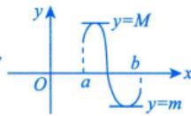

---
tags:
  - 考研数学
  - 高数
  - 中值定理
  - 有界性
  - 最值定理
created: 2026-03-24
status: 待学习
---

# 定理1：有界与最值定理

## 定理内容

> [!theorem] 有界与最值定理
> 设 $f(x)$ 在 $[a,b]$ 上**连续**，则
> 1. **有界性**：$|f(x)| \leqslant M$
> 2. **最值性**：$m \leqslant f(x) \leqslant M$，其中 $m, M$ 分别为 $f(x)$ 在 $[a,b]$ 上的最小值与最大值

---

## 几何意义

在闭区间上连续的函数，其图像是一条**有界的曲线**，且必定存在最高点和最低点。

---

## 重要结论

1. **闭区间连续必有界**：$f(x)$ 在 $[a,b]$ 上连续 $\Rightarrow$ $f(x)$ 在 $[a,b]$ 上有界
2. **最值必存在**：$f(x)$ 在 $[a,b]$ 上连续 $\Rightarrow$ $f(x)$ 在 $[a,b]$ 上必有最大值和最小值
3. **最值点位置**：最值可能在**端点**或**内部**取得

---

## 常见题型

1. 判断函数在区间上的有界性
2. 证明函数存在最值
3. 与其他中值定理结合使用

---

## 例题

> [!example] 例1
> 设 $f(x)$ 在 $[a,b]$ 上连续，证明 $f(x)$ 在 $[a,b]$ 上有界。

**证明**：由有界与最值定理直接可得。

---

## 个人笔记

> [!personal]
> （在此记录个人理解和易错点）
