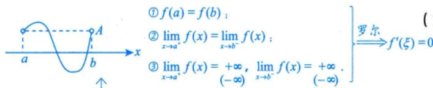

---
tags:
  - 考研数学
  - 高数
  - 中值定理
  - 罗尔定理
created: 2026-03-24
status: 待学习
importance: ⭐⭐⭐⭐⭐
---

# 定理6：罗尔定理

> [!important] 重中之重
> 罗尔定理是考研数学中**最常考**的中值定理之一！

## 定理内容

> [!theorem] 罗尔定理
> 设 $f(x)$ 满足：
> 1. 在 $[a,b]$ 上**连续**
> 2. 在 $(a,b)$ 内**可导**
> 3. $f(a) = f(b)$
>
> 则存在 $\xi \in (a,b)$，使得 $f'(\xi) = 0$

---

## 推广形式

> [!theorem] 推广的罗尔定理
> 设 $f(x)$ 在 $(a,b)$ 内可导，$\lim_{x \to a^+} f(x) = \lim_{x \to b^-} f(x) = A$，则在 $(a,b)$ 内至少存在一点 $\xi$，使 $f'(\xi) = 0$。
>
> 其中区间 $(a,b)$ 可以是有限区间也可以是无穷区间，$A$ 可以是有限数也可以是无穷大。

---

## 几何意义

两端高度相等的连续光滑曲线，必有**水平切线**。

---

## 辅助函数构造方法

> [!tip] 构造辅助函数是关键！

### 1. 乘积求导公式的逆用

| 见到 | 令 $F(x) =$ |
|------|-------------|
| $f(x)f'(x)$ | $f^2(x)$ |
| $[f'(x)]^2 + f(x)f''(x)$ | $f(x)f'(x)$ |
| $f'(x) + f(x)\varphi'(x)$ | $f(x)e^{\varphi(x)}$ |
| $f'(x) + f(x)$ | $f(x)e^x$ |
| $f'(x) - f(x)$ | $f(x)e^{-x}$ |
| $f'(x) + kf(x)$ | $f(x)e^{kx}$ |

### 2. 商的求导公式的逆用

| 见到 | 令 $F(x) =$ |
|------|-------------|
| $f'(x)x - f(x), x \neq 0$ | $\frac{f(x)}{x}$ |
| $f''(x)f(x) - [f'(x)]^2, f(x) \neq 0$ | $\frac{f'(x)}{f(x)}$ 或 $\ln f(x)$ |

---

## 高阶导数问题

> [!note] 多次使用罗尔定理
> 若证 $f''(\xi) = 0$，需要找到函数值相等的**三个点** $f(a) = f(b) = f(c)$，分别在 $[a,b]$ 和 $[b,c]$ 上使用罗尔定理，得到 $f'(\xi_1) = f'(\xi_2) = 0$，再对 $f'(x)$ 使用罗尔定理。

---

## 例题

> [!example] 例6.5
> 设 $f(x)$ 在 $[a,b]$ 上连续，在 $(a,b)$ 内可导，$f(a) = 0$，$a > 0$。证明：存在 $\xi \in (a,b)$ 使得 $f(\xi) = \frac{b-\xi}{a}f'(\xi)$。

**分析**：将结论改写为 $f'(\xi) - \frac{a}{b-\xi}f(\xi) = 0$。

对照 $f'(x) + f(x)\varphi'(x)$ 的形式，构造 $F(x) = f(x)e^{\int \frac{a}{b-x}\mathrm{d}x} = f(x)(b-x)^a$。

**证明**：令 $F(x) = f(x)(b-x)^a$，显然 $F(a) = F(b) = 0$。

由罗尔定理，存在 $\xi \in (a,b)$，使得 $F'(\xi) = 0$，即
$$f'(\xi)(b-\xi)^a - af(\xi)(b-\xi)^{a-1} = 0$$

已知 $a > 0$，故 $f(\xi) = \frac{b-\xi}{a}f'(\xi)$。

---

## 个人笔记

> [!personal]
> （在此记录个人理解和易错点）
