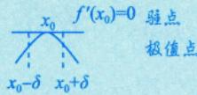
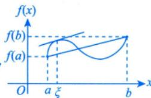

---
tags:
  - 考研数学
  - 高数
  - 中值定理
  - 章节总结
created: 2026-05-29
---

# 📝 涉及导数的中值定理 - 章节总结

## 一、定理体系概览

```
费马定理（极值点必要条件）
    ↓ 应用
罗尔定理（端点值相等 → 导数零点）
    ↓ 推广
拉格朗日中值定理（任意两点 → 割线=切线）
    ↓ 推广（参数方程形式）
柯西中值定理（两函数 → 相对变化率）
    ↓ 推广（高阶导数）
泰勒公式（多项式逼近 + 余项控制）
```

---

## 二、五大核心定理

### 1. 费马定理

> [!theorem] 费马定理
> 设 $f(x)$ 在点 $x_0$ 处**可导**且**取极值**，则 $f'(x_0) = 0$

**几何意义**：极值点处切线水平



**核心价值**：极值点的**必要条件**（可导 + 极值 → $f'(x_0) = 0$）

---

### 2. 罗尔定理 ⭐⭐⭐⭐⭐

> [!theorem] 罗尔定理
> 设 $f(x)$ 满足：
> 1. 在 $[a,b]$ 上**连续**
> 2. 在 $(a,b)$ 内**可导**
> 3. $f(a) = f(b)$
>
> 则存在 $\xi \in (a,b)$，使得 $f'(\xi) = 0$

**几何意义**：两端高度相等的连续光滑曲线，必有水平切线


#### 辅助函数构造方法

| 见到 | 令 $F(x) =$ |
|------|-------------|
| $f(x)f'(x)$ | $f^2(x)$ |
| $f'(x) + f(x)$ | $f(x)e^x$ |
| $f'(x) - f(x)$ | $f(x)e^{-x}$ |
| $f'(x) + kf(x)$ | $f(x)e^{kx}$ |
| $f'(x)x - f(x), x \neq 0$ | $\frac{f(x)}{x}$ |
| $f''(x)f(x) - [f'(x)]^2$ | $\frac{f'(x)}{f(x)}$ |

---

### 3. 拉格朗日中值定理 ⭐⭐⭐⭐⭐

> [!theorem] 拉格朗日中值定理
> 设 $f(x)$ 满足：
> 1. 在 $[a,b]$ 上**连续**
> 2. 在 $(a,b)$ 内**可导**
>
> 则存在 $\xi \in (a,b)$，使得
> $$f'(\xi) = \frac{f(b) - f(a)}{b - a}$$

**几何意义**：连续光滑曲线上，必有一点的切线斜率等于割线斜率



#### 常用形式

| 形式 | 表达式 |
|------|--------|
| 标准形式 | $f(b) - f(a) = f'(\xi)(b - a)$ |
| 增量形式 | $f(x + \Delta x) - f(x) = f'(\xi)\Delta x$ |
| 不等式形式 | 若 $\vert f'(x)\vert \leqslant M$，则 $\vert f(b) - f(a)\vert \leqslant M\vert b - a\vert$ |

#### 重要推论

- **推论1**：若 $f'(x) \equiv 0$，则 $f(x) \equiv C$
- **推论2**：若 $f'(x) > 0$，则 $f(x)$ 单调递增

---

### 4. 柯西中值定理

> [!theorem] 柯西中值定理
> 设 $f(x), g(x)$ 满足：
> 1. 在 $[a,b]$ 上**连续**
> 2. 在 $(a,b)$ 内**可导**
> 3. $g'(x) \neq 0$
>
> 则存在 $\xi \in (a,b)$，使得
> $$\frac{f(b) - f(a)}{g(b) - g(a)} = \frac{f'(\xi)}{g'(\xi)}$$

**几何意义**：参数方程表示的曲线，存在一点切线斜率等于弦斜率

**与拉格朗日的关系**：令 $g(x) = x$ 即得拉格朗日中值定理

#### 常见搭配

| $f(x)$ | $g(x)$ | 结果 |
|--------|--------|------|
| $f(x)$ | $x$ | 拉格朗日中值定理 |
| $f(x)$ | $x^2$ | $\frac{f(b) - f(a)}{b^2 - a^2} = \frac{f'(\xi)}{2\xi}$ |
| $f(x)$ | $\ln x$ | $\frac{f(b) - f(a)}{\ln b - \ln a} = \xi f'(\xi)$ |
| $f(x)$ | $e^x$ | $\frac{f(b) - f(a)}{e^b - e^a} = \frac{f'(\xi)}{e^\xi}$ |

---

### 5. 泰勒公式 ⭐⭐⭐⭐⭐

#### 两种余项对比

| 特性 | 佩亚诺余项 | 拉格朗日余项 |
|------|-----------|-------------|
| 余项形式 | $o((x-x_0)^n)$ | $\frac{f^{(n+1)}(\xi)}{(n+1)!}(x-x_0)^{n+1}$ |
| 关注点 | 局部趋势（微观） | 整体误差（宏观） |
| 条件要求 | $x_0$ 处 $n$ 阶可导 | 邻域内 $n+1$ 阶可导 |
| 适用场景 | 求极限、判断无穷小阶数 | 证明不等式、估算误差 |

> [!tip] 快速抉择
> **求极限用佩亚诺，证不等式拉格朗日**

#### 麦克劳林公式（$x_0 = 0$）

| 函数 | 展开式 |
|------|--------|
| $e^x$ | $1 + x + \frac{x^2}{2!} + \cdots + \frac{x^n}{n!} + o(x^n)$ |
| $\sin x$ | $x - \frac{x^3}{3!} + \cdots + (-1)^n\frac{x^{2n+1}}{(2n+1)!} + o(x^{2n+1})$ |
| $\cos x$ | $1 - \frac{x^2}{2!} + \frac{x^4}{4!} - \cdots + (-1)^n\frac{x^{2n}}{(2n)!} + o(x^{2n})$ |
| $\ln(1+x)$ | $x - \frac{x^2}{2} + \frac{x^3}{3} - \cdots + (-1)^{n-1}\frac{x^n}{n} + o(x^n)$ |
| $(1+x)^\alpha$ | $1 + \alpha x + \frac{\alpha(\alpha-1)}{2!}x^2 + \cdots + o(x^n)$ |

---

## 三、定理间的关系

> [!summary] 定理演进逻辑
> 1. **费马定理**：极值点必要条件（单点性质）
> 2. **罗尔定理**：费马定理 + 端点条件 → 导数零点存在性
> 3. **拉格朗日中值定理**：去掉 $f(a) = f(b)$ 条件 → 割线斜率=切线斜率
> 4. **柯西中值定理**：拉格朗日的参数方程推广 → 两函数相对变化率
> 5. **泰勒公式**：拉格朗日余项是中值定理的高阶推广

---

## 四、应用场景速查

| 题型 | 首选定理 |
|------|---------|
| 证 $f'(\xi) = 0$ | 罗尔定理 |
| 证 $f'(\xi) = k$ | 拉格朗日中值定理 |
| 证 $\frac{f'(\xi)}{g'(\xi)} = k$ | 柯西中值定理 |
| 证 $f^{(n)}(\xi) = 0$ | 多次使用罗尔定理 |
| 证 $f^{(n)}(\xi) \neq 0$（不等式） | 泰勒公式 |
| 求极限 $\frac{0}{0}$ 型 | 泰勒公式（佩亚诺余项） |
| 用导数控制函数值 | 拉格朗日中值定理 |

---

## 五、例题精选

### 例1（罗尔定理）
设 $f(x)$ 在 $[a,b]$ 上连续，在 $(a,b)$ 内可导，$f(a) = 0$，$a > 0$。证明：存在 $\xi \in (a,b)$ 使得 $f(\xi) = \frac{b-\xi}{a}f'(\xi)$。

**关键**：构造 $F(x) = f(x)(b-x)^a$

### 例2（拉格朗日中值定理）
若 $f(x)$ 在 $(a,b)$ 内可导且 $f'(x)$ 有界，证明：$f(x)$ 在 $(a,b)$ 内有界。

**关键**：对任意 $x_0$，在 $[x, x_0]$ 上应用拉格朗日

### 例3（柯西中值定理）
设 $f(x)$ 在 $[a,b]$ 上连续，在 $(a,b)$ 内可导，$0 < a < b$。证明：存在 $\xi \in (a,b)$，使得 $f(b) - f(a) = \xi \ln \frac{b}{a} f'(\xi)$。

**关键**：令 $g(x) = \ln x$，应用柯西中值定理

### 例4（泰勒公式）
设 $f(x)$ 在 $[-1,1]$ 上具有三阶连续导数，且 $f(-1) = 0$，$f(1) = 1$，$f'(0) = 0$。证明：存在 $\xi \in (-1,1)$，使 $f'''(\xi) = 3$。

**关键**：在 $x=0$ 处展开，利用介值定理

---

## 六、易错点提醒

| 错误 | 正确做法 |
|------|---------|
| 罗尔定理忘记检验 $f(a) = f(b)$ | 三条件缺一不可 |
| 柯西中值定理忘记 $g'(x) \neq 0$ | 必须验证分母条件 |
| 泰勒公式展开点选择不当 | 选已知导数值的点或特殊点 |
| 余项选择错误 | 求极限→佩亚诺；证不等式→拉格朗日 |
| 辅助函数构造方向错误 | 对照乘积/商的求导公式逆用 |
