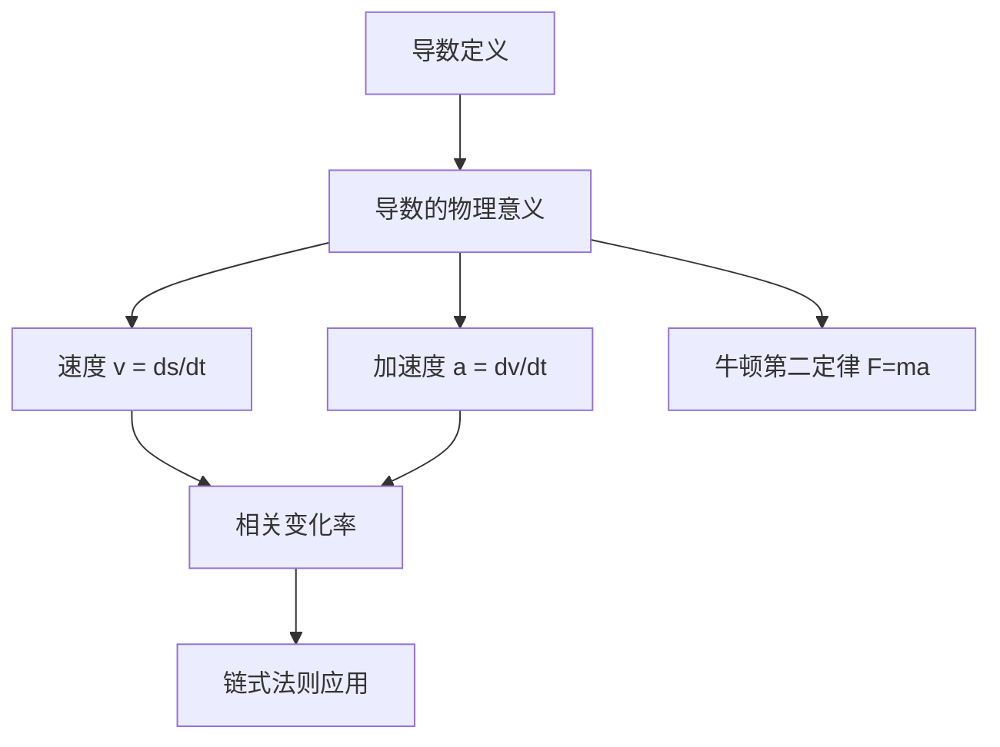

# 一元函数微分的应用3 - 知识点索引

> 📌 **模块定位**：一元函数微分学的应用（三）物理应用与相关变化率
> 🎯 **适用范围**：仅数学一、数学二
> 📚 **参考教材**：第7讲

---

## 📋 知识点目录

### 1-物理应用与相关变化率

| 知识点 | 文件 | 重要程度 | 说明 |
|--------|------|----------|------|
| 导数的物理意义 | [导数的物理意义.md](1-物理应用与相关变化率/导数的物理意义.md) | ⭐⭐⭐ | 位移、速度、加速度的关系 |
| 相关变化率 | [相关变化率.md](1-物理应用与相关变化率/相关变化率.md) | ⭐⭐⭐⭐ | **重难点** |
| 典型例题 | [典型例题.md](1-物理应用与相关变化率/典型例题.md) | ⭐⭐⭐⭐⭐ | 综合应用 |

---

## 🎯 考试要求

| 题型 | 选择题、填空题、解答题 |
|------|----------------------|
| **目标** | 了解导数的物理意义，会用导数描述一些物理量 |
| **重难点** | 相关变化率 |

---

## 🔗 知识点关系图

---

## 📝 学习建议

1. **核心方法**：
   - 建立相关变量方程
   - 对时间求导找出变化率关系
   - 通过已知变化率求未知变化率

2. **注意事项**：
   - 更为综合的物理应用会涉及微分方程（第15讲学习）
   - 单独出题不难，常见的是速度、位移、加速度与相关变化率的综合题

---

## 📊 学习进度

- [ ] 导数的物理意义
- [ ] 相关变化率概念与方法
- [ ] 典型例题练习

---

*创建日期: 2026-03-29*
