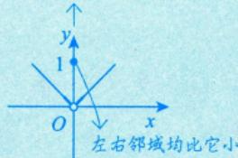
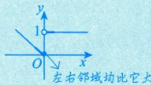
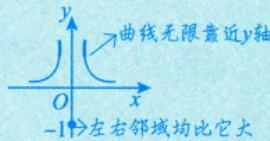
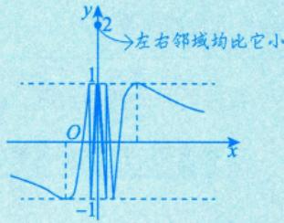

# 极值的定义

> [!info] 概述
> 极值是函数在某点邻域内的局部性质，包括极大值和极小值。极值点是导数应用的核心概念之一。

## 定义

> [!def] 极值的定义
> 对于函数 $f(x)$，若存在点 $x_0$ 的某个邻域，使得在该邻域内任意一点 $x$，均有
> $$f(x) \leqslant f(x_0) \quad (\text{或 } f(x) \geqslant f(x_0))$$
> 成立，则称点 $x_0$ 为 $f(x)$ 的**极大值点**（或**极小值点**），$f(x_0)$ 为 $f(x)$ 的**极大值**（或**极小值**）。

## 重要说明

1. **局部概念**：极值是在邻域内比较，是局部性质
2. **左右邻域均有定义**：端点处不讨论极值，间断点可以是极值点
3. **常数函数**：处处是极值（既是极大值也是极小值）
4. **理想极值点**：常考查"左邻域减，右邻域增"或"左邻域增，右邻域减"的情形

## 间断点可以是极值点

> [!example] 例子
> 1. **可去间断点**：$f(x) = \begin{cases} 1, & x = 0 \\ |x|, & x \neq 0 \end{cases}$，$x = 0$ 是极大值点
> 
> 2. **跳跃间断点**：$f(x) = \begin{cases} 1, & x > 0 \\ -x, & x \leqslant 0 \end{cases}$，$x = 0$ 是极小值点
> 
> 3. **无穷间断点**：$f(x) = \begin{cases} -1, & x = 0 \\ \frac{1}{x^2}, & x \neq 0 \end{cases}$，$x = 0$ 是极小值点
> 
> 4. **振荡间断点**：$f(x) = \begin{cases} 2, & x = 0 \\ \sin \frac{1}{x}, & x \neq 0 \end{cases}$，$x = 0$ 是极大值点
> 

## 极值与最值的区别

| 极值 | 最值 |
|------|------|
| 局部概念 | 整体概念 |
| 在邻域内比较 | 在整个定义域内比较 |
| 可以有多个 | 最多各一个 |
| 端点不讨论 | 端点可以是 |

## 易错点 ⚠️

1. **极值点不一定是驻点**：如 $f(x) = |x|$ 在 $x = 0$ 处不可导
2. **驻点不一定是极值点**：如 $f(x) = x^3$ 在 $x = 0$ 处
3. **间断点可以是极值点**：不要忽略这种情况

---

*创建日期: 2026-03-20*
*参考资料: 高数资料/第五章：一元函数微分的应用1（几何应用）*
