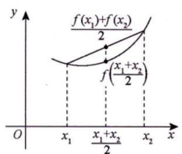
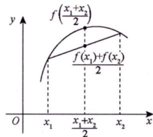
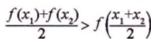
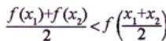
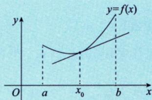
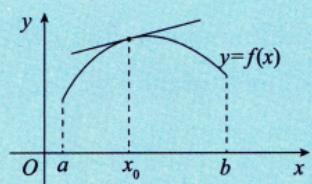

# 凹凸性的定义

> [!info] 概述
> 凹凸性描述曲线的弯曲方向，是函数图像的重要几何性质。

## 定义1（大纲规定）

> [!def] 凹凸性的代数定义
> 设函数 $f(x)$ 在区间 $I$ 上连续。如果对 $I$ 上任意不同两点 $x_1, x_2$，恒有
>
> **凹弧**：$$f\left(\frac{x_1 + x_2}{2}\right) < \frac{f(x_1) + f(x_2)}{2}$$
>
> **凸弧**：$$f\left(\frac{x_1 + x_2}{2}\right) > \frac{f(x_1) + f(x_2)}{2}$$

### 广义化定义

> [!note] 更一般的形式
> 当图形为凹时，可推广为：
> $$f(\lambda_1 x_1 + \lambda_2 x_2) < \lambda_1 f(x_1) + \lambda_2 f(x_2)$$
> 其中 $0 < \lambda_1 < 1$，$0 < \lambda_2 < 1$，$\lambda_1 + \lambda_2 = 1$

### 几何意义

- **凹弧**：图形上任意弧段位于弦的**下方**
- **凸弧**：图形上任意弧段位于弦的**上方**

|  |  |
| --------------------------------------------- | --------------------------------------------- |
|  |  |

## 定义2（切线视角）

> [!def] 凹凸性的切线定义
> 设 $f(x)$ 在 $[a, b]$ 上连续，在 $(a, b)$ 内可导。若对 $(a, b)$ 内的任意 $x$ 及 $x_0$（$x \neq x_0$），均有
>
> **凹弧**：$$f(x_0) + f'(x_0)(x - x_0) < f(x)$$
> （切线在曲线下方）
>
> **凸弧**：$$f(x_0) + f'(x_0)(x - x_0) > f(x)$$
> （切线在曲线上方）
> 

## 重要说明

1. **凹凸性是区间性质**：必须在某个区间上讨论
2. **与导数的关系**：凹弧 $f''(x) > 0$，凸弧 $f''(x) < 0$
3. **记忆方法**：凹像碗（能盛水），凸像帽子（不能盛水）

## 典型例子

| 函数 | 凹凸性 |
|------|--------|
| $y = x^2$ | 凹弧（$y'' = 2 > 0$）|
| $y = e^x$ | 凹弧（$y'' = e^x > 0$）|
| $y = \ln x$ | 凸弧（$y'' = -\frac{1}{x^2} < 0$）|
| $y = \sqrt{x}$ | 凸弧（$y'' = -\frac{1}{4x^{3/2}} < 0$）|

## 易错点 ⚠️

1. **注意凹凸性的定义**：不同教材可能相反，以大纲为准
2. **在区间上讨论**：单点没有凹凸性
3. **凹凸性可以改变**：如 $y = x^3$ 在 $(-\infty, 0)$ 凸，在 $(0, +\infty)$ 凹

## 相关知识点 📚

- [[拐点的定义]]
- [[判别凹凸性]]
- [[../1-单调性与极值/单调性的判别|单调性的判别]]

---

*创建日期: 2026-03-20*
*参考资料: 高数资料/第五章：一元函数微分的应用1（几何应用）*
