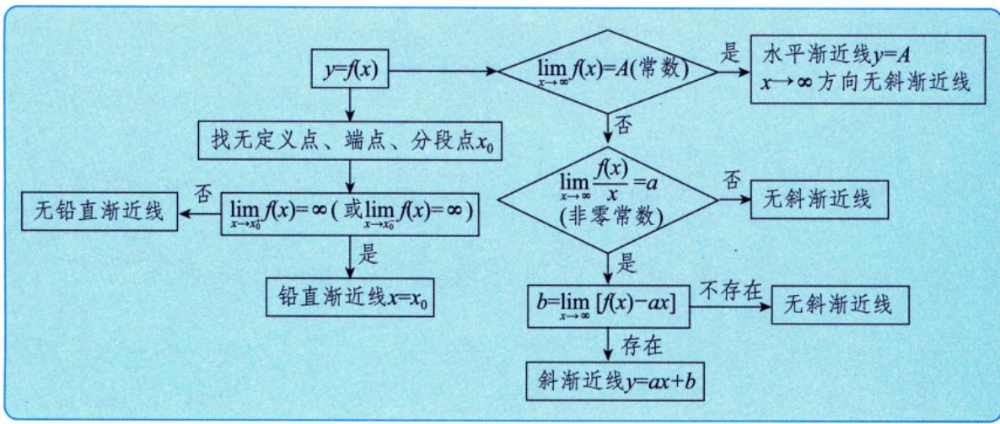

# 斜渐近线

> [!info] 概述
> 斜渐近线是函数在无穷远处趋近的非水平、非垂直的直线。

## 定义

> [!def] 斜渐近线
> - 若 $\lim_{x \to +\infty} \frac{f(x)}{x} = a_1$（$a_1 \neq 0$），$\lim_{x \to +\infty}[f(x) - a_1 x] = b_1$，则 $y = a_1 x + b_1$ 是一条斜渐近线
> - 若 $\lim_{x \to -\infty} \frac{f(x)}{x} = a_2$（$a_2 \neq 0$），$\lim_{x \to -\infty}[f(x) - a_2 x] = b_2$，则 $y = a_2 x + b_2$ 是一条斜渐近线

## 求法

> [!tip] 斜渐近线求法
> 1. 求 $a = \lim_{x \to \infty} \frac{f(x)}{x}$
> 2. 若 $a \neq 0$，再求 $b = \lim_{x \to \infty}[f(x) - ax]$
> 3. 若 $a, b$ 都存在，则 $y = ax + b$ 是斜渐近线

## 推导思路

> [!note] 推导
> $f(x)$ 向直线 $y = ax + b$ 趋近，表明二者在无穷远处无限接近：
>
> $$\lim_{x \to \infty}[f(x) - (ax + b)] = 0$$
>
> 从而：
> $$\lim_{x \to \infty}\frac{f(x) - (ax + b)}{x} = 0$$
> 即：
> $$\lim_{x \to \infty}\frac{f(x)}{x} = a \quad (a \neq 0)$$
>
> 代回得：
> $$\lim_{x \to \infty}[f(x) - ax] = b$$

## 重要说明

1. **$a$ 与 $b$ 都要求出来**：仅求出 $a$ 不能确定有斜渐近线
2. **左右可能不同**：$x \to +\infty$ 与 $x \to -\infty$ 时的斜渐近线可能不同
3. **与水平渐近线互斥**：同一方向存在水平渐近线则无斜渐近线
4. **曲线可与渐近线相交**：渐近线描述的是无穷远处的行为，曲线在有限远处可以穿越渐近线

## 反例

> [!warning] $a$ 存在但无斜渐近线
> $y = x + \sin x$
>
> $a = \lim_{x \to \infty}\frac{y}{x} = 1$
>
> 但 $b = \lim_{x \to \infty}(y - 1 \cdot x) = \lim_{x \to \infty}\sin x$ **不存在**
>
> 故 $y = x + \sin x$ **无斜渐近线**

> [!example] 曲线与渐近线相交
> $y = \frac{\sin x}{x}$
>
> 水平渐近线：$y = 0$
>
> 但 $\frac{\sin x}{x} = 0$ 当 $x = n\pi$（$n \neq 0$）时成立
>
> 即曲线在 $x = \pi, 2\pi, 3\pi, \ldots$ 处**穿过渐近线** $y = 0$
>
> > [!note] 直观理解
> > 渐近线描述的是 $x \to \infty$ 时的**极限行为**，而非全局约束。曲线可以在有限区域内多次穿越渐近线。

## 渐近线寻找顺序

> [!tip] 顺序
> **铅直 → 水平 → 斜**
>
> 1. 先找无定义点、定义区间端点、分段点 → 铅直渐近线
> 2. 判别 $\lim_{x \to \pm\infty} f(x)$ 是否为常数 → 水平渐近线
> 3. 判别 $\lim_{x \to \pm\infty} \frac{f(x)}{x}$ 是否为非零常数 → 斜渐近线

## 典型题型

> [!example] 例题
> **题目**：求 $y = \frac{1}{x} + \ln(1 + e^x)$ 的斜渐近线。
>
> **解答**：
>
> $a = \lim_{x \to +\infty}\frac{\frac{1}{x} + \ln(1 + e^x)}{x} = \lim_{x \to +\infty}\left[\frac{1}{x^2} + \frac{x + \ln(1 + e^{-x})}{x}\right] = 1$
>
> $b = \lim_{x \to +\infty}\left[\frac{1}{x} + \ln(1 + e^x) - x\right] = \lim_{x \to +\infty}\left[\frac{1}{x} + \ln(1 + e^{-x})\right] = 0$
>
> 故斜渐近线为 $y = x$

## 相关知识点 📚

- [[铅直渐近线]]
- [[水平渐近线]]

---

*创建日期: 2026-03-20*
