# 函数图像绘制步骤

> [!info] 概述
> 作函数图像是微分学应用的综合体现，需要综合运用单调性、极值、凹凸性、拐点、渐近线等知识。

## 一般步骤

> [!thm] 作函数图像的四步法
>
> **第一步：确定定义域，考察函数特性**
> - 定义域
> - 奇偶性（图像对称性）
> - 周期性（只需画一个周期）
> - 有界性
>
> **第二步：用导数工具分析函数性态**
> - 一阶导数 $f'(x)$：确定**单调区间**、**极值点**
> - 二阶导数 $f''(x)$：确定**凹凸区间**、**拐点**
>
> **第三步：考查渐近线**
> - 铅直渐近线
> - 水平渐近线
> - 斜渐近线
>
> **第四步：作出函数图像**
> - 综合以上信息
> - 描点连线

## 列表法

> [!tip] 推荐使用列表法
> 用表格形式整理各区间内 $f'(x)$ 和 $f''(x)$ 的符号：
>
> | $x$ | $(-\infty, x_1)$ | $x_1$ | $(x_1, x_2)$ | $x_2$ | $(x_2, +\infty)$ |
> |-----|------------------|-------|--------------|-------|------------------|
> | $f'(x)$ | + | 0 | - | 不存在 | + |
> | $f''(x)$ | + | + | + | 0 | - |
> | $f(x)$ | ↗凹 | 极大 | ↘凹 | 拐点 | ↗凸 |

## 典型例子

> [!example] 例1：画出 $y^2 = (1 - x^2)^3$ 的图像
>
> **解答**：
>
> **第一步**：对称性分析
> - 代入 $(x, y)$ 和 $(-x, y)$：关于 $y$ 轴对称
> - 代入 $(x, y)$ 和 $(x, -y)$：关于 $x$ 轴对称
> - 只需研究 $x \geqslant 0$，$y \geqslant 0$ 的情形
> - 定义域：$0 \leqslant x \leqslant 1$，$0 \leqslant y \leqslant 1$
>
> **第二步**：求导
> $y = (1 - x^2)^{3/2}$
>
> $y' = \frac{3}{2}(1 - x^2)^{1/2} \cdot (-2x) = -3x\sqrt{1 - x^2}$
>
> $y'' = 3 \cdot \frac{2x^2 - 1}{\sqrt{1 - x^2}}$
>
> 驻点：$x = 0$，$x = 1$
> 拐点横坐标：$x = \frac{\sqrt{2}}{2}$
>
> **第三步**：列表
>
> | $x$ | 0 | $(0, \frac{\sqrt{2}}{2})$ | $\frac{\sqrt{2}}{2}$ | $(\frac{\sqrt{2}}{2}, 1)$ | 1 |
> |-----|---|---------------------------|---------------------|---------------------------|---|
> | $y'$ | 0 | - | - | - | 0 |
> | $y''$ | -3 | - | 0 | + | - |
> | $y$ | 1 | ↘凸 | 拐点 | ↘凹 | 0 |
>
> **第四步**：利用对称性作出完整图像

> [!example] 例2：画出 $y = x^x$（$x > 0$）的图像
>
> **解答**：
>
> **定义域**：$x > 0$
>
> **极限**：$\lim_{x \to 0^+} x^x = 1$
>
> **求导**：
> $y' = x^x(1 + \ln x)$
>
> $y'' = x^x[(1 + \ln x)^2 + \frac{1}{x}] > 0$（无拐点）
>
> **驻点**：$x = \frac{1}{e}$，极小值 $f(\frac{1}{e}) = e^{-1/e}$
>
> **渐近线**：$\lim_{x \to +\infty} x^x = +\infty$，无渐近线

## 图像变换法

> [!info] 变换法概述
> 当已知某个基本函数的图像时，可以通过**初等变换**快速得到相关函数的图像，这是与微分学方法并列的另一类作图技巧。

### 平移变换

> [!thm] 平移变换规则
>
> **水平平移**：
> - $y = f(x + x_0)$：将 $y = f(x)$ 沿 $x$ 轴向**左**平移 $x_0$ 个单位
> 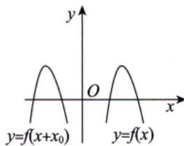
> - $y = f(x - x_0)$：将 $y = f(x)$ 沿 $x$ 轴向**右**平移 $x_0$ 个单位
> 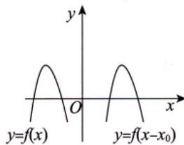
>
> **垂直平移**：
> - $y = f(x) + y_0$：将 $y = f(x)$ 沿 $y$ 轴向**上**平移 $y_0$ 个单位
> 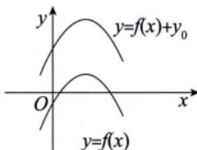
> - $y = f(x) - y_0$：将 $y = f(x)$ 沿 $y$ 轴向**下**平移 $y_0$ 个单位
> 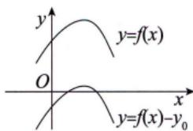

### 对称变换

> [!thm] 对称变换规则
>
> **关于坐标轴/原点对称**：
> - $y = -f(x)$：关于 $x$ 轴对称
> 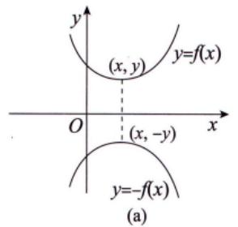
> - $y = f(-x)$：关于 $y$ 轴对称
> 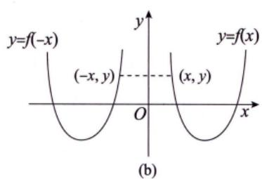
> - $y = -f(-x)$：关于原点对称
> 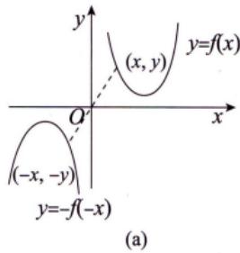
> - $y = f^{-1}(x)$：关于直线 $y = x$ 对称（反函数）
>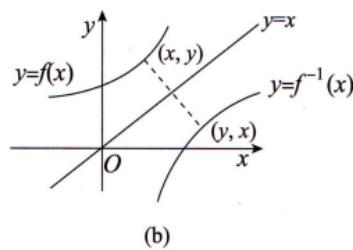
> **绝对值变换**：
> - $y = |f(x)|$：保留 $x$ 轴及上方部分，下方部分翻折到上方
> 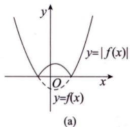
> - $y = f(|x|)$：保留 $y$ 轴及右侧部分，左侧部分由右侧对称得到
> 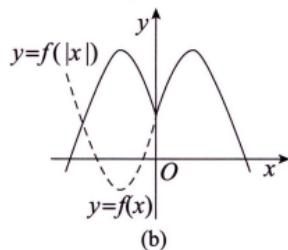

> [!tip] 对称性判别的通用方法
> 将方程写成 $F(x,y) = 0$ 形式：
> - $F(x,y) = F(-x,y)$ ⇒ 关于 $y$ 轴对称
> - $F(x,y) = F(x,-y)$ ⇒ 关于 $x$ 轴对称
> - $F(x,y) = F(-x,-y)$ ⇒ 关于原点对称
> - $F(x,y) = F(y,x)$ ⇒ 关于 $y = x$ 对称
> - $F(T+x,y) = F(T-x,y)或F(x,y) = F(2T-x,y)$ ⇒ 关于 $x = T$ 对称（平移后的对称）
> - $F(x,T+y) = F(x,T-y)或F(x,y) = F(x,2T-y)$ ⇒ 关于 $y = T$ 对称
> - $F(a+x,y) = F(a-x,-y)$ ⇒ 关于点 $(a,0)$ 对称

### 伸缩变换

> [!thm] 伸缩变换规则
>
> **水平伸缩**：
> - $y = f(kx)$ ($k>1$)：横坐标缩短为原来的 $\frac{1}{k}$ 倍
> - $y = f(kx)$ ($0<k<1$)：横坐标伸长为原来的 $\frac{1}{k}$ 倍
>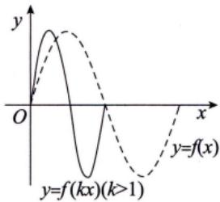
> **垂直伸缩**：
> - $y = kf(x)$ ($k>1$)：纵坐标伸长为原来的 $k$ 倍
> - $y = kf(x)$ ($0<k<1$)：纵坐标缩短为原来的 $k$ 倍
> 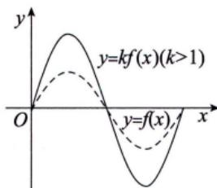

### 变换法应用示例

> [!example] 摆线的对称性
> 参数方程 $\begin{cases} x = t - \sin t \\ y = 1 - \cos t \end{cases}$

由于 $(x_2, y_2) = (2\pi - x_1, y_1)$，满足 $F(x_1, y_1) = F(2\pi - x_1, y_1)$，故图像关于 $x = \pi$ 对称。

> [!example] 心形线 $x^3 + y^3 - 3axy = 0$
> 令 $F(x,y) = x^3 + y^3 - 3axy$，有 $F(x,y) = F(y,x)$，故关于 $y = x$ 对称。

## 常见曲线图形

> [!note] 学习建议
> 许多复杂曲线可以通过基本初等函数经**变换**得到。建议优先掌握基本函数图像，再运用变换技巧。
>
> 需要熟练画出的图形：
> 1. 基本初等函数
> 2. 心形线、星形线、平摆线（重点记忆）
> 3. 常见参数方程曲线

---

## 我的理解记录 🧠

> [!personal] 个人理解
> （学习后填写）

## 相关知识点 📚

- [[../1-单调性与极值/单调性的判别|单调性的判别]]
- [[../1-单调性与极值/判别极值的第一充分条件|判别极值]]
- [[../2-凹凸性与拐点/判别凹凸性|判别凹凸性]]
- [[../4-渐近线/铅直渐近线|渐近线]]

---

*创建日期: 2026-03-20*
