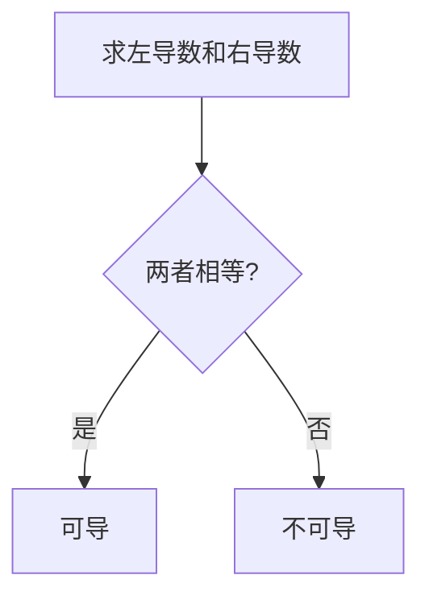

# 单侧导数

> [!info] 概述
> 单侧导数是判断函数可导性的重要工具，包括左导数和右导数。

---

## 1. 定义

### 左导数

$$f'_-(x_0) = \lim_{\Delta x \to 0^-} \frac{f(x_0 + \Delta x) - f(x_0)}{\Delta x} = \lim_{x \to x_0^-} \frac{f(x) - f(x_0)}{x - x_0}$$

> 左导数表示函数在 $x_0$ 处**左侧**的瞬时变化率。

### 右导数

$$f'_+(x_0) = \lim_{\Delta x \to 0^+} \frac{f(x_0 + \Delta x) - f(x_0)}{\Delta x} = \lim_{x \to x_0^+} \frac{f(x) - f(x_0)}{x - x_0}$$

> 右导数表示函数在 $x_0$ 处**右侧**的瞬时变化率。

---

## 2. 核心结论

> [!important] 可导的充要条件
> 函数 $f(x)$ 在 $x_0$ 处可导 $\Longleftrightarrow$ $f'_-(x_0) = f'_+(x_0)$
>
> 且此时 $f'(x_0) = f'_-(x_0) = f'_+(x_0)$

### 判断流程

---

## 3. 几何意义

| 情况 | 左右导数关系 | 几何特征 | 图示特征 |
|:----:|:------------:|----------|----------|
| **可导** | $f'_- = f'_+$ | 有切线（斜着或水平） | 曲线光滑 |
| **不可导（角点）** | $f'_- \neq f'_+$ | 左右切线方向不同 | 尖点/折点 |
| **不可导（铅直切线）** | 均为 $\infty$ | 切线铅直 | 竖直切线 |

## 4. 易错点总结

> [!warning] 常见错误

| 错误类型 | 错误示例 | 正确做法 |
|----------|----------|----------|
| 符号混淆 | 求左导数时用 $\Delta x \to 0^+$ | 左导数对应 $\Delta x \to 0^-$ |
| 忘记 $f(x_0)$ | 直接算 $\dfrac{f(x_0+\Delta x)}{\Delta x}$ | 必须是 $\dfrac{f(x_0+\Delta x) - f(x_0)}{\Delta x}$ |
| 分段点遗漏 | 只算一侧就下结论 | 必须两侧都算再比较 |

---

## 5. 记忆口诀

> [!tip] 核心口诀
> - **左导右导都要算，相等才能说可导**
> - **绝对值，尖尖角，左右斜率反号了**
> - **分段函数分界点，两侧极限必须算**

---

## 相关知识点

- [[导数的定义]]
- [[可导的充要条件]]
- [[导数的几何意义]]

---

*创建日期: 2026-03-14*
*最后更新: 2026-05-17*
