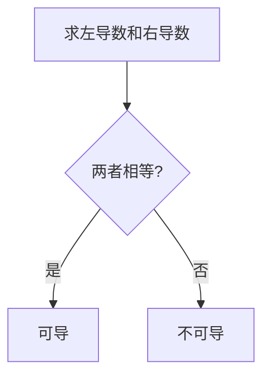

# 单侧导数

> [!info] 概述
> 单侧导数是判断函数可导性的重要工具，包括左导数和右导数。

---

## 1. 定义

### 左导数

$$f'_-(x_0) = \lim_{\Delta x \to 0^-} \frac{f(x_0 + \Delta x) - f(x_0)}{\Delta x} = \lim_{x \to x_0^-} \frac{f(x) - f(x_0)}{x - x_0}$$

> 左导数表示函数在 $x_0$ 处**左侧**的瞬时变化率。

### 右导数

$$f'_+(x_0) = \lim_{\Delta x \to 0^+} \frac{f(x_0 + \Delta x) - f(x_0)}{\Delta x} = \lim_{x \to x_0^+} \frac{f(x) - f(x_0)}{x - x_0}$$

> 右导数表示函数在 $x_0$ 处**右侧**的瞬时变化率。

---

## 2. 核心结论

> [!important] 可导的充要条件
> 函数 $f(x)$ 在 $x_0$ 处可导 $\Longleftrightarrow$ $f'_-(x_0) = f'_+(x_0)$
>
> 且此时 $f'(x_0) = f'_-(x_0) = f'_+(x_0)$

### 判断流程

---

## 3. 核心辨析：定义法 vs 公式法

> [!important] 核心结论
> - **导数定义法**：是万无一失的"底层逻辑"，求的是某一点局部的瞬时变化率
> - **直接公式求导**：是带有严格前提条件的"快捷方式"，求的是导函数在某点的极限
>
> 两者在概念上**不完全等价**。盲目使用公式法容易在分段点、震荡点掉入陷阱。

### 3.1 概念的本质区别

#### 定义法（求一点的局部性质）

$$f'_-(x_0) = \lim_{x \to x_0^-} \frac{f(x) - f(x_0)}{x - x_0}$$

**物理意义**：只关心 $x$ 无限趋近于 $x_0$ 时，割线斜率的极限。

**适用性**：绝对安全，只要极限存在，单侧导数就存在。

#### 公式法（求导函数的极限）

先利用求导公式求出 $x < x_0$ 一侧的导函数 $f'(x)$，再求极限：

$$\lim_{x \to x_0^-} f'(x)$$

**物理意义**：反映的是 $x_0$ 附近的导数值（变化率）趋近于什么。

**风险点**：在某些特殊函数中，$f'_-(x_0)$ 存在，但 $\lim_{x \to x_0^-} f'(x)$ 可能根本不存在。

### 3.2 公式法的前提条件（导数极限定理）

想要通过"先求导函数，再代入极限"来代替单侧导数定义，必须**同时满足**以下三个条件：

| 条件 | 要求 | 说明 |
|:----:|:----:|------|
| **连续性前提** | $f(x)$ 在 $x=x_0$ 处连续 | 最重要，是后续条件的基础 |
| **邻域可导** | 在 $x_0$ 的某单侧开区间内可导 | 保证导函数在该侧有定义 |
| **导数极限存在** | $\displaystyle\lim_{x \to x_0^-} f'(x)$ 存在（为常数） | 极限必须收敛到有限值 |

#### 为什么"连续"是根基？——导数定义的"实心锚点"逻辑

回归单侧左导数的原始定义：

$$f'_-(x_0) = \lim_{x \to x_0^-} \frac{f(x) - f(x_0)}{x - x_0}$$

注意分子中的 **$f(x_0)$**，它是一个不可改变的、实心的"物理锚点"。

- **定义法的本质**：是动点 $(x, f(x))$ 与固定锚点 $(x_0, f(x_0))$ 连线（割线）的斜率极限。它**高度依赖** $f(x_0)$ 的真实位置。
- **公式法的本质**：$\displaystyle\lim_{x \to x_0^-} f'(x)$ 这个式子**完全没有包含** $f(x_0)$ 的值。它只反映曲线在"撞击" $x_0$ 之前那一瞬间，自身切线的倾斜趋势。

> [!warning] 关键逻辑
> 如果函数在 $x_0$ 处**不连续**（点 $f(x_0)$ 脱离了曲线，跳到上方或下方），那么即使左侧曲线本身再平滑（邻域处处可导），在 $x$ 无限逼近 $x_0$ 的最后一瞬，动点为了连接那个"错位"的锚点，割线的斜率都会被**瞬间拉扯到无穷大**（即不可导）。

> [!tip] 实战判断
> 对于由多项式、指数、对数等初等函数拼接的**普通分段函数**，如果在拼接点连续，通常可以直接分别对两侧公式求导并代入。

### 3.3 避坑指南：必须使用定义法的场景

> [!warning] 遇以下情况，切忌直接套用求导公式，必须回到导数定义！

| 场景 | 典型例子 | 原因 |
|:----:|----------|:----:|
| **分段点连续性未知** | 分界点未说明连续性的分段函数 | 不连续则公式法失效 |
| **含绝对值** | $f(x) = \lvert x \rvert$ 在 $x=0$ 处 | 表达式分片导致导数突变 |
| **无限震荡结构** | $\sin(\frac{1}{x})$、$\cos(\frac{1}{x})$ 在 $x=0$ 处 | 导函数极限可能震荡不存在 |
| **题干明确要求** | "用定义证明"、"由定义求导" | 题目硬性规定 |

### 3.4 经典反例：跳跃间断点——公式法的欺骗性

$$f(x) = \begin{cases} x, & x < 1 \\ 5, & x = 1 \end{cases}$$

函数在 $x < 1$ 时是斜率为1的平滑射线，但在 $x=1$ 处突然跳跃到高度5。

#### ❌ 错误做法（套用公式法）

当 $x < 1$ 时，$f'(x) = 1$，进而 $\displaystyle\lim_{x \to 1^-} f'(x) = 1$。

**错误结论**：左导数存在且为1。

#### ✅ 正确做法（使用定义法）

$$f'_-(1) = \lim_{x \to 1^-} \frac{f(x) - f(1)}{x - 1} = \lim_{x \to 1^-} \frac{x - 5}{x - 1}$$

当 $x \to 1^-$ 时，分子趋于 $-4$，分母趋于 $0^-$（极小的负数）：

$$\lim_{x \to 1^-} \frac{-4}{0^-} = +\infty$$

**正确结论**：真实的左导数趋于无穷大，**左导数不存在**。

> [!important] 反思
> 即使邻域内处处可导且导数极限存在为1，但因其在 $x=1$ 不连续，公式法算出的"1"与真实导数"不存在"完全相悖。

### 3.5 考场答题标准步骤

在大题中使用"公式法"求单侧导数，必须按以下三步书写：

| 步骤 | 操作 | 说明 |
|:----:|------|------|
| **第一步：证连续** | 求 $\displaystyle\lim_{x \to x_0^-} f(x)$ 是否等于 $f(x_0)$ | 若不连续，直接判定该侧不可导 |
| **第二步：求导求极限** | 在连续前提下，求 $\displaystyle\lim_{x \to x_0^-} f'(x)$ | 极限值即为候选导数值 |
| **第三步：下结论** | 若极限为 $A$，则 $f'_-(x_0) = A$ | 依据导数极限定理

---

## 4. 几何意义

| 情况 | 左右导数关系 | 几何特征 | 图示特征 |
|:----:|:------------:|----------|----------|
| **可导** | $f'_- = f'_+$ | 有切线（斜着或水平） | 曲线光滑 |
| **不可导（角点）** | $f'_- \neq f'_+$ | 左右切线方向不同 | 尖点/折点 |
| **不可导（铅直切线）** | 均为 $\infty$ | 切线铅直 | 竖直切线 |

## 5. 易错点总结

> [!warning] 常见错误

| 错误类型 | 错误示例 | 正确做法 |
|----------|----------|----------|
| 符号混淆 | 求左导数时用 $\Delta x \to 0^+$ | 左导数对应 $\Delta x \to 0^-$ |
| 忘记 $f(x_0)$ | 直接算 $\dfrac{f(x_0+\Delta x)}{\Delta x}$ | 必须是 $\dfrac{f(x_0+\Delta x) - f(x_0)}{\Delta x}$ |
| 分段点遗漏 | 只算一侧就下结论 | 必须两侧都算再比较 |

---

## 6. 记忆口诀

> [!tip] 核心口诀
> - **左导右导都要算，相等才能说可导**
> - **绝对值，尖尖角，左右斜率反号了**
> - **分段函数分界点，两侧极限必须算**

---

## 7. 相关知识点

- [[导数的定义]]
- [[可导的充要条件]]
- [[导数的几何意义]]

---

*创建日期: 2026-03-14*
*最后更新: 2026-05-19*
