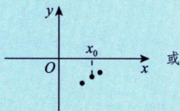
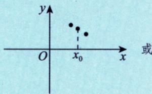
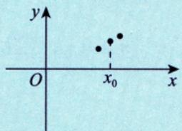
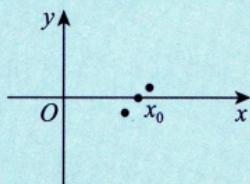
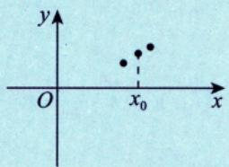
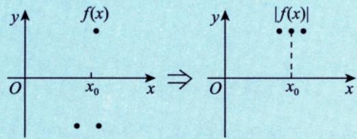
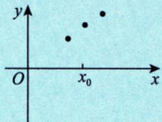
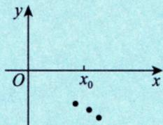
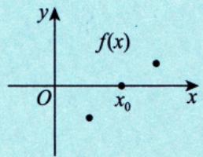
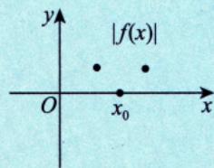

# 绝对值函数的可导性

> [!info] 概述
> 研究函数 $f(x)$ 与 $|f(x)|$ 可导性的关系，是考研常见题型。

## 核心结论

### 连续与绝对值

> [!thm] 定理：连续性的传递
> 设 $f(x)$ 在 $x_0$ 处**连续**，则 $|f(x)|$ 在 $x_0$ 处**必连续**。
>
> **逆命题不成立**：$|f(x)|$ 连续 $\not\Rightarrow$ $f(x)$ 连续。

#### 正向命题的几何解释

**$f(x)$ 连续 $\Rightarrow$ $\vert f(x) \vert$ 连续**：

在 $x_0$ 处，将 $f(x)$ 的图像放大足够多倍，观察其微观性态：

| $f(x)$ 在 $x_0$ 处连续的微观图 | 对应的 $\vert f(x) \vert$ 图像 |
|:---:|:---:|
|  |  |
| （a）| （d）|
|  |  |
| （b）| （e）|
|  |  |
| （c）| （f）|

> [!tip] 核心直观：相依相偎
> - **连续的本质**：函数在 $x_0$ 处连续，意味着在微观视角下，$f(x)$ 与 $f(x_0)$ "点点相依相偎"
> - **绝对值保持**：加上绝对值后，这种"相依相偎"的关系依然保持（图a-c → 图d-f）
> - **结论**：无论 $f(x_0) > 0$、$f(x_0) < 0$ 还是 $f(x_0) = 0$，只要 $f(x)$ 连续，$|f(x)|$ 必连续

#### 逆命题不成立的几何解释

**$\vert f(x) \vert$ 连续 $\not\Rightarrow$ $f(x)$ 连续**：

| $\vert f(x) \vert$ 连续 | $f(x)$ 不连续 |
|:---:|:---:|
|  |  |
| （g）$\vert f(x) \vert$ 相依相偎，连续 | （g）$f(x)$ 相距甚远，不连续 |

> [!warning] 关键理解
> - $|f(x)|$ 连续只要求"**绝对值后**的点相依相偎"
> - 但 $f(x)$ 原本可能在 $x_0$ 处发生"跳跃"（如从正跳到负），只是取绝对值后把跳跃"抹平"了
> - **反例**：设 $f(x) = \begin{cases} 1, & x \geq 0 \\ -1, & x < 0 \end{cases}$，则 $|f(x)| \equiv 1$ 处处连续，但 $f(x)$ 在 $x = 0$ 处不连续

---

### 可导与绝对值

> [!thm] 定理：可导性的传递
> 设 $f(x)$ 在 $x_0$ 处**可导**，讨论 $|f(x)|$ 在 $x_0$ 处的可导性：

#### 情况一：$f(x_0) \neq 0$

> [!tip] 结论
> $|f(x)|$ 在 $x_0$ 处**必可导**，且
> $$[|f(x)|]'_{x=x_0} = \begin{cases} f'(x_0), & f(x_0) > 0 \\ -f'(x_0), & f(x_0) < 0 \end{cases}$$

**几何解释**：

| $f(x_0) > 0$ | $f(x_0) < 0$ |
|:---:|:---:|
|  |  |

> [!note] 直观理解
> - 当 $f(x_0) \neq 0$ 时，曲线在 $x_0$ 附近保持在 $x$ 轴同一侧
> - 加绝对值后曲线形状不变（或关于 $x$ 轴翻转），故保持可导

#### 情况二：$f(x_0) = 0$

| 条件               | 结论                                                                     |
| :--------------- | :--------------------------------------------------------------------- |
| $f'(x_0) = 0$    | $\vert f(x) \vert$ 在 $x_0$ 处**可导**，且 $[\vert f(x) \vert]'_{x=x_0} = 0$ |
| $f'(x_0) \neq 0$ | $\vert f(x) \vert$ 在 $x_0$ 处**不可导**                                    |

**几何解释**：

| $f'(x_0) = 0$（可导） | $f'(x_0) \neq 0$（不可导） |
|:---:|:---:|
|  |  |

> [!warning] 关键理解
> - $f'(x_0) = 0$：曲线在 $x_0$ 处"平躺"穿过 $x$ 轴，加绝对值后无尖角，保持可导
> - $f'(x_0) \neq 0$：曲线"斜着"穿过 $x$ 轴，加绝对值后形成**尖角**，不可导

## 关键结论

> [!tip] 可导性判别核心
> $f(x)$ 在 $x_0$ 处可导且 $f(x_0) = 0$、$f'(x_0) \neq 0$ $\Rightarrow$ $|f(x)|$ 在 $x_0$ 处**必不可导**。

## 典型题型

> [!example] 例1：判断可导点
> 设 $f(x)$ 处处可导，$f(0) = -1$，$f'(0) = 1$，令 $g(x) = |f(x-1)|$，判断 $g(x)$ 在 $x = 0$ 和 $x = 1$ 处的可导性。
>
> **解**：
> - **$x = 0$ 处**：$g(0) = |f(-1)|$，由于 $f(-1)$ 的值未知，无法确定 $g(x)$ 是否可导
> - **$x = 1$ 处**：$g(1) = |f(0)| = |-1| = 1 \neq 0$，所以 $g(x)$ 在 $x = 1$ 处**必可导**
>
> 答案选 (C)：$g(x)$ 在 $x = 1$ 处必可导。

> [!example] 例2：含绝对值因式的函数
> 设 $f(x) = (x^2 - 1)|x^3 + x^2 - 2x - 2|$，求不可导点的个数。
>
> **解**：利用核心结论 $f(x) = |x - x_0|\varphi(x)$ 在 $x_0$ 处可导 $\Leftrightarrow$ $\varphi(x_0) = 0$
>
> 因式分解：
> $$|x^3 + x^2 - 2x - 2| = |(x+1)(x^2-2)| = |x+1||x+\sqrt{2}||x-\sqrt{2}|$$
>
> 检查各零点：
> - $x = -1$：$f(x)$ 含有 $(x+1)$ 因子，可导
> - $x = \pm\sqrt{2}$：对应 $\varphi(x) \neq 0$，不可导
>
> 不可导点：**2个**（$x = \pm\sqrt{2}$）

## 微观解释

> [!note] 几何直观
> - $f(x)$ 在 $x_0$ 处可导，$f(x_0) \neq 0$：曲线在 $x_0$ 附近保持在 $x$ 轴同一侧，加绝对值后形状不变
> - $f(x)$ 在 $x_0$ 处可导，$f(x_0) = 0$，$f'(x_0) \neq 0$：曲线穿过 $x$ 轴，加绝对值后形成"尖角"

## 易错点 ⚠️

1. **忽略 $f(x_0) = 0$ 的情况**
   - 这是判断 $|f(x)|$ 可导性的关键分界点

2. **连续与可导的混淆**
   - $|f(x)|$ 连续 $\not\Rightarrow$ $f(x)$ 连续
   - $f(x)$ 可导 $\not\Rightarrow$ $|f(x)|$ 可导

3. **分段讨论不完整**
   - 必须讨论 $f(x_0) > 0$、$f(x_0) < 0$、$f(x_0) = 0$ 三种情况

## 我的理解记录 🧠

> [!personal] 我的理解
> <!-- 记录你对绝对值函数可导性的理解 -->

## 我的错误类型 📌

> [!personal] 错误记录
> <!-- 记录做错的题目和错误原因 -->

## 相关知识点 📚

- [[可导的充要条件]]
- [[可导的必要条件]]

---

*创建日期: 2026-03-14*
