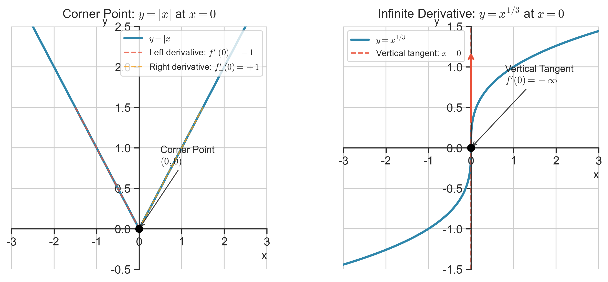
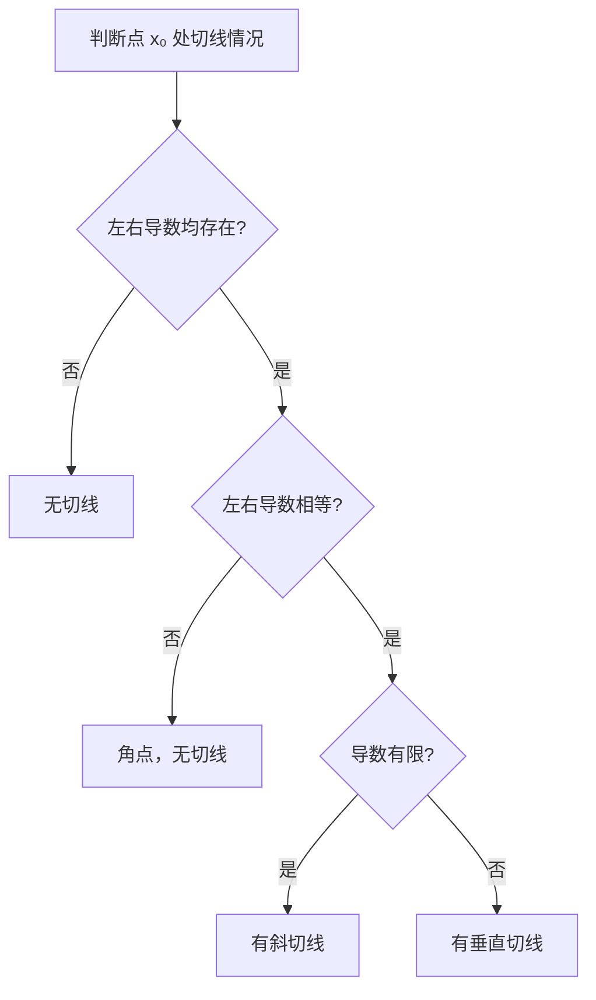

# 特殊情况

> [!info] 概述
> 讨论导数几何意义中的特殊情况：角点和无穷导数。

## 角点（尖点）

> [!def] 角点
> 当 $f'_+(x_0) \neq f'_-(x_0)$ 时，曲线在 $x_0$ 处出现两条单侧切线，形成一个角，数学上称 $x_0$ 为**角点**。
>
> 此时 $f'(x_0)$ **不存在**，曲线**没有切线**。

### 典型例子

> [!example] $f(x) = |x|$ 在 $x = 0$ 处
> - $f'_+(0) = \lim_{\Delta x \to 0^+}\frac{|\Delta x|}{\Delta x} = 1$
> - $f'_-(0) = \lim_{\Delta x \to 0^-}\frac{|\Delta x|}{\Delta x} = -1$
>
> 由于 $f'_+(0) \neq f'_-(0)$，$x = 0$ 是**角点**，函数在此处**不可导**。

## 无穷导数

> [!def] 无穷导数
> 当 $f'(x_0) = +\infty$ 或 $-\infty$ 时，称为**无穷导数**。
>
> 此时曲线在 $x_0$ 处有**垂直于 $x$ 轴的切线** $x = x_0$。

### 典型例子

> [!example] $f(x) = x^{\frac{1}{3}}$ 在 $x = 0$ 处
> $$\frac{\Delta y}{\Delta x} = \frac{(\Delta x)^{\frac{1}{3}}}{\Delta x} = \frac{1}{(\Delta x)^{\frac{2}{3}}}$$
>
> - $f'_+(0) = \lim_{\Delta x \to 0^+}\frac{1}{(\Delta x)^{\frac{2}{3}}} = +\infty$
> - $f'_-(0) = \lim_{\Delta x \to 0^-}\frac{1}{(\Delta x)^{\frac{2}{3}}} = +\infty$
>
> 这是无穷导数，曲线有**垂直切线** $x = 0$。

> [!warning] 高等数学规定
> 在高等数学课程中，无穷导数通常被视为**导数不存在**的特殊情形。

## 两种特殊情况对比

| 类型 | 条件 | 几何特征 | 导数 |
|------|------|----------|------|
| 角点 | $f'_+(x_0) \neq f'_-(x_0)$ | 两条单侧切线形成角 | 不存在 |
| 无穷导数 | $f'_+(x_0) = f'_-(x_0) = \pm\infty$ | 垂直切线 | 不存在（广义存在） |

## 图形示例

> [!note] 图例说明
> - **左图**：角点 $y = |x|$ 在 $x = 0$ 处，左右导数不相等（$-1 \neq +1$），形成角点
> - **右图**：无穷导数 $y = x^{1/3}$ 在 $x = 0$ 处，有垂直切线（$f'(0) = +\infty$）

## 判断流程

## 总结

> [!tip] 核心结论
> 1. $f'_+(x_0) \neq f'_-(x_0)$：角点，**不可导**，没有切线
> 2. $f'(x_0) = \pm\infty$：有垂直切线，但按高等数学规定**导数不存在**

## 易错点 ⚠️

1. **混淆无穷导数与导数不存在**
   - 无穷导数是导数不存在的特殊情形，但切线存在

2. **角点判断错误**
   - 必须计算左右导数比较

3. **垂直切线的斜率**
   - 垂直切线斜率为无穷大，不能写成有限数

## 我的理解记录 🧠

> [!personal] 我的理解
> <!-- 记录你对特殊情况的理解 -->

## 我的错误类型 📌

> [!personal] 错误记录
> <!-- 记录做错的题目和错误原因 -->

## 相关知识点 📚

- [[切线与法线]]
- [[../1-导数/单侧导数|单侧导数]]
- [[../1-导数/可导的充要条件|可导的充要条件]]

---

*创建日期: 2026-03-14*
