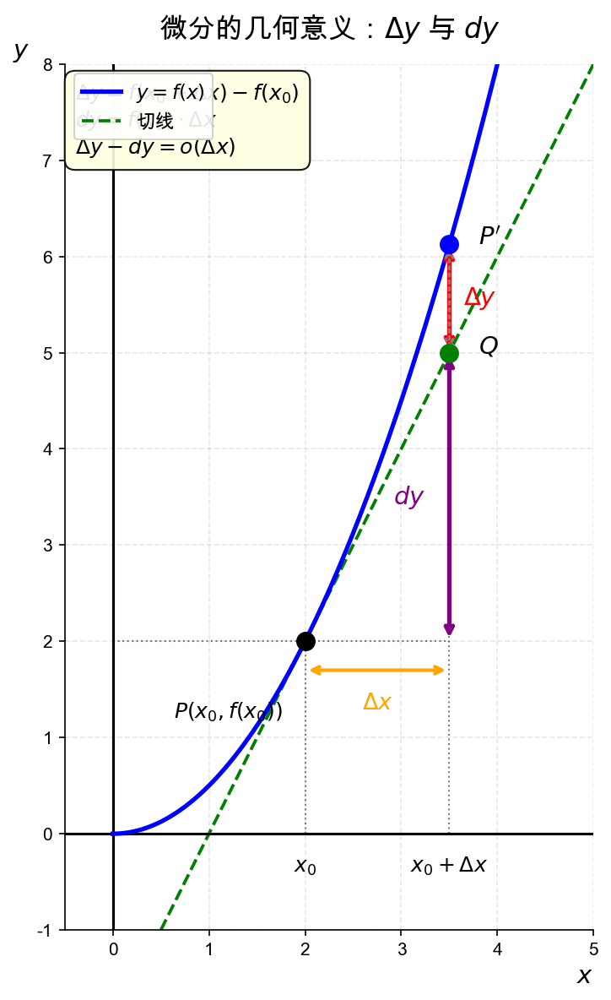

# 微分的几何意义

> [!info] 概述
> 微分的几何意义是用切线段近似代替曲线段，体现了"以直代曲"的思想。

## 几何图示

> [!note] 图中说明
> - $M(x_0, f(x_0))$：曲线上的点
> - $P(x_0 + \Delta x, f(x_0 + \Delta x))$：曲线上的点
> - $Q(x_0 + \Delta x, f(x_0) + f'(x_0)\Delta x)$：切线上的点
> - $MN$：切线
> - $NP = \Delta y$：函数真实增量
> - $NQ = dy$：微分（切线增量）
> - $QP = \Delta y - dy = o(\Delta x)$：误差

## 核心意义

> [!thm] 几何意义
> 若 $f(x)$ 在点 $x_0$ 处**可微**，则在点 $(x_0, y_0)$ 附近可以用**切线段**近似代替**曲线段**。
>
> $$\Delta y \approx dy$$
> $$f(x_0 + \Delta x) \approx f(x_0) + f'(x_0)\Delta x$$

## 直观理解

> [!tip] 以直代曲
> 微分就是用切线（直线）去近似曲线，在局部范围内，曲线可以近似为直线。
>
> - **切线段**：$dy = f'(x_0)\Delta x$（线性增量）
> - **曲线段**：$\Delta y$（真实增量）
> - **误差**：$|\Delta y - dy|$ 是 $\Delta x$ 的高阶无穷小

## 应用：近似计算

> [!example] 例1：近似计算 $\sqrt{1.02}$
> 设 $f(x) = \sqrt{x}$，$x_0 = 1$，$\Delta x = 0.02$。
>
> $$f(1.02) \approx f(1) + f'(1) \cdot 0.02 = 1 + \frac{1}{2} \cdot 0.02 = 1.01$$
>
> 精确值：$\sqrt{1.02} \approx 1.00995$，误差约 $0.00005$。

## 误差分析

| 增量 | 公式 | 几何意义 |
|------|------|----------|
| $\Delta y$ | $f(x_0 + \Delta x) - f(x_0)$ | 曲线增量 |
| $dy$ | $f'(x_0)\Delta x$ | 切线增量 |
| 误差 | $\Delta y - dy = o(\Delta x)$ | 高阶无穷小 |

## 与导数几何意义的联系

| 概念 | 几何意义 |
|------|----------|
| 导数 | 切线的**斜率** |
| 微分 | 切线的**增量** |

> [!note] 关系
> $$dy = f'(x)dx = \text{斜率} \times \text{横坐标增量} = \text{纵坐标增量}$$

## 典型题型

> [!example] 例2：解释微分
> 解释 $d(x^2) = 2x dx$ 的几何意义。
>
> **解**：
> - $y = x^2$ 在点 $(x, x^2)$ 处的切线斜率为 $2x$
> - 当 $x$ 增加 $dx$ 时，切线的纵坐标增量为 $2x \cdot dx$
> - 这就是微分 $dy = 2x dx$

## 易错点 ⚠️

1. **混淆切线与曲线**
   - 微分是切线增量，不是曲线增量

2. **近似公式方向错误**
   - $f(x_0 + \Delta x) \approx f(x_0) + f'(x_0)\Delta x$，不要写反

3. **误差项理解错误**
   - 误差是 $o(\Delta x)$，不是 $O(\Delta x)$

## 我的理解记录 🧠

> [!personal] 我的理解
> <!-- 记录你对微分几何意义的理解 -->

## 我的错误类型 📌

> [!personal] 错误记录
> <!-- 记录做错的题目和错误原因 -->

## 相关知识点 📚

- [[微分的定义]]
- [[可微与可导的关系]]
- [[../2-导数的几何意义/切线与法线|切线与法线]]

---

*创建日期: 2026-03-14*
