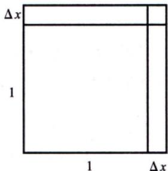

# 微分的定义

> [!info] 概述
> 微分是函数增量的**线性主部**，是用简单量代替复杂量的工具。

## 引例

> [!example] 正方形面积增量
> 设正方形边长为 1，当边长增加 $\Delta x$ 时，面积增量为：
> $$\Delta S = (1 + \Delta x)^2 - 1^2 = 2\Delta x + (\Delta x)^2$$
>
> 增量由两部分组成：
> - $2\Delta x$：$\Delta x$ 的**一次项**（线性部分），是增量的**主要部分**
> - $(\Delta x)^2$：$\Delta x$ 的**高阶无穷小**，即 $(\Delta x)^2 = o(\Delta x)$
>
> 当 $\Delta x$ 足够小时，$\Delta S \approx 2\Delta x$。

## 定义

> [!def] 可微
> 设 $y = f(x)$ 在点 $x_0$ 的某邻域内有定义，若存在与 $\Delta x$ 无关的常数 $A$，使得函数增量：
> $$\Delta y = f(x_0 + \Delta x) - f(x_0)$$
> 可表示为：
> $$\Delta y = A\Delta x + o(\Delta x)$$
> 其中 $o(\Delta x)$ 是 $\Delta x \to 0$ 时比 $\Delta x$ 更高阶的无穷小，则称 $f(x)$ 在点 $x_0$ 处**可微**。

> [!def] 微分
> 可微时，$A\Delta x$ 称为函数增量的**线性主部**，也叫 $f(x)$ 在点 $x_0$ 处的**微分**，记作：
> $$dy|_{x=x_0} = A\Delta x$$
> 或
> $$dy|_{x=x_0} = f'(x_0)dx$$

## 关键概念

| 概念 | 含义 |
|------|------|
| $\Delta y$ | 函数真实增量 |
| $dy$ | 微分（线性主部） |
| $o(\Delta x)$ | 误差项（高阶无穷小） |
| $A$ | 导数 $f'(x_0)$ |

## 微分的意义

> [!tip] 核心思想
> 用形式**简单**的"线性增量 $A\Delta x$"代替形式**复杂**的"增量 $\Delta y$"，且误差 $\Delta y - A\Delta x$ 是 $o(\Delta x)$，可以忽略不计。

## 判别可微步骤

> [!example] 判别步骤
> 1. 写增量：$\Delta y = f(x_0 + \Delta x) - f(x_0)$
> 2. 写线性增量：$A\Delta x = f'(x_0)\Delta x$
> 3. 作极限：$\lim_{\Delta x \to 0} \frac{\Delta y - A\Delta x}{\Delta x}$
>
> 若极限等于 0，则可微；否则不可微。

## 典型题型

> [!example] 例1：由增量表达式求微分
> 设 $\Delta y = \frac{y\Delta x}{x + \sqrt{x^2 + y^2}} + o(\Delta x)$，且 $f(0) = 1$，求 $dy|_{x=0}$。
>
> **解**：
> 由定义，$\frac{dy}{dx} = y' = \frac{y}{x + \sqrt{x^2 + y^2}}$
>
> 代入 $x = 0$，$y = 1$：
> $$y'(0) = \frac{1}{0 + \sqrt{0 + 1}} = 1$$
>
> 所以 $dy|_{x=0} = y'(0)dx = dx$。

## 易错点 ⚠️

1. **混淆 $\Delta y$ 与 $dy$**
   - $\Delta y$ 是真实增量，$dy$ 是线性近似

2. **忘记 $dx = \Delta x$**
   - 自变量的微分等于增量

3. **判别条件记忆错误**
   - 可微 $\Leftrightarrow$ $\lim_{\Delta x \to 0}\frac{\Delta y - A\Delta x}{\Delta x} = 0$

## 我的理解记录 🧠

> [!personal] 我的理解
> ### 可微的本质：线性近似
>
> 核心公式：$\Delta y = A\Delta x + o(\Delta x)$
>
> | 部分 | 含义 |
> |------|------|
> | $\Delta y$ | 函数真实的增量（弯曲的、复杂的） |
> | $A\Delta x$ | 线性部分（直的、简单的） |
> | $o(\Delta x)$ | 误差项（当 $\Delta x \to 0$ 时，误差比 $\Delta x$ 更快趋近于0） |
>
> **直观理解**：想象爬一座弯曲的山，当你从 $x_0$ 走到 $x_0 + \Delta x$ 时：
> - **真实增量** $\Delta y$：沿着弯曲山路实际爬升的高度
> - **微分** $A\Delta x$：沿着**切线**走会爬升的高度
> - 当 $\Delta x$ 很小时，切线和曲线几乎重合，误差可忽略
>
> **几何图示**：
> ```
>         y
>         │            ● P' (曲线上的真实点)
>         │          ╱ │
>         │        ╱   │ Δy (真实增量)
>         │      ╱     │
>         │    ╱       │     ╱ 切线
>         │  ╱         │   ╱
>         │╱           │ ╱
>         ●────────────●───────────→ x
>        P            Q
>        x₀          x₀+Δx
>
>   P: 起点 (x₀, f(x₀))
>   P': 曲线上的真实终点 (x₀+Δx, f(x₀+Δx))
>   Q: 切线上的点 (x₀+Δx, f(x₀)+dy)
>   dy: 微分（切线增量）
>   Δy - dy = o(Δx): 误差（曲线与切线的偏离）
> ```
>
> ### 为什么 $A = f'(x_0)$？
>
> 两边除以 $\Delta x$：
> $$\frac{\Delta y}{\Delta x} = A + \frac{o(\Delta x)}{\Delta x}$$
>
> 当 $\Delta x \to 0$ 时，左边 → $f'(x_0)$，$\frac{o(\Delta x)}{\Delta x} \to 0$，所以 $A = f'(x_0)$
>
> ### 计算实例：$f(x) = x^2$，在 $x_0 = 2$ 处
>
> - 真实增量（$x$ 从 2 → 2.1）：$\Delta y = 4.41 - 4 = 0.41$
> - 微分：$f'(2) = 4$，所以 $dy = 4 \times 0.1 = 0.4$
> - 误差：$o(\Delta x) = 0.41 - 0.4 = 0.01 = (\Delta x)^2$ ✓
>
> ### 一句话总结
> - **可微** = 函数在某点可以用切线来很好地近似
> - **微分** = 沿着切线走的增量，$dy = f'(x_0) dx$

## 我的错误类型 📌

> [!personal] 错误记录
> <!-- 记录做错的题目和错误原因 -->

## 相关知识点 📚

- [[可微与可导的关系]]
- [[微分的几何意义]]
- [[../1-导数/导数的定义|导数的定义]]

---

*创建日期: 2026-03-14*
