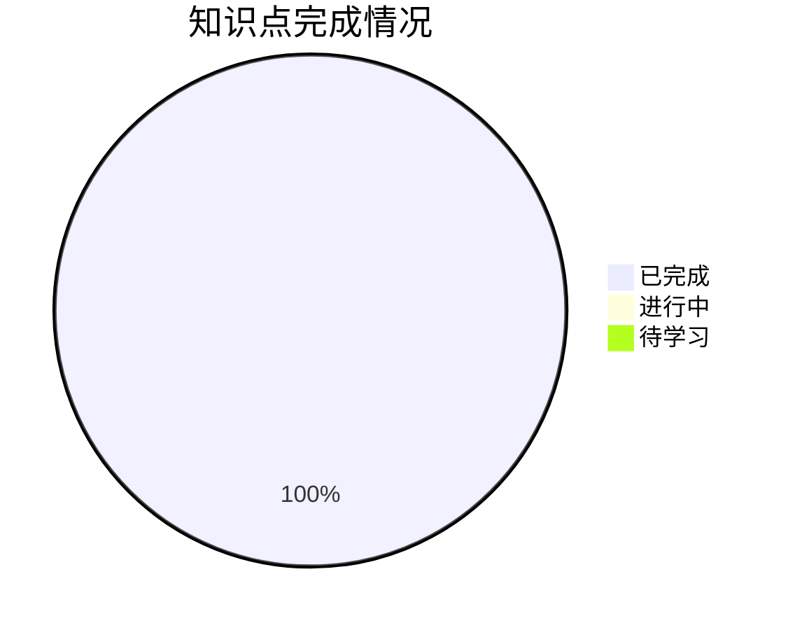

# 一元微分学的概念 - 学习进度

## 📊 总体进度

| 统计项 | 数量 |
|--------|------|
| 总知识点 | 13 |
| 已完成 | 13 |
| 进行中 | 0 |
| 待学习 | 0 |
| **完成率** | **100%** ✅ |

---

## 📋 详细进度

### 1-导数 (6/6) ✅

| 知识点 | 状态 | 开始日期 | 完成日期 | 备注 |
|--------|------|----------|----------|------|
| [[导数的定义]] | ✅ 已完成 | 2026-03-15 | 2026-03-15 | 核心概念 |
| [[单侧导数]] | ✅ 已完成 | 2026-03-15 | 2026-03-15 | 可导充要条件基础 |
| [[可导的充要条件]] | ✅ 已完成 | 2026-03-15 | 2026-03-15 | ⭐ 考研必考 |
| [[可导的必要条件]] | ✅ 已完成 | 2026-03-15 | 2026-03-15 | 可导→连续 |
| [[导数与函数性质]] | ✅ 已完成 | 2026-03-15 | 2026-03-15 | 奇偶性、周期性 |
| [[绝对值函数的可导性]] | ✅ 已完成 | 2026-03-15 | 2026-03-15 | 常见题型 |

### 2-导数的几何意义 (2/2) ✅

| 知识点 | 状态 | 开始日期 | 完成日期 | 备注 |
|--------|------|----------|----------|------|
| [[切线与法线]] | ✅ 已完成 | 2026-03-16 | 2026-03-16 | ⭐ 几何应用核心 |
| [[特殊情况]] | ✅ 已完成 | 2026-03-17 | 2026-03-17 | 角点、无穷导数 |

### 3-高阶导数 (2/2) ✅ ⭐数学二必考

| 知识点 | 状态 | 开始日期 | 完成日期 | 备注 |
|--------|------|----------|----------|------|
| [[高阶导数的定义]] | ✅ 已完成 | 2026-03-17 | 2026-03-17 | ⭐⭐⭐⭐⭐ |
| [[高阶导数的性质]] | ✅ 已完成 | 2026-03-17 | 2026-03-17 | 极值判定应用 |

### 4-微分的概念 (3/3) ✅ ⭐可导↔可微

| 知识点 | 状态 | 开始日期 | 完成日期 | 备注 |
|--------|------|----------|----------|------|
| [[微分的定义]] | ✅ 已完成 | 2026-03-17 | 2026-03-17 | 线性主部 |
| [[可微与可导的关系]] | ✅ 已完成 | 2026-03-17 | 2026-03-17 | ⭐⭐⭐⭐⭐ 充要条件 |
| [[微分的几何意义]] | ✅ 已完成 | 2026-03-17 | 2026-03-17 | 切线近似 |

---

## 📅 学习计划

### 本周目标
- [x] 完成 1-导数 模块学习 ✅
- [x] 学习切线与法线 ✅
- [x] 完成 2-导数的几何意义 模块 ✅
- [x] 完成 3-高阶导数 模块 ✅
- [x] 完成 4-微分的概念 模块 ✅
- [x] **一元微分学的概念全部完成！** 🎉

### 下周目标
- [ ] 开始一元微分学的运算模块

---

## 📝 错题记录

| 日期 | 题目类型 | 错误原因 | 相关知识点 | 复习状态 |
|------|----------|----------|------------|----------|
| 2026-03-16 | 综合错题10道 | 待分析 | 多个模块 | ⏳ 待复习 |
| 2026-03-17 | 错题8道 | 待分析 | 高阶导数/微分 | ⏳ 待复习 |

---

## 🧠 学习心得

> [!personal] 我的理解
> <!-- 记录学习过程中的感悟和理解 -->

> [!personal] 踩坑记录
> <!-- 记录容易犯的错误 -->

---

*创建日期: 2026-03-14*
*最后更新: 2026-03-21 (完成概念模块复习+10道错题)*

---

## 📝 学习记录

### 2026-03-21
- 🔄 **概念模块复习**
- ⏱️ 复习用时：78分钟（含错题练习）
- 📌 复习内容：
  - 1-导数（6个知识点）：导数定义、单侧导数、可导充要条件、可导必要条件、导数与函数性质、绝对值函数可导性
  - 2-导数的几何意义（2个知识点）：切线与法线、特殊情况
  - 3-高阶导数（2个知识点）：高阶导数定义、高阶导数性质
  - 4-微分的概念（3个知识点）：微分定义、可微与可导关系、微分几何意义
- 📌 错题练习：10道题

### 2026-03-20
- 🔄 **概念模块复习**
- ⏱️ 复习用时：140分钟（含错题练习）
- 📌 复习内容：
  - 1-导数（6个知识点）：导数定义、单侧导数、可导充要条件、可导必要条件、导数与函数性质、绝对值函数可导性
  - 2-导数的几何意义（2个知识点）：切线与法线、特殊情况
  - 3-高阶导数（2个知识点）：高阶导数定义、高阶导数性质
  - 4-微分的概念（3个知识点）：微分定义、可微与可导关系、微分几何意义
- 📌 错题练习：10道题

### 2026-03-17
