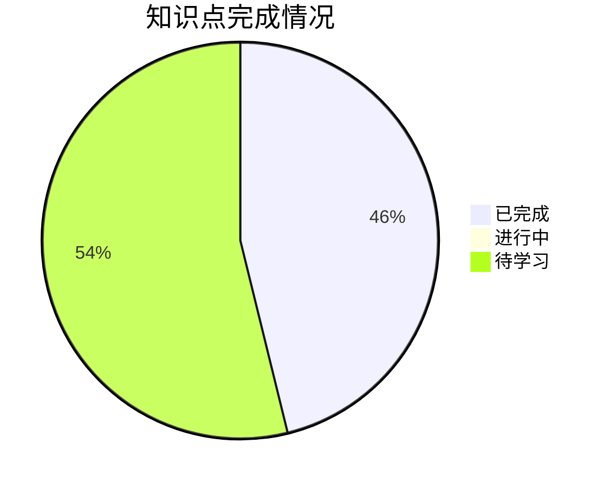

# 一元微分学的概念 - 学习进度

## 📊 总体进度

| 统计项 | 数量 |
|--------|------|
| 总知识点 | 13 |
| 已完成 | 6 |
| 进行中 | 0 |
| 待学习 | 7 |
| **完成率** | **46.2%** |

---

## 📋 详细进度

### 1-导数 (6/6) ✅

| 知识点 | 状态 | 开始日期 | 完成日期 | 备注 |
|--------|------|----------|----------|------|
| [[导数的定义]] | ✅ 已完成 | 2026-03-15 | 2026-03-15 | 核心概念 |
| [[单侧导数]] | ✅ 已完成 | 2026-03-15 | 2026-03-15 | 可导充要条件基础 |
| [[可导的充要条件]] | ✅ 已完成 | 2026-03-15 | 2026-03-15 | ⭐ 考研必考 |
| [[可导的必要条件]] | ✅ 已完成 | 2026-03-15 | 2026-03-15 | 可导→连续 |
| [[导数与函数性质]] | ✅ 已完成 | 2026-03-15 | 2026-03-15 | 奇偶性、周期性 |
| [[绝对值函数的可导性]] | ✅ 已完成 | 2026-03-15 | 2026-03-15 | 常见题型 |

### 2-导数的几何意义 (0/2)

| 知识点 | 状态 | 开始日期 | 完成日期 | 备注 |
|--------|------|----------|----------|------|
| [[切线与法线]] | ⬜ 待学习 | - | - | ⭐ 几何应用核心 |
| [[特殊情况]] | ⬜ 待学习 | - | - | 角点、无穷导数 |

### 3-高阶导数 (0/2) ⭐数学二必考

| 知识点 | 状态 | 开始日期 | 完成日期 | 备注 |
|--------|------|----------|----------|------|
| [[高阶导数的定义]] | ⬜ 待学习 | - | - | ⭐⭐⭐⭐⭐ |
| [[高阶导数的性质]] | ⬜ 待学习 | - | - | 极值判定应用 |

### 4-微分的概念 (0/3) ⭐可导↔可微

| 知识点 | 状态 | 开始日期 | 完成日期 | 备注 |
|--------|------|----------|----------|------|
| [[微分的定义]] | ⬜ 待学习 | - | - | 线性主部 |
| [[可微与可导的关系]] | ⬜ 待学习 | - | - | ⭐⭐⭐⭐⭐ 充要条件 |
| [[微分的几何意义]] | ⬜ 待学习 | - | - | 切线近似 |

---

## 📅 学习计划

### 本周目标
- [ ] 完成 1-导数 模块学习
- [ ] 理解导数定义的两种形式

### 下周目标
- [ ] 完成 2-导数的几何意义 模块
- [ ] 开始 3-高阶导数 模块

---

## 📝 错题记录

| 日期 | 题目类型 | 错误原因 | 相关知识点 | 复习状态 |
|------|----------|----------|------------|----------|
| - | - | - | - | - |

---

## 🧠 学习心得

> [!personal] 我的理解
> <!-- 记录学习过程中的感悟和理解 -->

> [!personal] 踩坑记录
> <!-- 记录容易犯的错误 -->

---

*创建日期: 2026-03-14*
*最后更新: 2026-03-14*
