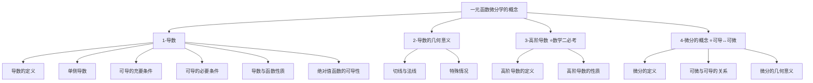

---
aliases:
  - 一元函数微分学的概念
  - 第三章
tags:
  - 考研数学
  - 高等数学
  - 一元微分学
---

# 一元函数微分学的概念

> [!info] 模块概述
> 本章研究一元函数微分学的基本概念，包括导数、高阶导数、微分等核心内容。这些概念是整个微积分的基石，也是考研数学的必考内容。

## 📋 章节结构

## 📚 知识点导航

### 1-导数

| 序号 | 知识点 | 重要程度 | 学习状态 |
|------|--------|----------|----------|
| 1.1 | [[导数的定义\|导数的定义]] | ⭐⭐⭐⭐⭐ | 待学习 |
| 1.2 | [[单侧导数\|单侧导数]] | ⭐⭐⭐⭐ | 待学习 |
| 1.3 | [[可导的充要条件\|可导的充要条件]] | ⭐⭐⭐⭐⭐ | 待学习 |
| 1.4 | [[可导的必要条件\|可导的必要条件]] | ⭐⭐⭐⭐ | 待学习 |
| 1.5 | [[导数与函数性质\|导数与函数性质]] | ⭐⭐⭐ | 待学习 |
| 1.6 | [[绝对值函数的可导性\|绝对值函数的可导性]] | ⭐⭐⭐⭐ | 待学习 |

### 2-导数的几何意义

| 序号 | 知识点 | 重要程度 | 学习状态 |
|------|--------|----------|----------|
| 2.1 | [[切线与法线\|切线与法线]] | ⭐⭐⭐⭐⭐ | 待学习 |
| 2.2 | [[特殊情况\|特殊情况]] | ⭐⭐⭐ | 待学习 |

### 3-高阶导数 ⭐数学二必考

| 序号 | 知识点 | 重要程度 | 学习状态 |
|------|--------|----------|----------|
| 3.1 | [[高阶导数的定义\|高阶导数的定义]] | ⭐⭐⭐⭐⭐ | 待学习 |
| 3.2 | [[高阶导数的性质\|高阶导数的性质]] | ⭐⭐⭐⭐ | 待学习 |

### 4-微分的概念 ⭐可导↔可微

| 序号 | 知识点 | 重要程度 | 学习状态 |
|------|--------|----------|----------|
| 4.1 | [[微分的定义\|微分的定义]] | ⭐⭐⭐⭐⭐ | 待学习 |
| 4.2 | [[可微与可导的关系\|可微与可导的关系]] | ⭐⭐⭐⭐⭐ | 待学习 |
| 4.3 | [[微分的几何意义\|微分的几何意义]] | ⭐⭐⭐ | 待学习 |

## 🎯 考试要点

### 题型分布
- **选择题**：导数概念、可导条件判断
- **填空题**：高阶导数计算、微分计算
- **解答题**：导数几何意义应用

### 重难点
1. ⭐⭐⭐⭐⭐ **高阶导数的计算**
2. ⭐⭐⭐⭐⭐ **导数几何意义的应用**
3. ⭐⭐⭐⭐⭐ **可导充要条件的应用**

## 🔗 相关章节

- 前置知识：[[../高数-极限与连续/📑 索引|极限与连续]]
- 后续章节：[[../高数-一元微分学的计算/📑 索引|一元微分学的计算]]
- 应用章节：[[../高数-微分中值定理/📑 索引|微分中值定理]]

## 📝 学习笔记

> [!personal] 我的学习心得
> <!-- 记录你的学习体会和难点 -->

---

*创建日期: 2026-03-14*
*最后更新: 2026-03-14*
