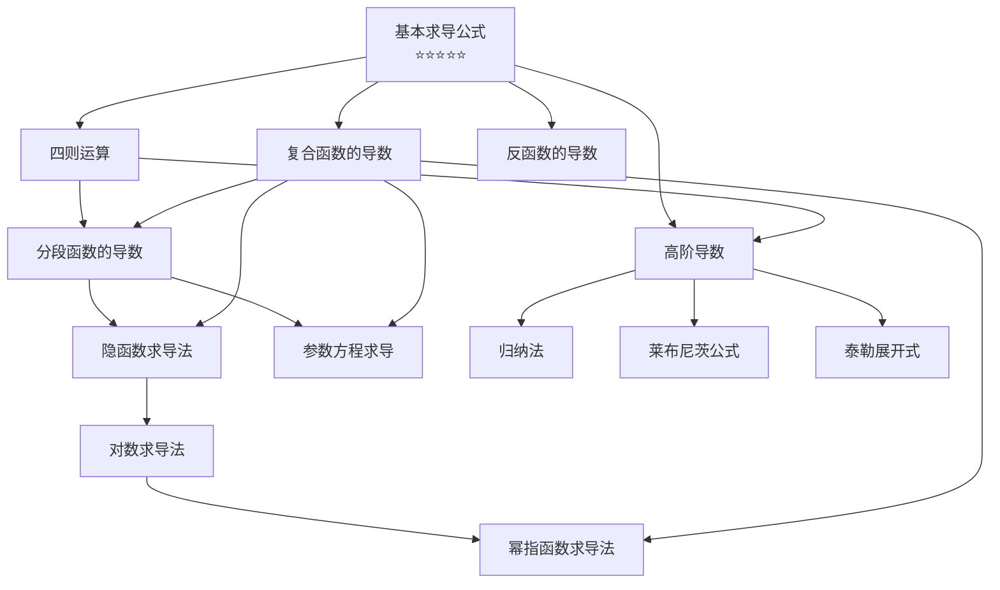

# 📑 一元微分学的计算 - 索引

> [!info] 模块概述
> 本模块涵盖一元函数微分学的**计算方法**，是考研数学的核心计算能力。与上一讲（概念）相呼应，本模块重点在于**熟练掌握各种求导技巧**。
>
> **核心目标**：学会熟练地计算导数，做到"倒背如流"。

---

## 🗺️ 知识点导航

### 基础层

| 序号 | 知识点 | 考试频率 | 学习状态 | 笔记链接 |
|:----:|--------|:--------:|:--------:|----------|
| 1 | 基本求导公式 | ⭐⭐⭐⭐⭐ | 待学习 | [[1-基本求导公式/基本求导公式]] |
| 2 | 四则运算 | ⭐⭐⭐⭐⭐ | 待学习 | [[2-四则运算/四则运算]] |
| 3 | 复合函数的导数 | ⭐⭐⭐⭐⭐ | 待学习 | [[3-复合函数的导数/链式求导法则]] |
| 4 | 分段函数的导数 | ⭐⭐⭐⭐ | 待学习 | [[4-分段函数的导数/分段函数的导数]] |
| 5 | 反函数的导数 | ⭐⭐⭐⭐ | 待学习 | [[5-反函数的导数/反函数的一阶导数]] |

### 进阶层

| 序号 | 知识点 | 考试频率 | 学习状态 | 笔记链接 |
|:----:|--------|:--------:|:--------:|----------|
| 6 | 隐函数求导法 | ⭐⭐⭐⭐ | 待学习 | [[6-隐函数求导法/隐函数求导法]] |
| 7 | 参数方程求导 | ⭐⭐⭐⭐⭐ | 待学习 | [[7-参数方程求导/参数方程的一阶导数]] |
| 8 | 对数求导法 | ⭐⭐⭐ | 待学习 | [[8-对数求导法/对数求导法]] |
| 9 | 幂指函数求导法 | ⭐⭐⭐⭐ | 待学习 | [[9-幂指函数求导法/幂指函数求导法]] |

### 高阶层

| 序号 | 知识点 | 考试频率 | 学习状态 | 笔记链接 |
|:----:|--------|:--------:|:--------:|----------|
| 10 | 高阶导数 | ⭐⭐⭐⭐⭐ | 待学习 | [[10-高阶导数/归纳法]] |
| 10.1 | 归纳法 | ⭐⭐⭐⭐ | 待学习 | [[10-高阶导数/归纳法]] |
| 10.2 | 莱布尼茨公式 | ⭐⭐⭐⭐⭐ | 待学习 | [[10-高阶导数/莱布尼茨公式]] |
| 10.3 | 泰勒展开式 | ⭐⭐⭐⭐⭐ | 待学习 | [[10-高阶导数/泰勒展开式]] |

---

## 📚 学习路线

### 推荐学习顺序

1. **第一阶段（基础）**：基本求导公式 → 四则运算 → 复合函数的导数
2. **第二阶段（应用）**：分段函数的导数 → 反函数的导数
3. **第三阶段（进阶）**：隐函数求导法 → 参数方程求导 → 对数求导法 → 幂指函数求导法
4. **第四阶段（综合）**：高阶导数（归纳法 → 莱布尼茨公式 → 泰勒展开式）

---

## 🎯 考试重点

### 必考题型
- [ ] 复合函数求导（链式法则）
- [ ] 分段函数在分段点的导数（用定义求）
- [ ] 隐函数求导
- [ ] 参数方程求导（一阶、二阶）
- [ ] 高阶导数（莱布尼茨公式、泰勒展开）

### 常见陷阱
1. **分段函数**：分段点必须用导数定义求，非分段点用公式
2. **复合函数**：注意 $\{f[g(x)]\}'$ 与 $f'[g(x)]$ 的区别
3. **反函数二阶导**：公式 $\varphi''(y) = -\frac{f''(x)}{[f'(x)]^3}$
4. **参数方程二阶导**：$\frac{d^2y}{dx^2} = \frac{d}{dt}\left(\frac{dy}{dx}\right) \cdot \frac{dt}{dx}$

---

## 🔗 相关模块

- [[../一元微分学的概念/📑 索引|一元微分学的概念]] - 导数的定义与性质
- [[../../高数-极限与连续/📑 索引|极限与连续]] - 导数的基础

---

## 📖 参考资料

- 教材：`/高数资料/第四章：一元函数微分学的计算/full.md`

---

*创建日期: 2026-03-17*
*维护者: Claude Code + 用户协作*
