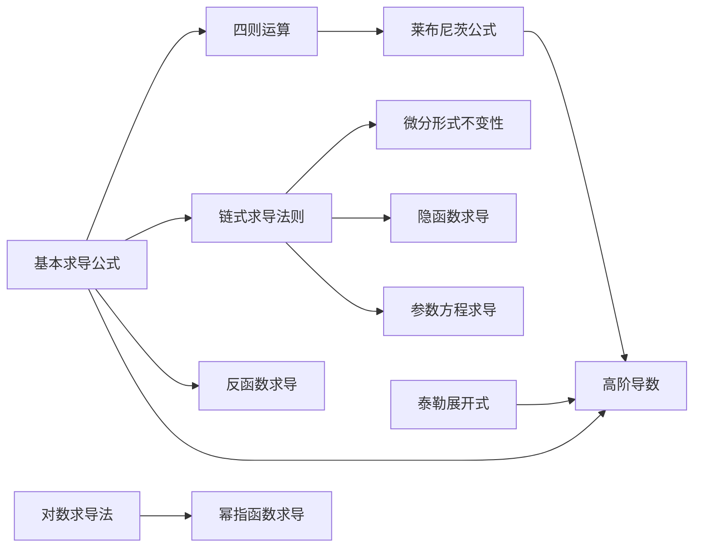

# 📝 一元微分学的计算 - 章节总结

> [!abstract] 章节概述
> 一元微分学的计算是考研数学的**基础核心**，贯穿整个高等数学。本章涵盖10大类求导方法，从基本公式到高阶导数，构成了完整的求导体系。

---

## 📋 知识体系结构

```
一元微分学的计算
├── 基础方法
│   ├── 1. 基本求导公式（必背）
│   ├── 2. 四则运算
│   └── 3. 复合函数求导（链式法则）
├── 特殊函数求导
│   ├── 4. 分段函数的导数
│   ├── 5. 反函数的导数
│   ├── 6. 隐函数求导法
│   └── 7. 参数方程求导
└── 高级技巧
    ├── 8. 对数求导法
    ├── 9. 幂指函数求导法
    └── 10. 高阶导数
        ├── 归纳法
        ├── 莱布尼茨公式
        └── 泰勒展开式
```

---

## 🔑 核心公式速查

### 一、基本求导公式（必背⭐⭐⭐⭐⭐）

| 类型 | 函数 | 导数 |
|------|------|------|
| 幂函数 | $(x^\alpha)'$ | $\alpha x^{\alpha-1}$ |
| 指数函数 | $(a^x)'$ | $a^x \ln a$ |
| | $(e^x)'$ | $e^x$ |
| 对数函数 | $(\log_a x)'$ | $\frac{1}{x\ln a}$ |
| | $(\ln\|x\|)'$ | $\frac{1}{x}$ |
| 三角函数 | $(\sin x)'$ | $\cos x$ |
| | $(\cos x)'$ | $-\sin x$ |
| | $(\tan x)'$ | $\sec^2 x$ |
| | $(\cot x)'$ | $-\csc^2 x$ |
| | $(\sec x)'$ | $\sec x \tan x$ |
| | $(\csc x)'$ | $-\csc x \cot x$ |
| 反三角 | $(\arcsin x)'$ | $\frac{1}{\sqrt{1-x^2}}$ |
| | $(\arccos x)'$ | $-\frac{1}{\sqrt{1-x^2}}$ |
| | $(\arctan x)'$ | $\frac{1}{1+x^2}$ |
| | $(\operatorname{arccot} x)'$ | $-\frac{1}{1+x^2}$ |

> [!tip] 记忆技巧
> - $\sin$ 和 $\cos$ 互为导数，符号交替
> - $\arcsin$ 与 $\arccos$、$\arctan$ 与 $\operatorname{arccot}$ 导数只差符号

**高阶导数规律**：
$$(a^x)^{(n)} = a^x (\ln a)^n, \quad (e^x)^{(n)} = e^x$$

**必记复合形式**：
$$\left[\ln(x + \sqrt{x^2 + 1})\right]' = \frac{1}{\sqrt{x^2 + 1}}, \quad \left[\ln(x + \sqrt{x^2 - 1})\right]' = \frac{1}{\sqrt{x^2 - 1}}$$

> [!warning] 易错提醒
> - $(\ln\|x\|)' = \frac{1}{x}$，**不是** $\frac{1}{\|x\|}$
> - $(\cos x)' = -\sin x$，**有负号**
> - $a^x$ 与 $x^a$ 的导数公式不同（幂指混淆）

---

### 二、四则运算

$$[u \pm v]' = u' \pm v'$$

$$[uv]' = u'v + uv'$$

$$\left[\frac{u}{v}\right]' = \frac{u'v - uv'}{v^2}$$

**三项乘积**：
$$[uvw]' = u'vw + uv'w + uvw'$$

> [!warning] 注意
> 超过三个因式时**不要直接展开**，应另谋他法！

**微分形式**：
$$\mathrm{d}[u \pm v] = \mathrm{d}u \pm \mathrm{d}v, \quad \mathrm{d}[uv] = u\mathrm{d}v + v\mathrm{d}u$$

> [!tip] 口诀
> - 积：前导后不动 + 前不动后导
> - 商：（上导×下 - 上×下导）/ 下的平方

**多因式相乘技巧**：找到在求导点为0的因子，化简后再求导

---

### 三、链式求导法则 ⭐⭐⭐⭐⭐

$$\{f[g(x)]\}' = f'[g(x)] \cdot g'(x)$$

**多层复合**：
- 两层：$f \to u \to x$，$\{f[g(x)]\}' = f'(u) \cdot u'$
- 三层：$f \to u \to v \to x$，$f'_x = f'_u \cdot u'_v \cdot v'_x$

> [!tip] 考试最多3层！

> [!important] 关键区分
> - $\{f[g(x)]\}'$：整体对 $x$ 求导
> - $f'[g(x)]$：对中间变量 $g(x)$ 求导

**微分形式不变性**：
$$\mathrm{d}[f(u)] = f'(u)\mathrm{d}u$$

无论 $u$ 是中间变量还是自变量，形式相同。求微分时逐层展开，每层都要写 $\mathrm{d}$。

---

### 四、分段函数的导数

| 位置 | 方法 |
|------|------|
| **分段点** | 用**导数定义**（求左右导数） |
| **非分段点** | 用**导数公式** |

$$f'_+(x_0) = \lim_{x \to x_0^+} \frac{f(x) - f(x_0)}{x - x_0}, \quad f'_-(x_0) = \lim_{x \to x_0^-} \frac{f(x) - f(x_0)}{x - x_0}$$

**含绝对值函数**：先写成分段函数，再按上述方法处理。
- 分段点有定义 → 用导数定义
- 分段点无定义 → 不用求

---

### 五、反函数的导数 ⭐⭐⭐⭐

**前提条件**：$y = f(x)$ 单调、可导，且 $f'(x) \neq 0$

**一阶导**：
$$\varphi'(y) = \frac{1}{f'(x)}$$

**二阶导**（必背⭐⭐⭐⭐⭐）：
$$\boxed{\varphi''(y) = -\frac{f''(x)}{[f'(x)]^3}}$$

> [!warning] 易错
> 二阶导有**负号**，分母是**三次方**！

---

### 六、隐函数求导法

方程 $F(x,y) = 0$ 确定的 $y = y(x)$：

1. 两边对 $x$ 求导
2. 遇到 $y$ 用链式法则
3. 解出 $y'$

| 含 $y$ 的项 | 求导结果 |
|-------------|----------|
| $y$ | $y'$ |
| $y^2$ | $2yy'$ |
| $xy$ | $y + xy'$ |
| $xy^2$ | $y^2 + 2xyy'$ |
| $e^y$ | $e^y y'$ |
| $\sin y$ | $\cos y \cdot y'$ |

---

### 七、参数方程求导 ⭐⭐⭐⭐⭐

设 $\begin{cases} x = \varphi(t) \\ y = \psi(t) \end{cases}$

**一阶导**：
$$\frac{\mathrm{d}y}{\mathrm{d}x} = \frac{\psi'(t)}{\varphi'(t)} = \frac{y'_t}{x'_t}$$

**二阶导**：
$$\frac{\mathrm{d}^2y}{\mathrm{d}x^2} = \frac{\frac{\mathrm{d}}{\mathrm{d}t}\left(\frac{\mathrm{d}y}{\mathrm{d}x}\right)}{\frac{\mathrm{d}x}{\mathrm{d}t}}$$

> [!tip] 口诀
> "一阶导对 $t$ 求导，再除以 $x$ 对 $t$ 的导数"

> [!warning] 不要背展开公式！
> $$\frac{\mathrm{d}^2y}{\mathrm{d}x^2} = \frac{\psi''(t)\varphi'(t) - \psi'(t)\varphi''(t)}{[\varphi'(t)]^3}$$
> 直接用推导方法更可靠。

---

### 八、对数求导法

适用于多项相乘、相除、开方、乘方的复杂函数：

1. 两边取对数：$\ln y = \ln f(x)$
2. 两边对 $x$ 求导：$\frac{y'}{y} = [\ln f(x)]'$
3. 解出 $y'$：$y' = y \cdot [\ln f(x)]'$

> [!important] 适用场景
> - 多项相乘：$y = f_1(x) \cdot f_2(x) \cdots f_n(x)$
> - 多项相除：$y = \frac{f_1(x) \cdot f_2(x)}{g_1(x) \cdot g_2(x)}$
> - 开方/乘方：$y = \sqrt[n]{\frac{f_1(x)}{f_2(x)}}$

> [!warning] 注意
> 取对数要求 $f(x) > 0$；取对数后变成隐函数求导。

---

### 九、幂指函数求导法

$u(x)^{v(x)}$ 的处理：

$$u^v = e^{v\ln u}$$

$$[u^v]' = u^v \cdot \left(v'\ln u + v \cdot \frac{u'}{u}\right)$$

> [!warning] 常见错误
> - $(x^x)' \neq x \cdot x^{x-1}$（错用幂函数公式）
> - $(x^x)' \neq x^x \ln x$（错用指数函数公式）

> [!tip] 与对数求导法的关系
> 幂指函数也可用对数求导法：取对数 $\ln y = v\ln u$ → 求导 $\frac{y'}{y} = v'\ln u + v \cdot \frac{u'}{u}$ → 解出 $y'$。**两种方法本质相同！**

---

### 十、高阶导数三大方法

#### 方法1：归纳法
逐次求导 → 观察规律 → 写通式（客观题可省略数学归纳法证明）

**常用公式**：

| 函数 | $n$ 阶导数 |
|------|-----------|
| $e^{ax+b}$ | $a^n e^{ax+b}$ |
| $\sin(ax+b)$ | $a^n \sin\left(ax+b + \frac{n\pi}{2}\right)$ |
| $\cos(ax+b)$ | $a^n \cos\left(ax+b + \frac{n\pi}{2}\right)$ |
| $\ln(ax+b)$ | $(-1)^{n-1} a^n \frac{(n-1)!}{(ax+b)^n}$ |
| $\frac{1}{ax+b}$ | $(-1)^n a^n \frac{n!}{(ax+b)^{n+1}}$ |

#### 方法2：莱布尼茨公式 ⭐⭐⭐⭐⭐

$$(uv)^{(n)} = \sum_{k=0}^{n} C_n^k u^{(n-k)} v^{(k)}$$

> [!important] 关键技巧
> 若 $u(x) = x^m$（$m$ 较小），则 $u^{(k)} = 0$（当 $k > m$），公式项数大幅减少！

#### 方法3：泰勒展开式

**核心思想**：比较系数

$$f(x) = \sum_{n=0}^{\infty} \frac{f^{(n)}(0)}{n!} x^n$$

若 $f(x) = \sum_{n=0}^{\infty} a_n x^n$，则 $\frac{f^{(n)}(0)}{n!} = a_n$，所以 $f^{(n)}(0) = n! \cdot a_n$

**常用泰勒展开式速查表** 📐：

| 函数 | 展开式 |
|------|--------|
| $e^x$ | $\sum_{n=0}^{\infty} \frac{x^n}{n!} = 1 + x + \frac{x^2}{2!} + \cdots$ |
| $\frac{1}{1+x}$ | $\sum_{n=0}^{\infty} (-1)^n x^n = 1 - x + x^2 - \cdots$ |
| $\frac{1}{1-x}$ | $\sum_{n=0}^{\infty} x^n = 1 + x + x^2 + \cdots$ |
| $\ln(1+x)$ | $\sum_{n=1}^{\infty} \frac{(-1)^{n-1}}{n} x^n = x - \frac{x^2}{2} + \frac{x^3}{3} - \cdots$ |
| $\sin x$ | $\sum_{n=0}^{\infty} \frac{(-1)^n x^{2n+1}}{(2n+1)!} = x - \frac{x^3}{3!} + \frac{x^5}{5!} - \cdots$ |
| $\cos x$ | $\sum_{n=0}^{\infty} \frac{(-1)^n x^{2n}}{(2n)!} = 1 - \frac{x^2}{2!} + \frac{x^4}{4!} - \cdots$ |
| $(1+x)^\alpha$ | $1 + \alpha x + \frac{\alpha(\alpha-1)}{2!}x^2 + \cdots$ |

**三大方法对比**：

| 方法 | 适用场景 | 特点 |
|------|----------|------|
| **归纳法** | 逐次求导能找到规律 | 通用但可能复杂 |
| **莱布尼茨公式** | 两个函数乘积，其中一个是低次幂函数 | 项数可控 |
| **泰勒展开式** | $x^k \cdot g(x)$ 型，$g(x)$ 有已知展开式 | 比较系数，技巧性强 |

---

## 📊 方法选择指南

| 题目类型 | 推荐方法 |
|---------|----------|
| 基本初等函数 | 直接用基本公式 |
| 复合函数 | 链式求导法则 |
| 多项乘积/商 | 对数求导法 |
| $u(x)^{v(x)}$ | 化为 $e^{v\ln u}$ |
| 方程确定 $y(x)$ | 隐函数求导 |
| 参数方程 | $\frac{y'_t}{x'_t}$ |
| 分段函数分段点 | 导数定义 |
| 反函数求导 | $\varphi'(y) = \frac{1}{f'(x)}$ |
| 高阶导数（乘积+低次幂） | 莱布尼茨公式 |
| 高阶导数（$x^k \cdot g(x)$） | 泰勒展开式 |
| 高阶导数（有规律） | 归纳法 |

---

## ⚠️ 易错点汇总

### 符号错误
1. $(\cos x)' = -\sin x$（有负号）
2. $(\arccos x)' = -\frac{1}{\sqrt{1-x^2}}$（有负号）
3. 反函数二阶导有负号
4. 高阶导中的 $(-1)^n$ 不要漏

### 漏项错误
1. 链式法则漏乘内层导数
2. 隐函数求导漏乘 $y'$
3. 参数方程二阶导漏除 $x'_t$

### 概念混淆
1. $\{f[g(x)]\}' \neq f'[g(x)]$
2. $(\ln\|x\|)' = \frac{1}{x}$，不是 $\frac{1}{\|x\|}$
3. 幂指函数不能直接套幂函数或指数函数公式

### 范围错误
1. 分段点用定义，非分段点用公式
2. 无定义点不用求导
3. 一阶导不存在则二阶导也不存在

---

## 📚 知识点关联



---

## 🎯 考点权重分析

| 知识点 | 频率 | 重要程度 |
|--------|------|----------|
| 链式求导法则 | ⭐⭐⭐⭐⭐ | 基础必考 |
| 参数方程求导 | ⭐⭐⭐⭐⭐ | 必考题型 |
| 莱布尼茨公式 | ⭐⭐⭐⭐⭐ | 高频考点 |
| 泰勒展开求导 | ⭐⭐⭐⭐⭐ | 技巧性强 |
| 隐函数求导 | ⭐⭐⭐⭐ | 常考 |
| 反函数二阶导 | ⭐⭐⭐⭐ | 重要公式 |
| 幂指函数求导 | ⭐⭐⭐⭐ | 常考 |
| 分段函数导数 | ⭐⭐⭐⭐ | 概念考查 |
| 基本求导公式 | ⭐⭐⭐⭐⭐ | 必背基石 |
| 对数求导法 | ⭐⭐⭐ | 乘除化简 |
| 微分形式不变性 | ⭐⭐⭐⭐ | 微分计算 |

---

## 📝 我的理解与笔记

*（在此记录你的学习心得、易错题总结等）*

---

## 🔗 相关链接

- [[📑 索引|模块索引]]
- [[📊 学习进度|学习进度追踪]]
- [[../../一元微分学的概念/📑 索引|一元微分学的概念]]

---

*本总结基于一元微分学计算模块的全部笔记整理生成*
*创建日期: 2026-03-20*
