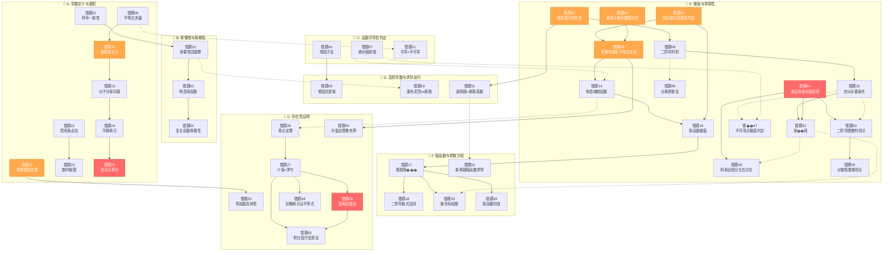
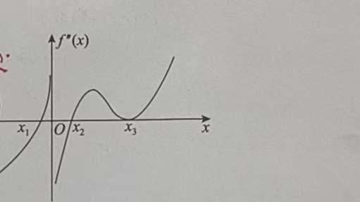

# 高数-一元微分学 · 错题本

> [!info] 本模块错题索引
>
> | 序号 | 错题标题 | 核心陷阱 | 难度 |
> |------|----------|----------|------|
> | [01](#错题01导数定义中的符号陷阱) | 导数定义中的"符号"陷阱 | 自变量增量的一致性、有界函数的导数不一定有界 | ⭐⭐⭐ |
> | [02](#错题02奇偶性周期性与高阶导数综合) | 奇偶性、周期性与高阶导数综合 | 奇偶性"回旋镖"规律、0点特殊性质 | ⭐⭐⭐ |
> | [03](#错题03构造奇函数求高阶导数) | 构造奇函数求高阶导数 | 奇函数偶阶导为0、偶函数奇阶导为0 | ⭐⭐⭐⭐ |
> | [04](#错题04复合函数奇偶性与周期性平移) | 复合函数奇偶性与周期性平移 | "内偶则偶，全奇才奇"、周期回归0点 | ⭐⭐⭐⭐ |
> | [05](#错题05抽象函数的连续性与可导性) | 抽象函数的连续性与可导性 | 不等式锁死函数值、夹逼准则 | ⭐⭐⭐⭐ |
> | [06](#错题06连乘函数在零点处的导数) | 连乘函数在零点处的导数 | 零因子法、掩盖法秒杀 | ⭐⭐⭐⭐ |
> | [07](#错题07含绝对值函数的可导性) | 含绝对值函数的可导性 | 绝对值"脱帽法则"、充要条件等价推导 | ⭐⭐⭐⭐ |
> | [08](#错题08二阶导数极值判别法的证明) | 二阶导数极值判别法的证明（方法对比） | 严格推导 vs 快速判别、保号性应用 | ⭐⭐⭐ |
> | [09](#错题09多因式乘积函数求导) | 多因式乘积函数求导 | 零因式提取法、乘法公式降维 | ⭐⭐⭐⭐ |
> | [10](#错题10导数极限定理证明题) | 导数极限定理（充分不必要） | 洛必达法则中常数导数为0、导函数极限≠导数存在 | ⭐⭐⭐⭐⭐ |
> | [11](#错题11抽象函数可导性的证明) | 抽象函数可导性的证明（双解法） | 泰勒凑导数定义、脱帽法反解函数 | ⭐⭐⭐⭐⭐ |
> | [12](#错题12增量与微分的差极限) | 增量与微分的差求极限 | $\Delta y$与$\mathrm{d}y$的区别、高阶无穷小秒杀 | ⭐⭐⭐ |
> | [13](#错题13抽象函数凑导数定义) | 抽象函数极限凑导数定义 | 分子分母同乘凑结构、根号差式有理化 | ⭐⭐⭐⭐ |
> | [14](#错题14函数单调性与构造函数) | 函数单调性与构造函数 | 逆向构造新函数、平方开方细节 | ⭐⭐⭐ |
> | [15](#错题15极值点的必要条件与充分条件) | 极值点的必要条件与充分条件 | 充分条件vs必要条件逻辑辨析、二阶导数等于0的极值 | ⭐⭐⭐ |
> | [16](#错题16隐函数求导与极值判定) | 隐函数求导与极值判定 | 隐函数二阶导技巧、极值点与极值概念区分 | ⭐⭐⭐⭐ |
> | [17](#错题17参数方程求导与答题规范) | 参数方程求导与答题规范 | 导函数vs导数值、字母表达式何时可作答 | ⭐⭐⭐ |
> | [18](#错题18参数方程求二阶导化简与链式法则陷阱) | 参数方程求二阶导：化简与链式法则陷阱 | 一阶导化简、链式法则漏项 | ⭐⭐⭐ |
> | [19](#错题19乘积函数的高阶导数莱布尼茨与泰勒双解法) | 乘积函数的高阶导数：莱布尼茨与泰勒双解法 | 泰勒展开分母阶乘误写、符号错误 | ⭐⭐⭐⭐ |
> | [20](#错题20分段函数导函数连续性证明) | 分段函数导函数连续性证明 | 极限拆分时误判 g'(x)/x 为 0 | ⭐⭐⭐⭐ |
> | [21](#错题21抽象函数的可导性判定) | 抽象函数的可导性判定 | 可导×不可导=可导时，可导函数必为0 | ⭐⭐⭐⭐ |
> | [22](#错题22抽象函数极限与导数定义禁用洛必达) | 抽象函数极限与导数定义（禁用洛必达） | 洛必达条件验证缺失、导数定义凑项法 | ⭐⭐⭐⭐ |
> | [23](#错题23数列极限中的抽象函数与导数定义) | 数列极限中的抽象函数与导数定义 | 数列离散不可直接洛必达、导函数极限≠导数存在 | ⭐⭐⭐⭐ |
> | [24](#错题24抽象函数极限与切线双解法) | 抽象函数极限与切线（双解法） | 加法拆分≠乘法、平移换元法vs凑配变形法 | ⭐⭐⭐⭐ |
> | [25](#错题25双动点导数定义的拆分与配凑法) | 双动点导数定义的"拆分与配凑"法 | 中插定点拆分、分母对齐分子增量、补偿系数法 | ⭐⭐⭐⭐⭐ |
> | [26](#错题26连续函数存在性证明零点定理构造法) | 连续函数存在性证明（零点定理构造法） | 值域覆盖≠同点相等、缺乏构造函数意识 | ⭐⭐⭐ |
> | [27](#错题27介值定理与罗尔定理综合应用) | 介值定理与罗尔定理综合应用 | 平均值→介值定理找点→罗尔定理凑端点 | ⭐⭐⭐⭐ |
> | [28](#错题28二阶导数零点存在性证明距离函数法) | 二阶导数零点存在性证明（距离函数法） | 直线背景题构造F(x)=f(x)-L(x)、连用两次罗尔定理 | ⭐⭐⭐⭐⭐ |
> | [29](#错题29极值点二阶导数的必要条件带等号) | 极值点二阶导数的必要条件（带等号） | 必要性带等号、充分性不带等号、反例$f(x)=-x^4$ | ⭐⭐⭐ |
> | [30](#错题30绝对值函数的极值与拐点分析) | 绝对值函数的极值与拐点分析 | 定义法判极值、二阶导变号判拐点、不可导点也可为拐点 | ⭐⭐⭐ |
> | [31](#错题31多因式乘积函数的拐点判定) | 多因式乘积函数的拐点判定 | $(x-x_0)^n$ 中 $n$ 为奇数则为拐点、因式分解重组 | ⭐⭐⭐ |
> | [32](#错题32渐近线全面排查与对数变形技巧) | 渐近线全面排查与对数变形技巧 | $\infty-\infty$ 型对数变形、单侧排他性、分左右讨论 | ⭐⭐⭐⭐ |
> | [33](#错题33极坐标绘图与曲线方程转化) | 极坐标绘图与曲线方程转化 | 连续性态分析法、参数方程消元、变量取值范围 | ⭐⭐⭐ |
> | [34](#错题34隐函数在特定点处的切线方程) | 隐函数在特定点处的切线方程 | 复合函数链式法则漏项、$(x+y)' = 1+y'$ | ⭐⭐⭐ |
> | [35](#错题35闭区间端点的最值与单侧导数符号) | 闭区间端点的最值与单侧导数符号 | 右端点$\Delta x$为负导致符号反转、分子分母符号分析法 | ⭐⭐⭐ |
> | [36](#错题36复合函数的极值判定驻点与二阶导) | 复合函数的极值判定（驻点与二阶导） | 内层极值点导数为0消去外层二阶导、外层一阶导符号反转开口方向 | ⭐⭐⭐⭐ |
> | [37](#错题37利用等价无穷小求斜渐近线) | 利用等价无穷小求斜渐近线 | 加减法中严禁局部极限代换、$e^u-1 \sim u$ 整体构造 | ⭐⭐⭐ |
> | [38](#错题38隐函数的驻点与极值判别原地二次求导技巧) | 隐函数的驻点与极值判别（原地二次求导技巧） | 原地求导直接代值、驻点处$y'=0$简化、零封大法 | ⭐⭐⭐⭐ |
> | [39](#错题39二阶可导函数方程根的证明罗尔定理三步找根法) | 二阶可导函数方程根的证明（罗尔定理三步找根法） | 乘积形式双管齐下找根、罗尔定理回马枪、极限条件$f(x)\to 0$ | ⭐⭐⭐⭐⭐ |
> | [40](#错题40开区间内导数有界推函数有界) | 开区间内导数有界推函数有界 | 开区间端点陷阱、内部锚点法、拉格朗日中值定理、**局部vs全局工具选择** | ⭐⭐⭐⭐⭐ |
> | [41](#错题41导数与反函数求导法则含官方解析对比) | 导数与反函数求导法则（含官方解析对比） | 反函数求导倒数关系、变量视角转换、切忌盲目求通解 | ⭐⭐⭐ |
> | [42](#错题42分段点处的二阶导数计算导数定义法vs求导公式法) | 分段点处的二阶导数计算（导数定义法 vs 求导公式法） | 分段点二阶导数用定义法而非求导公式、导函数极限存在是充分不必要条件 | ⭐⭐⭐⭐ |
> | [43](#错题43乘积的高阶导数莱布尼茨公式与单点爆破法) | 乘积的高阶导数（莱布尼茨公式与"单点爆破"法） | $(x-a)^n$在$a$点处的高阶导数过滤、莱布尼茨唯一非零项锁定 | ⭐⭐⭐⭐ |
> | [44](#错题44max函数的分段点可导性判定尖点陷阱) | $\max$函数的分段点可导性判定（尖点陷阱） | 分段点等号不能照搬、左右导数不等→尖点不可导、$\max/\min$去符号 | ⭐⭐⭐ |
> | [45](#错题45数列极限型分段函数连续性与可导性综合) | 数列极限型分段函数连续性与可导性综合 | 先连续后可导、"修桥"比喻、求导消灭常数项丢失连续性信息、导数极限定理充要前提 | ⭐⭐⭐⭐⭐ |
> | [46](#错题46指数函数含参极值点问题参数分离与单调性放缩做错一次4月12) | 指数函数含参极值点问题：参数分离与单调性放缩 | 强解含参对数方程导致符号算崩、应参数分离+指数单调性放缩 | ⭐⭐⭐⭐ |
> | [47](#错题47分段函数不可导点处的极值判定直觉判断单调性陷阱做错一次4月12) | 分段函数不可导点处的极值判定（直觉判断单调性陷阱） | $x\ln x$ 非全局单调递增、不可导点也可为极值点、必须求导验证单调性 | ⭐⭐⭐ |
> | [48](#错题48含参不等式恒成立分离参数法vs硬刚求导策略选择失误做错一次4月12) | 含参不等式恒成立：分离参数法 vs 硬刚求导（策略选择失误） | 含参求导驻点含根号导致代数灾难、分离参数后变无参多项式 | ⭐⭐⭐ |
> | [49](#错题49含绝对值对数函数的斜渐近线分左右讨论与ln性质化简不会做4月12) | 含绝对值对数函数的斜渐近线（分左右讨论与 $\ln$ 性质化简） | 绝对值去法依赖 $x$ 方向、$\ln A - \ln B = \ln\frac{A}{B}$ 化简截距 $b$、等价无穷小 $\ln(1-u) \sim -u$ | ⭐⭐⭐ |
> | [50](#错题50二阶导图像判拐点个数漏掉导数不存在的点做错一次4月12) | 二阶导图像判拐点个数（漏掉导数不存在的点） | 拐点候选点不仅要找 $f''=0$ 还要找 $f''$ 不存在的点、$f''=0$ 但不变号不是拐点 | ⭐⭐⭐ |
> | [51](#错题51曲率圆与泰勒公式系数比对三同性质与12陷阱不会做4月12) | 曲率圆与泰勒公式系数比对（"三同"性质与 $\frac{1}{2!}$ 陷阱） | 曲率圆"三同"白送$f$值+一阶导+二阶导、$o(x^2)$暗示泰勒展开、二次项系数前有$\frac{1}{2!}$ | ⭐⭐⭐⭐ |
> | [52](#错题52导数极限定理全面总结充分不必要条件) | 导数极限定理全面总结 | 导函数极限存在≠导数存在、震荡间断点、分界点求导铁律 | ⭐⭐⭐⭐⭐ |
> | [53](#错题53抽象函数平方差凑导数定义) | 抽象函数极限凑导数定义（平方差公式） | 三项平方展开易漏交叉项、提前丢弃无穷小量 | ⭐⭐ |
> | [54](#错题54裂项拆分与麦克劳林展开求n阶导数) | 裂项拆分与麦克劳林展开求 $n$ 阶导数 | 分式先化简为常数+分式、泰勒系数对比法降维打击 | ⭐⭐⭐⭐ |
| [55](#错题55分数指数幂曲线的拐点判定伪装者陷阱) | 分数指数幂曲线的拐点判定（"伪装者"陷阱） | $y''$ 不存在的点需验证左右变号、奇偶次幂对符号的影响 | ⭐⭐⭐ |
| [56](#错题56抽象函数单调性判定辅助函数构造法) | 抽象函数单调性判定（辅助函数构造法） | "整体法"意识缺失、闲置$f(0)\ge0$条件、$xf'(x)-f(x)$未构造辅助函数 | ⭐⭐⭐ |
| [57](#错题57极限保号性判定极值二阶导数滥用陷阱) | 极限保号性判定极值（"二阶导数滥用"陷阱） | "连续"≠可导、盲目使用二阶导数判别法、保号性+极值定义破局 | ⭐⭐⭐ |
> | [58](#错题58导数单调性与不等式比较构造函数凹凸性中值定理三合一) | 导数单调性与不等式比较（构造函数 + 凹凸性 + 中值定理三合一） | 微观工具vs宏观问题、构造函数看单调性、凹凸性几何意义、拉格朗日中值定理 | ⭐⭐⭐⭐ |
> | [59](#错题59隐函数方程的极值判定符号联动效应) | 隐函数方程的极值判定（符号联动效应） | 驻点代入消一阶、符号联动分析、分类讨论正负 | ⭐⭐⭐⭐ |
> | [60](#错题60带参数函数的最值与数列极限综合1∞型极限) | 带参数函数的最值与数列极限综合（$1^\infty$ 型极限） | 导数提取公因式、$1^\infty$ 型秒杀公式 $\lim(1+\frac{a}{x})^x=e^a$ | ⭐⭐⭐⭐ |
> | [61](#错题61渐近线全流程与绝对值陷阱√x²x) | 渐近线全流程与绝对值陷阱（$\sqrt{x^2}=|x|$） | 绝对值陷阱：$\sqrt{x^2}=|x|$、$x\to\infty$ 必须分正负无穷、渐近线三步搜索 | ⭐⭐⭐⭐⭐ |
> | [62](#错题62曲率圆方程求解几何直觉秒杀法) | 曲率圆方程求解（几何直觉秒杀法） | 驻点秒杀法：$y'=0$ 看 $y''$，上加下减定圆心 | ⭐⭐⭐⭐ |
> | [63](#错题63罗尔定理辅助函数构造积分因子还原法) | 罗尔定理辅助函数构造（积分因子还原法） | 积分因子构造、$a>0$保证$0^a=0$、降阶传递法 | ⭐⭐⭐⭐ |
> | [64](#错题64拉格朗日中值定理证不等式12f2辅助函数) | 拉格朗日中值定理证不等式（$\frac{1}{2}f^2$ 辅助函数） | $\frac{1}{2}f^2$导数还原、不恒为0翻译、定理选择口诀 | ⭐⭐⭐ |
> | [65](#错题65抽象函数不等式选择构造函数法与几何意义秒杀) | 抽象函数不等式选择题（构造函数法与几何意义秒杀） | $\frac{f(x)}{x}$割线斜率、二阶导单调性、"无中生有减f(0)" | ⭐⭐⭐⭐ |
> | [66](#错题66泰勒公式展开对称区间端点相减消元证三阶导数存在) | 泰勒公式展开对称区间端点：相减消元证三阶导数存在 | $x_0=0$展开+端点代入、相减消偶次幂留奇次幂、介值定理桥接两点到一点 | ⭐⭐⭐⭐ |
> | [67](#错题67泰勒公式与定积分结合判定中点函数值符号) | 泰勒公式与定积分结合：判定中点函数值符号 | 中点展开消除一次项积分、余项 $\xi$ 依赖 $x$ 不能提积分号外、切线不等式积分法 | ⭐⭐⭐⭐ |
> | [68](#错题68方程实根个数四步曲标准流程) | 方程实根个数（"四步曲"标准流程） | 奇偶减半、放缩隔离、零点定理证存在、单调导数证唯一、换元消灭分数次幂 | ⭐⭐⭐ |
> | [69](#错题69多项式方程实根个数两步走与以阶数换个数) | 多项式方程实根个数（"两步走"与"以阶数换个数"） | 奇次多项式必有实根、双二次方程换元、判别式 $\Delta < 0$、罗尔定理推论 | ⭐⭐⭐ |
> | [70](#错题70超越方程实根个数存在极限两步走) | 超越方程实根个数（"存在+极限"两步走） | 观察法试根、指数函数后期爆炸、求导遇阻则进、三阶导数定乾坤 | ⭐⭐⭐⭐ |
> | [71](#错题71含参方程实根个数分离参数法vs直接法) | 含参方程实根个数（分离参数法 vs 直接法） | 分离参数+数形结合、水平线扫描法、$y=\frac{\mathrm{e}^x}{x}$ 图像、分类讨论 | ⭐⭐⭐⭐ |
> | [72](#错题72含参方程根的存在唯一性解的数列构造) | 含参方程根的存在唯一性（"解的数列"构造） | 先唯一后存在、单调性+零点定理、"解的数列"概念、夹逼定理求极限 | ⭐⭐⭐ |
>
>
> **更新日期**：2026-05-30

---

## 📚 知识点分类索引

> [!abstract] 按核心考点分类速查
>
> | 分类 | 核心考点 | 错题编号 |
> |------|----------|----------|
> | **A. 导数定义与凑配** | 凑定义、符号对齐、双动点拆分、分段点导数定义法 | [[#错题01]] [[#错题05]] [[#错题10]] [[#错题11]] [[#错题13]] [[#错题22]] [[#错题23]] [[#错题24]] [[#错题25]] [[#错题42]] [[#错题44]] [[#错题45]] [[#错题53]] |
> | **B. 奇偶性与周期性** | 奇偶性回旋镖、0点性质、周期平移 | [[#错题01]] [[#错题02]] [[#错题03]] [[#错题04]] [[#错题68]] |
> | **C. 函数可导性判定** | 不等式夹逼、零因子法、绝对值脱帽、$\max/\min$尖点、先连续后可导 | [[#错题05]] [[#错题06]] [[#错题07]] [[#错题21]] [[#错题44]] [[#错题45]] [[#错题47]] |
> | **D. 高阶导数与求导技巧** | 莱布尼茨、泰勒系数、零因式提取、单点爆破法 | [[#错题02]] [[#错题03]] [[#错题09]] [[#错题19]] [[#错题43]] [[#错题51]] [[#错题54]] |
> | **E. 极值与单调性** | 二阶导判别、构造辅助函数、充分/必要条件、拐点判定 | [[#错题08]] [[#错题14]] [[#错题15]] [[#错题16]] [[#错题29]] [[#错题30]] [[#错题31]] [[#错题32]] [[#错题35]] [[#错题36]] [[#错题38]] [[#错题46]] [[#错题47]] [[#错题48]] [[#错题49]] [[#错题50]] [[#错题55]] [[#错题58]] [[#错题59]] [[#错题60]] [[#错题61]] [[#错题62]] [[#错题65]] [[#错题68]] [[#错题69]] [[#错题71]] |
> | **F. 隐函数与参数方程** | 隐函数求导、参数方程求导、答题规范、极坐标绘图、隐函数求导 | [[#错题16]] [[#错题17]] [[#错题18]] [[#错题33]] [[#错题34]] [[#错题38]] [[#错题41]] [[#错题42]] [[#错题51]] |
> | **G. 存在性证明** | 零点定理、罗尔定理、介值定理、拉格朗日中值定理、辅助函数构造 | [[#错题20]] [[#错题26]] [[#错题27]] [[#错题28]] [[#错题39]] [[#错题40]] [[#错题58]] [[#错题63]] [[#错题64]] [[#错题68]] [[#错题69]] [[#错题70]] [[#错题71]] [[#错题72]] |

---

## 🕸️ 错题关联网络图



> [!tip] 图例说明
> - 🔴 **红色**：最高难度（⭐⭐⭐⭐⭐）
> - 🟠 **橙色**：高难度（⭐⭐⭐⭐）
> - **实线**：强关联（同类型技巧）
> - **虚线**：跨类关联（共通思想）

---

## 错题01：导数定义中的"符号"陷阱

> [!example] 例3.1：导数定义中的"符号"陷阱 ⚠️
> **题目**：以下命题中，错误的是（    ）
>
> (A) 若 $f(x)$ 是可导的偶函数，则 $f'(x)$ 是奇函数
>
> (B) 若 $f(x)$ 是可导的奇函数，则 $f'(x)$ 是偶函数
>
> (C) 若 $f(x)$ 是可导的周期函数，则 $f'(x)$ 也是周期函数
>
> (D) 若 $f(x)$ 是可导的有界函数，则 $f'(x)$ 是有界函数
>
> **正确答案**：(D)

---

> [!personal] 我的卡点 & 错因分析 🧠
>
> **错误位置**：A 选项的推导过程
>
> **错误过程**：
> $$f'(-x) = \lim_{\Delta x \to 0} \frac{f(x-\Delta x) - f(x)}{\Delta x} = f'(x)$$ ❌
>
> **致命伤**：
> > 忽略了自变量增量的一致性！
>
> 根据导数定义：
> $$f'(x) = \lim_{h \to 0} \frac{f(x+h) - f(x)}{h}$$
>
> 在我的式子中：
> - 分子自变量从 $x$ 变成了 $x - \Delta x$，增量是 $-\Delta x$
> - 分母却是 $+\Delta x$
>
> **两者符号相反，差了一个负号！**
>
> **思维误区**：
> | 困惑点 | 表现 |
> |--------|------|
> | **符号一致性** | 没有意识到分母的增量必须与分子中的自变量增量保持一致 |
> | **凑定义意识** | 不知道要主动调整符号来"凑"导数定义的标准形式 |

---

✅ **正确解法**（凑定义法）：

**A 选项验证**：

因为 $f(x)$ 是偶函数，所以 $f(-x) = f(x)$。

$$f'(-x) = \lim_{\Delta x \to 0} \frac{f(-x + \Delta x) - f(-x)}{\Delta x}$$

利用偶函数性质 $f(-x + \Delta x) = f(x - \Delta x)$ 和 $f(-x) = f(x)$：

$$f'(-x) = \lim_{\Delta x \to 0} \frac{f(x - \Delta x) - f(x)}{\Delta x}$$

**关键步骤**：提取负号，凑出标准定义形式

$$f'(-x) = \lim_{\Delta x \to 0} \frac{f(x - \Delta x) - f(x)}{\Delta x} = \mathbf{-1} \cdot \lim_{-\Delta x \to 0} \frac{f(x - \Delta x) - f(x)}{\mathbf{-\Delta x}} = -f'(x)$$

**结论**：$f'(-x) = -f'(x)$，即 $f'(x)$ 是奇函数 ✅

---

**D 选项验证（反例法）**：

> "函数值有界"不代表"变化率（坡度）有界"

**反例 1（根号类）**：
- $f(x) = \sqrt{x}$ 在 $(0, 1]$ 上有界（$0 < f(x) \leq 1$）
- 但 $x \to 0^+$ 时，切线越来越陡
- $f'(x) = \frac{1}{2\sqrt{x}} \to +\infty$（无界）

**反例 2（振荡类）**：
- $f(x) = \sin(x^2)$ 在 $(-\infty, +\infty)$ 上有界（$|f(x)| \leq 1$）
- 但频率越来越快，导数 $f'(x) = 2x\cos(x^2)$ 在 $x \to \infty$ 时无界

**结论**：D 选项错误 ✅（题目问的是哪个命题错误）

---

> [!tip] 💡 归纳总结（避坑指南）
>
> **核心口诀**："原函数求导，奇偶性互换，周期性不变，有界性不一定。"
>
> **函数性质与导数性质对照表**：
>
> | 原函数性质 | 导函数性质 | 结论 |
> |------------|------------|------|
> | 偶函数 | 奇函数 | 互换 |
> | 奇函数 | 偶函数 | 互换 |
> | 周期函数 | 周期函数（同周期） | 不变 |
> | 有界函数 | **不一定有界** | ❌ 无必然关系 |
>
> **凑定义法的核心原则**：
>
> 1. **符号一致性**：分母的增量符号必须与分子中的自变量增量保持一致
> 2. **主动调整**：如果分子增量是 $-\Delta x$，分母也必须是 $-\Delta x$（或提取负号）
> 3. **定义优先**：不管怎么变形，最终要凑成 $\lim \frac{f(x+h)-f(x)}{h}$ 的标准形式
>
> **记住一句话**：
> > 看到分母的 $\Delta x$，一定要检查分子的增量方向是否一致！
>
---

**关联知识点**：[[一元微分学的概念/1-导数/导数的定义|导数的定义]]、[[../高数-函数极限与连续/1-函数概念与性质/函数的性质|函数的奇偶性]]、[[../高数-函数极限与连续/1-函数概念与性质/函数的性质|函数的有界性]]

---

## 错题02：奇偶性、周期性与高阶导数综合

> [!example] 例3.2：奇偶性+周期性+高阶导数综合 ⚠️
> **题目**：$f(x)$ 二阶可导，$T=2$，且为奇函数。已知 $f(\frac{1}{2}) > 0$，$f'(\frac{1}{2}) > 0$。比较 $M = f(-\frac{1}{2})$，$N = f'(\frac{3}{2})$，$K = f''(0)$ 的大小。
>
> **正确答案**：$M < K < N$

---

> [!personal] 我的卡点 & 错因分析 🧠
>
> **核心难点**：如何将"未知点"的值转化到"已知条件"上
>
> **思维路径拆解**：

**【M】原函数的奇偶性转化**

$f(x)$ 是奇函数 $\Rightarrow M = f(-\frac{1}{2}) = -f(\frac{1}{2})$

因为 $f(\frac{1}{2}) > 0$，所以 $\boxed{M < 0}$

---

**【N】导数的周期性 + 奇偶性转化**

**第一步（周期性）**：
$$f'(\frac{3}{2}) \xrightarrow{T=2} f'(\frac{3}{2} - 2) = f'(-\frac{1}{2})$$

**第二步（奇偶性）**：
> $f$ 奇 $\Rightarrow f'$ 偶

所以 $f'(-\frac{1}{2}) = f'(\frac{1}{2})$

因为 $f'(\frac{1}{2}) > 0$，所以 $\boxed{N > 0}$

---

**【K】高阶导数的奇偶性转化（必杀技）**

$$f \text{ 奇} \xrightarrow{\text{求导一次}} f' \text{ 偶} \xrightarrow{\text{求导两次}} f'' \text{ 奇}$$

**关键定理**：若奇函数在 $0$ 点有定义，则 $f(0) = 0$

因为 $f''$ 是奇函数，所以 $\boxed{K = f''(0) = 0}$

---

**结论汇总**：

| 变量 | 转化结果 | 大小关系 |
|------|----------|----------|
| $M$ | $-f(\frac{1}{2})$ | $< 0$ |
| $K$ | $f''(0) = 0$ | $= 0$ |
| $N$ | $f'(\frac{1}{2})$ | $> 0$ |

**最终排序**：$M < K < N$ ✅

---

> [!tip] 💡 归纳总结（避坑指南）
>
> **核心口诀**："奇偶性回旋镖，求导一次变一次，求导两次回原样。"
>
> **1. 奇偶性"回旋镖"规律**：
>
> | 求导次数 | 原函数奇 $\Rightarrow$ 导函数 | 原函数偶 $\Rightarrow$ 导函数 |
> |----------|-------------------------------|-------------------------------|
> | 0 阶 | 奇 | 偶 |
> | 1 阶 | 偶 | 奇 |
> | 2 阶 | 奇 | 偶 |
> | 3 阶 | 偶 | 奇 |
>
> **2. 0 点的特殊性质**：
>
> - $f(x)$ 是奇函数 $\Rightarrow f(0) = 0$（前提：在 $0$ 处有定义）
> - $f(x)$ 是偶函数 $\Rightarrow f'(0) = 0$（前提：在 $0$ 处可导）
>
> **3. 周期性不变**：
>
> - 原函数有周期 $T$ $\Rightarrow$ 各阶导函数周期依然是 $T$
>
> **4. 解题通用策略**：
>
> > 把所有"未知点"转化到题目给出的"已知条件点"上！
>
---

**关联知识点**：[[../高数-函数极限与连续/1-函数概念与性质/函数的性质|函数的奇偶性]]、[[../高数-函数极限与连续/1-函数概念与性质/函数的性质|函数的周期性]]、[[一元微分学的概念/1-导数/导数的定义|导数的定义]]

---

## 错题03：构造奇函数求高阶导数
> [!example] 例3.3：构造奇函数求高阶导数 ⚠️
> **题目**：设 $f(x) = \frac{1}{2^x + 1}$，求 $f^{(4)}(0)$。
>
> **正确答案**：$f^{(4)}(0) = 0$

---

> [!personal] 我的卡点 & 错因分析 🧠
>
> **错误思路**：试图通过商的求导法则硬算 4 阶导数
>
> **致命伤**：
> > 高阶导数（$\ge 3$ 阶）直接求导极易出错，且忽略了 $x=0$ 这个特殊点暗示的奇偶性！
>
---

✅ **正确解法**：构造"中心对称"

**核心思想**：将函数拆解为"奇函数 + 常数"的形式

**Step 1：构造奇函数**

对于 $f(x) = \frac{1}{2^x + 1}$，通过 $\pm \frac{1}{2}$ 来凑：

$$g(x) = f(x) - \frac{1}{2} = \frac{1}{2^x + 1} - \frac{1}{2} = \frac{2 - (2^x + 1)}{2(2^x + 1)} = \frac{1 - 2^x}{2(2^x + 1)}$$

**Step 2：验证奇偶性**

$$g(-x) = \frac{1 - 2^{-x}}{2(2^{-x} + 1)} = \frac{1 - \frac{1}{2^x}}{2(\frac{1}{2^x} + 1)} = \frac{2^x - 1}{2(1 + 2^x)} = -\frac{1 - 2^x}{2(2^x + 1)} = -g(x)$$

所以 $g(x)$ 是 **奇函数** ✅

**Step 3：性质传递**

$$g \text{ 奇} \xrightarrow{\text{求导}} g' \text{ 偶} \xrightarrow{\text{求导}} g'' \text{ 奇} \xrightarrow{\text{求导}} g''' \text{ 偶} \xrightarrow{\text{求导}} g^{(4)} \text{ 奇}$$

**关键结论**：奇函数的 **偶数阶导数** 依然是奇函数！

**Step 4：利用 0 点性质**

因为 $g^{(4)}(x)$ 是奇函数，且在 $x=0$ 有定义，所以：

$$g^{(4)}(0) = 0$$

而 $f^{(4)}(x) = g^{(4)}(x)$（常数 $\frac{1}{2}$ 的导数为 0），所以：

$$\boxed{f^{(4)}(0) = 0}$$

---

> [!tip] 💡 归纳总结（避坑指南）
>
> **核心口诀**："奇函数偶阶导为 0，偶函数奇阶导为 0（均指在 $0$ 点）"
>
> **1. 构造技巧**：
>
> | 函数形式 | 构造方法 | 结果 |
> |----------|----------|------|
> | $f(x) = \frac{1}{a^x + 1}$ | $g(x) = f(x) - \frac{1}{2}$ | 奇函数 |
> | $f(x) = \frac{a^x - 1}{a^x + 1}$ | 已经是奇函数 | 无需构造 |
> | $f(x) = \ln(x + \sqrt{x^2+1})$ | 已经是奇函数 | 反双曲正弦 |
>
> **2. 性质传递规律**：
>
> | 原函数 | 1阶导 | 2阶导 | 3阶导 | 4阶导 | ... |
> |--------|-------|-------|-------|-------|-----|
> | 奇 | 偶 | 奇 | 偶 | 奇 | 交替 |
> | 偶 | 奇 | 偶 | 奇 | 偶 | 交替 |
>
> **3. 0 点导数规律**：
>
> - 奇函数的 **偶数阶** 导数在 $0$ 点为 $0$
> - 偶函数的 **奇数阶** 导数在 $0$ 点为 $0$
>
> **4. 适用场景识别**：
>
> 看到以下组合，优先想奇偶性：
> - 求高阶导数（$\ge 3$ 阶）
> - 求特定点 $x=0$ 处的导数值
> - 函数结构包含 $a^x$ 或 $\ln(\dots)$
>
> **5. 通用构造口诀**：
>
> > 如果函数长得"不完全对称"，尝试给它 $\pm C$（常数）来凑奇偶性！
>
---

**关联知识点**：[[../高数-函数极限与连续/1-函数概念与性质/函数的性质|函数的奇偶性]]、[[一元微分学的概念/1-导数/高阶导数|高阶导数]]、[[一元微分学的概念/1-导数/导数的运算|导数的运算]]

---

## 错题04：复合函数奇偶性与周期性平移

> [!example] 例3.4：复合函数奇偶性 + 周期性平移 ⚠️
> **题目**：设 $f(x) = \sin(\cos x) + \cos(\sin x)$，求 $f^{(5)}(2\pi)$。
>
> **正确答案**：$f^{(5)}(2\pi) = 0$

---

> [!personal] 我的卡点 & 错因分析 🧠
>
> **核心疑问**：是先代入数值（$2\pi$）还是先求导？
>
> **错误逻辑**：
> > 先代入数值。如果 $f(2\pi) = \text{常数}$，那么常数的导数永远是 $0$...
>
> **逻辑崩溃**：这会导致所有点导数都为 $0$，显然错误！
>
> **正确逻辑**：
> > **先求导，后代值**。必须先得到导函数 $f^{(5)}(x)$ 的性质或表达式，最后一步才把 $2\pi$ 代入。
>
> **本质理解**：导数研究的是**过程**（函数在点附近的趋势），而不是静态的点。

---

✅ **正确解法**：性质"降维打击"

**Step 1：判定原函数奇偶性（复合函数口诀）**

**口诀**："内偶则偶，全奇才奇"

| 分项 | 内函数 | 外函数 | 奇偶性判定 |
|------|--------|--------|------------|
| $\sin(\cos x)$ | $\cos x$（偶） | $\sin u$（奇） | 内偶 ⇒ **偶** |
| $\cos(\sin x)$ | $\sin x$（奇） | $\cos u$（偶） | 外偶 ⇒ **偶** |
| $f(x)$ | — | — | 偶 + 偶 = **偶** ✅ |

**结论**：$f(x)$ 是 **偶函数**

---

**Step 2：判定导数奇偶性**

偶函数求导 5 次（奇数次），奇偶性翻转 5 次：

$$\text{偶} \xrightarrow{1次} \text{奇} \xrightarrow{2次} \text{偶} \xrightarrow{3次} \text{奇} \xrightarrow{4次} \text{偶} \xrightarrow{5次} \text{奇}$$

**结论**：$f^{(5)}(x)$ 是 **奇函数** ✅

---

**Step 3：利用周期性平移到 0 点**

$f(x)$ 周期为 $2\pi$ $\Rightarrow$ $f^{(5)}(x)$ 周期也是 $2\pi$

$$f^{(5)}(2\pi) = f^{(5)}(2\pi - 2\pi) = f^{(5)}(0)$$

---

**Step 4：利用奇函数性质**

因为 $f^{(5)}(x)$ 是奇函数，且在 $0$ 点有定义，所以：

$$\boxed{f^{(5)}(0) = 0 \Rightarrow f^{(5)}(2\pi) = 0}$$

---

> [!tip] 💡 归纳总结（避坑指南）
>
> **核心口诀**："内偶则偶，全奇才奇"
>
> **1. 复合函数奇偶性判定**：
>
> | 内函数 | 外函数 | 复合结果 |
> |--------|--------|----------|
> | 偶 | 任意 | **偶**（内偶则偶） |
> | 奇 | 奇 | **奇**（全奇才奇） |
> | 奇 | 偶 | **偶** |
>
> **2. 四则运算奇偶性**：
>
> - 奇 ± 奇 = 奇，偶 ± 偶 = 偶
> - 奇 × 奇 = 偶，偶 × 偶 = 偶，奇 × 偶 = 奇
>
> **3. 周期性平移口诀**：
>
> > 看到 $x = 2\pi, \pi, T$ 附近的求导，第一反应用周期性回归到 $0$ 点！
>
> **4. 解题条件反射**：
>
> | 求导位置 | 第一反应 |
> |----------|----------|
> | $x = 0$ 附近 | 找**奇偶性** |
> | $x = 2\pi, \pi, T$ 附近 | 找**周期性**回归到 $0$ 点 |
> | 复合函数 | 口诀"内偶则偶，全奇才奇" |
>
> **5. 偶函数的 0 点性质**：
>
> - 偶函数的 **奇数阶** 导数在 $0$ 点为 $0$
> - 奇函数的 **偶数阶** 导数在 $0$ 点为 $0$
>
---

**关联知识点**：[[../高数-函数极限与连续/1-函数概念与性质/函数的性质|函数的奇偶性]]、[[../高数-函数极限与连续/1-函数概念与性质/函数的性质|函数的周期性]]、[[一元微分学的概念/1-导数/高阶导数|高阶导数]]、[[../高数-函数极限与连续/1-函数概念与性质/复合函数|复合函数]]

---

## 错题05：抽象函数的连续性与可导性

> [!example] 例3.5：抽象函数的连续性与可导性 ⚠️
> **题目**：设 $f(x)$ 在 $x=0$ 的某邻域内有定义，且 $|f(x)| \le 1 - \cos x$，则 $f(x)$ 在 $x=0$ 处：
>
> (A) 极限存在但不连续
> (B) 连续但不可导
> (C) 可导且 $f'(0)=0$
> (D) 可导且 $f'(0) \neq 0$
>
> **正确答案**：(C)

---

> [!personal] 我的卡点 & 错因分析 🧠
>
> **陷阱一：误以为函数值 $f(0)$ 未知**
>
> **我的想法**：题干没给 $f(0)$，所以不知道连不连续。
>
> **真相**：不等式 $|f(x)| \le 1 - \cos x$ 在该邻域内**恒成立**，直接代入 $x=0$：
>
> $$|f(0)| \le 1 - \cos 0 = 0 \implies \boxed{f(0) = 0}$$
>
> **心得**：
> > 看到不等式限制抽象函数，**第一步永远是代入特殊点"锁死"函数值！**
>
> ---
>
> **陷阱二：纠结于左右导数的具体表达式**
>
> **我的想法**：想去算左导数和右导数是否相等，但没有函数式...
>
> **真相**：处理抽象函数导数，**唯一出路是"导数定义"**，直接写出定义式并套用绝对值进行"夹逼"。
>
---

✅ **正确解法**：标准"三步走"

**Step 1：锁死函数值 + 证明连续**

代入 $x=0$：
$$|f(0)| \le 1 - \cos 0 = 0 \implies f(0) = 0$$

证明连续（夹逼法）：
$$\lim_{x \to 0} |f(x)| \le \lim_{x \to 0} (1 - \cos x) = 0$$

由 $0 \le |f(x)| \le 0$ 得 $\lim_{x \to 0} f(x) = 0 = f(0)$

**结论**：$f(x)$ 在 $x=0$ 处 **连续** ✅

---

**Step 2：套用导数定义**

$$f'(0) = \lim_{x \to 0} \frac{f(x) - f(0)}{x - 0} = \lim_{x \to 0} \frac{f(x)}{x}$$

---

**Step 3：绝对值夹逼**

$$0 \le \left| \frac{f(x)}{x} \right| = \frac{|f(x)|}{|x|} \le \frac{1 - \cos x}{|x|}$$

**关键**：利用等价无穷小

$$\frac{1 - \cos x}{|x|} \sim \frac{\frac{1}{2}x^2}{|x|} = \frac{1}{2}|x| \xrightarrow{x \to 0} 0$$

根据夹逼准则：
$$\lim_{x \to 0} \left| \frac{f(x)}{x} \right| = 0 \implies \lim_{x \to 0} \frac{f(x)}{x} = 0$$

**结论**：$f'(0) = 0$ ✅，选 **(C)**

---

> [!tip] 💡 归纳总结（避坑指南）
>
> **核心口诀**："不等式锁函数值，绝对值套夹逼法"
>
> **1. 抽象函数解题第一招**：
>
> > 看到不等式 $|f(x)| \le g(x)$，**立即代入特殊点**（如 $x=0$）锁死函数值！
>
> **2. 绝对值大法**：
>
> - 证明极限为 $0$ 时，给整体套上绝对值
> - 好处：避开讨论 $x$ 从左边还是右边趋近，**一步到位**
>
> **3. 秒杀技巧——高阶必为 0**：
>
> 若已知 $|f(x) - f(0)| \le |x|^k$ 且 $k > 1$，则 $f(x)$ 在该点**必可导且 $f'(0) = 0$**
>
> | 右侧形式 | 等价无穷小 | 幂次 | 结论 |
> |----------|------------|------|------|
> | $1 - \cos x$ | $\frac{1}{2}x^2$ | $2 > 1$ | $f'(0) = 0$ |
> | $\sin^2 x$ | $x^2$ | $2 > 1$ | $f'(0) = 0$ |
> | $x^3$ | $x^3$ | $3 > 1$ | $f'(0) = 0$ |
> | $\vert x\vert$ | $\vert x\vert$ | $1 = 1$ | **不能确定** |
>
> **4. 连续性判定优先级**：
>
> 1. 先证明 $f(0)$ 存在（锁死函数值）
> 2. 再证明 $\lim_{x \to 0} f(x)$ 存在且等于 $f(0)$
> 3. 最后套用导数定义 + 夹逼
>
---

**关联知识点**：[[一元微分学的概念/1-导数/导数的定义|导数的定义]]、[[../高数-函数极限与连续/2-极限概念与性质/夹逼准则|夹逼准则]]、[[../高数-函数极限与连续/3-无穷小与无穷大/等价无穷小|等价无穷小]]、[[../高数-函数极限与连续/4-连续与间断/连续性|连续性]]

---

## 错题06：连乘函数在零点处的导数

> [!example] 例3.6：连乘函数在零点处的导数 ⚠️
> **题目**：设函数 $f(x) = (\mathrm{e}^{x} - 1)(\mathrm{e}^{2x} - 2)\dots (\mathrm{e}^{nx} - n)$，其中 $n$ 为正整数，求 $f^{\prime}(0)$。
>
> **正确答案**：$f^{\prime}(0) = (-1)^{n-1}(n-1)!$

---

> [!personal] 我的卡点 & 错因分析 🧠
>
> **致命错误**：计算 $f(0)$ 时发生"逻辑串号"
>
> **我写对了开头**：
> $$f(0) = (1-1)(1-2)\dots(1-n)$$
>
> **致命的错误**：
> > 我得出 $f(0) = (-1)^n(n-1)!$ ❌
>
> **真相**：
> > 第一项 $(1-1)$ 已经等于 **0** 了！$0$ 乘任何有限数都等于 $0$！
>
> **根本原因**：
> > 把"求导后的结果"和"代入原函数的值"搞混了
>
> **正确结果**：$\boxed{f(0) = 0}$
>
---

✅ **正确解法**：两种高效套路

**方法一：导数定义法**（最本质，专治花里胡哨）

既然 $f(0) = 0$，直接掏出导数定义式：

$$f^{\prime}(0) = \lim_{x \to 0} \frac{f(x) - f(0)}{x - 0} = \lim_{x \to 0} \frac{(\mathrm{e}^{x} - 1)(\mathrm{e}^{2x} - 2)\dots(\mathrm{e}^{nx} - n)}{x}$$

**核心技巧**：等价替换

当 $x \to 0$ 时：
- 第一项 $\mathrm{e}^{x} - 1 \sim x$（它是导致分子为 0 的"罪魁祸首"）
- 其他项都是**非零常数**

$$f^{\prime}(0) = \lim_{x \to 0} \frac{x}{x} \cdot \lim_{x \to 0} [(\mathrm{e}^{2x} - 2)\dots(\mathrm{e}^{nx} - n)]$$

$$f^{\prime}(0) = 1 \cdot (1-2)(1-3)\dots(1-n) = (-1)(-2)\dots(-(n-1))$$

**符号判定**：从 $-1$ 到 $-(n-1)$，共 $n-1$ 项

$$\boxed{f^{\prime}(0) = (-1)^{n-1}(n-1)!}$$

---

**方法二：零因子分组法**（最快速，秒杀连乘）⚡

把函数分成两部分：

| 分组 | 定义 | $x=0$ 时的值 |
|------|------|--------------|
| 零因子 | $u(x) = \mathrm{e}^{x} - 1$ | $u(0) = 0$ |
| 非零因子 | $g(x) = (\mathrm{e}^{2x} - 2)\dots(\mathrm{e}^{nx} - n)$ | $g(0) \neq 0$ |

所以 $f(x) = u(x)g(x)$

利用乘积求导法则：
$$f^{\prime}(x) = u^{\prime}(x)g(x) + u(x)g^{\prime}(x)$$

代入 $x=0$：
$$f^{\prime}(0) = u^{\prime}(0)g(0) + \underbrace{u(0)}_{=0}g^{\prime}(0)$$

**关键**：因为 $u(0) = 0$，后面那一整大坨**直接变成 0**，连算都不用算！

$$f^{\prime}(0) = u^{\prime}(0)g(0) = \mathrm{e}^0 \cdot g(0) = 1 \cdot (-1)^{n-1}(n-1)!$$

---

> [!tip] 💡 归纳总结（避坑指南）
>
> **核心口诀**："零因子求导，非零因子代值"
>
> **1. 零因子法 / 掩盖法（秒杀技巧）**：
>
> > 如果在求导点 $x_0$ 处，连乘式子中**恰好有且仅有一项为 0**（即单根）：
> > - 直接把这一项"捂住"（单独求导）
> > - 剩下的项**直接代入** $x_0$ 计算
>
> | 分组 | 定义 | $x=0$ 时的值 |
> |------|------|--------------|
> | 零因子 | $u(x) = \mathrm{e}^{x} - 1$ | $u(0) = 0$ |
> | 非零因子 | $g(x) = (\mathrm{e}^{2x} - 2)\dots(\mathrm{e}^{nx} - n)$ | $g(0) \neq 0$ |
>
> 所以 $f(x) = u(x)g(x)$
>
> **公式化**：
> $$f^{\prime}(x) = u^{\prime}(x)g(x) + u(x)g^{\prime}(x)$$
>
> **2. 连乘函数求导通用流程**：
>
> | 步骤 | 操作 | 目的 |
> |------|------|------|
> | ① | 代入 $x_0$，找出哪个因子为 0 | 定位"零因子" |
> | ② | 零因子单独求导，其余因子直接代值 | 简化计算 |
> | ③ | 验证是否只有**一个**零因子 | 确保单根 |
>
> **3. 常见零因子形式**：
>
> | 零因子 | $x_0$ | 导数值 |
> |--------|-------|--------|
> | $\mathrm{e}^{x} - 1$ | $0$ | $\mathrm{e}^0 = 1$ |
> | $x - a$ | $a$ | $1$ |
> | $\sin x$ | $0, \pi, 2\pi\dots$ | $\cos x_0$ |
> | $\ln(1+x)$ | $0$ | $\frac{1}{1+x}\big|_{x=0} = 1$ |
>
> **4. 验算技巧**：
>
> - 代入前先检查：**有没有因子已经等于 0？**
> - 如果有，不要急着算乘积，先标记它为"零因子"
>
---

**关联知识点**：[[一元微分学的概念/1-导数/导数的定义|导数的定义]]、[[一元微分学的概念/1-导数/导数的运算|导数的运算]]、[[../高数-函数极限与连续/3-无穷小与无穷大/等价无穷小|等价无穷小]]

---

## 错题07：含绝对值函数的可导性
> [!example] 例3.7：含绝对值函数的可导性 ⚠️
> **题目**：设 $f(x)$ 在 $x = a$ 处连续，$F(x) = f(x) | x - a|$，则 $f(a) = 0$ 是 $F(x)$ 在 $x = a$ 处可导的（ ）。
>
> (A) 充要条件
> (B) 充分非必要条件
> (C) 必要非充分条件
> (D) 既非充分又非必要条件
>
> **正确答案**：(A)

---

> [!personal] 我的卡点 & 错因分析 🧠
>
> **问题**：逻辑正确，但**耗时太长**
>
> **我的做法**："双向奔赴"证法
> - 先假设 $f(a)=0$，证了一遍左右导数相等（证明充分性）
> - 又假设 $F(x)$ 可导，反推 $f(a)=0$（证明必要性）
>
> **考场大忌**：
> > 在选择题中，这种把定义式来回写两遍的写法**极其浪费时间**！
>
> **更高效的方法**：
> > "充要条件"可以通过**等价推导（$\iff$）一气呵成**，不用分两步证！
>
---

✅ **正确解法**：等价推导链条（一气呵成）

**Step 1：写出 $F(x)$ 的分段形式**

$$F(x) = \begin{cases} (x-a)f(x), & x \ge a \\ -(x-a)f(x), & x < a \end{cases}$$

---

**Step 2：交代 $F(a)$ 的值**

显然 $F(a) = f(a)|a-a| = f(a) \cdot 0 = 0$。

> ⚠️ **扣分预警**：导数定义的分子是 $F(x) - F(a)$，**必须先交代 $F(a) = 0$**，否则分子直接写 $f(x)|x-a|$ 属于"凭空消失"，阅卷会扣 1 分。

**Step 3：直接求左右导数的一般表达式**

**右导数**：

因为 $f(x)$ 在 $x=a$ 处**连续**，所以 $\lim_{x \to a^+} f(x) = f(a)$。

$$F_{+}^{\prime}(a) = \lim_{x \to a^+} \frac{(x-a)f(x) - F(a)}{x-a} = \lim_{x \to a^+} \frac{(x-a)f(x) - 0}{x-a} = \lim_{x \to a^+} f(x) = f(a)$$

**左导数**：

同理，$\lim_{x \to a^-} f(x) = f(a)$。

$$F_{-}^{\prime}(a) = \lim_{x \to a^-} \frac{-(x-a)f(x) - F(a)}{x-a} = \lim_{x \to a^-} \frac{-(x-a)f(x) - 0}{x-a} = \lim_{x \to a^-} (-f(x)) = -f(a)$$

> ⚠️ **扣分预警**：$\lim_{x \to a^+} f(x) = f(a)$ 这一步**必须点明**"因为 $f(x)$ 在 $x=a$ 处连续"，不能无声无息地跳过去。题目明确给了连续条件，阅卷老师会检查你是否"物尽其用"，不点明会扣 2-3 分。

---

**Step 4：等价推导链（关键！）**

$$\begin{aligned}
F(x) \text{ 在 } x=a \text{ 处可导}
&\iff F_{-}^{\prime}(a) = F_{+}^{\prime}(a) \\
&\iff -f(a) = f(a) \\
&\iff 2f(a) = 0 \\
&\iff \boxed{f(a) = 0}
\end{aligned}$$

**一次性同时搞定充分性和必要性**，选 **(A)** ✅

---

> [!tip] 💡 归纳总结（避坑指南）
>
> **核心口诀**："绝对值脱帽法则"
>
> **🚀 秒杀定理**：
>
> > 设 $F(x) = \varphi(x) |x - a|$，且 $\varphi(x)$ 在 $x = a$ 处连续。
> > **则 $F(x)$ 在 $x = a$ 处可导 $\iff$ $\varphi(a) = 0$**
>
> **直观理解**：
>
> - 绝对值 $|x-a|$ 在 $x=a$ 处是一个不可导的"尖点"
> - 要让这个尖点变得平滑（可导），就必须在前面乘上一个**在该点等于 0** 的因子，把它强行"压平"
>
> **1. 常见应用场景**：
>
> | 函数形式 | 判定点 | 可导条件 |
> |----------|--------|----------|
> | $f(x)\|x-a\|$ | $x=a$ | $f(a)=0$ |
> | $(x^2-1)\|x-1\|$ | $x=1$ | $(1)^2-1=0$ ✓ 可导 |
> | $\sin x \cdot \|x\|$ | $x=0$ | $\sin 0 = 0$ ✓ 可导 |
> | $(x+1)\|x\|$ | $x=0$ | $0+1=1 \neq 0$ ✗ 不可导 |
>
> **2. 举一反三**：
>
> 判断 $y = (x^2 - 1)|x-1|$ 在 $x=1$ 处是否可导？
> - 令 $\varphi(x) = x^2 - 1$
> - $\varphi(1) = 1^2 - 1 = 0$ ✓
> - **结论**：在 $x=1$ 处**可导**
>
> **3. 选择题充要条件速判**：
>
> - 看到"是...的充要条件"，优先用**等价推导链** $\iff$
> - 不要分两步证（充分性 + 必要性），浪费时间
>
---

**关联知识点**：[[一元微分学的概念/1-导数/导数的定义|导数的定义]]、[[一元微分学的概念/1-导数/左导数与右导数|左导数与右导数]]、[[../高数-函数极限与连续/4-连续与间断/连续性|连续性]]

---


## 错题08：二阶导数极值判别法的证明（方法对比）

> [!example] 二阶导数极值判别法 ⚠️
> **题目**：设 $f(x)$ 在 $x = x_0$ 处二阶可导，且 $f'(x_0) = 0$，$f''(x_0) \neq 0$。证明：
> - 若 $f''(x_0) < 0$，则 $f(x)$ 在 $x_0$ 处取得极大值
> - 若 $f''(x_0) > 0$，则 $f(x)$ 在 $x_0$ 处取得极小值
>
> **类型**：方法对比（非错题）

---

> [!personal] 我的解法 & 方法对比 🧠
>
> **我的方法：严格推导法**（基于二阶导数定义 + 保号性）
>
> 利用二阶导数定义：
> $$f''(x_0) = \lim_{x \to x_0} \frac{f'(x) - f'(x_0)}{x - x_0}$$
>
> 根据极限的**局部保号性**，存在 $x_0$ 的去心邻域 $(x_0 - \delta, x_0 + \delta)$，使得：
> $$\frac{f'(x) - f'(x_0)}{x - x_0} \text{ 与 } f''(x_0) \text{ 符号相同}$$
>
> 因为 $f'(x_0) = 0$，可得：
> $$\frac{f'(x)}{x - x_0} \text{ 与 } f''(x_0) \text{ 符号相同}$$
>
> **推导 $f'(x)$ 的符号变化**：
>
> | 条件 | $x < x_0$（$x - x_0 < 0$） | $x > x_0$（$x - x_0 > 0$） | 极值类型 |
> |------|---------------------------|---------------------------|----------|
> | $f''(x_0) < 0$ | $f'(x) > 0$（正） | $f'(x) < 0$（负） | **极大值** |
> | $f''(x_0) > 0$ | $f'(x) < 0$（负） | $f'(x) > 0$（正） | **极小值** |
>
> **验证**：
> - 极大值：左增右减 ✅
> - 极小值：左减右增 ✅
>
> ---
>
> **官方方法：快速判别法**
> $$f'(x_0) = 0, \quad f''(x_0) \neq 0 \Rightarrow \begin{cases} f''(x_0) < 0 \Rightarrow \text{极大值} \\ f''(x_0) > 0 \Rightarrow \text{极小值} \end{cases}$$
>
> **省略了符号推导，直接给出结论。**
>
---

> [!tip] 💡 方法对比与适用场景
>
> **核心口诀**："二阶导数判极值，负大正小要记牢。"
>
> **两种方法的定位**：
>
> | 方法 | 适用场景 | 优缺点 |
> |------|----------|--------|
> | **严格推导法**（我的方法） | 证明题、理解原理 | 严谨但费时 |
> | **快速判别法**（官方） | 选择题、填空题、计算题 | 快速但跳步 |
>
> **记忆口诀**：
> - $f'' < 0$：开口向下 → **极大值**（像"山峰"）
> - $f'' > 0$：开口向上 → **极小值**（像"山谷"）
>
> **关键原理**：
> > 二阶导数的本质是**一阶导数的变化率**。$f''(x_0) < 0$ 意味着 $f'(x)$ 在 $x_0$ 处"由正变负"（递减），对应原函数"先增后减"，即极大值。
>
> **严格性验证**：
> > 我的方法完全正确，严格基于二阶导数定义和极限的局部保号性。官方方法只是省略了中间推导步骤。
>
> **考场策略**：
> - 选择题/填空题：直接用快速判别法
> - 证明题/大题：用严格推导法（尤其当题目要求"证明"时）
>
---

**关联知识点**：[[一元微分学的概念/1-导数/高阶导数|高阶导数]]、[[../高数-函数极限与连续/2-极限概念与性质/极限的保号性|极限的保号性]]、[[一元微分学的应用/极值与最值|极值判别法]]

---

## 错题09：多因式乘积函数求导
> [!example] 例3.9：多因式乘积函数求导 ⚠️
> **题目**：设
> $$f(x) = \prod_{n = 1}^{100}\left(\tan \frac{\pi x^n}{4} - n\right)$$
> 求 $f'(1)$。
>
> **正确答案**：$f'(1) = -\dfrac{\pi \cdot 99!}{2}$

---

> [!personal] 我的卡点 & 错因分析 🧠
>
> **错误做法**：直接对 100 项使用乘法求导公式
>
> **错误公式**：
> $$(u_1 u_2 \cdots u_{100})' = u_1' u_2 \cdots u_{100} + u_1 u_2' \cdots u_{100} + \cdots + u_1 u_2 \cdots u_{100}'$$
>
> **致命伤**：
> > 100 项逐项求导后代入 $x=1$，计算量巨大，完全不可行！
>
> **根本原因**：
> > 忽略了代入 $x=1$ 时，**第一项为零，其他项不为零**这一关键特征
>
---

**关键观察**：

当 $x=1$ 时：
$$\tan \frac{\pi \cdot 1^n}{4} = \tan \frac{\pi}{4} = 1$$

所以：
- 第一项：$\tan \frac{\pi x}{4} - 1 \big|_{x=1} = 1 - 1 = \mathbf{0}$ ✅
- 第 $n$ 项（$n \ge 2$）：$\tan \frac{\pi}{4} - n = 1 - n \neq 0$ ✅

> 💡 **第一项是零因式，其余都是非零常数！**
>
---

✅ **正确解法**：零因式提取法

**Step 1：拆分函数**

把零因式单独提取出来：

$$f(x) = \underbrace{\left(\tan \frac{\pi x}{4} - 1\right)}_{u(x)} \cdot \underbrace{\prod_{n=2}^{100} \left(\tan \frac{\pi x^n}{4} - n\right)}_{g(x)}$$

其中：
- $u(x) = \tan \frac{\pi x}{4} - 1$，满足 $u(1) = 0$
- $g(x) = \prod_{n=2}^{100} \left(\tan \frac{\pi x^n}{4} - n\right)$

---

**Step 2：套用乘法求导公式**

$$f'(x) = u'(x)g(x) + u(x)g'(x)$$

---

**Step 3：代入 $x=1$**

**第二项消失**：因为 $u(1) = 0$，所以 $u(1)g'(1) = 0$

**第一项计算**：

$$u'(1) = \left(\tan \frac{\pi x}{4} - 1\right)'\bigg|_{x=1} = \sec^2 \frac{\pi x}{4} \cdot \frac{\pi}{4}\bigg|_{x=1} = \sec^2 \frac{\pi}{4} \cdot \frac{\pi}{4}$$

因为 $\sec \frac{\pi}{4} = \sqrt{2}$，所以：
$$u'(1) = (\sqrt{2})^2 \cdot \frac{\pi}{4} = \frac{\pi}{2}$$

**计算 $g(1)$**：

$$g(1) = \prod_{n=2}^{100} \left(\tan \frac{\pi}{4} - n\right) = \prod_{n=2}^{100} (1 - n) = (-1)(-2)\cdots(-99)$$

符号判定：从 $-1$ 到 $-99$，共 $99$ 项负号，所以：
$$g(1) = (-1)^{99} \cdot 99! = -99!$$

---

**Step 4：最终结果**

$$f'(1) = u'(1)g(1) = \frac{\pi}{2} \cdot (-99!) = \boxed{-\frac{\pi \cdot 99!}{2}}$$

---

> [!tip] 💡 归纳总结（避坑指南）
>
> **核心口诀**："多因式乘积求导，先找零因式，拆成两部分，非零直接代。"
>
> **1. 零因式提取法（秒杀技巧）**：
>
> > 面对多因式乘积函数在某点求导：
> > 1. **先代入**该点，找出哪个因子为 0
> > 2. 把零因式单独提取，记为 $u(x)$
> > 3. 剩余因子记为 $g(x)$，**直接代入求值**（不用求导！）
> > 4. 套用两项乘法公式：$f'(x_0) = u'(x_0)g(x_0)$
>
> **2. 为什么只需要对零因式求导？**
>
> $$f'(x) = u'(x)g(x) + u(x)g'(x)$$
>
> 当 $u(x_0) = 0$ 时，第二项 $u(x_0)g'(x_0) = 0$，直接消失！
>
> **所以 $g(x)$ 只需要代入求值，完全不用求导。**
>
> **3. 常见零因式识别**：
>
> | 因式形式 | 零点 | 求导结果 |
> |----------|------|----------|
> | $\tan \frac{\pi x}{4} - 1$ | $x=1$ | $\frac{\pi}{2}$ |
> | $e^x - 1$ | $x=0$ | $1$ |
> | $x - a$ | $x=a$ | $1$ |
> | $\sin x$ | $x=0, \pi, \dots$ | $\cos x_0$ |
>
> **4. 解题条件反射**：
>
> | 看到特征 | 第一反应 |
> |----------|----------|
> | $\prod_{n=1}^{N}$（连乘符号） | 检查代入点是否有零因式 |
> | 100 项、50 项等大数 | 必有技巧，**绝不可能硬算** |
> | 求 $f'(x_0)$ 且 $f(x_0) = 0$ | 零因式法 |
>
> **5. 与错题06的联系**：
>
> 本题与 [[#错题06 连乘函数在零点处的导数]] 的核心思想一致，都是利用零因式简化计算。区别在于：
> - 错题06：指数函数连乘，用等价无穷小或零因子分组
> - 本题：三角函数连乘，直接提取公因式
>
---

**关联知识点**：[[一元微分学的概念/1-导数/导数的运算|导数的运算]]、[[../高数-函数极限与连续/1-函数概念与性质/函数的性质|乘积函数求导]]

---

## 错题10：导数极限定理证明题
> [!example] 导数极限定理（充分不必要条件） ⚠️
> **题目**：若 $F(x)$ 在 $[x_0, x_0+\delta)$ ($\delta > 0$) 连续，且 $F(x)$ 在 $(x_0, x_0+\delta)$ 可导。已知 $\displaystyle\lim_{x \to x_0^+} F'(x) = A$，求证：$F_+'(x_0) = A$。
>
> **类型**：证明题 + 概念理解
> **核心考点**：导数极限定理的单向性（充分不必要）

---

> [!personal] 我的卡点 & 错因分析 🧠
>
> **错误位置**：洛必达法则求导时，对常数项求导出错
>
> **错误过程**：
> 写出右导数定义式：
> $$F_+'(x_0) = \lim_{x \to x_0^+} \frac{F(x) - F(x_0)}{x - x_0}$$
>
> 然后错误地写成：
> $$\lim_{x \to x_0^+} \frac{F'(x) - F'(x_0)}{x - x_0}$$ ❌
>
> **致命伤**：
> > 对分子 $F(x) - F(x_0)$ 求导时，**忽略了 $F(x_0)$ 是一个常数**！常数的导数应该是 $0$，而不是 $F'(x_0)$。
>
> **思维误区**：
> 
> | 困惑点 | 表现 |
> |--------|------|
> | **常数导数** | 看到函数符号 $F(\cdot)$ 就条件反射地求导，忘记判断是否为常数 |
> | **洛必达细节** | 使用洛必达法则时，没有先检查各项是否为常数 |
> | **点与函数混淆** | 把"某点的函数值"当成"函数"来求导 |
>
---

✅ **正确解法**（洛必达法则）：

**Step 1：写出右导数定义**

$$F_{+}^{\prime}(x_0) = \lim_{x \to x_0^{+}}\frac{F(x) - F(x_0)}{x - x_0}$$

---

**Step 2：验证洛必达法则条件（$\frac{0}{0}$ 型）**

因为 $F(x)$ 在 $x_0$ 处右连续，所以 $\displaystyle\lim_{x\to x_0^+} F(x) = F(x_0)$

- 分子：$\lim\limits_{x \to x_0^+} [F(x) - F(x_0)] = 0$
- 分母：$\lim\limits_{x \to x_0^+} (x - x_0) = 0$

满足 $\frac{0}{0}$ 型 ✅

---

**Step 3：使用洛必达法则（上下分别求导）**

$$\lim_{x\to x_0^{+}}\frac{(F(x) - F(x_0))'}{(x - x_0)'}$$

**关键**：常数项导数为 0

$$= \lim_{x\to x_0^{+}}\frac{F'(x) - \mathbf{0}}{1 - \mathbf{0}} = \lim_{x\to x_0^{+}} F'(x)$$

---

**Step 4：代入已知条件得出结论**

已知 $\displaystyle\lim_{x \to x_0^+} F'(x) = A$，所以：

$$\boxed{F_{+}^{\prime}(x_0) = A}$$

证明完毕 ✅

---

> [!tip] 💡 归纳总结（避坑指南）
>
> **核心口诀**："导函数极限存在，该点导数必存在；反之不然。"
>
> **1. 导数极限定理（充分性）**：
>
> > 若 $\displaystyle\lim_{x \to x_0} f'(x)$ 存在（为 $A$），则 $f'(x_0)$ 必存在且等于 $A$。
>
> **前提条件**：
> - $f(x)$ 在 $x_0$ 处连续
> - $f(x)$ 在 $x_0$ 的某去心邻域内可导
>
> **2. 不必要性（重中之重！）**：
>
> > 该点导数存在 $\nRightarrow$ 导函数极限存在
>
> **经典反例**：
> $$f(x) = \begin{cases} x^2 \sin \dfrac{1}{x}, & x \neq 0 \\ 0, & x = 0 \end{cases}$$
>
> - 在 $x=0$ 处导数存在：$f'(0) = 0$ ✅
> - 但导函数极限不存在：$f'(x) = 2x\sin\dfrac{1}{x} - \cos\dfrac{1}{x}$ 包含震荡项 $-\cos\dfrac{1}{x}$，当 $x \to 0$ 时无极限 ❌
>
> **3. 洛必达法则求导细节**：
>
> | 表达式 | 求导结果 | 说明 |
> |--------|----------|------|
> | $F(x) - F(x_0)$ | $F'(x) - \mathbf{0}$ | $F(x_0)$ 是常数 |
> | $x - x_0$ | $1 - \mathbf{0}$ | $x_0$ 是常数 |
> | $f(x) - 1$ | $f'(x) - \mathbf{0}$ | $1$ 是常数 |
> | $g(x) - C$ | $g'(x) - \mathbf{0}$ | $C$ 是常数 |
>
> **4. 第一反应检查清单**：
>
> > 使用洛必达法则前，先问自己：
> > 1. 是 $\frac{0}{0}$ 或 $\frac{\infty}{\infty}$ 型吗？
> > 2. 分子分母中，哪些是常数？常数的导数是 0！
>
> **5. 关键认知**：
>
> > **"点"代入后就是常数**！$f(x_0)$、$g(2)$、$h(a)$ 这些都是具体数值，不是函数，导数为 0。
>
> **6. 充分不必要关系图**：
>
> ```
> 导函数极限存在 ────充分条件───→ 该点导数存在
>        ↗                          ↖
>      不成立                      不成立
>        ↖                          ↗
>      反例：x²sin(1/x)            导数存在≠极限存在
> ```
>
---

**关联知识点**：[[一元微分学的概念/1-导数/导数的定义|导数的定义]]、[[../高数-函数极限与连续/5-极限存在准则/洛必达法则|洛必达法则]]、[[../高数-函数极限与连续/2-极限概念与性质/函数极限与连续|函数的连续性]]

---

## 错题11：抽象函数可导性的证明

> [!example] 抽象函数可导性的证明（双解法对比） ⚠️
> **题目**：设 $\delta > 0$，函数 $f(x)$ 在 $[-\delta, \delta]$ 上有定义，$f(0) = 1$，且满足：
> $$\lim_{x \rightarrow 0} \frac{\ln(1 - 2x) + 2xf(x)}{x^2} = 0$$
> 证明 $f(x)$ 在 $x = 0$ 处可导，并求 $f'(0)$。
>
> **正确答案**：$f'(0) = 1$
> **类型**：证明题 + 双解法对比

---

> [!personal] 我的解法 & 方法对比 🧠
>
> **解法二：脱帽法与函数构造（我的思路）**
>
> **核心思想**：利用极限与等价无穷小的关系，反解出 $f(x)$ 的表达式，直接代入导数定义式。
>
> **Step 1：脱帽法化简条件**
>
> 因为原极限等于 $0$，可设：
> $$\frac{\ln(1-2x) + 2xf(x)}{x^2} = \alpha(x)$$
> 其中当 $x \to 0$ 时，$\alpha(x) \to 0$。
>
> **Step 2：反解 $f(x)$**
>
> $$\ln(1-2x) + 2xf(x) = x^2\alpha(x)$$
> $$f(x) = \frac{x^2\alpha(x) - \ln(1-2x)}{2x}$$
>
> **Step 3：代入导数定义**
>
> $$f'(0) = \lim_{x \to 0} \frac{f(x) - f(0)}{x} = \lim_{x \to 0} \frac{\frac{x^2\alpha(x) - \ln(1-2x)}{2x} - 1}{x}$$
>
> 化简得：
> $$\lim_{x \to 0} \frac{x^2\alpha(x) - \ln(1-2x) - 2x}{2x^2}$$
>
> **Step 4：引入泰勒展开求解**
>
> 将 $\ln(1-2x) = -2x - 2x^2 + o(x^2)$ 代入分子：
> $$\lim_{x \to 0} \frac{x^2\alpha(x) - (-2x - 2x^2 + o(x^2)) - 2x}{2x^2}$$
> $$= \lim_{x \to 0} \frac{x^2\alpha(x) + 2x^2 - o(x^2)}{2x^2}$$
> $$= \lim_{x \to 0} \left( \frac{\alpha(x)}{2} + 1 - \frac{o(x^2)}{2x^2} \right)$$
>
> 因为 $\lim_{x \to 0}\alpha(x) = 0$ 且 $\lim_{x \to 0}\frac{o(x^2)}{2x^2} = 0$，所以：
> $$\boxed{f'(0) = 0 + 1 - 0 = 1}$$ ✅
>
---

✅ **解法一：泰勒展开与代数凑配（官方思路）**

**核心思想**：将已知部分 $\ln(1-2x)$ 进行泰勒展开，直接在分子中凑出导数定义式 $\frac{f(x) - f(0)}{x}$ 的结构。

**Step 1：展开已知函数**

使用带有皮亚诺余项的麦克劳林公式，将 $\ln(1-2x)$ 展开到 $x^2$ 项：
$$\ln(1-2x) = -2x - \frac{1}{2}(-2x)^2 + o(x^2) = -2x - 2x^2 + o(x^2)$$

**Step 2：代入原极限**

$$\lim_{x \rightarrow 0} \frac{-2x - 2x^2 + o(x^2) + 2xf(x)}{x^2} = 0$$

**Step 3：提取公因式凑导数**

观察分子，提取 $2x$，凑出 $f(x) - 1$：
$$\lim_{x \rightarrow 0} \frac{2x(f(x) - 1) - 2x^2 + o(x^2)}{x^2} = 0$$

**Step 4：分离极限并求解**

将分式拆开：
$$\lim_{x \rightarrow 0} \left[ 2 \cdot \frac{f(x) - 1}{x} - 2 + \frac{o(x^2)}{x^2} \right] = 0$$

因为 $f(0) = 1$，所以 $\frac{f(x) - 1}{x} = \frac{f(x) - f(0)}{x}$。

由于 $\lim_{x \to 0} \frac{o(x^2)}{x^2} = 0$，上式化为：
$$2 \lim_{x \rightarrow 0} \frac{f(x) - f(0)}{x} - 2 = 0$$
$$\lim_{x \rightarrow 0} \frac{f(x) - f(0)}{x} = 1$$

**结论**：极限存在，故 $f(x)$ 在 $x = 0$ 处可导，且 $\boxed{f'(0) = 1}$ ✅

---

> [!tip] 💡 方法对比与归纳总结
>
> **核心口诀**："泰勒凑定义，脱帽反解函数"
>
> **1. 两种方法对比**：
>
> | 方法 | 核心思路 | 优点 | 缺点 |
> |------|----------|------|------|
> | **泰勒凑配法**（官方） | 直接在分子中凑出 $\frac{f(x)-f(0)}{x}$ | 步骤简洁、直接 | 需要观察凑配方向 |
> | **脱帽法**（我的） | 设 $\alpha(x)$ 反解 $f(x)$，再代入定义 | 思路清晰、普适性强 | 步骤较多 |
>
> **2. 脱帽法的本质**：
>
> > 极限 $\lim_{x \to 0} \frac{A(x)}{x^2} = 0$ 等价于 $A(x) = x^2 \cdot \alpha(x)$，其中 $\alpha(x) \to 0$
>
> 这种"脱帽"技巧在处理抽象函数极限问题时非常强大！
>
> **3. 泰勒展开的关键**：
>
> | 函数 | 麦克劳林展开（到 $x^2$ 项） |
> |------|---------------------------|
> | $\ln(1+x)$ | $x - \frac{x^2}{2} + o(x^2)$ |
> | $\ln(1-x)$ | $-x - \frac{x^2}{2} + o(x^2)$ |
> | $\ln(1-2x)$ | $-2x - 2x^2 + o(x^2)$ |
> | $e^x - 1$ | $x + \frac{x^2}{2} + o(x^2)$ |
> | $\sin x$ | $x - \frac{x^3}{6} + o(x^3)$ |
>
> **4. 凑导数定义的技巧**：
>
> > 看到 $\frac{f(x) - C}{x}$ 的形式，立即想到 $\frac{f(x) - f(0)}{x}$（当 $f(0) = C$ 时）
>
> **5. 解题条件反射**：
>
> | 题目特征 | 第一反应 |
> |----------|----------|
> | 抽象函数 + 极限条件 + 求导数 | 泰勒展开或脱帽法 |
> | 已知 $f(x_0)$ 的值 | 凑导数定义 $\frac{f(x)-f(x_0)}{x-x_0}$ |
> | 分母是 $x^n$ | 分子泰勒展开到 $x^n$ 项 |
>
> **6. 本题与错题05的联系**：
>
> 两题都是抽象函数可导性证明：
> - 错题05：用**不等式 + 夹逼准则**
> - 本题：用**极限条件 + 泰勒展开/脱帽法**
>
> 共同点：都要回到**导数定义**！
>
---

**关联知识点**：[[一元微分学的概念/1-导数/导数的定义|导数的定义]]、[[../高数-函数极限与连续/3-无穷小与无穷大/泰勒公式|泰勒公式]]、[[../高数-函数极限与连续/3-无穷小与无穷大/等价无穷小|等价无穷小]]、[[../高数-函数极限与连续/3-无穷小与无穷大/高阶无穷小|高阶无穷小]]

---

## 错题12：增量与微分的差极限

> [!example] 增量与微分的差求极限 ⚠️
> **题目**：设函数 $f(x)$ 在 $x = 1$ 处可导，且 $\Delta f(1)$ 是 $f(x)$ 在增量为 $\Delta x$ 时的函数值增量，则
> $$\lim_{\Delta x \to 0} \frac{\Delta f(1) - \mathrm{d}f|_{x=1}}{\Delta x} = \text{（ ）}$$
>
> (A) $f^{\prime}(1)$  (B) 1  (C) $\infty$  (D) 0
>
> **正确答案**：(D) 0

---

> [!personal] 我的卡点 & 错因分析 🧠
>
> **概念混淆陷阱**：
>
> **错误思路**：纠结于 $\Delta f(1)$ 和 $\mathrm{d}f|_{x=1}$ 的具体表达式，试图分别计算它们的值。
>
> **致命伤**：
> > 忽略了可导的**等价定义**：函数增量 = 微分 + 高阶无穷小。这个题目考查的正是这个核心概念！
>
> **思维盲区**：
> 
> | 困惑点 | 表现 |
> |--------|------|
> | **概念辨析** | 没有意识到 $\Delta y$（真实增量）与 $\mathrm{d}y$（微分）的区别和联系 |
> | **等价定义** | 不熟练可导的等价形式 $\Delta y = A\Delta x + o(\Delta x)$ |
>
---

✅ **正确解法**（两种方法对比）

**方法一：常规方法（导数定义法）**

将原极限拆分为两部分：
$$\lim_{\Delta x \to 0} \frac{\Delta f(1)}{\Delta x} - \lim_{\Delta x \to 0} \frac{\mathrm{d}f|_{x=1}}{\Delta x}$$

**前半部分**：根据导数定义
$$\lim_{\Delta x \to 0} \frac{\Delta f(1)}{\Delta x} = f'(1)$$

**后半部分**：因为微分 $\mathrm{d}f|_{x=1} = f'(1)\Delta x$
$$\lim_{\Delta x \to 0} \frac{\mathrm{d}f|_{x=1}}{\Delta x} = \lim_{\Delta x \to 0} \frac{f'(1)\Delta x}{\Delta x} = f'(1)$$

**相减得**：
$$f'(1) - f'(1) = \boxed{0}$$ ✅

---

**方法二：秒杀方法（高阶无穷小法）⚡**

利用可导的等价定义：**函数增量 = 微分 + 高阶无穷小**

即：
$$\Delta f(1) = \mathrm{d}f|_{x=1} + o(\Delta x)$$

直接代入分子：
$$\lim_{\Delta x \to 0} \frac{[\mathrm{d}f|_{x=1} + o(\Delta x)] - \mathrm{d}f|_{x=1}}{\Delta x} = \lim_{\Delta x \to 0} \frac{o(\Delta x)}{\Delta x}$$

根据高阶无穷小的定义：
$$\lim_{\Delta x \to 0} \frac{o(\Delta x)}{\Delta x} = \boxed{0}$$ ✅

**一步到位，秒杀！**

---

> [!tip] 💡 归纳总结（避坑指南）
>
> **核心口诀**："增量微分差，高阶无穷小"
>
> **1. 概念辨析（重中之重！）**：
>
> | 符号 | 名称 | 含义 |
> |------|------|------|
> | $\Delta y$ | 函数增量（真实增量） | $\Delta y = f(x_0 + \Delta x) - f(x_0)$，是曲线上的**真实变化** |
> | $\mathrm{d}y$ | 微分（线性增量） | $\mathrm{d}y = f'(x_0)\Delta x$，是切线上的**线性近似** |
>
> **直观理解**：
> - $\Delta y$：曲线实际上升/下降的高度
> - $\mathrm{d}y$：切线上升/下降的高度
> - 两者之间存在误差！
>
> **2. 可导的等价定义（核心公式）**：
>
> > $f(x)$ 在 $x_0$ 处可导 $\iff$ $\Delta y = A\Delta x + o(\Delta x)$，其中 $A = f'(x_0)$
>
> 即：
> $$\Delta y = f'(x_0)\Delta x + o(\Delta x) = \mathrm{d}y + o(\Delta x)$$
>
> **关键结论**：
> > **增量和微分的差是关于 $\Delta x$ 的高阶无穷小！**
> $$\Delta y - \mathrm{d}y = o(\Delta x)$$
>
> **3. 遇到 $\Delta y - \mathrm{d}y$ 的秒杀技巧**：
>
> > 看到极限式中出现 $\Delta y - \mathrm{d}y$ 或 $\Delta f - \mathrm{d}f$：
> > **直接替换为 $o(\Delta x)$**，一步到位！
>
> **4. 两种方法对比**：
>
> | 方法 | 适用场景 | 优点 | 缺点 |
> |------|----------|------|------|
> | **导数定义法** | 需要展示详细过程 | 严谨、易理解 | 步骤多 |
> | **高阶无穷小法** | 选择题、填空题 | 秒杀、一步到位 | 需熟练概念 |
>
> **5. 解题条件反射**：
>
> | 题目特征 | 第一反应 |
> |----------|----------|
> | $\Delta y - \mathrm{d}y$ 或 $\Delta f - \mathrm{d}f$ | 高阶无穷小秒杀 |
> | $\lim \frac{\Delta y - \mathrm{d}y}{\Delta x}$ | 答案必为 0 |
> | "可导" + "增量" | 等价定义 $\Delta y = \mathrm{d}y + o(\Delta x)$ |
>
> **6. 本题的本质**：
>
> 这道题考查的是**微分的本质**：
> > 微分是增量的线性主部，两者相差一个高阶无穷小。
>
> 当 $\Delta x \to 0$ 时，$\Delta y$ 和 $\mathrm{d}y$ 非常接近，它们的误差相对于 $\Delta x$ 来说是"更高阶的小量"，可以忽略不计。
>
---

**关联知识点**：[[一元微分学的概念/2-微分/微分的概念|微分的概念]]、[[一元微分学的概念/1-导数/导数的定义|导数的定义]]、[[../高数-函数极限与连续/3-无穷小与无穷大/高阶无穷小|高阶无穷小]]

---

## 错题13：抽象函数凑导数定义

> [!example] 抽象函数极限凑导数定义 ⚠️
> **题目**：设 $f(x)$ 满足 $f(0) = 0$，且 $f'(0)$ 存在，求极限：
> $$\lim_{x \to 0} \frac{f(1 - \sqrt{\cos x})}{\ln(1 - x \sin x)}$$
>
> **正确答案**：$-\dfrac{1}{4}f'(0)$

---

> [!personal] 我的卡点 & 错因分析 🧠
>
> **做得好的地方**：
> - 成功识别出分母的等价无穷小替换 $\ln(1 - x \sin x) \sim -x\sin x \sim -x^2$
>
> **思维盲区**：
> > 面对化简后的式子 $\frac{f(1 - \sqrt{\cos x})}{-x^2}$，不知道如何利用已知条件"$f'(0)$ 存在"。
>
> **致命伤**：
> > 没有想到可以通过**"分子分母同乘一项"**的方法，强行凑出导数定义的结构。
>
> **思维误区**：
> 
> | 困惑点 | 表现 |
> |--------|------|
> | **凑定义意识** | 看到 $f(\text{复杂式子})$ 不会主动构造导数定义 |
> | **无中生有法** | 不敢在极限式中分子分母同乘一个式子 |
>
---

✅ **正确解法**（完整解析）

**Step 1：分母等价无穷小替换**

$$\ln(1 - x \sin x) \sim -x \sin x \sim -x \cdot x = -x^2$$

原式化为：
$$\lim_{x \to 0} \frac{f(1 - \sqrt{\cos x})}{-x^2}$$

---

**Step 2：强凑导数定义（关键！）**

**令** $u = 1 - \sqrt{\cos x}$，当 $x \to 0$ 时，$u \to 0$。

**核心技巧**：分子分母同乘 $u = 1 - \sqrt{\cos x}$

$$= \lim_{x \to 0} \frac{f(1 - \sqrt{\cos x})}{1 - \sqrt{\cos x}} \cdot \frac{1 - \sqrt{\cos x}}{-x^2}$$

**前半部分**：令 $u = 1 - \sqrt{\cos x}$，当 $x \to 0$ 时，$u \to 0$
$$\lim_{x \to 0} \frac{f(1 - \sqrt{\cos x})}{1 - \sqrt{\cos x}} = \lim_{u \to 0} \frac{f(u)}{u} = \lim_{u \to 0} \frac{f(u) - f(0)}{u - 0} = f'(0)$$

---

**Step 3：处理后半部分（根号差式有理化）4月28没想到**

$$\lim_{x \to 0} \frac{1 - \sqrt{\cos x}}{-x^2}$$

**分子有理化**：
$$= \lim_{x \to 0} \frac{(1 - \sqrt{\cos x})(1 + \sqrt{\cos x})}{-x^2(1 + \sqrt{\cos x})}$$
$$= \lim_{x \to 0} \frac{1 - \cos x}{-x^2(1 + \sqrt{\cos x})}$$

**利用 $1 - \cos x \sim \frac{1}{2}x^2$**：
$$= \lim_{x \to 0} \frac{\frac{1}{2}x^2}{-x^2(1 + \sqrt{\cos x})}$$
$$= \lim_{x \to 0} \frac{\frac{1}{2}}{-(1 + \sqrt{\cos x})}$$
$$= \frac{\frac{1}{2}}{-(1 + 1)} = -\frac{1}{4}$$

---

**Step 4：合并结果**

$$f'(0) \cdot \left(-\frac{1}{4}\right) = \boxed{-\frac{1}{4}f'(0)}$$ ✅

---

> [!tip] 💡 归纳总结（避坑指南）
>
> **核心口诀**："抽象函数求极限，缺什么凑什么"
>
> **1. 破题套路（看到什么想什么）**：
>
> > 只要题目出现**"抽象函数 $f(x)$ + 某点导数存在"**，脑子里第一反应必须是**写出该点的导数定义式**。
>
> **2. 无中生有法（分子分母同乘）**：
>
> > 如果极限式中出现了 $f(\text{某坨东西})$，就通过**"缺什么凑什么"**（乘除同一个式子），强行在分母构造出相同的"某坨东西"，转化为 $f'(x)$。
>
> **通用公式**：
> $$\lim_{x \to x_0} \frac{f[g(x)]}{h(x)} = \lim_{x \to x_0} \frac{f[g(x)]}{g(x)} \cdot \frac{g(x)}{h(x)}$$
>
> 其中：
> - $\frac{f[g(x)]}{g(x)}$ 凑成导数定义（当 $g(x) \to 0$ 时）
> - $\frac{g(x)}{h(x)}$ 单独计算
>
> **3. 根号差式的处理方法**：
>
> | 形式 | 处理方法 | 等价无穷小 |
> |------|----------|------------|
> | $1 - \sqrt{\cos x}$ | 分子有理化 | $1 - \cos x \sim \frac{1}{2}x^2$ |
> | $\sqrt{1+x} - 1$ | 分子有理化 | $\sim \frac{1}{2}x$ |
> | $\sqrt{1+x} - \sqrt{1-x}$ | 分子有理化 | $\sim x$ |
>
> **4. 本题的完整思维链条**：
>
> ```
> 看到 f(0)=0 且 f'(0) 存在
>   ↓
> 写出导数定义：f'(0) = lim[u→0] f(u)/u
>   ↓
> 令 u = 1 - √(cos x)，当 x→0 时 u→0
>   ↓
> 分子分母同乘 u，凑出 f(u)/u
>   ↓
> 前半部分 = f'(0)，后半部分有理化计算
>   ↓
> 合并结果
> ```
>
> **5. 解题条件反射**：
>
> | 题目特征 | 第一反应 |
> |----------|----------|
> | 抽象函数 + 某点导数存在 | 写出导数定义式 |
> | $f(\text{复杂式子})$ | 分子分母同乘复杂式子 |
> | $1 - \sqrt{\cos x}$ 类根号差 | 分子有理化 |
> | 分母是对数 $\ln(1 - \dots)$ | 等价无穷小替换 |
>
> **6. 与错题05、错题11的联系**：
>
> - 错题05：用**不等式锁函数值 + 夹逼准则**
> - 错题11：用**泰勒展开凑定义 + 脱帽法**
> - 错题13：用**分子分母同乘凑定义 + 有理化**
>
> **共同核心**：都要回到**导数定义**！
>
---

**关联知识点**：[[一元微分学的概念/1-导数/导数的定义|导数的定义]]、[[../高数-函数极限与连续/3-无穷小与无穷大/等价无穷小|等价无穷小]]、[[../高数-函数极限与连续/3-无穷小与无穷大/泰勒公式|泰勒公式]]

---

## 错题14：函数单调性与构造函数

> [!example] 函数单调性与构造函数 ⚠️
> **题目**：设函数 $f(x)$ 可导，且 $f(x)f'(x) > 0$，则（  ）。
>
> (A) $f(1) > f(-1)$
> (B) $f(1) < f(-1)$
> (C) $|f(1)| > |f(-1)|$
> (D) $|f(1)| < |f(-1)|$
>
> **正确答案**：(C)

---

> [!personal] 我的卡点 & 错因分析 🧠
>
> **核心考点识别**：
>
> 1. **构造函数法**：利用导数公式逆向构造新函数
> 2. **复合函数求导**：熟练掌握 $[f^2(x)]' = 2f(x)f'(x)$
> 3. **绝对值的几何意义**：$|f(x)|$ 表示函数图象上的点到 $x$ 轴的距离
>
> **易错陷阱**：
>
> **陷阱一：直接比较 $f(1)$ 和 $f(-1)$ 的大小**
>
> **错误想法**：$f(x)f'(x) > 0$ 意味着 $f(x)$ 单调递增，所以 $f(1) > f(-1)$。
>
> **致命伤**：
> > $f(x)f'(x) > 0$ 有两种情况：
> > - 情况一：$f(x) > 0$ 且 $f'(x) > 0$（函数正且递增）
> > - 情况二：$f(x) < 0$ 且 $f'(x) < 0$（函数负且递减）
>
> **情况二中**，函数是**负值且递减**，即 $f(1) < f(-1) < 0$，此时 $|f(1)| > |f(-1)|$ 才是正确的！
>
> **陷阱二：忽略平方开方的细节**
>
> **错误操作**：由 $f^2(1) > f^2(-1)$ 直接开方得到 $f(1) > f(-1)$
>
> **致命伤**：
> > $\sqrt{u^2} = |u|$，不是 $u$！
>
> **正确操作**：$f^2(1) > f^2(-1) \Rightarrow |f(1)| > |f(-1)|$ ✅

---

✅ **正确解法**：构造函数法

**Step 1：观察条件，逆向构造**

观察到条件 $f(x)f'(x) > 0$，联想到：
$$[f^2(x)]' = 2f(x)f'(x)$$

**关键洞察**：构造辅助函数 $g(x) = f^2(x)$

---

**Step 2：判定新函数的单调性**

$$g'(x) = [f^2(x)]' = 2f(x)f'(x)$$

因为 $f(x)f'(x) > 0$，所以：
$$g'(x) = 2f(x)f'(x) > 0$$

**结论**：$g(x) = f^2(x)$ 在定义域内**单调递增** ✅

---

**Step 3：利用单调性比较大小**

由 $-1 < 1$，根据单调递增的性质：
$$g(-1) < g(1)$$
$$f^2(-1) < f^2(1)$$

---

**Step 4：正确开方得出结论**

两边开方（注意：$\sqrt{u^2} = |u|$）：
$$|f(-1)| < |f(1)|$$

即 $|f(1)| > |f(-1)|$，选 **(C)** ✅

---

> [!tip] 💡 归纳总结（避坑指南）
>
> **核心口诀**："见积想导，逆向构造；平方开方，绝对值不忘。"
>
> **1. 构造函数的常见模式**：
>
> | 条件形式 | 构造函数 | 求导结果 |
> |----------|----------|----------|
> | $f(x) + f'(x)$ | $g(x) = \mathrm{e}^x f(x)$ | $\mathrm{e}^x[f(x) + f'(x)]$ |
> | $f(x) - f'(x)$ | $g(x) = \mathrm{e}^{-x} f(x)$ | $\mathrm{e}^{-x}[f'(x) - f(x)]$ |
> | $f(x)f'(x)$ | $g(x) = f^2(x)$ | $2f(x)f'(x)$ |
> | $f'(x)/f(x)$（$f \neq 0$） | $g(x) = \ln|f(x)|$ | $f'(x)/f(x)$ |
> | $f'(x) + kf(x)$ | $g(x) = \mathrm{e}^{kx}f(x)$ | $\mathrm{e}^{kx}[f'(x) + kf(x)]$ |
>
> **2. 绝对值的几何意义**：
>
> > $|f(x)|$ 表示函数图象上的点到 $x$ 轴的**垂直距离**。
>
> | 情况 | 函数行为 | $\vert f(x)\vert$ 的变化 |
> |------|----------|----------------|
> | $f > 0, f' > 0$ | 正值且递增 | 增大 |
> | $f < 0, f' < 0$ | 负值且递减 | 增大（离 $x$ 轴更远） |
> | $f > 0, f' < 0$ | 正值且递减 | 减小 |
> | $f < 0, f' > 0$ | 负值且递增 | 减小（靠近 $x$ 轴） |
>
> **3. 平方开方铁律**：
>
> $$\sqrt{u^2} = |u|$$
>
> > 考研数学中极易忽略的细节！开方后必须加绝对值！
>
> **4. 解题条件反射**：
>
> | 题目特征 | 第一反应 |
> |----------|----------|
> | $f(x)f'(x) > 0$ | 构造 $g(x) = f^2(x)$ |
> | $f(x) + f'(x) > 0$ | 构造 $g(x) = \mathrm{e}^x f(x)$ |
> | 比较 $|f(a)|$ 与 $|f(b)|$ | 考虑 $f^2(x)$ 的单调性 |
> | 开方操作 | 检查是否需要加绝对值 |
>
> **5. 本题的几何直观**：
>
> $f(x)f'(x) > 0$ 意味着**函数值与其变化率同号**：
> - 正值时在增加（往上走）
> - 负值时在减少（往下走，但离 $x$ 轴更远）
>
> 无论哪种情况，**函数图象都在远离 $x$ 轴**，所以 $|f(x)|$ 一定递增！
>
> **6. 与其他错题的联系**：
>
> - 本题与 [[#错题07 含绝对值函数的可导性]] 都涉及绝对值的处理
> - 构造函数法是考研数学的**核心技巧**，务必熟练掌握
>
> ---

**关联知识点**：[[一元微分学的应用/函数的单调性|函数的单调性]]、[[一元微分学的概念/1-导数/导数的运算|导数的运算]]、[[一元微分学的应用/构造辅助函数|构造辅助函数法]]

---

## 错题15：极值点的必要条件与充分条件

> [!example] 极值点的必要条件与充分条件 ⚠️
> **题目**：设函数 $f(x)$ 二阶可导，且在 $x = x_0$ 处取极大值，则有（  ）。
>
> (A) $f''(x_0) < 0$
> (B) $f''(x_0) \leqslant 0$
> (C) $f''(x_0) > 0$
> (D) $f''(x_0) \geqslant 0$
>
> **正确答案**：(B)

---

> [!personal] 我的卡点 & 错因分析 🧠
>
> **核心考点识别**：
>
> 1. **一阶导数的必要条件**（费马引理）：可导函数在 $x_0$ 处取极值 $\Rightarrow f'(x_0) = 0$
> 2. **二阶导数的充分条件**：$f'(x_0) = 0$ 且 $f''(x_0) < 0$ $\Rightarrow$ $x_0$ 为极大值点
> 3. **充分与必要的逻辑区分**：题目已知是极大值点，求的是**必要条件**
>
> **易错陷阱**：
>
> **陷阱一：混淆充分条件与必要条件**
>
> **错误想法**：$f''(x_0) < 0$ 是极大值的判定条件，所以选 (A)。
>
> **致命伤**：
> > $f''(x_0) < 0$ 是**充分条件**，不是必要条件！
>
> **逻辑辨析**：
> $$\begin{cases} f'(x_0) = 0 \\ f''(x_0) < 0 \end{cases} \text{ 是 } x_0 \text{ 处取极大值的} \boxed{\text{充分不必要条件}}$$
>
> **正确理解**：
> - 题目已知：$x_0$ 是极大值点（结论成立）
> - 求的是：$f''(x_0)$ 必须满足什么条件（必要条件）
> - 必要条件 = "不能违反"的条件
> - 既然是极大值，就**不能是极小值**，所以 $f''(x_0)$ **不能大于 0**
> - 但 $f''(x_0) = 0$ 是**可能的**！
>
> **陷阱二：忽略二阶导数等于 0 的情况**
>
> **错误想法**：二阶导数等于 0 说明无法判定，所以不能选 $\leqslant 0$。
>
> **致命伤**：
> > 混淆了"判定方法"和"必要条件"！
> > - 判定方法：$f''(x_0) = 0$ 时确实无法用二阶导数判别法判定
> > - 必要条件：$f''(x_0) = 0$ 时**仍然可能是极大值**！

---

✅ **正确解法**：反例绝杀法

**Step 1：理解题意**

题目已知 $x_0$ 是极大值点，问 $f''(x_0)$ **必须**满足什么条件。

---

**Step 2：分析必要条件**

既然是极大值点，就**不能是极小值点**。

根据二阶导数判别法：
- $f''(x_0) > 0$ 时，$x_0$ 是极小值点（与题意矛盾）

所以 $f''(x_0)$ **不能大于 0**，即 $f''(x_0) \leqslant 0$。

---

**Step 3：构造反例排除 (A)**

**黄金反例**：$f(x) = -x^4$

$$f'(x) = -4x^3, \quad f''(x) = -12x^2$$

在 $x = 0$ 处：
- $f'(0) = 0$
- $f''(0) = 0$
- $f(x) = -x^4 \leqslant 0 = f(0)$，所以 $x = 0$ 是**极大值点** ✅

**结论**：$f''(x_0) = 0$ 时仍然可以是极大值点！

这直接"绝杀"了选项 (A)，证明 $f''(x_0)$ 是**可以等于 0** 的。

---

**Step 4：最终答案**

$f''(x_0) \leqslant 0$，选 **(B)** ✅

---

> [!tip] 💡 归纳总结（避坑指南）
>
> **核心口诀**："充分推结论，必要被结论推；极大值点二阶导，非正即可非必负。"
>
> **1. 极值点判定体系**：
>
> | 条件类型 | 一阶条件 | 二阶条件 | 结论 |
> |----------|----------|----------|------|
> | **必要条件** | $f'(x_0) = 0$ | $f''(x_0) \leqslant 0$（极大值） | 必须满足 |
> | **充分条件** | $f'(x_0) = 0$ | $f''(x_0) < 0$（极大值） | 满足则必成立 |
>
> **2. 充分条件 vs 必要条件辨析**：
>
> | 概念 | 含义 | 逻辑方向 |
> |------|------|----------|
> | 充分条件 | 有它就行，没它也未必不行 | 条件 $\Rightarrow$ 结论 |
> | 必要条件 | 没它不行，有它也未必行 | 结论 $\Rightarrow$ 条件 |
>
> **本题的逻辑链条**：
> - 充分条件：$f''(x_0) < 0$ $\Rightarrow$ 极大值点
> - 必要条件：极大值点 $\Rightarrow$ $f''(x_0) \leqslant 0$
>
> **3. 二阶导数等于 0 的黄金反例**：
>
> | 函数 | 极值点 | $f''(x_0)$ | 说明 |
> |------|--------|------------|------|
> | $f(x) = -x^4$ | $x=0$ 处有极大值 | $f''(0) = 0$ | 四次函数"更平" |
> | $f(x) = x^4$ | $x=0$ 处有极小值 | $f''(0) = 0$ | 同上 |
> | $f(x) = -x^6$ | $x=0$ 处有极大值 | $f''(0) = 0$ | 六次函数 |
> | $f(x) = \mathrm{e}^{-x^2}$ | $x=0$ 处有极大值 | $f''(0) = 0$ | 高斯函数 |
>
> **4. 几何直觉**：
>
> > $f''(x_0) = 0$ 并不代表 $f'(x)$ 在此处全无变化，而是指**变化的幅度极其缓慢**。曲线在这一块非常"平坦"。
>
> 对于 $f(x) = -x^4$：
> - 在 $x=0$ 附近，曲线像一个非常平缓的"山峰顶"
> - 二阶导数（曲率）恰好为 0，但它仍然是极大值点
>
> **5. 解题条件反射**：
>
> | 题目特征 | 第一反应 |
> |----------|----------|
> | "已知是极值点，求条件" | 找**必要条件** |
> | "满足某条件，判断是否极值点" | 找**充分条件** |
> | 看到 $f''(x_0) < 0$ 作为选项 | 检查是否还有 $\leqslant 0$ 选项 |
> | 二阶导数判别法失效 | 构造 $x^n$ 型反例 |
>
> **6. 与错题08的联系**：
>
> - 错题08：证明了二阶导数极值判别法的**充分性**
> - 本题：强调了二阶导数条件的**不必要性**
>
> **7. 考场策略**：
>
> > 看到"极大值点 $\Rightarrow$ 二阶导数"的问题，答案一定是 $\leqslant 0$ 而不是 $< 0$！
>
> ---

**关联知识点**：[[一元微分学的应用/极值与最值|极值判别法]]、[[一元微分学的概念/1-导数/费马引理|费马引理]]、[[../高数-函数极限与连续/2-极限概念与性质/充分条件与必要条件|充分条件与必要条件]]

---

## 错题16：隐函数求导与极值判定

> [!example] 隐函数求导与极值判定 ⚠️
> **题目**：设函数 $y = y(x)$ 由方程 $y^{3} + xy^{2} + x^{2}y + 6 = 0$ 确定，求 $y(x)$ 的极值。
>
> **正确答案**：$x = 1$ 处取得极小值 $y(1) = -2$

---

> [!personal] 我的卡点 & 错因分析 🧠
>
> **核心考点识别**：
>
> 1. **隐函数求导法**：方程两边直接对 $x$ 求导，注意 $y$ 是 $x$ 的函数，应用链式法则
> 2. **极值的必要条件**：令一阶导数 $y' = 0$ 寻找驻点
> 3. **极值的第二充分条件**：在驻点处，$y'' > 0$ 为极小值；$y'' < 0$ 为极大值
>
> **致命易错点**：
>
> **陷阱一：隐函数求导时漏项**
>
> **常见错误**：对 $xy^2$ 求导时只写了 $y^2$，忘记用乘法法则。
>
> **正确做法**：
> $$\frac{\mathrm{d}}{\mathrm{d}x}(xy^2) = y^2 + x \cdot 2yy' = y^2 + 2xyy'$$
>
> **陷阱二：求二阶导时死算表达式**
>
> **错误做法**：试图先把 $y''$ 的表达式完全解出来，再代入数值。
>
> **致命伤**：
> > 这样计算量巨大，而且极易出错！
>
> **高效技巧**：
> > 不需要把 $y''$ 的表达式解出来！直接在求导后的式子中代入 $y' = 0$，计算量最小。
>
> **陷阱三：极值点与极值概念混淆** ⚠️
>
> **致命错误**：算出 $x = 1$ 后就停笔，没有写出极值 $y(1) = -2$。
>
> **概念辨析**：
>
> | 术语 | 含义 | 本题答案 |
> |------|------|----------|
> | **极值点** | $x$ 的取值（横坐标） | $x = 1$ |
> | **极值** | $y$ 的取值（纵坐标） | $y(1) = -2$ |
>
> **避坑指南**：
> > 题目问的是"求 $y(x)$ 的极值"，必须明确写出"极小值为 $y(1) = -2$"。只答 $x = 1$ 会被扣步骤分！

---

✅ **正确解法**：隐函数求导 + 极值判定

**Step 1：一阶导数（找驻点）**

对原方程两边关于 $x$ 求导：

$$\frac{\mathrm{d}}{\mathrm{d}x}(y^3 + xy^2 + x^2y + 6) = 0$$

逐项求导（注意链式法则和乘法法则）：

$$3y^2 y' + (y^2 + 2xyy') + (2xy + x^2y') = 0$$

整理得：
$$3y^2y' + y^2 + 2xyy' + 2xy + x^2y' = 0$$

**令 $y' = 0$（找驻点）**：

$$y^2 + 2xy = 0$$
$$y(y + 2x) = 0$$

**情况分析**：
- 若 $y = 0$：代入原方程得 $6 = 0$，矛盾 ❌
- 若 $y = -2x$：代入原方程求解

将 $y = -2x$ 代入原方程：
$$(-2x)^3 + x(-2x)^2 + x^2(-2x) + 6 = 0$$
$$-8x^3 + 4x^3 - 2x^3 + 6 = 0$$
$$-6x^3 + 6 = 0$$
$$x^3 = 1 \Rightarrow x = 1$$

所以 $y = -2x = -2(1) = -2$

**结论**：唯一驻点为 $(x, y) = (1, -2)$ ✅

---

**Step 2：二阶导数（判极值）**

**技巧**：不需要解出 $y''$ 的表达式，直接在求导后的式子中代入！

对一阶导数方程再次求导：
$$\frac{\mathrm{d}}{\mathrm{d}x}(3y^2y' + y^2 + 2xyy' + 2xy + x^2y') = 0$$

逐项求导（注意 $y'$ 也要参与）：

$$6yy'(y') + 3y^2y'' + 2yy' + 2x(y')^2 + 2xyy'' + 2y + 2xy' + 2xy' + x^2y'' = 0$$

**关键技巧**：直接代入 $x = 1, y = -2, y' = 0$

大部分项因为含 $y'$ 而直接消失：

$$0 + 3(-2)^2 y'' + 0 + 0 + 2(1)(-2)y'' + 2(-2) + 0 + 0 + (1)^2 y'' = 0$$

化简：
$$12y'' - 4y'' - 4 + y'' = 0$$
$$(12 - 4 + 1)y'' = 4$$
$$9y'' = 4$$
$$y''(1) = \frac{4}{9} > 0$$

**结论**：$y''(1) > 0$，所以 $x = 1$ 是**极小值点** ✅

---

**Step 3：写出最终答案**

极小值点：$x = 1$

**极小值**：$\boxed{y(1) = -2}$ ✅

---

> [!tip] 💡 归纳总结（避坑指南）
>
> **核心口诀**："隐函数求导，链式别忘；二阶代入算，极值要写全。"
>
> **1. 隐函数求导的标准流程**：
>
> | 步骤 | 操作 | 注意事项 |
> |------|------|----------|
> | ① | 方程两边对 $x$ 求导 | $y$ 是 $x$ 的函数，用链式法则 |
> | ② | 令 $y' = 0$ 找驻点 | 与原方程联立求解 |
> | ③ | 求二阶导判定极值类型 | **直接代入 $y' = 0$**，不求表达式 |
>
> **2. 隐函数求导的常见形式**：
>
> | 原式 | 求导结果 |
> |------|----------|
> | $y^n$ | $ny^{n-1}y'$ |
> | $xy^n$ | $y^n + nxy^{n-1}y'$ |
> | $x^my^n$ | $mx^{m-1}y^n + nx^my^{n-1}y'$ |
> | $\sin y$ | $y'\cos y$ |
> | $\mathrm{e}^y$ | $y'\mathrm{e}^y$ |
>
> **3. 二阶导的高效计算技巧**：
>
> > **不求表达式，直接代入数值！**
>
> 原理：在驻点处 $y' = 0$，大部分含 $y'$ 的项直接消失，计算量大减。
>
> **口诀**："先代入，后化简"
>
> **4. 极值点 vs 极值（概念区分）**：
>
> | 术语 | 定义 | 记忆方法 |
> |------|------|----------|
> | 极值**点** | $x$ 的值 | "点"在 $x$ 轴上 |
> | 极**值** | $y$ 的值 | "值"是函数值 |
>
> **5. 答题规范**：
>
> 完整答案必须包含：
> 1. 极值点：$x = \dots$
> 2. 极值类型：极大值/极小值
> 3. 极值：$y(x_0) = \dots$
>
> **6. 解题条件反射**：
>
> | 题目特征 | 第一反应 |
> |----------|----------|
> | "由方程...确定" | 隐函数求导 |
> | 求 $y''$ 且已知 $y' = 0$ | **直接代入不求表达式** |
> | "求极值" | 必须写出 $y(x_0) = ?$ |
> | 驻点代入原方程无解 | 该点不是极值点 |
>
> **7. 与错题15的联系**：
>
> - 错题15：强调二阶导数极值判别法的**逻辑辨析**
> - 本题：强调隐函数情境下二阶导数的**计算技巧**
>
> ---

**关联知识点**：[[一元微分学的概念/1-导数/隐函数求导|隐函数求导]]、[[一元微分学的应用/极值与最值|极值判别法]]、[[一元微分学的概念/1-导数/导数的运算|链式法则]]

---

## 错题17：参数方程求导与答题规范

> [!example] 参数方程求导与答题规范 ⚠️
> **题目**：设函数 $y = y(x)$ 由参数方程 $\begin{cases} x = \arctan t \\ 2y - ty^2 + \mathrm{e}^t = 5 \end{cases}$ 确定，求 $\dfrac{\mathrm{d}y}{\mathrm{d}x}$。
>
> **正确答案**：$\displaystyle\frac{\mathrm{d}y}{\mathrm{d}x} = \frac{(y^2 - \mathrm{e}^t)(1 + t^2)}{2(1 - ty)}$

---

> [!personal] 我的卡点 & 错因分析 🧠
>
> **核心考点识别**：
>
> 1. **参数方程求导公式**：$\dfrac{\mathrm{d}y}{\mathrm{d}x} = \dfrac{\mathrm{d}y/\mathrm{d}t}{\mathrm{d}x/\mathrm{d}t}$
> 2. **隐函数求导**：对含 $y$ 和 $t$ 的方程两边对 $t$ 求导，视 $y$ 为 $t$ 的函数
>
> **思想盲点（重点反思！）**：
>
> **陷阱：总觉得答案里带着字母 $t$ 和 $y$ 不算完**
>
> **我的困惑**：
> > "我都不知道 $t$ 和 $y$ 具体是几，怎么能把一个带着字母的一大坨式子作为答案呢？"
>
> **顿悟**：
> > 题目干巴巴地问 $\dfrac{\mathrm{d}y}{\mathrm{d}x} = \_$，没有给出具体的点（比如 $t=1$ 或 $x=0$），说明它要求的是一个**导函数（通用公式）**。
>
> **数学上的合法性**：
> > 对于无法显式解出 $y$ 的隐函数，答案中保留原变量（$x, y, t$）是数学上**标准的做法**！
>
> **隐函数的"无奈与妥协"**：
> - 方程 $2y - ty^2 + \mathrm{e}^t = 5$ 根本无法解出 $y = f(t)$（超越方程）
> - 既然解不出，数学上允许退而求其次
> - 推导出的导数公式虽然带着 $y$ 和 $t$，但已经是**完美的通用公式**
> - 只要未来给出曲线上任意一点的坐标，往公式里一代就能算出导数值

---

✅ **正确解法**：参数方程 + 隐函数求导

**Step 1：求分母 $\dfrac{\mathrm{d}x}{\mathrm{d}t}$**

$$x = \arctan t \Rightarrow \frac{\mathrm{d}x}{\mathrm{d}t} = \frac{1}{1 + t^2}$$

---

**Step 2：求分子 $\dfrac{\mathrm{d}y}{\mathrm{d}t}$（隐函数求导）**

对方程 $2y - ty^2 + \mathrm{e}^t = 5$ 两边关于 $t$ 求导：

$$2\frac{\mathrm{d}y}{\mathrm{d}t} - \left(y^2 + t \cdot 2y\frac{\mathrm{d}y}{\mathrm{d}t}\right) + \mathrm{e}^t = 0$$

**注意**：$ty^2$ 对 $t$ 求导要用乘法法则！

整理：
$$2\frac{\mathrm{d}y}{\mathrm{d}t} - y^2 - 2ty\frac{\mathrm{d}y}{\mathrm{d}t} + \mathrm{e}^t = 0$$

解出 $\dfrac{\mathrm{d}y}{\mathrm{d}t}$：
$$(2 - 2ty)\frac{\mathrm{d}y}{\mathrm{d}t} = y^2 - \mathrm{e}^t$$
$$\frac{\mathrm{d}y}{\mathrm{d}t} = \frac{y^2 - \mathrm{e}^t}{2(1 - ty)}$$

---

**Step 3：组装最终答案**

$$\frac{\mathrm{d}y}{\mathrm{d}x} = \frac{\mathrm{d}y/\mathrm{d}t}{\mathrm{d}x/\mathrm{d}t} = \frac{\dfrac{y^2 - \mathrm{e}^t}{2(1 - ty)}}{\dfrac{1}{1 + t^2}} = \boxed{\frac{(y^2 - \mathrm{e}^t)(1 + t^2)}{2(1 - ty)}}$$

**到这一步就满分了！不需要再化简！**

---

> [!tip] 💡 归纳总结（避坑指南）
>
> **核心口诀**："看题眼，定生死；无点求函数，有点求数值。"
>
> **1. 导函数 vs 导数值（概念辨析）**：
>
> | 概念 | 含义 | 答案形式 |
> |------|------|----------|
> | **导函数** | 普遍适用的公式 | 带字母的代数式 |
> | **导数值** | 某一具体点的导数 | 具体的数字 |
>
> **2. 看题眼，定生死（答题规范）**：
>
> | 题目关键词 | 答案要求 | 做法 |
> |------------|----------|------|
> | "求 $\dfrac{\mathrm{d}y}{\mathrm{d}x}$"（无具体点） | 导函数 | 算到带字母的式子就停笔 ✅ |
> | "求 $t=t_0$ 时的 $\dfrac{\mathrm{d}y}{\mathrm{d}x}$" | 导数值 | 必须算出具体数字 |
> | "求 $x=0$ 处的 $\dfrac{\mathrm{d}y}{\mathrm{d}x}$" | 导数值 | 必须算出具体数字 |
> | "求点 $(x_0, y_0)$ 处的切线斜率" | 导数值 | 必须算出具体数字 |
>
> **3. 求导数值时的完整流程**：
>
> > 当题目给出具体点时，需要"三步走"：
>
> 1. 把给定值代入原方程，求出其他变量的值
> 2. 把所有数值代入导数公式
> 3. 计算出最终的数字
>
> **示例**：若题目问"当 $t=0$ 时，求 $\dfrac{\mathrm{d}y}{\mathrm{d}x}$"
> - 代入 $t=0$ 到原方程：$2y - 0 + 1 = 5$，得 $y = 2$
> - 代入 $t=0, y=2$ 到导数公式
> - 计算出具体数字
>
> **4. 隐函数求导的常见形式**：
>
> | 原式 | 对 $t$ 求导结果 |
> |------|-----------------|
> | $ty^2$ | $y^2 + 2ty\dfrac{\mathrm{d}y}{\mathrm{d}t}$ |
> | $t^2y$ | $2ty + t^2\dfrac{\mathrm{d}y}{\mathrm{d}t}$ |
> | $\mathrm{e}^t y$ | $\mathrm{e}^t y + \mathrm{e}^t \dfrac{\mathrm{d}y}{\mathrm{d}t}$ |
> | $\sin(ty)$ | $\cos(ty) \cdot \left(y + t\dfrac{\mathrm{d}y}{\mathrm{d}t}\right)$ |
>
> **5. 参数方程求导的标准流程**：
>
> ```
> 参数方程求导
>     ↓
> 分别求 dx/dt 和 dy/dt
>     ↓
> 相除得 dy/dx = (dy/dt) / (dx/dt)
>     ↓
> 检查题目是否要求具体点的值
>     ↓
> 是 → 代入计算数值
> 否 → 保留字母表达式 ✅
> ```
>
> **6. 解题条件反射**：
>
> | 题目特征 | 第一反应 |
> |----------|----------|
> | 参数方程 + 隐函数混合 | 先求 $\dfrac{\mathrm{d}x}{\mathrm{d}t}$，再用隐函数求 $\dfrac{\mathrm{d}y}{\mathrm{d}t}$ |
> | 答案带着 $t$ 和 $y$ | 检查题目是否要求具体点 |
> | 没有给定具体点 | 带字母的表达式就是最终答案 |
> | 给定具体点 | 必须算出数字 |
>
> **7. 本题与错题16的联系**：
>
> - 错题16：隐函数求导 + 极值判定（需要具体数值）
> - 本题：参数方程 + 隐函数求导（只需要通用公式）
>
> **共同点**：都涉及隐函数求导，但答题要求不同！
>
> ---

**关联知识点**：[[一元微分学的概念/1-导数/参数方程求导|参数方程求导]]、[[一元微分学的概念/1-导数/隐函数求导|隐函数求导]]、[[一元微分学的概念/1-导数/导数的运算|导数的运算]]

---

## 错题18：参数方程求二阶导：化简与链式法则陷阱放
> [!example] 参数方程求二阶导典型题 ⚠️
> **题目**：设函数 $y = y(x)$ 由参数方程 $\begin{cases} x = \ln (1 + t^2) + 1 \\ y = 2\arctan t - (t + 1)^2 \end{cases}$ 确定，求 $\dfrac{\mathrm{d}^2y}{\mathrm{d}x^2}$。
>
> **正确答案**：$\displaystyle\frac{\mathrm{d}^2y}{\mathrm{d}x^2} = -\frac{(1+t^2)(2t+1)}{2t}$

---

> [!personal] 我的卡点 & 错因分析 🧠
>
> **核心考点识别**：
> 1. 参数方程求一阶、二阶导数
> 2. 导数代数化简
>
> **解题主线**：
> 1. 联立求一阶导 $\dfrac{\mathrm{d}y}{\mathrm{d}x} = \dfrac{\mathrm{d}y/\mathrm{d}t}{\mathrm{d}x/\mathrm{d}t}$
> 2. **破局点**：务必将一阶导数化简到最简形式（尽可能化为多项式），再进行下一步求导
> 3. 套用二阶导公式 $\dfrac{\mathrm{d}^2y}{\mathrm{d}x^2} = \dfrac{\frac{\mathrm{d}}{\mathrm{d}t}\left(\frac{\mathrm{d}y}{\mathrm{d}x}\right)}{\frac{\mathrm{d}x}{\mathrm{d}t}}$
>
> **易错点 1：化简不彻底，硬算火葬场**
>
> > 如果在得出 $\dfrac{\mathrm{d}y}{\mathrm{d}x} = \dfrac{1 - (t+1)(1+t^2)}{t}$ 后没有敏锐地察觉到分子可以展开约分，而是直接带着分式套用商的求导法则求二阶导，计算量会极其恐怖，且极易算错符号。
>
> **易错点 2：链式法则最后一步漏项**
>
> > 算完 $\dfrac{\mathrm{d}}{\mathrm{d}t}\left(\dfrac{\mathrm{d}y}{\mathrm{d}x}\right) = -(2t + 1)$ 后，大脑容易产生"大功告成"的错觉，**忘记最后必须再除以 $\dfrac{\mathrm{d}x}{\mathrm{d}t}$**。

---

✅ **正确解法**：参数方程求二阶导（化简优先）

**Step 1：求一阶导数 $\dfrac{\mathrm{d}y}{\mathrm{d}x}$**

分别对 $x$ 和 $y$ 关于 $t$ 求导：

$$\frac{\mathrm{d}x}{\mathrm{d}t} = \frac{1}{1+t^2} \cdot 2t = \frac{2t}{1+t^2}$$

$$\frac{\mathrm{d}y}{\mathrm{d}t} = 2 \cdot \frac{1}{1+t^2} - 2(t+1) = \frac{2 - 2(t+1)(1+t^2)}{1+t^2}$$

因此，一阶导数为：

$$\frac{\mathrm{d}y}{\mathrm{d}x} = \frac{\frac{\mathrm{d}y}{\mathrm{d}t}}{\frac{\mathrm{d}x}{\mathrm{d}t}} = \frac{2 - 2(t+1)(1+t^2)}{2t} = \frac{1 - (t+1)(1+t^2)}{t}$$

**关键步骤：化简分子**

展开 $(t+1)(1+t^2) = t + t^3 + 1 + t^2$

$$1 - (t + t^3 + 1 + t^2) = -t^3 - t^2 - t = -t(t^2 + t + 1)$$

所以：

$$\frac{\mathrm{d}y}{\mathrm{d}x} = \frac{-t(t^2 + t + 1)}{t} = \boxed{-(t^2 + t + 1)}$$

> 💡 **一阶导化简成多项式后，二阶导就简单多了！**

---

**Step 2：求二阶导数 $\dfrac{\mathrm{d}^2y}{\mathrm{d}x^2}$**

对一阶导数关于 $t$ 求导：

$$\frac{\mathrm{d}}{\mathrm{d}t}\left(\frac{\mathrm{d}y}{\mathrm{d}x}\right) = \frac{\mathrm{d}}{\mathrm{d}t}[-(t^2 + t + 1)] = -(2t + 1)$$

**注意**：这里容易忘掉最后一步！

代入参数方程二阶导公式：

$$\frac{\mathrm{d}^2y}{\mathrm{d}x^2} = \frac{\frac{\mathrm{d}}{\mathrm{d}t}\left(\frac{\mathrm{d}y}{\mathrm{d}x}\right)}{\frac{\mathrm{d}x}{\mathrm{d}t}} = \frac{-(2t+1)}{\frac{2t}{1+t^2}} = \boxed{-\frac{(1+t^2)(2t+1)}{2t}}$$

---

> [!tip] 💡 归纳总结（避坑指南）
>
> **核心口诀**："一阶导，先化简；二阶导，除分母。"
>
> **1. 化简优先原则**：
>
> > 遇到长分式，先尝试展开分子，看是否能提取公因式与分母约分降次。
>
> | 情况 | 处理方式 |
> |------|----------|
> | 分子分母有公因式 | 约分化简后再求导 |
> | 分子可展开成多项式 | 展开后约分，降低复杂度 |
> | 无法化简 | 才使用商的求导法则 |
>
> **2. 参数方程二阶导的标准流程**：
>
> ```
> 参数方程求二阶导
>     ↓
> 分别求 dx/dt 和 dy/dt
>     ↓
> 相除得 dy/dx
>     ↓
> 【关键】化简 dy/dx 到最简形式
>     ↓
> 对 dy/dx 关于 t 求导，得 d(dy/dx)/dt
>     ↓
> 【易忘】再除以 dx/dt
>     ↓
> 最终答案
> ```
>
> **3. 链式法则的"最后一步陷阱"**：
>
> | 计算阶段 | 容易犯的错 |
> |----------|-----------|
> | 求完 $\dfrac{\mathrm{d}}{\mathrm{d}t}\left(\dfrac{\mathrm{d}y}{\mathrm{d}x}\right)$ | 误以为这是最终答案 ❌ |
> | 正确做法 | 必须再除以 $\dfrac{\mathrm{d}x}{\mathrm{d}t}$ ✅ |
>
> **记忆方法**：
> > 二阶导 = $\dfrac{\text{一阶导对} t \text{的导数}}{\text{x对} t \text{的导数}}$
> >
> > 口诀："一阶变二阶，除以 dx/dt"
>
> **4. 本题与错题17的联系**：
>
> - 错题17：参数方程求一阶导（注意答题规范）
> - 本题：参数方程求二阶导（注意化简 + 链式法则完整性）
>
> **共同点**：都涉及参数方程求导，但二阶导需要额外注意化简和链式法则！

---

**关联知识点**：[[一元微分学的概念/1-导数/参数方程求导|参数方程求导]]、[[一元微分学的概念/1-导数/高阶导数|高阶导数]]、[[一元微分学的概念/1-导数/导数的运算|导数的运算]]

---

## 错题19：乘积函数的高阶导数：莱布尼茨与泰勒双解法

> [!example] 高阶导数在零点处的值 ⚠️
> **题目**：设 $f(x) = x^2 \ln(1-x)$，求当 $n \geqslant 3$ 时，$f^{(n)}(0)$ 的值。
>
> **正确答案**：$f^{(n)}(0) = -\dfrac{n!}{n-2}$

---

> [!personal] 我的卡点 & 错因分析 🧠
>
> **核心考点识别**：
> 1. 莱布尼茨高阶求导公式
> 2. 泰勒级数展开与系数比较
>
> **主要错因**：泰勒展开式分母阶乘误写 ❌
>
> > 惯性思维把 $\ln(1-x)$ 展开式的分母写成了 $n!$，实际上是 $n$，没有阶乘！

---

✅ **方法一：莱布尼茨求导公式**

**核心公式**：
$$(uv)^{(n)} = \sum_{k=0}^{n} C_n^k u^{(k)} v^{(n-k)}$$

**解析步骤**：

**Step 1：设函数分解**

令 $u = x^2$，$v = \ln(1-x)$

**Step 2：分析 $u$ 的导数**

$$u' = 2x, \quad u'' = 2, \quad u^{(k)} = 0 \ (k \geqslant 3)$$

**Step 3：在 $x=0$ 处分析**

- $u(0) = 0$
- $u'(0) = 0$
- $u''(0) = 2$

> 💡 **关键洞察**：在莱布尼茨级数中，只有 $k=2$ 这一项不为 0！

**Step 4：计算**

$$f^{(n)}(0) = C_n^2 \cdot u''(0) \cdot v^{(n-2)}(0)$$

对于 $v = \ln(1-x)$：
- $v' = \dfrac{-1}{1-x} = -(1-x)^{-1}$
- $v^{(m)} = -(m-1)! \cdot (1-x)^{-m}$（在 $x=0$ 处）
- 所以 $v^{(n-2)}(0) = -(n-3)!$

代入计算：
$$f^{(n)}(0) = \frac{n(n-1)}{2} \cdot 2 \cdot [-(n-3)!] = -n(n-1)(n-3)!$$

整理：
$$f^{(n)}(0) = -\frac{n(n-1)(n-2)(n-3)!}{n-2} = \boxed{-\frac{n!}{n-2}}$$

---

✅ **方法二：泰勒级数展开（系数比较法）**

**核心思想**：利用展开式的唯一性，对比 $x^n$ 的系数。

**解析步骤**：

**Step 1：基础展开式**

$$\ln(1-x) = -\sum_{m=1}^{\infty} \frac{x^m}{m} = -x - \frac{x^2}{2} - \cdots - \frac{x^m}{m} - \cdots$$

> ⚠️ **注意**：分母是 $m$，**没有阶乘**！

**Step 2：整体展开**

$$f(x) = x^2 \ln(1-x) = -\sum_{m=1}^{\infty} \frac{x^{m+2}}{m}$$

**Step 3：统一 $x$ 的次数**

令 $m+2 = n$，则 $m = n-2$

所以 $f(x)$ 展开式中 $x^n$ 项的系数为：
$$a_n = -\frac{1}{n-2}$$

**Step 4：对比泰勒公式标准项**

根据 $f(x) = \displaystyle\sum_{n=0}^{\infty} \frac{f^{(n)}(0)}{n!} x^n$，得：

$$\frac{f^{(n)}(0)}{n!} = a_n = -\frac{1}{n-2}$$

**结论**：
$$f^{(n)}(0) = \boxed{-\frac{n!}{n-2}}$$

---

> [!tip] 💡 归纳总结（避坑指南）
>
> **核心口诀**："泰勒分母看清楚，对数展开无阶乘；指数三角才有！"
>
> **1. 常见函数泰勒展开分母规律**：
>
> | 函数 | 展开式通项 | 分母结构 |
> |------|-----------|----------|
> | $e^x$ | $\dfrac{x^n}{n!}$ | 有阶乘 ✅ |
> | $\sin x$ | $(-1)^n \dfrac{x^{2n+1}}{(2n+1)!}$ | 有阶乘 ✅ |
> | $\cos x$ | $(-1)^n \dfrac{x^{2n}}{(2n)!}$ | 有阶乘 ✅ |
> | $\ln(1+x)$ | $(-1)^{n-1} \dfrac{x^n}{n}$ | **无阶乘** ❌ |
> | $\ln(1-x)$ | $-\dfrac{x^n}{n}$ | **无阶乘** ❌ |
> | $(1+x)^\alpha$ | $C_\alpha^n x^n$ | 组合数形式 |
>
> **2. 两种方法的适用场景**：
>
> | 方法 | 适用场景 | 优势 |
> |------|----------|------|
> | 莱布尼茨公式 | 乘积形式、某项在某点为0 | 精确控制非零项 |
> | 泰勒系数比较 | 展开式易写、求通项 | 一步到位得通式 |
>
> **3. 统一次数的操作口诀**：
>
> > 先写出通项的幂次（如 $x^{m+2}$），再令这个幂次等于目标阶数 $n$，最后反解出 $m$ 代入系数。
>
> **4. 符号检查清单**：
>
> - $\ln(1-x)$ 展开后**每一项都是负号**
> - 莱布尼茨法中，复合函数求导的符号链要逐层计算
> - 最后结果代入 $n=3$ 验证：$f^{(3)}(0) = -\dfrac{6}{1} = -6$（正数答案要警惕）

---

> [!personal] 🧠 深度理解：为什么需要"换元"？
>
> **困惑 ①**：$m$ 从 1 开始，$n$ 从 0 开始，不需要统一就直接比吗？
>
> **答案**：**不能直接比，必须统一**。但是，我们这里需要"统一"的，**不是求和符号下方的起点数字，而是 $x$ 的幂次（指数）**。
>
> **关键认知**：求和指标（$m$ 或 $n$）只是一个**"哑变量"**（跑龙套的符号），叫 $m$、$n$ 还是 $k$ 都不重要。
>
> **级数展开对比的本质**：两个多项式如果相等，那么它们 $x$ 的**同次幂前面的系数必须完全一样**。
>
> | 式子 | 展开后的幂次项 |
> |------|---------------|
> | $f(x) = -\sum_{m=1}^{\infty} \frac{x^{m+2}}{m}$ | $x^3, x^4, x^5, \dots$ |
> | $f(x) = \sum_{n=0}^{\infty} \frac{f^{(n)}(0)}{n!} x^n$ | 常数项, $x^1, x^2, x^3, \dots$ |
>
> 为了能对比系数，我们需要把第一个式子里的 $x^{m+2}$ 变成 $x^n$ 的形式，这样才能直接去和第二个式子里的 $x^n$ 前面的系数 $\frac{f^{(n)}(0)}{n!}$ 划等号。
>
> ---
>
> **困惑 ②**：Step 3 换元法的详细过程？
>
> **核心操作**："换元法"（或叫指标平移）
>
> **目标**：把 $-\sum_{m=1}^{\infty} \frac{x^{m+2}}{m}$ 变形成 $\sum (\dots) x^n$ 的样子
>
> **详细步骤**：
>
> 1. **强行令幂次相等**：想要把 $x^{m+2}$ 变成 $x^n$，直接令 $n = m + 2$
>
> 2. **替换旧变量**：$m = n - 2$，把原式子里所有的 $m$ 都换成 $n - 2$
>    - 分母的 $m$ 变成了 $(n - 2)$
>
> 3. **确定新的求和起点**（关键！）：
>    - 原来 $m$ 是从 $1$ 开始的 ($m=1, 2, 3, \dots$)
>    - 因为 $n = m + 2$，当 $m = 1$ 时，$n = 1 + 2 = 3$
>    - 所以新变量 $n$ 的起点变成了 $3$ ($n=3, 4, 5, \dots$)
>
> **换元结果**：
> $$-\sum_{m=1}^{\infty} \frac{x^{m+2}}{m} \quad \xrightarrow{\text{换元}} \quad -\sum_{n=3}^{\infty} \frac{x^n}{n-2}$$
>
> **系数对比**（$n \geqslant 3$）：
> - 我们算出的展开：$f(x) = -\sum_{n=3}^{\infty} \frac{1}{n-2} \cdot x^n$
> - 标准的公式：$f(x) = \sum_{n=0}^{\infty} \frac{f^{(n)}(0)}{n!} \cdot x^n$
> - 两边 $x^n$ 前面的系数必须相等：
>   $$\boxed{\frac{f^{(n)}(0)}{n!} = -\frac{1}{n-2} \quad (n \geqslant 3)}$$

---

**关联知识点**：[[一元微分学的概念/1-导数/高阶导数|高阶导数]]、[[一元微分学的概念/1-导数/泰勒公式|泰勒公式]]、[[一元微分学的概念/1-导数/莱布尼茨公式|莱布尼茨公式]]

---

## 错题20：分段函数导函数连续性证明

> [!example] 导函数连续性证明题 ⚠️
> **题目**：已知 $g(x)$ 在 $x=0$ 处二阶可导，$g(0)=g'(0)=0$。设
> $$f(x) = \begin{cases} \dfrac{g(x)}{x}, & x \neq 0 \\ 0, & x = 0 \end{cases}$$
> 证明：$f(x)$ 的导函数 $f'(x)$ 在 $x=0$ 处连续。

---

> [!personal] 我的卡点 & 错因分析 🧠
>
> **错误位置**：第二步求 $\lim_{x \to 0} f'(x)$ 时的极限拆分
>
> **错误过程**：
> $$\lim_{x \to 0} f'(x) = \lim_{x \to 0} \left[ \frac{g'(x)}{x} - \frac{g(x)}{x^2} \right]$$
>
> 误认为第一项 $\dfrac{g'(x)}{x}$ 的极限为 0（因为 $g'(0)=0$），导致：
> $$\lim_{x \to 0} f'(x) = 0 - f'(0) = -f'(0) \quad \text{❌}$$
>
> **致命伤**：
> > 看到 $\dfrac{g'(x)}{x}$ 且 $g'(0)=0$，误认为极限为 0，实际上这是 **$g''(0)$ 的定义形式**！
>
> **思维误区**：
>
> | 困惑点 | 表现 |
> |--------|------|
> | **$\frac{0}{0}$ 型误判** | 分子 $g'(x) \to 0$，分母 $x \to 0$，这不是 0，而是二阶导数的定义 |
> | **概念混淆** | 混淆了"函数值为 0"和"极限为 0" |

---

> [!danger] 🚨 致命误区：对皮亚诺余项 $o(x^n)$ 逐项求导
>
> 在处理 $\lim_{x \to 0}\dfrac{g'(x)}{x}$ 时，可能试图从 $g(x)$ 的泰勒展开式直接求导来得到 $g'(x)$：
>
> $$g(x) = \frac{1}{2}g''(0)x^2 + o(x^2) \implies g'(x) = g''(0)x + (o(x^2))' \quad \text{❌}$$
>
> **这是考研数学的绝对红线！**
>
> ### 为什么不能对 $o(x^2)$ 求导？
>
> 1. **$o(x^2)$ 不是具体函数**，它只是一个数学符号，代表"某个趋于 0 的速度比 $x^2$ 更快的函数"，这个函数**未必可导**
> 2. 题目只说 $g(x)$ 在 $x=0$ 处二阶可导，**没有保证**它在 $x \neq 0$ 的邻域内可导（也就不能保证 $o(x^2)$ 在周围可导）
> 3. 退一万步讲，就算可导，**高阶无穷小的导数未必是低阶无穷小**：$(o(x^n))'$ 未必等于 $o(x^{n-1})$
>
> > ⚠️ 在考卷上写出对 $o(x^2)$ 求导的步骤，阅卷老师会直接判定你对微积分的基础概念存在误解。
>
> ### 正确做法：回到导数定义
>
> 走到 $\lim_{x \to 0}\dfrac{g'(x)}{x}$ 这一步时，根本不需要泰勒展开。回想题干条件 $g'(0)=0$：
>
> $$\lim_{x \to 0} \frac{g'(x)}{x} = \lim_{x \to 0} \frac{g'(x) - 0}{x - 0} = \lim_{x \to 0} \frac{g'(x) - g'(0)}{x - 0} = g''(0)$$
>
> 这就是二阶导数的定义，完美闭环。故：
>
> $$\lim_{x \to 0} f'(x) = g''(0) - \frac{1}{2}g''(0) = \frac{1}{2}g''(0) = f'(0) \quad \checkmark$$
>
> > [!warning] 核心教训：**导数定义永远是第一选择**，泰勒展开是"锦上添花"的工具，但绝不能用来逐项求导。

---

✅ **正确解法**（导数定义 + 极限拆分）：

**第一步：求点处的导数值 $f'(0)$（利用导数定义）**

$$f'(0) = \lim_{x \to 0} \frac{f(x) - f(0)}{x - 0} = \lim_{x \to 0} \frac{\frac{g(x)}{x} - 0}{x} = \lim_{x \to 0} \frac{g(x)}{x^2}$$

由于 $g(0)=0$，$g'(0)=0$，此为 $\frac{0}{0}$ 型，用洛必达法则：

$$f'(0) = \lim_{x \to 0} \frac{g'(x)}{2x} = \frac{1}{2} \lim_{x \to 0} \frac{g'(x) - g'(0)}{x - 0} = \boxed{\frac{1}{2} g''(0)}$$

---

**第二步：求导函数在点处的极限 $\lim_{x \to 0} f'(x)$**

当 $x \neq 0$ 时，$f'(x) = \dfrac{xg'(x) - g(x)}{x^2}$。

$$\lim_{x \to 0} f'(x) = \lim_{x \to 0} \left[ \frac{g'(x)}{x} - \frac{g(x)}{x^2} \right]$$

**左边项**：
$$\lim_{x \to 0} \frac{g'(x)}{x} = \lim_{x \to 0} \frac{g'(x) - g'(0)}{x - 0} = g''(0)$$

> 💡 **关键洞察**：这是二阶导数 $g''(0)$ 的定义形式，**不是 0**！

**右边项**：
$$\lim_{x \to 0} \frac{g(x)}{x^2} = f'(0) = \frac{1}{2} g''(0)$$

**相减得**：
$$\lim_{x \to 0} f'(x) = g''(0) - \frac{1}{2} g''(0) = \boxed{\frac{1}{2} g''(0)}$$

---

**第三步：判断连续性**

因 $\lim_{x \to 0} f'(x) = f'(0) = \dfrac{1}{2} g''(0)$，故 $f'(x)$ 在 $x=0$ 处连续。 ✅

---

> [!tip] 💡 归纳总结（避坑指南）
>
> **核心口诀**："$\frac{g'(x)}{x}$ 且 $g'(0)=0$，立刻想到二阶导定义！"
>
> **避坑要点**：
> 1. **$\frac{0}{0}$ 型极限不是 0**：分子分母都趋于 0，需要进一步分析
> 2. **识别导数定义的伪装形式**：$\dfrac{g'(x) - g'(0)}{x}$ 就是 $g''(0)$
> 3. **洛必达后的转化**：洛必达一次后，最好直接凑成导数定义形式
>
> **第一反应检查清单**：
> > 看到 $\dfrac{g'(x)}{x}$ 或类似形式，先检查分子在极限点是否为 0，如果是 → 立即想到高阶导数定义！
>
> **关键认知**：
> > - "$f(x)$ 在 $x=0$ 处可导" 只能保证 $f'(0)$ 存在
> > - "$f'(x)$ 在 $x=0$ 处连续" 需要证明 $\lim_{x \to 0} f'(x) = f'(0)$
> > - 导函数不一定连续（反例：$x^2 \sin(1/x)$），所以证明必须严谨
>
> **技巧总结**：
> > 处理抽象函数分段求导题时，"把所有极限都化为 $g''(0)$ 的倍数" 是最简单的对齐方式。

---

### 🔄 解法二：泰勒公式法（更优雅）

> [!personal] 我的理解 🧠
>
> **为什么泰勒公式更好用？**
>
> 题目只给了"在 $x=0$ 处二阶可导"，这个条件极其克制。
> - **洛必达**：要求某区间内可导，条件不满足或易出错
> - **皮亚诺泰勒**：只要求该点处 $n$ 阶可导即可，完美匹配！

---

**Step 1：准备工作（写出展开式）**

因为 $g(x)$ 在 $x=0$ 处二阶可导，且 $g(0)=g'(0)=0$，根据带有皮亚诺余项的麦克劳林公式：

$$g(x) = g(0) + g'(0)x + \frac{1}{2}g''(0)x^2 + o(x^2) = \frac{1}{2}g''(0)x^2 + o(x^2)$$

同时，根据二阶导数定义：

$$g''(0) = \lim_{x \to 0} \frac{g'(x) - g'(0)}{x} = \lim_{x \to 0} \frac{g'(x)}{x}$$

这意味着 $g'(x)$ 的一阶泰勒展开为：

$$g'(x) = g''(0)x + o(x)$$

---

**Step 2：求 $f'(0)$（必须用导数定义）**

$$f'(0) = \lim_{x \to 0} \frac{f(x) - f(0)}{x} = \lim_{x \to 0} \frac{\frac{g(x)}{x}}{x} = \lim_{x \to 0} \frac{g(x)}{x^2}$$

代入 $g(x)$ 的展开式：

$$f'(0) = \lim_{x \to 0} \frac{\frac{1}{2}g''(0)x^2 + o(x^2)}{x^2} = \frac{1}{2}g''(0)$$

---

**Step 3：求 $\lim_{x \to 0} f'(x)$**

当 $x \neq 0$ 时，使用除法求导法则：

$$f'(x) = \frac{x g'(x) - g(x)}{x^2}$$

代入展开式（注意 $x \cdot o(x) = o(x^2)$）：

$$\lim_{x \to 0} f'(x) = \lim_{x \to 0} \frac{x[g''(0)x + o(x)] - [\frac{1}{2}g''(0)x^2 + o(x^2)]}{x^2}$$

展开分子：

$$= \lim_{x \to 0} \frac{g''(0)x^2 + o(x^2) - \frac{1}{2}g''(0)x^2 - o(x^2)}{x^2}$$

合并同类项：

$$= \lim_{x \to 0} \frac{\frac{1}{2}g''(0)x^2 + o(x^2)}{x^2} = \frac{1}{2}g''(0)$$

---

**Step 4：得出结论**

因 $\lim_{x \to 0} f'(x) = \frac{1}{2}g''(0) = f'(0)$，故 $f'(x)$ 在 $x=0$ 处连续。 ✅

---

> [!tip] 💡 泰勒公式的"题眼"识别
>
> 当你看到以下特征组合时，立刻想到**皮亚诺泰勒**：
>
> | 题眼 | 说明 |
> |------|------|
> | **"在 $x=x_0$ 处 $n$ 阶可导"** | 条件克制，不让你用洛必达 |
> | **$g(0)=g'(0)=0$ 连等为 0** | 泰勒展开前几项为 0，直接从高次项开始 |
> | **分母是 $x^k$ 的极限形式** | 泰勒"解剖刀"把分子中对应的 $x^k$ 项剥离出来 |
>
> **破题心法**：
> > "已知某点 $n$ 阶可导 + 求该点极限/连续性 + 伴随几阶导数值为 0" → **首选皮亚诺泰勒**，比洛必达更安全、更无脑、更符合出题意图！

---

**关联知识点**：[[一元微分学的概念/1-导数/导数的定义|导数的定义]]、[[一元微分学的概念/1-导数/导函数的连续��|导函数的连续性]]、[[一元微分学的概念/1-导数/分段函数求导|分段函数求导]]

---

## 错题21：抽象函数的可导性判定

> [!example] 例题：抽象函数的可导性判定 ⚠️
> **题目**：设 $f(x) = g(x) \cdot \varphi(x)$。已知 $g(x)$ 在 $x=a$ 处可导，$\varphi(x)$ 在 $x=a$ 处连续但不可导。则 $f(x)$ 在 $x=a$ 处可导的充分必要条件是（    ）
>
> (A) $g(a) = 0$
>
> (B) $g'(a) = 0$
>
> (C) $\varphi(a) = 0$
>
> (D) $g(a) = \varphi(a)$
>
> **正确答案**：(A)

---

> [!personal] 我的卡点 & 错因分析 🧠
>
> **错误位置**：选项判断时误选 (B) $g'(a) = 0$
>
> **错误过程**：
> 认为导数决定变化率，所以 $g'(a)=0$ 可以"消除"不可导的影响。❌
>
> **致命伤**：
> > 混淆了"函数值"和"导数值"的作用！只有 $g(a)=0$ 才能在相乘时把不可导的波动"压死"。
>
> **思维误区**：
>
> | 困惑点 | 表现 |
> | :--------| :------- |
> | **函数值 vs 导数值** | 误以为导数值决定乘积结果，实际上相乘时起作用的是函数值 $g(a)$ |
> | **补偿原理理解不足** | 不理解"坏点"变"好点"需要另一个函数在**同一点取值为 0**来补偿 |

---

✅ **正确解法**（导数定义法）：

**第一步：写出导数定义式**

$$f'(a) = \lim_{x \to a} \frac{g(x)\varphi(x) - g(a)\varphi(a)}{x - a}$$

**第二步：凑项拆分（加一项减一项）**

$$f'(a) = \lim_{x \to a} \left[ \frac{g(x)\varphi(x) - g(a)\varphi(x)}{x - a} + \frac{g(a)\varphi(x) - g(a)\varphi(a)}{x - a} \right]$$

$$= \lim_{x \to a} \left[ \varphi(x) \cdot \frac{g(x) - g(a)}{x - a} + g(a) \cdot \frac{\varphi(x) - \varphi(a)}{x - a} \right]$$

**第三步：分析两部分极限**

- **第一部分**：$\lim_{x \to a} \varphi(x) \cdot \dfrac{g(x) - g(a)}{x - a} = \varphi(a) \cdot g'(a)$
  - 因为 $\varphi(x)$ 连续，$g(x)$ 可导，此部分极限存在 ✅

- **第二部分**：$g(a) \cdot \lim_{x \to a} \dfrac{\varphi(x) - \varphi(a)}{x - a}$
  - 已知 $\varphi(x)$ 在 $x=a$ 处**不可导**，即该分式的极限**不存在** ❌

**第四步：得出结论**

若要整体极限存在，必须使第二部分消失或变得有意义。

**唯一的可能**：$g(a) = 0$

**最终答案**：$\boxed{g(a) = 0}$，选 (A) ✅

---

> [!tip] 💡 归纳总结（避坑指南）
>
> **核心口诀**："可导×不可导=可导 $\Rightarrow$ 可导函数在这一点必为 0"
>
> **秒杀结论表**：
>
> | 乘积形式 | 可导性 | 充要条件 |
> |----------|--------|----------|
> | 可导 × 不可导 | 可导 | 可导函数在该点 $= 0$ |
> | 连续 × 不连续 | 连续 | 连续函数在该点 $= 0$ |
>
> **避坑要点**：
> 1. **看清题目条件**：必须是"连续但不可导"。如果 $\varphi(x)$ 连连续都不满足（如跳跃间断点），结论可能不同
> 2. **区分函数值与导数值**：$g(a)$ 是函数值，$g'(a)$ 是导数值。相乘时起"补偿"作用的是函数值
> 3. **导数值决定变化快慢，函数值决定"压制能力"**
>
> **第一反应检查清单**：
> > 看到"可导×不可导"的乘积可导性问题，立刻检查可导函数在该点的**函数值**是否为 0！
>
> **举一反三**：
> > 题目：设 $f(x) = (x-1)|x-2|$，问 $f(x)$ 在 $x=1$ 和 $x=2$ 处的导数情况。
> >
> > - **$x=1$ 处**：$(x-1)$ 为 $g(x)$ 且 $g(1)=0$，$|x-2|$ 在 $x=1$ 处可导，所以 $f'(1)$ 存在 ✅
> > - **$x=2$ 处**：$|x-2|$ 不可导（尖点），$g(x)=(x-1)$，$g(2)=1 \neq 0$，所以 $f'(2)$ 不存在 ❌

---

**关联知识点**：[[一元微分学的概念/1-导数/导数的定义|导数的定义]]、[[一元微分学的概念/1-导数/连续与可导的关系|连续与可导的关系]]

---

## 错题22：抽象函数极限与导数定义（禁用洛必达）
> [!example] 例题：抽象函数极限与导数定义（禁用洛必达） ⚠️
> **题目**：设连续函数 $f(x)$ 满足 $\displaystyle\lim_{x \to 2} \frac{\ln(x-1)}{f(3-x)} = 2$，且 $f(1) = 0$，则 $f'(1)$ 的值为（    ）
>
> (A) $2$
>
> (B) $-2$
>
> (C) $\dfrac{1}{2}$
>
> (D) $-\dfrac{1}{2}$
>
> **正确答案**：(D)

---

> [!personal] 我的卡点 & 错因分析 🧠
>
> **错误位置**：误用洛必达法则
>
> **错误过程**：
> 看到 $\frac{0}{0}$ 型极限，直接上下求导：
> $$\lim_{x \to 2} \frac{\frac{1}{x-1}}{-f'(3-x)}$$
> 然后代入 $x=2$ 得到 $\frac{1}{-f'(1)} = 2$，从而解出 $f'(1) = -\frac{1}{2}$。❌
>
> **致命伤**：
> > 洛必达的前提条件不满足！
>
> 题目仅仅暗示了我们要求 $f'(1)$，且说明 $f(x)$ 是连续函数，但**并没有明确说明 $f(x)$ 在 $x=1$ 的去心邻域内可导**。如果邻域内不可导，导函数 $f'(x)$ 在极限过程中可能根本不存在。
>
> **虽然这道题用洛必达"碰巧"算出了正确选项，但在大题中这种缺乏严谨性的步骤会被直接扣分。**
>
> **思维误区**：
> 
> | 困惑点 | 表现 |
> | :--------| :------- |
> | **洛必达条件意识淡薄** | 看到 $\frac{0}{0}$ 型就本能求导，没有验证"邻域内可导"的前提条件 |
> | **凑定义意识不足** | 不知道抽象函数求导数必须从导数定义出发，通过换元、等价无穷小、符号配凑来硬凑定义式 |

---

✅ **正确解法**（导数定义法"三步走"）：

**核心目标**：紧扣已知条件 $f(1)=0$，把极限式往 $f'(1) = \lim_{h \to 0} \frac{f(1+h)}{h}$ 的结构上凑。

**Step 1：变量"归零化"（平移坐标系）**

为了凑出 $h \to 0$ 的形式，令 $t = x - 2$（则 $x = t + 2$）。

当 $x \to 2$ 时，$t \to 0$。

代入原极限式：
- 分子：$\ln(x-1) = \ln(t+2-1) = \ln(1+t)$
- 分母：$f(3-x) = f(3-(t+2)) = f(1-t)$

原极限转化为：
$$\lim_{t \to 0} \frac{\ln(1+t)}{f(1-t)} = 2$$

**Step 2：等价无穷小替换（处理具体函数）**

当 $t \to 0$ 时，$\ln(1+t) \sim t$。

将分子替换，化简极限：
$$\lim_{t \to 0} \frac{t}{f(1-t)} = 2$$

**Step 3：符号对齐，凑出导数定义**

为了贴合 $\frac{f(1+h) - f(1)}{h}$ 的形式：

**取倒数**：
$$\lim_{t \to 0} \frac{f(1-t)}{t} = \frac{1}{2}$$

**配凑符号（关键易错步）**：

引入已知条件 $f(1)=0$，并让分母的变量与括号内保持一致（都是 $-t$）：
$$\lim_{t \to 0} \frac{f(1-t) - f(1)}{t} = \lim_{t \to 0} \left[ - \frac{f(1-t) - f(1)}{-t} \right] = \frac{1}{2}$$

**得出结论**：

方括号内的部分正是 $f'(1)$ 的定义：
$$-f'(1) = \frac{1}{2} \implies \boxed{f'(1) = -\frac{1}{2}}$$

选 (D) ✅

---

> [!tip] 💡 归纳总结（避坑指南）
>
> **核心口诀**："抽象函数求导数，洛必达靠边站；换元归零凑定义，符号配凑是关键"
>
> **"已知含抽象函数的极限 → 求某点导数值" 题型的标准三步**：
>
> | 步骤 | 操作 | 目的 |
> |------|------|------|
> | 1. 换元归零 | 令 $t \to 0$ | 凑出 $\lim_{t \to 0}$ 的形式 |
> | 2. 等价无穷小 | 替换具体函数部分 | 化简表达式 |
> | 3. 符号配凑 | 提负号、配凑 $f(x_0+h)-f(x_0)$ | 硬凑导数定义 |
>
> **避坑要点**：
> 1. **绝对不要本能地去用洛必达！** 第一反应必须是写下该点的导数定义式
> 2. **洛必达的隐含前提**：要求邻域内可导，而题目往往只说"连续"或"某点可导"
> 3. **增量 $\Delta x$ 可广义化**：$f'(x_0) = \lim_{\square \to 0} \frac{f(x_0 + \square) - f(x_0)}{\square}$，其中 $\square$ 可以是 $-\Delta x$、$(\Delta x)^2$ 等
>
> **第一反应检查清单**：
> > 看到极限式中含抽象函数，且要求某点导数值时，立刻写出导数定义式，然后思考如何通过换元和配凑把原式往定义上靠！
>
> **命题人的"狗"**：
> > 增量形式可以千变万化，但导数定义的本质不变。不要被 $f(1-t)$、$f(1+t^2)$ 等形式迷惑，它们本质上都是在考查你对导数定义的深刻理解。

---

**关联知识点**：[[一元微分学的概念/1-导数/导数的定义|导数的定义]]、[[../高数-函数极限与连续/等价无穷小|等价无穷小替换]]、[[../高数-函数极限与连续/洛必达法则|洛必达法则（慎用）]]

---

## 错题23：数列极限中的抽象函数与导数定义

> [!example] 例题：数列极限中的抽象函数与导数定义 ⚠️
> **题目**：设可导函数 $f(x) > 0$，则 $\displaystyle\lim_{n \to \infty} n \ln \frac{f(\frac{1}{n})}{f(0)} =$ （    ）
>
> **正确答案**：$\displaystyle\frac{f'(0)}{f(0)}$

---

> [!personal] 我的卡点 & 错因分析 🧠
>
> **错误位置**：对数列极限直接使用洛必达法则
>
> **错误过程 1**：直接对 $n$ 洛必达 ❌
> $$\lim_{n \to \infty} n \ln \frac{f(\frac{1}{n})}{f(0)} \xrightarrow{\text{洛}} \cdots$$
>
> **致命伤 1**：
> > $n$ 是趋于无穷的正整数，数列是**离散的**，不能直接求导！
>
> 必须先通过**海涅定理**转化成连续变量 $x \to 0$。
>
> ---
>
> **错误过程 2**：转化后使用洛必达法则 ❌
>
> 令 $x = \frac{1}{n}$，原式变为：
> $$\lim_{x \to 0^+} \frac{\ln f(x) - \ln f(0)}{x} \xrightarrow{\text{洛}} \lim_{x \to 0^+} \frac{f'(x)}{f(x)}$$
>
> **致命伤 2**：
> > 洛必达法则求出的是**导函数的极限**（$\lim f'(x)$），题目只给 $f(x)$ "可导"，没给"导函数连续"！
>
> **关键辨析**：
> 
> | 比较维度 | 洛必达法则 | 导数定义 |
> |----------|-----------|----------|
> | 本质 | 求导函数在邻域内的极限值 | 求函数在某一点的变化率 |
> | 前提 | 需邻域可导 + 导数比值极限存在 | **仅需该点可导** |
> | 风险 | $f'(x)$ 震荡导致"假性不存在" | 永远严谨，无逻辑漏洞 |
>
> 如果 $f'(x)$ 在 $0$ 点不连续（如震荡函数），洛必达求出的比值极限可能不存在，但原极限（导数）明明是存在的！
>
> **思维误区**：
> 
> | 困惑点 | 表现 |
> |--------|------|
> | **数列与函数的鸿沟** | 忘记数列极限要先"连续化"（海涅定理） |
> | **洛必达的边界意识** | 不知道洛必达只能处理"导函数的极限"，处理不了"那一点的导数" |
> | **条件敏感度不足** | 看到"可导"就以为可以放心洛必达，忽略了"可导"≠"导函数连续" |

---

✅ **正确解法**（导数定义法）：

**Step 1：变量连续化（海涅定理）**

令 $x = \frac{1}{n}$，当 $n \to \infty$ 时，$x \to 0^+$。

原式变为：
$$\lim_{x \to 0^+} \frac{\ln f(x) - \ln f(0)}{x}$$

**Step 2：识别导数定义结构**

观察上式，它完全符合函数 $g(x) = \ln f(x)$ 在 $x=0$ 处的导数定义形式：
$$g'(0) = \lim_{x \to 0} \frac{g(x) - g(0)}{x - 0}$$

**Step 3：利用复合函数求导法则**

因为 $g(x) = \ln f(x)$，根据链式法则：
$$g'(x) = \frac{1}{f(x)} \cdot f'(x) = \frac{f'(x)}{f(x)}$$

代入 $x=0$，直接得出结果：
$$\boxed{g'(0) = \frac{f'(0)}{f(0)}}$$

---

> [!tip] 💡 归纳总结（避坑指南）
>
> **核心口诀**："看到数列先换元，抽象函数凑定义；洛必达有边界，一点可导要当心"
>
> **避坑要点**：
> 1. **$n \to \infty$ 的数列极限**：必须先换元成 $x \to 0$（海涅定理），数列是离散的，不能直接求导
> 2. **抽象函数求极限**：优先把式子往 $\frac{f(x)-f(a)}{x-a}$ 上凑，这是"保命"法则
> 3. **洛必达的局限**：它只能处理"导函数的极限"，处理不了"那一点的导数"
> 4. **条件敏感度**：当题目只给"一点可导"时，洛必达就是**逻辑自杀**
>
> **第一反应检查清单**：
> > 看到 $n \to \infty$ → 先换元成 $x \to 0$；看到抽象函数 → 写下导数定义式，思考如何凑上去
>
> **关键认知**：
> > "可导" $\neq$ "导函数连续"。洛必达求的是 $\lim f'(x)$，导数定义求的是 $f'(a)$。当导函数不连续时，前者可能不存在，但后者一定存在！

---

**关联知识点**：[[一元微分学的概念/1-导数/导数的定义|导数的定义]]、[[../高数-数列极限/海涅定理|海涅定理]]、[[../高数-函数极限与连续/洛必达法则|洛必达法则（慎用）]]

---

## 错题24：抽象函数极限与切线（双解法）

> [!example] 例题：抽象函数极限与切线 ⚠️
> **题目**：设 $f(x)$ 连续，$\displaystyle\lim_{x \to 1} \frac{f(x)-1}{\ln x} = 2$，求曲线 $y=f(x)$ 在 $x=1$ 处的切线方程。
>
> **正确答案**：$y = 2x - 1$

---

> [!personal] 我的卡点 & 错因分析 🧠
>
> **核心逻辑**：遇到"已知极限求切线"的题目，本质是求两个值：
> - **点**：$f(1) = 1$（由 $\frac{A}{0} = C \implies A \to 0$ 推得）
> - **斜率**：$f'(1) = 2$（由导数定义推得）
>
> ⚠️ **我的致命雷区**：
>
> 在手稿中，我尝试在分子上"一加一减"凑 $f(1)$ 时，犯了代数错误：
>
> **错误写法**：$\displaystyle\frac{f(h) - f(1) + f(1) - 1}{h - 1} = \frac{f(h) - f(1)}{h - 1} \mathbf{\cdot} (f(1) - 1)$ ❌
>
> **正确拆分**：$\displaystyle\frac{f(h) - f(1)}{h - 1} \mathbf{+} \frac{f(1) - 1}{h - 1}$ ✅
>
> **反思**：**加法拆分不能变乘法！** 以后遇到分式化简，严禁强行改变运算符号。如果发现凑不出来，立刻检查是否漏掉了"分母趋于 0，分子必趋于 0"这个先验条件。

---

✅ **正确解法**（双解法对比）：

**前置：挖掘函数值 $f(1)$**

当 $x \to 1$ 时，$\ln x \to 0$。要使极限 $\displaystyle\lim_{x \to 1} \frac{f(x)-1}{\ln x} = 2$（常数），分子必须也趋于 $0$。

所以 $\displaystyle\lim_{x \to 1} [f(x)-1] = 0$，由连续性得 $f(1) = 1$ ✅

---

**方法 A：平移换元法（推荐：最稳妥、不易出错）**

> **思路**：只要 $x \to x_0$ 且 $x_0 \neq 0$，统一令 $t = x - x_0$。

令 $t = x - 1$，则 $x = 1 + t$。当 $x \to 1$ 时，$t \to 0$。

原式变为：
$$\lim_{t \to 0} \frac{f(1+t)-1}{\ln(1+t)} = 2$$

使用等价无穷小：$\ln(1+t) \sim t$，得：
$$\lim_{t \to 0} \frac{f(1+t)-1}{t} = 2$$

代入 $f(1) = 1$，根据导数定义：
$$\lim_{t \to 0} \frac{f(1+t)-f(1)}{t} = f'(1) = 2$$ ✅

---

**方法 B：凑配变形法（官方解法：最严谨、书写快）**

> **思路**：直接利用恒等变形，强行拆分已知项。

$$f'(1) = \lim_{x \to 1} \frac{f(x)-f(1)}{x-1}$$

借用题目中的分母 $\ln x$ 进行乘除：
$$f'(1) = \lim_{x \to 1} \left( \frac{f(x)-1}{\ln x} \cdot \frac{\ln x}{x-1} \right)$$

拆分极限：
$$f'(1) = \lim_{x \to 1} \frac{f(x)-1}{\ln x} \cdot \lim_{x \to 1} \frac{\ln x}{x-1} = 2 \cdot 1 = 2$$ ✅

（其中 $\displaystyle\lim_{x \to 1} \frac{\ln x}{x-1} = 1$ 由等价无穷小 $\ln x \sim x-1$（当 $x \to 1$）可得）

---

**最终结论**

| 量 | 值 | 来源 |
|----|----|----|
| 点 | $(1, 1)$ | 极限存在性 |
| 斜率 | $k = 2$ | 导数定义 |
| 方程 | $y - 1 = 2(x - 1)$ | 点斜式 |

$$\boxed{y = 2x - 1}$$

---

> [!tip] 💡 归纳总结（避坑指南）
>
> **核心口诀**："极限分式藏玄机，分母归零分子随；常数就是函数值，凑出定义得斜率"
>
> **两种方法对比**：
>
> | 方法 | 优点 | 适用场景 |
> |------|------|----------|
> | **平移换元法** | 最稳妥、不易出错 | $x \to x_0$ 且 $x_0 \neq 0$ |
> | **凑配变形法** | 书写快、逻辑严谨 | 熟练掌握恒等变形后 |
>
> **避坑要点**：
> 1. **运算符号陷阱**：加法拆分 $\neq$ 乘法！$\frac{A+B}{C} = \frac{A}{C} + \frac{B}{C}$，不是 $\frac{A}{C} \cdot B$
> 2. **先验条件**：凑不出来时，检查"分母→0，分子必→0"
> 3. **等价无穷小结合导数定义**：这是最无懈可击的解法，比洛必达更严谨
>
> **第一反应检查清单**：
> - 看到 $\displaystyle\lim \frac{f(x) - C}{g(x)}$ + 求切线/导数 → 立刻识别 $C = f(x_0)$
> - 凑 $f(x) - f(x_0)$ 时，时刻警惕运算符号的正确性

---

**关联知识点**：[[一元微分学的概念/1-导数/导数的定义|导数的定义]]、[[../高数-函数极限与连续/极限存在性|极限存在性]]、[[../高数-函数极限与连续/等价无穷小|等价无穷小]]、[[一元微分学的应用/切线方程|切线方程]]

---

## 错题25：双动点导数定义的"拆分与配凑"法

> [!example] 例题：双动点导数定义极限 ⚠️
> **题目**：设 $f(x)$ 在点 $x_0$ 处可导，且 $x_n = \sin \frac{1}{n} + \frac{1}{n^2}$，求极限：
> $$\lim_{n \to \infty} \frac{f(x_0 + \frac{1}{n}) - f(x_0 - x_n)}{\sin \frac{1}{n}}$$
>
> **正确答案**：$2f'(x_0)$

---

> [!personal] 我的卡点 & 错因分析 🧠
>
> **错误位置**：尝试直接整体换元
>
> **错误过程**：
> 试图令 $t = \sin \frac{1}{n}$ 进行整体换元，但发现 $x_n$ 里的 $\frac{1}{n^2}$ 无法处理，越代换越乱。
>
> **致命伤**：
> > 看到 $f(A) - f(B)$ 双动点结构时，第一反应竟然是直接换元，而不是"无中生有"插入定点！
>
> **思维误区**：
> 
> | 困惑点 | 表现 |
> |--------|------|
> | **双动点恐惧** | 分子两个括号里都在变（$\frac{1}{n}$ 和 $-x_n$），分母又是 $\sin \frac{1}{n}$，感觉无从下手 |
> | **换元强迫症** | 一看到复杂表达式就想换元，结果把简单问题搞复杂了 |
> | **凑定义意识薄弱** | 没有意识到可以在中间强行插入一个"定点" $f(x_0)$ 来拆分问题 |

---

> [!personal] 【我的原始错解记录②】 ⚠️
>
> **错误位置**：分母变号的"无中生有"操作
>
> **错误过程**：
>
> 设 $x = \frac{1}{n}$，当 $n \to \infty \implies x \to 0$
> $$= \lim_{x \to 0} \frac{f(x_0 + x) - f(x_0 - \sin x - x^2)}{x}$$
> $$= \lim_{x \to 0} \frac{f(x_0 + x) - f(x_0)}{x} + \lim_{x \to 0} \frac{f(x_0) - f(x_0 - \sin x - x^2)}{x}$$
> $$= \lim_{x \to 0} \frac{f(x_0 + x) - f(x_0)}{x} - \lim_{x \to 0} \frac{f(x_0 - \sin x - x^2) - f(x_0)}{x}$$
>
> 其中对 $\lim_{x \to 0} \frac{f(x_0 - \sin x - x^2) - f(x_0)}{x}$ 这一项：
>
> 由于 $\sin x + x^2$ 在 $x \to 0$ 时 $\to 0$，设 $t = \sin x + x^2$：
> $$-\lim_{x \to 0} \frac{f(x_0 - t) - f(x_0)}{x} \stackrel{?}{=} - \lim_{-t \to 0} \frac{f(x_0 - t) - f(x_0)}{-t} = f'(x_0)$$
>
> 综上结果为 $2f'(x_0)$ ✅（碰巧对上了，但过程错了！）
>
> **致命伤**：
> > 在这一步画个大大的叉：
> > $$- \lim_{x \to 0} \frac{f(x_0 - t) - f(x_0)}{x} \xrightarrow{\text{强行变分母，无中生有}} - \lim_{-t \to 0} \frac{f(x_0 - t) - f(x_0)}{-t}$$
> > **分母的 $x$ 不能直接变成 $-t$，必须同乘同除增量 $-(\sin x + x^2)$ 来凑！**
>
> **正确做法应该是**：
> $$-\lim_{x \to 0} \frac{f(x_0 - t) - f(x_0)}{x} = -\lim_{x \to 0} \left[ \frac{f(x_0 - t) - f(x_0)}{-t} \cdot \frac{-t}{x} \right]$$
> $$= -f'(x_0) \cdot \lim_{x \to 0} \frac{-(\sin x + x^2)}{x} = -f'(x_0) \cdot (-1) = f'(x_0)$$
>
> **警示语**：
> > "分母的 $x$ 不能直接变成 $-t$，必须同乘同除增量 $-(\sin x + x^2)$ 来凑！"

---

✅ **正确解法**（拆分+对齐法）：

**Step 1：加项减项，强行拆分**

将分子拆成两个熟悉的"单动点"结构：
$$\text{原式} = \lim_{n \to \infty} \frac{[f(x_0 + \frac{1}{n}) - f(x_0)] - [f(x_0 - x_n) - f(x_0)]}{\sin \frac{1}{n}}$$

**Step 2：分部处理，利用等价无穷小**

利用 $\sin \frac{1}{n} \sim \frac{1}{n}$，将极限拆开计算：

**第一部分**：
$$\lim_{n \to \infty} \frac{f(x_0 + \frac{1}{n}) - f(x_0)}{\frac{1}{n}}$$
这完全符合导数定义（增量 $h = \frac{1}{n} \to 0$），结果为 $f'(x_0)$ ✅

**第二部分（关键点）**：
$$\lim_{n \to \infty} \frac{f(x_0 - x_n) - f(x_0)}{\frac{1}{n}}$$

为了凑定义，分母必须和分子括号里的增量 $-x_n$ 完全一致：
$$\lim_{n \to \infty} \left[ \frac{f(x_0 - x_n) - f(x_0)}{-x_n} \cdot \frac{-x_n}{\frac{1}{n}} \right]$$

- **左边项**：标准的导数定义 $\to f'(x_0)$
- **右边项**：代入 $x_n = \sin \frac{1}{n} + \frac{1}{n^2}$
$$\lim_{n \to \infty} \frac{-(\sin \frac{1}{n} + \frac{1}{n^2})}{\frac{1}{n}} = \lim_{n \to \infty} \left[-\frac{\sin \frac{1}{n}}{\frac{1}{n}} - \frac{1}{n}\right] = -(1+0) = -1$$

所以第二部分的结果为 $f'(x_0) \cdot (-1) = -f'(x_0)$

**Step 3：合并结论**
$$\text{原式} = f'(x_0) - (-f'(x_0)) = 2f'(x_0)$$

---

> [!tip] 💡 归纳总结（避坑指南）
>
> **核心口诀**："中插定点拆两半，==分母对齐分子项==；多出系数单独求，合并极限看正负"
>
> **双动点导数凑法模板**：
>
> | 步骤 | 操作 | 目的 |
> |------|------|------|
> | 1 | 加减 $f(x_0)$ | 将 $f(A)-f(B)$ 拆成两个单动点结构 |
> | 2 | 分母对齐分子增量 | 凑出标准导数定义形式 |
> | 3 | 多出部分作补偿系数 | 单独求这部分极限 |
> | 4 | 合并两项结果 | 注意正负号！ |
>
> **避坑要点**：
> 1. **看到双动点先拆分**：$f(A) - f(B)$ 的第一反应应该是插入定点 $f(x_0)$，而不是整体换元
> 2. **增量必须一致**：分母的形式必须与分子中的自变量增量完全一致，差多少补多少
> 3. **补偿系数法**：多出来的部分作为系数踢到旁边单独求极限
> 4. **符号要仔细**：合并时注意正负号，$-(-f') = +f'$
>
> **第一反应检查清单**：
> > 看到抽象函数 $f(A) - f(B)$ 形式 → 立刻想"插入定点拆两半" → 分母对齐分子增量 → 补偿系数单独求
>
> **核心认知升级**：
> > 这道题考察的是对导数定义精髓的掌握：**增量必须一致**。即使分母看起来很复杂，只要能把分母强行写成和分子增量一样的形式，再把多出来的部分作为补偿系数踢到旁边求极限，任何复杂的抽象函数极限都能迎刃而解。

---

**关联知识点**：[[��元微分学的概念/1-导数/导数的定义|导数的定义]]、[[../高数-函数极限与连续/等价无穷小|等价无穷小]]、[[../高数-数列极限/数列极限|数列极限]]

---


## 错题26：连续函数存在性证明（零点定理构造法）

> [!example] 连续函数存在性证明 ⚠️
> **题目**：设函数 $f(x)$ 在 $[0, 1]$ 上连续，且 $f(1) = 0$，$f\left(\frac{1}{2}\right) = 1$。证明：存在 $\eta \in \left(\frac{1}{2}, 1\right)$，使得 $f(\eta) = \eta$。
>
> **题型**：存在性证明题

---

> [!personal] 我的卡点 & 错因分析 🧠
>
> **错误位置**：思路构建阶段——试图用最值定理直接"蒙"过去
>
> **错误过程**：
>
> 想通过最值定理判定 $f(x)$ 在 $[0, 1]$ 上的值域包含 $[0, 1]$。因为 $f(\frac{1}{2}) = 1$ 且 $f(1) = 0$，且自变量 $\eta$ 的取值范围也是 $(\frac{1}{2}, 1)$，故**直观认为**在这个范围内，函数值一定能"碰到"自变量本身，即 $f(\eta) = \eta$。
>
> **致命伤**：
> > **逻辑断层**：值域覆盖了定义域，只能说明 $f(x)$ 能够取到该区间内的某个值，**但不能保证在"同一个点"上，函数值正好等于自变量**（即 $y=x$）。
> >
> > **缺乏工具意识**：这类"存在性"证明题，考点高度集中在**零点定理**。直观的"感觉"不能代替构造辅助函数的严谨证明。
>
> **思维误区**：
> 
> | 困惑点 | 表现 |
> |--------|------|
> | **值域 ≠ 同点相等** | 以为"函数能取到 [0,1] 的值"就等于"存在 η 使 f(η) = η" |
> | **工具意识薄弱** | 看到 $f(\eta) = \text{表达式}$ 形式，没有立刻启动"构造函数法" |

---

✅ **正确解法**（构造辅助函数 + 零点定理）：

**Step 1：构造辅助函数**

欲证 $f(\eta) = \eta$，移项得 $f(\eta) - \eta = 0$。

令辅助函数：
$$F(x) = f(x) - x$$

由于 $f(x)$ 与 $x$ 均在 $[0, 1]$ 连续，故 $F(x)$ 在 $\left[\frac{1}{2}, 1\right]$ 上连续。

**Step 2：验证端点符号**

$$F\left(\frac{1}{2}\right) = f\left(\frac{1}{2}\right) - \frac{1}{2} = 1 - \frac{1}{2} = \frac{1}{2} > 0$$

$$F(1) = f(1) - 1 = 0 - 1 = -1 < 0$$

**Step 3：应用零点定理**

由 $F\left(\frac{1}{2}\right) \cdot F(1) < 0$，根据零点定理，必存在 $\eta \in \left(\frac{1}{2}, 1\right)$，使得 $F(\eta) = 0$。

即 $f(\eta) - \eta = 0 \implies \boxed{f(\eta) = \eta}$ ✅

---

> [!tip] 💡 归纳总结（避坑指南）
>
> **核心口诀**："看到 $f(\eta) = \text{表达式}$，立刻移项构造函数！"
>
> **零点定理题型识别**：
>
> | 题目特征 | 解法套路 |
> |----------|----------|
> | 证明存在 $\eta$ 使 $f(\eta) = g(\eta)$ | 令 $F(x) = f(x) - g(x)$，验证端点异号 |
> | 证明存在 $\eta$ 使 $f(\eta) = k$ | 令 $F(x) = f(x) - k$，验证端点异号 |
> | 证明存在 $\eta$ 使 $f(\eta) = \eta$ | 令 $F(x) = f(x) - x$，验证端点异号 |
>
> **构造函数法的核心步骤**：
> 1. **移项**：把等号右边全部移到左边
> 2. **命名**：令左边为辅助函数 $F(x)$
> 3. **验证**：利用题目给定的已知点，检验 $F(x)$ 在端点的正负
> 4. **结论**：零点定理得出存在性
>
> **找点技巧**：
> > 题目给出的已知函数值点（如本题的 $1$、$\frac{1}{2}$）就是验证 $F(x)$ 正负号的**绝佳端点**！
>
> **几何理解**：
> > 这类题本质上是找函数曲线 $y = f(x)$ 与直线 $y = x$ 的交点。
> > 构造 $F(x) = f(x) - x$ 就是把问题转化为"找曲线与 $x$ 轴的交点"。
>
> **第一反应检查清单**：
> > 看到"存在 $\eta$ 使 $f(\eta) = \text{某式}" \to$ 立刻构造 $F(x) = f(x) - \text{某式} \to$ 验证端点异号

---

**关联知识点**：[[../高数-函数极限与连续/5-函数的连续与间断/零点定理|零点定理]]、[[../高数-函数极限与连续/5-函数的连续与间断/闭区间连续函数的性质|闭区间连续函数的性质]]

---

## 错题27：介值定理与罗尔定理综合应用

> [!example] 例6.4介值定理与罗尔定理综合应用 ⚠️
> **题目**：设 $f(x)$ 在 $[0,3]$ 上连续，在 $(0,3)$ 内可导，且 $f(0) + f(1) + f(2) = 3$，$f(3) = 1$。
>
> 证明：必存在 $\xi \in (0,3)$，使得 $f^{\prime}(\xi) = 0$。
>
> **题型**：存在性证明题（介值定理 + 罗尔定理）

---

> [!personal] 我的卡点 & 错因分析 🧠
>
> **错误位置**：思路构建阶段——平均值求出后，未能联想到如何对接 $f(3)=1$
>
> **做得好的地方**：
> - 成功注意到 $f(0)+f(1)+f(2)=3$ 这个条件
> - 计算了平均值：$\frac{f(0)+f(1)+f(2)}{3} = \frac{3}{3} = 1$
> - 利用最大值 $M$ 和最小值 $m$ 限制了范围：$m \leqslant \frac{f(0)+f(1)+f(2)}{3} = 1 \leqslant M$
>
> **卡壳处**：
> > 算到了平均值等于 1，但没有进一步联想到如何利用这个"1"去对接题目给出的 $f(3)=1$，导致无法构造出罗尔定理所需的**相等端点**。
>
> **致命伤**：
> > **思维断层**：没有意识到罗尔定理需要"两个端点函数值相等"，而题目给出的 $f(3)=1$ 就是唯一的"出口"，目标是去证"在别处还有一个点函数值也等于 1"。
>
> **思维误区**：
> 
> | 困惑点 | 表现 |
> |--------|------|
> | **罗尔定理的眼睛** | 没有盯着目标 $f^{\prime}(\xi)=0$ 去"反推"需要什么条件（$f(a)=f(b)$） |
> | **桥梁意识** | 不知道介值定理可以充当"桥梁"，连接离散点的平均值与区间内的某一点 |

---

✅ **正确解法**（介值定理 + 罗尔定理）：

**核心逻辑**：离散点平均值 $\rightarrow$ 介值定理找到一个中间点 $c$ $\rightarrow$ 构造相等端点 $[c, 3]$ $\rightarrow$ 罗尔定理

**Step 1：区间连续性与最值**

因为 $f(x)$ 在 $[0, 3]$ 上连续，所以它在子闭区间 $[0, 2]$ 上也连续。

根据最值定理，$f(x)$ 在 $[0, 2]$ 上必有最大值 $M$ 和最小值 $m$。

**Step 2：建立不等式**

由 $m \leqslant f(0) \leqslant M$，$m \leqslant f(1) \leqslant M$，$m \leqslant f(2) \leqslant M$，得：
$$3m \leqslant f(0) + f(1) + f(2) \leqslant 3M$$

即：
$$m \leqslant \frac{f(0) + f(1) + f(2)}{3} \leqslant M$$

**Step 3：应用介值定理**

已知 $f(0) + f(1) + f(2) = 3$，代入上式得 $m \leqslant 1 \leqslant M$。

根据介值定理，至少存在一点 $c \in [0, 2]$，使得 $\boxed{f(c) = 1}$

**Step 4：应用罗尔定理**

考察区间 $[c, 3]$（其中 $c \le 2 < 3$）：
- $f(x)$ 在 $[c, 3]$ 上连续
- $f(x)$ 在 $(c, 3)$ 内可导
- $f(c) = 1$ 且 $f(3) = 1$（已知条件）

根据罗尔定理，必存在 $\xi \in (c, 3) \subset (0, 3)$，使得：
$$\boxed{f^{\prime}(\xi) = 0}$$ ✅

---

> [!tip] 💡 归纳总结（避坑指南）
>
> **核心口诀**："平均值想介值，罗尔盯着端点凑"
>
> **1. 什么时候用"平均值思路"？**
>
> > 题目中给出**多个离散点的函数值相加**（如 $f(x_1)+f(x_2)+...+f(x_n)=A$）时，通常是暗示使用**介值定理的推论**。
>
> **通过求平均值找到一个函数值 $f(c)$**：
> $$m \leqslant \frac{f(x_1) + f(x_2) + \cdots + f(x_n)}{n} \leqslant M$$
>
> **2. 罗尔定理的"眼睛"**：
>
> > 做证明题要**盯着目标看**。目标是 $f^{\prime}(\xi)=0$，就要去凑 $f(a)=f(b)$。
>
> 本题中 $f(3)=1$ 是唯一的"出口"，所以目标就是去证"在别处还有一个点函数值也等于 1"。
>
> **3. 细节提醒**：
>
> > 在考研答题中，说明 $\xi$ 的所属范围时，一定要强调 $(c, 3) \subset (0, 3)$，以保证最终结论落在题目要求的区间内。
>
> **4. 解题条件反射**：
>
> | 题目特征 | 第一反应 |
> |----------|----------|
> | 离散点函数值之和 + 连续函数 | 求平均值 $\rightarrow$ 介值定理 |
> | 目标是 $f^{\prime}(\xi)=0$ | 找 $f(a)=f(b)$ 凑罗尔定理 |
> | 给出 $f(x_0)$ 的具体值 | 这个值就是"桥梁"，去证另一个点也等于它 |
>
> **5. 与错题26的联系**：
>
> - 错题26：用**构造辅助函数 + 零点定理**
> - 本题：用**平均值 + 介值定理 + 罗尔定理**
>
> 共同点：都要**构造出一个相等的函数值**，但本题多了一步"从离散点平均值找到中间点"的过程。

---

**关联知识点**：[[../高数-函数极限与连续/5-函数的连续与间断/介值定理|介值定理]]、[[3-微分中值定理/罗尔定理|罗尔定理]]、[[../高数-函数极限与连续/5-函数的连续与间断/闭区间连续函数的性质|闭区间连续函数的性质]]

---

## 错题28：二阶导数零点存在性证明
> [!example] 例6.6：二阶导数零点存在性证明（构造距离函数法） ⚠️
> **题目**：设 $f(x)$ 在 $[0,1]$ 上连续，在 $(0,1)$ 内二阶可导。过点 $A(0,f(0))$ 与点 $B(1,f(1))$ 的直线与曲线 $y = f(x)$ 相交于点 $C(c,f(c))$，其中 $0 < c < 1$。
>
> 证明：存在 $\xi \in (0,1)$，使得 $f''(\xi) = 0$。
>
> **题型**：存在性证明题（构造辅助函数 + 连用两次罗尔定理）

---

> [!personal] 我的卡点 & 错因分析 🧠
>
> **错误位置**：思路构建阶段——试图在原函数上直接找相等点
>
> **错误过程**：
> 1. 试图通过图示直接寻找 $f(x)$ 的相等点
> 2. **误用介值定理**：认为 $m \leqslant f(c) \leqslant M$ 就能在 $x \in [0,1]$ 上找到另一个点 $n$ 使得 $f(n)=f(c)$
>
> **局限性分析**：
> > 只有当直线 $AB$ 是**水平线**（即 $f(0)=f(1)$）时，$f(0)=f(c)=f(1)$ 这种三个相等点的情况才成立。
> >
> > 对于**一般的斜线**，原函数 $f(x)$ 并不满足罗尔定理的条件。
>
> **卡壳处**：
> > 无法在原函数上凑出三个函数值相等的点，导致无法连用两次罗尔定理推导到二阶导数。
>
> **致命伤**：
> > **缺乏"转化意识"**：不知道通过构造辅助函数 $F(x) = f(x) - L(x)$，将"斜着的直线关系"通过减法运算"拉平"到 $x$ 轴上！
>
> **思维误区**：
> 
> | 困惑点 | 表现 |
> |--------|------|
> | **转化意识** | 只盯着原函数 $f(x)$，没有意识到可以减去直线方程来"平移"问题 |
> | **几何直觉不足** | 没有理解"曲线与直线相交三点"意味着"距离函数有三个零点" |
> | **工具组合** | 不知道"二阶导数=0"通常需要连用两次罗尔定理 |

---

✅ **正确解法**（构造距离函数 + 连用罗尔定理）：

**核心思想**：将"斜着的"直线关系，通过减法运算，"拉平"到 $x$ 轴上。

**Step 1：写出直线方程**

过 $A(0,f(0))$ 和 $B(1,f(1))$ 的直线方程 $L(x)$ 为：
$$L(x) = f(0) + \frac{f(1) - f(0)}{1 - 0}(x - 0) = f(0) + [f(1) - f(0)]x$$

**Step 2：构造辅助函数（距离函数）**

设 $F(x) = f(x) - L(x)$

> 这个函数代表**曲线与直线的纵向距离**，当曲线与直线相交时，$F(x)=0$。

**Step 3：寻找三个零点**

$$F(0) = f(0) - L(0) = 0$$（点 $A$ 在直线上）

$$F(c) = f(c) - L(c) = 0$$（点 $C$ 在直线上）

$$F(1) = f(1) - L(1) = 0$$（点 $B$ 在直线上）

**Step 4：连用罗尔定理（关键！）**

**第一次**：在 $[0, c]$ 和 $[c, 1]$ 上分别对 $F(x)$ 使用罗尔定理：
- 存在 $\xi_1 \in (0, c)$，使得 $F'(\xi_1) = 0$
- 存在 $\xi_2 \in (c, 1)$，使得 $F'(\xi_2) = 0$

**第二次**：在 $[\xi_1, \xi_2]$ 上对 $F'(x)$ 使用罗尔定理：
- 存在 $\xi \in (\xi_1, \xi_2) \subset (0, 1)$，使得 $F''(\xi) = 0$

**Step 5：还原结论**

因为 $L(x)$ 是一次函数，其二阶导数 $L''(x) \equiv 0$。

所以 $F''(x) = f''(x) - L''(x) = f''(x)$。

由 $F''(\xi) = 0$ 得：
$$\boxed{f''(\xi) = 0}$$ ✅

---

> [!tip] 💡 归纳总结（避坑指南）
>
> **核心口诀**："直线背景减直线，三零两导二阶零"
>
> **1. 看到 $f''(\xi)=0$ 联想什么？**
>
> > 通常需要找到 $F'(x)$ 的**两个零点**，进而推导出需要找到 $F(x)$ 的**三个零点**。
>
> **2. 直线背景题的通解**：
>
> > 只要题目提到**"直线与曲线相交"**、**"三点共线"**等字眼，辅助函数统一构造为：
> > $$F(x) = f(x) - \text{直线方程}$$
>
> **3. 连用罗尔定理的套路**：
>
> | 目标 | 需要的条件 | 操作 |
> |------|------------|------|
> | $f'(\xi) = 0$ | $F(x)$ 有两个零点 | 在两个零点之间用罗尔定理 |
> | $f''(\xi) = 0$ | $F'(x)$ 有两个零点 $\Leftarrow$ $F(x)$ 有三个零点 | 连用两次罗尔定理 |
> | $f^{(n)}(\xi) = 0$ | $F^{(n-1)}(x)$ 有两个零点 | 连用 $n$ 次罗尔定理 |
>
> **4. 几何直观（秒懂！）**：
>
> > 罗尔定理的本质是找"山峰"或"山谷"。
> >
> > 如果曲线和直线交了**三次**，中间必然产生**两个极值点**（一阶导为 0），这两个极值点之间必然存在一个**拐点**或弯曲方向改变的点（二阶导为 0）。
>
> **5. 本题的思维链条**：
>
> ```
> 看到 f''(ξ) = 0
>   ↓
> 需要找到 F'(x) 的两个零点
>   ↓
> 需要找到 F(x) 的三个零点
>   ↓
> 题目说"直线与曲线交于三点 A, C, B"
>   ↓
> 构造 F(x) = f(x) - L(x)
>   ↓
> F(0) = F(c) = F(1) = 0 ✓
>   ↓
> 连用两次罗尔定理，搞定！
> ```
>
> **6. 与错题27的对比**：
>
> | 错题 | 核心方法 | 关键步骤 |
> |------|----------|----------|
> | 错题27 | 介值定理 + 罗尔定理 | 从离散点平均值找到中间点 |
> | 本题 | 构造距离函数 + 连用两次罗尔定理 | 减去直线方程"拉平"问题 |

---

**关联知识点**：[[3-微分中值定理/罗尔定理|罗尔定理]]、[[3-微分中值定理/构造辅助函数|构造辅助函数]]

---
---

## 错题29：极值点二阶导数的必要条件（带等号）

> [!example] 题目：极值点二阶导数的必要条件 ⚠️
>
> **题目**：设函数 $f(x)$ 二阶可导，且在 $x = x_0$ 处取极大值，则有（    ）
>
> (A) $f''(x_0) < 0$
>
> (B) $f''(x_0) \leqslant 0$
>
> (C) $f''(x_0) > 0$
>
> (D) $f''(x_0) \geqslant 0$
>
> **正确答案**：(B)

---

> [!personal] 我的卡点 & 错因分析 🧠
>
> **错误选项**：(A)
>
> **错误直觉**：
> > "开口向下"就是 $f'' < 0$，极大值点二阶导肯定小于零！
>
> **致命伤**：
> > 忽略了**二阶导可以等于 0**的情况！
>
> **反例秒杀**：$f(x) = -x^4$
> - $f'(x) = -4x^3$，令 $f'(0) = 0$，$x = 0$ 是驻点
> - $f''(x) = -12x^2$，故 $f''(0) = 0$（不是负数！）
> - 但 $x = 0$ 确实是**极大值点**（因为 $-x^4 \leqslant 0$ 恒成立）
>
> **思维误区**：
> 
> | 困惑点 | 表现 |
> |--------|------|
> | **必要 vs 充分** | 混淆了"极值点的必要条件"与"极值判别法的充分条件" |
> | **带等号** | 以为"极大值"一定对应 $f'' < 0$，忘了 $f'' = 0$ 也是可能的 |

---

✅ **正确解法**（定义法 + 保号性）：

**Step 1：确定一阶导数**

根据费马引理，若 $f(x)$ 在 $x_0$ 处取得极值且二阶可导，则：
$$f'(x_0) = 0$$

**Step 2：利用二阶导数定义**

$$f''(x_0) = \lim_{x \to x_0} \frac{f'(x) - f'(x_0)}{x - x_0} = \lim_{x \to x_0} \frac{f'(x)}{x - x_0}$$

**Step 3：分情况讨论符号**

**左邻域** ($x \to x_0^-$)：
- 分母 $x - x_0 < 0$
- 因为 $x_0$ 是极大值点，函数在左侧**递增**，故 $f'(x) \geqslant 0$
- 因此：$\dfrac{f'(x)}{x - x_0} \leqslant 0$

**右邻域** ($x \to x_0^+$)：
- 分母 $x - x_0 > 0$
- 函数在右侧**递减**，故 $f'(x) \leqslant 0$
- 因此：$\dfrac{f'(x)}{x - x_0} \leqslant 0$

**Step 4：极限的保号性**

既然增量比值在左右两侧都 $\leqslant 0$，根据极限的保号性：
$$\boxed{f''(x_0) \leqslant 0}$$

---

> [!tip] 💡 归纳总结（核心避坑）
>
> **考研数学重要结论**：
>
> | 类型 | 条件 | 结论 | 带不带等号 |
> |------|------|------|------------|
> | **必要性** | 极值点 + 二阶可导 | $f''(x_0) \leqslant 0$（极大）或 $\geqslant 0$（极小） | ✅ **带等号** |
> | **充分性** | $f'(x_0)=0$ 且 $f''(x_0) < 0$ | 必为极大值点 | ❌ **不带等号** |
>
> **关键区别**：
> - **必要性**：已知是极值点，反推二阶导的性质 → 可能等于 0
> - **充分性**：用二阶导判定极值 → 必须严格不等才能保证结论
>
> **经典反例库**：
> 
> | 函数 | 极值点 | 二阶导 | 说明 |
> |------|--------|--------|------|
> | $f(x) = -x^4$ | $x=0$ 极大 | $f''(0)=0$ | 四次函数"更平" |
> | $f(x) = x^4$ | $x=0$ 极小 | $f''(0)=0$ | 同上 |
> | $f(x) = -x^2$ | $x=0$ 极大 | $f''(0)=-2<0$ | 常规情况 |
>
> **解题条件反射**：
> > 看到"极值点 + 二阶可导"求**必要条件** → 找带等号的选项！

---

**关联知识点**：[[极值与最值]]、[[二阶导数判别法]]、[[极限保号性]]

**关联错题**：[[#错题08]]（二阶导判别法证明）、[[#错题15]]（充分必要条件辨析）

---
---

## 错题30：绝对值函数的极值与拐点分析

> [!example] 题目：绝对值函数的极值与拐点 ⚠️
>
> **题目**：设函数 $y = |x\mathrm{e}^{-x}|$，则（    ）
>
> (A) $x = 0$ 是 $y$ 的极大值点，点 $(0,0)$ 不是曲线 $y$ 的拐点
>
> (B) $x = 0$ 是 $y$ 的极小值点，点 $(0,0)$ 不是曲线 $y$ 的拐点
>
> (C) $x = 0$ 是 $y$ 的极大值点，点 $(0,0)$ 是曲线 $y$ 的拐点
>
> (D) $x = 0$ 是 $y$ 的极小值点，点 $(0,0)$ 是曲线 $y$ 的拐点
>
> **正确答案**：(D)

---

> [!personal] 我的卡点 & 错因分析 🧠
>
> **错误思维**：
>
> **错误1：判断极值的思维定式**
> > 习惯于求导找驻点。其实对于 $y = |f(x)|$ 这种天然非负函数，若 $y(x_0)=0$，则 $x_0$ **必为极小值点**，无需辅助导数逻辑。
>
> **错误2：区间分析不严谨**
> > 在处理 $x>0$ 的二阶导数 $y'' = \mathrm{e}^{-x}(x-2)$ 时，不能简单认为其恒小于 0。必须意识到 $x=2$ **也是一个变号点**。
>
> **错误3：拐点定义理解不全面**
> > 以为拐点只发生在 $y''=0$ 的点。实际上，拐点也可能发生在 $y''$ **不存在**的点（如本题的 $x=0$），只要该点两侧凹凸性改变（二阶导数变号）即可。

---

✅ **正确解法**：

**Step 1：判定极值点（定义法）**

由于 $y = |xe^{-x}| \ge 0$ 恒成立，且当 $x=0$ 时，$y=0$。

根据极小值定义：在 $x=0$ 的邻域内恒有 $y(x) \ge y(0)$，故 **$x=0$ 是极小值点**。

**Step 2：判定拐点（二阶导数变号法）**

首先去绝对值，将函数写成分段形式：
$$y = \begin{cases} -xe^{-x}, & x < 0 \\ xe^{-x}, & x \ge 0 \end{cases}$$

求出二阶分段导数：

**当 $x < 0$ 时**：
$$y' = -(e^{-x} - xe^{-x}) = e^{-x}(x-1)$$
$$y'' = e^{-x} + e^{-x}(x-1) = \mathbf{e^{-x}(2-x)}$$

此时 $2-x > 2 > 0$，故 **$y'' > 0$**（曲线呈凹形）。

**当 $x > 0$ 时**：
$$y' = e^{-x}(1-x)$$
$$y'' = -e^{-x} - e^{-x}(1-x) = \mathbf{e^{-x}(x-2)}$$

在 $x=0$ 的右侧邻域（即 $0 < x < 2$）内，$x-2 < 0$，故 **$y'' < 0$**（曲线呈凸形）。

**Step 3：结论归纳**

在 $x=0$ 处，$y''$ 从正变为负（凹变凸），虽然 $x=0$ 处二阶导数不存在（尖点），但满足拐点定义。

因此 **$(0,0)$ 是曲线的拐点**。

---

> [!tip] 💡 归纳总结（核心避坑）
>
> **分段函数"分界点"三部曲**：
>
> | 步骤 | 检查内容 | 方法 |
> |------|----------|------|
> | ① | 连续性 | 极限是否存在 |
> | ② | 可导性 | 定义法求左右导数 |
> | ③ | 凹凸性 | 二阶导数在两侧是否变号 |
>
> **|f(x)| 型函数的极值判定技巧**：
> > 若 $y = |f(x)| \ge 0$ 恒成立，且 $y(x_0) = 0$，则 $x_0$ **必为极小值点**（无需求导！）
>
> **隐藏的拐点**：
> > 本题中除了 $x=0$ 是拐点外，根据 $y'' = e^{-x}(x-2)$ 可知：
> > - 当 $0 < x < 2$ 时，$y'' < 0$（凸）
> > - 当 $x > 2$ 时，$y'' > 0$（凹）
> >
> > 因此 **$x=2$ 也是该曲线的一个拐点**！
>
> **拐点的广义定义**：
> 
> | 情况 | 是否可为拐点 | 条件 |
> |------|-------------|------|
> | $y'' = 0$ | ✅ 可以 | 两侧变号 |
> | $y''$ 不存在 | ✅ 可以 | 两侧变号 |
> | 函数不连续 | ❌ 不行 | 不在定义域内 |

---

**关联知识点**：[[极值与最值]]、[[拐点判定]]、[[分段函数求导]]、[[绝对值函数]]

**关联错题**：[[#错题07]]（绝对值函数可导性）、[[#错题08]]（二阶导判别法）、[[#错题29]]（极值点二阶导必要条件）

---
---

## 🔗 错题交叉引用索引

> [!abstract] 错题间关联速查表
>
> | 错题 | 核心考点 | 强关联错题 | 关联原因 |
> |------|----------|------------|----------|
> | **01** | 导数定义符号 | 13, 22, 25 | 凑导数定义的核心技巧 |
> | **02** | 奇偶性回旋镖 | 03, 04 | 奇偶性规律 + 高阶导数 |
> | **03** | 构造奇函数 | 02, 04 | 奇偶性构造技巧 |
> | **05** | 抽象函数可导 | 11, 13 | 不等式夹逼 + 凑定义 |
> | **06** | 零因子法 | 09, 21 | 连乘函数求导技巧 |
> | **07** | 绝对值脱帽 | 14, 21 | 绝对值函数处理 |
> | **08** | 二阶导判极值 | 15, 16, 29 | 极值判别法对比 |
> | **10** | 导数极限定理 | 20, 23 | 导函数极限 vs 导数存在 |
> | **11** | 泰勒凑定义 | 05, 13 | 抽象函数可导性证明 |
> | **13** | 分子分母同乘 | 05, 11, 24 | 凑导数定义的"无中生有"法 |
> | **15** | 充分必要条件 | 08, 16, 29 | 极值条件的逻辑辨析 |
> | **16** | 隐函数极值 | 15, 17, 18 | 隐函数求导系列 |
> | **17** | 参数方程规范 | 16, 18 | 参数方程求导系列 |
> | **18** | 参数方程二阶导 | 17 | 一阶导 → 二阶导进阶 |
> | **19** | 高阶导数 | 02, 03 | 莱布尼茨 + 泰勒双解法 |
> | **20** | 导函数连续 | 10, 23 | 导函数极限相关问题 |
> | **22** | 禁用洛必达 | 23, 24 | 抽象函数 + 导数定义 |
> | **23** | 数列极限 | 22, 25 | 海涅定理 + 凑定义 |
> | **24** | 平移换元 | 13, 22, 25 | 凑导数定义的方法对比 |
> | **25** | 双动点拆分 | 13, 24 | 凑定义的进阶技巧 |
> | **26** | 零点定理 | 27, 28 | 存在性证明系列 |
> | **27** | 介值+罗尔 | 26, 28 | 存在性证明系列 |
> | **28** | 距离函数法 | 26, 27 | 存在性证明系列 |
> | **29** | 二阶导必要条件 | 08, 15 | 必要性带等号 vs 充分性不带等号 |
> | **30** | 绝对值极值与拐点 | 07, 08, 29 | |f(x)|型极值 + 不可导点拐点 |
> | **31** | 多因式乘积拐点 | 09, 29, 30 | $(x-x_0)^n$ 奇数拐点判定 |
> | **32** | 渐近线对数变形 | 30, 31 | $\infty-\infty$ 对数合并 + 单侧排他性 |

---

## 📋 复习优先级建议

> [!warning] 按薄弱程度排序
>
> | 优先级 | 错题编号 | 原因 |
> |--------|----------|------|
> | 🔴 **最高** | 10, 11, 25, 28 | 难度⭐⭐⭐⭐⭐，核心概念综合 |
> | 🟠 **高** | 05, 06, 09, 13, 16, 19, 20, 21, 22, 23, 24, 27, 32 | 难度⭐⭐⭐⭐，重要技巧 |
> | 🟢 **中** | 01, 02, 03, 04, 07, 08, 14, 15, 17, 18, 26, 29, 30, 31 | 难度⭐⭐⭐，基础巩固 |

---

**重构日期**：2026-03-27
**重构内容**：知识点分类索引 + 关联网络图 + 交叉引用标签

---

## 错题31：多因式乘积函数的拐点判定
> [!example] 题目：多因式乘积函数的拐点 ⚠️
>
> **题目**：曲线 $y = (x - 1)(x - 2)^{2}(x - 3)^{3}(x - 4)^{4}$ 的一个拐点是（    ）
>
> (A) $(1,0)$
>
> (B) $(2,0)$
>
> (C) $(3,0)$
>
> (D) $(4,0)$
>
> **正确答案**：(C)

---

> [!personal] 我的卡点 & 错因分析 🧠
>
> **错误思维**：
>
> **错误1：对拐点的快速判定方法不熟悉**
> > 没有掌握 $(x - x_0)^n$ 型因式的拐点判定规律，想通过直接求二阶导数来判定，计算量过大。
>
> **错误2：不理解因式分解重组的技巧**
> > 题目解答中将 $y$ 重写为 $(x - 3)^{3}g(x)$，其中 $g(3) \neq 0$，这种"提取公因式"的技巧不熟练。

---

✅ **正确解法**：

**核心结论**：

若函数 $y = (x - x_0)^n \cdot g(x)$，其中 $g(x_0) \neq 0$，则：

| $n$ 的取值 | $(x_0, 0)$ 的性质 |
|------------|-------------------|
| $n = 1$ | 不是极值点，不是拐点 |
| $n = 2$ | 是极值点，不是拐点 |
| $n = 3$ | 不是极值点，**是拐点** |
| $n = 4$ | 是极值点，不是拐点 |
| **$n$ 为奇数且 $n \geq 3$** | **是拐点** |
| **$n$ 为偶数** | 是极值点，不是拐点 |

**本题分析**：

将函数重新组合：
$$y = (x - 3)^{3} \cdot \underbrace{(x - 1)(x - 2)^{2}(x - 4)^{4}}_{g(x)}$$

显然 $g(3) = (3-1)(3-2)^2(3-4)^4 = 2 \times 1 \times 1 = 2 \neq 0$

由于 $(x - 3)^3$ 的指数 $n = 3$ 为**奇数**，故 **$(3, 0)$ 是拐点**。

**验证其他选项**：
- $(1, 0)$：对应因式 $(x-1)^1$，$n=1$ 为奇数但小于3 → 不是拐点
- $(2, 0)$：对应因式 $(x-2)^2$，$n=2$ 为偶数 → 是极值点，不是拐点
- $(4, 0)$：对应因式 $(x-4)^4$，$n=4$ 为偶数 → 是极值点，不是拐点

---

> [!tip] 💡 归纳总结（核心避坑）
>
> **拐点速判口诀**：
> > **"奇三拐，偶极值"** —— $(x-x_0)^n$ 中 $n$ 为奇数且 $\geq 3$ 则为拐点，$n$ 为偶数则为极值点
>
> **为什么 $n=1$ 不是拐点？**
> > $y = (x-x_0) \cdot g(x)$ 在 $x_0$ 处一阶导数 $y'(x_0) = g(x_0) \neq 0$，函数在该点单调，无凹凸性变化。
>
> **为什么 $n=3$ 是拐点？**
> > $y = (x-x_0)^3 \cdot g(x)$ 的二阶导数在 $x_0$ 两侧变号（从负变正或从正变负），凹凸性发生改变。
>
> **解题条件反射**：
> > 看到多因式乘积函数判定拐点 → 先找指数为**奇数且 $\geq 3$** 的因式！

---

**关联知识点**：[[拐点判定]]、[[极值与最值]]、[[因式分解]]、[[高阶导数]]

**关联错题**：[[#错题30]]（拐点定义）、[[#错题29]]（极值点必要条件）、[[#错题09]]（多因式乘积求导）

---
---

## 错题32：渐近线全面排查与对数变形技巧

> [!example] 题目：渐近线全面排查 ⚠️
>
> **题目**：求曲线 $y = \dfrac{1}{x} + \ln(1 + e^x)$ 的渐近线。
>
> **正确答案**：
> - 铅直渐近线：$x = 0$
> - 水平渐近线：$y = 0$（仅 $x \to -\infty$）
> - 斜渐近线：$y = x$（仅 $x \to +\infty$）

---

> [!personal] 我的卡点 & 错因分析 🧠
>
> **错误1：不会处理 $\infty - \infty$ 型极限（最核心失误）**
> > 计算 $b = \lim\limits_{x \to +\infty} [\ln(1+e^x) - x]$ 时，发现是 $\infty - \infty$ 型，直接写了"无"。实际上遇到 $\infty - \infty$ 型**绝不能直接判不存在**，必须先进行代数变形化简！
>
> **错误2：画蛇添足 + 概念性失误**
> > 在 $x \to -\infty$ 时已经求出水平渐近线 $y = 0$，却又去求该侧的斜渐近线。**单侧极限具有排他性**：同一侧若有水平渐近线，就**绝对不可能**再有斜渐近线。
>
> **错误3：计算惯性错误**
> > 在求 $x \to -\infty$ 的斜渐近线斜率 $a$ 时，照抄了 $x \to +\infty$ 的结论 $a = 1$。实际上 $\lim\limits_{x \to -\infty} \frac{\ln(1+e^x)}{x} = \frac{0}{-\infty} = 0$。
>
> **错误4：总结遗漏**
> > 最终结论只写了"铅直渐近线"，完全忘记了第②步已求出的水平渐近线 $y = 0$。

---

✅ **正确解法**：

**Step 1：铅直渐近线（找无定义点）**

$x = 0$ 是无定义点。
$$\lim_{x \to 0} \left[\frac{1}{x} + \ln(1 + e^x)\right] = \infty$$
故有**铅直渐近线 $x = 0$**。

**Step 2：水平渐近线（必须分左右 $\infty$ 讨论！）**

**当 $x \to -\infty$ 时**：
$$\frac{1}{x} \to 0, \quad e^x \to 0, \quad \ln(1+e^x) \to \ln 1 = 0$$
$$\lim_{x \to -\infty} y = 0 \quad \Longrightarrow \quad \textbf{水平渐近线} \, y = 0$$

> ⚠️ **关键**：既然左侧有了水平渐近线，左侧就**不用再找斜渐近线**！

**当 $x \to +\infty$ 时**：
$$\lim_{x \to +\infty} y = +\infty$$
无水平渐近线。→ 右侧可能存在斜渐近线，进入下一步。

**Step 3：斜渐近线（仅剩 $x \to +\infty$ 需要排查）**

**求斜率 $a$**（洛必达法则）：
$$a = \lim_{x \to +\infty} \frac{y}{x} = \lim_{x \to +\infty} \left(\frac{1}{x^2} + \frac{\ln(1+e^x)}{x}\right) = 0 + \lim_{x \to +\infty} \frac{e^x}{1+e^x} = 1$$

**求截距 $b$**（核心代数变形）：
$$b = \lim_{x \to +\infty} (y - ax) = \lim_{x \to +\infty} \left[\frac{1}{x} + \ln(1+e^x) - x\right]$$

因为 $\frac{1}{x} \to 0$，核心是处理：
$$\ln(1+e^x) - x = \ln(1+e^x) - \ln(e^x) = \ln\!\left(\frac{1+e^x}{e^x}\right) = \ln(e^{-x}+1) \xrightarrow{x \to +\infty} \ln(1) = 0$$

故 $b = 0$，存在**斜渐近线 $y = x$**。

---

> [!tip] 💡 归纳总结（核心避坑）
>
> **必背铁律一："见对数减变量，强凑对数相除"**
> > 遇到 $\ln(f(x)) - x$，立刻把 $x$ 变成 $\ln(e^x)$，利用 $\ln A - \ln B = \ln(A/B)$ 合并化简。这个技巧在求斜渐近线时出现频率极高。
>
> **必背铁律二："单侧有水平，就不碰斜"**
> > 找水平和斜渐近线时，**必须把 $+\infty$ 和 $-\infty$ 拆开看**（特别是函数含 $e^x$、$\arctan x$、$|x|$ 这种左右极限不对称的家伙）。如果某侧算出了常数极限（水平），那一侧直接 pass。
>
> **渐近线排查三步流程**：
>
> | 步骤 | 检查内容 | 注意事项 |
> |------|----------|----------|
> | ① 铅直 | 找无定义点，看极限是否为 $\infty$ | 分左右极限讨论 |
> | ② 水平 | 分别求 $x \to +\infty$ 和 $x \to -\infty$ 的极限 | **必须分两侧** |
> | ③ 斜 | 仅对没有水平渐近线的那一侧排查 | $a, b$ 用公式求 |
>
> **$\infty - \infty$ 型极限处理优先级**：
> 1. 通分（分式型）
> 2. 有理化（根号型）
> 3. **对数合并**（$\ln A - \ln B$ 型）← 本题
> 4. 提取公因式

---

**关联知识点**：[[渐近线]]、[[极限运算]]、[[洛必达法则]]、[[函数性态分析]]

**关联错题**：[[#错题30]]（函数性态分析）、[[#错题31]]（拐点与函数图像）

---
---

## 错题33：极坐标绘图与曲线方程转化（方法掌握）

> [!example] 题目：极坐标绘图与参数方程消元 ⚠️
>
> **题目**：画出 $r = \sin^2\theta \ (0 \leqslant \theta \leqslant \pi)$ 在直角坐标系和极坐标系下的图像，并掌握参数方程与直角坐标方程的转化。
>
> **核心考点**：
> 1. 极坐标绘图的"连续性态分析法"
> 2. 参数方程 $\begin{cases} x = \sin t \\ y = \cos^3 t \end{cases}$ 消元为直角坐标方程

---

> [!personal] 我的卡点 & 错因分析 🧠
>
> **错误1：极坐标绘图依赖"描点法"，效率低且易失准**
> > 习惯性逐点计算 $r$ 值再画图，忽略了对 $r$ 随 $\theta$ 变化的**单调性态分析**。正确做法是先在直角坐标系中画 $r\text{-}\theta$ 图，再"翻译"到极坐标系。
>
> **错误2：参数方程消元不彻底，忘记考虑变量取值范围**
> > 消元时只顾代入 $\sin^2 t + \cos^2 t = 1$，却忽略了 $|x| \le 1, |y| \le 1$ 的隐含约束，导致定义域判断失误。

---

✅ **正确解法**：

**Part 1：极坐标绘图 —— 连续性态分析法**

**Step 1：在直角坐标系中画 $r\text{-}\theta$ 图**
- 视 $\theta$ 为横轴，$r$ 为纵轴
- $r = \sin^2\theta$ 是周期为 $\pi$ 的波形
- 在 $[0, \pi]$ 上：$r$ 从 $0 \to 1$（$\theta = \frac{\pi}{2}$ 时取最大值）$\to 0$

**Step 2：将直角坐标系的"高度"翻译为极坐标系的"矢径长度"**
- 当 $\theta$ 从 $0 \to \frac{\pi}{2}$ 旋转时，矢径从 $0 \to 1$ 逐渐伸长
- 当 $\theta$ 从 $\frac{\pi}{2} \to \pi$ 旋转时，矢径从 $1 \to 0$ 逐渐缩回
- **最终形态**：位于极轴上方、关于 $y$ 轴（$\theta = \frac{\pi}{2}$）对称的"叶形曲线"

---

**Part 2：参数方程消直角坐标方程**

对于 $\begin{cases} x = \sin t \\ y = \cos^3 t \end{cases}$，利用恒等式 $\sin^2 t + \cos^2 t = 1$ 消元：

$$x = \sin t \implies \sin^2 t = x^2$$

$$y = \cos^3 t \implies y^{\frac{1}{3}} = \cos t \implies \cos^2 t = y^{\frac{2}{3}}$$

代入恒等式：
$$x^2 + y^{\frac{2}{3}} = 1 \implies y^{\frac{2}{3}} = 1 - x^2 \implies y^2 = (1 - x^2)^3$$

> ⚠️ **定义域约束**：$|x| \le 1, |y| \le 1$

---

> [!tip] 💡 归纳总结（核心避坑）
>
> **极坐标绘图三大策略对比**：
>
> | 策略 | 适用场景 | 优缺点 |
> |------|----------|--------|
> | **描点法** | 简单曲线 | 速度慢，易漏极值/奇点 |
> | **化极坐标方程** | 旋转对称性强的曲线 | 利用对称性简化 |
> | **化直角坐标方程** | 需分析凹凸性、切线 | 可用导数工具深入分析 |
>
> **本题方法：连续性态分析法**（结合描点法与化直角坐标方程的优点）
> 1. 先在直角坐标系画 $r\text{-}\theta$ 图，把握 $r$ 的增减趋势
> 2. 将"高度"翻译为"矢径长度"，快速定位极坐标形态
> 3. 关注对称轴（$\theta = \frac{\pi}{2}$）、极值点（$r_{\max} = 1$）
>
> **参数方程消元技巧**：
> - 核心恒等式：$\sin^2 t + \cos^2 t = 1$
> - 注意提取 $\sin t$、$\cos t$ 的幂次关系
> - **务必检查定义域**：由参数范围反推 $x, y$ 的取值范围

---

**关联知识点**：[[极坐标]]、[[参数方程]]、[[曲线绘图]]、[[函数性态分析]]

**关联错题**：[[#错题17]]（参数方程求导）、[[#错题18]]（参数方程二阶导）、[[#错题32]]（渐近线与函数图像）

---
---

## 错题34：隐函数在特定点处的切线方程（链式法则漏项）

> [!example] 题目：隐函数求导求切线方程 ⚠️
>
> **题目**：求曲线 $\tan\left(x + y + \dfrac{\pi}{4}\right) = e^y$ 在点 $(0,0)$ 处的切线方程。
>
> **核心考点**：
> 1. 隐函数求导的链式法则
> 2. 复合函数 $(x + y + c)$ 对 $x$ 求导产生 $(1 + y')$
> 3. 三角函数特殊值：$\sec\dfrac{\pi}{4} = \sqrt{2}$

---

> [!personal] 我的卡点 & 错因分析 🧠
>
> **错误：对复合函数 $\tan(u)$ 求导时，忽视了中间变量 $u = x + y + \dfrac{\pi}{4}$ 对 $x$ 求导产生的常数项**
>
> > 手写逻辑错误地认为：$[\tan(x + y + \frac{\pi}{4})]' = \sec^2(x + y + \frac{\pi}{4}) \cdot \mathbf{y'}$
> >
> > **漏项纠正**：实际上 $(x + y + \frac{\pi}{4})'$ 的求导结果是 $\mathbf{(1 + y')}$
> >
> > 漏掉这个 $1$ 会导致方程变为 $2y' = y'$，从而得出错误的导数 $y' = 0$

---

✅ **正确解法**：

**方法一：直接隐函数求导（推荐，计算最快）**

方程两边直接对 $x$ 求导：

$$\sec^2\left(x + y + \frac{\pi}{4}\right) \cdot (1 + y') = e^y \cdot y'$$

将点 $(0,0)$ 代入：

$$\sec^2\left(\frac{\pi}{4}\right) \cdot (1 + y') = e^0 \cdot y'$$

由于 $\sec \dfrac{\pi}{4} = \sqrt{2}$，则 $\sec^2 \dfrac{\pi}{4} = 2$：

$$2(1 + y') = y' \implies 2 + 2y' = y' \implies \mathbf{y' = -2}$$

**切线方程**：$y - 0 = -2(x - 0)$，即 $\mathbf{y = -2x}$

---

**方法二：利用反三角函数变形（答案法）**

先将方程变形为：

$$x + y + \frac{\pi}{4} = \arctan(e^y)$$

两边对 $x$ 求导：

$$1 + y' = \frac{1}{1 + (e^y)^2} \cdot e^y \cdot y'$$

代入 $(0,0)$：

$$1 + y' = \frac{1}{1+1} \cdot 1 \cdot y' \implies 1 + y' = \frac{1}{2}y' \implies \mathbf{y' = -2}$$

结果一致。

---

> [!tip] 💡 归纳总结（核心避坑）
>
> **链式法则警示**：
> > 隐函数求导中，遇到 $x + y$ 结构的复合函数，求导**必出** $(1 + y')$。这是考研数学中最容易丢分的"小细节"。
>
> **代入时机**：
> > 求切线斜率时，**求导后立即代入坐标值**，不要先去解出 $y'$ 的表达式，这样可以极大减少代数运算的出错率。
>
> **三角函数熟练度**：
> > 必须秒记 $\sec \dfrac{\pi}{4} = \sqrt{2}$ 和 $\tan \dfrac{\pi}{4} = 1$
>
> **同类题快速识别**：
> > 如果你在考试中看到 $\sin(x+y)$、$\ln(x+y)$ 或 $(x+y)^n$ 这种形式，一定要在脑子里预演一遍：求导后括号里是 $1+y'$ 还是 $y'$？
> >
> > **只要 $x$ 是单独出现的，求导就一定会留下那个 $1$**

---

**关联知识点**：[[隐函数求导]]、[[链式法则]]、[[切线方程]]、[[三角函数]]

**关联错题**：[[#错题16]]（隐函数求导与极值判定）、[[#错题17]]（参数方程求导）、[[#错题18]]（链式法则陷阱）


---

## 错题35：闭区间端点的最值与单侧导数符号

> [!example] 题目：端点最值与单侧导数符号判定 ⚠️
>
> **题目**：设 $f(x)$ 在 $[a, b]$ 上可导，且在点 $x = a$ 处取最小值，在点 $x = b$ 处取最大值，则（  ）
>
> (A) $f_{+}^{\prime}(a)\leqslant 0, f_{-}^{\prime}(b)\leqslant 0$
> (B) $f_{+}^{\prime}(a)\leqslant 0, f_{-}^{\prime}(b)\geqslant 0$
> (C) $f_{+}^{\prime}(a)\geqslant 0, f_{-}^{\prime}(b)\leqslant 0$
> (D) $f_{+}^{\prime}(a)\geqslant 0, f_{-}^{\prime}(b)\geqslant 0$
>
> **正确答案**：**D**
>
> **核心考点**：
> 1. 单侧导数的极限定义
> 2. 分子分母符号分析法
> 3. 右端点 $\Delta x$ 为负导致的符号反转

---

> [!personal] 我的卡点 & 错因分析 🧠
>
> **错误1：直觉误导**
> > 习惯性认为"最大值"对应的导数符号应该为负（或 $\leqslant 0$），而忽略了在右端点 $b$ 处，自变量增量 $\Delta x = x - b$ 是**负值**。
>
> **错误2：定义模糊**
> > 对单侧导数的极限定义式掌握不够熟练，未能通过"分子分母正负号判定法"快速得出结论。

---

✅ **正确解法：分子分母符号分析法**

判断端点导数正负，最稳妥的方法是回归导数定义：

**① 左端点 $x = a$（取最小值）**

$$f_{+}^{\prime}(a) = \lim_{x \to a^+} \frac{f(x) - f(a)}{x - a}$$

- **分母 $(x - a)$**：因为 $x > a$，所以分母为 $\mathbf{(+)}$
- **分子 $f(x) - f(a)$**：因为 $f(a)$ 是最小值，所以 $f(x) \geqslant f(a)$，分子为 $\mathbf{(+)}$

**结论**：$\frac{(+)}{(+)} \geqslant 0$，即 $f_{+}^{\prime}(a) \geqslant 0$

**② 右端点 $x = b$（取最大值）**

$$f_{-}^{\prime}(b) = \lim_{x \to b^-} \frac{f(x) - f(b)}{x - b}$$

- **分母 $(x - b)$**：因为 $x < b$，所以分母为 $\mathbf{(-)}$
- **分子 $f(x) - f(b)$**：因为 $f(b)$ 是最大值，所以 $f(x) \leqslant f(b)$，分子为 $\mathbf{(-)}$

**结论**：$\frac{(-)}{(-)} \geqslant 0$，即 $f_{-}^{\prime}(b) \geqslant 0$

---

> [!tip] 💡 归纳总结（核心避坑）
>
> **端点最值与导数符号速查表**：
>
> | 位置 | 最值类型 | 导数趋势判定 | 结论 |
> |------|----------|--------------|------|
> | 左端点 $a$ | 最小值 | 只能向右上方走 | $f'_+(a) \geqslant 0$ |
> | 左端点 $a$ | 最大值 | 只能向右下方走 | $f'_+(a) \leqslant 0$ |
> | 右端点 $b$ | 最小值 | 从左上方走过来 | $f'_-(b) \leqslant 0$ |
> | 右端点 $b$ | 最大值 | 从左下方走过来 | $f'_-(b) \geqslant 0$ |
>
> **警惕右端点陷阱**：
> > 在右端点 $b$ 处，由于 $\Delta x$ 为负，导数的符号与函数增减趋势是**相反的**：
> > - 函数在 $b$ 附近增加（$b$ 是最大值），导数 $f'_-(b) \geqslant 0$
> > - 函数在 $b$ 附近减少（$b$ 是最小值），导数 $f'_-(b) \leqslant 0$
>
> **升阶思维**：
> > 如果题目给出的是积分函数 $F(x) = \int_a^x f(t) dt$，那么 $F'(x) = f(x)$。若问 $f(x)$ 的正负，依然套用上述"左端点/右端点"逻辑即可。

---

**关联知识点**：[[单侧导数]]、[[最值定理]]、[[导数定义]]、[[闭区间上函数的性质]]

**关联错题**：[[#错题08]]（二阶导数极值判别法）、[[#错题15]]（极值点的必要条件与充分条件）、[[#错题29]]（极值点二阶导数的必要条件）


---

## 错题36：复合函数的极值判定（驻点与二阶导）

**题目**：设函数 $f(x)$，$g(x)$ 具有二阶导数，且 $g''(x) < 0$。若 $g(x_0) = a$ 是 $g(x)$ 的极值，则 $f[g(x)]$ 在 $x_0$ 取极大值的一个充分条件是（ ）

(A) $f'(a) < 0$　(B) $f'(a) > 0$　(C) $f''(a) < 0$　(D) $f''(a) > 0$

**答案**：**(B)**

---

> [!failure] ❌ 错误原因分析
>
> **断点位置**：在推导出复合函数二阶导公式后，没有意识到 $g'(x_0) = 0$ 会导致含 $f''(a)$ 的项直接消失。
>
> **直觉误导**：容易直觉性地认为"极大值"一定跟"二阶导小于0"有关，从而在 (C) 和 (D) 之间纠结，忽视了外层函数 $f$ 的一阶导数正负号会"反转"开口方向。

---

> [!tip] 🔑 核心知识点：复合函数二阶导公式
>
> 设 $y = f[g(x)]$，其导数关系如下：
>
> - **一阶导**：$y' = f'[g(x)] \cdot g'(x)$
> - **二阶导**：$y'' = f''[g(x)] \cdot [g'(x)]^2 + f'[g(x)] \cdot g''(x)$

---

> [!success] ✅ 正确解题逻辑
>
> **第一步：判定驻点**
> 
> 因为 $g(x_0)$ 是极值且可导，所以 $g'(x_0) = 0$。
> 
> 代入一阶导公式：$y'(x_0) = f'(a) \cdot 0 = 0$。
> 
> **结论**：$x_0$ 确实是整体复合函数的驻点。
>
> **第二步：判定开口方向（二阶导正负）**
> 
> 将 $x = x_0$ 代入二阶导公式：
> $$y''(x_0) = f''(a) \cdot \underbrace{[g'(x_0)]^2}_{=0} + f'(a) \cdot g''(x_0) = f'(a) \cdot g''(x_0)$$
> 
> **注意**：此时 $f''(a)$ 的正负完全不影响结果，因为它被 $0$ 乘掉了！
>
> **第三步：逻辑推理**
> 
> - 题目要求 $y$ 在 $x_0$ 取极大值 $\Rightarrow$ 需要 $y''(x_0) < 0$
> - 已知题目条件：$g''(x) < 0$（即 $g''(x_0)$ 是负数）
> - 根据乘法法则：$(\text{正数}) \cdot (\text{负数}) = (\text{负数})$
> 
> **因此，必须满足 $f'(a) > 0$，选 (B)**。

---

> [!warning] ⚠️ 举一反三（陷阱破解）
>
> **陷阱总结**：考研中，如果内层函数在某点取极值（导数为 $0$），那么复合函数的"二阶性"往往由**"外层的一阶"和"内层的二阶"**共同决定。
>
> **口诀记忆**：
> - 若外层导数 $f' > 0$，整体极值性质与内层 $g$ **相同**（$g$ 极大则整体极大）
> - 若外层导数 $f' < 0$，整体极值性质与内层 $g$ **相反**（$g$ 极大则整体极小）
>
> **同类变式**：如果题目改为 $g''(x) > 0$（$g$ 在 $x_0$ 取极小值），要求 $f[g(x)]$ 仍取极大值，选什么？
> 
> **解析**：此时 $g''(x_0) > 0$，要使 $y''(x_0) = f'(a) \cdot g''(x_0) < 0$，则必须 $f'(a) < 0$。选 **(A)**。

---

**关联知识点**：[[复合函数求导]]、[[极值的二阶导判别法]]、[[驻点]]

**关联错题**：[[#错题08]]（二阶导数极值判别法）、[[#错题15]]（极值点的必要条件与充分条件）


---

## 错题37：利用等价无穷小求斜渐近线

> [!example] 例：斜渐近线计算（倒代换法）
> **题目**：求曲线 $y = (2x - 1)e^{\frac{1}{x}}$ 的斜渐近线方程。
>
> **正确答案**：$y = 2x + 1$

---

> [!personal] 我的卡点 & 错因分析 🧠
>
> **错误位置**：计算截距 $b$ 时的极限运算
>
> **错误过程**：
> 直接对 $\lim_{x \to \infty} [(2x - 1)e^{\frac{1}{x}} - 2x]$ 进行运算，试图在 $x$ 域内做等价无穷小替换，但 $e^{\frac{1}{x}} - 1 \sim \frac{1}{x}$ 时忽略了与 $-2x$ 结合后的结构，导致符号混乱。❌
>
> **致命伤**：
> > 面对含 $e^{\frac{1}{x}}$ 的 $x \to \infty$ 极限，**没有第一时间想到倒代换** $t = \frac{1}{x}$，导致在复杂的无穷大形式中挣扎。
>
> **思维误区**：
> | 困惑点 | 表现 |
> |--------|------|
> | **换元意识不足** | 看见 $e^{\frac{1}{x}}$ 配 $x \to \infty$，没有形成"倒代换"的条件反射 |
> | **极限形式僵化** | 习惯 $\frac{0}{0}$ 形式的洛必达，对 $\infty - \infty$ 形式缺乏化归意识 |

---

✅ **正确解法**（倒代换 + 洛必达法）：

**第一步：求斜率 $a$**

$$a = \lim_{x \to \infty} \frac{y}{x} = \lim_{x \to \infty} \frac{(2x - 1)e^{\frac{1}{x}}}{x} = \lim_{x \to \infty} \left(2 - \frac{1}{x}\right)e^{\frac{1}{x}}$$

当 $x \to \infty$，$\frac{1}{x} \to 0$，$e^{\frac{1}{x}} \to 1$：

$$a = (2 - 0) \times 1 = 2$$

**第二步：求截距 $b$（引入倒代换）**

$$b = \lim_{x \to \infty} [(2x - 1)e^{\frac{1}{x}} - 2x]$$

令 $t = \frac{1}{x}$，当 $x \to \infty$ 时 $t \to 0$：

$$b = \lim_{t \to 0} \left[\left(\frac{2}{t} - 1\right)e^t - \frac{2}{t}\right] = \lim_{t \to 0} \frac{(2 - t)e^t - 2}{t}$$

**第三步：洛必达法则求解**

此时为 $\frac{0}{0}$ 型，分子求导（乘积法则）：

$$[(2 - t)e^t]' = (-1)e^t + (2 - t)e^t = (1 - t)e^t$$

分母 $t$ 的导数为 $1$：

$$b = \lim_{t \to 0} \frac{(1 - t)e^t}{1} = (1 - 0)e^0 = 1$$

**第四步：得出斜渐近线方程**

$$y = ax + b = 2x + 1$$

---

> [!tip] 💡 归纳总结（实战秒杀法则）
>
> **核心口诀**："斜渐近线三步走，倒代换里解千愁"
>
> **1. 破题信号**：
> > $e^{\frac{1}{x}}$、$\sin\frac{1}{x}$、$\ln(1+\frac{1}{x})$ 出现，且 $x \to \infty$ → 倒代换 $t=\frac{1}{x}$
>
> **2. 斜渐近线标准流程**：
>
> | 步骤 | 公式 | 注意点 |
> |:----:|:----:|:------:|
> | 求 $a$ | $a = \lim_{x \to \infty} \dfrac{f(x)}{x}$ | 若 $a$ 不存在或 $a=0$，则无斜渐近线 |
> | 求 $b$ | $b = \lim_{x \to \infty} [f(x) - ax]$ | 含 $e^{\frac{1}{x}}$ 时换元 $t=\frac{1}{x}$ |
> | 写方程 | $y = ax + b$ | 需分 $x \to +\infty$ 和 $-\infty$ 讨论 |
>
> **3. 本题的思维链条**：
> ```
> 求斜渐近线
>   ↓
> a 直接代入求极限 → 得 a=2
>   ↓
> b = lim[(2x-1)e^{1/x} - 2x]  →  ∞-∞ 型
>   ↓
> 倒代换 t=1/x → 化为 t→0 的 0/0 型
>   ↓
> 洛必达 → 得 b=1
>   ↓
> 斜渐近线方程: y = 2x + 1
> ```
>
> **4. 细节排雷**：
> - **无穷方向**：$x \to +\infty$ 和 $x \to -\infty$ 需分别讨论。本题中 $t = 1/x \to 0$（不论 $0^+$ 或 $0^-$），$e^t$ 极限一致，可合并
> - **含根号/绝对值时**：$x \to -\infty$ 时 $\sqrt{x^2} = |x| = -x$，务必分侧讨论
> - **等价无穷小 vs 洛必达**：换元后 $\frac{0}{0}$ 型两种方法均可，但需注意加减法中严禁局部代换

---

**关联知识点**：[[斜渐近线]]、[[倒代换]]、[[洛必达法则]]、[[等价无穷小]]、[[极限运算法则]]

**关联错题**：[[#错题32]]（渐近线全面排查与对数变形技巧）、[[#错题49]]（含绝对值对数函数的斜渐近线分左右讨论）


---

## 错题38：隐函数的驻点与极值判别（原地二次求导技巧）

**题目**：设函数 $y = y(x)$ 由方程 $2y^3 - 2y^2 + 2xy - x^2 = 1$ 确定，试求 $y = y(x)$ 的驻点，并判别它是否为极值点。

**答案**：驻点为 $(1, 1)$，是**极小值点**

---

> [!failure] ❌ 错误原因分析
>
> **断点位置**：在求二阶导数时，试图先解出 $y''$ 的显式表达式（分式形式），导致运算量剧增，极易出错。
>
> **错误思维过程**：
> > 1. 求出一阶导方程后，习惯性地想把 $y'$ 解出来表示成显式
> > 2. 求二阶导时，对复杂的分式表达式使用商的导数法则
> > 3. 运算过程冗长，符号混乱，最终算错
>
> **核心教训**：
> > **没能充分利用"在驻点处 $y' = 0$"这一强大条件来简化二次求导后的等式！**
> > 隐函数求导的核心技巧是"**原地求导、直接代值**"，而不是先化简字母表达式。

---

> [!success] ✅ 正确解题逻辑

**第一步：求一阶导，找驻点**

方程两边对 $x$ 求导：
$$6y^2 y' - 4yy' + 2(y + xy') - 2x = 0$$

化简得：
$$(3y^2 - 2y + x)y' + y - x = 0 \quad \cdots \text{(1)}$$

令 $y' = 0$，代入 (1) 式得：$y = x$

将 $y = x$ 代入原方程：
$$2x^3 - 2x^2 + 2x^2 - x^2 = 1 \implies 2x^3 - x^2 - 1 = 0$$

解得唯一实根 $x = 1$，对应 $y = 1$。

**结论**：驻点为 $(1, 1)$

**第二步：原地二次求导（核心技巧）**

对 (1) 式直接再次求导，**不要整理 $y'$**：
$$[(6yy' - 2y' + 1) \cdot y' + (3y^2 - 2y + x) \cdot y''] + y' - 1 = 0$$

**第三步：代值判别（零封大法）**

将驻点 $(1, 1)$ 及 $y' = 0$ 代入上式：

> [!tip] 关键技巧
> 所有含有 $y'$ 的项直接看作 $0$！

得到：
$$[0 + (3(1)^2 - 2(1) + 1) \cdot y''] + 0 - 1 = 0$$

简化为：
$$(3 - 2 + 1) \cdot y'' - 1 = 0 \implies 2y'' = 1 \implies y'' = \frac{1}{2}$$

因为 $y'' = \frac{1}{2} > 0$，所以 $x = 1$ 是 $y = y(x)$ 的**极小值点**。

---

> [!tip] 💡 归纳总结（核心避坑）

**隐函数求导"两步走"策略**：
> 1. 求一阶导，代入 $y' = 0$ 找驻点坐标
> 2. **对一阶导方程直接再求导，立即代入已知数值，严禁先化简字母表达式**

**极值判别准则速记**：
> - $y'' > 0 \implies$ 极小值（开口向上）
> - $y'' < 0 \implies$ 极大值（开口向下）

**解高次方程技巧**：
> 遇到 $2x^3 - x^2 - 1 = 0$ 这种高次方程，优先试根（$\pm 1, \pm 2$），考研数学通常会给一个整数根。

> [!warning] ⚠️ 考研避坑指南
>
> **在做隐函数大题时，如果你发现自己在写很长、很复杂的分式求导（商的导数法则），立刻停笔！**
>
> 这说明你的方法选错了。回归到"**原地求导、直接代值**"的路径上来。

---

**关联知识点**：[[隐函数求导]]、[[驻点]]、[[极值的二阶导判别法]]

**关联错题**：[[#错题16]]（隐函数求导与极值判定）、[[#错题08]]（二阶导数极值判别法的证明）、[[#错题34]]（隐函数在特定点处的切线方程）


---

## 错题39：二阶可导函数方程根的证明（罗尔定理三步找根法）

**题目**：设函数 $f(x)$ 在区间 $[0,1]$ 上具有二阶导数，且 $f(1) > 0$，$\displaystyle\lim_{x \to 0^+} \frac{f(x)}{x} < 0$。证明：方程 $f(x)f''(x) + [f'(x)]^2 = 0$ 在区间 $(0,1)$ 内至少存在两个不同实根。

**答案**：方程在 $(0,1)$ 内至少存在两个不同实根 $\xi_1$ 和 $\xi_2$

---

> [!failure] ❌ 错误原因分析
>
> **断点位置**：辅助函数 $F(x) = f(x)f'(x)$ 构造正确，但只通过 $f(0)=0$ 和 $f(b)=0$ 找到了 $F(x)$ 的**两个根**，卡在"第三个根去哪找"。
>
> **错误思维过程**：
> > 1. 看到 $f(x)f''(x) + [f'(x)]^2 = 0$，联想到乘积求导，构造 $F(x) = f(x)f'(x)$ ✅
> > 2. 由极限条件推导出 $f(0) = 0 \Rightarrow F(0) = 0$ ✅
> > 3. 由保号性+零点定理找到 $b$ 使 $f(b) = 0 \Rightarrow F(b) = 0$ ✅
> > 4. **卡住**：只有两个根，怎么凑出三个根给罗尔定理用？
>
> **核心认知盲区**：
> > **忘记了 $F(x)$ 是乘积形式，除了找 $f(x)=0$ 的点，还可以利用罗尔定理找 $f'(x)=0$ 的点来凑齐第三个根！**
>
> **次要问题（跳步失分）**：
> > 直觉认为 $f(0)=0$，但没有用极限性质严谨推导"分母趋于0，极限存在，故分子必趋于0"。

---

> [!success] ✅ 正确解题逻辑

**第一步：逆向构造辅助函数**

看到 $f(x)f''(x) + [f'(x)]^2 = 0$，立刻联想到乘积求导法则：
$$(f(x)f'(x))' = f'(x)f'(x) + f(x)f''(x) = [f'(x)]^2 + f(x)f''(x)$$

令 $F(x) = f(x)f'(x)$，则目标方程等价于 $F'(x) = 0$。

**目标降维**：要证 $F'(x)=0$ 有 2 个实根 $\Rightarrow$ 必须证 $F(x)=0$ 至少有 **3 个实根**。

**第二步：三步走策略找三个根**

> [!abstract] 核心策略：分而治之
> | 根的位置 | 来源 | 依据 |
> |----------|------|------|
> | $F(0) = 0$ | $f(0) = 0$ | 极限定理 |
> | $F(b) = 0$ | $f(b) = 0$ | 保号性 + 零点定理 |
> | $F(c) = 0$ | $f'(c) = 0$ | **罗尔定理回马枪** |

**(1) 极限定理找第1个根 $x=0$**

因为 $\displaystyle\lim_{x \to 0^+} \frac{f(x)}{x}$ 存在，且当 $x \to 0^+$ 时分母 $x \to 0$，所以分子必趋于 $0$：
$$\lim_{x \to 0^+} f(x) = 0$$

又 $f(x)$ 二阶可导，故在 $x=0$ 处连续，可得：
$$f(0) = 0 \implies F(0) = f(0)f'(0) = 0$$

**(2) 保号性 + 零点定理找第2个根 $x=b$**

因为 $\displaystyle\lim_{x \to 0^+} \frac{f(x)}{x} < 0$，由极限的局部保号性，存在充分小的 $x_0 \in (0, 1)$ 使：
$$\frac{f(x_0)}{x_0} < 0 \implies f(x_0) < 0$$

又 $f(1) > 0$，由零点定理，存在 $b \in (x_0, 1) \subset (0,1)$ 使：
$$f(b) = 0 \implies F(b) = f(b)f'(b) = 0$$

**(3) 罗尔定理回马枪找第3个根 $x=c$（最隐蔽的一步！）**

在区间 $[0, b]$ 上，$f(0) = f(b) = 0$，满足罗尔定理条件。

故存在 $c \in (0, b)$ 使：
$$f'(c) = 0 \implies F(c) = f(c)f'(c) = 0$$

> [!tip] 关键洞察
> 这是最容易被忽略的一步！利用已经找到的 $f$ 的两个零点，**反过来**对 $f$ 用罗尔定理找到 $f'$ 的零点，从而凑出 $F$ 的第三个零点。

**第三步：两次应用罗尔定理完成证明**

综上，找到三个不同的点 $0 < c < b < 1$，满足：
$$F(0) = F(c) = F(b) = 0$$

分别在 $[0, c]$ 和 $[c, b]$ 上对 $F(x)$ 应用罗尔定理：
- 存在 $\xi_1 \in (0, c)$，使 $F'(\xi_1) = 0$
- 存在 $\xi_2 \in (c, b)$，使 $F'(\xi_2) = 0$

即方程 $f(x)f''(x) + [f'(x)]^2 = 0$ 在 $(0,1)$ 内至少存在两个不同实根。**证毕。**

---

> [!tip] 💡 归纳总结（核心避坑）

**罗尔定理根数公式**：
> 看到"证明方程有 $n$ 个根"，先在草稿纸上默念：**"我要找原函数 $n+1$ 个根"**

**极限条件的标准处理**：
> 考场上遇到 $\displaystyle\lim_{x \to x_0} \frac{f(x)}{g(x)} = A$ 且 $g(x) \to 0$ 时，立刻条件反射写出 **$f(x) \to 0$**。这是白送的等式条件，绝对不能漏！

**乘积形式辅助函数的找根策略**：
> 当辅助函数是乘积形式（如 $F(x) = f(x)g(x)$），找 $F(x)=0$ 时要**双管齐下**：
> 1. 榨干 $f(x)=0$ 的点
> 2. 去寻找 $g(x)=0$ 的点
>
> 本题中 $F(x) = f(x)f'(x)$，所以既找 $f$ 的零点，也找 $f'$ 的零点！

> [!warning] ⚠️ 考研避坑指南
>
> **遇到"证明方程有多个根"的题目，一定要问自己：辅助函数是乘积形式吗？如果是，找根时有没有把两个因子都利用上？**

---

**关联知识点**：[[罗尔定理]]、[[零点定理]]、[[极限保号性]]、[[辅助函数构造]]

**关联错题**：[[#错题27]]（介值定理与罗尔定理综合应用）、[[#错题28]]（二阶导数零点存在性证明）、[[#错题26]]（连续函数存在性证明）

---

## 错题40：开区间内导数有界推函数有界

**题目**：若 $f(x)$ 在 $(a, b)$ 内可导且 $f'(x)$ 有界，证明：$f(x)$ 在 $(a, b)$ 内有界。

**答案**：$f(x)$ 在 $(a, b)$ 内有界，即存在 $M > 0$，使得 $|f(x)| \le M$ 对任意 $x \in (a, b)$ 成立

---

> [!failure] ❌ 错误原因分析
>
> **断点位置**：看到"可导"条件，直接写出了 $\dfrac{f(b)-f(a)}{b-a} = f'(\xi)$
>
> **错误思维过程**：
> > 1. 看到题目给"可导"条件，条件反射想到拉格朗日中值定理
> > 2. 不假思索写出 $\dfrac{f(b)-f(a)}{b-a} = f'(\xi)$
> > 3. 忽略了题目的关键细节：**这是开区间 $(a, b)$！**
>
> **核心认知盲区**：
> > **开区间 $(a, b)$ 意味着函数在 $a$ 和 $b$ 处未必有定义，极限也未必存在，绝对不能把 $f(a)$ 和 $f(b)$ 写入公式！**
> > 此外，目标是要证明 $f(x)$ 有界，公式中必须保留自变量 $x$，用端点代入会导致 $x$ 丢失，无法完成放缩。
>
> **致命错误**：拉格朗日中值定理要求**闭区间上连续、开区间内可导**，但开区间 $(a, b)$ 连端点都没有，无法直接套用！

---

> [!failure] ❌ 错误做法二（第二次错误）
>
> **断点位置**：试图用导数的极限定义式 $\displaystyle\lim_{\Delta x \to 0} \frac{f(x+\Delta x)-f(x)}{\Delta x} = f'(x)$ 来证明函数有界。
>
> **错误思维过程**：
> > 1. 看到"导数有界"，联想到导数的极限定义
> > 2. 试图从极限定义出发，推导函数在整个区间上的有界性
> > 3. 发现定义式只能刻画**某一点周围极小范围内**的局部变化率，无法推理到全局
>
> **核心认知盲区——混淆"局部分析工具"与"全局证明目标"**：
> > 极限定义 $\displaystyle\lim_{\Delta x \to 0} \frac{f(x+\Delta x)-f(x)}{\Delta x} = f'(x)$ 刻画的是函数在某一个特定点周围极小范围内的**局部变化率**。然而题目要求证明 $f(x)$ 在整个 $(a, b)$ 区间内有界，这是一个**宏观的全局性质**。用"显微镜级别"的局部工具去强行推导全局边界，必然导致逻辑断裂。
>
> **必须建立的正确条件反射**：
> > **触发条件**：题干给出导数 $f'(x)$ 的信息（有界、符号等），要求证明函数 $f(x)$ 本身的性质（有界性、不等式）。
> > **唯一指定桥梁**：**拉格朗日中值定理**。
> > **原因**：拉格朗日中值公式 $f(x) - f(x_0) = f'(\xi)(x - x_0)$ 是整个微积分体系中，最直接、最高效地将"函数值的差"与"某一点的导数值"强行绑定在一起的**宏观等式**。
> > **记住**：导数极限定义是**局部**工具，拉格朗日中值定理才是**全局**桥梁！

---

> [!success] ✅ 正确解题逻辑

**破题密码：内部锚点法**

遇到开区间不能用端点时，必须在内部找一个"锚点"来构造合法的闭区间。

**第一步：定锚点**

在 $(a, b)$ 内**任取一固定点** $x_0$，此时 $f(x_0)$ 存在且为一常数。

**第二步：构区间**

对于 $(a, b)$ 内任意一点 $x$，不妨设 $x < x_0$。

$f(x)$ 在闭区间 $[x, x_0]$ 上连续（可导必连续），在开区间 $(x, x_0)$ 内可导，完美满足拉格朗日中值定理的条件。

**第三步：大放缩**

应用拉格朗日中值定理：
$$f(x) - f(x_0) = f'(\xi)(x - x_0), \quad \xi \in (x, x_0)$$

将上式变形：
$$f(x) = f(x_0) + f'(\xi)(x - x_0)$$

两边取绝对值，利用三角不等式：
$$|f(x)| = |f(x_0) + f'(\xi)(x - x_0)| \le |f(x_0)| + |f'(\xi)| \cdot |x - x_0|$$

**第四步：常数替换**

因为 $f'(x)$ 在 $(a, b)$ 内有界，故存在 $k > 0$，使得对任意 $\xi \in (a, b)$，有：
$$|f'(\xi)| \le k$$

又因为 $x, x_0 \in (a, b)$，所以两点间距离必然小于区间总长度：
$$|x - x_0| < b - a$$

代入不等式：
$$|f(x)| \le |f(x_0)| + k(b - a)$$

**第五步：得出结论**

由于 $x_0, k, a, b$ 均为常数，故右侧 $|f(x_0)| + k(b - a)$ 为一确定常数，记为 $M$。

即对于任意 $x \in (a, b)$，恒有 $|f(x)| \le M$。

**故 $f(x)$ 在 $(a, b)$ 内有界。证毕。**

---

> [!tip] 💡 归纳总结（核心避坑）

**警惕开区间陷阱**：
> 只要题目给的是开区间 $(a, b)$，拉格朗日公式里**绝对不能出现 $f(a)$ 和 $f(b)$！**

**内部锚点法**：
> 开区间找不到边界怎么办？在内部随便钉一个"锚点" $x_0$，用 $[x, x_0]$ 构造合法闭区间。

**放缩两件套**：
> 证明有界性时的常用绝招：
> 1. **绝对值三角不等式**：$|a + b| \le |a| + |b|$
> 2. **最大距离放缩**：用总区间长度 $b - a$ 代替局部距离 $|x - x_0|$

> [!warning] ⚠️ 考研避坑指南
>
> **看到"开区间"三个字，立刻在大脑中拉响警报：端点无定义！**
>
> 中值定理相关题目中，开区间问题必须先在内部取一个定点作为"锚"，再对任意点与锚点之间应用定理。

---

**关联知识点**：[[拉格朗日中值定理]]、[[有界性]]、[[开区间与闭区间]]

**关联错题**：[[#错题10]]（导数极限定理证明题）、[[#错题26]]（连续函数存在性证明）

---

## 错题41：导数与反函数求导法则（含官方解析对比）
**题目**：已知函数 $y = y(x)$ 满足关系式 $(x + y^2) y' = 1$，且满足初始条件 $y(-1) = 0$。求在 $y = 0$ 处的导数值 $\left. \dfrac{dx}{dy} \right|_{y=0}$。

**答案**：$\left. \dfrac{dx}{dy} \right|_{y=0} = -1$

---

> [!failure] ❌ 错误原因分析
>
> **断点位置**：看到微分方程 $(x + y^2)y' = 1$ 后，第一反应是尝试求解通解，导致计算量爆炸。
>
> **错误思维过程**：
> > 1. 将方程看作一阶微分方程，试图用分离变量法或常数变易法求解
> > 2. 花费大量时间在通解计算上
> > 3. 忽略了题目只要求"某一点"的导数值，完全不需要通解
>
> **核心教训**：
> > **考研命题人故意在前期基础阶段放入这种题，考查的是你对求导法则的灵活运用，而非解微分方程的能力。**
> > 遇到求"某一点"的导数，优先考虑代入已知点结合求导法则（隐函数求导、反函数求导），切忌盲目求通解。

---

> [!success] ✅ 正确解题逻辑

**思路一：反函数求导法（官方标准解析）**

这是最标准、最稳妥的思路，直接利用反函数导数公式。

**第一步：求已知点处的 $\dfrac{dy}{dx}$**

由题意，当 $x = -1$ 时，$y = 0$。将此坐标代入原方程：
$$(-1 + 0^2) \cdot y'(-1) = 1 \implies -y'(-1) = 1 \implies y'(-1) = -1$$

**第二步：利用倒数关系求 $\dfrac{dx}{dy}$**

根据反函数求导公式，在点 $(-1, 0)$ 处：
$$\left. \frac{dx}{dy} \right|_{y=0} = \frac{1}{\left. \dfrac{dy}{dx} \right|_{x=-1}} = \frac{1}{y'(-1)} = \frac{1}{-1} = -1$$

---

**思路二：变量视角转换法（提速进阶版）** ⭐

遇到方程中 $y$ 的次数比 $x$ 高，且题目要求 $\dfrac{dx}{dy}$ 时，直接把 $x$ 视作 $y$ 的函数。

**第一步：重构方程**

将原式两边同乘 $\dfrac{dx}{dy}$（或将 $y'$ 移项并取倒数），方程直接变形为：
$$\frac{dx}{dy} = x + y^2$$

> [!tip] 关键洞察
> 原方程 $(x + y^2) \cdot \dfrac{dy}{dx} = 1$，两边同乘 $\dfrac{dx}{dy}$ 即得 $\dfrac{dx}{dy} = x + y^2$。
> 这实际上是将原方程改写为关于 $x(y)$ 的一阶线性微分方程 $\dfrac{dx}{dy} - x = y^2$。

**第二步：直接代入**

当 $y = 0$ 时，已知 $x = -1$，代入上式一步出结果：
$$\left. \frac{dx}{dy} \right|_{y=0} = -1 + 0^2 = -1$$

---

> [!tip] 💡 归纳总结（核心避坑）

**反套路识别**：
> 题目给了一个微分方程，但**只要求某一点的导数值**→ 99% 的情况不需要求通解！
> 先代入已知点坐标，再利用求导法则（反函数求导、隐函数求导）直接出答案。

**反函数求导核心公式**：
> $$\frac{dx}{dy} = \frac{1}{\dfrac{dy}{dx}} \quad \text{（倒数关系）}$$
> 使用前提：$\dfrac{dy}{dx} \neq 0$（本题中 $y'(-1) = -1 \neq 0$，满足条件）。

**变量视角转换法适用场景**：
> - 方程中 $y$ 的次数高于 $x$（如含 $y^2$ 但只有一次 $x$）
> - 题目要求的是 $\dfrac{dx}{dy}$ 而非 $\dfrac{dy}{dx}$
> - 把 $x$ 视作 $y$ 的函数后，方程形式更简单

> [!warning] ⚠️ 考研避坑指南
>
> **看到微分方程求某点导数，先别急着解方程！**
>
> 考研数学中这类"伪微分方程"题的出题意图是考查你对求导法则的灵活运用。遇到以下信号时，优先考虑代入法：
> 1. 给了初始条件（某点坐标）
> 2. 只要求某一点的导数值
> 3. 方程中含有 $y^2$ 等高次项

---

**延伸拓展**：

如果题目要求二阶导 $\dfrac{d^2x}{dy^2}$，在"思路二"的基础上继续对 $y$ 求导最为简便：
$$\frac{d^2x}{dy^2} = \frac{d}{dy}(x + y^2) = \frac{dx}{dy} + 2y$$

代入已知数值 $x = -1,\ y = 0,\ \dfrac{dx}{dy} = -1$：
$$\frac{d^2x}{dy^2}\bigg|_{y=0} = -1 + 2(0) = -1$$

---

**关联知识点**：[[反函数求导]]、[[隐函数求导]]、[[微分方程]]

**关联错题**：[[#错题34]]（隐函数在特定点处的切线方程）、[[#错题38]]（隐函数的驻点与极值判别）、[[#错题18]]（参数方程求二阶导）

---

## 错题42：分段点处的二阶导数计算（导数定义法 vs 求导公式法）
**题目**：已知函数 $y = f(x)$ 由参数方程 $\begin{cases} x = 2t + |t| \\ y = |t|\tan t \end{cases}$ 确定，求其在 $x=0$ 处的连续性以及 $f''(0)$ 的存在性与数值。

**答案**：$f''_{+}(0) = \dfrac{2}{9}$，$f''_{-}(0) = -2$，故 $f''(0)$ **不存在**

---

> [!failure] ❌ 错误原因分析
>
> **断点位置**：在分段点 $x=0$ 处求二阶导数时，直接对一阶导函数 $f'(x)$ 再次使用求导公式，算出 $f''(x)$ 的表达式后令 $x \to 0$ 取极限。
>
> **错误思维过程**：
> > 1. 已经求出一阶导 $f'(x)$ 的分段表达式，直觉上继续对其求导
> > 2. 对复合函数 $\tan\dfrac{x}{3}$、$\sec^2\dfrac{x}{3}$ 等进行链式求导，链条长、系数多
> > 3. 虽然最终算对了，但过程极其危险，容易漏掉 $\dfrac{1}{3}$ 等内层导数系数
>
> **核心认知盲区**：
> > 1. **导函数极限存在 ≠ 导数存在**：$\lim_{x \to x_0} f'(x) = A$ 只是 $f'(x_0) = A$ 的**充分不必要条件**，逻辑上不够严密
> > 2. **策略性失误**：考场时间压力下，对复合函数做二次链式求导，系数出错率极高
> > 3. **方法盲区**：没有意识到分段点处的导数问题应该回归导数的**极限定义**

---

> [!success] ✅ 正确解题逻辑

**前期化简**（消参得分段函数）

由参数方程 $\begin{cases} x = 2t + |t| \\ y = |t|\tan t \end{cases}$，消去参数 $t$：

$$f(x) = \begin{cases} \dfrac{x}{3}\tan\dfrac{x}{3}, & x \ge 0 \\ -x\tan x, & x < 0 \end{cases}$$

求得一阶导数：

$$f'(x) = \begin{cases} \dfrac{1}{3}\tan\dfrac{x}{3} + \dfrac{x}{9}\sec^2\dfrac{x}{3}, & x > 0 \\ -\tan x - x\sec^2 x, & x < 0 \end{cases}$$

且 $f'(0) = 0$（由导数定义可证）。

---

**破题密码：导数极限定义法**

在分段点 $x=0$ 处，**放弃求导公式**，直接使用二阶导数的极限定义。

**计算右二阶导 $f''_{+}(0)$**：

$$f''_{+}(0) = \lim_{x \to 0^{+}} \frac{f'(x) - f'(0)}{x - 0} = \lim_{x \to 0^{+}} \frac{\dfrac{1}{3}\tan\dfrac{x}{3} + \dfrac{x}{9}\sec^2\dfrac{x}{3}}{x}$$

利用等价无穷小 $\tan\dfrac{x}{3} \sim \dfrac{x}{3}$，拆分化简：

$$= \lim_{x \to 0^{+}} \left( \frac{1}{3} \cdot \frac{\tan\dfrac{x}{3}}{x} + \frac{1}{9}\sec^2\dfrac{x}{3} \right) = \frac{1}{9} + \frac{1}{9} = \frac{2}{9}$$

**计算左二阶导 $f''_{-}(0)$**：

$$f''_{-}(0) = \lim_{x \to 0^{-}} \frac{f'(x) - f'(0)}{x - 0} = \lim_{x \to 0^{-}} \frac{-\tan x - x\sec^2 x}{x}$$

$$= \lim_{x \to 0^{-}} \left( -\frac{\tan x}{x} - \sec^2 x \right) = -1 - 1 = -2$$

因为 $f''_{+}(0) = \dfrac{2}{9} \neq f''_{-}(0) = -2$，故 $f''(0)$ **不存在**。

---

**对比：原始"求导公式法"的危险操作**

对 $x > 0$ 区域直接二次求导：

$$f''(x) = \left( \frac{1}{3}\tan\frac{x}{3} + \frac{x}{9}\sec^2\frac{x}{3} \right)' = \frac{2}{9}\sec^2\frac{x}{3} + \frac{2x}{27}\sec^2\frac{x}{3}\tan\frac{x}{3}$$

再令 $x \to 0^{+}$，得 $f''_{+}(0) = \dfrac{2}{9}$。

> [!danger] 危险之处
> 1. 复合函数求导链条太长，$\sec^2$ 再求导会产生 $\sec^2 \cdot \tan$ 的乘积项，系数 $\dfrac{1}{3}$、$\dfrac{2}{27}$ 极易出错
> 2. 逻辑上，导函数极限存在只是导数存在的**充分不必要条件**，严格性不足
> 3. 定义法将"二次求导"降维为"一阶极限"，几乎可口算

---

> [!tip] 💡 归纳总结（金科玉律）

**核心法则**：
> **只要遇到"求分段函数在分段点处的导数/二阶导数"，永远不要直接对导函数求导再代入！无脑切换为导数的极限定义法！**

**定义法公式**：
$$f'(x_0) = \lim_{x \to x_0} \frac{f(x) - f(x_0)}{x - x_0}$$

$$f''(x_0) = \lim_{x \to x_0} \frac{f'(x) - f'(x_0)}{x - x_0}$$

**定义法的三大优势**：
> 1. **降维打击**：将"复杂的 $n$ 次求导"转化为"$(n-1)$ 阶导数的极限"，计算量骤减
> 2. **逻辑严密**：定义法求出的值就是导数值本身，不存在充分/必要条件的逻辑漏洞
> 3. **避开口算陷阱**：不涉及复合函数的链式法则，系数出错率为零

> [!warning] ⚠️ 考研避坑指南
>
> **看到"分段函数 + 分段点 + 导数/高阶导数"的组合，立刻切换到导数定义法！**
>
> 判断依据：
> 1. 题目涉及分段函数的分段点处求导
> 2. 题目要求讨论导数/高阶导数的存在性
> 3. 题目中出现含绝对值或参数方程消参后的分段结构

---

**关联知识点**：[[导数定义]]、[[分段函数求导]]、[[参数方程]]、[[等价无穷小]]

**关联错题**：[[#错题10]]（导数极限定理——充分不必要条件）、[[#错题18]]（参数方程求二阶导）、[[#错题20]]（分段函数导函数连续性证明）

---

## 错题43：乘积的高阶导数（莱布尼茨公式与"单点爆破"法）

**题目**：设 $f(x) = (x-1)^{10}\sin x$，求 $f^{(11)}(1)$。

**答案**：$f^{(11)}(1) = 11!\cos 1$

---

> [!failure] ❌ 错误原因分析
>
> **断点位置**：面对乘积函数的高阶导数，缺乏"预判过滤"意识，倾向于把莱布尼茨公式的 12 项全部写出再逐项计算。
>
> **错误思维过程**：
> > 1. 看到 $(uv)^{(n)}$ 就机械展开所有项
> > 2. 每项都要算 $u^{(k)}$ 和 $v^{(n-k)}$，计算量大、易漏项
> > 3. 没有利用"代入 $x=1$"这一条件进行提前过滤
>
> **核心认知盲区**：
> > **"代入特殊点 $x=a$" 和 "含有因式 $(x-a)^n$" 组合出现时，绝大多数莱布尼茨项会被 $(x-a)$ 零因子直接杀死，根本不需要计算！**
> > 没有养成"先预判哪些项存活，再动手计算"的策略意识。

---

> [!success] ✅ 正确解题逻辑

**核心工具：莱布尼茨公式**

$$(uv)^{(n)} = \sum_{k=0}^{n} C_n^k \, u^{(k)} \, v^{(n-k)}$$

**关键前置知识**：$(x-a)^n$ 的 $n$ 阶导数为 $n!$，**高于** $n$ 阶的导数为 $0$。

---

**破题密码："单点爆破"预判过滤**

令 $u = (x-1)^{10}$，$v = \sin x$，$n = 11$。

代入 $x = 1$ 时，对 $0 \sim 11$ 这 12 项进行三档过滤：

| 求导次数 $k$（对 $u$） | $u^{(k)}(1)$ 的值 | 是否存活 |
|:---:|:---:|:---:|
| $k < 10$ | 仍含 $(x-1)$ 因子，代入 $x=1$ 为 $0$ | ❌ 零因子杀死 |
| $k = 10$ | $= 10!$（常数，非零） | ✅ **唯一存活** |
| $k = 11$ | $(x-1)^{10}$ 的 11 阶导 $= 0$ | ❌ 高于 10 阶为零 |

**唯一非零项**就是 $k = 10$ 的那一项：

$$f^{(11)}(1) = C_{11}^{10} \cdot [(x-1)^{10}]^{(10)} \cdot (\sin x)^{(1)} \bigg|_{x=1}$$

$$= 11 \cdot 10! \cdot \cos 1 = 11!\cos 1$$

---

**底层逻辑验证（降维打击思维）**

> [!tip] 好习惯展示
> 在草稿纸上没有死记硬背结论，而是通过 $(x^2)'' = 2$ 推导出 $[(x-1)^{10}]^{(10)} = 10!$。
>
> **"遇到拿不准的结论，用最简单的特例去验证"**——这种思维习惯在考场上能救命！

---

> [!tip] 💡 归纳总结（金科玉律）

**"单点爆破"法则**：

> 遇到 $f(x) = (x-a)^n \cdot g(x)$，求在 $x=a$ 处的高阶导数（求 $k$ 阶，且 $k \ge n$）：
>
> **不要傻傻写一长串展开式！** 直接锁定唯一非零项——必须让 $(x-a)^n$ 恰好被求导 $n$ 次（结果为 $n!$），剩下的求导次数全部分配给 $g(x)$。

**秒杀公式**：

$$f^{(k)}(a) = C_k^n \cdot n! \cdot g^{(k-n)}(a)$$

**适用条件**：
> 1. 函数含 $(x-a)^n$ 因式
> 2. 在 $x = a$ 处求高阶导数
> 3. 所求阶数 $k \ge n$

> [!warning] ⚠️ 考研避坑指南
>
> **看到"乘积 + 高阶导数 + 代入特殊点"，立刻触发"单点爆破"预判！**
>
> 判断依据：
> 1. 函数形式为 $(x-a)^n \cdot g(x)$
> 2. 要求在 $x=a$ 处的某阶导数
> 3. 此时莱布尼茨展开中仅一项存活，其余全被零因子消灭
>
> **考场提速技巧**：不要写出完整 $\sum$ 展开式，直接在大脑中完成过滤，只写存活项。

---

**关联知识点**：[[莱布尼茨公式]]、[[高阶导数]]、[[多项式求导性质]]

**关联错题**：[[#错题19]]（乘积函数的高阶导数：莱布尼茨与泰勒双解法）、[[#错题03]]（构造奇函数求高阶导数）、[[#错题09]]（多因式乘积函数求导）

---

## 错题44：$\max$函数的分段点可导性判定（尖点陷阱）

**题目**：设 $f(x) = \max\{x, x^2\}$，$0 < x < 2$，求 $f'(x)$。

**答案**：$f'(x) = \begin{cases} 1, & 0 < x < 1 \\ 2x, & 1 < x < 2 \end{cases}$（$x=1$ 处不可导）

---

> [!failure] ❌ 错误原因分析
>
> **断点位置**：去 $\max$ 化简正确x，在求导结果中直接将分界点 $x=1$ 的等号照搬到导函数的分段表达式中。
>
> **我的原始解答**：
> > $$f'(x) = \begin{cases} 1, & 0 < x \textcolor{red}{\le} 1 \\ 2x, & 1 < x < 2 \end{cases}$$
> > 错误点：直接在导函数中保留了 $x=1$ 的等号，未能严谨判定分界点处的导数是否存在。
>
> **错误思维过程**：
> > 1. 看到 $f(x)$ 在 $x=1$ 处连续（左段值 = 右段值 = 1），就"想当然"认为也可导
> > 2. 习惯性地将原函数的区间等号 $\le$ 直接迁移到导函数上
> > 3. 忽略了"连续 ≠ 可导"——连续但不可导的"尖点"完全可能存在
>
> **核心认知盲区**：
> > 1. **思维惯性**：认为分段函数在分界点连续就一定可导
> > 2. **符号不严谨**：直接在求导后的分段函数中写等号，属于基础概念层面的失分
> > 3. **忽视定义法**：对分段点处"先定义、后导数"的原则执行不到位

---

> [!success] ✅ 正确解题逻辑

**第一步：去 $\max$ 符号，写出分段函数**

解方程 $x = x^2$ 得交点 $x = 1$（舍去 $x=0$，不在定义域内）。

在 $(0, 1]$ 上，$x \ge x^2$；在 $(1, 2)$ 上，$x^2 > x$。故：

$$f(x) = \begin{cases} x, & 0 < x \le 1 \\ x^2, & 1 < x < 2 \end{cases}$$

> [!note] 数形结合
> $\max/\min$ 函数的图像就是两条曲线取"上包络线"，分界点 $x=1$ 是两段图像的交点，这种几何直觉有助于判断是否可能出现"尖点"。

**第二步：求开区间内的导数**

$$\text{当 } 0 < x < 1 \text{ 时，} f'(x) = 1$$

$$\text{当 } 1 < x < 2 \text{ 时，} f'(x) = 2x$$

> [!danger] 注意
> 写到这一步，**绝对不能**直接给 $x=1$ 加等号！必须单独验证。

**第三步：考察分界点 $x=1$ 处的可导性（核心步骤）**

使用**导数定义**求左右导数：

左导数：
$$f'_-(1) = \lim_{x \to 1^{-}} \frac{f(x) - f(1)}{x - 1} = \lim_{x \to 1^{-}} \frac{x - 1}{x - 1} = 1$$

右导数：
$$f'_+(1) = \lim_{x \to 1^{+}} \frac{f(x) - f(1)}{x - 1} = \lim_{x \to 1^{+}} \frac{x^2 - 1}{x - 1} = \lim_{x \to 1^{+}} (x + 1) = 2$$

因为 $f'_-(1) = 1 \neq 2 = f'_+(1)$，所以 $f(x)$ 在 $x=1$ 处**不可导**。

**最终答案**：

$$f'(x) = \begin{cases} 1, & 0 < x < 1 \\ 2x, & 1 < x < 2 \end{cases}$$

（$x=1$ 处导数不存在）

---

> [!tip] 💡 归纳总结（核心避坑）

**$\max/\min$ 函数求导的标准流程**：

> 1. **去符号**：解 $f_1(x) = f_2(x)$ 找到交点，转化为分段函数
> 2. **区间内部**：对各段分别用求导公式
> 3. **分段点**：必须用导数定义验证可导性，**严禁等号直接照搬**

**"尖点"识别信号**：

> 以下特征同时出现时，尖点（连续但不可导）概率极高：
> 1. 函数含 $\max$、$\min$、$|g(x)|$ 等运算
> 2. 分界点是两条曲线的交点
> 3. 左右两段的**斜率不同**（如本题左段斜率 1，右段斜率 $2x$ 在 $x=1$ 处为 2）

**连续 $\not\Rightarrow$ 可导的铁律**：

> - 连续是可导的**必要条件**，不是充分条件
> - 尖点就是最经典的反例：函数值衔接完美，但斜率突变

> [!warning] ⚠️ 考研避坑指南
>
> **写导函数的分段表达式时，分界点的等号必须"挣"出来！**
>
> "挣"的方式就是用导数定义验证左右导数相等。验证通过了才能写 $\le$ 或 $\ge$；未验证就写等号 = 无中生有 = 扣分。
>
> 考场检查清单：
> 1. ✅ 区间内部的导数用公式求
> 2. ✅ 分界点的可导性用定义验证
> 3. ✅ 最终答案中的等号与原函数对应，导函数中需重新确认

---

**关联知识点**：[[导数定义]]、[[连续与可导的关系]]、[[分段函数求导]]、[[max与min函数]]

**关联错题**：[[#错题42]]（分段点处的二阶导数——定义法 vs 公式法）、[[#错题07]]（含绝对值函数的可导性——类似"尖点"问题）、[[#错题20]]（分段函数导函数连续性证明）

---

## 错题45：数列极限型分段函数连续性与可导性综合

**题目**：设 $f(x) = \lim_{n \to \infty} \dfrac{x^2 e^{n(x-1)} + ax + b}{5 + e^{n(x-1)}}$，求 $f(x)$ 并讨论其连续性及可导性与 $a, b$ 的关系。

**答案**：当 $a=10, b=-5$ 时 $f(x)$ 在 $x=1$ 处可导；当 $a+b=5$ 时 $f(x)$ 在 $x=1$ 处连续

---

> [!failure] ❌ 错误原因分析
>
> **断点位置**：拿到分段函数后，跳过连续性讨论，直接对各区间的表达式求导然后令左右导数相等。
>
> **错误思维过程**：
> > 1. 看到分段函数，条件反射地分别求导
> > 2. 令 $\lim_{x \to 1^+} f'(x) = \lim_{x \to 1^-} f'(x)$，解出 $a, b$
> > 3. 完全跳过了"先确认函数在分界点是否连续"这一步
>
> **核心认知盲区**：
> > 1. **"先连续，后可导"的铁律被忽视**：可导的前提是连续，跳过连续性直接讨论可导性，逻辑链断裂
> > 2. **求导操作会"消灭"常数项**：对 $2x + 100$ 求导得 $2$，决定高度和连续性的 $+100$ 被吞掉了，丢失了最关键的位置信息
> > 3. **导数极限定理的前提条件被忽略**：使用 $\lim_{x \to x_0} f'(x)$ 判定可导性时，**必须先保证 $f(x)$ 在 $x_0$ 处连续**

---

> [!success] ✅ 正确解题逻辑

**第一步：化简解析式（数列极限型函数）**

观察关键项 $e^{n(x-1)}$ 当 $n \to \infty$ 时的行为：

| 范围 | $e^{n(x-1)}$ 的行为 | 化简结果 |
|:---:|:---:|:---:|
| $x > 1$ | $\to +\infty$，分子分母同除以 $e^{n(x-1)}$ | $f(x) = x^2$ |
| $x = 1$ | $e^0 = 1$ | $f(1) = \dfrac{1+a+b}{6}$ |
| $x < 1$ | $\to 0$ | $f(x) = \dfrac{ax+b}{5}$ |

故：

$$f(x) = \begin{cases} x^2, & x > 1 \\ \dfrac{1+a+b}{6}, & x = 1 \\ \dfrac{ax+b}{5}, & x < 1 \end{cases}$$

**第二步：讨论连续性（可导的前提）**

在分界点 $x=1$ 处：

$$f(1^+) = \lim_{x \to 1^+} x^2 = 1$$

$$f(1^-) = \lim_{x \to 1^-} \frac{ax+b}{5} = \frac{a+b}{5}$$

$$f(1) = \frac{1+a+b}{6}$$

连续条件 $f(1^+) = f(1^-) = f(1)$：

$$1 = \frac{a+b}{5} = \frac{1+a+b}{6}$$

解得 $a+b = 5$，此时 $f(1) = 1$。

> [!important] 关键结论
> **连续性条件：$a + b = 5$**
>
> 这一步不可跳过！它是后续可导性讨论的逻辑前提。

**第三步：讨论可导性（在连续前提下）**

在 $a+b=5$（即 $b = 5-a$）的前提下，使用**导数定义法**：

右导数：
$$f'_+(1) = \lim_{x \to 1^+} \frac{f(x) - f(1)}{x - 1} = \lim_{x \to 1^+} \frac{x^2 - 1}{x - 1} = 2$$

左导数：
$$f'_-(1) = \lim_{x \to 1^-} \frac{f(x) - f(1)}{x - 1} = \lim_{x \to 1^-} \frac{\dfrac{ax+(5-a)}{5} - 1}{x - 1} = \frac{a}{5}$$

令 $f'_+(1) = f'_-(1)$：

$$2 = \frac{a}{5} \implies a = 10, \quad b = 5 - 10 = -5$$

> [!tip] 秒杀法：导数极限定理（选择填空提速）
> 前提：已确认 $f(x)$ 在 $x=1$ 处连续。
>
> 直接求导函数的左右极限：
> $$\lim_{x \to 1^+} f'(x) = 2, \quad \lim_{x \to 1^-} f'(x) = \frac{a}{5}$$
> 令 $2 = \dfrac{a}{5} \implies a = 10$。
>
> ⚠️ 注意：导数极限定理只能用于**已确认连续**的点！

---

> [!danger] 🔥 深度反思："修桥"比喻——为什么求导会丢失连续性信息？

**比喻**：在断崖（分界点 $x=1$）处修桥。

**"偷懒"做法（直接求导代入）**：
> 看的是**趋势**（斜率）。左桥面倾斜角 2，右桥面倾斜角也是 2 → "完美对接！"
>
> 漏洞：**根本没检查两段桥有没有接上！**

**正确做法（导数定义）**：
> 看的是**事实**（函数值）。导数定义公式 $\lim_{x \to 1} \dfrac{f(x) - f(1)}{x-1}$ 中有一个核心元素：$f(1)$。
>
> 这个公式**强制你先确认桥墩的位置**（即 $f(1)$ 的值），然后让左右桥面都连到这个桥墩上，再去测斜率。

**反例**：为什么求导会"消灭"连续性信息？

$$f(x) = \begin{cases} x^2, & x < 1 \\ 2x + 100, & x \ge 1 \end{cases}$$

"偷懒"求导：左边 $f'(x) = 2x \to 2$，右边 $f'(x) = 2$，左右相等 → 结论"可导"。

**荒谬！** $f(1^-) = 1$，$f(1) = 102$，中间差了 101 的深渊，函数根本不连续！

> [!warning] 根本原因
> 对 $2x + 100$ 求导得到 $2$ 时，决定高度的常数项 $+100$ 被**求导吞掉了**！你丢失了最重要的位置信息，只保留了倾斜角信息。

---

> [!tip] 💡 归纳总结（金科玉律）

**分段函数可导性讨论的标准流程**：

> **第一步：化简 → 第二步：先连续 → 第三步：后可导**
>
> 1. **化简**：对数列极限型函数，按 $e^{n(\cdot)}$ 的趋向分段
> 2. **连续**：$f(x_0^-) = f(x_0^+) = f(x_0)$，解出参数的约束条件
> 3. **可导**：在连续的前提下，用导数定义或导数极限定理验证

**"先连续后可导"铁律**：

> $$\text{可导} \implies \text{连续} \quad \checkmark$$
> $$\text{连续} \not\implies \text{可导} \quad \text{（尖点反例）}$$
> $$\text{不连续} \implies \text{必不可导} \quad \checkmark$$

**导数极限定理的使用前提**：

> $$\text{若 } f(x) \text{ 在 } x_0 \text{ 处连续，且 } \lim_{x \to x_0} f'(x) = A \text{，则 } f'(x_0) = A$$
>
> ⚠️ **连续性是使用此定理的入场券！** 没有连续性，导数极限定理完全不适用。

> [!warning] ⚠️ 考研避坑指南
>
> **讨论分段函数可导性时，必须先回答"它连不连？"再回答"它滑不滑？"**
>
> 考场检查清单：
> 1. ✅ 数列极限型函数 → 按 $e^{n(\cdot)}$ 趋向分段
> 2. ✅ 先用 $f(x_0^-) = f(x_0^+) = f(x_0)$ 讨论连续性
> 3. ✅ 在连续前提下，用导数定义验证可导性
> 4. ✅ 导数极限定理仅用于选择题提速，大题必须用定义法

---

**关联知识点**：[[数列极限型函数]]、[[连续与可导的关系]]、[[导数定义]]、[[导数极限定理]]

**关联错题**：[[#错题10]]（导数极限定理——充分不必要条件）、[[#错题42]]（分段点定义法 vs 公式法）、[[#错题44]]（$\max$函数尖点陷阱）、[[#错题20]]（分段函数导函数连续性证明）

---

## 错题46：指数函数含参极值点问题——参数分离与单调性放缩

**题目**：若函数 $f(x) = e^{-ax} - ex$ 的极值点小于零，求常数 $a$ 的取值范围。

**答案**：$a \in (-\infty, -e)$

---

> [!failure] ❌ 错误原因分析
>
> **错误思路**：强行解出极值点 $x_0 = -\dfrac{\ln(-e/a)}{a}$，然后令其小于 0 去解不等式。
>
> **翻车过程**：
> > 1. 推导出 $a < 0$ 是对的
> > 2. 到了 $\dfrac{\ln(-e/a)}{a} > 0$ 这一步，因为分母 $a < 0$，所以分子 $\ln(-e/a) < 0$
> > 3. 解得 $-\dfrac{e}{a} < 1$
> > 4. **【致命失误】** 在不等式两边同乘负数 $a$ 时，忘记变号或被符号绕晕，导致最后得出 $a < -1$
>
> **根本问题**："硬解含参对数方程"犹如走钢丝，一旦涉及负数参数，代数变形极易出错。

---

> [!success] ✅ 正确解法：参数分离 + 单调性放缩

**核心思想**：不去死磕解出 $x_0$，而是"反客为主"，用极值点 $x_0$ 来表达参数 $a$，直接利用函数的单调性放缩。

**第一步：求导得驻点方程**

$$f'(x_0) = -ae^{-ax_0} - e = 0$$

**第二步：分离参数**

将含 $a$ 的项孤立：

$$-a = \frac{e}{e^{-ax_0}} = e^{1+ax_0}$$

**第三步：挖掘隐含条件**

因为指数函数恒大于 0，所以：

$$-a > 0 \implies a < 0$$

**第四步：利用题干条件放缩**

已知极值点 $x_0 < 0$，结合 $a < 0$，得出：

$$ax_0 > 0$$

因此指数范围：

$$1 + ax_0 > 1$$

**第五步：利用单调性放缩**

因为 $y = e^u$ 是单调递增函数，所以：

$$e^{1+ax_0} > e^1 = e$$

代回第二步的等式：

$$-a > e \implies a < -e$$

---

> [!important] 🔑 核心结论
>
> $$\boxed{a \in (-\infty, -e)}$$

---

> [!tip] 💡 归纳总结（避坑指南）

**参数分离法 vs 强行求解法对比**：

| 方法 | 操作 | 风险等级 |
|------|------|----------|
| **强行解方程** | 解出 $x_0$ 再代入不等式 | 🔴 高危：含参对数 + 负数乘法易符号崩盘 |
| **参数分离 + 放缩** | 用 $x_0$ 表达 $a$，利用单调性直接得范围 | 🟢 安全：全程等价变形，无符号陷阱 |

**考场决策树**：

> 遇到 $e^x$ 与参数混搭的方程 $f'(x)=0$ 时：
>
> 1. **能不取 $\ln$ 就不取 $\ln$**：尤其是参数本身带有正负性时，取对数后的不等式变形是高危动作
> 2. **尝试"参数分离"**：把未知的参数单独放一边（如 $-a = e^{1+ax_0}$）
> 3. **图形/单调性辅助**：利用 $x_0$ 的已知条件（如 $x_0 < 0$），配合指数/对数函数的单调性直接放缩出参数的范围

---

**关联知识点**：[[极值点与驻点]]、[[参数分离法]]、[[指数函数单调性]]、[[不等式放缩]]

**关联错题**：[[#错题36]]（复合函数极值判定）、[[#错题38]]（隐函数驻点与极值判别）

---

## 错题47：分段函数不可导点处的极值判定——直觉判断单调性陷阱

**题目**：设函数 $f(x) = \begin{cases} \cos|x| - 1, & x \le 0 \\ x\ln x, & x > 0 \end{cases}$，则 $x=0$ 是 $f(x)$ 的（ ）

(A) 可导点，极值点　　(B) 不可导点，极值点　　(C) 可导点，非极值点　　(D) 不可导点，非极值点

**答案**：(B) 不可导点，极值点（极大值点）

---

> [!failure] ❌ 错误原因分析
>
> **我的误判**：(D) 不可导点，非极值点
>
> **可导性判断**（做对了 ✅）：利用导数定义求右导数：
> $$f'_+(0) = \lim_{x \to 0^+} \frac{x\ln x - 0}{x} = \lim_{x \to 0^+} \ln x = -\infty$$
> 右导数不存在，故 $f(x)$ 在 $x=0$ 处不可导。这一步完全正确。
>
> **极值判断**（做错了 ❌）：
> > **错误逻辑**：凭直觉认为 $x \ge 0$ 时 $y = x\ln x$ 是单调递增函数，又因为左侧 $\cos x - 1$ 在 $x \to 0^-$ 时也在上升，所以 $x=0$ 只是普通途经点，不是极值点。
>
> **核心错因**：**凭直觉判断单调性，没有求导验证。** $y = x\ln x$ 在 $x > 0$ 上**并非全局单调递增**，它在 $\left(0, \dfrac{1}{e}\right)$ 上递减，在 $\left(\dfrac{1}{e}, +\infty\right)$ 上才递增。

---

> [!success] ✅ 正确解法

**第一步：判断可导性**

$f(0) = \cos 0 - 1 = 0$。

左导数：$\displaystyle\lim_{x \to 0^-} \frac{\cos x - 1}{x} \xlongequal{\text{等价无穷小}} \lim_{x \to 0^-} \frac{-\frac{1}{2}x^2}{x} = 0$

右导数：$\displaystyle\lim_{x \to 0^+} \frac{x\ln x}{x} = \lim_{x \to 0^+} \ln x = -\infty$

左导数存在但右导数不存在 $\Longrightarrow$ **$f(x)$ 在 $x=0$ 处不可导**。

**第二步：判断极值点**

$f(x)$ 在 $x=0$ 处连续（$\lim_{x \to 0} f(x) = f(0) = 0$）。

考察 $x=0$ 左右两侧一阶导数的符号（单调性）：

| 邻域 | 导函数 | 符号 | 单调性 |
|------|--------|------|--------|
| 左邻域 $-\dfrac{\pi}{2} < x < 0$ | $f'(x) = (\cos x - 1)' = -\sin x$ | $> 0$（因为 $\sin x < 0$） | ↗ 递增 |
| 右邻域 $0 < x < e^{-1}$ | $f'(x) = (x\ln x)' = \ln x + 1$ | $< 0$（因为 $\ln x < -1$） | ↘ 递减 |

左正右负 $\Longrightarrow$ **$x=0$ 是 $f(x)$ 的极大值点**。

---

> [!important] 🔑 核心结论
>
> $$\boxed{x=0 \text{ 是不可导点，且是极大值点，答案选 (B)}}$$

---

> [!tip] 💡 归纳总结（避坑指南）

**肌肉记忆修正**：遇到 $x\ln x$、$xe^{-x}$ 等含对数或指数的乘积函数，**绝对不能靠画图或直觉判断单调性**，必须老老实实求一阶导找驻点。

**$y = x\ln x$ 的重要性质**：

| 区间 | $f'(x) = \ln x + 1$ | 单调性 |
|------|---------------------|--------|
| $\left(0, \dfrac{1}{e}\right)$ | $< 0$ | ↘ 递减 |
| $x = \dfrac{1}{e}$ | $= 0$ | 驻点（极小值） |
| $\left(\dfrac{1}{e}, +\infty\right)$ | $> 0$ | ↗ 递增 |

**极值判定的三层认知**：

> 1. **极值点不一定是驻点**（导数为 0 的点），也可能是**不可导点**（如本题的 $x=0$、$y=|x|$ 的 $x=0$）
> 2. **判断极值的最根本方法**：看该点**左右两侧的一阶导数是否异号**（一阶导数变号法）
> 3. **分段函数在分界点的求导**：必须严格使用**导数的极限定义**分别求左右导数，不能直接对两侧解析式求导再代入（除非已证明导函数连续）

---

**关联知识点**：[[极值点与驻点]]、[[分段函数可导性]]、[[单调性判定]]、[[一阶导数变号法]]

**关联错题**：[[#错题30]]（绝对值函数的极值与拐点——不可导点也可为极值点）、[[#错题44]]（$\max$函数分段点可导性——尖点不可导）、[[#错题15]]（极值点的充分条件与必要条件）

---

> [!personal] ✨ 考场秒杀技巧：极值定义法（比大小）
>
> 上面用了求导数看单调性的方法，非常标准稳妥。但在考场上，为了抢时间，我们可以直接回到**极值的最原始定义**：
>
> 观察函数在 $x=0$ 处的值：$f(0) = \cos 0 - 1 = 0$。
>
> **看左边** $(x < 0)$：因为 $\cos x < 1$，所以 $f(x) = \cos x - 1 < 0 = f(0)$。
>
> **看右边** $(x > 0)$：当 $x$ 很小（比如 $0 < x < 1$）时，$\ln x < 0$，所以 $f(x) = x\ln x < 0 = f(0)$。
>
> 这就意味着，在 $x=0$ 附近的任意一点，无论是左边还是右边，函数值都**小于** $f(0)$。根据极值定义——**周边都比我小，那我就是极大值**。
>
> 这种方法**连导数都不用求**，看一眼表达式就能直接秒杀极值部分的判断！与标准的求导法互补，考场上可用来快速验证。

---

## 错题48：含参不等式恒成立——分离参数法 vs 硬刚求导（策略选择失误）

**题目**：已知 $x^2 + ax^{-3} \ge \dfrac{10}{3} \quad (x > 0)$ 恒成立，则 $a$ 的取值范围为 ________.

**答案**：$a \in \left[\dfrac{8\sqrt{2}}{3},\ +\infty\right)$

---

> [!failure] ❌ 错误原因分析
>
> **错误策略**：构造 $f(x) = x^2 + ax^{-3}$，令 $f(x)_{\min} \ge \dfrac{10}{3}$。
>
> **翻车过程**：
> > 1. 求导得 $f'(x) = 2x - 3ax^{-4}$
> > 2. 令 $f'(x) = 0$，解得驻点 $x = \sqrt[5]{\dfrac{3}{2}a}$
> > 3. **【卡壳】** 需要将此含参驻点代回原函数：
> >    $$f_{\min} = \left(\frac{3}{2}a\right)^{\frac{2}{5}} + a \cdot \left(\frac{3}{2}a\right)^{-\frac{3}{5}}$$
> > 4. 分数指数幂 + 字母参数的繁杂代数变形，在考场高压下极易算错，心理防线崩溃
>
> **根本问题**：不是逻辑错误，而是**策略错误**——直接含参求导，导致驻点含参数且带根号，后续代数运算量爆炸。

---

> [!success] ✅ 正确解法：分离参数法（降维打击）

**核心思想**：把未知参数 $a$ 留在一边，把已知变量 $x$ 全赶到另一边，问题转化为无参函数求最值。

**第一步：分离参数**

因为 $x > 0$，所以 $x^3 > 0$，同乘 $x^3$ 不等号不变：

$$x^5 + a \ge \frac{10}{3}x^3$$

移项孤立 $a$：

$$a \ge \frac{10}{3}x^3 - x^5$$

**第二步：构造无参函数**

令 $g(x) = \dfrac{10}{3}x^3 - x^5 \quad (x > 0)$

此时函数中**没有任何未知参数**，求导非常简单：

$$g'(x) = 10x^2 - 5x^4 = 5x^2(2 - x^2)$$

**第三步：求最值**

令 $g'(x) = 0$，因为 $x > 0$，解得唯一驻点 $x = \sqrt{2}$。

| 区间 | $g'(x)$ 符号 | 单调性 |
|------|-------------|--------|
| $0 < x < \sqrt{2}$ | $> 0$ | ↗ 递增 |
| $x > \sqrt{2}$ | $< 0$ | ↘ 递减 |

$x = \sqrt{2}$ 是极大值点，也是最大值点。

$$g_{\max} = g(\sqrt{2}) = \frac{10}{3}(\sqrt{2})^3 - (\sqrt{2})^5 = \frac{20\sqrt{2}}{3} - 4\sqrt{2} = \frac{8\sqrt{2}}{3}$$

---

> [!important] 🔑 核心结论
>
> $$\boxed{a \ge \frac{8\sqrt{2}}{3},\quad \text{即 } a \in \left[\frac{8\sqrt{2}}{3},\ +\infty\right)}$$

---

> [!tip] 💡 归纳总结（避坑指南）

**分离参数是首选法则**：

> 凡是遇到**"恒成立求参数范围"**问题，**第一步永远先尝试"分离参数"**。

**两种策略对比**：

| 策略 | 操作流程 | 风险等级 |
|------|----------|----------|
| **硬刚含参求导** | 含参函数求导 → 驻点含参数 → 代回求极值 | 🔴 高危：分数指数幂 + 字母参数 = 代数灾难 |
| **分离参数法** | 孤立参数 → 构造无参函数 → 求导求最值 | 🟢 安全：纯数字多项式求导，简单丝滑 |

**分离参数的前提条件**：

> 1. 不等式两边同乘除变量时，**必须讨论变量的符号**（本题 $x > 0$，同乘 $x^3$ 不变号，安全）
> 2. 如果变量符号不确定（如 $x \in \mathbb{R}$），则需要分正负讨论
> 3. 分离后若另一端极限不存在或趋于无穷，则分离参数法可能失效，需退回构造函数法

**考场决策树**：

> 遇到 "$f(x, a) \ge c$ 恒成立，求 $a$ 范围" 时：
>
> 1. **先尝试分离参数**：把 $a$ 放一边，$x$ 放另一边
> 2. **分离成功** → 构造无参函数，求最值，一步到位
> 3. **分离失败**（如 $a$ 无法解析分离）→ 退回构造函数法，但注意驻点含参时的运算简化技巧

---

**关联知识点**：[[参数分离法]]、[[恒成立问题]]、[[函数最值]]、[[不等式与单调性]]

**关联错题**：[[#错题46]]（指数函数含参极值点——参数分离+单调性放缩）、[[#错题14]]（函数单调性与构造函数）、[[#错题35]]（闭区间端点最值与单侧导数符号）

---

## 错题49：含绝对值对数函数的斜渐近线——分左右讨论与 $\ln$ 性质化简

**题目**：求曲线 $y(x) = \ln\vert e^{2x} - 1\vert$ 的斜渐近线。

(A) $y = 2x + \dfrac{1}{e}$　　(B) $y = 2x$　　(C) $y = -2x + \dfrac{1}{e}$　　(D) $y = -2x$

**答案**：(B) $y = 2x$

---

> [!failure] ❌ 错误原因分析
>
> **不会做**：面对 $\ln\vert e^{2x} - 1\vert$ 这种"绝对值套对数套指数"的复合函数，不知道从何下手。
>
> **核心障碍**：
> > 1. 没意识到**绝对值去掉的方式取决于 $x$ 的方向**（$x \to +\infty$ 和 $x \to -\infty$ 时 $e^{2x} - 1$ 符号不同）
> > 2. 不知道如何计算截距 $b = \lim[\ln(\cdots) - ax]$，卡在对数减多项式的极限上
> > 3. 没掌握 $\ln A - \ln B = \ln\frac{A}{B}$ 这个关键化简技巧

---

> [!success] ✅ 标准解法（分情况讨论）

**核心原则**：含绝对值 + 指数函数，**必须分 $x \to +\infty$ 和 $x \to -\infty$ 讨论**。

### 情况一：$x \to +\infty$

此时 $e^{2x} \to +\infty$，故 $e^{2x} - 1 > 0$，绝对值直接去掉：

$$y(x) = \ln(e^{2x} - 1)$$

**求斜率 $a$**（洛必达）：

$$a = \lim_{x \to +\infty} \frac{\ln(e^{2x}-1)}{x} = \lim_{x \to +\infty} \frac{\frac{2e^{2x}}{e^{2x}-1}}{1} = \lim_{x \to +\infty} \frac{2}{1 - e^{-2x}} = 2$$

**求截距 $b$**（$\ln$ 性质化简）：

$$b = \lim_{x \to +\infty}[\ln(e^{2x}-1) - 2x] = \lim_{x \to +\infty}\left[\ln(e^{2x}-1) - \ln(e^{2x})\right] = \lim_{x \to +\infty}\ln\frac{e^{2x}-1}{e^{2x}} = \ln 1 = 0$$

> 💡 关键技巧：把 $2x$ 写成 $\ln(e^{2x})$，用 $\ln A - \ln B = \ln\frac{A}{B}$ 合并！

**结论**：$x \to +\infty$ 时有斜渐近线 $y = 2x$。

### 情况二：$x \to -\infty$

此时 $e^{2x} \to 0$，故 $e^{2x} - 1 < 0$，去绝对值需加负号：

$$y(x) = \ln(1 - e^{2x})$$

**求斜率 $a$**（等价无穷小）：

当 $x \to -\infty$ 时 $-e^{2x} \to 0$，利用 $\ln(1 + u) \sim u$：

$$a = \lim_{x \to -\infty}\frac{\ln(1-e^{2x})}{x} \sim \lim_{x \to -\infty}\frac{-e^{2x}}{x} = 0$$

（分子→0，分母→$-\infty$，极限为 0）

**求截距 $b$**：

$$b = \lim_{x \to -\infty}\ln(1-e^{2x}) = \ln 1 = 0$$

**结论**：$x \to -\infty$ 时有水平渐近线 $y = 0$（斜率为 0，不是斜渐近线）。

---

> [!important] 🔑 核心结论
>
> $$\boxed{\text{斜渐近线为 } y = 2x\text{，答案选 (B)}}$$
>
> $x \to +\infty$：斜渐近线 $y = 2x$　｜　$x \to -\infty$：水平渐近线 $y = 0$

---

> [!tip] 💡 归纳总结（斜渐近线解题套路）

**斜渐近线标准三步法**：

> **Step 1**：求斜率 $\displaystyle a = \lim_{x \to \pm\infty}\frac{f(x)}{x}$
>
> **Step 2**：若 $a$ 存在且 $a \neq 0$，求截距 $\displaystyle b = \lim_{x \to \pm\infty}[f(x) - ax]$
>
> **Step 3**：写出斜渐近线 $y = ax + b$

**含 $\ln$ 函数的截距 $b$ 计算技巧**：

| 方法 | 操作 | 适用场景 |
|------|------|----------|
| **$\ln$ 合并法** | $ax = \ln(e^{ax})$，利用 $\ln A - \ln B = \ln\frac{A}{B}$ | $f(x)$ 含 $\ln(e^{\text{something}})$ |
| **提取公因式法** | $\ln(e^{2x}-1) - 2x = \ln(e^{2x}-1) - \ln(e^{2x})$ | $a$ 为整数时首选 |
| **泰勒展开法** | 对 $\ln(1+u)$ 在 $u \to 0$ 处展开 | $x \to -\infty$ 时指数项趋于 0 |

**含绝对值函数的渐近线**：

> 1. **必须分 $x \to +\infty$ 和 $x \to -\infty$ 讨论**，因为绝对值去掉的方式取决于内部表达式在不同方向的符号
> 2. 常见模式：$\vert e^{kx} - 1\vert$，当 $x \to +\infty$ 时内部为正（直接去掉），$x \to -\infty$ 时内部为负（加负号）
> 3. 等价无穷小 $\ln(1+u) \sim u$ 在 $x \to -\infty$ 时非常好用（此时 $u = -e^{2x} \to 0$）

---

**关联知识点**：[[斜渐近线]]、[[绝对值函数]]、[[对数性质]]、[[等价无穷小]]、[[洛必达法则]]

**关联错题**：[[#错题32]]（渐近线全面排查与对数变形技巧）、[[#错题37]]（利用等价无穷小求斜渐近线）

---

## 错题50：二阶导图像判拐点个数——漏掉导数不存在的点

> [!example] 二阶导图像判拐点个数 ⚠️
> **题目**：已知函数 $y = f(x)$ 连续，其二阶导函数 $y = f''(x)$ 的图像如图所示，则曲线 $y = f(x)$ 的拐点个数为（  ）
>
> (A) 1　　(B) 2　　(C) 3　　(D) 4
>
> **正确答案**：(C) 3 个（$x_1$、$x=0$、$x_2$）



---

> [!personal] 我的卡点 & 错因分析 🧠
>
> **我的误判**：(B) 2 个——只找到了 $x_1$ 和 $x_2$，**漏掉了 $x=0$**。
>
> **核心错因**：
> > 只关注了 "$f''(x) = 0$ 且左右变号"的点，**忽略了 "$f''(x)$ 不存在但左右变号"的点也是拐点**。
> >
> > 从图像上看，$x=0$ 处 $f''(x) \to \infty$（二阶导数不存在），但左侧 $f''(x) < 0$、右侧 $f''(x) > 0$，凹凸性确实发生了改变。
>
> **另一个陷阱**：$x_3$ 处虽然 $f''(x_3) = 0$，但图像与 $x$ 轴相切（不穿过），左右两侧 $f''(x)$ 都 $< 0$，不变号，**不是拐点**。

---

✅ **正确解法**：逐点排查候选点

**拐点的核心判定条件**：
- **前提**：$f(x)$ 在 $x_0$ 处连续
- **判定**：$f''(x)$ 在 $x_0$ 左右两侧**变号**

**候选点来源**：$f''(x_0) = 0$ **或** $f''(x_0)$ 不存在 —— 两者都要检查！

| 候选点 | $f''(x_0)$ 值 | 左侧符号 | 右侧符号 | 是否变号 | 是否拐点 |
|--------|---------------|----------|----------|----------|----------|
| $x_1$ | $= 0$（穿过 $x$ 轴） | $> 0$ | $< 0$ | ✅ 正→负 | ✅ 是 |
| $x = 0$ | **不存在**（趋于 $\infty$） | $< 0$ | $> 0$ | ✅ 负→正 | ✅ **是** |
| $x_2$ | $= 0$（穿过 $x$ 轴） | $> 0$ | $< 0$ | ✅ 正→负 | ✅ 是 |
| $x_3$ | $= 0$（与 $x$ 轴相切） | $< 0$ | $< 0$ | ❌ 不变号 | ❌ 不是 |

共 **3 个**拐点：$x_1$、$x=0$、$x_2$。

$$\boxed{\text{拐点个数 } = 3\text{（} x_1,\ 0,\ x_2 \text{），答案选 (C)}}$$

---

> [!tip] 💡 归纳总结（拐点判定万能检查清单）
>
> **找拐点/极值点，候选点有两个来源**：
>
> | 判定目标 | 候选点来源 | 判定标准 |
> |----------|-----------|----------|
> | **极值点** | $f'(x) = 0$ 的点 **+** $f'(x)$ 不存在的点 | 左右 $f'(x)$ 变号 |
> | **拐点** | $f''(x) = 0$ 的点 **+** $f''(x)$ 不存在的点 | 左右 $f''(x)$ 变号 |
>
> ⚠️ **"变号"才是灵魂**——$f''(x) = 0$ 不变号（如本题 $x_3$）不是拐点；$f''(x)$ 不存在但变号（如本题 $x=0$）是拐点！
>
> **二阶导图像读图三步法**：
>
> > 1. **找零点**：$f''(x) = 0$ 的点 → 检查是否穿过 $x$ 轴（相切不变号不算）
> > 2. **找间断/无穷点**：$f''(x)$ 不存在的点 → 检查左右是否变号
> > 3. **确认前提**：原函数 $f(x)$ 在该点必须连续（题目给的条件要利用！）

---

**关联知识点**：[[拐点判定]]、[[二阶导数]]、[[凹凸性与变号]]、[[连续性]]

**关联错题**：[[#错题30]]（绝对值函数的极值与拐点——不可导点也可为拐点）、[[#错题31]]（多因式乘积函数的拐点判定）、[[#错题47]]（不可导点也可为极值点——同一思想）

---

## 错题51：曲率圆与泰勒公式系数比对——"三同"性质与 $\frac{1}{2!}$ 陷阱
> [!example] 曲率圆与泰勒公式系数比对 ⚠️
> **题目**：已知曲线 $y = f(x)$ 在其点 $(0,1)$ 处的曲率圆方程为 $(x-1)^2+y^2=2$，且当 $x \to 0$ 时，二阶可导函数 $f(x)$ 与 $a+bx+cx^2$ 的差为 $o(x^2)$，则（  ）
>
> (A) $a=0,\ b=1,\ c=\dfrac{3}{2}$　　(B) $a=1,\ b=0,\ c=1$　　(C) $a=1,\ b=1,\ c=-1$　　(D) $a=1,\ b=0,\ c=-1$
>
> **正确答案**：(C) $a=1,\ b=1,\ c=-1$

---

> [!personal] 我的卡点 & 错因分析 🧠
>
> **不会做**：算出了 $f'(0)=1$ 和 $f''(0)=-2$（隐函数求导做对了 ✅），但卡在后半句条件的理解上。
>
> **核心障碍**：
> > 没有识别出 "$f(x)$ 与 $a+bx+cx^2$ 的差为 $o(x^2)$" 这句话是**泰勒公式（麦克劳林展开）的黑话**。
> >
> > 即使识别出来了，也容易在二次项系数上犯错——忘记 $c$ 对应的是 $\dfrac{f''(0)}{2!}$ 而非 $f''(0)$ 本身。

---

✅ **正确解法**：两步拼图

 **第一步：曲率圆 → 挖掘 $f(0),\ f'(0),\ f''(0)$**

**曲率圆的"三同"性质**：曲线与其在某点的曲率圆，在该点处：

| 性质 | 含义 |
|------|------|
| 函数值相同 | $f(0) = y_{\text{圆}}(0) = 1$ |
| 一阶导相同 | $f'(0) = y'_{\text{圆}}(0)$ |
| 二阶导相同 | $f''(0) = y''_{\text{圆}}(0)$ |

对圆方程 $(x-1)^2+y^2=2$ 隐函数求导：

$$2(x-1)+2yy'=0 \implies y'=\frac{1-x}{y}$$

代入 $(0,1)$：$f'(0)=1$

对 $2(x-1)+2yy'=0$ 再求导：

$$2+2(y')^2+2yy''=0$$

代入 $(0,1,1)$：$2+2+2y''=0 \implies f''(0)=-2$

**第二步：泰勒系数比对**

题目条件：$f(x)-(a+bx+cx^2)=o(x^2)$，即 $f(x)=a+bx+cx^2+o(x^2)$。

麦克劳林展开（带皮亚诺余项）：

$$f(x) = \underbrace{f(0)}_{a} + \underbrace{f'(0)}_{b}\,x + \underbrace{\frac{f''(0)}{2!}}_{c}\,x^2 + o(x^2)$$

由多项式唯一性，比较系数：

| 系数 | 对应关系 | 计算结果 |
|------|----------|----------|
| $a$ | $f(0)$ | $= 1$ |
| $b$ | $f'(0)$ | $= 1$ |
| $c$ | $\dfrac{f''(0)}{2!}$ | $= \dfrac{-2}{2} = -1$ |

> ⚠️ **$c = \frac{f''(0)}{2!}$，不是 $c = f''(0)$！** 这就是 $\frac{1}{2!}$ 陷阱。

$$\boxed{a=1,\ b=1,\ c=-1\text{，答案选 (C)}}$$

---

> [!tip] 💡 归纳总结（两大知识点速查）
>
> **知识点一：曲率圆的"三同"性质**
>
> > 题目提到"曲率圆"/"密切圆" = **白送你三个条件**：
> > $$f(x_0) = y_{\text{圆}}(x_0),\quad f'(x_0) = y'_{\text{圆}}(x_0),\quad f''(x_0) = y''_{\text{圆}}(x_0)$$
> > 只需对圆的方程做隐函数求导即可全部获取。
>
> **知识点二：$o(x^n)$ 黑话解码器**
>
> | 题目表述 | 本质含义 | 对应操作 |
> |----------|----------|----------|
> | $f(x) - P_n(x) = o(x^n)$，$x \to 0$ | $P_n(x)$ 是 $f(x)$ 的 $n$ 阶麦克劳林多项式 | 列泰勒展开，比对系数 |
> | $f(x) - (a+bx+cx^2) = o(x^2)$ | $a=f(0),\ b=f'(0),\ c=\frac{f''(0)}{2!}$ | 注意 $\frac{1}{k!}$ 不能丢 |
> | $f(x) - (a+bx) = o(x)$，$x \to x_0$ | $a=f(x_0),\ b=f'(x_0)$ | 在 $x_0$ 处展开 |
>
> **考场决策树**：
>
> > 看到 "$f(x)$ 与某多项式之差为 $o(x^n)$"：
> >
> > 1. **立即写麦克劳林展开**：$f(x) = f(0)+f'(0)x+\frac{f''(0)}{2!}x^2+\cdots$
> > 2. **逐项比对系数**：常数项、一次项、二次项……
> > 3. **检查 $\frac{1}{k!}$**：第 $k$ 次项系数一定是 $\frac{f^{(k)}(0)}{k!}$，不是 $f^{(k)}(0)$

---

**关联知识点**：[[曲率圆]]、[[泰勒公式]]、[[麦克劳林展开]]、[[隐函数求导]]、[[多项式逼近]]

**关联错题**：[[#错题19]]（莱布尼茨与泰勒双解法）、[[#错题38]]（隐函数原地二次求导技巧）、[[#错题34]]（隐函数切线方程）

---

## 错题52：导数极限定理全面总结（充分不必要条件）

> [!example] 导数极限定理 ⚠️
> **定理陈述**：
>
> 若 $F(x)$ 在 $[x_0, x_0 + \delta)$ ($\delta > 0$) 连续，在 $(x_0, x_0 + \delta)$ 内可导，当 $\displaystyle\lim_{x \to x_0^+} F'(x) \stackrel{\text{存在}}{=} A$ 时，有 $F'_+(x_0) = A$。
>
> 左导数同理：若 $F(x)$ 在 $(x_0 - \delta, x_0]$ 连续，在 $(x_0 - \delta, x_0)$ 内可导，当 $\displaystyle\lim_{x \to x_0^-} F'(x) \stackrel{\text{存在}}{=} A$ 时，有 $F'_-(x_0) = A$。
>
> **核心考点**：导数极限定理的单向性（充分不必要）
> **考查工具**：导数定义式构造、洛必达法则 / 拉格朗日中值定理

---

> [!personal] 核心认知与思维误区 🧠
>
> **1. 命题陷阱（必考防坑）**：
>
> | 方向 | 推理关系 | 是否成立 |
> |------|----------|:--------:|
> | 正向 | $\displaystyle\lim_{x \to x_0} f'(x)$ 存在 $\Rightarrow$ $f'(x_0)$ 存在（且相等） | 成立 |
> | 逆向 | $f'(x_0)$ 存在 $\Rightarrow$ $\displaystyle\lim_{x \to x_0} f'(x)$ 存在 | **不成立** |
>
> **2. 极易犯的错误**：
> - 分界点直接代导函数公式（应使用导数定义）
> - 误以为可导必可求导函数极限
>
> **3. 核心思维**：
> > 分界点求导铁律：见到分段函数/绝对值函数在分界点处求导，**必须**从导数定义出发！

---

**Step 1：写出右导数定义**

$$\displaystyle F'_+(x_0) = \lim_{x\to x_0^{+}}\frac{F(x) - F(x_0)}{x - x_0}$$

---

**Step 2：验证洛必达法则条件（$\frac{0}{0}$ 型）**

- 分母：当 $x \to x_0^+$ 时，$(x - x_0) \to 0$
- 分子：已知 $F(x)$ 在 $[x_0, x_0 + \delta)$ 连续，故 $\displaystyle\lim_{x \to x_0^+} F(x) = F(x_0)$，所以 $F(x) - F(x_0) \to 0$

是一个标准的 $\frac{0}{0}$ 型未定式 ✅

---

**Step 3：使用洛必达法则**

对分子分母分别求导（注意 $F(x_0)$ 是常数，求导为 $0$）：

$$F'_+(x_0) = \lim_{x\to x_0^{+}}\frac{F'(x)}{1} = \lim_{x\to x_0^{+}} F'(x)$$

---

**Step 4：代入已知条件**

已知 $\displaystyle\lim_{x \to x_0^+} F'(x) = A$（极限存在），故：

$$\boxed{F'_+(x_0) = A}$$

证明完毕。左导数同理可证。

---

> [!danger] 经典反例：可导函数的导函数不一定连续
>
> **构造函数**：
> $$F(x) = \begin{cases} x^2 \sin \dfrac{1}{x}, & x \neq 0 \\ 0, & x = 0 \end{cases}$$
>
> **1. 证 $x=0$ 处导数存在（用定义）**：
> $$F'(0) = \lim_{x \to 0} \frac{F(x) - F(0)}{x - 0} = \lim_{x \to 0} \frac{x^2 \sin \frac{1}{x}}{x} = \lim_{x \to 0} x \sin \frac{1}{x}$$
> $x \to 0$ 是无穷小量，$\sin \frac{1}{x}$ 是有界函数，无穷小量 $\times$ 有界函数 $=$ 无穷小量。
> 故 $F'(0) = 0$（导数存在）
>
> **2. 证 $x \neq 0$ 时，导函数极限不存在**：
> 当 $x \neq 0$ 时，使用链式法则求导：
> $$F'(x) = 2x \sin \frac{1}{x} + x^2 \left(\cos \frac{1}{x}\right)\left(-\frac{1}{x^2}\right) = 2x \sin \frac{1}{x} - \cos \frac{1}{x}$$
> 令 $x \to 0$ 取极限：
> - 第一项 $\displaystyle\lim_{x \to 0} 2x \sin \frac{1}{x} = 0$
> - 第二项 $\displaystyle\lim_{x \to 0} \cos \frac{1}{x}$ 在 $[-1, 1]$ 之间无限次震荡，**极限不存在**
>
> 故 $\displaystyle\lim_{x \to 0} F'(x)$ 不存在。

---

> [!tip] 归纳总结（实战秒杀法则）
>
> **法则 1：分界点求导铁律**
>
> > 遇到分段函数（或带有绝对值的函数）在分界点处求导，**绝不能先求导函数再代入数值**，必须老老实实写出导数定义的极限式。
>
> **法则 2：导函数的性质**
>
> > 如果一个函数在某区间内处处可导，它的导函数可能是不连续的（存在震荡间断点），但**绝对不可能出现第一类间断点（可去、跳跃）**。这一结论由达布定理（导函数介值性）保证。
>
> **法则 3：充分不必要关系速记**
>
> > 导函数极限 $\xrightarrow{\text{充分}}$ 该点导数存在
> >
> > 该点导数存在 $\xrightarrow{\text{不必要}}$ 导函数极限存在
> >
> > 反例：$x^2\sin\frac{1}{x}$ 在 $x=0$ 处
>
> **证据链**：
>
> | 条件 | 结论 | 依据 |
> |------|------|------|
> | $f$ 在 $x_0$ 连续 + 去心邻域可导 + $f'$ 极限存在 $=A$ | $f'(x_0)$ 存在 $=A$ | 导数极限定理（洛必达或拉格朗日） |
> | $f$ 在 $x_0$ 可导 | $f'$ 在 $x_0$ 的极限**不一定**存在 | 反例 $x^2\sin\frac1x$ |
> | $f$ 在某区间处处可导 | $f'$ 不可能有第一类间断点 | 达布定理 |

---

**关联知识点**：[[一元微分学的概念/1-导数/导数的定义|导数的定义]]、[[../高数-函数极限与连续/5-极限存在准则/洛必达法则|洛必达法则]]、[[达布定理]]

**关联错题**：[[#错题10]]（同主题更详细证明与反例）、[[#错题20]]（导函数连续性证明）、[[#错题42]]（分段点求导）

---

## 错题53：抽象函数平方差凑导数定义

> [!example] 抽象函数极限凑导数定义（平方差公式） ⚠️
> **题目**：已知函数 $f(x)$ 在 $x=0$ 处可导，且 $f(0)=f'(0)=\sqrt{2}$。求极限：
> $$\lim_{x \to 0} \frac{f^2(x)-2}{x}$$
>
> **正确答案**：$4$

---

> [!personal] 我的卡点 & 错因分析 🧠
>
> **做得好的地方**：
> - 识别出需要利用导数定义
>
> **思维盲区**：
> > 没有想到可以通过平方差公式 $f^2(x)-2 = (f(x)-\sqrt{2})(f(x)+\sqrt{2})$ 将分子拆解，从而构造出两个因式分别对应导数定义和函数连续性。
>
> **致命伤**：
> > 三种解法（凑定义、脱帽法、泰勒展开）中，最简洁的解法一（凑定义）依赖于平方差公式的灵活运用，这一技巧不够熟练。
>
> **典型误区对比**：
>
> | 误区 | 正确做法 |
> |------|----------|
> | 三项平方展开漏交叉项（解法二/三中 $4x$ 项） | 要么用解法一（凑定义）完全避免展开，要么老老实实 $(A+B+C)^2$ 逐项展开 |
> | 中间步骤提前丢弃无穷小量 $o(x)$ 或 $\alpha(x)$ | 必须带余项到求极限的最后一步才消去 |

---

✅ **正确解法**（完整解析）

**解法一：代数恒等变形 + 凑导数定义（⭐ 推荐标答）**

$$\lim_{x \to 0} \frac{f^2(x)-2}{x} = \lim_{x \to 0} \frac{f^2(x)-f^2(0)}{x}$$

$$= \lim_{x \to 0} \frac{(f(x)-f(0))(f(x)+f(0))}{x}$$

$$= \left(\lim_{x \to 0} \frac{f(x)-f(0)}{x-0}\right) \cdot \left(\lim_{x \to 0} (f(x)+f(0))\right)$$

前半部分 $= f'(0)$，后半部分因为 $f$ 可导必连续，$\displaystyle\lim_{x \to 0} f(x)=f(0)$：

$$= f'(0) \cdot (f(0)+f(0)) = f'(0) \cdot 2f(0) = \sqrt{2} \cdot 2\sqrt{2} = \boxed{4}$$

---

**解法二：脱帽法（无穷小量代换）**

由导数定义得：$\displaystyle\frac{f(x)-f(0)}{x} = f'(0)+\alpha(x)$，其中 $\displaystyle\lim_{x\to0}\alpha(x)=0$

代入 $f(0)=f'(0)=\sqrt{2}$：$f(x)=\sqrt{2}+\sqrt{2}x+x\alpha(x)$

$$f^2(x) = 2 + 2x^2 + x^2\alpha^2(x) + 4x + 2\sqrt{2}x\alpha(x) + 2\sqrt{2}x^2\alpha(x)$$

$$\lim_{x \to 0} \frac{f^2(x)-2}{x} = \lim_{x \to 0} \frac{4x + 2x^2 + 2\sqrt{2}x\alpha(x) + 2\sqrt{2}x^2\alpha(x) + x^2\alpha^2(x)}{x}$$

$$= \lim_{x \to 0} (4 + 2x + 2\sqrt{2}\alpha(x) + 2\sqrt{2}x\alpha(x) + x\alpha^2(x)) = \boxed{4}$$

---

**解法三：一阶泰勒展开**

$$f(x) = f(0)+f'(0)x+o(x) = \sqrt{2}+\sqrt{2}x+o(x)$$

$$f^2(x) = 2 + 4x + o(x)$$

$$\lim_{x \to 0} \frac{f^2(x)-2}{x} = \lim_{x \to 0} \frac{4x+o(x)}{x} = \boxed{4}$$

---

> [!danger] 易错点剖析（避坑指南）
>
> **1. 三项平方展开漏交叉项**
>
> 在解法二展开 $f^2(x) = (\sqrt{2} + \sqrt{2}x + x\alpha(x))^2$ 时，$2\cdot\sqrt{2}\cdot\sqrt{2}x = 4x$ 这一交叉项极易漏掉。不熟练 $(A+B+C)^2$ 展开的，建议写成 $(A+B+C)(A+B+C)$ 逐个分配，或直接使用解法一。
>
> **2. 提前丢弃无穷小量**
>
> 解法三中 $f(x) \approx \sqrt{2}+\sqrt{2}x$ 不能直接代入，必须带余项 $o(x)$ 直到求极限的最后一步才消去，否则会扣步骤分。

---

> [!tip] 💡 归纳总结（实战秒杀法则）
>
> **核心口诀**："看到 $f^2(x)$ 想平方差，看到 $f(0)$ 已知想导数定义"
>
> **1. 破题信号**：
>
> > 抽象函数 $f(x)$ + 某点可导 + 分子含 $f^2(x)$ → 优先考虑用平方差公式拆解为 $(f(x)-f(0))(f(x)+f(0))$
>
> **2. 三解法对比**：
>
> | 解法 | 思路 | 复杂度 | 推荐度 |
> |------|------|:------:|:------:|
> | 解法一：凑定义+平方差 | $f^2(x)-f^2(0) = (f(x)-f(0))(f(x)+f(0))$ | 低 | ⭐⭐⭐ |
> | 解法二：脱帽法 | $f(x) = f(0)+f'(0)x+x\alpha(x)$ 直接展开 | 高 | ⭐⭐ |
> | 解法三：泰勒展开 | $f(x) = f(0)+f'(0)x+o(x)$ 局部线性近似 | 中 | ⭐⭐⭐ |
>
> **3. 本题的思维链条**：
>
> ```
> 看到 f(0)=f'(0)=√2，求含 f²(x) 的极限
>   ↓
> 第一反应：f²(0)=2，分子是 f²(x)-f²(0)
>   ↓
> 平方差公式拆解：f²(x)-2 = (f(x)-√2)(f(x)+√2)
>   ↓
> 前半部分：导数定义 → f'(0)
> 后半部分：连续性 → 2f(0)
>   ↓
> 合并得结果：f'(0)·2f(0)=4
> ```
>
> **4. 与错题13的联系**：
> - 错题13：分子 $f(\text{复杂式})$ → 分子分母同乘凑定义
> - 错题53：分子 $f^2(x)-f^2(0)$ → 平方差拆解凑定义
>
> **共同核心**：都要回到**导数定义**！

---

**关联知识点**：[[一元微分学的概念/1-导数/导数的定义|导数的定义]]、[[../高数-函数极限与连续/4-极限的运算/极限的四则运算|极限的四则运算]]

**关联错题**：[[#错题13]]（同类抽象函数凑导数定义思路）

---

## 错题54：裂项拆分与麦克劳林展开求 $n$ 阶导数

> [!example] 分式函数求 $n$ 阶导数 — 双解法对比 ⚠️
> **题目**：已知 $y = \dfrac{1-x}{1+x}$，求 $y^{(n)}(0)$。
>
> **正确答案**：$y^{(n)}(0) = (-1)^n \cdot 2 \cdot n!$

---

> [!personal] 我的卡点 & 错因分析 🧠
>
> **做得好的地方**：
> - 掌握了分式函数先化简成"常数+分式"的基本套路
>
> **思维盲区**：
> > 麦克劳林展开法的意识不够强 — 题目只要求 $x=0$ 处的 $n$ 阶导数，优先想到泰勒系数对比法 $\displaystyle a_n = \frac{f^{(n)}(0)}{n!}$，比硬求 $n$ 阶导通项更快更稳。
>
> **值得学习的技巧**：
> > 展开时先把 $n=0$ 的常数项单独提出，避免合并时符号出错。
>
> **典型误区对比**：
>
> | 误区 | 正确做法 |
> |------|----------|
> | 直接对 $\frac{1-x}{1+x}$ 求导，复杂且易错 | 先化简为 $y = -1 + 2(1+x)^{-1}$，找规律才清晰 |
> | 硬求 $n$ 阶导通项再代 $x=0$ | 特殊点 $x=0$ 处优先用泰勒展开：展开即答案 |
> | 展开时 $2\sum_{n=0}^\infty (-1)^n x^n$ 直接当答案 | 先提常数项：$y=1+\sum_{n=1}^\infty 2(-1)^n x^n$，注意 $n\ge 1$ |

---

> [!success] ✅ 解法一：裂项拆分 + 公式法（直接高效）
>
> **第一步：代数化简**
>
> 利用"加项减项"技巧，将分子凑出分母的形式：
>
> $$y = \frac{1-x}{1+x} = \frac{-(x+1)+2}{1+x} = -1 + \frac{2}{1+x} = -1 + 2(1+x)^{-1}$$
>
> **第二步：逐阶求导找规律**
>
> 常数 $-1$ 的导数在 $n\ge 1$ 时均为 $0$，只需关注 $2(1+x)^{-1}$：
>
> $$y' = 2 \cdot (-1)(1+x)^{-2}$$
>
> $$y'' = 2 \cdot (-1)(-2)(1+x)^{-3} = 2 \cdot (-1)^2 \cdot 2! \cdot (1+x)^{-3}$$
>
> $$y''' = 2 \cdot (-1)^3 \cdot 3! \cdot (1+x)^{-4}$$
>
> **第三步：归纳 $n$ 阶导数通项**
>
> 当 $n \ge 1$ 时：
>
> $$y^{(n)}(x) = 2 \cdot (-1)^n \cdot n! \cdot (1+x)^{-(n+1)}$$
>
> **第四步：代入 $x=0$**
>
> $$y^{(n)}(0) = 2 \cdot (-1)^n \cdot n! \cdot (1+0)^{-(n+1)} = (-1)^n \cdot 2 \cdot n!$$

---

> [!success] ✅ 解法二：麦克劳林展开法（降维打击）
>
> 利用麦克劳林系数与高阶导数的关系 $\displaystyle a_n = \frac{f^{(n)}(0)}{n!}$，通过"间接展开"直接锁定导数值。
>
> **第一步：利用经典展开式**
>
> $$\frac{1}{1+x} = \sum_{n=0}^\infty (-1)^n x^n \qquad (|x|<1)$$
>
> **第二步：整体展开原函数**
>
> $$y = -1 + \frac{2}{1+x} = -1 + 2\sum_{n=0}^\infty (-1)^n x^n$$
>
> 提出 $n=0$ 的常数项：
>
> $$y = -1 + 2\left(1 + \sum_{n=1}^\infty (-1)^n x^n\right) = 1 + \sum_{n=1}^\infty 2(-1)^n x^n$$
>
> **第三步：系数对比得出答案**
>
> 麦克劳林级数中 $x^n$ 的系数等于 $\displaystyle \frac{f^{(n)}(0)}{n!}$，对比 $x^n$ 系数（$n\ge 1$）：
>
> $$\frac{y^{(n)}(0)}{n!} = 2(-1)^n$$
>
> 两边同乘 $n!$：
>
> $$y^{(n)}(0) = (-1)^n \cdot 2 \cdot n!$$

---

> [!tip] 💡 归纳总结（实战秒杀法则）
>
> **核心口诀**："分式先化简，特殊点想泰勒"
>
> **1. 破题信号**：
>
> > $y = \frac{ax+b}{cx+d}$ 型分式求高阶导数 $\to$ 先化成"常数 $+$ 分式"
> > 仅在 $x=0$ 处求 $n$ 阶导 $\to$ 优先用泰勒展开系数对比
>
> **2. 双解法对比**：
>
> | 解法 | 思路 | 复杂度 | 推荐度 |
> |:----:|:----:|:------:|:------:|
> | 裂项拆分+公式法 | 逐阶求导找通项规律 | 中 | ⭐⭐⭐ |
> | 麦克劳林展开法 | 展开式系数直接对比 | 低 | ⭐⭐⭐⭐⭐ |
>
> **3. 本题的思维链条**：
>
> ```
> 求 y=(1-x)/(1+x) 在 x=0 处的 n 阶导数
>   ↓
> 第一反应：裂项化简 y = -1 + 2/(1+x)
>   ↓
> 方案A：逐阶求导找 (-1)^n · n! 模式 → 归纳通项 → 代入 x=0
> 方案B：用 1/(1+x) 的展开式 → 系数对比直接出答案（更快！）
>   ↓
> 殊途同归：y^(n)(0) = (-1)^n · 2 · n!
> ```
>
> **4. 与同类错题的联系**：
> - [[#错题19]]：乘积函数高阶导数（莱布尼茨 vs 泰勒），同样是泰勒系数对比法更快
> - [[#错题43]]：乘积高阶导数单点爆破法，利用 $(x-a)^n$ 在 $a$ 点的过滤效应
>
> **本题核心价值**：泰勒展开法在求**特殊点高阶导数值**时，往往比逐阶求导更简洁，且能大幅降低正负号出错概率。

---

**关联知识点**：[[高阶导数]]、[[麦克劳林展开]]、[[有理分式的裂项拆分]]、[[泰勒公式]]

**关联错题**：[[#错题19]]（乘积高阶导数的双解法对比）、[[#错题43]]（莱布尼茨单点爆破法）

---

## 错题55：分数指数幂曲线的拐点判定（"伪装者"陷阱）

> [!example] 例：分数指数幂曲线的拐点判定
> **题目**：求曲线 $y = (x - 5)x^{\frac{2}{3}}$ 的拐点坐标。
>
> **正确答案**：$(-1, -6)$

---

> [!personal] 我的卡点 & 错因分析 🧠
>
> **错误位置**：$x=0$ 处拐点误判
>
> **错误过程**：
> 看到 $x=0$ 处 $y''$ 不存在，就直接认为 $x=0$ 是拐点候选。❌
>
> **致命伤**：
> > 二阶导数不存在的点只是"疑似拐点"，**必须验证左右两侧 $y''$ 是否变号**！
>
> $x=0$ 处 $y''$ 虽然不存在，但由于分子 $x^{\frac{4}{3}}$ 是偶次幂，$x=0$ 左右两侧 $y''$ 均为正，凹凸性并未改变，因此不是拐点。
>
> **思维误区**：
> | 困惑点 | 表现 |
> |--------|------|
> | **漏符号验证** | 找到 $y''=0$ 或 $y''$ 不存在的点就直接当拐点，跳过了"左右变号"判定 |
> | **偶数次幂盲区** | $x^{\frac{4}{3}}$ 中 4 是偶数，$x$ 从负到正不改变符号，但 $x^{\frac{1}{3}}$ 奇次幂会变号 |

---

✅ **正确解法**：

**第一步：化简并求一阶导数**
$$y = x^{\frac{5}{3}} - 5x^{\frac{2}{3}}$$
$$y' = \frac{5}{3}x^{\frac{2}{3}} - \frac{10}{3}x^{-\frac{1}{3}}$$

**第二步：求二阶导数并找疑似拐点**
$$y'' = \frac{10}{9}x^{-\frac{1}{3}} + \frac{10}{9}x^{-\frac{4}{3}} = \frac{10}{9}x^{-\frac{4}{3}}(x + 1) = \frac{10(x + 1)}{9\sqrt[3]{x^4}}$$

- 令 $y'' = 0$，得 $x = -1$
- $x = 0$ 处 $y''$ 不存在

**第三步：列表判定符号变化**

| 区间 / 关键点 | $(-\infty, -1)$ | $x=-1$ | $(-1, 0)$ | $x=0$ | $(0, +\infty)$ |
|:---:|:---:|:---:|:---:|:---:|:---:|
| $y''$ 的符号 | $-$ | $0$ | $+$ | 不存在 | $+$ |
| 曲线形态 | 凸 | **拐点** | 凹 | 非拐点 | 凹 |

$x=-1$ 左右 $y''$ 由负变正 → 拐点；$x=0$ 左右 $y''$ 均为正 → 非拐点。

**第四步：求纵坐标**
$$y = (-1 - 5)(-1)^{\frac{2}{3}} = -6 \times 1 = -6$$

**拐点坐标**：$(-1, -6)$

---

> [!tip] 💡 归纳总结（实战秒杀法则）
>
> **核心口诀**："拐点三查：一查零解，二查无导，三查变号"
>
> **1. 破题信号**：
> > 曲线含 $x^{\frac{a}{b}}$ 型因子 → 注意 $x=0$ 处的导数存在性
> > 求拐点 → 同时找 $y''=0$ 和 $y''$ 不存在的点
>
> **2. 分数指数幂求导技巧**：
>
> | 步骤 | 操作 | 目的 |
> |:----:|:----:|:----:|
> | 1 | 展开成多项式相加减 | 避免乘积求导繁琐 |
> | 2 | 求二阶导后提取最低次幂 | 通分简化符号分析 |
> | 3 | 关注 $x^{\frac{k}{b}}$ 中 $k$ 的奇偶性 | 偶次幂左右同号，奇次幂左右异号 |
>
> **3. 拐点判定流程图**：
> ```
> 求 y'' → 找 y''=0 和 y'' 不存在的点
>   ↓
> 对每个疑似点，检查左右邻域 y'' 符号
>   ↓
> 变号 → 拐点 ✅   不变号 → 非拐点 ❌
> ```
>
> **4. 与同类错题的联系**：
> - [[#错题31]]：多因式乘积函数的拐点判定，同样需要验证符号变化
> - [[#错题50]]：二阶导图像判拐点个数，同样强调不可漏掉 $f''$ 不存在的点

---

**关联知识点**：[[拐点]]、[[二阶导数]]、[[分数指数幂求导]]、[[函数凹凸性]]

**关联错题**：[[#错题31]]（多因式乘积函数的拐点判定）、[[#错题50]]（二阶导图像判拐点个数）

---

## 错题56：抽象函数单调性判定（辅助函数构造法）

> [!example] 例：抽象函数单调性判定
> **题目**：设在 $(-\infty, +\infty)$ 内，$f''(x) < 0$，$f(0) \ge 0$，则函数 $y = \frac{f(x)}{x}$ （  ）
>
> (A) 在 $(-\infty, 0)$ 内单调减少，在 $(0, +\infty)$ 内单调增加
> (B) 在 $(-\infty, 0)$ 和 $(0, +\infty)$ 内单调减少
> (C) 在 $(-\infty, 0)$ 内单调增加，在 $(0, +\infty)$ 内单调减少
> (D) 在 $(-\infty, 0)$ 和 $(0, +\infty)$ 内单调增加
>
> **正确答案**：(B)

---

> [!personal] 我的卡点 & 错因分析 🧠
>
> **错误方向**：试图利用极限和导数定义去拆解分析 $f'(x)$ 和 $f'(0)$ 的关系，推导陷入死胡同
>
> **致命伤**：
> > 缺乏"整体法"意识，没有将 $xf'(x) - f(x)$ 视为整体去处理；遗漏了关键条件 $f(0) \ge 0$
>
> **思维误区**：
> 
> | 困惑点 | 表现 |
> |--------|------|
> | **方向偏离** | 试图用极限和导数定义拆解 $f'(x)$ 与 $f'(0)$ 关系 |
> | **缺乏整体法** | $xf'(x)-f(x)$ 复杂组合式未构造辅助函数整体处理 |
> | **条件闲置** | 遗漏 $f(0) \ge 0$ 这一极为关键的数值条件 |

---

✅ **正确解法**：

**第一步：求导**
$$y' = \frac{xf'(x) - f(x)}{x^2}$$
分母 $x^2 > 0$，核心是判断分子 $xf'(x) - f(x)$ 的正负。

**第二步：构造辅助函数（破局关键）**
令分子为新函数：
$$F(x) = xf'(x) - f(x)$$

**第三步：对辅助函数求导**
$$F'(x) = [xf'(x)]' - f'(x) = (f'(x) + xf''(x)) - f'(x) = xf''(x)$$

**第四步：利用 $f''(x) < 0$ 分区间判断**
- $x > 0$：$F'(x) = xf''(x) < 0$ $\Rightarrow$ $F(x)$ 在 $(0, +\infty)$ 上单调递减
- $x < 0$：$F'(x) = xf''(x) > 0$ $\Rightarrow$ $F(x)$ 在 $(-\infty, 0)$ 上单调递增

$x=0$ 是 $F(x)$ 的极大值点。

**第五步：代入极值点确定符号**
$$F(0) = 0 \cdot f'(0) - f(0) = -f(0) \le 0$$

$F(x)$ 的最高点 $F(0)$ 都 $\le 0$，故任意 $x \neq 0$ 有 $F(x) < 0$。

**第六步：得出原函数单调性**
$$y' = \frac{F(x)}{x^2} < 0 \ \text{恒成立}$$
原函数在 $(-\infty, 0)$ 和 $(0, +\infty)$ 内均单调减少。

---

> [!tip] 💡 归纳总结（实战秒杀法则）
>
> **核心口诀**："看到复杂组合式，构造辅助函数一试"
>
> **1. 破题信号**：
> > 商函数 $\frac{f(x)}{x}$ 求导得 $xf'(x) - f(x)$ → 立即构造 $F(x) = xf'(x) - f(x)$
>
> **2. 两种经典结构**：
>
> | 结构 | 来源 | 构造 $F(x)$ | $F'(x)$ |
> |:----:|:----:|:-----------:|:-------:|
> | $xf'(x) - f(x)$ | $\left(\frac{f(x)}{x}\right)'$ 的分子 | $F(x) = xf'(x) - f(x)$ | $F'(x) = xf''(x)$ |
> | $xf'(x) + f(x)$ | $(xf(x))'$ 的导数 | $F(x) = xf'(x) + f(x)$ | $F'(x) = xf''(x) + 2f'(x)$ |
>
> **3. 辅助函数法流程图**：
> ```
> 看到复杂组合式
>   ↓
> 整体构造 F(x) = 组合式
>   ↓
> 对 F(x) 求导 → f''(x) 项天然出现
>   ↓
> 利用已知条件（f''(x) 符号）→ F(x) 单调性
>   ↓
> 代入特殊点 → F(x) 整体符号 → 原式符号
> ```
>
> **4. 与同类错题的联系**：
> - [[#错题14]]：函数单调性与构造函数，同样需要逆向构造新函数

---

**关联知识点**：[[辅助函数法]]、[[导数单调性]]、[[二阶导数符号分析]]

**关联错题**：[[#错题14]]（函数单调性与构造函数）

---

## 错题57：极限保号性判定极值（"二阶导数滥用"陷阱）

> [!example] 例：极限保号性判定极值
> **题目**：设函数 $f(x)$ 连续，且 $\lim_{x \to 0} \frac{f(x)}{x^2} = k \ (k < 0)$，则 $f(x)$ 在点 $x=0$ 处（  ）
>
> (A) 导数不存在
> (B) 导数存在，且 $f'(0) \neq 0$
> (C) 取得极小值
> (D) 取得极大值
>
> **正确答案**：(D)

---

> [!personal] 我的卡点 & 错因分析 🧠
>
> **错误方向**：设 $f(x) = kx^2 + o(x^2)$ 后求导，试图用 $f''(0) = 2k < 0$ 判断极大值
>
> **致命伤**：
> > 题目只给了"连续"条件，完全没有保证可导！皮亚诺余项 $o(x^2)$ 内部可能包含无限震荡的不可导函数。
>
> **思维误区**：
> 
> | 困惑点 | 表现 |
> |--------|------|
> | **无中生有假设可导** | 看到 $o(x^2)$ 就默认可以求导，忽略了连续性不能推出可导性 |
> | **滥用第二充分条件** | 二阶导数判别法需"二阶可导"前提，题目未给 |
> | **忽视保号性** | 见到极限式求极值，第一反应应该是保号性而非求导 |

---

✅ **标准解法**：

**第一步：极限的局部保号性**
$$\lim_{x \to 0} \frac{f(x)}{x^2} = k < 0$$
存在去心邻域 $\mathring{U}(0)$，使得 $\frac{f(x)}{x^2} < 0 \ (x \neq 0)$。

**第二步：锁定分子符号**
在去心邻域内，分母 $x^2 > 0$ 恒成立，故：
$$f(x) < 0 \quad (x \in \mathring{U}(0))$$

**第三步：利用连续性求 $f(0)$**
$$\lim_{x \to 0} f(x) = \lim_{x \to 0} \left[ \frac{f(x)}{x^2} \cdot x^2 \right] = k \cdot 0 = 0$$
由连续性：$f(0) = \lim_{x \to 0} f(x) = 0$

**第四步：极值定义判定**
在去心邻域内 $f(x) < 0 = f(0)$，$x=0$ 处取得极大值。

**附证：$f'(0)$ 存在性**
$$f'(0) = \lim_{x \to 0} \frac{f(x) - f(0)}{x - 0} = \lim_{x \to 0} \frac{f(x)}{x} = \lim_{x \to 0} \left[ \frac{f(x)}{x^2} \cdot x \right] = k \cdot 0 = 0$$
导数存在且为 $0$，但判断极值仍需保号性（第一性定义）。

---

> [!tip] 💡 归纳总结（实战秒杀法则）
>
> **核心口诀**："保号性优先，求导需前提"
>
> **1. 破题信号**：
> > 题目给极限式 + "连续"条件 → 立即想到**保号性**而非求导
> > 题目给"二阶可导" → 才可考虑二阶导数判别法
>
> **2. 极值判定"三层段位"**：
>
> | 优先级 | 方法 | 所需条件 | 核心动作 |
> |:-----:|:----:|:--------:|:--------:|
> | 1 | 第一性定义 | 只需连续 | 找 $f(x)-f(x_0)$ 的符号 |
> | 2 | 第一充分条件 | 一阶可导+驻点 | 看 $f'(x)$ 左右变号 |
> | 3 | 第二充分条件 | 二阶可导+驻点 | 看 $f''(x_0)$ 的正负 |
>
> **3. 常用"连续"条件**：
> > 看到"$f(x)$ 连续" → 只会得到一个等式：$f(x_0) = \lim_{x \to x_0} f(x)$
> > 再用四则运算凑出 $\lim f(x)$ 的值
>
> **4. 与同类错题的联系**：
> - [[#错题15]]：极值点的必要条件与充分条件，同样强调"看菜下饭"选择判定方法

---

**关联知识点**：[[极限保号性]]、[[极值定义]]、[[极值判别法]]、[[连续性]]

**关联错题**：[[#错题15]]（极值点的必要条件与充分条件）

---

## 错题58：导数单调性与不等式比较（构造函数 + 凹凸性 + 中值定理三合一）

> [!example] 例：导数单调性与不等式比较
> **题目**：设函数 $f(x)$ 在 $[0,1]$ 上可导，$f(0)=0$，$f'(x)$ 严格单调递增，则对任意 $x \in (0,1)$，比较 $f'(0)x$、$f(x)$、$f(1)x$ 的大小。
>
> (A) $f'(0)x > f(x) > f(1)x$
> (B) $f'(0)x < f(x) < f(1)x$
> (C) $f'(0)x < f(x) > f(1)x$
> (D) $f'(0)x < f(x) < f(1)x$
>
> **正确答案**：(D)

---

> [!personal] 我的卡点 & 错因分析 🧠
>
> **错误方向**：第一时间写下了导数的极限定义式：
> $$f'(x) = \lim_{\Delta x \to 0} \frac{f(x+\Delta x) - f(x)}{\Delta x}$$
>
> **点评**：基础扎实！但工具选择不当。
>
> **思维误区**：
> 
> | 困惑点 | 表现 |
> |--------|------|
> | **微观工具 vs 宏观问题** | 极限定义式是微观工具，用于研究某一点的局部性质；本题需要比较整个区间 $(0,1)$ 上的大小关系，属于全局/区间性质 |
> | **工具适用场景错位** | 对于区间上的宏观比较，极限定义难以建立 $0$、$x$、$1$ 三个不同位置之间的联系 |
> | **缺乏构造函数意识** | 看到不等式比较，应优先想到"构造函数看单调性"或"中值定理" |

---

✅ **标准解法**：

**💡 解法一：代数与几何结合（最快破题）**

**第一步：证明 $f(x) > f'(0)x$（构造辅助函数）**

构造辅助函数：令 $g(x) = f(x) - f'(0)x$

求导判断单调性：$g'(x) = f'(x) - f'(0)$

利用已知条件：$f'(x)$ 严格单调递增，且 $x > 0$，所以 $f'(x) > f'(0)$，从而 $g'(x) > 0$

结论：$g(x)$ 在 $[0,1]$ 上单调递增。起点 $g(0) = 0$，所以对任意 $x > 0$，必有 $g(x) > 0$

$$\boxed{f(x) > f'(0)x}$$

**第二步：证明 $f(x) < f(1)x$（利用凹凸性几何意义）**

识别性质：$f'(x)$ 严格单调递增 ⟺ 严格凹函数（图形 ∪）

几何意义：凹函数图像上任意两点连成的割线，一定位于这段曲线的上方

找点连线：取曲线起点 $(0,0)$ 和终点 $(1,f(1))$，这两点确定的割线方程正是 $y = f(1)x$

结论：在区间 $(0,1)$ 内，曲线 $y = f(x)$ 必须在割线 $y = f(1)x$ 的下方

$$\boxed{f(x) < f(1)x}$$

**综合得出**：$f'(0)x < f(x) < f(1)x$

---

**🔨 解法二：拉格朗日中值定理（万能通法）**

**左侧不等式**：

在区间 $[0,x]$ 上对 $f(t)$ 应用拉格朗日中值定理：
$$f(x) - f(0) = f'(\xi_1)(x-0), \quad (0 < \xi_1 < x)$$

化简得 $f(x) = f'(\xi_1)x$

因为 $f'$ 单调递增且 $\xi_1 > 0$，所以 $f'(\xi_1) > f'(0)$

$$\therefore f(x) > f'(0)x$$

**右侧不等式**：

将区间分成 $[0,x]$ 和 $[x,1]$ 两段，分别用中值定理：
- 左段：$\dfrac{f(x)-f(0)}{x-0} = f'(\xi_1)$，其中 $\xi_1 \in (0,x)$
- 右段：$\dfrac{f(1)-f(x)}{1-x} = f'(\xi_2)$，其中 $\xi_2 \in (x,1)$

由于 $f'(x)$ 严格单调递增，且 $\xi_1 < x < \xi_2$，必定有 $f'(\xi_1) < f'(\xi_2)$

$$\therefore \frac{f(x)}{x} < \frac{f(1)-f(x)}{1-x}$$

交叉相乘（$x$ 和 $1-x$ 均为正数）：
$$(1-x)f(x) < x[f(1)-f(x)]$$

展开消去同类项：
$$\therefore f(x) < f(1)x$$

---

> [!tip] 💡 归纳总结（实战秒杀法则）
>
> **核心口诀**："区间比较用构造，中值定理是底牌"
>
> **1. 破题信号**：
> > 题目给 $f'(x)$ 单调递增 → 立即想到**凹凸性**或**构造函数**
> > 题目要求比较不同点的函数值 → 优先考虑**拉格朗日中值定理**
>
> **2. 工具选择"三梯队"**：
>
> | 优先级 | 方法 | 适用场景 | 核心动作 |
> |:-----:|:----:|:--------:|:--------:|
> | 1 | 凹凸性几何意义 | $f'(x)$ 单调 → 函数凹凸 | 画图看割线位置 |
> | 2 | 构造辅助函数 | 比较 $A$ 与 $B$ 大小 | 令 $g(x)=A-B$，求导看单调 |
> | 3 | 拉格朗日中值定理 | 万能通法，处理抽象函数 | 找中值点，利用导数单调性 |
>
> **3. 常见误区**：
> > ❌ 用极限定义式处理区间上的全局比较（微观工具 ≠ 宏观问题）
> > ❌ 忽视凹凸性的几何意义（割线在曲线上方/下方）
> > ❌ 构造辅助函数后忘记检验起点值（$g(0)=0$ 是关键）
>
> **4. 与同类错题的联系**：
> - [[#错题14]]：函数单调性与构造函数，同样强调构造辅助函数的意识
> - [[#错题40]]：开区间内导数有界推函数有界，同样涉及拉格朗日中值定理的应用

---

**关联知识点**：[[构造函数法]]、[[凹凸性]]、[[拉格朗日中值定理]]、[[函数单调性]]

**关联错题**：[[#错题14]]（函数单调性与构造函数）、[[#错题40]]（开区间内导数有界推函数有界）

---

## 错题59：隐函数方程的极值判定（符号联动效应）

> [!example] 例：隐函数方程的极值判定
> **题目**：已知函数 $y=f(x)$ 对一切 $x$ 满足 $\sqrt[3]{x} f''(x) + xf'(x) = e^{-x} - 1$，若 $f'(x_0) = 0$ 且 $(x_0 \neq 0)$，则（    ）。
>
> (A) $x=x_0$ 是 $f(x)$ 的极小值点
> (B) $x=x_0$ 是 $f(x)$ 的极大值点
> (C) $(x_0, f(x_0))$ 是曲线 $y=f(x)$ 的拐点
> (D) 以上结论均不正确
>
> **正确答案**：(B)

---

> [!personal] 我的卡点 & 错因分析 🧠
>
> **错误方向**：面对含有 $f'(x)$ 和 $f''(x)$ 的恒等式，试图求出 $f(x)$ 的具体表达式
>
> **思维误区**：
> | 困惑点 | 表现 |
> |--------|------|
> | **过度求解** | 想求出 $f(x)$ 的解析式，但这类恒等式通常无法显式求解 |
> | **忽视驻点条件** | 没有立即代入 $f'(x_0)=0$ 简化方程 |
> | **符号判定不严谨** | 只看分子或只看分母，忽略了正负联动效应 |

---

✅ **标准解法**：

**第一步：代入驻点条件，提取二阶导数**

已知 $x_0$ 是驻点，即 $f'(x_0) = 0$。将 $x = x_0$ 代入原恒等式：

$$\sqrt[3]{x_0} f''(x_0) + x_0 \cdot f'(x_0) = e^{-x_0} - 1$$

含有 $f'(x_0)$ 的项直接消去（$x_0 \cdot 0 = 0$）：

$$\sqrt[3]{x_0} f''(x_0) = e^{-x_0} - 1$$

因为 $x_0 \neq 0$，两边同除以 $\sqrt[3]{x_0}$：

$$\boxed{f''(x_0) = \frac{e^{-x_0} - 1}{\sqrt[3]{x_0}}}$$

**第二步：代数变形（化简分子）**

将负指数转化为正指数：

$$e^{-x_0} - 1 = \frac{1}{e^{x_0}} - 1 = \frac{1 - e^{x_0}}{e^{x_0}}$$

代回原式：

$$f''(x_0) = \frac{1 - e^{x_0}}{e^{x_0}\sqrt[3]{x_0}}$$

**第三步：分情况讨论二阶导数的符号**

由于分母中的 $e^{x_0}$ 恒大于 $0$，只需看分子 $(1 - e^{x_0})$ 和分母中的 $\sqrt[3]{x_0}$。

**情况 1：当 $x_0 > 0$ 时**

| 部分 | 符号分析 | 结果 |
|------|----------|------|
| 分子 $1 - e^{x_0}$ | $x_0 > 0 \implies e^{x_0} > 1$ | **负数** |
| 分母 $\sqrt[3]{x_0}$ | $x_0 > 0$ | **正数** |

$$f''(x_0) = \frac{\text{负}}{\text{正}} = \text{负} < 0$$

**情况 2：当 $x_0 < 0$ 时**

| 部分 | 符号分析 | 结果 |
|------|----------|------|
| 分子 $1 - e^{x_0}$ | $x_0 < 0 \implies 0 < e^{x_0} < 1$ | **正数** |
| 分母 $\sqrt[3]{x_0}$ | $x_0 < 0$ | **负数** |

$$f''(x_0) = \frac{\text{正}}{\text{负}} = \text{负} < 0$$

**第四步：得出结论**

无论 $x_0 > 0$ 还是 $x_0 < 0$，只要 $f'(x_0) = 0$，就必然有：

$$\boxed{f''(x_0) < 0}$$

根据极值第二充分条件，$x = x_0$ 是函数的**极大值点**。

---

> [!tip] 💡 归纳总结（实战秒杀法则）
>
> **核心口诀**："驻点代入消一阶，符号联动定乾坤"
>
> **1. 破题信号**：
> > 题目给含 $f'(x)$ 和 $f''(x)$ 的恒等式 + 驻点条件 → 立即代入 $f'(x_0)=0$ 简化
> > 要求判断极值/拐点 → 只需提取 $f''(x_0)$ 的符号
>
> **2. 符号判定"三步法"**：
>
> | 步骤 | 动作 | 关键点 |
> |:----:|:----:|:--------:|
> | 1 | 分子分母分开分析 | 不要跳步，逐项判断 |
> | 2 | 注意正负联动 | $x_0$ 变号时，分子分母可能同时变号 |
> | 3 | 最终符号相除 | 负÷正=负，正÷负=负，负÷负=正 |
>
> **3. 常见误区**：
> > ❌ 试图求出 $f(x)$ 的解析式（这类恒等式通常无法显式求解）
> > ❌ 只看分子不看分母（忽略了 $x_0$ 正负变化时的联动效应）
> > ❌ 忘记化简 $e^{-x}$ 为 $\frac{1}{e^x}$（不熟悉的结构容易出错）
>
> **4. 与同类错题的联系**：
> - [[#错题16]]：隐函数求导与极值判定，同样涉及从恒等式中提取极值信息
> - [[#错题58]]：导数单调性与不等式比较，同样需要分类讨论符号

---

**关联知识点**：[[极值第二充分条件]]、[[隐函数求导]]、[[指数函数性质]]、[[分类讨论]]

**关联错题**：[[#错题16]]（隐函数求导与极值判定）、[[#错题58]]（导数单调性与不等式比较）

---

## 错题60：带参数函数的最值与数列极限综合（$1^\infty$ 型极限）

> [!example] 例：带参数函数的最值与数列极限综合
> **题目**：设 $f(x) = nx(1-x)^n$ （$n \in \mathbb{N}_+$），且记 $M(n) = \max_{x \in [0,1]} f(x)$，则必有 $\lim_{n \to \infty} M(n) =$ （    ）。
>
> (A) $e$    (B) $\frac{1}{e}$    (C) $0$    (D) $\infty$
>
> **正确答案**：(B)

---

> [!personal] 我的卡点 & 错因分析 🧠
>
> **错误方向**：导数计算时没有提取公因式，导致代数变形复杂化
>
> **思维误区**：
> | 困惑点 | 表现 |
> |--------|------|
> | **导数计算失误** | 没有提取公因式 $n(1-x)^{n-1}$，导致展开后项数过多，容易丢项 |
> | **极限形式识别慢** | 没有快速识别出 $\left(\frac{n}{n+1}\right)^{n+1}$ 是 $1^\infty$ 型 |
> | **秒杀公式不熟练** | 对 $\lim (1 + \frac{a}{x})^x = e^a$ 的推广形式不够熟悉 |

---

✅ **标准解法**：

**第一步：求导找驻点**

对 $f(x)$ 求导，使用乘积法则和链式法则：

$$f'(x) = n \cdot (1-x)^n + nx \cdot n(1-x)^{n-1} \cdot (-1)$$

提取公因式 $n(1-x)^{n-1}$（**关键技巧**）：

$$f'(x) = n(1-x)^{n-1} \cdot [ (1-x) - nx ] = n(1-x)^{n-1} [ 1 - (n+1)x ]$$

令 $f'(x) = 0$，得到两个驻点：
- $x_1 = \frac{1}{n+1}$
- $x_2 = 1$

**第二步：确定最大值 $M(n)$**

在区间 $[0, 1]$ 上比较端点和驻点的函数值：
- $f(0) = 0$
- $f(1) = 0$

由于在 $(0, 1)$ 内 $f(x) > 0$，因此最大值必定在驻点 $x_1 = \frac{1}{n+1}$ 处取得。

代入计算最大值 $M(n)$：

$$M(n) = f\left(\frac{1}{n+1}\right) = n \left(\frac{1}{n+1}\right) \left(1 - \frac{1}{n+1}\right)^n$$

化简括号内的式子：

$$1 - \frac{1}{n+1} = \frac{n}{n+1}$$

$$\therefore M(n) = \frac{n}{n+1} \cdot \left(\frac{n}{n+1}\right)^n = \left(\frac{n}{n+1}\right)^{n+1}$$

**第三步：计算 $n \to \infty$ 的极限**

需要计算 $\lim_{n \to \infty} \left(\frac{n}{n+1}\right)^{n+1}$，这是典型的 $1^\infty$ 型极限。

**思路一：配凑法（考研秒杀公式）**

对底数进行变形，凑出 $1 + \square$ 的形式：

$$\frac{n}{n+1} = \frac{n+1-1}{n+1} = 1 - \frac{1}{n+1} = 1 + \frac{-1}{n+1}$$

代回极限式：

$$\lim_{n \to \infty} \left(1 + \frac{-1}{n+1}\right)^{n+1}$$

根据重要极限的推广形式 $\lim_{x \to \infty} (1 + \frac{a}{x})^x = e^a$，整体把 $(n+1)$ 看作变量：

$$\lim_{n \to \infty} M(n) = e^{-1} = \boxed{\frac{1}{e}}$$

**思路二：取倒数法**

强行把底数变成大于 1 的形式：

$$\left(\frac{n}{n+1}\right)^{n+1} = \frac{1}{\left(\frac{n+1}{n}\right)^{n+1}} = \frac{1}{\left(1 + \frac{1}{n}\right)^{n+1}}$$

运用极限的四则运算法则：

$$\lim_{n \to \infty} \frac{1}{\left(1 + \frac{1}{n}\right)^n \cdot \left(1 + \frac{1}{n}\right)} = \frac{1}{e \cdot 1} = \frac{1}{e}$$

---

> [!tip] 💡 归纳总结（实战秒杀法则）
>
> **核心口诀**："导数提取公因式，极限配凑 $e^a$ 秒杀"
>
> **1. 破题信号**：
> > 题目给含参数的函数求最值 → 立即求导找驻点
> > 最终要求 $n \to \infty$ 的极限 → 快速识别 $1^\infty$ 型
>
> **2. 导数计算"肌肉记忆"**：
>
> | 步骤 | 动作 | 关键点 |
> |:----:|:----:|:--------:|
> | 1 | 乘积法则展开 | $(uv)' = u'v + uv'$ |
> | 2 | 提取公因式 | 降低代数复杂度，减少出错 |
> | 3 | 令导数为0 | 找出所有驻点 |
>
> **3. $1^\infty$ 型极限"秒杀公式"**：
>
> $$\lim_{x \to \infty} \left(1 + \frac{a}{x}\right)^x = e^a$$
>
> > 💡 **识别技巧**：底数趋近于1，指数趋近于 $\infty$
> > 💡 **配凑关键**：把底数写成 $1 + \frac{\text{常数}}{\text{变量}}$ 的形式
>
> **4. 常见误区**：
> > ❌ 导数计算时没有提取公因式，导致展开后项数过多
> > ❌ 没有快速识别 $1^\infty$ 型，尝试用洛必达法则（会很麻烦）
> > ❌ 配凑时符号出错（如把 $1 - \frac{1}{n+1}$ 写成 $1 + \frac{1}{n+1}$）
>
> **5. 与同类错题的联系**：
> - [[#错题37]]：利用等价无穷小求斜渐近线，同样涉及极限计算技巧
> - [[#错题58]]：导数单调性与不等式比较，同样需要求导分析函数性质

---

**关联知识点**：[[导数求最值]]、[[乘积法则]]、[[重要极限]]、[$1^\infty$ 型极限]

**关联错题**：[[#错题37]]（利用等价无穷小求斜渐近线）、[[#错题58]]（导数单调性与不等式比较）

---

## 错题61：渐近线全流程与绝对值陷阱（$\sqrt{x^2} = |x|$）

> [!example] 例：渐近线全流程与绝对值陷阱
> **题目**：曲线 $y = \frac{\sqrt{x^2+1}}{\sqrt{x^2-1}}$ 的渐近线的条数为（    ）。
>
> (A) 4    (B) 3    (C) 2    (D) 1
>
> **正确答案**：(A)

---

> [!personal] 我的卡点 & 错因分析 🧠
>
> **错误方向**：计算 $\lim_{x \to \infty} \frac{f(x)}{x}$ 时，没有区分 $x \to +\infty$ 和 $x \to -\infty$，直接合并计算
>
> **思维误区**：
> 
> | 困惑点 | 表现 |
> |--------|------|
> | **忽略绝对值陷阱** | 直接把 $\sqrt{x^2}$ 当作 $x$，而没有考虑 $x < 0$ 时 $\sqrt{x^2} = -x$ |
> | **渐近线流程不完整** | 没有按"铅直→水平→斜"的顺序地毯式搜索 |
> | **$x \to \infty$ 未分类** | 看到 $x \to \infty$ 就合并计算，没有拆分成正负无穷 |

---

✅ **标准解法**：

**第一步：求函数的定义域**

要使函数有意义，必须满足分母大于 $0$，即 $x^2 - 1 > 0$。

解得定义域为：$(-\infty, -1) \cup (1, +\infty)$。

**第二步：寻找铅直渐近线**

铅直渐近线通常出现在无定义点（分母为零的点）或定义域区间的开端点。

本题中，候选点为 $x = 1$ 和 $x = -1$。分别求单侧极限：

**当 $x \to 1^+$ 时**：

$$\lim_{x \to 1^+} \frac{\sqrt{x^2+1}}{\sqrt{x^2-1}} = \frac{\sqrt{2}}{+0} = +\infty$$

**当 $x \to -1^-$ 时**：

$$\lim_{x \to -1^-} \frac{\sqrt{x^2+1}}{\sqrt{x^2-1}} = \frac{\sqrt{2}}{+0} = +\infty$$

**结论 1**：存在 **2 条铅直渐近线**：$x = 1$ 和 $x = -1$。

**第三步：寻找水平渐近线**

计算 $x \to \infty$ 时函数的极限：

$$\lim_{x \to \infty} \frac{\sqrt{x^2+1}}{\sqrt{x^2-1}} = \infty \quad (\text{分子次数高于分母次数})$$

**结论 2**：极限不为常数，**没有水平渐近线**。

**第四步：寻找斜渐近线（⚠️ 高危陷阱区）**

斜渐近线方程设为 $y = ax + b$。因为式子中含有根号 $\sqrt{x^2 - 1}$，必须严格分 $x \to +\infty$ 和 $x \to -\infty$ 两种情况讨论。

首先对分母提取 $x^2$ 进行变形：

$$\sqrt{x^2 - 1} = \sqrt{x^2\left(1 - \frac{1}{x^2}\right)} = |x|\sqrt{1 - \frac{1}{x^2}}$$

---

**情况 A：当 $x \to +\infty$ 时（此时 $x > 0$，所以 $|x| = x$）**

**求 $a_1$**：

$$a_1 = \lim_{x \to +\infty} \frac{f(x)}{x} = \lim_{x \to +\infty} \frac{\sqrt{x^2+1}}{x \cdot x\sqrt{1 - \frac{1}{x^2}}} = \lim_{x \to +\infty} \frac{\sqrt{x^2\left(1 + \frac{1}{x^2}\right)}}{x^2\sqrt{1 - \frac{1}{x^2}}}$$

$$= \lim_{x \to +\infty} \frac{x\sqrt{1 + \frac{1}{x^2}}}{x^2\sqrt{1 - \frac{1}{x^2}}} = \lim_{x \to +\infty} \frac{\sqrt{1 + \frac{1}{x^2}}}{x\sqrt{1 - \frac{1}{x^2}}} = 1$$

**求 $b_1$**：

$$b_1 = \lim_{x \to +\infty} (f(x) - a_1 x) = \lim_{x \to +\infty} \left(\frac{\sqrt{x^2+1}}{\sqrt{x^2-1}} - x\right)$$

通分并进行分子有理化（乘共轭）：

$$= \lim_{x \to +\infty} \frac{\sqrt{x^2+1} - x\sqrt{x^2-1}}{\sqrt{x^2-1}} = \lim_{x \to +\infty} \frac{(x^2+1) - x^2(x^2-1)}{\sqrt{x^2-1}(\sqrt{x^2+1} + x\sqrt{x^2-1})}$$

$$= \lim_{x \to +\infty} \frac{3x^2 + 1}{\text{分母最高次为 } x^3} = 0$$

得到第 1 条斜渐近线：$\boxed{y = x}$

---

**情况 B：当 $x \to -\infty$ 时（此时 $x < 0$，所以 $|x| = -x$）**

**求 $a_2$**：

$$a_2 = \lim_{x \to -\infty} \frac{f(x)}{x} = \lim_{x \to -\infty} \frac{\sqrt{x^2+1}}{x \cdot (-x)\sqrt{1 - \frac{1}{x^2}}} = \lim_{x \to -\infty} \frac{\sqrt{x^2\left(1 + \frac{1}{x^2}\right)}}{-x^2\sqrt{1 - \frac{1}{x^2}}}$$

$$= \lim_{x \to -\infty} \frac{(-x)\sqrt{1 + \frac{1}{x^2}}}{-x^2\sqrt{1 - \frac{1}{x^2}}} = \lim_{x \to -\infty} \frac{-\sqrt{1 + \frac{1}{x^2}}}{x\sqrt{1 - \frac{1}{x^2}}} = -1$$

**求 $b_2$**：

$$b_2 = \lim_{x \to -\infty} (f(x) - a_2 x) = \lim_{x \to -\infty} \left(\frac{\sqrt{x^2+1}}{\sqrt{x^2-1}} + x\right)$$

同理有理化后可得极限为 $0$。

得到第 2 条斜渐近线：$\boxed{y = -x}$

---

**综上所述**：共有 **2 条铅直渐近线**和 **2 条斜渐近线**，总计 **4 条**。

---

> [!tip] 💡 归纳总结（实战秒杀法则）
>
> **核心口诀**："渐近线搜索三步走，绝对值陷阱记心头"
>
> **1. 渐近线求解标准流程**：
>
> | 优先级 | 类型 | 方法 | 关键点 |
> |:-----:|:----:|:----:|:--------:|
> | 1 | 铅直渐近线 | 求无定义点的单侧极限 | 分母为零的点 |
> | 2 | 水平渐近线 | 求 $x \to \infty$ 的极限 | 极限为常数才有 |
> | 3 | 斜渐近线 | 求 $a = \lim \frac{f(x)}{x}$，$b = \lim(f(x)-ax)$ | 必须分正负无穷 |
>
> **2. 绝对值陷阱"铁律"**：
>
> > 🔴 **看到 $\sqrt{x^2}$ 立即想到 $|x|$**
> > 🔴 **看到 $x \to \infty$ 且有偶次根号，必须拆分成 $x \to +\infty$ 和 $x \to -\infty$**
>
> **3. 常见误区**：
> > ❌ 直接把 $\sqrt{x^2}$ 当作 $x$（忽略了 $x < 0$ 的情况）
> > ❌ $x \to \infty$ 时合并计算，没有分类讨论
> > ❌ 渐近线搜索不完整（漏掉铅直或斜渐近线）
>
> **4. 与同类错题的联系**：
> - [[#错题32]]：渐近线全面排查与对数变形技巧，同样涉及渐近线的系统求解
> - [[#错题37]]：利用等价无穷小求斜渐近线，同样涉及斜渐近线计算
> - [[#错题49]]：含绝对值对数函数的斜渐近线，同样涉及绝对值的分类讨论

---

**关联知识点**：[[渐近线]]、[[绝对值]]、[[极限分类讨论]]、[[分子有理化]]

**关联错题**：[[#错题32]]（渐近线全面排查与对数变形技巧）、[[#错题37]]（利用等价无穷小求斜渐近线）、[[#错题49]]（含绝对值对数函数的斜渐近线）

---

## 错题62：曲率圆方程求解（几何直觉秒杀法）

> [!example] 例：曲率圆方程求解
> **题目**：求曲线 $x^2 = y + 1$ 在点 $(0, -1)$ 的曲率圆方程。

---

> [!personal] 我的卡点 & 错因分析 🧠
>
> **错误方向**：死记硬背曲率圆心通用公式，计算复杂且容易出错
>
> **思维误区**：
> | 困惑点 | 表现 |
> |--------|------|
> | **公式记忆负担** | 曲率圆心通用公式 $\alpha = x - \frac{y'(1+y'^2)}{y''}$，$\beta = y + \frac{1+y'^2}{y''}$ 太长太复杂 |
> | **几何直觉缺失** | 没有利用驻点（$y'=0$）的特殊性质简化计算 |
> | **符号判断混乱** | 不确定圆心应该向上还是向下移动 |

---

✅ **标准解法**：

**第一步：整理方程并求导**

将方程化为显函数形式：

$$y = x^2 - 1$$

分别求一阶导和二阶导：

$$y' = 2x$$
$$y'' = 2$$

将已知点 $x = 0$ 代入：
- 一阶导数值：$y'(0) = 0$（说明该点切线水平，是曲线的顶点）
- 二阶导数值：$y''(0) = 2$

**第二步：计算曲率 $k$ 与曲率半径 $R$**

代入曲率公式：

$$k = \frac{|y''(0)|}{\left[1 + (y'(0))^2\right]^{3/2}} = \frac{2}{[1 + 0]^{3/2}} = 2$$

曲率半径为曲率的倒数：

$$\boxed{R = \frac{1}{k} = \frac{1}{2}}$$

**第三步：确定曲率圆心 $(\alpha, \beta)$ 🌟（关键技巧）**

**几何直觉秒杀法**（避免死算通用公式）：

由于 $y'(0) = 0$（切线水平），我们可以利用几何直觉快速确定圆心：

1. **法线方向**：切线水平 → 法线垂直 → 圆心在 $y$ 轴上 → $\alpha = 0$

2. **圆心位置**：$y''(0) = 2 > 0$（曲线开口向上，凹函数）→ 曲率圆在曲线内侧（上方）

3. **计算纵坐标**：从切点 $(0, -1)$ 沿 $y$ 轴向上移动半径 $R$ 的距离

$$\beta = y + R = -1 + \frac{1}{2} = -\frac{1}{2}$$

**圆心坐标**：$\boxed{(0, -\frac{1}{2})}$

**第四步：写出曲率圆方程**

根据圆的标准方程 $(x - \alpha)^2 + (y - \beta)^2 = R^2$：

$$(x - 0)^2 + \left(y - \left(-\frac{1}{2}\right)\right)^2 = \left(\frac{1}{2}\right)^2$$

化简即得：

$$\boxed{x^2 + \left(y + \frac{1}{2}\right)^2 = \frac{1}{4}}$$

---

> [!tip] 💡 归纳总结（实战秒杀法则）
>
> **核心口诀**："驻点圆心秒杀法——$y'=0$ 看 $y''$，上加下减定圆心"
>
> **1. 曲率圆求解三步法**：
>
> | 步骤 | 动作 | 关键点 |
> |:----:|:----:|:--------:|
> | 1 | 求 $y'$ 和 $y''$ | 代入已知点求值 |
> | 2 | 计算 $k$ 和 $R$ | 曲率公式 $k = \frac{|y''|}{(1+y'^2)^{3/2}}$ |
> | 3 | 确定圆心 $(\alpha, \beta)$ | 用几何直觉秒杀（见下表） |
>
> **2. 驻点处圆心坐标"秒杀表"**：
>
> | 条件 | 圆心位置 | 计算方法 |
> |:----:|:--------:|:--------:|
> | $y' = 0$（水平切点） | 圆心在法线上 | $\alpha = x$（$x$ 坐标不变） |
> | $y'' > 0$（开口向上） | 圆心在上方 | $\beta = y + R$ |
> | $y'' < 0$（开口向下） | 圆心在下方 | $\beta = y - R$ |
>
> **3. 通用公式（备用）**：
>
> 当 $y' \neq 0$ 时，使用通用公式：
> $$\alpha = x - \frac{y'(1+y'^2)}{y''}, \quad \beta = y + \frac{1+y'^2}{y''}$$
>
> > ⚠️ **考研提醒**：通用公式太长太复杂，优先使用几何直觉秒杀法！
>
> **4. 常见误区**：
> > ❌ 死记硬背通用公式，考场上容易背错或算错符号
> > ❌ 没有利用 $y'=0$ 的特殊性质，导致计算量翻倍
> > ❌ 忘记曲率半径是曲率的倒数 $R = \frac{1}{k}$
>
> **5. 与同类错题的联系**：
> - [[#错题51]]：曲率圆与泰勒公式系数比对，同样涉及曲率计算
> - [[#错题08]]：二阶导数极值判别法，同样利用 $y''$ 的符号判断凹凸性

---

**关联知识点**：[[曲率]]、[[曲率圆]]、[[曲率半径]]、[[二阶导数几何意义]]

**关联错题**：[[#错题51]]（曲率圆与泰勒公式系数比对）、[[#错题08]]（二阶导数极值判别法）

---

## 错题63：罗尔定理辅助函数构造（积分因子还原法）

> [!example] 例：罗尔定理证明题
> **题目**：设 $f(x)$ 在 $[a,b]$ 上连续，在 $(a,b)$ 内可导，且 $f(a) = 0$，$a > 0$。证明：存在 $\xi \in (a,b)$，使得 $f(\xi) = \frac{b - \xi}{a} f'(\xi)$。

---

> [!personal] 我的卡点 & 错因分析 🧠
>
> **错误方向**：直接对 $f(x)$ 应用罗尔定理，无法凑出 $f(\xi)$ 与 $f'(\xi)$ 的组合关系
>
> **思维误区**：
> | 困惑点 | 表现 |
> |--------|------|
> | **辅助函数构造无从下手** | 看到 $f(\xi)$ 与 $f'(\xi)$ 的等式，不知道如何构造 $F(x)$ |
> | **微分方程还原意识缺失** | 没有联想到一阶线性齐次微分方程的积分因子方法 |
> | **端点值验证遗漏** | 忽略 $a > 0$ 这个条件对 $F(b) = f(b)(b-b)^a = 0$ 的作用 |

---

✅ **标准解法**：

**核心方法：原函数还原法（积分因子法）**

**第一步：将待证结论转化为微分方程形式**

将 $\xi$ 换成 $x$，移项整理成 $f'(x) + P(x)f(x) = 0$ 的标准形式：

$$f(x) = \frac{b - x}{a} f'(x) \implies f'(x) - \frac{a}{b - x} f(x) = 0$$

**第二步：寻找积分因子**

联想一阶线性齐次微分方程 $y' + P(x)y = 0$ 的通解结构 $y = Ce^{-\int P(x)dx}$，构造积分因子：

$$\mu(x) = e^{\int -\frac{a}{b-x}dx} = e^{a\ln(b-x)} = (b-x)^a$$

**第三步：确立辅助函数**

将积分因子乘入原式，构造：

$$F(x) = f(x) \cdot (b-x)^a$$

此时 $F'(x) = 0$ 刚好能化简出题目要证的等式。

**第四步：验证罗尔定理条件**

- **连续性**：$f(x)$ 在 $[a,b]$ 上连续，$(b-x)^a$ 在 $[a,b]$ 上连续可导，故 $F(x)$ 在 $[a,b]$ 上连续
- **可导性**：同理 $F(x)$ 在 $(a,b)$ 内可导
- **端点值**：
  - $F(a) = f(a)(b-a)^a = 0$（已知 $f(a) = 0$）
  - $F(b) = f(b)(b-b)^a = 0$（已知 $a > 0$，故 $0^a = 0$）

**第五步：应用罗尔定理**

由于 $F(a) = F(b) = 0$，根据罗尔定理，至少存在一点 $\xi \in (a,b)$，使得 $F'(\xi) = 0$。

**第六步：求导化简**

$$F'(x) = f'(x)(b-x)^a + f(x) \cdot a(b-x)^{a-1} \cdot (-1)$$
$$= (b-x)^{a-1}[f'(x)(b-x) - af(x)]$$

将 $x = \xi$ 代入 $F'(\xi) = 0$：

$$(b-\xi)^{a-1}[f'(\xi)(b-\xi) - af(\xi)] = 0$$

因为 $\xi \in (a,b)$，所以 $b-\xi \neq 0$，必有：

$$f'(\xi)(b-\xi) - af(\xi) = 0$$

移项并除以 $a$（已知 $a > 0$）：

$$\boxed{f(\xi) = \frac{b - \xi}{a} f'(\xi)}$$

证毕。

---

> [!tip] 💡 归纳总结（实战秒杀法则）
>
> **核心口诀**："构造辅助函数——积分因子还原法，微分方程是源头"
>
> **1. 辅助函数构造标准流程**：
>
> | 步骤 | 动作 | 关键点 |
> |:----:|:----:|:--------:|
> | 1 | 移项整理 | 将待证等式化为 $f'(x) + P(x)f(x) = 0$ |
> | 2 | 求积分因子 | $\mu(x) = e^{\int P(x)dx}$ |
> | 3 | 构造 $F(x)$ | $F(x) = f(x) \cdot \mu(x)$ |
> | 4 | 验证端点值 | 检查 $F(a) = F(b)$ 是否成立 |
>
> **2. 常见辅助函数构造模式**：
>
> | 待证结论 | 积分因子 $P(x)$ | 辅助函数 $F(x)$ |
> |:--------:|:---------------:|:---------------:|
> | $f'(\xi) = f(\xi)$ | $P(x) = -1$ | $f(x)e^{-x}$ |
> | $f'(\xi) + f(\xi) = 0$ | $P(x) = 1$ | $f(x)e^{x}$ |
> | $f'(\xi) = \frac{f(\xi)}{b-\xi}$ | $P(x) = -\frac{1}{b-x}$ | $f(x)(b-x)$ |
> | $f'(\xi) = \frac{a}{b-\xi}f(\xi)$ | $P(x) = -\frac{a}{b-x}$ | $f(x)(b-x)^a$ |
>
> **3. 进阶：降阶传递法（高阶导数零点证明）**：
>
> | 目标 | 所需条件 | 罗尔定理使用次数 |
> |:----:|:--------:|:---------------:|
> | 证 $f'(\xi) = 0$ | $F(a) = F(b)$ | 1次 |
> | 证 $f''(\xi) = 0$ | $F(\xi_1) = F(\xi_2) = F(\xi_3)$ | 2次 |
> | 证 $f^{(n)}(\xi) = 0$ | $F$ 有 $n+1$ 个零点 | $n$ 次 |
>
> **4. 常见误区**：
> > ❌ 忘记验证端点值（特别是 $a > 0$ 这类条件的作用）
> > ❌ 积分因子构造错误，导致 $F(x)$ 不对
> > ❌ 高阶导数问题只用一次罗尔定理
>
> **5. 与同类错题的联系**：
> - [[#错题27]]：介值定理与罗尔定理综合应用，同样需要构造辅助函数
> - [[#错题28]]：二阶导数零点存在性证明，需要两次应用罗尔定理（降阶传递法）
> - [[#错题39]]：二阶可导函数方程根的证明，同样涉及罗尔定理的多次应用

---

**关联知识点**：[[罗尔定理]]、[[辅助函数构造]]、[[积分因子法]]、[[一阶线性微分方程]]

**关联错题**：[[#错题27]]（介值定理与罗尔定理综合应用）、[[#错题28]]（二阶导数零点存在性证明）、[[#错题39]]（二阶可导函数方程根的证明）

---

## 错题64：拉格朗日中值定理证不等式（$\frac{1}{2}f^2$ 辅助函数）

**题目**：设 $f(x)$ 在 $[0,1]$ 上连续，在 $(0,1)$ 内可导，$f(0)=0$，且 $f(x)$ 在 $[0,1]$ 上不恒等于零。证明：存在 $\xi \in (0,1)$，使得 $f(\xi)f'(\xi) > 0$。

**答案**：存在 $\xi \in (0,1)$，使得 $f(\xi)f'(\xi) > 0$

---

> [!abstract] 📌 考点提取（以题带点）
>
> **核心知识点**：拉格朗日中值定理（Lagrange Mean Value Theorem）
>
> **核心技巧**：
>
> | 技巧 | 说明 |
> |------|------|
> | **逆推导数** | 识别 $f(x)f'(x)$ 来源于 $\left[\frac{1}{2}f^2(x)\right]'$ |
> | **处理"不恒为0"** | 利用"不恒为0"+闭区间连续性 → 必定存在某点函数值不为0 |
> | **定理选择** | 证 $F'(\xi)>0$ → 首选拉格朗日中值定理（而非罗尔定理） |

---

> [!success] ✅ 破题思路分析
>
> **定理选择**：
> - 证 $F'(\xi)=0$ → 首选罗尔定理
> - 证 $F'(\xi)>0$ 或 $F'(\xi)<0$ → **首选拉格朗日中值定理**
>
> **构造函数**：看到 $f \cdot f'$，联想到 $\frac{1}{2}f^2(x)$ 的导数
>
> **找端点**：
> - $f(0)=0 \Rightarrow F(0)=0$
> - $f(x)$ 不恒为0 → 存在 $a \in (0,1]$ 使 $f(a) \neq 0 \Rightarrow F(a) = \frac{1}{2}f^2(a) > 0$

---

> [!success] ✅ 标准解法（考研标准步骤）
>
> **第一步：构造辅助函数**
>
> 令 $F(x) = \frac{1}{2}f^2(x)$
>
> 因为 $f(x)$ 在 $[0,1]$ 上连续，在 $(0,1)$ 内可导，所以 $F(x)$ 也在 $[0,1]$ 上连续，在 $(0,1)$ 内可导。
>
> **第二步：利用已知条件求端点值**
>
> 由 $f(0)=0$，得：
> $$F(0) = \frac{1}{2}f^2(0) = 0$$
>
> 由 $f(x)$ 在 $[0,1]$ 上不恒等于零，故必定存在一点 $a \in (0,1]$，使得 $f(a) \neq 0$。
>
> 因此：
> $$F(a) = \frac{1}{2}f^2(a) > 0$$
>
> **第三步：应用拉格朗日中值定理**
>
> 在区间 $[0,a]$ 上对 $F(x)$ 应用拉格朗日中值定理，至少存在一点 $\xi \in (0,a) \subset (0,1)$，使得：
>
> $$F'(\xi) = \frac{F(a) - F(0)}{a - 0}$$
>
> 将 $F(0)=0, F(a)>0, a>0$ 代入：
>
> $$F'(\xi) = \frac{F(a)}{a} > 0$$
>
> **第四步：还原回原函数**
>
> 因为 $F'(x) = \left[\frac{1}{2}f^2(x)\right]' = f(x)f'(x)$，所以：
>
> $$\boxed{f(\xi)f'(\xi) > 0}$$
>
> 证毕。

---

> [!tip] 💡 归纳总结（实战秒杀法则）
>
> **几何意义**：
>
> $F(x) = \frac{1}{2}f^2(x)$ 可看作"函数图象到 $x$ 轴距离的平方的二分之一"。
>
> - $f(0)=0$ 说明起点在 $x$ 轴上
> - 函数不恒为0，说明图象必须离开 $x$ 轴
> - 无论向上（$f>0, f'>0$）还是向下（$f<0, f'<0$），离开过程中 $F(x)$ 必然增加，故必有 $F'(\xi)>0$
>
> **辅助函数导数拓展链**：
>
> $$\frac{1}{2}f^2(x) \xrightarrow{\text{求导}} f(x)f'(x) \xrightarrow{\text{再求导}} [f'(x)]^2 + f(x)f''(x)$$
>
> > 如果考题证 $\exists \eta, [f'(\eta)]^2 + f(\eta)f''(\eta) = 0$，则对 $\frac{1}{2}f^2(x)$ 用**两次罗尔定理**（降阶传递法）。
>
> **定理选择口诀**：
>
> | 目标 | 首选定理 |
> |------|----------|
> | 证 $F'(\xi) = 0$ | 罗尔定理 |
> | 证 $F'(\xi) > 0$ 或 $F'(\xi) < 0$ | **拉格朗日中值定理** |
>
> **常见误区**：
> > ❌ 看到导数就想到罗尔定理（忽略了符号条件）
> > ❌ 忘记"不恒为0"条件可以翻译为"$\exists a, f(a) \neq 0$"

---

**关联知识点**：[[拉格朗日中值定理]]、[[辅助函数构造]]、[[罗尔定理]]

**关联错题**：[[#错题39]]（二阶可导函数方程根的证明）、[[#错题63]]（罗尔定理辅助函数构造积分因子还原法）

---

## 错题65：抽象函数不等式选择题（构造函数法与几何意义秒杀）

**题目**：设函数 $f(x)$ 满足 $f(0)=0$，且当 $x>0$ 时，$f(x)<0$，$f'(x)<0$，$f''(x)>0$，则当 $0<a<x<b$ 时，有（ ）。

(A) $xf(x)>af(a)$　　(B) $bf(b)>xf(x)$　　(C) $xf(a)>af(x)$　　(D) $xf(b)>bf(x)$

**答案**：(D)

---

> [!abstract] 📌 考点提取（以题带点）
>
> **核心技巧**：
>
> | 技巧 | 说明 |
> |------|------|
> | **看选项构造** | 选项出现 $xf(x)$ → 构造 $g(x)=xf(x)$；出现 $\frac{f(x)}{x}$ → 构造 $h(x)=\frac{f(x)}{x}$ |
> | **无中生有减 $f(0)$** | 求导后遇到 $f(x)$ 孤立存在，且已知 $f(0)=0$，改写为 $f(x)-f(0)$ 凑拉格朗日 |
> | **二阶导意义** | $f''(x)>0$ → $f'(x)$ 单调递增，且曲线凹（下凸） |

---

> [!success] ✅ 代数推导法
>
> **第一步：排查乘积函数 $g(x)=xf(x)$**
>
> $g'(x)=f(x)+xf'(x)$
>
> 因为 $x>0$ 时，$f(x)<0$ 且 $f'(x)<0$，故 $g'(x)<0$。
>
> $g(x)$ 在 $x>0$ 上**单调递减**。
>
> 当 $0<a<x<b$ 时，$g(b)<g(x)<g(a)$，即 $bf(b)<xf(x)<af(a)$。
>
> 故选项 (A)、(B) **错误**。
>
> **第二步：排查商函数 $h(x)=\frac{f(x)}{x}$**
>
> $h'(x)=\frac{xf'(x)-f(x)}{x^2}$
>
> 利用 $f(0)=0$，改写分子：
> $$h'(x)=\frac{xf'(x)-[f(x)-f(0)]}{x^2}$$
>
> 在 $[0,x]$ 上对 $f(x)$ 使用拉格朗日中值定理，存在 $\xi \in (0,x)$ 使得：
> $$f(x)-f(0)=xf'(\xi)$$
>
> 代入：
> $$h'(x)=\frac{xf'(x)-xf'(\xi)}{x^2}=\frac{f'(x)-f'(\xi)}{x}$$
>
> 因为 $f''(x)>0$，说明 $f'(x)$ **单调递增**。
>
> 由于 $x>\xi>0$，所以 $f'(x)>f'(\xi)$，即分子 $f'(x)-f'(\xi)>0$。
>
> 因此 $h'(x)>0$，$h(x)$ 在 $x>0$ 上**单调递增**。
>
> **第三步：得出结论**
>
> 当 $0<a<x<b$ 时：
> $$h(a)<h(x)<h(b)$$
> $$\frac{f(a)}{a}<\frac{f(x)}{x}<\frac{f(b)}{b}$$
>
> 取右半部分 $\frac{f(x)}{x}<\frac{f(b)}{b}$，交叉相乘（$x>0,b>0$）：
> $$bf(x)<xf(b) \implies \boxed{xf(b)>bf(x)}$$
>
> 故选 **(D)**。

---

> [!tip] 💡 几何意义秒杀法（5秒出答案）
>
> **条件翻译**：
> - $f(0)=0$：图像过原点
> - $f(x)<0$（$x>0$）：图像在第四象限
> - $f'(x)<0$：图像一直下降（递减）
> - $f''(x)>0$：核心！图像是**凹的**（类似笑脸的右半边）
>
> **$h(x)=\frac{f(x)}{x}=\frac{f(x)-0}{x-0}$ 的几何意义**：
>
> > 这是曲线上一点 $(x,f(x))$ 与原点 $(0,0)$ 连线的**割线斜率 $k$**。
>
> **画图秒杀**：
>
> 在草稿纸上画一个过原点、在第四象限、递减且下凸的曲线。
> 随着 $x$ 向右移动，把原点和曲线上的点连线，你会发现这条连线越来越"平缓"。
>
> 在第四象限，斜率是负数，越平缓意味着负得越少，即斜率在**增大**！
>
> 所以 $h(x)$ 显然是**递增**的，$h(a)<h(x)<h(b)$ 直接得出，选 **(D)**。
>
> **核心口诀**：
> > $f''(x)>0$ + 过原点 → $\frac{f(x)}{x}$ 单调递增

---

> [!warning] ⚠️ 避坑指南
>
> **1. "无中生有减 $f(0)$"技巧**：
>
> 当求导后遇到 $f(x)$ 孤立存在，且已知 $f(0)=0$ 时，立刻改写为 $f(x)-f(0)$，召唤拉格朗日中值定理。
>
> **2. 二阶导的双重含义**：
>
> | 条件 | 代数含义 | 几何含义 |
> |------|----------|----------|
> | $f''(x)>0$ | $f'(x)$ 单调递增 | 曲线凹（下凸，类似 $\cup$） |
> | $f''(x)<0$ | $f'(x)$ 单调递减 | 曲线凸（上凸，类似 $\cap$） |
>
> **3. 选项形式→构造函数对照**：
>
> | 选项形式 | 构造函数 |
> |----------|----------|
> | $xf(x)$ 比较 | $g(x)=xf(x)$ |
> | $\frac{f(x)}{x}$ 比较 | $h(x)=\frac{f(x)}{x}$ |

---

**关联知识点**：[[拉格朗日中值定理]]、[[导数与单调性]]、[[函数凹凸性]]

**关联错题**：[[#错题14]]（函数单调性与构造函数）、[[#错题58]]（导数单调性与不等式比较）

---

## 错题67：泰勒公式与定积分结合——判定中点函数值符号

> [!example] 泰勒展开 + 积分保号性综合 ⚠️
> **题目**：设函数 $f(x)$ 在 $[0,1]$ 上二阶可导，且 $\int_0^1 f(x)\,\mathrm{d}x = 0$，则（ ）。
> - (A) 当 $f'(x) < 0$ 时，$f\!\left(\dfrac{1}{2}\right) < 0$
> - (B) 当 $f''(x) < 0$ 时，$f\!\left(\dfrac{1}{2}\right) < 0$
> - (C) 当 $f'(x) > 0$ 时，$f\!\left(\dfrac{1}{2}\right) < 0$
> - (D) 当 $f''(x) > 0$ 时，$f\!\left(\dfrac{1}{2}\right) < 0$

---

❌ **常见误区**

1. **展开点选择错误**：在 $x_0 = 0$ 或 $x_0 = 1$ 处展开泰勒公式，导致一次项 $(x - x_0)$ 在 $[0,1]$ 上的积分不为零，无法消去一阶导数项，问题复杂化。
2. **余项中 $\xi$ 的依赖性忽略**：泰勒余项中的 $\xi = \xi(x)$ 依赖于 $x$，不是常数，不能提到积分号外面。这是最隐蔽的错误。
3. **混淆一阶导与二阶导的作用**：$f'(x)$ 的符号只能说明单调性，与中点函数值无直接联系；$f''(x)$ 的符号才决定凹凸性，进而控制中点值。

> [!personal] 关键认知 🧠
>
> | 关键点 | 说明 |
> |--------|------|
> | 展开点选中点 | $\int_0^1 (x - \frac{1}{2})\,\mathrm{d}x = 0$，一次项积分自动消去 |
> | 余项不能提积分号 | $\xi = \xi(x)$ 是 $x$ 的函数，$\int_0^1 f''(\xi)(x-\frac{1}{2})^2\,\mathrm{d}x \neq f''(\xi) \int_0^1 (x-\frac{1}{2})^2\,\mathrm{d}x$ |
> | 几何直观 | $\int_0^1 f(x)\mathrm{d}x = 0$ + 下凸 → 碗底必须沉在 $x$ 轴下方 |

---

✅ **规范解答**

**核心思路**：在 $x_0 = \frac{1}{2}$ 处展开泰勒公式，利用一次项积分为零的特性消去一阶导数项，再通过二阶导符号判定 $f(\frac{1}{2})$ 的正负。

---

**方法一：泰勒公式 + 直接积分（等式法）**

**Step 1：在 $x_0 = \frac{1}{2}$ 处写泰勒公式**

$$
f(x) = f\!\left(\frac{1}{2}\right) + f'\!\left(\frac{1}{2}\right)\!\left(x - \frac{1}{2}\right) + \frac{1}{2}f''(\xi)\!\left(x - \frac{1}{2}\right)^2
$$

其中 $\xi$ 介于 $x$ 与 $\frac{1}{2}$ 之间（$\xi$ 依赖于 $x$）。

**Step 2：两端在 $[0,1]$ 上积分**

$$
\int_0^1 f(x)\,\mathrm{d}x = \int_0^1 f\!\left(\frac{1}{2}\right)\mathrm{d}x + f'\!\left(\frac{1}{2}\right)\int_0^1\!\left(x - \frac{1}{2}\right)\mathrm{d}x + \frac{1}{2}\int_0^1 f''(\xi)\!\left(x - \frac{1}{2}\right)^2\mathrm{d}x
$$

**Step 3：逐项计算**

- 左边已知：$\int_0^1 f(x)\,\mathrm{d}x = 0$
- 常数项：$\int_0^1 f(\frac{1}{2})\,\mathrm{d}x = f(\frac{1}{2})$
- 一次项：$(x - \frac{1}{2})$ 是关于 $x = \frac{1}{2}$ 的奇函数，积分区间 $[0,1]$ 关于 $\frac{1}{2}$ 对称，故 $\int_0^1 (x - \frac{1}{2})\,\mathrm{d}x = 0$

代入得：

$$
0 = f\!\left(\frac{1}{2}\right) + 0 + \frac{1}{2}\int_0^1 f''(\xi)\!\left(x - \frac{1}{2}\right)^2\mathrm{d}x
$$

即：

$$
\boxed{f\!\left(\frac{1}{2}\right) = -\frac{1}{2}\int_0^1 f''(\xi)\!\left(x - \frac{1}{2}\right)^2\mathrm{d}x}
$$

**Step 4：分析选项 (D)**

当 $f''(x) > 0$ 恒成立时，$f''(\xi) > 0$。

被积函数 $f''(\xi)(x - \frac{1}{2})^2 \geq 0$ 且不恒为 $0$，由积分保号性：

$$
\int_0^1 f''(\xi)\!\left(x - \frac{1}{2}\right)^2\mathrm{d}x > 0
$$

前面带负号，故 $f(\frac{1}{2}) < 0$。**(D) 正确。** ✓

---

**方法二：切线不等式积分法（不等式法）**

这种方法更巧妙，避开了余项中 $\xi$ 对 $x$ 依赖的复杂讨论。

**Step 1：写出泰勒公式（同上）**

$$
f(x) = f\!\left(\frac{1}{2}\right) + f'\!\left(\frac{1}{2}\right)\!\left(x - \frac{1}{2}\right) + \frac{f''(\xi)}{2}\!\left(x - \frac{1}{2}\right)^2
$$

**Step 2：利用 $f''(x) > 0$ 甩掉余项**

当 $f''(x) > 0$ 时，余项 $\frac{f''(\xi)}{2}(x - \frac{1}{2})^2 \geq 0$，甩掉非负余项得不等式：

$$
f(x) \geq f\!\left(\frac{1}{2}\right) + f'\!\left(\frac{1}{2}\right)\!\left(x - \frac{1}{2}\right)
$$

（等号仅在 $x = \frac{1}{2}$ 处成立，非恒等）

**Step 3：两边积分**

$$
\int_0^1 f(x)\,\mathrm{d}x > \int_0^1 \left[f\!\left(\frac{1}{2}\right) + f'\!\left(\frac{1}{2}\right)\!\left(x - \frac{1}{2}\right)\right]\mathrm{d}x
$$

左边 $= 0$，右边 $= f(\frac{1}{2}) + 0 = f(\frac{1}{2})$，故：

$$
0 > f\!\left(\frac{1}{2}\right) \implies \boxed{f\!\left(\frac{1}{2}\right) < 0}
$$

---

> [!tip] 💡 几何直观秒杀法（5秒出答案）
>
> **条件翻译**：
> - $\int_0^1 f(x)\,\mathrm{d}x = 0$：图像与 $x$ 轴围成的正负面积刚好抵消
> - $f''(x) > 0$：图像是**下凸的**（碗状，$\cup$）
>
> **画图秒杀**：
>
> 在纸上画一个区间 $[0,1]$ 上的碗状曲线。
> 既然正负面积要抵消，这个"碗"的底部必须**沉在 $x$ 轴下方**（如果全在上方或碗底在轴上，积分不可能等于 $0$）。
>
> 由于图像是下凸的，最中间的位置 $x = \frac{1}{2}$ 必然深陷在 $x$ 轴下方。
>
> **结论**：$f''(x) > 0$（下凸）时，$f(\frac{1}{2}) < 0$，选 **(D)**。

---

> [!warning] ⚠️ 避坑指南
>
> **1. 余项 $\xi$ 不能提积分号外**：
>
> 泰勒余项 $\frac{1}{2}f''(\xi)(x - \frac{1}{2})^2$ 中的 $\xi = \xi(x)$ 依赖于 $x$，不是常数。因此：
> $$
> \int_0^1 f''(\xi)\!\left(x - \frac{1}{2}\right)^2\mathrm{d}x \neq f''(\xi) \int_0^1 \!\left(x - \frac{1}{2}\right)^2\mathrm{d}x
> $$
> 但保号性仍然有效：$f''(\xi) > 0$ 且 $(x-\frac{1}{2})^2 \geq 0$ $\Rightarrow$ 被积函数 $\geq 0$ $\Rightarrow$ 积分 $> 0$。
>
> **2. 展开点选中点的妙处**：
>
> | 展开点 | 一次项积分 | 是否方便 |
> |:------:|:----------:|:--------:|
> | $x_0 = 0$ | $\int_0^1 x\,\mathrm{d}x = \frac{1}{2} \neq 0$ | ✗ |
> | $x_0 = \frac{1}{2}$ | $\int_0^1 (x - \frac{1}{2})\,\mathrm{d}x = 0$ | ✓ |
> | $x_0 = 1$ | $\int_0^1 (x-1)\,\mathrm{d}x = -\frac{1}{2} \neq 0$ | ✗ |
>
> **3. $f'(x)$ 选项为何不对**：
>
> $f'(x)$ 的符号只控制单调性，与中点函数值没有必然联系。反例：$f(x) = x - \frac{1}{2}$，$f'(x) = 1 > 0$，但 $f(\frac{1}{2}) = 0 \not< 0$。

---

**关联知识点**：[[泰勒公式]]、[[定积分保号性]]、[[函数凹凸性]]

**关联错题**：[[#错题11]]（抽象函数可导性的证明——泰勒凑导数定义）、[[#错题08]]（二阶导数极值判别法的证明——保号性应用）

---

## 错题66：泰勒公式展开对称区间端点——相减消元证三阶导数存在

> [!example] 泰勒公式 + 介值定理证明题 ⚠️
> **题目**：设函数 $f(x)$ 在区间 $[-1,1]$ 上具有三阶连续导数，且 $f(-1)=0$，$f(1)=1$，$f'(0)=0$。
> 证明：在区间 $(-1,1)$ 内至少存在一点 $\xi$，使 $f'''(\xi)=3$。

---

❌ **常见误区**

1. **展开阶数选错**：要证 $f'''(\xi)$，余项必须出现三阶导，因此应展开到**二阶**（余项自然为三阶）。若展开到三阶，余项变成四阶导，与目标矛盾。
2. **展开点选错**：在 $x_0 = 1$ 或 $x_0 = -1$ 处展开，无法利用 $f'(0) = 0$ 的条件，且代入端点后方程复杂。应选 $x_0 = 0$（已知导数值的点）。
3. **忘记介值定理的桥接作用**：两式相减得到 $f'''(\eta_1) + f'''(\eta_2) = 6$，但 $\eta_1 \neq \eta_2$，不能直接说存在 $\xi$ 使 $f'''(\xi) = 3$。必须用连续函数介值定理将两点"揉成"一点。

> [!personal] 关键认知 🧠
>
> | 关键点 | 说明 |
> |--------|------|
> | 展开点选已知导数值的点 | $f'(0)=0$ 已知 → 选 $x_0=0$ 展开，一次项自动消失 |
> | 代入点选端点/对称点 | $x=\pm 1$ 关于 $0$ 对称，偶次幂同号、奇次幂异号，相减可消元 |
> | 相减消偶次幂 | $f(0)$ 和 $\frac{1}{2}f''(0)$ 是偶次项，②-① 后自动消去 |
> | 介值定理桥接 | $f'''(\eta_1)+f'''(\eta_2)=6$ → 平均值 $3$ 介于最值之间 → 存在 $\xi$ 使 $f'''(\xi)=3$ |

---

✅ **规范解答**

**核心思路**：在 $x_0 = 0$ 处展开二阶泰勒公式（余项为三阶导），分别代入 $x = -1$ 和 $x = 1$，两式相减消去 $f(0)$ 和 $f''(0)$，再用介值定理桥接。

**Step 1：在 $x_0 = 0$ 处写二阶泰勒公式**

$$
f(x) = f(0) + f'(0)x + \frac{1}{2}f''(0)x^2 + \frac{1}{6}f'''(\eta)x^3
$$

其中 $\eta$ 介于 $0$ 与 $x$ 之间，$x \in [-1,1]$。

**Step 2：分别代入 $x = -1$ 和 $x = 1$**

代入 $x = -1$（利用 $f(-1)=0$，$f'(0)=0$）：

$$
0 = f(0) + \frac{1}{2}f''(0) - \frac{1}{6}f'''(\eta_1), \quad -1 < \eta_1 < 0 \tag{①}
$$

代入 $x = 1$（利用 $f(1)=1$，$f'(0)=0$）：

$$
1 = f(0) + \frac{1}{2}f''(0) + \frac{1}{6}f'''(\eta_2), \quad 0 < \eta_2 < 1 \tag{②}
$$

**Step 3：② $-$ ① 消去 $f(0)$ 和 $\frac{1}{2}f''(0)$**

$$
1 - 0 = \frac{1}{6}f'''(\eta_2) - \left(-\frac{1}{6}f'''(\eta_1)\right)
$$

$$
1 = \frac{1}{6}\left[f'''(\eta_1) + f'''(\eta_2)\right]
$$

$$
\boxed{f'''(\eta_1) + f'''(\eta_2) = 6}
$$

**Step 4：介值定理桥接——两点揉成一点**

$f'''(x)$ 在 $[-1,1]$ 上连续，从而在 $[\eta_1, \eta_2]$ 上连续。

设 $f'''(x)$ 在 $[\eta_1, \eta_2]$ 上的最大值为 $M$，最小值为 $m$，则：

$$
m \leq f'''(\eta_1) \leq M, \quad m \leq f'''(\eta_2) \leq M
$$

两式相加除以 $2$：

$$
m \leq \frac{f'''(\eta_1) + f'''(\eta_2)}{2} \leq M \implies m \leq 3 \leq M
$$

由连续函数的**介值定理**，$3$ 介于 $f'''(x)$ 在 $[\eta_1, \eta_2]$ 上的最值之间，故至少存在一点 $\xi \in [\eta_1, \eta_2] \subset (-1,1)$，使得：

$$
\boxed{f'''(\xi) = 3}
$$

证毕。

---

> [!tip] 💡 对称区间泰勒展开"八股文"套路
>
> **适用场景**：区间 $[-a, a]$，已知条件集中在端点 $x = \pm a$ 和中点 $x = 0$。
>
> **标准步骤**：
> 1. 在 $x_0 = 0$ 处展开到适当阶数
> 2. 分别代入 $x = a$ 和 $x = -a$
> 3. **相减**：消去偶次幂（$f(0)$、$f''(0)$、...），保留奇次幂
> 4. **相加**：消去奇次幂（$f'(0)$、$f'''(0)$、...），保留偶次幂
> 5. 利用介值定理将两点结论桥接到一点
>
> | 操作 | 消去项 | 保留项 |
> |:----:|:------:|:------:|
> | ② $-$ ①（相减） | 偶次幂：$f(0)$，$\frac{1}{2}f''(0)$ | 奇次幂：余项中的 $f'''(\eta)$ |
> | ② $+$ ①（相加） | 奇次幂：$f'(0)$ 项 | 偶次幂：$f(0)$，$\frac{1}{2}f''(0)$ |
>
> **核心口诀**：
> > **对称区间泰勒展，零点展开端点代；相减消偶留奇次，介值定理桥接来。**

---

> [!warning] ⚠️ 避坑指南
>
> **1. 展开阶数与余项阶数的关系**：
>
> | 展开到 | 余项中出现的导数 | 适用场景 |
> |:------:|:----------------:|:--------:|
> | $n-1$ 阶 | $f^{(n)}(\xi)$ | 证 $n$ 阶导数存在性 |
> | $n$ 阶 | $f^{(n+1)}(\xi)$ | 证 $n+1$ 阶导数存在性 |
>
> 本题证 $f'''(\xi)$，需展开到**二阶**（余项为三阶导）。
>
> **2. 介值定理的使用条件**：
>
> 必须 $f'''(x)$ **连续**（题目已给"三阶连续导数"），才能用介值定理。若仅"三阶可导"而无连续性，不能直接用介值定理。
>
> **3. $\eta_1$ 和 $\eta_2$ 是不同的点**：
>
> $-1 < \eta_1 < 0 < \eta_2 < 1$，$\eta_1 \neq \eta_2$。不能直接令 $\xi = \eta_1$ 或 $\eta_2$，必须通过介值定理找到新的 $\xi$。

---

**关联知识点**：[[泰勒公式]]、[[介值定理]]、[[连续函数性质]]

**关联错题**：[[#错题11]]（抽象函数可导性的证明——泰勒凑导数定义）、[[#错题67]]（泰勒公式与定积分结合）

---

## 错题68：方程实根个数——"四步曲"标准流程

> [!example] 零点定理 + 单调性判定根的个数 ⚠️
> **题目**：在区间 $(-\infty,+\infty)$ 内，方程 $|x|^{\frac{1}{4}} + |x|^{\frac{1}{2}} - \cos x = 0$ 的实根个数是（ ）
>
> (A) 无实根　(B) 有且仅有一个实根　(C) 有且仅有两个实根　(D) 有无穷多个实根
>
> **正确答案**：(C)

---

❌ **常见误区**

1. **忽略奇偶性减半**：没有发现 $f(x)$ 是偶函数，导致需要讨论整个 $(-\infty,+\infty)$ 区间，工作量翻倍。
2. **放缩不到位**：没有用 $|x| > 1$ 时 $|x|^{\frac{1}{4}} > 1$ 和 $|x|^{\frac{1}{2}} > 1$ 来隔离有根区间，导致无法确定根的范围。
3. **忘记验证唯一性**：只用零点定理证明了"至少一个根"，没有求导证明单调性来确认"只有一个根"。

> [!personal] 关键认知 🧠
>
> | 关键点 | 说明 |
> |--------|------|
> | 偶函数减半 | $f(-x) = f(x)$，只需研究 $x \geq 0$，负半轴对称 |
> | 放缩隔离 | $x > 1$ 时 $f(x) > 1 + 1 - 1 = 1 > 0$，根只在 $[0,1]$ |
> | 零点定理 | $f(0) = -1 < 0$，$f(1) = 2 - \cos 1 > 0$，至少1个根 |
> | 单调性唯一 | $f'(x) = \frac{1}{4}x^{-\frac{3}{4}} + \frac{1}{2}x^{-\frac{1}{2}} + \sin x > 0$，唯一 |

---

✅ **规范解答**

**核心思路**：奇偶性减半 → 放缩隔离区间 → 零点定理证存在 → 求导证唯一。

**Step 1：判断奇偶性**

令 $f(x) = |x|^{\frac{1}{4}} + |x|^{\frac{1}{2}} - \cos x$。

$$
f(-x) = |-x|^{\frac{1}{4}} + |-x|^{\frac{1}{2}} - \cos(-x) = |x|^{\frac{1}{4}} + |x|^{\frac{1}{2}} - \cos x = f(x)
$$

$f(x)$ 是偶函数，图像关于 $y$ 轴对称。只需研究 $x \geq 0$ 的情况。

**Step 2：放缩隔离有根区间**

当 $x > 1$ 时：
- $|x|^{\frac{1}{4}} > 1$，$|x|^{\frac{1}{2}} > 1$
- $\cos x \leq 1$

$$
f(x) = |x|^{\frac{1}{4}} + |x|^{\frac{1}{2}} - \cos x > 1 + 1 - 1 = 1 > 0
$$

**结论**：方程在 $(1, +\infty)$ 内无实根，根只可能在 $[0,1]$ 内。

**Step 3：零点定理证明存在性**

计算区间端点的函数值：

$$
f(0) = 0 + 0 - \cos 0 = -1 < 0
$$

$$
f(1) = 1 + 1 - \cos 1 = 2 - \cos 1 > 0
$$

$f(0) \cdot f(1) < 0$，由连续函数的**零点定理**，在 $(0,1)$ 内至少存在一个实根。

**Step 4：求导证明唯一性**

当 $x \in (0,1)$ 时，求导：

$$
f'(x) = \frac{1}{4}x^{-\frac{3}{4}} + \frac{1}{2}x^{-\frac{1}{2}} + \sin x
$$

由于 $x \in (0,1)$：
- $x^{-\frac{3}{4}} > 0$
- $x^{-\frac{1}{2}} > 0$
- $\sin x > 0$

$$
\therefore f'(x) > 0
$$

$f(x)$ 在 $(0,1)$ 内**单调递增**，穿过 $x$ 轴只能穿一次，故有且仅有一个实根。

**Step 5：综合结论**

- $f(0) = -1 \neq 0$，故 $x = 0$ 不是根
- $(0,1)$ 内有且仅有1个根
- 由偶函数对称性，$(-1,0)$ 内也有且仅有1个根

$$
\boxed{\text{方程有且仅有两个实根，选 (C)}}
$$

---

> [!tip] 💡 方程根的个数"四步曲"套路
>
> **适用场景**：求方程 $f(x) = 0$ 的实根个数。
>
> **标准步骤**：
>
> | 步骤 | 操作 | 目的 |
> |:----:|:----:|:----:|
> | 1. 看奇偶 | 检验 $f(-x) = f(x)$ 或 $f(-x) = -f(x)$ | 减半工作量 |
> | 2. 找边界 | 用放缩法隔离有根区间 | 缩小搜索范围 |
> | 3. 用定理 | 零点定理（端点异号） | 证明至少有根 |
> | 4. 求导数 | 证明单调性 | 证明根唯一 |
>
> **核心口诀**：
> > **奇偶减半先判断，放缩隔离定边界；零点定理保存在，单调导数证唯一。**

---

> [!warning] ⚠️ 避坑指南
>
> **1. 分数次幂求导易错**：
>
> $|x|^{\frac{1}{4}}$ 的导数是 $\frac{1}{4}|x|^{-\frac{3}{4}} \cdot \text{sgn}(x)$，在 $x > 0$ 时简化为 $\frac{1}{4}x^{-\frac{3}{4}}$。
>
> **2. 换元法消灭分数次幂**：
>
> 令 $t = |x|^{\frac{1}{4}}$（$t \geq 0$），原方程变为：
> $$
> g(t) = t + t^2 - \cos(t^4) = 0
> $$
> 求导：$g'(t) = 1 + 2t + 4t^3 \sin(t^4)$，彻底消灭分数次幂。
>
> **3. $x = 0$ 要单独验证**：
>
> 偶函数在 $x = 0$ 处可能有根，要单独检验 $f(0) = 0$ 是否成立。

---

**关联知识点**：[[零点定理]]、[[函数单调性]]、[[函数奇偶性]]

**关联错题**：[[#错题26]]（连续函数存在性证明——零点定理构造法）、[[#错题27]]（介值定理与罗尔定理综合应用）

---

## 错题69：多项式方程实根个数——"两步走"与"以阶数换个数"

> [!example] 导数判别式 + 罗尔定理推论 ⚠️
> **题目**：若 $3a^2 - 5b < 0$，则实系数方程 $x^5 + 2ax^3 + 3bx + 4c = 0$（ ）
>
> (A) 无实根　(B) 有唯一实根　(C) 有三个不同实根　(D) 有五个不同实根
>
> **正确答案**：(B)

---

❌ **常见误区**

1. **忘记奇次多项式必有实根**：5次多项式当 $x \to +\infty$ 时 $f(x) \to +\infty$，当 $x \to -\infty$ 时 $f(x) \to -\infty$，由介值定理至少有1个实根。
2. **双二次方程换元不熟练**：$f'(x) = 5x^4 + 6ax^2 + 3b$ 是关于 $x^2$ 的双二次方程，应令 $t = x^2 \geq 0$ 降维处理。
3. **忽略判别式的符号**：$\Delta < 0$ 意味着 $f'(x) = 0$ 无实根，而非有重根。

> [!personal] 关键认知 🧠
>
> | 关键点 | 说明 |
> |--------|------|
> | 奇次多项式必有实根 | 最高次幂为奇数，两端趋向异号，至少穿过 $x$ 轴一次 |
> | 双二次方程换元 | $ax^4 + bx^2 + c = 0$ 令 $t = x^2$，转化为一元二次方程 |
> | 判别式 $\Delta < 0$ | $f'(x) = 0$ 无实根，$f'(x)$ 恒正或恒负 |
> | 以阶数换个数 | $f^{(n)}(x) = 0$ 至多 $k$ 个根 $\Rightarrow$ $f(x) = 0$ 至多 $k + n$ 个根 |

---

✅ **规范解答**

**核心思路**：定底线（奇次多项式至少1个根）+ 定上限（导数无实根→单调→至多1个根）。

**Step 1：定底线——存在性**

令 $f(x) = x^5 + 2ax^3 + 3bx + 4c$。

由于 $f(x)$ 是5次多项式（奇次），且首项系数 $1 > 0$：
- 当 $x \to +\infty$ 时，$f(x) \to +\infty$
- 当 $x \to -\infty$ 时，$f(x) \to -\infty$

由连续函数的**介值定理**，$f(x) = 0$ **至少有1个实根**。

**Step 2：定上限——唯一性**

对 $f(x)$ 求导：

$$
f'(x) = 5x^4 + 6ax^2 + 3b
$$

这是关于 $x^2$ 的**双二次方程**。令 $t = x^2$（$t \geq 0$），方程化为：

$$
5t^2 + 6at + 3b = 0
$$

计算判别式：

$$
\Delta = (6a)^2 - 4 \times 5 \times 3b = 36a^2 - 60b = 12(3a^2 - 5b)
$$

由已知条件 $3a^2 - 5b < 0$，得：

$$
\Delta = 12(3a^2 - 5b) < 0
$$

**结论**：$f'(x) = 0$ 无实根。

由于 $f'(x) = 5x^4 + 6ax^2 + 3b$ 是偶次多项式，且首项系数 $5 > 0$，$\Delta < 0$ 意味着：

$$
f'(x) > 0 \quad \text{对任意 } x \in \mathbb{R} \text{ 恒成立}
$$

因此 $f(x)$ 在 $(-\infty, +\infty)$ 内**严格单调递增**。

**Step 3：综合结论**

- 至少1个实根（奇次多项式保证）
- 至多1个实根（严格单调递增保证）

$$
\boxed{\text{方程有且仅有唯一实根，选 (B)}}
$$

---

> [!tip] 💡 方法一：几何视角（单调性法）
>
> **核心逻辑**：
> 1. $f'(x) = 0$ 无实根 + 首项系数 $> 0$ → $f'(x) > 0$ 恒成立
> 2. $f(x)$ 严格单调递增 → 至多穿过 $x$ 轴一次
>
> **适用场景**：导数符号容易判断时优先使用。

---

> [!tip] 💡 方法二：代数视角（罗尔定理推论——"以阶数换个数"）
>
> **推论**：若 $f^{(n)}(x) = 0$ 至多有 $k$ 个根，则 $f(x) = 0$ 至多有 $k + n$ 个根。
>
> **本题应用**：
> - $n = 1$（一阶导数）
> - $k = 0$（$f'(x) = 0$ 无实根）
> - 原方程至多有 $k + n = 0 + 1 = 1$ 个根
>
> **适用场景**：高次方程或复杂超越方程，一阶导数符号难判断时，继续求导直到高阶导数符号明确。

---

> [!warning] ⚠️ 避坑指南
>
> **1. 双二次方程换元条件**：
>
> 只有形如 $ax^4 + bx^2 + c = 0$（无奇次项）的方程才能令 $t = x^2$ 降维。
>
> **2. 判别式 $\Delta < 0$ 的几何意义**：
>
> 二次函数 $5t^2 + 6at + 3b$ 开口向上且与 $t$ 轴无交点，故恒正。
>
> **3. "以阶数换个数"的严谨性**：
>
> 该推论基于罗尔定理：若 $f(x) = 0$ 有 $m$ 个不同实根，则 $f'(x) = 0$ 至少有 $m - 1$ 个不同实根（相邻两根之间必有一个导数零点）。
>
> 反过来说：$f'(x) = 0$ 至多有 $k$ 个根 → $f(x) = 0$ 至多有 $k + 1$ 个根。

---

**关联知识点**：[[多项式函数性质]]、[[函数单调性]]、[[罗尔定理]]、[[介值定理]]

**关联错题**：[[#错题68]]（方程实根个数——"四步曲"标准流程）、[[#错题26]]（连续函数存在性证明——零点定理构造法）

---

## 错题70：超越方程实根个数——"存在+极限"两步走

> [!example] 零点定理 + 高阶导数 + 罗尔定理推论 ⚠️
> **题目**：证明方程 $2^x - x^2 - 1 = 0$ 有且仅有三个实根。
>
> **证明题型**

---

❌ **常见误区**

1. **只找存在不证唯一**：试出 $x = 0, 1$ 两个根后，没有继续寻找第三个根，也没有证明至多只有三个根。
2. **导数"遇阻则停"**：一阶导 $f'(x) = 2^x \ln 2 - 2x = 0$ 是超越方程解不出，就放弃继续求导。
3. **三阶导数符号写错**：$f''(x) = 2^x \ln^2 2 - 2$，继续求导得 $f'''(x) = 2^x \ln^3 2$（不是 $f''(x)$ 的符号）。

> [!personal] 关键认知 🧠
>
> | 关键点 | 说明 |
> |--------|------|
> | 超越方程试根法 | 从 $0, 1, -1$ 开始试，这些点代入最简单 |
> | 指数函数后期爆炸 | $2^x$ 增长比 $x^2$ 快得多，取较大值可造异号区间 |
> | 求导"遇阻则进" | 一阶导解不出就求二阶、三阶，直到符号明确 |
> | 罗尔定理推论 | $f^{(n)}(x) = 0$ 至多 $k$ 个根 → $f(x) = 0$ 至多 $k + n$ 个根 |

---

✅ **规范证明**

**核心思路**：存在性（观察法+零点定理）+ 唯一性（高阶导数+罗尔定理推论）。

**Step 1：存在性——证明至少有三个根**

记 $f(x) = 2^x - x^2 - 1$。

**观察法找前两个根**：

$$
f(0) = 2^0 - 0^2 - 1 = 1 - 0 - 1 = 0
$$

$$
f(1) = 2^1 - 1^2 - 1 = 2 - 1 - 1 = 0
$$

因此 $x = 0$ 和 $x = 1$ 是方程的两个实根。

**零点定理找第三个根**：

计算更大区间端点的值：

$$
f(2) = 2^2 - 2^2 - 1 = 4 - 4 - 1 = -1 < 0
$$

$$
f(5) = 2^5 - 5^2 - 1 = 32 - 25 - 1 = 6 > 0
$$

$f(x)$ 在 $[2, 5]$ 上连续，且 $f(2) \cdot f(5) < 0$。

由**零点定理**，在 $(2, 5)$ 内至少存在一点 $\xi$，使得 $f(\xi) = 0$。

**结论**：方程 $f(x) = 0$ **至少有三个实根**：$x = 0$，$x = 1$，$\xi \in (2, 5)$。

---

**Step 2：唯一性——证明至多有三个根**

对 $f(x)$ 连续求导：

$$
f'(x) = 2^x \ln 2 - 2x \quad \text{（超越方程，解不出）}
$$

$$
f''(x) = 2^x \ln^2 2 - 2 \quad \text{（依然是超越方程）}
$$

$$
f'''(x) = 2^x \ln^3 2 \quad \text{（终于符号明确了！）}
$$

由于 $2^x > 0$ 且 $\ln 3 2 > 0$，所以：

$$
f'''(x) = 2^x \ln^3 2 > 0 \quad \text{对任意 } x \in \mathbb{R} \text{ 恒成立}
$$

**结论**：方程 $f'''(x) = 0$ **无实根**（即根的个数 $k = 0$）。

由**罗尔定理推论**（若 $f^{(n)}(x) = 0$ 至多有 $k$ 个根，则 $f(x) = 0$ 至多有 $k + n$ 个根）：

取 $n = 3$，$k = 0$，则原方程 $f(x) = 0$ 至多有：

$$
k + n = 0 + 3 = 3 \text{ 个实根}
$$

---

**Step 3：综合结论**

- 至少有3个实根（存在性）
- 至多有3个实根（唯一性）

$$
\boxed{\text{方程 } 2^x - x^2 - 1 = 0 \text{ 有且仅有三个实根。证毕。}}
$$

---

> [!tip] 💡 超越方程找根技巧
>
> **试根策略**：
> 1. 先试 $x = 0, 1, -1$（代入最简单）
> 2. 再试 $x = 2, -2$（常用整数点）
> 3. 利用"指数函数后期爆炸"特性，取较大值（如 $x = 5, 10$）造异号区间
>
> **求导策略**：
>
> | 导数阶数 | 本题情况 | 结论 |
> |:--------:|:--------:|:----:|
> | $f'(x)$ | $2^x \ln 2 - 2x = 0$ | 超越方程，解不出 |
> | $f''(x)$ | $2^x \ln^2 2 - 2 = 0$ | 依然超越，继续 |
> | $f'''(x)$ | $2^x \ln^3 2 > 0$ | 恒正！停止 |
>
> **核心口诀**：
> > **超越方程试根先，0和1是好起点；求导遇阻别停下，三阶导数定乾坤。**

---

> [!warning] ⚠️ 避坑指南
>
> **1. 指数函数求导公式**：
>
> $(a^x)' = a^x \ln a$，多次求导后变成 $a^x (\ln a)^n$。
>
> **2. 罗尔定理推论的逆用**：
>
> - 正用：已知 $f(x) = 0$ 有 $m$ 个根 → $f'(x) = 0$ 至少有 $m-1$ 个根
> - 逆用：已知 $f^{(n)}(x) = 0$ 至多有 $k$ 个根 → $f(x) = 0$ 至多有 $k+n$ 个根
>
> **3. 三个根的位置要明确**：
>
> - $x_1 = 0$（精确值）
> - $x_2 = 1$（精确值）
> - $x_3 \in (2, 5)$（零点定理保证存在）

---

**关联知识点**：[[零点定理]]、[[罗尔定理]]、[[指数函数求导]]、[[函数单调性]]

**关联错题**：[[#错题69]]（多项式方程实根个数——"两步走"与"以阶数换个数"）、[[#错题68]]（方程实根个数——"四步曲"标准流程）

---

## 错题71：含参方程实根个数——分离参数法 vs 直接法

> [!example] 含参方程 + 分离参数 + 数形结合 ⚠️
> **题目**：已知方程 $\mathrm{e}^x = kx$ 有且仅有一个实根，则 $k$ 的取值范围是 \_\_\_\_\_\_\_\_\_。
>
> **正确答案**：$k < 0$ 或 $k = \mathrm{e}$

---

❌ **常见误区**

1. **忘记讨论 $k = 0$**：当 $k = 0$ 时，方程变为 $\mathrm{e}^x = 0$，无解，不是"有且仅有一个实根"。
2. **分离参数时忘记 $x \neq 0$**：变形为 $k = \frac{\mathrm{e}^x}{x}$ 时，$x = 0$ 不在定义域内，但要验证 $x = 0$ 不是原方程的根。
3. **极值点计算错误**：$F(\ln k) = \mathrm{e}^{\ln k} - k \ln k = k - k \ln k = k(1 - \ln k)$，不是 $k(1 + \ln k)$。

> [!personal] 关键认知 🧠
>
> | 关键点 | 说明 |
> |--------|------|
> | 含参方程首选分离参数 | 将参数与变量分离到等号两边，转化为图像交点问题 |
> | 分离参数前验证特殊值 | $x = 0$ 是否为根，$k = 0$ 是否有解 |
> | $y = \frac{\mathrm{e}^x}{x}$ 的图像 | 左半支在第三象限趋于 $0$，右半支有极小值 $\mathrm{e}$ |
> | 水平线扫描法 | $y = k$ 从下往上扫，看交点个数变化 |

---

✅ **规范解答**

**核心思路**：分离参数 → 画函数图像 → 水平线扫描。

---

**方法一：分离参数法（推荐）**

**Step 1：验证 $x = 0$ 不是根**

当 $x = 0$ 时，左边 $\mathrm{e}^0 = 1$，右边 $k \cdot 0 = 0$，$1 \neq 0$，故 $x = 0$ 不是方程的根。

**Step 2：分离参数**

由于 $x \neq 0$，方程 $\mathrm{e}^x = kx$ 可变形为：

$$
k = \frac{\mathrm{e}^x}{x}
$$

问题转化为：水平直线 $y = k$ 与曲线 $g(x) = \frac{\mathrm{e}^x}{x}$ 有且仅有一个交点。

**Step 3：分析 $g(x) = \frac{\mathrm{e}^x}{x}$ 的图像**

求导：

$$
g'(x) = \frac{x\mathrm{e}^x - \mathrm{e}^x}{x^2} = \frac{\mathrm{e}^x(x - 1)}{x^2}
$$

| 区间 | $g'(x)$ 符号 | 单调性 |
|:----:|:------------:|:------:|
| $(-\infty, 0)$ | $-$ | 递减 |
| $(0, 1)$ | $-$ | 递减 |
| $(1, +\infty)$ | $+$ | 递增 |

极小值点：$x = 1$，极小值 $g(1) = \frac{\mathrm{e}^1}{1} = \mathrm{e}$。

**极限分析**：

$$
\lim_{x \to -\infty} g(x) = \lim_{x \to -\infty} \frac{\mathrm{e}^x}{x} = 0 \quad \text{（水平渐近线 } y = 0\text{）}
$$

$$
\lim_{x \to 0^-} g(x) = -\infty, \quad \lim_{x \to 0^+} g(x) = +\infty
$$

$$
\lim_{x \to +\infty} g(x) = +\infty
$$

**Step 4：水平线扫描**

| $k$ 的范围 | 交点个数 | 说明 |
|:----------:|:--------:|:----:|
| $k < 0$ | 1个 | 只与左半支相交 |
| $k = 0$ | 0个 | 水平渐近线，不相交 |
| $0 < k < \mathrm{e}$ | 0个 | 在极小值下方，无交点 |
| $k = \mathrm{e}$ | 1个 | 刚好切于极小值点 $(1, \mathrm{e})$ |
| $k > \mathrm{e}$ | 2个 | 穿过右半支两次 |

$$
\boxed{k < 0 \text{ 或 } k = \mathrm{e}}
$$

---

**方法二：直接法（分类讨论）**

构造 $F(x) = \mathrm{e}^x - kx$，则 $F'(x) = \mathrm{e}^x - k$。

**情况1：$k < 0$**

$\mathrm{e}^x > 0$，$-k > 0$，故 $F'(x) = \mathrm{e}^x - k > 0$ 恒成立。

$F(x)$ 在 $(-\infty, +\infty)$ 上严格单调递增。

又 $\lim_{x \to -\infty} F(x) = -\infty$，$\lim_{x \to +\infty} F(x) = +\infty$，由介值定理，有且仅有1个实根。✅

**情况2：$k = 0$**

方程变为 $\mathrm{e}^x = 0$，无解。❌

**情况3：$k > 0$**

令 $F'(x) = \mathrm{e}^x - k = 0$，得唯一驻点 $x = \ln k$。

- $x < \ln k$ 时，$F'(x) < 0$，单调递减
- $x > \ln k$ 时，$F'(x) > 0$，单调递增

极小值（最小值）：

$$
F(\ln k) = \mathrm{e}^{\ln k} - k \ln k = k - k \ln k = k(1 - \ln k)
$$

| 极小值符号 | $k$ 的范围 | 实根个数 |
|:----------:|:----------:|:--------:|
| $F(\ln k) > 0$ | $0 < k < \mathrm{e}$ | 0个 |
| $F(\ln k) = 0$ | $k = \mathrm{e}$ | 1个（切点） |
| $F(\ln k) < 0$ | $k > \mathrm{e}$ | 2个 |

**综合**：$k < 0$ 或 $k = \mathrm{e}$。

---

> [!tip] 💡 分离参数法的"三步走"
>
> **适用场景**：含参方程 $f(x, k) = 0$，参数 $k$ 可分离到等号一边。
>
> **标准步骤**：
>
> | 步骤 | 操作 | 本题应用 |
> |:----:|:----:|:--------:|
> | 1. 验证特殊值 | $x = 0$ 是否为根 | $\mathrm{e}^0 = 1 \neq 0$，不是 |
> | 2. 分离参数 | 变形为 $k = g(x)$ | $k = \frac{\mathrm{e}^x}{x}$ |
> | 3. 画图扫描 | 画 $g(x)$ 图像，水平线 $y = k$ 扫描 | 极小值 $\mathrm{e}$，左支趋于 $0$ |
>
> **核心口诀**：
> > **含参方程分离参，变量参数两边站；画出曲线扫水平，交点个数即答案。**

---

> [!warning] ⚠️ 避坑指南
>
> **1. 分离参数前必须验证 $x = 0$**：
>
> 本题若不验证，直接除以 $x$ 会丢失 $x = 0$ 这个"可能的根"信息。
>
> **2. $y = \frac{\mathrm{e}^x}{x}$ 的图像要熟记**：
>
> - 左半支：在第三象限，从 $y = 0$ 往下趋于 $-\infty$
> - 右半支：在第一象限，有极小值 $(1, \mathrm{e})$
>
> **3. 直接法的分类要完整**：
>
> $k = 0$ 是容易遗漏的特殊情况，必须单独讨论。

---

**关联知识点**：[[分离参数法]]、[[函数单调性]]、[[极值]]、[[数形结合]]

**关联错题**：[[#错题68]]（方程实根个数——"四步曲"标准流程）、[[#错题69]]（多项式方程实根个数——"两步走"与"以阶数换个数"）、[[#错题70]]（超越方程实根个数——"存在+极限"两步走）

---

## 错题72：含参方程根的存在唯一性——"解的数列"构造

> [!example] 单调性 + 零点定理 + 数列极限 ⚠️
> **题目**：证明方程 $x^n + nx - 1 = 0$（$n$ 为正整数）在 $(0, +\infty)$ 上有且仅有一个实根 $x_n$。
>
> **证明题型**

---

❌ **常见误区**

1. **只证存在不证唯一**：用零点定理找到一个根后，没有证明单调性来确认唯一性。
2. **忘记说明 $x_n \in (0, 1)$**：虽然题目只要求证明在 $(0, +\infty)$ 上有根，但明确根的范围 $(0, 1)$ 更完整。
3. **不理解"解的数列"**：这道题往往只是第一问，第二问会求 $\lim_{n \to \infty} x_n$，需要理解 $\{x_n\}$ 是一个数列。

> [!personal] 关键认知 🧠
>
> | 关键点 | 说明 |
> |--------|------|
> | 先证唯一再证存在 | 单调性定基调（至多一个），零点定理找落点（至少一个） |
> | $f_n(1) = n \geq 1 > 0$ | 利用 $n$ 是正整数的条件，保证 $f_n(1) > 0$ |
> | "解的数列"概念 | 参数 $n$ 变化时，每个方程切出唯一根 $x_n$，构成数列 $\{x_n\}$ |
> | 常见后续问题 | 第二问通常求 $\lim_{n \to \infty} x_n = 0$ |

---

✅ **规范证明**

**核心思路**：单调性证唯一 + 零点定理证存在。

**Step 1：证唯一性（单调性）**

记 $f_n(x) = x^n + nx - 1$。

对 $f_n(x)$ 求导（$x > 0$）：

$$
f_n'(x) = nx^{n-1} + n
$$

由于 $n$ 为正整数且 $x > 0$，有 $nx^{n-1} > 0$，$n > 0$，故：

$$
f_n'(x) = nx^{n-1} + n > 0 \quad \text{对任意 } x > 0
$$

因此 $f_n(x)$ 在 $[0, +\infty)$ 上**严格单调递增**。

**结论**：方程 $f_n(x) = 0$ 在 $(0, +\infty)$ 上**至多有一个实根**。

---

**Step 2：证存在性（零点定理）**

计算区间端点的函数值：

$$
f_n(0) = 0^n + n \cdot 0 - 1 = -1 < 0
$$

$$
f_n(1) = 1^n + n \cdot 1 - 1 = n \geq 1 > 0 \quad \text{（$n$ 为正整数）}
$$

由于 $f_n(x)$ 在 $[0, 1]$ 上连续，且：

$$
f_n(0) \cdot f_n(1) = (-1) \cdot n < 0
$$

由**零点定理**，在 $(0, 1)$ 内至少存在一点 $x_n$，使得 $f_n(x_n) = 0$。

**结论**：方程 $f_n(x) = 0$ 在 $(0, +\infty)$ 上**至少有一个实根**。

---

**Step 3：综合结论**

- 至多一个实根（单调性）
- 至少一个实根（零点定理）

$$
\boxed{\text{方程 } x^n + nx - 1 = 0 \text{ 在 } (0, +\infty) \text{ 上有且仅有一个实根 } x_n，\text{ 且 } x_n \in (0, 1)。\text{证毕。}}
$$

---

> [!tip] 💡 "解的数列"概念
>
> **什么是"解的数列"？**
>
> 平时解方程（如 $x^2 + 2x - 1 = 0$），解出来的根是一个固定数字。
>
> 但这道题的方程 $x^n + nx - 1 = 0$ 带着"可变参数" $n$：
>
> | $n$ | 方程 | 唯一正根 $x_n$ |
> |:---:|:----:|:--------------:|
> | 1 | $x + x - 1 = 0$ | $x_1 = 0.5$ |
> | 2 | $x^2 + 2x - 1 = 0$ | $x_2 = \sqrt{2} - 1 \approx 0.414$ |
> | 3 | $x^3 + 3x - 1 = 0$ | $x_3 \approx 0.322$ |
> | $\vdots$ | $\vdots$ | $\vdots$ |
>
> 随着 $n$ 增大，每个方程切出唯一正根 $x_n$，这些根排成队：$x_1, x_2, x_3, \dots, x_n, \dots$
>
> 这就构成了**数列 $\{x_n\}$**。
>
> **考研常见后续问题**：求 $\lim_{n \to \infty} x_n$。
>
> **解法提示**：
> - $x_n \in (0, 1)$，有界
> - 由 $x_n^n + nx_n - 1 = 0$ 得 $x_n = \frac{1 - x_n^n}{n}$
> - 因为 $0 < x_n < 1$，所以 $0 < x_n^n < 1$，故 $0 < x_n < \frac{1}{n}$
> - 由夹逼定理，$\lim_{n \to \infty} x_n = 0$

---

> [!warning] ⚠️ 避坑指南
>
> **1. 证明顺序：先唯一后存在**
>
> 先用单调性确定"至多一个"，再用零点定理找"至少一个"，逻辑更清晰。
>
> **2. $f_n(1) = n \geq 1 > 0$ 的依据**
>
> 题目条件"$n$ 为正整数"是关键，保证 $f_n(1) > 0$。
>
> **3. 区间选择 $[0, 1]$ 的原因**
>
> - $f_n(0) = -1 < 0$（简单）
> - $f_n(1) = n > 0$（简单且为正）
> - 无需计算更复杂的值

---

**关联知识点**：[[零点定理]]、[[函数单调性]]、[[数列极限]]、[[夹逼定理]]

**关联错题**：[[#错题68]]（方程实根个数——"四步曲"标准流程）、[[#错题71]]（含参方程实根个数——分离参数法 vs 直接法）
