# 基本初等函数

> [!info] 概述
> **基本初等函数**是最基础的函数类型，共有**六类**。所有复杂的初等函数都是由它们通过有限次四则运算和复合运算构成的。

## 六类基本初等函数

### 1. 常数函数 $y = c$

> [!def] 常数函数
> $$
> y = c \quad (c \text{ 为常数})
> $$

**性质**：
- 定义域：$(-\infty, +\infty)$
- 值域：$\{c\}$
- 图像：平行于 $x$ 轴的直线
- 奇偶性：偶函数
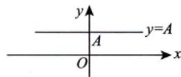

---

### 2. 幂函数 $y = x^\mu$

> [!def] 幂函数
> $$
> y = x^\mu \quad (\mu \text{ 为常数})
> $$

**常见幂函数**：

| 函数 | 定义域 | 值域 | 图像特征 |
|------|--------|------|----------|
| $y = x$ | $\mathbb{R}$ | $\mathbb{R}$ | 过原点的直线 |
| $y = x^2$ | $\mathbb{R}$ | $[0, +\infty)$ | 开口向上的抛物线 |
| $y = x^3$ | $\mathbb{R}$ | $\mathbb{R}$ | 过原点的立方曲线 |
| $y = \sqrt{x}$ | $[0, +\infty)$ | $[0, +\infty)$ | 半抛物线 |
| $y = \frac{1}{x}$ | $(-\infty, 0) \cup (0, +\infty)$ | $(-\infty, 0) \cup (0, +\infty)$ | 双曲线 |
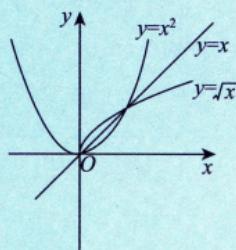
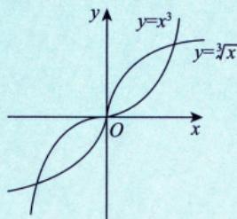
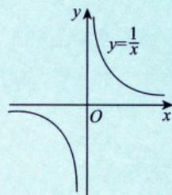
> [!tip] 幂函数的记忆要点
> - $\mu > 0$：图像过原点，在第一象限单调递增
> - $\mu < 0$：图像不过原点，在第一象限单调递减
> - $\mu$ 为偶数：偶函数
> - $\mu$ 为奇数：奇函数
> - 当$x > 0$时，才有定义 

> [!tip] "简洁美"技巧（考得最多）
> 当 $x > 0$ 时，$y = x$ 与 $y = \sqrt{x}$、$y = \sqrt[3]{x}$、$y = \ln x$ 具有相同的单调性，与 $y = \frac{1}{x}$ 具有相反的单调性。
>
> | 见到 | 可用 | 说明 |
> |------|------|------|
> | $\sqrt{u}, \sqrt[3]{u}$ | $u$ 来研究最值 | 与原函数$y = x$单调性相同 |
> | $\|u\|$ | $u^2$ 来研究最值（⭐考得最多） | $\|u\| = \sqrt{u^2}$，与 $u^2$ 有相同的最值点 |
> | $u_1 u_2 u_3$ | $\ln(u_1u_2u_3)$ 来研究最值 | $\ln(u_1u_2u_3) = \ln u_1 + \ln u_2 + \ln u_3$） |
> | $\frac{1}{u}$ | $u$ 来研究最值 | 结论相反（最大/最小值点互换）（考得频率不高 )|
>
> > [!example] 例1.10
> > **题目**：设 $0 < x < \frac{1}{2}$，求 $y(x) = x^6(1-x)^2(1-2x)^4$ 的最大值点。
> >
> > **分析**：多项相乘（除）乘方（开方）的式子 $\Rightarrow$ 取对数 $\Rightarrow$ 计算 $\Rightarrow$ 线性运算。实现"简洁美"！
> >
> > **解答**：取对数
> > $$
> > \ln y(x) = 6\ln x + 2\ln(1-x) + 4\ln(1-2x)
> > $$
> >
> > 令 $\frac{d[\ln y(x)]}{dx} = \frac{6}{x} - \frac{2}{1-x} - \frac{8}{1-2x} = \frac{24x^2 - 28x + 6}{x(1-x)(1-2x)} = 0$
> >
> > 即 $12x^2 - 14x + 3 = 0$，解得 $x = \frac{7\pm\sqrt{13}}{12}$
> >
> > - 因为 $\frac{7+\sqrt{13}}{12} > \frac{1}{2}$ 不符合题意
> > - 又 $\lim_{x\to 0^+}y(x) = \lim_{x\to (\frac{1}{2})^-}y(x) = 0 < y(\frac{7-\sqrt{13}}{12})$
> >
> > 故 $y$ 的最大值点为 $x = \frac{7-\sqrt{13}}{12}$
> >
> > ==**方法总结**：遇到多项相乘（除）函数的最值问题，常用**对数求导法**==
> >
> > **公式**：
> > - $(\ln x)' = \frac{1}{x}$
> > - $[\ln(1-x)]' = \frac{1}{x-1}$（注意符号）
> > - $\{f[g(x)]\}' = f'_g \cdot g'_x$（链式法则）

---

### 3. 指数函数 $y = a^x$

> [!def] 指数函数
> $$
> y = a^x \quad (a > 0, a \neq 1)
> $$

**性质**：

| 性质 | $a > 1$（增函数） | $0 < a < 1$（减函数） |
|------|------------------|----------------------|
| 定义域 | $(-\infty, +\infty)$ | $(-\infty, +\infty)$ |
| 值域 | $(0, +\infty)$ | $(0, +\infty)$ |
| 过点 | $(0, 1)$ | $(0, 1)$ |
| 渐近线 | $y = 0$（$x \to -\infty$） | $y = 0$（$x \to +\infty$） |
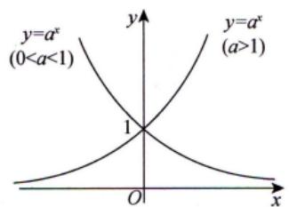
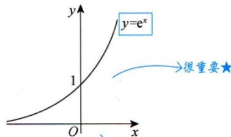

**特殊值**：
- $e^0 = 1$，$e^1 \approx 2.718$
- $\lim_{x \to -\infty} e^x = 0$
- $\lim_{x \to +\infty} e^x = +\infty$

> [!example] 指数运算
> - $a^{x_1} \cdot a^{x_2} = a^{x_1 + x_2}$
> - $\frac{a^{x_1}}{a^{x_2}} = a^{x_1 - x_2}$ ，**提取公因式技巧**：$e^{\tan x} - e^{\sin x} = e^{\sin x}(e^{\tan x - \sin x} - 1)$
> - $(a^x)^y = a^{xy}$
>
> 

> [!personal] 补充知识点
> - 特殊函数值: $a^0 = 1, \mathrm{e}^0 = 1$

> [!tip] 神秘的"1"和"0"
> - $e^x - 1 = e^x - e^0$（统一美）
> - $\ln x_n = \ln x_n - \ln 1$（统一美）
> - $\ln(e+\frac{1}{x}) - 1 = \ln(e+\frac{1}{x}) - \ln e = \ln(1+\frac{1}{ex})$
> 
>
> **应用**：用于拉格朗日中值定理证明
>
> **例题**：$\lim_{x\to\infty}x[\ln(e+\frac{1}{x})-1] = \lim_{x\to\infty}x \cdot \frac{1}{ex} = \frac{1}{e}$
>
> > [!summary] 泰勒展开
> > $e^x = \sum_{n=0}^{\infty}\frac{x^n}{n!} = 1 + x + \frac{x^2}{2!} + \frac{x^3}{3!} + \dots$

---

### 4. 对数函数 $y = \log_a x$

> [!def] 对数函数
> $$
> y = \log_a x \quad (a > 0, a \neq 1)是 y = a^x 的反函数.
> $$

**性质**：

| 性质 | $a > 1$（增函数） | $0 < a < 1$（减函数） |
|------|------------------|----------------------|
| 定义域 | $(0, +\infty)$ | $(0, +\infty)$ |
| 值域 | $(-\infty, +\infty)$ | $(-\infty, +\infty)$ |
| 过点 | $(1, 0)$ | $(1, 0)$ |
| 渐近线 | $x = 0$ | $x = 0$ |

**特殊对数**：
- **自然对数**：$\ln x = \log_e x$
- **常用对数**：$\lg x = \log_{10} x$
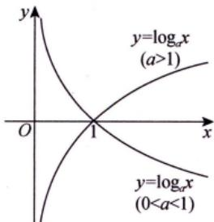
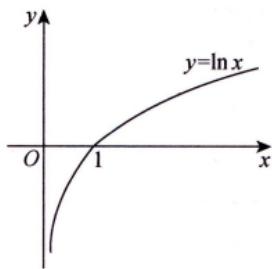

**重要关系**：
- $a^{\log_a x} = x$
- $\log_a a^x = x$
- $\log_a 1 = 0$
- $\log_a a = 1$

> [!example] 对数运算
> - $\log_a(xy) = \log_a x + \log_a y$ （积的对数 $=$ 对数的和）
> - $\log_a\left(\frac{x}{y}\right) = \log_a x - \log_a y$ (商的对数 = 对数的差).
> - $\log_a x^n = n \log_a x$ （幂的对数 $=$ 对数的倍数）.
> - 换底公式：$\log_a x = \frac{\log_b x}{\log_b a}$

> [!tip] 对数的常用变形
> - $x = e^{\ln x} (x > 0)$
> - $u^\nu = e^{\ln u^\nu} = e^{\nu \ln u} (u > 0)$
> - $x^x = e^{\ln x^x} = e^{x\ln x}$（幂指函数也是初等函数）

> [!example] 例1.11
> **题目**：已知 $e^x = \sum_{n=0}^{\infty}\frac{x^n}{n!}, x\in\mathbb{R}$，则 $2^x = (\quad)$
>
> **解答**：
> $2^x = e^{\ln 2^x} = e^{x\ln 2} = \sum_{n=0}^{\infty}\frac{(x\ln 2)^n}{n!}$

---

### 5. 三角函数

#### 5.1 正弦函数 $y = \sin x$

**性质**：
- 定义域：$(-\infty, +\infty)$
- 值域：$[-1, 1]$
- 周期：$2\pi$
- 奇函数
- 有界函数

**特殊值**：

| $x$ | $0$ | $\frac{\pi}{6}$ | $\frac{\pi}{4}$ | $\frac{\pi}{3}$ | $\frac{\pi}{2}$ |
|-----|-----|----------------|----------------|----------------|----------------|
| $\sin x$ | $0$ | $\frac{1}{2}$ | $\frac{\sqrt{2}}{2}$ | $\frac{\sqrt{3}}{2}$ | $1$ |
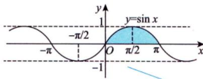

> [!personal] 一拱的面积为2
> 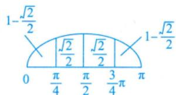

#### 5.2 余弦函数 $y = \cos x$

**性质**：
- 定义域：$(-\infty, +\infty)$
- 值域：$[-1, 1]$
- 周期：$2\pi$
- 偶函数
- 有界函数

**特殊值**：

| $x$ | $0$ | $\frac{\pi}{6}$ | $\frac{\pi}{4}$ | $\frac{\pi}{3}$ | $\frac{\pi}{2}$ |
|-----|-----|----------------|----------------|----------------|----------------|
| $\cos x$ | $1$ | $\frac{\sqrt{3}}{2}$ | $\frac{\sqrt{2}}{2}$ | $\frac{1}{2}$ | $0$ |
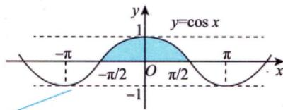
#### 5.3 正切函数 $y = \tan x$

**性质**：
- 定义域：$x \neq k\pi + \frac{\pi}{2}, k \in \mathbb{Z}$
- 值域：$(-\infty, +\infty)$
- 周期：$\pi$
- 奇函数
- 单调递增（在每个周期内）
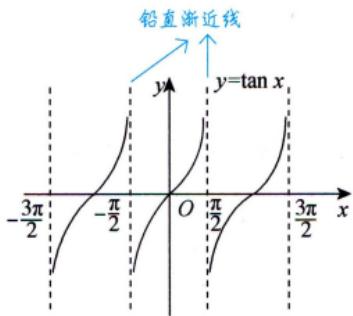
#### 5.4 余切函数 $y = \cot x$

**性质**：
- 定义域：$x \neq k\pi, k \in \mathbb{Z}$
- 值域：$(-\infty, +\infty)$
- 周期：$\pi$
- 奇函数
- 单调递减（在每个周期内）
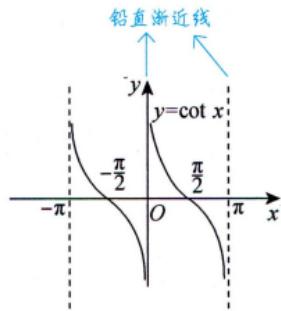
#### 5.5 正割函数 $y = \sec x$

> [!def] 正割函数
> $$
> y = \sec x = \frac{1}{\cos x}
> $$

**性质**：
- 定义域：$x \neq k\pi + \frac{\pi}{2}, k \in \mathbb{Z}$
- 值域：$(-\infty, -1] \cup [1, +\infty)$
- 周期：$2\pi$
- 偶函数
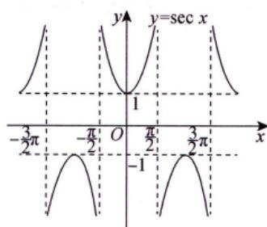
#### 5.6 余割函数 $y = \csc x$

> [!def] 余割函数
> $$
> y = \csc x = \frac{1}{\sin x}
> $$

**性质**：
- 定义域：$x \neq k\pi, k \in \mathbb{Z}$
- 值域：$(-\infty, -1] \cup [1, +\infty)$
- 周期：$2\pi$
- 奇函数
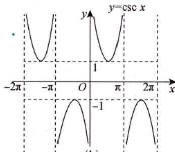

> [!summary] 三角函数关系
>
> **商数关系**：
> - $\tan x = \frac{\sin x}{\cos x}$
> - $\cot x = \frac{\cos x}{\sin x}$
>
> **平方关系**：
> - $\sin^2 x + \cos^2 x = 1$
> - $1 + \tan^2 x = \sec^2 x$
> - $1 + \cot^2 x = \csc^2 x$
>
> **倍角公式**：
> - $\sin 2x = 2\sin x \cos x$
> - $\cos 2x = \cos^2 x - \sin^2 x = 2\cos^2 x - 1 = 1 - 2\sin^2 x$

> [!example] 三角函数运算技巧
> - **和差化积**：
>   - $\sin \alpha + \sin \beta = 2\sin\frac{\alpha+\beta}{2}\cos\frac{\alpha-\beta}{2}$
>   - $\cos \alpha + \cos \beta = 2\cos\frac{\alpha+\beta}{2}\cos\frac{\alpha-\beta}{2}$
>   - $\sin \alpha - \sin \beta = 2\cos\frac{\alpha+\beta}{2}\sin\frac{\alpha-\beta}{2}$
> - **积化和差**：
>   - $\sin \alpha \cos \beta = \frac{1}{2}[\sin(\alpha+\beta) + \sin(\alpha-\beta)]$
>   - $\cos \alpha \cos \beta = \frac{1}{2}[\cos(\alpha+\beta) + \cos(\alpha-\beta)]$
> - **降幂公式**：
>   - $\sin^2 x = \frac{1 - \cos 2x}{2}$
>   - $\cos^2 x = \frac{1 + \cos 2x}{2}$
> - **辅助角公式**：$a\sin x + b\cos x = \sqrt{a^2+b^2}\sin(x+\varphi)$，其中 $\tan\varphi = \frac{b}{a}$

> [!personal] 我的理解记录 🧠（三角函数二倍角与降幂公式）
>
> **核心发现**：
> - **发现 ①**：$\cos 2x$ 是三角函数公式的核心枢纽，因为它能同时用 $\sin^2 x$、$\cos^2 x$ 或两者结合表示，这种多变性使其成为公式转换的中转站
> - **发现 ②**：二倍角公式和降幂公式本质上是同一个等式的两种变形
>   - 向左看（从 $x$ 到 $2x$）：**二倍角**，用于统一频率（角）
>   - 向右看（从 $2x$ 到 $x$）：**降幂**，用于降低次数，方便积分或求最值
>
> **记忆技巧**：
> - 余弦（Cosine）"自私"，自己的公式用**加号**：$$\cos^2 x = \frac{1 + \cos 2x}{2}$$
> - 正弦（Sine）用**减号**：$$\sin^2 x = \frac{1 - \cos 2x}{2}$$
>
> **正切补全**：
> - 二倍角：$$\tan 2x = \frac{2\tan x}{1 - \tan^2 x}$$
> - 降幂（半角变形）：$$\tan^2 x = \frac{1 - \cos 2x}{1 + \cos 2x}$$
>
> **进阶：万能公式**（The Weierstrass Substitution）
> 由于 $\cos 2x$ 是核心，可以将 $\sin 2x$、$\cos 2x$ 和 $\tan 2x$ 全部统一用 $\tan x$ 来表示：
> $$\sin 2x = \frac{2\tan x}{1 + \tan^2 x}, \quad \cos 2x = \frac{1 - \tan^2 x}{1 + \tan^2 x}$$
> 在处理复杂的三角方程时非常有用，可将三角函数统一转化为有理函数。

> [!info] 万能公式推导（Weierstrass Substitution）
>
> **核心思想**：利用**二倍角公式**结合**齐次式处理**（即把分母看作 $1 = \sin^2 x + \cos^2 x$）
>
> ---
>
> ### 1. $\sin 2x$ 的推导
>
> **步骤1**：从最基础的二倍角公式开始
> $$\sin 2x = 2 \sin x \cos x$$
>
> **步骤2**：为了引入 $\tan x$，将它写成分式形式，分母默认为 $1$
> $$\sin 2x = \frac{2 \sin x \cos x}{1}$$
>
> **步骤3**：利用恒等式 $1 = \sin^2 x + \cos^2 x$ 替换分母
> $$\sin 2x = \frac{2 \sin x \cos x}{\sin^2 x + \cos^2 x}$$
>
> **步骤4**：分子分母同时除以 $\cos^2 x$（**关键步骤**）
> $$\sin 2x = \frac{\frac{2 \sin x \cos x}{\cos^2 x}}{\frac{\sin^2 x + \cos^2 x}{\cos^2 x}} = \frac{2 \cdot \frac{\sin x}{\cos x}}{\frac{\sin^2 x}{\cos^2 x} + \frac{\cos^2 x}{\cos^2 x}}$$
>
> **步骤5**：得出结果
> $$\boxed{\sin 2x = \frac{2\tan x}{1 + \tan^2 x}}$$
>
> ---
>
> ### 2. $\cos 2x$ 的推导
>
> **步骤1**：从 $\cos 2x$ 的二倍角基本形式出发
> $$\cos 2x = \cos^2 x - \sin^2 x$$
>
> **步骤2**：写成分式并替换分母
> $$\cos 2x = \frac{\cos^2 x - \sin^2 x}{1} = \frac{\cos^2 x - \sin^2 x}{\cos^2 x + \sin^2 x}$$
>
> **步骤3**：分子分母同时除以 $\cos^2 x$
> $$\cos 2x = \frac{\frac{\cos^2 x}{\cos^2 x} - \frac{\sin^2 x}{\cos^2 x}}{\frac{\cos^2 x}{\cos^2 x} + \frac{\sin^2 x}{\cos^2 x}}$$
>
> **步骤4**：得出结果
> $$\boxed{\cos 2x = \frac{1 - \tan^2 x}{1 + \tan^2 x}}$$
>
> ---
>
> ### 3. 直观理解：万能公式三角形 🔺
>
> 可以构造一个直角三角形来记忆这组关系。如果设斜边为 $1 + \tan^2 x$：
>
> | 边 | 长度 | 对应三角函数 |
> |----|------|-------------|
> | 对边（Opposite） | $2 \tan x$ | $\sin 2x = \frac{\text{对边}}{\text{斜边}}$ |
> | 邻边（Adjacent） | $1 - \tan^2 x$ | $\cos 2x = \frac{\text{邻边}}{\text{斜边}}$ |
> | 斜边（Hypotenuse） | $1 + \tan^2 x$ | - |
>
> **验证勾股定理**：
> $$(2\tan x)^2 + (1 - \tan^2 x)^2 = 4\tan^2 x + 1 - 2\tan^2 x + \tan^4 x = 1 + 2\tan^2 x + \tan^4 x = (1 + \tan^2 x)^2$$ ✓
>
> 通过这个三角形，可以一眼看出 $\sin 2x$、$\cos 2x$ 的万能公式表达。
>
> ---
>
> **应用场景**：
> - **积分计算**：令 $t = \tan x$，则 $dx = \frac{dt}{1 + t^2}$，可将三角积分转化为有理函数积分
> - **三角方程**：将复杂的三角方程转化为代数方程求解
> - **三角不等式**：统一用 $\tan x$ 表示，便于比较大小
>
> 💡 **相关联的概念**：
> - **积分换元法**：万能公式在三角函数积分中的应用（令 $t = \tan x$）
> - **三角恒等变换**：更广泛的三角公式体系（和差化积、积化和差等）

---

> [!tip] 重要三角极限
> - $\lim_{x\to 0}\frac{\sin x}{x} = 1$
> - $\lim_{x\to 0}\frac{\tan x}{x} = 1$
> - $\lim_{x\to 0}\frac{1-\cos x}{x^2} = \frac{1}{2}$
> - $\lim_{x\to 0}\frac{\arcsin x}{x} = 1$
> - $\lim_{x\to 0}\frac{\arctan x}{x} = 1$

> [!tip] 重要三角不等式
> - 当 $0 < x < \frac{\pi}{2}$ 时：$\sin x < x < \tan x$
> - $|\sin x| \leq |x|$，当且仅当 $x=0$ 时取等号
> - $|\cos x| \leq 1$，$|\sin x| \leq 1$

> [!example] 例题技巧
> **题目**：求 $\lim_{x\to 0}\frac{1 - \cos x}{x^2}$
>
> **解答**：使用降幂公式变形
> $$\frac{1 - \cos x}{x^2} = \frac{2\sin^2\frac{x}{2}}{x^2} = \frac{1}{2}\left(\frac{\sin\frac{x}{2}}{\frac{x}{2}}\right)^2 \to \frac{1}{2}$$

### 6. 反三角函数

#### 6.1 反正弦函数 $y = \arcsin x$

> [!def] 反正弦函数
> $$
> y = \arcsin x, \quad x \in [-1, 1]
> $$
>
> 满足 $\sin y = x$，且 $y \in [-\frac{\pi}{2}, \frac{\pi}{2}]$

**性质**：
- 定义域：$[-1, 1]$
- 值域：$[-\frac{\pi}{2}, \frac{\pi}{2}]$
- 单调递增
- 奇函数
- 有界函数

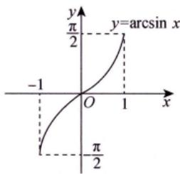

**特殊值**：
- $\arcsin 0 = 0$
- $\arcsin 1 = \frac{\pi}{2}$
- $\arcsin(-1) = -\frac{\pi}{2}$

> [!personal] 我的理解记录 🧠
>
> **为什么 sinx 没有反函数？**
> - sinx 是周期函数，不满足水平划线法（一一对应）
> - 水平直线 y = c（c ∈ [-1,1]）与图像有无数个交点
> - 所以在全体实数上没有反函数
>
> **如何解决？限定区间！**
> - 限定区间：x ∈ [-π/2, π/2]
> - 在这个区间内 sinx 单调递增，满足一一对应
>
> **反函数推导过程**：
> 1. 设 y = sinx
> 2. 反函数：x = arcsiny = arcsin(sinx) = x（当 x ∈ [-π/2, π/2]）
> 3. 变量互换（习惯用x表示自变量）：y = arcsinx
> 4. 定义域：x ∈ [-1,1]，值域：y ∈ [-π/2, π/2]

---

> [!personal] 我的理解记录 🧠（例题1.12）
>
> **例题1.12：求 $y = \sin x$ 在 $(\frac{\pi}{2}, \frac{3\pi}{2}]$ 上的反函数**
>
> ✅ **理解正确部分**：
> - $\arcsin x$ 的主值区间（值域）是 $[-\frac{\pi}{2}, \frac{\pi}{2}]$（弧度制角度）✓
> - 通过 $x - \pi$ 变换将区间映射到主值区间 ✓
> - 三角恒等变换：$\sin(x - \pi) = -\sin(\pi - x) = -\sin x = -y$ ✓
> - 最终推导：$x = \pi - \arcsin y$ ✓
>
> **逻辑链条清晰**：
> ==**为什么要这么设？——逻辑追溯检查**==
> $\arcsin$ 像是一扇"窄门"，它只认 $\left[-\frac{\pi}{2}, \frac{\pi}{2}\right]$ 里的输入。如果 $x$ 在其他区间，就必须通过诱导公式将其"包装"成这个区间内的变量。
>
> **平移逻辑**：
> $$x \in (\frac{\pi}{2}, \frac{3\pi}{2}] \implies (x-\pi) \in (-\frac{\pi}{2}, \frac{\pi}{2}]$$
>
> 这一步是整个推导的灵魂——通过平移 $\pi$ 个单位，将角度"搬运"到 $\arcsin$ 的主值区间内。
>
> **完整推导**：
> 1. $\sin x$ 在 $(\frac{\pi}{2}, \frac{3\pi}{2}]$ 上单调递减
> 2. 这个区间不在 $\arcsin$ 的主值区间内，无法直接使用 $\arcsin$
> 3. 令 $t = x - \pi$，则 $t \in (-\frac{\pi}{2}, \frac{\pi}{2}]$（进入主值区间，可以使用 $\arcsin$ 了！）
> 4. 利用诱导公式：$\sin(x - \pi) = -\sin x = -y$
> 5. 因此：$x - \pi = \arcsin(-y) = -\arcsin y$
> 6. 最终：$x = \pi - \arcsin y$
>
> **关键要点**：
> - $\arcsin x$ 返回的是**弧度制角度**，不是数值
> - 主值区间是 $[-\frac{\pi}{2}, \frac{\pi}{2}]$
> - $\arcsin(-y) = -\arcsin y$（奇函数性质）
>
> 💡 **相关联的概念**：
> - **反函数的存在条件**（函数必须单调）
> - **诱导公式**：$\sin(\pi \pm \alpha)$、$\sin(2\pi \pm \alpha)$
> - **反三角函数的奇偶性**：$\arcsin x$ 是奇函数

#### 6.2 反余弦函数 $y = \arccos x$

> [!def] 反余弦函数
> $$
> y = \arccos x, \quad x \in [-1, 1]
> $$
>
> 满足 $\cos y = x$，且 $y \in [0, \pi]$

**性质**：
- 定义域：$[-1, 1]$
- 值域：$[0, \pi]$
- 单调递减
- 非奇非偶
- 有界函数

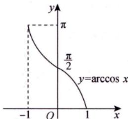

**特殊值**：
- $\arccos 0 = \frac{\pi}{2}$
- $\arccos 1 = 0$
- $\arccos(-1) = \pi$

#### 6.3 反正切函数 $y = \arctan x$

> [!def] 反正切函数
> $$
> y = \arctan x, \quad x \in (-\infty, +\infty)
> $$
>
> 满足 $\tan y = x$，且 $y \in (-\frac{\pi}{2}, \frac{\pi}{2})$

**性质**：
- 定义域：$(-\infty, +\infty)$
- 值域：$(-\frac{\pi}{2}, \frac{\pi}{2})$
- 单调递增
- 奇函数
- **有界函数**

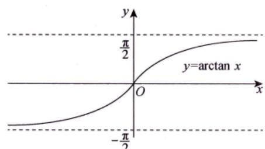

**重要极限**：
- $\lim_{x \to +\infty} \arctan x = \frac{\pi}{2}$
- $\lim_{x \to -\infty} \arctan x = -\frac{\pi}{2}$

> [!warning] 易错点
> $\arctan x$ 的值域是开区间 $(-\frac{\pi}{2}, \frac{\pi}{2})$，不包含端点！

#### 6.4 反余切函数 $y = \operatorname{arccot} x$

> [!def] 反余切函数
> $$
> y = \operatorname{arccot} x, \quad x \in (-\infty, +\infty)
> $$
>
> 满足 $\cot y = x$，且 $y \in (0, \pi)$

**性质**：
- 定义域：$(-\infty, +\infty)$
- 值域：$(0, \pi)$
- 单调递减
- 非奇非偶
- **有界函数**

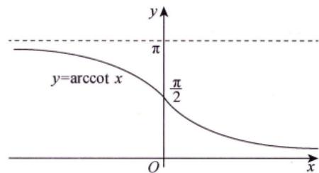

**重要极限**：
- $\lim_{x \to +\infty} \operatorname{arccot} x = 0$
- $\lim_{x \to -\infty} \operatorname{arccot} x = \pi$

> [!summary] 反三角函数恒等式汇总
>
> **基本恒等式**：
> - $\sin(\arcsin x) = x, x \in [-1, 1]$
> - $\cos(\arccos x) = x, x \in [-1, 1]$
> - $\cos(\arcsin x) = \sqrt{1-x^2}, x \in [-1, 1]$
> - $\sin(\arccos x) = \sqrt{1-x^2}, x \in [-1, 1]$
>
> **注意值域限制**：
> - $\arcsin(\sin x) = x, x \in [-\frac{\pi}{2}, \frac{\pi}{2}]$
> - $\arccos(\cos x) = x, x \in [0, \pi]$
>
> **互补关系**：
> - $\arcsin x + \arccos x = \frac{\pi}{2}, x \in [-1, 1]$
> - $\arctan x + \operatorname{arccot} x = \frac{\pi}{2}, x \in (-\infty, +\infty)$
>
> **多值反函数**（例1.12）：
> 若 $y = \sin x, x \in (\frac{\pi}{2}, \frac{3\pi}{2})$，则 $x = \pi - \arcsin y$
>
> ---
>
> [!personal] 我的理解记录 🧠
>
> **三角函数反函数推导：$\sin(\arccos x)$**
> - 使用换元法：设 $t = \arccos x$，则 $x = \cos t$
> - 利用三角恒等式：$\sin^2 t + \cos^2 t = 1$
> - 推导得出：$\sin t = \sqrt{1 - \cos^2 t}$
> - 最终结论：$$\sin(\arccos x) = \sqrt{1 - x^2}$$
>
> **关键细节**：
> - $\arccos x$ 的值域为 $[0, \pi]$，在此区间 $\sin t \geq 0$
> - 因此 $\sin t$ 取正值 $\sqrt{1 - \cos^2 t}$ 而非 $\pm$ 值
>
> 💡 **相关联的概念**：
> - **$\cos(\arcsin x)$**：类似方法可推导得 $\cos(\arcsin x) = \sqrt{1 - x^2}$
> - **反三角函数值域**：$\arcsin x \in [-\frac{\pi}{2}, \frac{\pi}{2}]$，$\arctan x \in (-\frac{\pi}{2}, \frac{\pi}{2})$ — 记住值域有助于确定三角函数的符号
> - **三角恒等式变形**：$\sin^2 x + \cos^2 x = 1$ 的其他应用，如 $\tan^2 x + 1 = \sec^2 x$

> [!example] 反三角函数运算技巧
> - **三角函数的反运算值域限制**：
>   - $\arcsin(\sin x) = x$ 仅当 $x \in [-\frac{\pi}{2}, \frac{\pi}{2}]$
>   - $\arccos(\cos x) = x$ 仅当 $x \in [0, \pi]$
>   - $\arctan(\tan x) = x$ 仅当 $x \in (-\frac{\pi}{2}, \frac{\pi}{2})$
> - **反三角函数的三角函数**：
>   - $\sin(\arctan x) = \frac{x}{\sqrt{1+x^2}}$
>   - $\cos(\arctan x) = \frac{1}{\sqrt{1+x^2}}$
>   - $\tan(\arcsin x) = \frac{x}{\sqrt{1-x^2}}$
> - **反三角函数加法公式**：
>   - $\arctan x + \arctan y = \arctan\frac{x+y}{1-xy}$（当 $xy < 1$ 时）
>   - 若 $xy > 1$ 且 $x,y > 0$，则 $\arctan x + \arctan y = \pi + \arctan\frac{x+y}{1-xy}$

> [!tip] 常用反三角函数值
> - $\arcsin\frac{1}{2} = \frac{\pi}{6}$，$\arcsin\frac{\sqrt{2}}{2} = \frac{\pi}{4}$，$\arcsin\frac{\sqrt{3}}{2} = \frac{\pi}{3}$
> - $\arccos\frac{1}{2} = \frac{\pi}{3}$，$\arccos\frac{\sqrt{2}}{2} = \frac{\pi}{4}$，$\arccos\frac{\sqrt{3}}{2} = \frac{\pi}{6}$
> - $\arctan 1 = \frac{\pi}{4}$，$\arctan\sqrt{3} = \frac{\pi}{3}$，$\arctan\frac{1}{\sqrt{3}} = \frac{\pi}{6}$

> [!warning] 反三角函数易错点
> - $\arcsin x$ 的值域是 $[-\frac{\pi}{2}, \frac{\pi}{2}]$，**包含端点**
> - $\arctan x$ 的值域是 $(-\frac{\pi}{2}, \frac{\pi}{2})$，**不包含端点**
> - $\arccos x$ 单调递减，$\arcsin x$ 单调递增
> - $\arcsin(-x) = -\arcsin x$（奇函数），$\arccos(-x) = \pi - \arccos x$（非奇非偶）

---

## 初等函数

> [!def] 初等函数
> 由**基本初等函数**经过**有限次**四则运算、**有限次**复合步骤所构成的并且可以由一个式子所表示的函数称为初等函数。

> [!info] 关于定义域
> 初等函数的定义域可以是一个区间，也可以是几个区间的并集，甚至可以是一些孤立的点。
>
> **例子**：$y = \sqrt{\cos \pi x - 1}$ 的定义域是 $\{x \mid x = 0, \pm 2, \pm 4, \dots\}$（孤立点集）

> [!tip] 幂指函数也是初等函数
> 幂指函数 $u(x)^{\nu(x)} = e^{\nu(x) \ln u(x)}$ 也是初等函数。
>
> **例子**：当 $x > 0$ 时，$f(x) = x^x = e^{x \ln x}$ 是初等函数，其图形如图1-17所示：
>
> 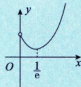
>
> **作图提示**：等到学完导数后再画图，如 $x^x, x^{2x}, x^{3x}$ 的图像都类似。

> [!example] 初等函数举例
> - $y = \sin(2x + 1)$
> - $y = e^{x^2}$
> - $y = \ln(\cos x)$
> - $y = \sqrt{1 + x^2}$
> - $y = x^x$（幂指函数）

> [!tip] 非初等函数
> - **分段函数**（通常不是初等函数）
> - **狄利克雷函数**：$D(x) = \begin{cases} 1, & x \in \mathbb{Q} \\ 0, & x \notin \mathbb{Q} \end{cases}$

---

## 分段函数（重要）

> [!def] 分段函数
> 在自变量的不同变化范围中，对应法则用不同式子来表示的函数称为**分段函数**。
>
> **注意**：分段函数是用几个式子来表示的**一个**函数（不是几个）。一般来说，它不是初等函数。

### 三个重要分段函数

#### 1. 绝对值函数 $y = |x|$

$$
y = |x| = \begin{cases}
x, & x \geq 0 \\
-x, & x < 0
\end{cases}
$$

**注意**：$|x|$ 是初等函数，因为 $|x| = \sqrt{x^2}$

#### 2. 符号函数 $y = \operatorname{sgn} x$

$$
y = \operatorname{sgn} x = \begin{cases}
1, & x > 0 \\
0, & x = 0 \\
-1, & x < 0
\end{cases}
$$

**性质**：$x = |x| \cdot \operatorname{sgn} x$

#### 3. 取整函数 $y = [x]$

**定义**：不超过 $x$ 的最大整数称为 $x$ 的整数部分，记作 $[x]$

**示例**：
- $[0.99] = 0, [\pi] = 3$
- $[-1] = -1, [-1.99] = -2$

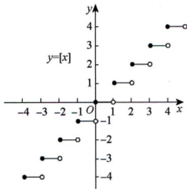

**重要公式**：
- $[x + n] = [x] + n$（$n$ 为整数）
- $x - 1 < [x] \leq x$
- $\lim_{x \to 0^+}[x] = 0, \lim_{x \to 0^-}[x] = -1$

> [!tip] 小数部分函数
> $y = x - [x]$ 称为 $x$ 的小数部分，是以 1 为周期的函数。
> - $1.99 - [1.99] = 0.99$
> - $-1.99 - [-1.99] = -1.99 + 2 = 0.01$

> [!example] 例1.13
> **题目**：设 $[x]$ 表示不超过 $x$ 的最大整数，则 $y = x - [x]$ 是（ ）
>
> (A) 无界函数  (B) 单调函数  (C) 偶函数  (D) 周期函数
>
> **解答**：应选 **(D)**
> - 因为 $y(x+1) = x+1 - [x+1] = x+1 - ([x]+1) = x - [x] = y(x)$
> - 故 $y(x)$ 是周期为 1 的周期函数

---

## 重要结论速查表

| 结论 | 公式 | 记忆要点 |
|------|------|----------|
| $\arcsin x + \arccos x$ | $= \frac{\pi}{2}$ | 互补关系 |
| $\arctan x + \operatorname{arccot} x$ | $= \frac{\pi}{2}$ | 互补关系 |
| $\arctan x + \arctan\frac{1}{x}$ | $= \frac{\pi}{2} (x > 0)$ | 注意符号 |
| $\sin(\arcsin x) = x$ | $x \in [-1, 1]$ | 定义域限制 |
| $\arcsin(\sin x) = x$ | $x \in [-\frac{\pi}{2}, \frac{\pi}{2}]$ | 值域限制 |

---

## 典型题型

### 题型1：求定义域

> [!example] 例1
> **题目**：求 $y = \arcsin(2x - 1)$ 的定义域
>
> **解答**：
> 反正弦函数要求 $-1 \leq 2x - 1 \leq 1$
>
> 解得：$0 \leq 2x \leq 2$，即 $0 \leq x \leq 1$
>
> 故定义域为 $[0, 1]$。

### 题型2：反三角函数极限

> [!example] 例2
> **题目**：求 $\lim_{x \to +\infty} \frac{\arctan x}{x}$
>
> **解答**：
> 当 $x \to +\infty$ 时，$\arctan x \to \frac{\pi}{2}$（有界）
>
> 而 $\frac{1}{x} \to 0$（无穷小）
>
> 故 $\lim_{x \to +\infty} \frac{\arctan x}{x} = \lim_{x \to +\infty} \arctan x \cdot \frac{1}{x} = \frac{\pi}{2} \cdot 0 = 0$

### 题型3：三角恒等变换

> [!example] 例3
> **题目**：化简 $\sin(2\arcsin x)$
>
> **解答**：
> 设 $\theta = \arcsin x$，则 $\sin \theta = x$，且 $\theta \in [-\frac{\pi}{2}, \frac{\pi}{2}]$
>
> $\sin(2\arcsin x) = \sin 2\theta = 2\sin \theta \cos \theta = 2x \sqrt{1 - x^2}$
>
> （注意：$\cos \theta = \sqrt{1 - \sin^2 \theta} = \sqrt{1 - x^2}$，因为 $\cos \theta \geq 0$ 在 $[-\frac{\pi}{2}, \frac{\pi}{2}]$）

---

## 易错点 ⚠️

### 易错点1：反正弦函数的值域

- ❌ **错误**：$\arcsin(\sin \frac{3\pi}{4}) = \frac{3\pi}{4}$
- ✅ **正确**：$\arcsin(\sin \frac{3\pi}{4}) = \arcsin(\frac{\sqrt{2}}{2}) = \frac{\pi}{4}$

**原因**：$\arcsin$ 的值域是 $[-\frac{\pi}{2}, \frac{\pi}{2}]$，$\frac{3\pi}{4}$ 不在值域内。

### 易错点2：反三角函数的定义域

- ❌ **错误**：$\arcsin 2$ 有意义
- ✅ **正确**：$\arcsin 2$ 无意义（定义域是 $[-1, 1]$）

### 易错点3：混淆 $\tan x$ 与 $\arctan x$

- ❌ **错误**：$\tan x$ 和 $\arctan x$ 都是无界的
- ✅ **正确**：$\tan x$ 无界，但 $\arctan x$ 有界（值域 $(-\frac{\pi}{2}, \frac{\pi}{2})$）

### 易错点4：对数函数的定义域

- ❌ **错误**：$\ln(-1) = -1$（认为负数的对数是负数）
- ✅ **正确**：$\ln(-1)$ 无意义（定义域是 $(0, +\infty)$）

---

## 我的理解记录 🧠

### 初始理解
- 我一开始以为反三角函数就是把三角函数反过来，现在知道需要**限制值域**才能保证一一对应
- 我之前混淆了 $\tan x$ 和 $\arctan x$ 的有界性

### 学习进展
- 记住了六类基本初等函数的图像特征
- 理解了反三角函数为什么需要限制主值区间

### 未解疑问
- 想进一步了解反三角函数的导数公式
- 希望了解三角函数与复数的关系

---

## 我的错误类型 📌

### 概念混淆 ⚠️
- [ ] 经常混淆 $\arcsin(\sin x)$ 和 $\sin(\arcsin x)$
- [ ] 例子：误认为 $\arcsin(\sin \pi) = \pi$（实际是 $0$）

### 定义域忽视 ⚠️
- [ ] 经常忘记检查对数、反三角函数的定义域
- [ ] 导致：计算结果出现无意义的情况

---

## 相关知识点 📚

### 前置知识
- [[函数的概念与特性]] - 函数的基本概念
- [[函数的四种特性（重要）]] - 有界性、单调性、奇偶性、周期性

### 后续知识
- [[函数极限]] - 基本初等函数的极限
- [[函数的连续性与间断点]] - 初等函数的连续性
- [[导数与微分]]（后续章节）- 基本初等函数的导数公式

### 常考组合
- 反三角函数 + 极限计算（重要极限）
- 三角函数 + 恒等变换（化简求值）
- 指数对数 + 方程求解（对数方程）

---

## 跨学科提醒 ⚠️

> [!info] 电子技术关联
> 基本初等函数在电子技术中的应用：
> - **正弦函数**：交流信号分析、振荡电路
> - **指数函数**：RC电路充放电过程
> - **对数函数**：分贝计算、放大器增益
> - **反三角函数**：相位差计算

---

*创建日期: 2026-02-28*
