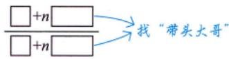

# 七种未定式

> [!danger] 重中之重
> 七种未定式是考研数学极限计算的**核心考点**，几乎每年必考！必须熟练掌握各种类型的处理方法。

## 七种未定式概览

> [!info] 七种类型
> | 类型 | 形式 | 难度 | 处理方法 |
> |------|------|:----:|----------|
> | 1 | $\frac{0}{0}$ | ⭐ | 洛必达、等价无穷小、泰勒 |
> | 2 | $\frac{\infty}{\infty}$ | ⭐⭐ | 洛必达、同除最高次幂 |
> | 3 | $0 \cdot \infty$ | ⭐⭐ | 化为 $\frac{0}{0}$ 或 $\frac{\infty}{\infty}$ |
> | 4 | $\infty - \infty$ | ⭐⭐⭐ | 通分、有理化、倒代换 |
> | 5 | $\infty^{0}$ | ⭐⭐⭐ | 取对数 |
> | 6 | $0^{0}$ | ⭐⭐⭐ | 取对数 |
> | 7 | $1^{\infty}$ | ⭐⭐⭐⭐ | 公式法、取对数 |

## 解题总思路

> [!tip] 三步法
> 1. **化简先行**
>    - 提出极限不为 0 的因式
>    - 等价无穷小代换
>    - 恒等变形（提公因式、拆项、合并、同除最高次幂）
>
> 2. **判断类型**
>    - 识别是哪种未定式
>
> 3. **选择方法**
>    - 洛必达法则、泰勒公式、夹逼准则等

## 各类型详解

### 1. $\frac{0}{0}$ 型

> [!success] 处理方法
> - **首选**：等价无穷小替换
> - **次选**：洛必达法则
> - **复杂函数**：泰勒公式

> [!example] 例题
> $\lim_{x \to 0} \frac{\sin x - x}{x^{3}}$
>
> **解**：用泰勒公式
> $\sin x = x - \frac{x^{3}}{6} + o(x^{3})$
>
> 原式 $= \lim \frac{-\frac{x^{3}}{6}}{x^{3}} = -\frac{1}{6}$

### 2. $\frac{\infty}{\infty}$ 型

> [!success] 处理方法
> - **洛必达法则**
> - **同除最高次幂**（有理函数常用），或说找带头大哥

> [!example] 例1.25 有理函数极限的一般形式（抓大头方法）⭐
> $\displaystyle I = \lim_{x\to \infty}\frac{a_nx^n + a_{n-1}x^{n-1} + \cdots + a_1x + a_0}{b_mx^m + b_{m-1}x^{m-1} + \cdots + b_1x + b_0}$
>
> 其中 $a_{n}(\neq 0),b_{m}(\neq 0)$ 为常数。
>
> **分析**：有理函数的极限问题，核心是**抓主要矛盾**（找"带头大哥"）。比较分子分母最高次幂：
>
> **解**：
>
> **(1) 当 $n = m$ 时**（次数相等）
>
> 上下同除以 $x^{n}$：
> $$I = \lim_{x \to \infty}\frac{a_n + \frac{a_{n-1}}{x} + \cdots + \frac{a_{1}}{x^{n-1}} + \frac{a_{0}}{x^{n}}}{b_m + \frac{b_{m-1}}{x} + \cdots + \frac{b_{1}}{x^{n-1}} + \frac{b_{0}}{x^{n}}}$$
>
> 由四则运算法则：
> $$I = \frac{\lim_{x \to \infty}\left(a_n + \frac{a_{n-1}}{x} + \cdots + \frac{a_{1}}{x^{n-1}} + \frac{a_{0}}{x^{n}}\right)}{\lim_{x \to \infty}\left(b_m + \frac{b_{m-1}}{x} + \cdots + \frac{b_{1}}{x^{n-1}} + \frac{b_{0}}{x^{n}}\right)} = \frac{a_n}{b_m}$$
>
> **(2) 当 $n > m$ 时**（分子次数高）
>
> $$I = \lim_{x\to \infty}\frac{x^{n-m}\left(a_nx^m + a_{n-1}x^{m-1} + \cdots + a_1x^{m-n+1} + a_0x^{m-n}\right)}{b_mx^m + b_{m-1}x^{m-1} + \cdots + b_1x + b_0}$$
> $$= \lim_{x\to \infty}x^{n-m}\cdot\frac{a_n}{b_m} = \infty$$
>
> **(3) 当 $n < m$ 时**（分母次数高）
>
> $$I = \lim_{x\to \infty}\frac{a_nx^n + a_{n-1}x^{n-1} + \cdots + a_1x + a_0}{x^{m-n}\left(b_mx^n + b_{m-1}x^{n-1} + \cdots + b_1x^{n-m+1} + b_0x^{n-m}\right)}$$
> $$= \lim_{x\to \infty}\frac{1}{x^{m-n}}\cdot\frac{a_n}{b_m} = 0$$
>
> **综上**：
> $$\boxed{\lim_{x\to \infty}\frac{a_nx^n + a_{n-1}x^{n-1} + \cdots + a_1x + a_0}{b_mx^m + b_{m-1}x^{m-1} + \cdots + b_1x + b_0} = \begin{cases} \frac{a_n}{b_m}, & n = m, \\ \infty, & n > m, \\ 0, & n < m. \end{cases}}$$
>
> **方法总结**：抓大头——比较分子分母最高次幂即可！

> [!personal] 我的理解记录 🧠
> **核心模型**：
> 设 $P(x)$ 和 $Q(x)$ 分别为 $n$ 次和 $m$ 次多项式：
> $$I = \lim_{x \to \infty} \frac{a_n x^n + a_{n-1} x^{n-1} + \dots + a_0}{b_m x^m + b_{m-1} x^{m-1} + \dots + b_0}$$
>
> **抓大头法则的本质**：
> 当 $x \to \infty$ 时，多项式的行为完全由其最高次项（带头大哥）决定。
>
> **为什么这个理解很"高级"？**
>
> 1. **避开了洛必达陷阱** ⚠️
>    虽然该式子符合 $\frac{\infty}{\infty}$ 型，但如果次数很高（比如 $n=10$），求导 10 次极其繁琐。"除以最高次幂"才是处理这类问题的**通用解法**。
>
> 2. **充分利用了极限的四则运算法则**
>    将分子分母同除以 $x$ 的最高次幂后，原本的"无穷大"项变成了"常数项 + 无穷小项"。例如：$\frac{a_{n-1}}{x} \to 0$。
>    利用 $\lim \frac{f}{g} = \frac{\lim f}{\lim g}$（前提是分母极限不为 0），瞬间化繁为简。
>
> **易错点提醒** ⚠️：
>
> 1. **符号问题**
>    当 $n > m$ 且 $x \to -\infty$ 时，要注意结果是 $+\infty$ 还是 $-\infty$，这取决于：
>    - 次数差 $(n-m)$ 的奇偶性
>    - 系数 $\frac{a_n}{b_m}$ 的符号
>
> 2. **非多项式情况**
>    如果式子中包含根号（如 $\sqrt{x^2+1}$），依然可以"抓大头"，但要把根号外的次数看作 $x^1$。需要特别注意根号内外的次数关系。
> 3. **特别注意**
> 若 $x\rightarrow 0$ ，则应该分别抓分子、分母中关于 $x$ 的最低次项. 

### 3. $0 \cdot \infty$ 型

> [!success] 处理方法
> 化为 $\frac{0}{0}$ 或 $\frac{\infty}{\infty}$ 型
>
> $$0 \cdot \infty = \frac{0}{\frac{1}{\infty}} = \frac{0}{0}$$
> $$0 \cdot \infty = \frac{\infty}{\frac{1}{0}} = \frac{\infty}{\infty}$$

> [!warning] 设置分母原则 ⚠️
> **把谁放在分母，是有讲究的！**
>
> **口诀**：简单因式才下放
>
> | 简单因式（放分母） | 复杂因式（留分子） |
> |-------------------|-------------------|
> | $x^{\alpha}$ | $\arctan x$ |
> | $\mathrm{e}^{\beta x}$ | $\arcsin x$ |
> | $\sin rx$ | $\ln x$ |
>
> **原因**：简单因式求导后形式更简单，复杂因式求导后反而更复杂！

> [!example] 例1 基础题
> $\lim_{x \to 0^{+}} x \ln x$
>
> **解**：将 $\ln x$ 留在分子，$x$ 放分母
> $$x \ln x = \frac{\ln x}{\frac{1}{x}}$$（$\frac{\infty}{\infty}$ 型）
>
> 洛必达：$= \lim \frac{\frac{1}{x}}{-\frac{1}{x^{2}}} = \lim (-x) = 0$

> [!example] 例1.28 综合题 ⭐⭐⭐
> 求 $\displaystyle \lim_{x\to 1^{-}}\ln x \cdot \ln(1 - x)$
>
> **分析**：这是 $0 \cdot \infty$ 型（$x \to 1^{-}$ 时，$\ln x \to 0$，$\ln(1-x) \to -\infty$）
>
> **两个关键技巧**：
> 1. **等价代换**：$\ln x = \ln(1 + x - 1) \sim x - 1$（当 $x \to 1$）
> 2. **换元法**：令 $1 - x = t$
>
> **解**：
> $$\begin{aligned}
> \lim_{x\to 1^{-}}\ln x \cdot \ln(1 - x) &= \lim_{x\to 1^{-}}\ln(1 + x - 1) \cdot \ln(1 - x) \\
> &\stackrel{\text{等价}}{=} \lim_{x\to 1^{-}}(x - 1) \cdot \ln(1 - x) \\
> &\xlongequal{\text{令 } 1 - x = t} -\lim_{t\to 0^{+}} t \ln t \\
> &= 0
> \end{aligned}$$
>
> **经典结论**：$\displaystyle \lim_{t\to 0^{+}} t \ln t = 0$（记住！）

> [!tip] 重要公式积累
> 当 $x \to 1$ 时：
> $$\ln x = \ln(1 + x - 1) \sim x - 1$$
>
> 这是 $\ln(1 + u) \sim u$（$u \to 0$）的**广义化应用**！

> [!personal] 我的理解记录 🧠
> **为什么不用洛必达直接求导？**
>
> 直接把 $\ln x$ 或 $\ln(1-x)$ 扔到分母去求导会产生极其复杂的复合函数，计算量巨大且容易出错。
>
> **等价变换的原理**：
>
> 利用 $\ln(1+u) \sim u$（当 $u \to 0$ 时）。当 $x \to 1$ 时，$x-1 \to 0$，所以：
> $$\ln x = \ln(1+(x-1)) \sim x-1$$
>
> **简化后的结构优势**：
>
> 经过等价代换后，原极限变成了 $\lim_{x \to 1^{-}} (x-1)\ln(1-x)$。现在的结构是**多项式 × 对数函数**，这比**两个对数相乘**要好处理得多！
>
> **易错点** ⚠️：
> - 忘记 $\ln(1+u) \sim u$ 可以推广到 $u \to 0$ 的一般情况
> - 换元后忘记改变极限的趋向（$x \to 1^{-}$ 变成 $t \to 0^{+}$）
> - 换元时忘记处理负号

### 4. $\infty - \infty$ 型

> [!success] 处理方法
> **核心思想**：将加减法变形为乘除法
>
> | 情况 | 方法 | 转化类型 |
> |------|------|----------|
> | 有分母 | 通分 | $\frac{0}{0}$ 或 $\frac{\infty}{\infty}$ |
> | 无分母 | 提取公因式 / 倒代换 | 出现分母后再通分 |
> | 含根式 | 有理化 | 化简后通分 |
>
> **两种思路**：
> 1. **有分母**：直接通分 → 见例1.30
> 2. **无分母**：提取公因式或倒代换造分母 → 再通分 → 见例1.31

> [!example] 例1.30 通分法 ⭐⭐⭐
> $\displaystyle \lim_{x\to 0}\left(\frac{1}{\ln(1 + x)} - \frac{1}{x}\right) = (\quad)$
>
> (A) 2  (B) $\frac{3}{2}$  (C) 1  (D) $\frac{1}{2}$
>
> **分析**：
> - 当 $x \to 0$ 时，$\frac{1}{\ln(1+x)} \to \infty$，$\frac{1}{x} \to \infty$
> - 这是 $\infty - \infty$ 型，有分母，**通分**
>
> **解**：
> $$\begin{aligned}
> \text{原式} &= \lim_{x\to 0}\frac{x - \ln(1+x)}{x\ln(1+x)} \\
> &\stackrel{\text{等价}}{=} \lim_{x\to 0}\frac{x - \ln(1+x)}{x \cdot x} \quad (\ln(1+x) \sim x) \\
> &= \lim_{x\to 0}\frac{x - \ln(1+x)}{x^2}
> \end{aligned}$$
>
> **方法一：泰勒公式**
>
> $\ln(1+x) = x - \frac{x^2}{2} + o(x^2)$
> $$= \lim_{x\to 0}\frac{x - \left(x - \frac{x^2}{2}\right)}{x^2} = \lim_{x\to 0}\frac{\frac{x^2}{2}}{x^2} = \frac{1}{2}$$
>
> **方法二：洛必达法则**
> $$= \lim_{x\to 0}\frac{1 - \frac{1}{1+x}}{2x} = \lim_{x\to 0}\frac{x}{2x(1+x)} = \frac{1}{2}$$
>
> **答案：(D)**

> [!tip] 重要公式
> 当 $x \to 0$ 时：
> $$x - \ln(1+x) \sim \frac{x^2}{2}$$
>
> 这是常用结论，记住可以加速计算！

> [!example] 例题（有理化）
> $\lim_{x \to 0} \left(\frac{1}{x} - \frac{1}{\mathrm{e}^{x} - 1}\right)$
>
> **解**：通分
> $= \lim \frac{\mathrm{e}^{x} - 1 - x}{x(\mathrm{e}^{x} - 1)}$
>
> 等价无穷小：$\mathrm{e}^{x} - 1 \sim x$
>
> $= \lim \frac{\mathrm{e}^{x} - 1 - x}{x^{2}}$（洛必达或泰勒）
>
> $= \lim \frac{\mathrm{e}^{x} - 1}{2x} = \lim \frac{\mathrm{e}^{x}}{2} = \frac{1}{2}$

### 5-6. $\infty^{0}$ 和 $0^{0}$ 型

> [!success] 处理方法
> **恒等变形**：$\lim u^{\nu} = \mathrm{e}^{\lim \nu \ln u}$
>
> 然后转化为 $0 \cdot \infty$ 型

> [!example] 例题
> $\lim_{x \to 0^{+}} x^{x}$
>
> **解**：$x^{x} = \mathrm{e}^{x \ln x}$
>
> $\lim_{x \to 0^{+}} x \ln x = 0$（见类型3例题）
>
> $\therefore \lim_{x \to 0^{+}} x^{x} = \mathrm{e}^{0} = 1$

### 7. $1^{\infty}$ 型 ⭐⭐⭐

> [!success] 处理方法
> **简化公式**：$\lim u^{\nu} = \mathrm{e}^{\lim \nu(u - 1)}$
>
> > [!tip] 记忆技巧
> > $1^{\infty} = \mathrm{e}^{\infty \cdot (1 - 1)} = \mathrm{e}^{\infty \cdot 0}$
>
> 或使用通用方法：$\lim u^{\nu} = \mathrm{e}^{\lim \nu \ln u}$

> [!example] 例题
> $\lim_{x \to \infty} \left(1 + \frac{2}{x}\right)^{x}$
>
> **解法1**：简化公式
> $= \mathrm{e}^{\lim x \cdot \frac{2}{x}} = \mathrm{e}^{2}$
>
> **解法2**：恒等变形
> $= \lim \left[\left(1 + \frac{2}{x}\right)^{\frac{x}{2}}\right]^{2} = \mathrm{e}^{2}$

> [!example] 例题（重要！）
> $\lim_{x \to 0} \left(\frac{\mathrm{e}^{x} + \mathrm{e}^{2x} + \mathrm{e}^{3x}}{3}\right)^{\frac{\mathrm{e}}{x}}$
>
> **解**：$1^{\infty}$ 型，用简化公式
>
> $= \mathrm{e}^{\lim \frac{\mathrm{e}}{x} \left(\frac{\mathrm{e}^{x} + \mathrm{e}^{2x} + \mathrm{e}^{3x}}{3} - 1\right)}$
>
> $= \mathrm{e}^{\lim \frac{\mathrm{e}}{3} \left(\frac{\mathrm{e}^{x} - 1}{x} + \frac{\mathrm{e}^{2x} - 1}{x} + \frac{\mathrm{e}^{3x} - 1}{x}\right)}$
>
> $= \mathrm{e}^{\frac{\mathrm{e}}{3}(1 + 2 + 3)} = \mathrm{e}^{2\mathrm{e}}$

## 方法选择优先级

> [!tip] 推荐顺序
> | 类型 | 推荐方法 |
> |------|----------|
> | $\frac{0}{0}$ | 等价无穷小 > 泰勒公式 > 洛必达 |
> | $\frac{\infty}{\infty}$ | 同除最高次幂 > 洛必达 |
> | $0 \cdot \infty$ | 化为 $\frac{0}{0}$ 或 $\frac{\infty}{\infty}$ |
> | $\infty - \infty$ | 通分/有理化/倒代换 |
> | 幂指型 | $1^{\infty}$ 用简化公式，其他取对数 |

## 我的错误类型 📌

> [!personal] 类型识别错误
> - [ ] 没能正确识别未定式类型

> [!personal] 方法选择错误
> - [ ] $1^{\infty}$ 型没有用简化公式，导致计算繁琐

## 相关知识点 📚

### 前置知识
- [[洛必达法则]] - 处理 $\frac{0}{0}$ 和 $\frac{\infty}{\infty}$ 型
- [[泰勒公式]] - 处理复杂函数
- [[无穷小的运算]] - 等价无穷小替换

---

## 特殊题型：由极限定义函数 ⭐⭐⭐⭐

> [!danger] 重要考点
> 这道题是近几年**常考题型**：用极限来定义函数的对应法则。
>
> 构造函数的方式：
> - 由关系式求对应法则
> - 由复合函数表达式求对应法则
> - **由极限求对应法则**（本专题）
>
> 这是构造函数的**最高难度**，不会再超过这个难度！

> [!tip] 解题要点
> 1. **抓带头大哥**：观察 $n \to \infty$ 时，$n$ 前面的系数
> 2. **区分变量**：$n$ 在变，$x$ 在求极限过程中视为**常数**
> 3. **分情况讨论**：根据 $n$ 的系数是否为零

> [!tip] 关键公式
> $$\lim_{n\to \infty}n \cdot 0 = 0$$
>
> 若 $n$ 的系数为零，则含 $n$ 的项消失！

> [!example] 例1.26 由极限定义的函数 ⭐⭐⭐
> 设函数 $f(x) = \lim_{n\to \infty}\frac{x^2 + nx(1 - x)\sin^2\pi x}{1 + n\sin^2\pi x}$，则 $f(x) = \underline{\hspace{2cm}}$
>
> **分析**：
> - 关键是看 $n$ 前面的系数：$\sin^2\pi x$
> - 需要分情况：$\sin\pi x = 0$ 和 $\sin\pi x \neq 0$
> - 
>
> **解**：
>
> **情况1**：当 $\sin \pi x = 0$，即 $x = k$（$k$ 为整数）时
>
> 此时 $n$ 的系数为 0，含 $n$ 的项消失：
> $$f(x) = \lim_{n\to \infty}\frac{x^2 + nx(1 - x) \cdot 0}{1 + n \cdot 0} = \lim_{n\to \infty}\frac{x^2}{1} = x^2$$
>
> **情况2**：当 $\sin \pi x \neq 0$，即 $x \neq k$（$x$ 不是整数）时
>
> 上下同除以 $n$（抓大头）：
> $$f(x) = \lim_{n \to \infty} \frac{\frac{x^2}{n} + x(1 - x)\sin^2\pi x}{\frac{1}{n} + \sin^2\pi x}$$
>
> 当 $n \to \infty$ 时，$\frac{x^2}{n} \to 0$，$\frac{1}{n} \to 0$：
> $$f(x) = \frac{0 + x(1 - x)\sin^2\pi x}{0 + \sin^2\pi x} = x(1 - x)$$
>
> **综上**：
> $$\boxed{f(x) = \begin{cases} x^{2}, & x = 0, \pm 1, \pm 2, \dots \\ x(1 - x), & \text{其他} \end{cases}}$$

> [!tip] 方法总结
> 主要关注 **$n$ 前面的系数**：
>
> | $n$ 的系数 | 结果 |
>-----------|------|
> $= 0$ | 含 $n$ 的项消失，剩余项即为结果 |
> $\neq 0$ | 上下同除以 $n$，抓大头 |

> [!personal] 我的理解记录 🧠
> **题型识别**：
> 看到 $\lim_{n \to \infty}$ 的式子中有参数 $x$，且问 $f(x) = ?$，这就是"用极限定义函数"的题型。
>
> **核心思想**：
> 虽然形式上是 $\frac{\infty}{\infty}$ 型，但不能直接用洛必达（因为有 $n$ 和 $x$ 两个变量）。
>
> **关键步骤**：
> 1. 找出 $n$ 前面的系数（本题中是 $\sin^2\pi x$）
> 2. 分情况讨论：系数为 0 vs 系数不为 0
> 3. 系数为 0 时，含 $n$ 的项直接消失（重要！）
>
> **易错点** ⚠️：
> - 忘记分情况讨论
> - 没注意到 $n$ 的系数可以为零
> - 当 $\sin\pi x = 0$ 时，错误地继续用洛必达

---

## 特殊题型：脱帽法（已知极限求另一个极限）⭐⭐⭐⭐

> [!danger] 重要方法
> **脱帽法**：若 $\lim_{x\to x_0} f(x) = A$，则 $f(x) = A + \alpha(x)$，其中 $\lim_{x\to x_0} \alpha(x) = 0$
>
> 即：**极限式 = 极限值 + 无穷小量**
>
> 这是处理"已知一个极限，求另一个极限"问题的通用方法！

> [!tip] 常用泰勒展开
> | 函数 | 泰勒展开 |
> |------|----------|
> | $\tan x$ | $x + \frac{x^3}{3} + o(x^3)$ |
> | $\sin x$ | $x - \frac{x^3}{6} + o(x^3)$ |
> | $\arcsin x$ | $x + \frac{x^3}{6} + o(x^3)$ |
> | $\arctan x$ | $x - \frac{x^3}{3} + o(x^3)$ |
>
> **重要公式**：当 $x \to 0$ 时，$x - \tan x \sim -\frac{x^3}{3}$

> [!example] 例1.27 脱帽法 + 泰勒展开 ⭐⭐⭐
> 已知极限 $\displaystyle \lim_{x\to 0}\frac{\tan 2x + xf(x)}{\sin x^3} = 0$，则 $\lim_{x\to 0}\frac{2 + f(x)}{x^2} = (\quad)$
>
> (A) $\frac{13}{9}$  (B) 4  (C) $\frac{10}{3}$  (D) $-\frac{8}{3}$
>
> **分析**：建立已知和未知的联系。方法有二：脱帽法、泰勒展开。
>
> ---
>
> **方法一：脱帽法**
>
> 由 $\lim_{x\to 0}\frac{\tan 2x + xf(x)}{\sin x^3} = 0$，利用等价无穷小 $\sin x^3 \sim x^3$：
> $$\frac{\tan 2x + xf(x)}{x^3} = \alpha(x)$$
> 其中 $\alpha(x)$ 为 $x\to 0$ 时的无穷小量。
>
> **脱帽解出** $f(x)$：
> $$f(x) = \frac{x^3 \cdot \alpha(x) - \tan 2x}{x}$$
>
> 代入目标极限：
> $$\lim_{x\to 0}\frac{2 + f(x)}{x^2} = \lim_{x\to 0}\frac{2 + \frac{x^3\alpha(x) - \tan 2x}{x}}{x^2}$$
>
> **通分**：
> $$= \lim_{x\to 0}\frac{2x - \tan 2x + x^3\alpha(x)}{x^3}$$
>
> **泰勒展开** $\tan 2x = 2x + \frac{(2x)^3}{3} + o(x^3) = 2x + \frac{8x^3}{3} + o(x^3)$：
> $$= \lim_{x\to 0}\frac{2x - \left[2x + \frac{8x^3}{3} + o(x^3)\right] + x^3\alpha(x)}{x^3}$$
> $$= \lim_{x\to 0}\frac{-\frac{8x^3}{3} + o(x^3) + x^3\alpha(x)}{x^3} = -\frac{8}{3}$$
>
> ---
>
> **方法二：泰勒展开（更简洁）**
>
> 直接展开分子：
> $$\tan 2x = 2x + \frac{(2x)^3}{3} + o(x^3) = 2x + \frac{8x^3}{3} + o(x^3)$$
>
> 代入已知极限：
> $$\lim_{x\to 0}\frac{\tan 2x + xf(x)}{\sin x^3} = \lim_{x\to 0}\frac{2x + \frac{8x^3}{3} + o(x^3) + xf(x)}{x^3} = 0$$
>
> 整理得：
> $$\lim_{x\to 0}\frac{2x + xf(x)}{x^3} + \frac{8}{3} = 0$$
>
> 即：
> $$\lim_{x\to 0}\frac{2 + f(x)}{x^2} = -\frac{8}{3}$$
>
> **答案：(D)**

> [!tip] 方法总结
> | 方法 | 优点 | 适用场景 |
> |------|------|----------|
> | 脱帽法 | 通用性强 | 理论推导、复杂情况 |
> | 泰勒展开 | 计算简洁 | 能直接展开的情况 |
>
> **脱帽法的本质**：将极限式转化为"极限值 + 无穷小量"，从而解出未知函数。

> [!personal] 我的理解记录 🧠
> **题型特征**：
> - 已知一个极限的值
> - 要求另一个相关极限
> - 两个极限之间有共同的函数 $f(x)$
>
> **脱帽法的本质**：
> "脱帽"就是去掉极限符号 $\lim$，把极限式变成等式：
> $$\lim f(x) = A \quad \Rightarrow \quad f(x) = A + \alpha(x)$$
> 其中 $\alpha(x)$ 是无穷小量（极限为0）。
> **回到这道题，我们把整个分式看作定理中的"大 $f(x)$"：**
>
> **已知条件**：$\displaystyle \lim_{x \to 0} \frac{\tan 2x + xf(x)}{x^3} = 0$
>
> **对应定理中的 $A$**：这里的极限值 $A = 0$
>
> **对应定理中的结论**：整个分式 $= A + \alpha(x)$
>
> **得出等式**：
> $$\frac{\tan 2x + xf(x)}{x^3} = 0 + \alpha(x) = \alpha(x)$$
>
> 这就是脱帽法的核心思想：把**整个分式**看作一个整体，应用脱帽定理！
> **为什么叫"脱帽"**：
> 想象极限符号 $\lim$ 是一顶"帽子"，脱帽法就是把帽子摘掉，露出里面的"真面目"。
>
> **两种方法对比**：
> - **脱帽法**：先解出 $f(x)$，再代入目标式。更通用，但步骤多。
> - **泰勒法**：直接展开，更简洁。但要求能准确展开到足够精度。
>
> **易错点** ⚠️：
> - 泰勒展开的阶数不够（本题需要展开到 $x^3$）
> - 脱帽后忘记 $\alpha(x)$ 也是无穷小，会趋于0
> - 通分时计算错误

---

## 特殊题型：夹逼准则（取整函数极限）⭐⭐⭐⭐

> [!danger] 重要考点
> 当常规方法（等价无穷小、泰勒公式、洛必达法则）**无法使用**时，一定要想起夹逼准则！

> [!tip] 取整函数的性质
> $$x - 1 < [x] \leq x$$
>
> 这是夹逼准则处理取整函数的核心工具！

> [!example] 例1.29 取整函数的极限 ⭐⭐⭐
> 求 $\displaystyle I = \lim_{x\to 0}x\left[\frac{10}{x}\right]$，其中 $[\cdot]$ 为取整符号。
>
> **分析**：
> - 当 $x \to 0$ 时，$\frac{10}{x} \to \infty$
> - $[\infty]$ 是"特殊不存在"的情况，**常规方法全部失效**
> - 必须使用**夹逼准则**！
>
> **解**：
>
> 由取整函数性质 $x - 1 < [x] \leq x$，有：
> $$\frac{10}{x} - 1 < \left[\frac{10}{x}\right] \leq \frac{10}{x}$$
>
> **分情况讨论**：
>
> **(1) 当 $x > 0$ 时**（不等式方向不变）：
> $$10 - x < x\left[\frac{10}{x}\right] \leq 10$$
>
> **(2) 当 $x < 0$ 时**（不等式方向反转）：
> $$10 - x > x\left[\frac{10}{x}\right] \geq 10$$
>
> **夹逼**：
> 无论 $x > 0$ 还是 $x < 0$，当 $x \to 0$ 时：
> $$\lim_{x\to 0}(10 - x) = 10, \quad \lim_{x\to 0}10 = 10$$
>
> 由夹逼准则：
> $$\boxed{I = \lim_{x\to 0}x\left[\frac{10}{x}\right] = 10}$$

> [!tip] 方法总结
> | 步骤 | 内容 |
> |------|------|
> | 1 | 利用取整函数不等式 $x-1 < [x] \leq x$ |
> | 2 | 构造关于目标式的双边不等式 |
> | 3 | 分 $x > 0$ 和 $x < 0$ 讨论不等式方向 |
> | 4 | 两边极限相等，夹逼得解 |

> [!personal] 我的理解记录 🧠
> **为什么必须用夹逼准则？**
>
> - $[\infty]$ 是未定义的，洛必达、泰勒等常规方法完全失效
> - 取整函数不可导，洛必达法则无法使用
> - 夹逼准则是处理这类"非常规"极限的利器
>
> **易错点** ⚠️：
> - 忘记分 $x > 0$ 和 $x < 0$ 两种情况讨论
> - 当 $x < 0$ 时，乘以负数不等式方向会反转！
> - 没验证两边极限是否相等就下结论

---
*创建日期: 2026-03-04*
*来源: 高数资料/函数极限与连续*
