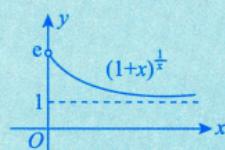
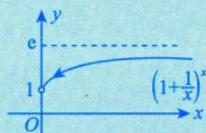

# 两个重要极限

> [!info] 概述
> 两个重要极限是计算极限的基础工具，广泛用于含三角函数和幂指函数的极限计算。

## 两个重要极限

> [!thm] 第一个重要极限
> $$\lim_{x \to 0} \frac{\sin x}{x} = 1$$
>
> **变式**：$\lim_{x \to 0} \frac{x}{\sin x} = 1$

> [!thm] 第二个重要极限
> $$\lim_{x \to \infty} \left(1 + \frac{1}{x}\right)^{x} = \mathrm{e}$$
>
> **等价形式**：$\lim_{x \to 0} (1 + x)^{\frac{1}{x}} = \mathrm{e}$

> [!personal] 函数 $f(x) = (1 + x)^{\frac{1}{x}}$ 的性质（2026-03-06）
>
> **理解内容**：
>
> 设 $f(x) = (1 + x)^{\frac{1}{x}}$ 在 $x > 0$ 时有以下性质：
>
> - **① 单调性**：$f(x)$ 在 $x > 0$ 时单调减少
> - **② 极限值**：$\lim_{x\to 0^{+}}f(x) = e$
> - **③ 渐近展开**：$(1 + x)^{\frac{1}{x}} - e \sim -\frac{e}{2}x$（当 $x \to 0^{+}$）
>
>
> **验证状态**：✅ 理解完全正确
>
> **关键推导**：
> - 性质①：取对数 $g(x) = \frac{\ln(1+x)}{x}$，证明 $g'(x) < 0$
> - 性质③：利用泰勒展开 $\ln(1+x) = x - \frac{x^2}{2} + o(x^2)$
>
> **应用场景**：
> - 性质①用于放缩法证明不等式
> - 性质③用于求极限时的等价无穷小替换

## 变量广义化 ⭐

> [!tip] 常考变量广义化
> **第一个重要极限广义化**：
> $$\lim_{\text{狗} \to 0} \frac{\sin \text{狗}}{\text{狗}} = 1$$
>
> **第二个重要极限广义化**：
> $$\lim_{\text{狗} \to \infty} \left(1 + \frac{1}{\text{狗}}\right)^{\text{狗}} = \mathrm{e}$$
>
> 其中"狗"可以是任意趋向于 0（或 $\infty$）的表达式。

## 使用条件 ⚠️

> [!warning] 第一个重要极限的使用条件
> - 分子必须是 $\sin$ 形式
> - 分母必须与 $\sin$ 的变量相同
> - 变量必须趋向于 0

> [!warning] 第二个重要极限的使用条件
> - 底数形式必须是 $(1 + \frac{1}{\text{某式}})$
> - 指数必须与底数中分母相同
> - 指数趋向于 $\infty$

## 考试重点 ⭐

| 重点 | 说明 |
|------|------|
| 频率 | ⭐⭐⭐⭐ 高频考点 |
| 题型 | 1. 直接应用 2. 变量广义化 3. 结合其他方法 |
| 关键 | 识别"狗"的形式 |

## 典型题型

### 第一个重要极限相关

1. **直接应用**：$\lim_{x \to 0} \frac{\sin 3x}{3x}$
2. **变形应用**：$\lim_{x \to 0} \frac{\tan x}{x}$（化为 $\frac{\sin x}{x \cos x}$）
3. **复合应用**：$\lim_{x \to 0} \frac{1 - \cos x}{x^{2}}$

### 第二个重要极限相关

1. **直接应用**：$\lim_{x \to \infty} \left(1 + \frac{2}{x}\right)^{x}$
2. **变形应用**：$\lim_{x \to 0} (1 + 2x)^{\frac{1}{x}}$
3. **$1^{\infty}$ 型**：$\lim_{x \to 0} \left(\frac{\sin x}{x}\right)^{\frac{1}{x^{2}}}$

## 解题方法

### 第一个重要极限

**步骤**：
1. 识别 $\sin$ 函数
2. 检查 $\sin$ 的变量是否趋向于 0
3. 凑出 $\frac{\sin \text{狗}}{\text{狗}}$ 的形式
4. 计算剩余部分

### 第二个重要极限

**步骤**：
1. 识别 $1^{\infty}$ 型极限
2. 将底数化为 $(1 + \frac{1}{\text{某式}})$ 形式
3. 确保指数与底数中分母相同
4. 结果为 $\mathrm{e}$

**$1^{\infty}$ 型简化公式**：
$$\lim u^{\nu} = \mathrm{e}^{\lim \nu(u - 1)}$$

## 易错点 ⚠️

> [!danger] 易错点1：变量不趋向于 0
> $\lim_{x \to \infty} \frac{\sin x}{x} \neq 1$
>
> **原因**：$x \to \infty$ 时，$\sin x$ 不趋向于 0，不能用第一个重要极限
>
> 正确解法：$\left|\frac{\sin x}{x}\right| \leq \frac{1}{|x|} \to 0$（夹逼准则）

> [!danger] 易错点2：底数形式不对
> $\lim_{x \to \infty} \left(1 + \frac{2}{x}\right)^{x} \neq \mathrm{e}$
>
> 正确解法：
> $$\lim_{x \to \infty} \left(1 + \frac{2}{x}\right)^{x} = \lim_{x \to \infty} \left[\left(1 + \frac{2}{x}\right)^{\frac{x}{2}}\right]^{2} = \mathrm{e}^{2}$$

## 常用结论速记

$$
\begin{aligned}
\lim_{x \to 0} \frac{\sin x}{x} &= 1 \\
\lim_{x \to 0} \frac{\tan x}{x} &= 1 \\
\lim_{x \to 0} \frac{1 - \cos x}{x^{2}} &= \frac{1}{2} \\
\lim_{x \to \infty} \left(1 + \frac{1}{x}\right)^{x} &= \mathrm{e} \\
\lim_{x \to 0} (1 + x)^{\frac{1}{x}} &= \mathrm{e}
\end{aligned}
$$

## 我的理解记录 🧠

## 相关知识点 📚

### 前置知识
- [[../3-函数极限的概念与性质/极限定义]] - 极限的基本概念

### 常考组合
- [[洛必达法则]] - 处理复杂极限
- [[七种未定式]] - $1^{\infty}$ 型的综合处理

---
*创建日期: 2026-03-04*
*来源: 高数资料/函数极限与连续*
