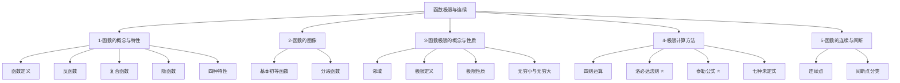

# 📑 函数极限与连续 - 知识索引

> [!info] 模块概述
> 本模块涵盖函数的基本概念、极限理论与计算、以及连续性分析，是考研数学的核心基础。

## 📁 知识结构

## 📚 模块导航

| 模块 | 说明 | 重点程度 | 进度 |
|------|------|:--------:|------|
| [[1-函数的概念与特性]] | 函数定义、反函数、复合函数、四种特性 | ⭐⭐⭐ | ✅ 已完成 |
| [[2-函数的图像]] | 基本初等函数、分段函数 | ⭐⭐⭐ | ✅ 已完成 |
| [[3-函数极限的概念与性质]] | 极限定义、性质、无穷小、无穷大 | ⭐⭐⭐⭐ | ⚠️ 72% |
| [[4-极限计算方法]] | **洛必达、泰勒公式**（重中之重） | ⭐⭐⭐⭐⭐ | 📝 笔记已生成 |
| [[5-函数的连续与间断]] | 连续性、间断点分类 | ⭐⭐⭐⭐ | 📝 笔记已生成 |

## 🎯 考试要点

> [!important] 重中之重
> 1. **洛必达法则** - 极限计算的核心工具
> 2. **泰勒公式** - 处理复杂极限的利器
> 3. **七种未定式的计算** - 考题主要集中点

## 📊 学习进度

参见：[[📊 学习进度]]

## 📝 笔记清单

### 4-极限计算方法（8个）✅ 已生成
- [[4-极限计算方法/四则运算规则]]
- [[4-极限计算方法/重要极限]]
- [[4-极限计算方法/无穷小的运算]]
- [[4-极限计算方法/洛必达法则]] ⭐⭐⭐⭐⭐
- [[4-极限计算方法/泰勒公式]] ⭐⭐⭐⭐⭐
- [[4-极限计算方法/泰勒展开原则]]
- [[4-极限计算方法/夹逼准则]]
- [[4-极限计算方法/七种未定式]] ⭐⭐⭐⭐⭐

### 5-函数的连续与间断（3个）✅ 已生成
- [[5-函数的连续与间断/连续点的定义]]
- [[5-函数的连续与间断/间断点的定义与分类]]
- [[5-函数的连续与间断/闭区间性质]]

## 🔗 相关链接

- 外部教材：`/Users/zhqznc/Documents/高数资料/函数极限与连续/`
- 配套习题：待补充
