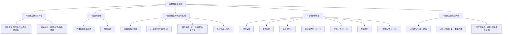

# 📝 函数极限与连续 - 章节总结

> [!info] 概述
> 本章是考研数学的核心基础，涵盖函数基本概念、极限理论与计算、连续性分析三大模块。

---

## 📁 知识结构总览



---

## 🔑 核心公式速查

### 1. 基本极限

| 公式 | 条件 |
|:-----|:-----|
| $\displaystyle \lim_{x \to 0} \frac{\sin x}{x} = 1$ | 重要极限 |
| $\displaystyle \lim_{x \to \infty} \left(1 + \frac{1}{x}\right)^x = e$ | 重要极限 |
| $\displaystyle \lim_{x \to 0} (1 + x)^{\frac{1}{x}} = e$ | 重要极限 |

### 2. 等价无穷小（$x \to 0$）

| 等价关系 | 说明 |
|:---------|:-----|
| $\sin x \sim x$ | 三角类 |
| $\tan x \sim x$ | 三角类 |
| $\arcsin x \sim x$ | 反三角类 |
| $\arctan x \sim x$ | 反三角类 |
| $\ln(1+x) \sim x$ | 对数类 |
| $e^x - 1 \sim x$ | 指数类 |
| $1 - \cos x \sim \frac{1}{2}x^2$ | **二阶！** |
| $a^x - 1 \sim x\ln a$ | 指数推广 |
| $(1+x)^\alpha - 1 \sim \alpha x$ | 二项式推广 |

### 3. 差函数等价无穷小

| 公式 | 阶数 |
|:-----|:-----|
| $x - \sin x \sim \frac{1}{6}x^3$ | 3阶 |
| $\arcsin x - x \sim \frac{1}{6}x^3$ | 3阶 |
| $\tan x - x \sim \frac{1}{3}x^3$ | 3阶 |
| $x - \arctan x \sim \frac{1}{3}x^3$ | 3阶 |

### 4. 泰勒公式（$x \to 0$）

| 函数 | 展开公式 |
|:-----|:---------|
| $e^x$ | $1 + x + \frac{x^2}{2!} + \frac{x^3}{3!} + o(x^3)$ |
| $\sin x$ | $x - \frac{x^3}{6} + o(x^3)$ |
| $\cos x$ | $1 - \frac{x^2}{2} + \frac{x^4}{24} + o(x^4)$ |
| $\ln(1+x)$ | $x - \frac{x^2}{2} + \frac{x^3}{3} + o(x^3)$ |
| $\arcsin x$ | $x + \frac{x^3}{6} + o(x^3)$ |
| $\arctan x$ | $x - \frac{x^3}{3} + o(x^3)$ |
| $(1+x)^\alpha$ | $1 + \alpha x + \frac{\alpha(\alpha-1)}{2!}x^2 + o(x^2)$ |

### 5. 无穷大增长速度（$x \to +\infty$）

$$\ln^{\alpha} x \ll x^{\beta} \ll a^x \quad (\alpha, \beta > 0, a > 1)$$

---

## 📊 七种未定式处理方法

| 类型 | 形式 | 处理方法 | 核心技巧 |
|:----:|:----:|:--------|:---------|
| 1 | $\frac{0}{0}$ | 等价无穷小/泰勒/洛必达 | 首选等价无穷小 |
| 2 | $\frac{\infty}{\infty}$ | 洛必达/抓大头 | 同除最高次幂 |
| 3 | $0 \cdot \infty$ | 化为 $\frac{0}{0}$ 或 $\frac{\infty}{\infty}$ | 简单因式放分母 |
| 4 | $\infty - \infty$ | 通分/有理化/倒代换 | 造分母后通分 |
| 5 | $\infty^{0}$ | 取对数 $e^{\lim \nu \ln u}$ | 转化为 $0 \cdot \infty$ |
| 6 | $0^{0}$ | 取对数 $e^{\lim \nu \ln u}$ | 转化为 $0 \cdot \infty$ |
| 7 | $1^{\infty}$ | **简化公式** $e^{\lim \nu(u-1)}$ | 高频！用简化公式 |

> [!warning] $1^\infty$ 简化公式
> $$\boxed{\lim u^{\nu} = e^{\lim \nu(u-1)}}$$
> 前提：底数 $u \to 1$，指数 $\nu \to \infty$

---

## 📌 间断点分类

```
间断点
├── 第一类：左右极限都存在
│   ├── 可去间断点 → 左右极限相等 ≠ 函数值（可"修补"）
│   └── 跳跃间断点 → 左右极限不相等
│
└── 第二类：左右极限至少有一个不存在
    ├── 无穷间断点 → 极限趋向 ∞
    └── 振荡间断点 → 极限振荡不存在（如 sin(1/x)）
```

### 判别流程

```
找到可疑点（无定义点 或 分段点）
            ↓
    求左右极限
            ↓
    左右极限都存在？
    ├── YES → 左极限 = 右极限？
    │         ├── YES → 可去间断点
    │         └── NO → 跳跃间断点
    └── NO → 第二类间断点
              ├── 极限 = ∞ → 无穷间断点
              └── 振荡 → 振荡间断点
```

---

## 📚 闭区间连续函数性质

| 定理 | 内容 | 关键条件 |
|:-----|:-----|:---------|
| 有界性定理 | 连续 ⇒ 有界 | **闭区间** |
| 最值定理 | 存在最大/最小值 | **闭区间** |
| 零点定理 | $f(a)\cdot f(b)<0$ ⇒ 存在根 | **闭区间** + 异号 |
| 介值定理 | 可取介于 m,M 之间的一切值 | **闭区间** |

---

## ⚠️ 易错点汇总

| # | 易错点 | 正确理解 |
|:--|:-------|:---------|
| 1 | 等价替换用于加减法 | **只能在乘除因子中替换** |
| 2 | $f(x)>0$ ⇒ 极限 $A>0$ | 只能推出 $A \geqslant 0$ |
| 3 | 泰勒展开阶数不够 | 看分母阶数，分子展开到同阶 |
| 4 | $\arctan x$ 符号记错 | $x - \frac{x^3}{3}$（负号！） |
| 5 | 忽略左右极限 | 分段函数必须分别求左右极限 |
| 6 | $\arcsin(\sin x) = x$ | 仅当 $x \in [-\frac{\pi}{2}, \frac{\pi}{2}]$ |

---

## 🎯 考试重点（按频率）

| 优先级 | 知识点 | 考频 |
|:------:|:-------|:----:|
| ⭐⭐⭐⭐⭐ | 洛必达法则 | 几乎每年必考 |
| ⭐⭐⭐⭐⭐ | 泰勒公式 | 核心利器 |
| ⭐⭐⭐⭐⭐ | 七种未定式 | 重中之重 |
| ⭐⭐⭐⭐⭐ | 保号性 | 极限性质最高频 |
| ⭐⭐⭐⭐ | 间断点分类 | 选择题高频 |
| ⭐⭐⭐⭐ | 闭区间性质 | 证明题工具 |

---

## 🔗 知识关联图

```
函数极限与连续
    │
    ├── 函数概念
    │     ├── 反函数 ↔ 复合函数
    │     └── 四种特性（奇偶/单调/周期/有界）
    │
    ├── 极限理论
    │     ├── ε-δ定义 → 极限存在性
    │     ├── 性质 → 保号性（核心！）
    │     └── 无穷小 → 等价替换基础
    │
    ├── 极限计算
    │     ├── 洛必达 ↔ 泰勒（双王牌）
    │     ├── 等价无穷小（简化工具）
    │     └── 七种未定式（综合应用）
    │
    └── 连续性
          ├── 连续点定义 → 三要素
          ├── 间断点分类 → 四种类型
          └── 闭区间性质 → 证明工具
```

---

> [!personal]
> 本章节总结由 AI 根据笔记自动生成，保留了所有原始笔记中的 `[!personal]` 个人理解记录。
> 生成时间：2026-05-11
