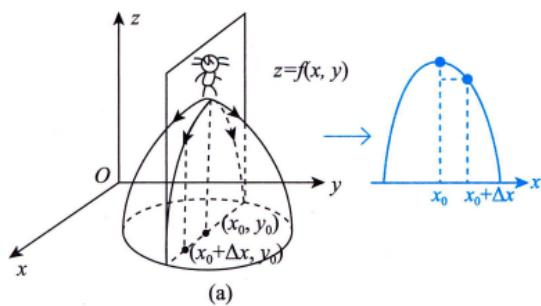
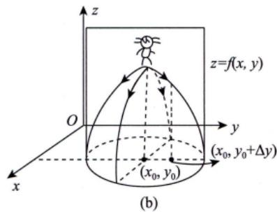

# 偏导数

> [!abstract] 一句话
> 偏导数 = 固定其他变量，只对一个变量求导。本质就是把二元函数降为一元函数再求导。

> [!tip] 联想一元函数
> 一元导数 $f'(x_0) = \lim_{\Delta x\to 0}\frac{f(x_0+\Delta x)-f(x_0)}{\Delta x}$ → 二元偏导就是把 $y$ 固定住，同样的公式。

---

## 定义

设函数 $z = f(x,y)$ 在点 $(x_0,y_0)$ 的某邻域内有定义，若极限

$$f_x'(x_0,y_0) = \lim_{\Delta x \to 0} \frac{f(x_0 + \Delta x,\, y_0) - f(x_0,\, y_0)}{\Delta x}$$

存在，则称此极限为 $z = f(x,y)$ 在 $(x_0,y_0)$ 处**对 $x$ 的偏导数**。

类似地，**对 $y$ 的偏导数**定义为

$$f_y'(x_0,y_0) = \lim_{\Delta y \to 0} \frac{f(x_0,\, y_0 + \Delta y) - f(x_0,\, y_0)}{\Delta y}$$

### 两种等价写法

做题时常需要将增量式转化为函数差值式：

$$f_x'(x_0,y_0) = \lim_{\Delta x\to 0}\frac{f(x_0 + \Delta x,\, y_0) - f(x_0,\, y_0)}{\Delta x} \xlongequal{x_0 + \Delta x = x} \lim_{x\to x_0}\frac{f(x,\, y_0) - f(x_0,\, y_0)}{x - x_0}$$

$$f_y'(x_0,y_0) = \lim_{\Delta y\to 0}\frac{f(x_0,\, y_0 + \Delta y) - f(x_0,\, y_0)}{\Delta y} \xlongequal{y_0 + \Delta y = y} \lim_{y\to y_0}\frac{f(x_0,\, y) - f(x_0,\, y_0)}{y - y_0}$$

> [!warning] 易混符号
> - 微分符号用 $\mathrm{d}$（正体）：$\mathrm{d}x$
> - 偏微分符号用 $\partial$：$\dfrac{\partial z}{\partial x}$

> [!info] 常用记号
> $$\frac{\partial z}{\partial x}\bigg|_{\substack{x=x_0\\y=y_0}},\quad \frac{\partial f}{\partial x}\bigg|_{\substack{x=x_0\\y=y_0}},\quad z_x'\bigg|_{\substack{x=x_0\\y=y_0}},\quad f_x'(x_0,y_0)$$
> 以上四种写法等价，都表示在 $(x_0,y_0)$ 处对 $x$ 的偏导数。

---

## 几何意义

| 偏导数 | 几何含义 |
|--------|---------|
| $f_x'(x_0,y_0)$ | 平面 $y=y_0$ 与曲面 $z=f(x,y)$ 的交线在 $(x_0,y_0,z_0)$ 处对 $x$ 轴的**斜率** |
| $f_y'(x_0,y_0)$ | 平面 $x=x_0$ 与曲面 $z=f(x,y)$ 的交线在 $(x_0,y_0,z_0)$ 处对 $y$ 轴的**斜率** |

> [!tip] 直观理解
> $f_x'$ 就是"沿 $x$ 方向切一刀看斜率"，$f_y'$ 是"沿 $y$ 方向切一刀"。
> 即：固定一个变量 $\to$ 曲面变成曲线 $\to$ 偏导数 = 曲线的切线斜率。

---

## 高阶偏导数

对 $z = f(x,y)$ 的偏导数再求偏导，得到四个二阶偏导数：

$$\frac{\partial^2 z}{\partial x^2} = f_{xx}'' \qquad \frac{\partial^2 z}{\partial x \partial y} = f_{xy}''$$

$$\frac{\partial^2 z}{\partial y^2} = f_{yy}'' \qquad \frac{\partial^2 z}{\partial y \partial x} = f_{yx}''$$

> [!important] 混合偏导数相等的条件
> 若 $f_{xy}''$ 和 $f_{yx}''$ 都**连续**，则 $f_{xy}'' = f_{yx}''$（与求导次序无关）。
>
> 实际做题中，初等函数的混合偏导都连续，所以**默认相等**。

---

## 考试常考要点

> [!example] 用定义求偏导（分段函数/非初等点）
> 分段函数在分段点处必须用**定义（极限式）**求偏导，不能直接对表达式求导。
>
> 例：判断 $f(x,y)$ 在 $(0,0)$ 处的偏导数是否存在，必须代定义：
> $$f_x'(0,0) = \lim_{x\to 0}\frac{f(x,0) - f(0,0)}{x}$$

> [!example] 偏导数存在 $\not\Rightarrow$ 连续
> 这是多元函数与一元函数的**重大区别**：
> - 一元函数：可导 $\Rightarrow$ 连续
> - 多元函数：偏导数存在 $\not\Rightarrow$ 函数连续
>
> 偏导数只反映沿坐标轴方向的行为，不能保证沿其他方向也连续。

---

> [!personal]
>
