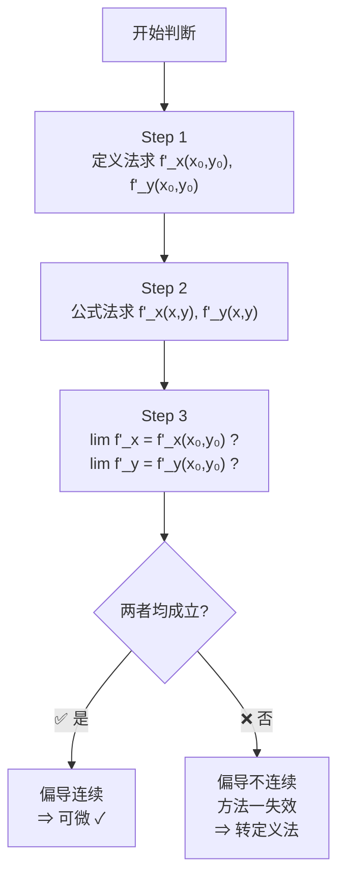

# 可微

## 一句话总结

> [!abstract] 核心定义
> **可微 = 全增量 $\Delta z$ 能写成"线性主部 + 高阶无穷小"的形式**
> $$\mathrm{d}z = \frac{\partial z}{\partial x}\mathrm{d}x + \frac{\partial z}{\partial y}\mathrm{d}y$$

> [!warning] 与一元函数的根本区别
> | 函数类型 | 可微 ⟺ 可导/偏导存在？ |
> |:------:|:--------------------:|
> | 一元函数 $y = f(x)$ | $\checkmark$ **等价** |
> | 二元函数 $z = f(x,y)$ | $\times$ **仅必要，不充分** |

---

## 二、引例：矩形面积的全增量

设矩形的长和宽分别为 $x$ 和 $y$，则面积 $S = xy$。

若 $x, y$ 分别增长 $\Delta x, \Delta y$，则面积增量为：

$$
\Delta S = (x + \Delta x)(y + \Delta y) - xy = \underbrace{y\Delta x + x\Delta y}_{\text{线性主部}} + \underbrace{\Delta x\Delta y}_{\text{高阶无穷小 } o(\rho)}
$$

### 关键概念：距离 $\rho$

为了衡量 $(x, y)$ 在二维平面上移动的总距离：

$$
\rho = \sqrt{(\Delta x)^2 + (\Delta y)^2}
$$

### 证明 $\Delta x\Delta y = o(\rho)$

使用经典不等式放缩 $(a-b)^2 \geqslant 0 \Rightarrow a^2 + b^2 \geqslant 2ab$：

$$
|\Delta x\Delta y| \leqslant \frac{(\Delta x)^2 + (\Delta y)^2}{2} = \frac{\rho^2}{2}
$$

因此：

$$
\lim_{\rho \to 0} \frac{|\Delta x\Delta y|}{\rho} \leqslant \lim_{\rho \to 0} \frac{\rho^2/2}{\rho} = \lim_{\rho \to 0} \frac{\rho}{2} = 0
$$

> [!personal] 💡 翻译成人话
> 当你的拉伸距离 $\rho$ 趋近于 $0$ 时，右上角小矩形面积 ($\Delta x\Delta y$) 缩小为零的速度比 $\rho$ 还快。它就是大名鼎鼎的 $o(\rho)$（$\rho$ 的高阶无穷小）。

### 结论

$$
\boxed{\Delta S = y\Delta x + x\Delta y + o(\rho) \quad (\rho \to 0)}
$$

称 $y\Delta x + x\Delta y$ 为函数 $S = xy$ 在点 $(x,y)$ 处的**全微分**。

---

## 三、形式化定义

### 3.1 一元函数回顾

> [!info] 一元函数可微
> $y = f(x)$ 可微时：
> $$\Delta y = f(x+\Delta x) - f(x) = A \cdot \Delta x + o(\Delta x)$$
> 记 $\mathrm{d}y = A\,\mathrm{d}x$，其中 $A = f'(x)$。

### 3.2 二元函数定义

设函数 $z = f(x,y)$ 在点 $(x,y)$ 的某邻域内有定义，若全增量

$$
\Delta z = f(x + \Delta x, y + \Delta y) - f(x, y)
$$

可表示为：

$$
\boxed{\Delta z = A\Delta x + B\Delta y + o(\rho)}
$$

其中：
- $A, B$ **仅与点 $(x, y)$ 有关**，与 $\Delta x, \Delta y$ 无关
- $\rho = \sqrt{(\Delta x)^2 + (\Delta y)^2}$
- $o(\rho)$ 为 $\rho$ 的高阶无穷小

则称 $z = f(x, y)$ 在点 $(x, y)$ 处**可微**，并称 $A\Delta x + B\Delta y$ 为**全微分**：

$$
\boxed{\mathrm{d}z = A\,\mathrm{d}x + B\,\mathrm{d}y}
$$

---

## 四、可微的条件体系

### 4.1 必要条件

> [!important] 偏导数存在 ⟹ 可微（不充分）
> 若 $z = f(x,y)$ 在点 $(x,y)$ 处可微，则偏导数**必存在**，且：
> $$A = \frac{\partial z}{\partial x}, \quad B = \frac{\partial z}{\partial y}$$

因此全微分可记为：

$$
\boxed{\mathrm{d}z = \frac{\partial z}{\partial x}\mathrm{d}x + \frac{\partial z}{\partial y}\mathrm{d}y}
$$

#### 一元 vs 二元 对比

| 函数类型 | 可微 ⟹ 可导/偏导存在 | 可导/偏导存在 ⟹ 可微 |
|:------:|:----------------:|:----------------:|
| 一元 $y = f(x)$ | $\checkmark$ | $\checkmark$ |
| 二元 $z = f(x,y)$ | $\checkmark$ | $\times$ |

**证明**（一元可微 ⟹ 可导）：

$$
\Delta y = A \cdot \Delta x + o(\Delta x) \implies \lim_{\Delta x \to 0} \frac{\Delta y}{\Delta x} = A
$$

反之亦然。

### 4.2 充分条件

> [!success] 偏导数连续 ⟹ 可微
> 若 $z = f(x,y)$ 在点 $(x,y)$ 处的**偏导数存在且连续**，则该函数在点 $(x,y)$ 处可微。

$$
\left.\begin{array}{l}
f'_x(x,y) \text{ 存在} \\
f'_y(x,y) \text{ 存在}
\end{array}\right\}
\xRightarrow{\text{偏导数连续}}
f(x,y) \text{ 可微}
$$

即需要满足：

$$
\lim_{(\Delta x, \Delta y) \to (0,0)} f'_x(x + \Delta x, y + \Delta y) = f'_x(x, y)
$$
$$
\lim_{(\Delta x, \Delta y) \to (0,0)} f'_y(x + \Delta x, y + \Delta y) = f'_y(x, y)
$$

> [!note] 📌 重要结论
> 在区域 $D$ 上，若 $\mathrm{d}[f(x, y)] = 0$ 或 $\frac{\partial f}{\partial x} = \frac{\partial f}{\partial y} = 0$，则 $f(x, y) \equiv C$（常数），$(x, y) \in D$。

### 4.3 条件关系图


---

## 五、可微的判别步骤（核心⭐）

### 三步判别法

> [!example] 判断 $z = f(x,y)$ 在点 $(x_0, y_0)$ 处是否可微

**Step 1** — 写出全增量

$$
\Delta z = f(x_0 + \Delta x, y_0 + \Delta y) - f(x_0, y_0)
$$

**Step 2** — 写出线性增量

$$
A = f'_x(x_0, y_0), \quad B = f'_y(x_0, y_0)
$$
$$
A\Delta x + B\Delta y
$$

**Step 3** — 作极限判断

$$
\boxed{\lim_{\substack{\Delta x \to 0 \\ \Delta y \to 0}}
\frac{\Delta z - (A\Delta x + B\Delta y)}{\sqrt{(\Delta x)^2 + (\Delta y)^2}} = 0 \;?}
$$

| 结果 | 结论 |
|:----:|:----:|
| 极限 $= 0$ | **可微** — 线性近似完美贴合曲面 |
| 极限 $\neq 0$ | **不可微** — 曲面在此点有尖点或裂缝 |

---

## 六、考研实战决策树

### 方法一：偏导连续定理（快捷通道）

> [!success] 核心逻辑
> **偏导数存在且连续** $\Rightarrow$ 可微（充分不必要条件）

| 适用场景 | 操作步骤 |
|:--------|:--------|
| 常规初等函数 | 1. 求 $f'_x(x_0, y_0)$ 和 $f'_y(x_0, y_0)$ |
| 多项式、指数/对数/三角组合 | 2. 观察偏导函数是否连续 |
| 非分段点、非奇点 | 3. 结论：因偏导数存在且连续，故可微 |

#### 判断偏导数是否连续的步骤

> [!info] 要干什么？
> 验证"偏导连续 $\Rightarrow$ 可微"这个充分条件是否能用——即检验 $f'_x(x,y)$ 和 $f'_y(x,y)$ 在 $(x_0,y_0)$ 处是否真的连续。

---

**Step 1** — 定点求值（用**定义法**求 $(x_0,y_0)$ 处的偏导数值）

得到两个基准值，作为 Step 3 的比较对象。

$$
f'_x(x_0,y_0) = \lim_{\Delta x \to 0} \frac{f(x_0+\Delta x, y_0) - f(x_0,y_0)}{\Delta x}
\qquad
f'_y(x_0,y_0) = \lim_{\Delta y \to 0} \frac{f(x_0, y_0+\Delta y) - f(x_0,y_0)}{\Delta y}
$$

> [!tip] 什么时候需要这一步？
> 只有**分段函数在分段点**才需要算。正常初等函数直接代入即可。

---

**Step 2** — 全域求导（用**公式法**求偏导函数 $f'_x(x,y), f'_y(x,y)$）

将 $f(x,y)$ 视为普通函数，对 $x$ 求导时把 $y$ 当常数，对 $y$ 求导时把 $x$ 当常数。

> [!warning] 注意
> - 如果 $f(x,y)$ 是分段函数，Step 2 公式法只能求**非分段的表达式**
> - 分段点处的偏导值 = Step 1 的结果，不在 Step 2 的公式范围内

---

**Step 3** — 极限比较

$$
\boxed{\lim_{\substack{x \to x_0 \\ y \to y_0}} f'_x(x,y) \stackrel{?}{=} f'_x(x_0,y_0)},
\qquad
\boxed{\lim_{\substack{x \to x_0 \\ y \to y_0}} f'_y(x,y) \stackrel{?}{=} f'_y(x_0,y_0)}
$$

| 判定 | 含义 | 下一步 |
|:----:|:----|:-----|
| 两等式均成立 | 偏导数在 $(x_0,y_0)$ 处**连续** | $\Rightarrow$ **函数可微**（方法一收工） |
| 至少一个不成立 | 偏导数在 $(x_0,y_0)$ 处**不连续** | 方法一失效，转**方法二：定义法** |



> [!danger] ⚠️ 致命死穴
> - **偏导不连续 ≠ 不可微** — 定理的逆不成立，此时方法一失效，但函数仍可能可微，必须用定义法判
> - **偏导不存在时**，该定理直接无法使用

### 方法二：定义法（终极法庭）

> [!success] 核心逻辑
> **全增量与线性增量的误差是 $\rho$ 的高阶无穷小** $\Leftrightarrow$ 可微（充要条件）

| 适用场景 | 说明 |
|:--------|:-----|
| 证明**不可微** | 唯一指定方法 |
| 带绝对值的函数 | 如 $f(x,y) = \|xy\|$ |
| 含分母趋于 0 的瑕点 | 如 $f(x,y) = \dfrac{x\|y\|}{\sqrt{x^2+y^2}}$ |
| 方法一走不通时 | 偏导数不连续或不存在时的兜底 |

### 决策流程图

```
判断可微性
    │
    ├─► 观察函数形态
    │       │
    │       ├─► 正常初等函数（无绝对值，无分母→0）
    │       │       → 走【方法一】：求偏导看连续性
    │       │
    │       ├─► 带绝对值（如 |xy|）
    │       │       → 直接走【方法二】：定义法
    │       │
    │       ├─► 分段函数 / 奇点
    │       │       → 走【方法二】：定义法
    │       │
    │       └─► 题目要求证明"不可微"
    │               → 只能走【方法二】：证极限≠0
```

---

## 七、判别步骤的直觉理解

> [!personal] 🪵 用木板贴山坡——三步法的物理直觉
>
> 在微积分里，"可微"的本质就是：这个曲面在这一点足够光滑，使得你可以用一个平平的板子（切平面）去极其精准地贴合它。
>
> ### Step 1：全增量 $\Delta z$ — "你在山坡上的实际海拔变化"
>
> 假设你站在一座真实的山坡（曲面 $z = f(x,y)$）上的某一点 $(x_0, y_0)$。你往东走了 $\Delta x$，往北走了 $\Delta y$。$\Delta z$ 就是你真实感受到的海拔高度的实际变化量。
>
> ### Step 2：线性增量 $A\Delta x + B\Delta y$ — "木板上的预测海拔变化"
>
> 你掏出了一块绝对平坦的木板（切平面），以你脚下的点为切点，贴在山坡上。
> - $A = f'_x$：木板在正东方向的坡度
> - $B = f'_y$：木板在正北方向的坡度
>
> 如果踩着这块平平的木板同样往东走 $\Delta x$、往北走 $\Delta y$，你的海拔会升高 $A\Delta x + B\Delta y$。这就是你的预测变化量（全微分 $\mathrm{d}z$）。
>
> ### Step 3：极限判断 — "预测的到底准不准？"
>
> - **分子** $\Delta z - (A\Delta x + B\Delta y)$：真实与预测的**误差**
> - **分母** $\rho = \sqrt{(\Delta x)^2 + (\Delta y)^2}$：移动的直线水平距离
>
> 关键要求：**误差缩小的速度，必须比脚步移动的距离（$\rho$）还要快！** 这就是误差是 $o(\rho)$ 的含义。
>
> ### 总结
>
> | 极限结果 | 物理含义 |
> |:--------|:--------|
> | $= 0$ | 木板完美贴合山坡，山坡光滑，**函数可微** |
> | $\neq 0$ | 即使走极短距离误差也降不下来，山坡有尖顶或裂缝，**函数不可微** |

---

## 八、知识关联

| 前置知识 | 本节内容 | 后续延伸 |
|:--------|:--------|:--------|
| 一元函数可微 | 多元函数可微 | 全微分形式不变性 |
| 偏导数定义 | 偏导数存在 ≠ 可微 | 方向导数与梯度 |
| 极限与无穷小 | $o(\rho)$ 概念 | 泰勒公式 |

---

## 九、考研真题常见陷阱

> [!warning] 易错点汇总
>
> 1. **混淆充分条件和必要条件**
>    - 偏导存在 ≠ 可微
>    - 偏导连续 = 可微（充分条件）
>
> 2. **定理的逆命题不成立**
>    - "偏导数不连续"不能推出"不可微"
>    - "偏导数不存在"也不能推出"不可微"
>
> 3. **定义法的使用时机**
>    - 当且仅当需要证明**不可微**时，必须用定义法
>
> 4. **$\rho$ 的定义**
>    - $\rho = \sqrt{(\Delta x)^2 + (\Delta y)^2}$，不是 $|\Delta x| + |\Delta y|$

---

> [!personal]
>
