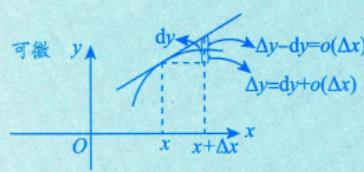
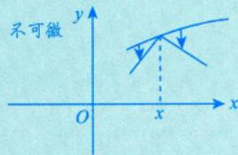
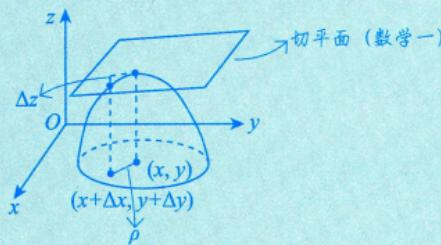
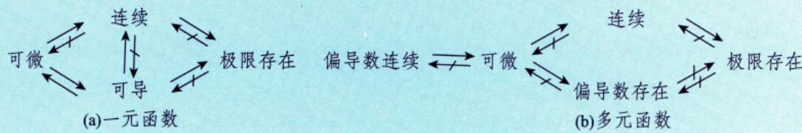

# 可微

> [!abstract] 一句话
> 可微 = 全增量 $\Delta z$ 能写成"线性主部 + 高阶无穷小"的形式。全微分 $\mathrm{d}z = \frac{\partial z}{\partial x}\mathrm{d}x + \frac{\partial z}{\partial y}\mathrm{d}y$。

> [!tip] 联想一元函数
> 一元：$\Delta y = f'(x)\Delta x + o(\Delta x)$，可微 $\Leftrightarrow$ 可导。二元：可微 $\nLeftarrow\Rightarrow$ 偏导数存在！**这是一个重大区别**。

---

## 引例：矩形面积的全增量

设矩形的长和宽分别为 $x$ 和 $y$，则面积 $S = xy$。若 $x, y$ 分别增长 $\Delta x, \Delta y$，则面积增量为

$$
\Delta S = (x + \Delta x)(y + \Delta y) - xy = \underbrace{y\Delta x + x\Delta y}_{\text{线性组合}} + \Delta x\Delta y
$$

其中偏导数 $S'_x = y$，$S'_y = x$。右端由两部分组成：
- **线性主部**：$y\Delta x + x\Delta y$，是 $\Delta x, \Delta y$ 的线性函数
- **高阶无穷小**：$\Delta x\Delta y$，因为

$$
\lim_{\rho \to 0} \frac{|\Delta x\Delta y|}{\sqrt{(\Delta x)^2 + (\Delta y)^2}} \leqslant \lim_{\rho \to 0} \frac{\frac{(\Delta x)^2 + (\Delta y)^2}{2}}{\sqrt{(\Delta x)^2 + (\Delta y)^2}} = \lim_{\rho \to 0} \frac{\sqrt{(\Delta x)^2 + (\Delta y)^2}}{2} = 0
$$

因此当 $\Delta x \to 0, \Delta y \to 0$ 时，$\Delta x\Delta y$ 是比 $\rho = \sqrt{(\Delta x)^2 + (\Delta y)^2}$ 高阶的无穷小，即

$$
\Delta S = y\Delta x + x\Delta y + o(\rho) \quad (\rho \to 0)
$$

称 $y\Delta x + x\Delta y$ 为函数 $S = xy$ 在点 $(x,y)$ 处的**全微分**。

---

## 1. 定义

> [!info] 对比一元函数
> 一元函数 $y = f(x)$ 可微时：$\Delta y = f(x+\Delta x) - f(x) = A \cdot \Delta x + o(\Delta x)$，记 $\mathrm{d}y = A\,\mathrm{d}x$，其中 $A = f'(x)$。

设函数 $z = f(x,y)$ 在点 $(x,y)$ 的某邻域内有定义，若 $z = f(x,y)$ 在该点的**全增量**

$$
\Delta z = f(x + \Delta x, y + \Delta y) - f(x, y)
$$

可表示为

$$
\Delta z = A\Delta x + B\Delta y + o(\rho)
$$

其中 $A, B$ **仅与点 $(x, y)$ 有关**，而与 $\Delta x, \Delta y$ 无关；$\rho = \sqrt{(\Delta x)^2 + (\Delta y)^2}$，且当 $\rho \to 0$ 时 $o(\rho)$ 为 $\rho$ 的高阶无穷小，则称函数 $z = f(x, y)$ 在点 $(x, y)$ 处**可微**，并称 $A\Delta x + B\Delta y$ 为函数在点 $(x, y)$ 处的**全微分**，记为

$$
\mathrm{d}z = A\,\mathrm{d}x + B\,\mathrm{d}y
$$

---

## 2. 可微的必要条件

若函数 $z = f(x,y)$ 在点 $(x,y)$ 处可微，则该函数在该点处的偏导数**必存在**，且

$$
A = \frac{\partial z}{\partial x}, \quad B = \frac{\partial z}{\partial y}
$$

因此，全微分可记为

$$
\mathrm{d}z = \frac{\partial z}{\partial x}\mathrm{d}x + \frac{\partial z}{\partial y}\mathrm{d}y
$$

> [!warning] 与一元函数的区别
> ① 一元函数：可微 $\Leftrightarrow$ 可导（等价）
> ② 二元函数：可微 $\Rightarrow$ 偏导数存在（仅充分，不必要也不充分）

### 一元 vs 二元对比

**① 一元函数** $y = f(x)$：可微 $\Leftrightarrow$ 可导

$$
\Delta y = A \cdot \Delta x + o(\Delta x) \implies \lim_{\Delta x \to 0} \frac{\Delta y}{\Delta x} = \lim_{\Delta x \to 0} \frac{A \cdot \Delta x + o(\Delta x)}{\Delta x} = A
$$

反之，若 $f(x)$ 可导，即 $\lim_{\Delta x \to 0}\frac{\Delta y}{\Delta x} = A \implies \frac{\Delta y}{\Delta x} = A + \alpha \implies \Delta y = A \cdot \Delta x + o(\Delta x)$，记 $\mathrm{d}y = A\,\mathrm{d}x$。

**② 二元函数** $z = f(x,y)$：可微 $\Rightarrow$ 偏导数存在（但 $\Leftarrow$ 不成立）

若 $z$ 可微时：

$$
\Delta z = A \cdot \Delta x + B \cdot \Delta y + o(\rho), \quad \mathrm{d}z = \frac{\partial z}{\partial x}\mathrm{d}x + \frac{\partial z}{\partial y}\mathrm{d}y
$$

---

## 3. 可微的充分条件

> [!important] 偏导数连续 $\Rightarrow$ 可微
> 若函数 $z = f(x,y)$ 在点 $(x,y)$ 处的**偏导数存在且连续**，则该函数在点 $(x,y)$ 处可微。

$$
\left.\begin{array}{l} f'_x(x,y) \text{ 存在} \\ f'_y(x,y) \text{ 存在} \end{array}\right\} \xRightarrow{\text{偏导数连续}} f(x,y) \text{ 可微}
$$

即需要满足：

$$
\lim_{(\Delta x, \Delta y) \to (0,0)} f'_x(x + \Delta x, y + \Delta y) = f'_x(x, y)
$$

$$
\lim_{(\Delta x, \Delta y) \to (0,0)} f'_y(x + \Delta x, y + \Delta y) = f'_y(x, y)
$$

> [!note] 注
> 在区域 $D$ 上，若 $\mathrm{d}[f(x, y)] = 0$ 或 $\frac{\partial f}{\partial x} = \frac{\partial f}{\partial y} = 0$，则 $f(x, y) \equiv C$（常数），$(x, y) \in D$。

### 判别偏导数是否连续的步骤

判别函数 $z = f(x,y)$ 在点 $(x_0, y_0)$ 处的偏导数是否连续：

1. 用**定义法**求 $f'_x(x_0, y_0)$，$f'_y(x_0, y_0)$
2. 用**公式法**求 $f'_x(x, y)$，$f'_y(x, y)$
3. 计算极限 $\lim_{\substack{x \to x_0 \\ y \to y_0}} f'_x(x, y)$ 和 $\lim_{\substack{x \to x_0 \\ y \to y_0}} f'_y(x, y)$
4. 判断是否成立：

$$
\lim_{\substack{x \to x_0 \\ y \to y_0}} f'_x(x, y) = f'_x(x_0, y_0), \quad \lim_{\substack{x \to x_0 \\ y \to y_0}} f'_y(x, y) = f'_y(x_0, y_0)
$$

若均成立，则 $z = f(x, y)$ 在点 $(x_0, y_0)$ 处的偏导数连续。

---

## 4. 可微的判别步骤

> [!example] 核心方法
> 判别函数 $z = f(x,y)$ 在点 $(x_0, y_0)$ 处是否可微：

**Step 1** — 写出全增量

$$
\Delta z = f(x_0 + \Delta x, y_0 + \Delta y) - f(x_0, y_0)
$$

**Step 2** — 写出线性增量，其中 $A = f'_x(x_0, y_0)$，$B = f'_y(x_0, y_0)$

$$
A\Delta x + B\Delta y
$$

**Step 3** — 作极限判断

$$
\lim_{\substack{\Delta x \to 0 \\ \Delta y \to 0}} \frac{\Delta z - (A\Delta x + B\Delta y)}{\sqrt{(\Delta x)^2 + (\Delta y)^2}} = 0?
$$

- 极限**等于 0** → 可微
- 极限**不等于 0** → 不可微

---

## 关系总结图

一元函数和多元函数在极限存在、连续、可导、可微的相互关系上，有相同之处，更有相异之处（记号"$\Longrightarrow$"表示可推出，"$\longrightarrow$"表示不一定推出）：

---

> [!personal]
>
