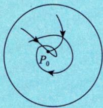

# 极限

> [!abstract] 一句话
> $\lim_{(x,y)\to(x_0,y_0)} f(x,y) = A$：$(x,y)$ 以**任意方式**趋向 $(x_0,y_0)$ 时，$f(x,y)$ 都趋于 $A$。

> [!tip] 联想一元函数
> 一元：$x \to x_0$ 只有**左右两条路** $\to$ 二元：$(x,y) \to (x_0,y_0)$ 有**无穷多条路**。

---

## 定义

设函数 $f(x,y)$ 在区域 $D$ 上有定义， $P_{0}(x_{0},y_{0})\in D$ 或为区域 $D$ 边界上的一点.如果对于任意给定的 $\varepsilon >0$ ，总存在 $\delta >0$ ，当点 $P(x,y)\in D$ ，且满足 $0 < |PP_0| = \sqrt{(x - x_0)^2 + (y - y_0)^2} < \delta$ 时，恒有

  

$$

\left| f (x, y) - A \right| < \varepsilon ,

$$

  

则称常数 $A$ 为 $(x,y)\to (x_0,y_0)$ 时 $f(x,y)$ 的极限，记作

  

$$

\lim _ {(x, y) \rightarrow (x _ {0}, y _ {0})} f (x, y) = A \text {或} \lim _ {\substack {x \rightarrow x _ {0}\\y \rightarrow y _ {0}}} f (x, y) = A,

$$

  

也常记作

  

$$

\lim _ {P \rightarrow P _ {0}} f (P) = A.

$$

$$\lim_{(x,y) \to (x_0,y_0)} f(x,y) = A \;\Leftrightarrow\; \forall\varepsilon>0,\;\exists\delta>0,\;0<|PP_0|<\delta \Rightarrow |f(x,y)-A|<\varepsilon$$

## 证明极限不存在

> [!important] 核心方法
> 找**两条不同路径**使极限值不等 $\Rightarrow$ 极限不存在。
>
> 常用路径：$y = 0$（沿 $x$ 轴）、$y = x$（沿对角线）、$y = kx$（沿直线）、$y = x^2$（沿抛物线）

## 脱帽法

$$\lim_{(x,y) \to (x_0,y_0)} f(x,y) = A \;\Leftrightarrow\; f(x,y) = A + \alpha$$

其中 $\alpha$ 是 $(x,y) \to (x_0,y_0)$ 时的无穷小量。

> [!tip] 用途
> 已知极限值，需要把 $f(x,y)$ 写成"极限值 + 无穷小"的形式时使用。

## 可用方法

> [!warning] 不能用！
> **洛必达法则**和**单调有界准则**不能用于二重极限。

> [!success] 可以用
> 等价无穷小替换、夹逼准则、四则运算、代入法、脱帽法
>
> **常用等价无穷小**（$(x,y) \to (0,0)$）：
> $e^{x^2+y^2}-1 \sim x^2+y^2$，$(1+u)^a-1 \sim au$

---

> [!personal]
>
