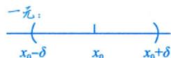
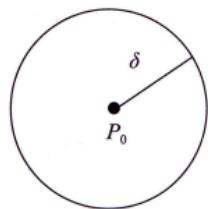
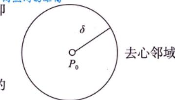
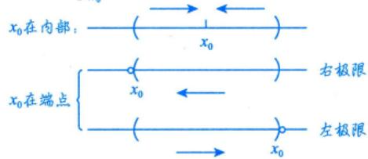

# 邻域

> [!abstract] 一句话
> 邻域就是"以某点为中心的小圆盘"，是一元函数"小区间"的二维推广。

> [!tip] 联想一元函数
> 一元的 $U(x_0,\delta) = \{x \mid |x - x_0| < \delta\}$ 是**区间** $\to$ 二元的 $U(P_0,\delta)$ 是**圆盘**。

---

## δ 邻域

设 $P_0(x_0, y_0)$ 是 $xOy$ 平面上一点，$\delta > 0$，与点 $P_0$ 的距离小于 $\delta$ 的点 $P(x,y)$ 的全体，称为点 $P_0$ 的 **$\delta$ 邻域**，记为 $U(P_0, \delta)$：

$$U(P_0, \delta) = \left\{ (x, y) \mid \sqrt{(x - x_0)^2 + (y - y_0)^2} < \delta \right\}$$

> [!info] 几何意义
> 以 $P_0$ 为圆心、$\delta$ 为半径的**开圆盘**（不含边界）。

---

## 去心 δ 邻域

$$\dot{U}(P_0, \delta) = \left\{ P \mid 0 < |PP_0| < \delta \right\}$$

> [!warning] 易错
> 讨论极限时用的是**去心**邻域，即不包含 $P_0$ 点本身。

---

## 与一元极限的联系

一元极限的 $\varepsilon$-$\delta$ 语言：

$$\lim_{x \to x_0} f(x) = A \Leftrightarrow \forall \varepsilon > 0, \exists \delta > 0, \text{当 } 0 < |x - x_0| < \delta \text{ 时}, |f(x) - A| < \varepsilon$$

> [!tip] 核心思想
> $\delta$ 刻画 $x$ 与 $x_0$ 的靠近程度，$\varepsilon$ 刻画 $f(x)$ 与 $A$ 的靠近程度。多元情形完全类比，只是 $|x - x_0|$ 变为 $|PP_0|$（两点间距离）。

---

> [!personal]
>
