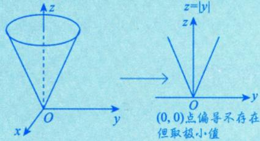

# 无条件极值

> [!abstract] 一句话
> 找驻点（$f_x'=0, f_y'=0$），然后用 $\Delta = AC - B^2$ 判别：$\Delta>0$ 是极值，$\Delta<0$ 不是，$\Delta=0$ 失效。

> [!tip] 联想一元函数
> 一元：$f'(x_0)=0$，再用 $f''(x_0)$ 判断 $\to$ 二元：$f_x'=f_y'=0$，再用 $\Delta=AC-B^2$ 判断。

---

## 第一步：必要条件（找驻点）

1)二元函数取极值的必要条件(类比一元函数).

  

$f^{\prime}(0) = 0$ ，但在 $x = 0$ 处不取极值

  

设 $z = f(x,y)$ 在点 $(x_0,y_0)$ 处 $\left\{ \begin{array}{l}\text{一阶偏导数存在，}\\ \text{取极值，} \end{array} \right.$

  

则 $f_{x}^{\prime}(x_{0},y_{0}) = 0,f_{y}^{\prime}(x_{0},y_{0}) = 0$

  

$$

\text {一 元 函 数} y = f (x) \text {在 点} x = x _ {0} \text {处} \left\{ \begin{array}{l l} \text {可 导} \\ \text {取 极 值} \end{array} \Rightarrow f ^ {\prime} \left(x _ {0}\right) = 0 \right.

$$

$$f_x'(x_0,y_0) = 0, \quad f_y'(x_0,y_0) = 0$$

> [!warning] 别漏掉
> 偏导数**不存在**的点也可能是极值点！
> 例如 $z = \sqrt{x^2+y^2}$ 在 $(0,0)$ 取极小值，但偏导数不存在。

**可疑点 = 驻点 + 偏导数不存在的点**

## 第二步：充分条件（判别极值）

> [!important] ⭐⭐⭐ $\Delta = AC - B^2$ 判别法（必背）

设 $f(x,y)$ 在点 $(x_0,y_0)$ 的某邻域内连续且有一阶及二阶连续偏导数，又 $f_{x}^{\prime}(x_{0},y_{0}) = 0$ ， $f_{y}^{\prime}(x_{0},y_{0}) = 0$ ：

  

记 $\left\{ \begin{array}{l} f_{xx}''(x_0, y_0) = A, \\ f_{xy}''(x_0, y_0) = B, \end{array} \right.$ 则 $A = AC - B^2$ $\begin{cases} > 0 \Rightarrow \text{极值} \\ A > 0 \Rightarrow \text{极小值}, \end{cases}$ $\begin{cases} < 0 \Rightarrow \text{非极值}, \\ = 0 \Rightarrow \text{方法失效}, \end{cases}$ 另谋他法.

$$A = f_{xx}''(x_0,y_0), \quad B = f_{xy}''(x_0,y_0), \quad C = f_{yy}''(x_0,y_0)$$

$$\Delta = AC - B^2$$

| $\Delta$ | $A$ | 结论 | 口诀 |
|:--------:|:---:|------|------|
| $> 0$ | $> 0$ | **极小值** | 开心 |
| $> 0$ | $< 0$ | **极大值** | 不开心 |
| $< 0$ | 任意 | **不是极值** | 小哑巴猪 |
| $= 0$ | 任意 | **方法失效** | 大鼻子爷爷 |

> [!tip] 辅助记忆
> $\Delta > 0$ 时 $AC > B^2 \geqslant 0$，所以 $A,C$ 一定**同号**：$A>0$ 就是极小，$A<0$ 就是极大。

> [!warning] 注意
> 此充分条件**只适用于二元函数**，不能直接推广到三元及以上！

## 附加结论

> [!important] 常考选择结论
> 若 $f(x,y)$ 在 $(x_0,y_0)$ 取**极大值**，则 $f_{xx}''(x_0,y_0) \leqslant 0$ 且 $f_{yy}''(x_0,y_0) \leqslant 0$。
>
> 注意是 $\leqslant$（可以为 0），例如 $f = -(x^4+y^4)$ 在 $(0,0)$ 取极大值，但二阶偏导都是 0。

综合(1)，(2)，可用必要条件求出所有可疑点，再用充分条件判别这些可疑点是不是极值点.

---

> [!personal]
>
