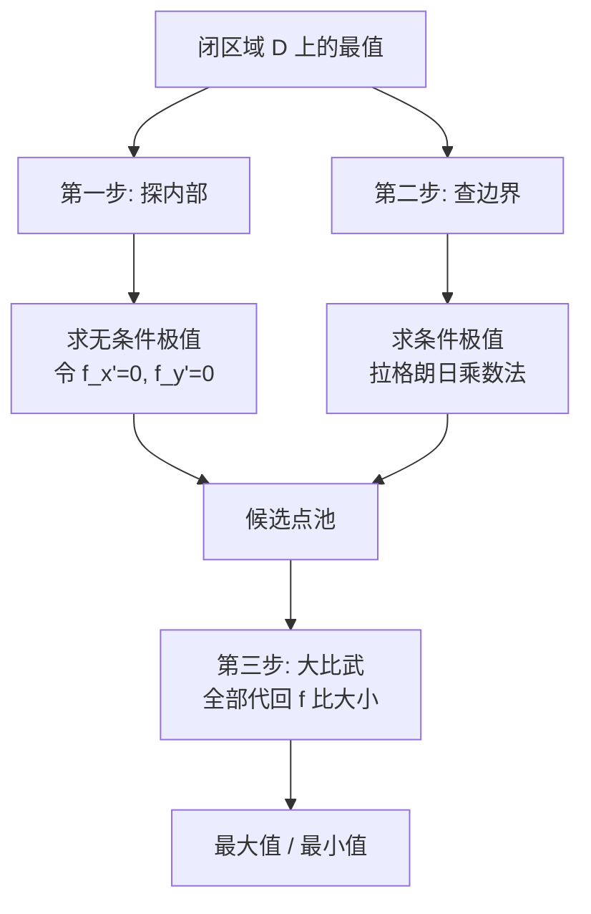

# 条件最值与拉格朗日乘数法

> [!abstract] 一句话核心
> 有约束求最值 $\;\to\;$ 构造 $F = f + \lambda\varphi$，令所有偏导 $=0$，解方程组，比大小。

---

## 1. 适用场景

| 问题类型 | 方法 | 说明 |
|---------|------|------|
| 无条件极值 | 令偏导 $=0$ 求驻点 | 内部自由变化 |
| **条件极值** | **拉格朗日乘数法** | 在曲面上找最值 |
| 约束可解出变量 | **直接代入**（首选！） | 化为无条件，避免复杂方程组 |

> 联想一元函数：一元没有直接对应的方法。二元/三元有约束时用拉格朗日乘数法，本质是**把约束条件"吸进"目标函数**。

---

## 2. 标准步骤（四步流程）

> [!example] 求 $u = f(x,y,z)$ 在 $\begin{cases}\varphi(x,y,z)=0 \\ \psi(x,y,z)=0\end{cases}$ 下的最值

**Step 1 — 构造拉格朗日函数**
$$
F = f(x,y,z) + \lambda\,\varphi(x,y,z) + \mu\,\psi(x,y,z)
$$

> 变量数 $=$ 目标函数自变量数 $+$ 约束条件数
>
> 例：$f(x,y)$ 一个约束 $\Rightarrow$ $F(x,y,\lambda)$（3 个变量）

**Step 2 — 令所有偏导为零**
$$
\begin{cases}
f_x' + \lambda\varphi_x' + \mu\psi_x' = 0 \\[2pt]
f_y' + \lambda\varphi_y' + \mu\psi_y' = 0 \\[2pt]
f_z' + \lambda\varphi_z' + \mu\psi_z' = 0 \\[2pt]
\varphi(x,y,z) = 0 \\[2pt]
\psi(x,y,z) = 0
\end{cases}
$$
$n$ 个自变量 $+$ $m$ 个约束 $\Rightarrow$ $n+m$ 个方程

**Step 3 — 解方程组得备选点 $P_1, P_2, \ldots$**

> $\lambda, \mu$ 是辅助消元的"工具人"，最终目标是求出 $(x, y, z)$。

**Step 4 — 比较各点函数值**
$$
\max = \max_i f(P_i), \quad \min = \min_i f(P_i)
$$

> 考研数学中不需要用二阶导数判断极值，直接**代入原函数比大小**即可。

---

## 3. 必考：闭区域最值问题 SOP（两步走，最后比大小）

> [!danger] 高频考点
> 面对闭区域 $D$ 上的最值问题（如 $x^2 + \frac{y^2}{4} \leqslant 1$），**必须两步走，不能只用拉格朗日**。

### 🗺️ 三部曲总览



---

### 3.1 第一步：探内部（无条件极值）

**动作**：直接令偏导数为零，解方程组：
$$
f_x' = 0, \quad f_y' = 0
$$

**结果判别 —— 三重门**：

| 情况 | 处理 | 图示 |
|:----|:----|:----:|
| ✅ 算出驻点，**且**在闭区域 $D$ **内** | **有效** → 进入最终候选池 | 🟢 |
| ❌ 算出驻点，但落在闭区域 $D$ **外** | **无效** → 直接划掉，此山顶你走不到 | 🔴 |
| ⚠️ 方程无解（如 $2=0$） | **无驻点** → 说明是一面纯斜坡，直接跳到第二步看边界 | 🟡 |

> [!tip] 记忆口诀
> 内部找驻点，域内才有效；域外直接扔，无解跳边界。

---

### 3.2 第二步：查边界（条件极值）

**动作**：面对等式约束（如 $x^2 + \frac{y^2}{4} = 1$），启动拉格朗日乘数法。

**构造**：
$$
F(x,y,\lambda) = f(x,y) + \lambda\,g(x,y)
$$

**求解**：
$$
F_x' = 0, \quad F_y' = 0, \quad F_\lambda' = 0
$$

解出所有的 $(x,y)$，**这些点全部是边界上的极值备选点**，进入候选池。

> [!warning] 注意
> - **封闭约束**（如整个椭圆）：拉格朗日驻点即可覆盖
> - **不封闭约束**（如圆弧的一段、带 $x \ge 0$ 限制）：**必须额外补充端点**检查

---

### 3.3 第三步：大比武（终极对决）

**动作**：把【第一步保留的有效内部驻点】和【第二步算出的所有边界点】**全部代回原函数** $f(x,y)$。

**结论**：
$$
\max\limits_{(x,y)\in D} f(x,y) = \max\{\,f(P_1), f(P_2), \ldots\,\}
$$
$$
\min\limits_{(x,y)\in D} f(x,y) = \min\{\,f(P_1), f(P_2), \ldots\,\}
$$

> [!tip] 考研不需要二阶判别
> 直接代回原函数比数值大小即可，**不需要**用二阶偏导或 Hessian 矩阵判断极大极小。

---

### 3.4 与内部驻点的本质区别（登山类比）

| 问题类型 | 类比 | 方法 |
|:---------|:-----|:-----|
| **无条件极值**（内部自由点） | 整座山自由走动找山顶 | 走到地势平坦处（$f_x'=0, f_y'=0$），**不需要拉格朗日** |
| **条件极值**（约束曲线上的点） | 只能沿一条小路走，找小路上的最高点 | 拉格朗日乘数法引入 $\lambda$ |
| **闭区域最值** | 先在山内部找，再到边界小路上找，最后比高低 | 两步法：内部偏导 + 边界拉格朗日 |

> [!important] 一句话分清
> - 内部自由走 $\to$ 偏导为0（无需求 $\lambda$）
> - 约束曲线/边界上走 $\to$ 拉格朗日乘数法（必须引入 $\lambda$）
> - **闭区域求最值 = 先查内部 + 再查边界，最后统一比大小**

---

### 3.5 什么时候走几步？看符号：铁丝 vs 面团

> 初学者最容易踩的坑：拿到题不先看符号，直接闷头开算。

#### 场景一：约束是 $=$ —— 一根"铁丝"

**题目条件**：曲线 $x^2 + 4y^2 = 4$

**含义**：符号是严格的 **等于号**（$=$），你的活动范围仅仅是这个椭圆的**边界线条本身**（就像一根弯曲的铁丝），**不包含椭圆内部的任何空间**。

**做法**：既然只能在这根铁丝上移动，根本进不到内部去，自然就**完全不需要（也不能）去求内部驻点**。直接上拉格朗日乘数法求边界极值即可。

#### 场景二：约束是 $\leqslant$ —— 一块"面团"

**题目条件**：求区域 $x^2 + 4y^2 \leqslant 4$ 上到直线 $2x + 3y - 6 = 0$ 的距离最近的点

**含义**：符号变成了 **小于等于号**（$\leqslant$），你的活动范围就变成了一个**实心的"面团"**（包含了内部空间和边界）。

**做法**：只有在这种情况下，才需要严格执行"**两步走**"战略：
1. 先查内部驻点（令偏导为 0）
2. 再查边界极值（拉格朗日乘数法）

> [!tip] 考场速判
>
> | 题目标志 | 范围 | 方法 |
> |:--------|:----|:-----|
> | $=\;$ 约束（铁丝） | 仅边界线条 | 只用拉格朗日乘数法 |
> | $\leqslant\;$ 约束（面团） | 内部 + 边界 | 两步走：内部偏导 + 边界拉格朗日 |
>
> **拿到题第一件事：看符号！看符号！看符号！**

---

## 4. 备选点完整策略

$$
\text{完整备选点} = \{\text{内部驻点}\} \;\cup\; \{\text{拉格朗日驻点}\} \;\cup\; \{\text{约束边界端点}\}
$$

> [!important] 核心原则
> 拉格朗日乘数法**只能找到约束曲线/曲面上的驻点**，**绝对不能**用来找区域内部的自由驻点。
>
> - **封闭约束**（如整个圆）：拉格朗日驻点即可覆盖最值
> - **不封闭约束**（如圆弧的一段、带 $x \ge 0$ 限制）：**必须补充端点**——端点即使不满足拉格朗日方程组，也可能是最值点

**驻点的几何含义**：在约束曲线/曲面上，目标函数等值面与约束曲面**相切**的点，它们是最值的"候选人"。

---

## 5. 解方程组实战要点

> [!warning] 易错点
>
> 1. **检查取值范围** — 解出的点必须落在题目范围内（如第一象限、$x>0$ 等），不在的直接舍弃
> 2. **分类讨论 $\lambda$** — 解方程时注意 $\lambda=0$ 和 $\lambda \neq 0$ 两种情况，漏了可能丢解
> 3. **对称性简化** — 若目标函数和约束条件有对称性（如 $x,y$ 轮换对称），可设 $x=y$ 简化
> 4. **不封闭曲线** — 牢记：还要检查端点！

---

## 6. 简化技巧

> [!tip] 能代入就代入
> 若约束 $\varphi(x,y,z)=0$ 容易解出 $z = z(x,y)$，**直接代入目标函数**化为无条件极值问题。
>
> 这避免了拉格朗日乘数法的复杂方程组，是考试中的首选策略。

**决策路径：**

```
约束是否容易解出一个变量？
├── 是 → 代入目标函数 → 无条件极值（求偏导 = 0）
└── 否 → 拉格朗日乘数法（构造 F → 联立方程组）
```

---

## 个人笔记

> [!personal] 一句话记住分工
>
> - 内部自由走 $\to$ 偏导为0（无需求 $\lambda$）
> - 约束曲线/边界上走 $\to$ 拉格朗日乘数法（必须引入 $\lambda$）
> - 闭区域求最值 = **先查内部（偏导=0）+ 再查边界（拉格朗日）**，最后统一比大小
>
