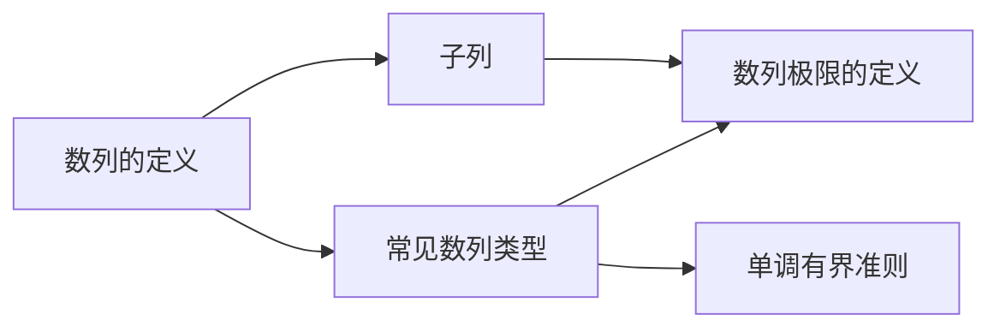

# 0-数列的概念

> [!info] 模块概述
> 数列的概念是数列极限学习的基础。本节涵盖数列的定义、子列以及常见数列类型，为后续学习数列极限的定义、性质和计算方法奠定基础。

## 📚 知识点导航

| 序号 | 知识点 | 说明 | 考试频率 |
|:----:|--------|------|:--------:|
| 1 | [[数列的定义]] | 数列的基本定义、几何意义、本质（整标函数） | ⭐⭐⭐ |
| 2 | [[子列]] | 子列的定义、性质、判断数列发散的方法 | ⭐⭐⭐⭐ |
| 3 | [[常见数列类型]] | 等差、等比、单调、有界数列及前n项和公式 | ⭐⭐⭐⭐ |

## 📖 学习路线

### 建议学习顺序

1. **数列的定义** → 理解数列的本质是整标函数 $x_n = f(n)$
2. **常见数列类型** → 掌握等差、等比、单调、有界数列的定义和公式
3. **子列** → 理解子列与原数列收敛的关系，掌握发散判别法

## 🎯 考试要点

### 必背公式

#### 等差数列
- 通项公式：$a_n = a_1 + (n-1)d$
- 前 $n$ 项和：$S_n = \frac{n}{2}[2a_1 + (n-1)d] = \frac{n}{2}(a_1 + a_n)$

#### 等比数列
- 通项公式：$a_n = a_1 \cdot r^{n-1}$
- 前 $n$ 项和：$S_n = \begin{cases} na_1, & r = 1 \\ \frac{a_1(1-r^n)}{1-r}, & r \neq 1 \end{cases}$

#### 常用求和公式
| 公式 | 内容 |
|------|------|
| 自然数和 | $\sum_{k=1}^{n} k = \frac{n(n+1)}{2}$ |
| 平方和 | $\sum_{k=1}^{n} k^2 = \frac{n(n+1)(2n+1)}{6}$ |
| 裂项相消 | $\sum_{k=1}^{n} \frac{1}{k(k+1)} = \frac{n}{n+1}$ |

### 核心定理

> [!thm] 子列收敛定理
> 若数列 $\{a_n\}$ 收敛，则其任何子列 $\{a_{n_k}\}$ 也收敛到同一极限。
>
> **推论**：$\lim_{n \to \infty} a_n = a \Leftrightarrow \lim_{k \to \infty} a_{2k} = a$ 且 $\lim_{k \to \infty} a_{2k-1} = a$

### 重要结论

> [!important] 重要数列 $\left\{\left(1 + \frac{1}{n}\right)^n\right\}$
> 1. **单调递增**
> 2. **有上界**（$< e < 3$）
> 3. **极限为 $e$**：$\lim_{n \to \infty} \left(1 + \frac{1}{n}\right)^n = e$

## ⚠️ 易错点汇总

| 易错点 | 说明 |
|--------|------|
| 混淆数列与集合 | 数列关注顺序和重复，集合不关注 |
| 部分子列收敛 $\not\Rightarrow$ 原数列收敛 | 必须所有子列收敛到同一极限 |
| 无穷大量 $\neq$ 无界变量 | 无穷大量要求所有子列都趋于 $\infty$ |
| 有界 $\not\Rightarrow$ 收敛 | 有界是收敛的必要条件，不是充分条件 |

## 🔗 与后续章节的联系

| 本节知识点 | 后续应用 |
|------------|----------|
| 数列的定义 | [[../1-数列极限的定义/README\|数列极限的定义]] |
| 子列的发散判别法 | [[../2-用性质/README\|收敛数列的性质]] |
| 单调数列 + 有界数列 | [[../6-用单调有界准则/README\|单调有界准则]] |
| 等价无穷小 | [[../5-用夹逼准则/README\|夹逼准则]] |
| 数列的函数本质 | [[../4-海涅定理/README\|海涅定理]] |

---

*资料来源: 高数资料/第二章：数列极限/数列极限.md*
