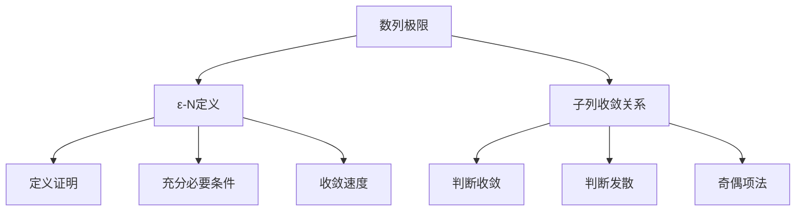

# 1-用定义 模块索引

## 📋 模块概述

本模块包含数列极限的**定义法证明**相关内容，是数列极限的基础部分。

### 核心内容

| 文件 | 主要内容 | 考试频率 |
|------|----------|----------|
| [[ε-N定义]] | 数列极限的 $\varepsilon-N$ 定义、充分必要条件判断 | ⭐⭐⭐ |
| [[子列收敛关系]] | 子列收敛定理、判断发散的方法 | ⭐⭐⭐⭐ |

## 🗺️ 知识点导航

## 📚 学习路线

### 路线1：基础理解（推荐）
1. **先学** [[ε-N定义]] - 理解数列极限的数学语言
2. **再学** [[子列收敛关系]] - 掌握子列与原数列的关系

### 路线2：应试导向
1. **重点** [[子列收敛关系]] - 判断发散的高频考点
2. **补充** [[ε-N定义]] - 理解充分必要条件

## 🔗 相关模块

### 前置模块
- [[数列的概念]] - 数列的基本定义（位于高数资料）

### 后续模块
- [[2-收敛数列的性质]] - 唯一性、有界性、保号性
- [[3-夹逼准则]] - 用夹逼准则求极限
- [[4-单调有界准则]] - 证明极限存在

### 跨章节关联
- **海涅定理** - 数列极限与函数极限的桥梁（位于函数极限章节）

## ⚠️ 易错点汇总

| 易错点 | 说明 | 参考 |
|--------|------|------|
| $\varepsilon$ 依赖于 $n$ | $\frac{1}{n}$ 不能作为 $\varepsilon$ 的等价替换 | [[ε-N定义#易错点1]] |
| 子列覆盖不全 | $\{a_{3k}\}, \{a_{3k+1}\}$ 都收敛不能推出原数列收敛 | [[子列收敛关系#易错点1]] |
| 无界 ≠ 无穷大 | 无界变量不一定是无穷大量 | [[子列收敛关系#例3]] |

## 📝 典型例题索引

### ε-N 定义
- [[ε-N定义#例1]] - 用定义证明 $\lim_{n \to \infty} \frac{n}{n+1} = 1$
- [[ε-N定义#例2]] - 判断充分必要条件（$\frac{1}{2^k}$ 替换）
- [[ε-N定义#例3]] - 收敛速度问题（$\frac{1}{n}$ 替换）

### 子列收敛关系
- [[子列收敛关系#例1]] - 证明 $\{(-1)^n\}$ 发散
- [[子列收敛关系#例2]] - 证明 $\{n^{(-1)^n}\}$ 发散
- [[子列收敛关系#例3]] - 无界变量判断

---
*创建日期: 2026-03-09*
*最后更新: 2026-03-09*
