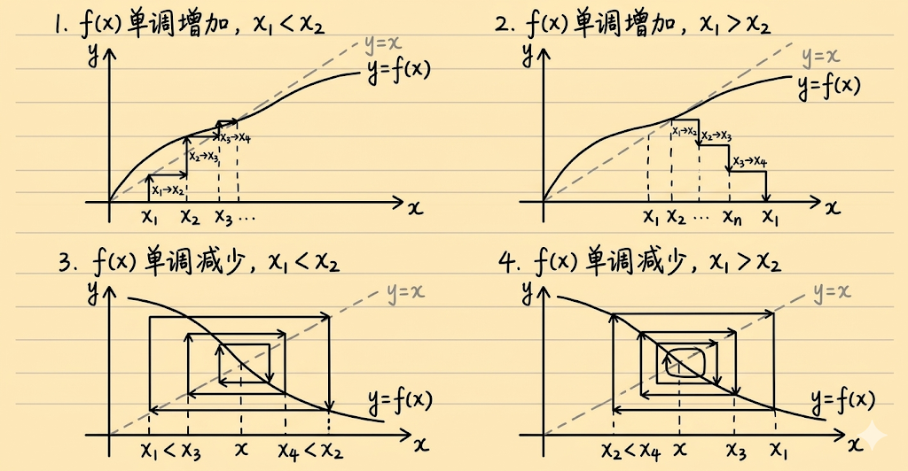

# 单调有界准则

## 定理陈述

> [!thm] 单调有界准则
> **单调有界数列必有极限**
>
> 若数列 $\{x_n\}$ 满足下列条件之一：
> - 单调增加且有上界
> - 单调减少且有下界
>
> 则 $\lim_{n \to \infty} x_n$ 存在。

> [!note] 数学表示
> 记：$x_n \leqslant x_{n+1} \leqslant a$，则 $\lim_{n \to \infty} x_n$ 存在。

## 定理意义

> [!important] 核心地位
> 单调有界准则是讨论数列极限存在的**两个最重要的准则之一**，另外一个是夹逼准则。

## 不等关系

> [!warning] 两种情况
>
> | 情况 | 单调性 | 有界性 | 结论 |
> |------|--------|--------|------|
> | 情况1 | 单调增加 | 有上界 | 极限存在 |
> | 情况2 | 单调减少 | 有下界 | 极限存在 |

> [!tip] 关键技巧
> - 证明数列单调增加时，**只需**再证明有上界，**无须**再证明有下界
> - 证明数列有上界时，**只需**再证明单调增加即可
> - 第二种情况同理

## 证明单调性的常用方法

### 方法一：作差法 ⭐⭐⭐⭐⭐

> [!tip] 作差法
> 计算 $x_{n+1} - x_n$：
> - 若 $x_{n+1} - x_n > 0$，则 $\{x_n\}$ 单调增加
> - 若 $x_{n+1} - x_n < 0$，则 $\{x_n\}$ 单调减少

**适用**：递推形式 $x_{n+1} = f(x_n)$ 的数列

### 方法二：作商法 ⭐⭐⭐⭐

> [!tip] 作商法（同号数列）
> 计算 $\frac{x_{n+1}}{x_n}$：
> - 若 $\frac{x_{n+1}}{x_n} > 1$，则 $\{x_n\}$ 单调增加
> - 若 $\frac{x_{n+1}}{x_n} < 1$，则 $\{x_n\}$ 单调减少

**适用**：$x_n > 0$（或 $x_n < 0$）的数列

### 方法三：数学归纳法 ⭐⭐⭐⭐

> [!tip] 数学归纳法步骤
> ① 验证 $n = 1$ 成立
> ② 假设 $n = k$ 成立
> ③ 证明 $n = k + 1$ 成立

### 方法四：利用重要不等式 ⭐⭐⭐

**常用不等式**（见夹逼准则）：
- $\sqrt{ab} \leqslant \frac{a + b}{2}$（$a, b > 0$）
- $|\sin x| \leqslant |x|$
- $e^x \geqslant 1 + x$

### 方法五：差分同号法 ⭐⭐⭐

> [!tip] 差分同号
> 若 $x_n - x_{n-1}$ 与 $x_{n-1} - x_{n-2}$ 同号，则 $\{x_n\}$ 单调。

### 方法六：导数判断法 ⭐⭐⭐⭐⭐

> [!important] 导数判断法
> 设 $x_{n+1} = f(x_n)$，$x_n \in$ 区间 $I$：
>
> | $f'(x)$ 的符号 | 数列单调性 |
> |-------------|----------|
> | $f'(x) > 0$ | **单调**（需结合 $x_2$ 与 $x_1$ 的关系判断增减） |
> | $f'(x) < 0$ | **不单调**（摆动） |



> [!tip] 通俗理解：递推数列的"传递规则"
> 当数列满足 $x_{n+1} = f(x_n)$ 时，每一项都通过函数 $f$ "传递"到下一项。**函数的单调性决定了这种传递是否保持大小关系**。
>
> **情况一：$f'(x) > 0$（函数单调递增）**
>
> 函数像楼梯一样：输入大→输出也大，输入小→输出也小。
> - 若 $x_2 > x_1$，则 $f(x_2) > f(x_1)$，即 $x_3 > x_2$，继续传递下去，数列**递增**
> - 若 $x_2 < x_1$，则 $f(x_2) < f(x_1)$，即 $x_3 < x_2$，继续传递下去，数列**递减**
> - **口诀**："顺水推舟，大小关系不变"
>
> **情况二：$f'(x) < 0$（函数单调递减）**
>
> 函数像滑梯：输入大→输出反而小，输入小→输出反而大。
> - 若 $x_2 > x_1$，则 $f(x_2) < f(x_1)$，即 $x_3 < x_2$（翻转！）
> - 然后 $x_4 = f(x_3) > f(x_2) = x_3$（又翻转！）
> - 结果：$x_1 < x_2 > x_3 < x_4 > x_5 < ...$，数列**摆动**
> - **口诀**："逆水行舟，大小反复翻转"
>
> **例子**：设 $x_{n+1} = \frac{1}{x_n + 1}$，$x_1 = 1$
> - $x_1 = 1$，$x_2 = 0.5$（变小），$x_3 = 0.67$（变大），$x_4 = 0.6$（变小）...
> - 1 → 0.5 → 0.67 → 0.6... 忽大忽小，摆动收敛！

> [!warning] 详细结论
> **当 $f'(x) > 0$（$f(x)$ 单调增加）时**：
> - 若 $x_2 > x_1$，则 $\{x_n\}$ 单调增加
> - 若 $x_2 < x_1$，则 $\{x_n\}$ 单调减少
>
> **当 $f'(x) < 0$（$f(x)$ 单调减少）时**：
> - 数列 $\{x_n\}$ **不单调**（摆动）
> - 此时需用**压缩映射原理**处理

## 典型题型

### 题型一：递推数列的极限

**形式**：$x_{n+1} = f(x_n)$，证明极限存在并求极限值

**解题步骤**：
1. 证明数列有界
2. 证明数列单调
3. 由单调有界准则，极限存在
4. 设 $\lim_{n \to \infty} x_n = a$，对递推式两边取极限
5. 解方程 $a = f(a)$，求出 $a$

### 题型二：方程根与递推数列结合

**形式**：
1. 证明方程 $x = f(x)$ 在某区间有唯一实根
2. 对于该实根 $\xi$，任取 $x_1$，定义 $x_{n+1} = f(x_n)$
3. 证明 $\lim_{n \to \infty} x_n = \xi$

**解题步骤**：
1. 用零点定理证明根存在
2. 用单调性证明根唯一
3. 用数学归纳法证明 $x_n$ 与 $\xi$ 的关系
4. 证明 $\{x_n\}$ 单调有界
5. 求极限

### 题型三：数列不单调的情况

**处理方法**：压缩映射原理

## 解题流程图

```
递推数列极限问题
         │
         ▼
判断 f'(x) 的符号
         │
    ┌────┴────┐
    │         │
f'(x) > 0    f'(x) < 0
    │         │
    ▼         ▼
数列单调    数列不单调
    │         │
    ▼         ▼
证明有界    压缩映射原理
    │         │
    ▼         │
极限存在    │
    │         │
    ▼         ▼
设极限为 a ───→ 由夹逼准则 → x_n → a
    │
    ▼
解方程 a = f(a)
    │
    ▼
得出结果
```

## 易错点 ⚠️

- [ ] 只证明单调性忘记证明有界性
- [ ] 单调增加需证明有上界（不是下界）
- [ ] 单调减少需证明有下界（不是上界）
- [ ] $f'(x) < 0$ 时错误地用单调有界准则
- [ ] 忘记检验极限的合理性（如极限必须大于0）

## 我的理解记录 🧠

### 初始理解
- （待填写）

### 误区记录
- （待填写）

### 学习进展
- （待填写）

## 相关知识点 📚

### 前置知识
- [[../2-用性质/有界性/有界性|有界性]] - 有界性的定义与证明
- [[../5-用夹逼准则/夹逼准则|夹逼准则]] - 另一个极限存在准则

### 相关内容
- [[例2.12解析|例2.12：递推数列极限]]
- [[例2.13解析|例2.13：单调性判断]]
- [[例2.14解析|例2.14：方程根与极限]]
- [[例2.15解析|例2.15：压缩映射]]
- [[压缩映射原理|压缩映射原理]] - 数列不单调时的处理

### 后续应用
- [[../../高数-函数极限与连续|函数极限]] - 单调有界准则在函数中的应用

---

*创建日期: 2026-03-09*
