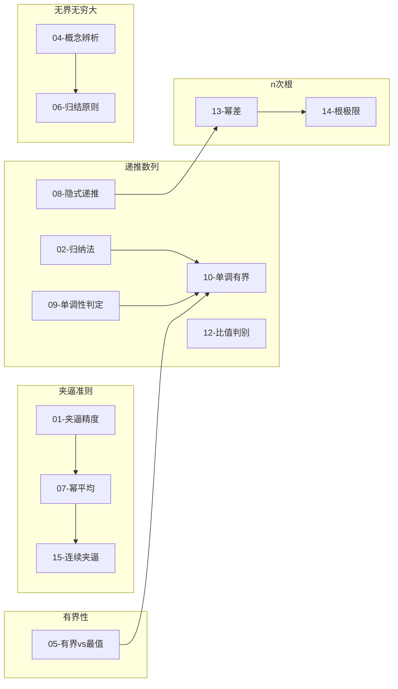

# 高数-数列极限 · 错题本

> [!info] 本模块错题索引
>
> 按知识点分类，快速定位薄弱环节。**更新日期**：2026-03-25

---

## 📚 按知识点分类索引

### 🎯 夹逼准则应用

| 序号 | 错题标题 | 核心陷阱 | 难度 |
|------|----------|----------|------|
| [01](#错题01夹逼准则放缩精度问题) | 夹逼准则放缩精度问题 | 分子有规律变化时错误使用 $n \cdot u_{\max}$ | ⭐⭐⭐ |
| [07](#重要结论07幂平均极限夹逼准则经典应用) | 📌 **重要结论**：幂平均极限 | 需要记住的公式 | ⭐⭐⭐ |
| [15](#错题15连续函数夹逼极限最值定理应用) | 连续函数夹逼极限：最值定理应用 | 不知道如何用连续函数的最值建立夹逼关系 | ⭐⭐⭐ |

### 🔄 递推/递归数列

| 序号 | 错题标题 | 核心陷阱 | 难度 |
|------|----------|----------|------|
| [02](#错题02递推数列有界性证明归纳法缺失) | 递推数列有界性证明：归纳法缺失 | 使用均值不等式时默认前提成立，忽略证明 | ⭐⭐⭐ |
| [08](#错题08隐式递推数列极限变量归一化与阶数判定) | 隐式递推数列极限：变量归一化与阶数判定 | 试图直接解出 $a_n$ 表达式，不会用等价无穷小替换 | ⭐⭐⭐⭐ |
| [09](#错题09递归数列单调性判定函数单调性≠数列单调性) | 递归数列单调性判定：函数单调性 ≠ 数列单调性 | 误认为"$f(x)$ 减 $\implies$ 数列减" | ⭐⭐⭐ |
| [10](#错题10递归数列极限证明单调有界定理大题模板) | 递归数列极限证明：单调有界定理（大题模板） | 不知道如何找下界、如何用归纳法 | ⭐⭐⭐⭐ |
| [12](#错题12比值判别法求递推数列极限极限值的确定) | 比值判别法求递推数列极限：极限值的确定 | 只证明极限存在，未反证极限值 | ⭐⭐⭐ |

### 📐 有界性与单调性

| 序号 | 错题标题 | 核心陷阱 | 难度 |
|------|----------|----------|------|
| [02](#错题02递推数列有界性证明归纳法缺失) | 递推数列有界性证明：归纳法缺失 | 使用均值不等式时默认前提成立，忽略证明 | ⭐⭐⭐ |
| [05](#错题05数列有界性≠最值存在性) | 数列有界性 ≠ 最值存在性 | 误认为有界数列必有最大最小值 | ⭐⭐⭐ |
| [09](#错题09递归数列单调性判定函数单调性≠数列单调性) | 递归数列单调性判定：函数单调性 ≠ 数列单调性 | 误认为"$f(x)$ 减 $\implies$ 数列减" | ⭐⭐⭐ |
| [10](#错题10递归数列极限证明单调有界定理大题模板) | 递归数列极限证明：单调有界定理（大题模板） | 不知道如何找下界、如何用归纳法 | ⭐⭐⭐⭐ |

### 📊 无界与无穷大

| 序号 | 错题标题 | 核心陷阱 | 难度 |
|------|----------|----------|------|
| [04](#错题04无界变量vs无穷大量概念混淆) | 无界变量 vs 无穷大量：概念混淆 | 混淆"存在无界子列"与"所有子列都无界" | ⭐⭐⭐ |
| [06](#错题06函数极限中的无界与无穷大归结原则) | 函数极限中的无界与无穷大：归结原则 | 误认为 $\frac{1}{x} \to \infty$ 就代表函数是无穷大量 | ⭐⭐⭐ |

### 📈 n次根与幂极限

| 序号 | 错题标题 | 核心陷阱 | 难度 |
|------|----------|----------|------|
| [07](#重要结论07幂平均极限夹逼准则经典应用) | 📌 **重要结论**：幂平均极限 | 需要记住的公式 | ⭐⭐⭐ |
| [13](#错题13幂差极限阶数匹配等价无穷小替换) | 幂差极限阶数匹配：等价无穷小替换 | 不会凑 $(1+u)^\alpha-1$ 形式，提取公因式方向选择不当 | ⭐⭐⭐ |
| [14](#错题14n次根极限多项式增长的根极限) | n 次根极限：多项式增长的根极限 | 误以为"无穷大的数"n 次根一定很大 | ⭐⭐⭐ |
| [15](#错题15连续函数夹逼极限最值定理应用) | 连续函数夹逼极限：最值定理应用 | 不知道如何用连续函数的最值建立夹逼关系 | ⭐⭐⭐ |

### 🔢 等价无穷小与阶数

| 序号 | 错题标题 | 核心陷阱 | 难度 |
|------|----------|----------|------|
| [08](#错题08隐式递推数列极限变量归一化与阶数判定) | 隐式递推数列极限：变量归一化与阶数判定 | 试图直接解出 $a_n$ 表达式，不会用等价无穷小替换 | ⭐⭐⭐⭐ |
| [13](#错题13幂差极限阶数匹配等价无穷小替换) | 幂差极限阶数匹配：等价无穷小替换 | 不会凑 $(1+u)^\alpha-1$ 形式，提取公因式方向选择不当 | ⭐⭐⭐ |

### ⚡ 保号性与极限性质

| 序号 | 错题标题 | 核心陷阱 | 难度 |
|------|----------|----------|------|
| [03](#错题03绝对值极限证明三角不等式左侧放缩) | 绝对值极限证明：三角不等式左侧放缩 | 不知道如何将 $\|a_n\|-\|A\|\|$ 与 $\|a_n-A\|$ 建立联系 | ⭐⭐ |
| [05](#错题05数列有界性≠最值存在性) | 数列有界性 ≠ 最值存在性 | 误认为有界数列必有最大最小值 | ⭐⭐⭐ |
| [11](#错题11极限收敛vs收敛速度保号性应用) | 极限收敛 vs 收敛速度：保号性应用 | 误以为极限能确定收敛速度（如 $1/n$） | ⭐⭐ |

---

## 🔗 错题关联网络



---

## 错题01：夹逼准则放缩精度问题（算错一次4月3）

> [!example] 夹逼准则放缩精度问题 ⚠️
> **题目**：计算极限
> $$\lim_{n\to \infty}\left(\frac{1}{n^2 + n + 1} +\frac{2}{n^2 + n + 2} +\dots +\frac{n}{n^2 + n + n}\right)$$

---

> [!personal] 我的卡点 & 错因分析 🧠
>
> **错误方法**：直接套用基本公式 $n \cdot u_{\min} \le \sum_{i=1}^{n} u_i \le n \cdot u_{\max}$
>
> **找最小项**：
> - 当 $i=1$ 时，分子最小且分母（相对）最大
> - $u_{\min} = \dfrac{1}{n^2+n+1}$
> - 左界 $= n \cdot \dfrac{1}{n^2+n+1} \xrightarrow{n\to\infty} 0$
>
> **找最大项**：
> - 当 $i=n$ 时，虽然分母最大，但分子增长更快
> - $u_{\max} = \dfrac{n}{n^2+n+n}$
> - 右界 $= n \cdot \dfrac{n}{n^2+2n} = \dfrac{n^2}{n^2+2n} \xrightarrow{n\to\infty} 1$
>
> **❌ 错误结果**：得到 $0 \le \text{原式} \le 1$
>
> **结论**：左右极限不相等，夹逼准则失效，无法确定极限值。

---

**错因诊断**：

| 问题 | 说明 |
|------|------|
| **放缩太狠** | 原式每一项 $u_i$ 的分子是在剧烈变化的（从 $1$ 到 $n$） |
| **信息丢失** | 把所有项都看作 $u_{\min}$ 时，强行把分子全都变成了 $1$；看作 $u_{\max}$ 时，又强行把分子全都变成了 $n$ |
| **量级不对** | 原式分子的和应该是 $\sum i = \dfrac{n(n+1)}{2}$，这是 $n^2$ 级别。而放缩把分子变成了 $n$ 级（左）或 $n^2$ 级（右），导致范围拉得太开，"夹不死了" |

---

✅ **正确解法**（精细放缩）：

**核心逻辑**：保持分子（变动项）不动，只统一缩放分母（固定项）。

$$\frac{\sum_{i=1}^{n} i}{n^2+n+n} \le \sum_{i=1}^{n} \frac{i}{n^2+n+i} \le \frac{\sum_{i=1}^{n} i}{n^2+n+1}$$

**计算分子和**：
$$\sum_{i=1}^{n} i = \frac{n(n+1)}{2}$$

**计算左右极限**：

| 边界 | 计算过程 | 结果 |
|------|----------|------|
| 左边 | $\lim_{n\to\infty} \dfrac{n(n+1)}{2(n^2+2n)}$ | $\dfrac{1}{2}$ |
| 右边 | $\lim_{n\to\infty} \dfrac{n(n+1)}{2(n^2+n+1)}$ | $\dfrac{1}{2}$ |

**✅ 正确答案**：左右相等，由夹逼准则得极限为 $\dfrac{1}{2}$

---

> [!tip] 💡 归纳总结（避坑指南）
>
> **核心认知纠正**：
>
> | 错误认知 | 正确理解 |
> |----------|----------|
> | 夹逼是为了找范围 | 夹逼是为了让左右边界"无限收缩"到同一个点 |
> | 分子变化时直接用 $n \cdot u_{\max}$ | 分子有规律变化时必须保留，利用求和公式 |
>
> **放缩精度判断原则**：
>
> | 分子特征 | 放缩策略 | 示例 |
> |----------|----------|------|
> | 分子固定（常数） | 可以用 $n \cdot u_{\min}$ 和 $n \cdot u_{\max}$ | $\sum \frac{1}{n+i}$ |
> | 分子有规律变化 | **保留分子求和，只放缩分母** | $\sum \frac{i}{n^2+i}$ |
> | 分子是 $1,3,5,\dots$ | 利用 $\sum (2k-1) = n^2$ | $\sum \frac{2k-1}{n^2+k}$ |
>
> **第一反应检查清单**：
> > 如果放缩后发现左右极限不等，应该反思——**我缩放得太粗糙了，得精准一点！**
> >
> > 检查：分子是否有规律变化？如果是，必须保留分子并利用求和公式。

---


> [!note] 🔗 关联错题
> 
> - [[#重要结论07幂平均极限夹逼准则经典应用|错题07]]
> - [[#错题15|错题15]]
**关联知识点**：[[2-用性质]]、[[5-用夹逼准则]]

---

## 错题02：递推数列有界性证明：归纳法缺失（做对一次4月3）

> [!example] 递推数列有界性证明 ⚠️
> **题目**：设 $0 < x_1 < 3$，$x_{n+1} = \sqrt{x_n(3 - x_n)}$。证明数列 $\{x_n\}$ 有界。

---

> [!personal] 我的直觉（存在逻辑漏洞的证法） 🧠
>
> **错误方法**：直接使用均值不等式
>
> 因为 $x_{n+1} = \sqrt{x_n(3 - x_n)}$，由均值不等式得：
> $$x_{n+1} \leq \frac{x_n + (3 - x_n)}{2} = \frac{3}{2}$$
>
> 所以 $x_{n+1} \leq 1.5$，结论得证。
>
> **❌ 逻辑漏洞在哪里？**
>
> | 漏洞 | 说明 |
> |------|------|
> | **默认前提成立** | 使用均值不等式的前提是 $x_n \geq 0$ 且 $3-x_n \geq 0$。虽然写出了结果，但没有证明为什么对**每一个** $n$，这个前提都成立 |
> | **忽略 $x_1$** | 算出的是 $x_{n+1}$（即 $x_2, x_3, \dots$），但有界性要求**所有项**（包括 $x_1$）都在范围内 |

---

**错因诊断**：

| 问题 | 说明 |
|------|------|
| **合法性延续缺失** | 像"多米诺骨牌"缺少第一块牌，无法保证前提对所有 $n$ 成立 |
| **递推证明不规范** | 见递推公式证明全称性质，必须使用数学归纳法 |

---

✅ **正确解法**（接力棒逻辑）：

**核心思路**：先单独处理 $x_2$，再用归纳法锁死后面的项。

**Step 1：单独计算 $x_2$**

由 $0 < x_1 < 3$，得 $x_1$ 和 $3-x_1$ 均为正，所以：
$$x_2 = \sqrt{x_1(3-x_1)} \leq \frac{x_1 + 3 - x_1}{2} = \frac{3}{2}$$

> 这一步证明了数列从第二项开始，进入了更窄的范围 $[0, 1.5]$

**Step 2：数学归纳法（针对 $n > 1$）**

| 步骤 | 术语 | 通俗解释 | 本题操作 |
|------|------|----------|----------|
| 1 | 奠基 | 证明起始项成立 | 检查 $0 < x_1 < 3$（题目已给） |
| 2 | 归纳假设 | 假设 $n=k$ 时成立 | 假设 $0 < x_k \leq \frac{3}{2}$（其中 $k > 1$） |
| 3 | 归纳递推 | 证明 $n=k+1$ 时也成立 | 利用假设和均值不等式：$x_{k+1} = \sqrt{x_k(3-x_k)} \leq \frac{3}{2}$ |
| 4 | 总结 | 宣布对所有 $n$ 成立 | 因为 $x_1 < 3$，且当 $n > 1$ 时 $x_n \leq 1.5$，所以对所有 $n$，都有 $x_n < 3$ |

**✅ 正确答案**：数列 $\{x_n\}$ 有界（上界为 $3$）

---

> [!tip] 💡 归纳总结（避坑指南）
>
> **什么时候用数学归纳法？**
>
> | 特征 | 说明 |
> |------|------|
> | **递推关系** | 题目给了 $x_{n+1}$ 和 $x_n$ 的关系，而不是直接给通项公式 |
> | **全称结论** | 结论要求证明"对任意正整数 $n$"或"数列 $\{x_n\}$"的某种性质（有界性、单调性等） |
>
> **口诀**：见递推，想归纳；像多米诺骨牌，推倒第一个，后面全倒下。
>
> **数学归纳法四步走**：
> 1. **奠基**：验证起始项
> 2. **归纳假设**：假设 $n=k$ 成立
> 3. **归纳递推**：证明 $n=k+1$ 也成立
> 4. **总结**：宣布对所有 $n$ 成立
>
> **第一反应检查清单**：
> > 看到递推公式证明性质时，必须使用数学归纳法。
> >
> > 如果 $x_1$ 的范围比递推出来的范围大，记得单独算出 $x_2$，然后从 $n=2$ 开始归纳。

---


> [!note] 🔗 关联错题
> 
> - [[#错题10|错题10]]
**关联知识点**：[[数学归纳法]]、[[数列有界性]]、[[均值不等式]]

---

## 错题03：绝对值极限证明：三角不等式左侧放缩（做对一次，有结论）

> [!example] 绝对值极限性质证明 ⚠️
> **题目**：证明：若 $\lim_{n \to \infty} a_n = A$，则 $\lim_{n \to \infty} |a_n| = |A|$。

---

> [!personal] 我的卡点 🧠
>
> **困惑**：要证明 $||a_n| - |A|| < \varepsilon$，但我手里只有 $|a_n - A| < \varepsilon$，两者之间有什么关系？怎么想到连接它们的桥梁？
>
> **❌ 思维障碍**：
> - 看到两个绝对值相减 $||a_n| - |A||$，不知道如何放缩
> - 想到了三角不等式，但只记得 $|a+b| \leq |a| + |b|$ 这个版本
> - 不知道这个"差的形式"也是三角不等式的标准变形

---

**核心公式**（三角不等式左侧放缩）：

$$||a| - |b|| \leq |a - b|$$

> [!tip] 记忆窍门
> **"绝对值的差" $\leq$ "差的绝对值"**
>
> 当你需要把两个带绝对值的项（$|a_n|$ 和 $|A|$）关进同一个绝对值符号里时，就用它。

---

> [!info] 疑难点拨：公式是怎么来的？
>
> 它其实是 $|x+y| \leq |x| + |y|$ 的变体：
>
> **推导过程**：
>
> 1. 令 $a = (a-b) + b$
>
> 2. 应用三角不等式：
>    $$|a| = |(a-b) + b| \leq |a-b| + |b|$$
>
> 3. 移项得：
>    $$|a| - |b| \leq |a-b|$$
>
> 4. 同理交换 $a, b$ 位置：
>    $$|b| - |a| \leq |b-a| = |a-b|$$
>
> 5. 综合以上两式，即得：
>    $$||a| - |b|| \leq |a-b|$$

---

> [!tip] 💡 考试时的思维模型（目标驱动型）
>
> 这种题的思考方式：
>
> | 步骤 | 问题 | 回答 |
> |------|------|------|
> | **看目标** | 我要证明什么？ | $\vert\vert a_n\vert - \vert A\vert\vert < \varepsilon$ |
> | **看已知** | 我手里有什么？ | $\vert a_n - A\vert < \varepsilon$（由 $\lim a_n = A$ 得到） |
> | **找连接** | 如何建立两者联系？ | 需要一个不等式：$\vert\vert a_n\vert - \vert A\vert\vert \leq \vert a_n - A\vert$ |
> | **结论** | 问题解决了吗？ | 只要找到这个桥梁，问题就迎刃而解 |
>
> **关键洞察**：目标（$||a_n|-|A||$）和已知（$|a_n-A|$）的结构极其相似，只差一层绝对值的嵌套。这正是三角不等式左侧放缩的标准用法！

---

✅ **标准证明步骤**：

**设 $\varepsilon$**：对任意 $\varepsilon > 0$

**用已知**：因为 $\lim_{n \to \infty} a_n = A$，所以存在 $N$，当 $n > N$ 时，$|a_n - A| < \varepsilon$

**做放缩**：利用不等式 $||a_n| - |A|| \leq |a_n - A|$

**下结论**：从而有 $||a_n| - |A|| < \varepsilon$，即 $\lim_{n \to \infty} |a_n| = |A|$

---

> [!tip] 💡 归纳总结（三角不等式的两种用法）
>
> 在极限证明中，三角不等式是出镜率最高的"整容工具"：
>
> | 用法 | 公式 | 场景 |
> |------|------|------|
> | **右侧放缩** | $\vert a+b\vert \leq \vert a\vert + \vert b\vert$ | 想把两项**拆开相加**（放大误差） |
> | **左侧放缩** | $\vert\vert a\vert-\vert b\vert\vert \leq \vert a-b\vert$ | 想把两项**合并相减**（缩小误差） |
>
> **第一反应检查清单**：
> > 看到目标式子中有 $||\cdot| - |\cdot||$ 这种嵌套绝对值，立刻想到左侧放缩。
> >
> > 证明题采用"目标驱动"思考：看目标 $\to$ 看已知 $\to$ 找桥梁。

---

> [!note] 📌 重要结论补充
>
> **(1) 此命题反过来不对**
>
> 反例：取 $a_{n} = (-1)^{n}$，则 $\lim_{n\to \infty}\left|(-1)^n\right| = 1$。但 $\lim_{n\to \infty}(-1)^n$ 不存在。
>
> **(2) 特例：当 $A = 0$ 时，等价关系成立** ⭐
>
> 若 $A = 0$，则：
> $$\left||a_{n}| - |A|\right| = \left||a_{n}| - 0\right| = |a_{n} - 0|$$
>
> 即有：
> $$\boxed{\lim_{n\to \infty}a_n = 0 \Leftrightarrow \lim_{n\to \infty}|a_n| = 0}$$
>
> > [!tip] 这个结论常用！
> > 证明极限为 0 的问题可以转化为证明绝对值的极限为 0，两者等价。
>
> **(3) 应用示例**
>
> **例**：求 $\lim_{n \to \infty} \dfrac{\sin n}{n^{2}}$
>
> **解**：由 $0 \leqslant \left| \dfrac{\sin n}{n^{2}} \right| \leqslant \dfrac{1}{n^{2}}$，得 $\lim_{n \to \infty} \left| \dfrac{\sin n}{n^{2}} \right| = 0$
>
> 由上述结论，故 $\lim_{n \to \infty} \dfrac{\sin n}{n^{2}} = 0$
>
> **(4) 一般策略：证明 $\lim a_n = 0$ 的夹逼捷径**
>
> 若要证 $\lim_{n\to \infty}a_n = 0$，可转化为证 $\lim_{n\to \infty}|a_n| = 0$。
>
> 由于 $|a_{n}|\geqslant 0$，若使用夹逼准则，**省了一半的力气**：
> - 只需找到一个数列 $\{b_n\}$ 满足 $|a_{n}|\leqslant b_{n}$
> - 且 $\lim_{n\to \infty}b_n = 0$
>
> 不需要再找下界（因为 $|a_n| \geqslant 0$ 已知）
>
> **(5) 对函数极限同样成立**
>
> 若 $\lim_{x \to x_0} f(x) = A$，则 $\lim_{x \to x_0} |f(x)| = |A|$，而反之不成立。
>
> 但：
> $$\boxed{\lim_{x \to x_0} f(x) = 0 \Leftrightarrow \lim_{x \to x_0} |f(x)| = 0}$$

**关联知识点**：[[三角不等式]]、[[绝对值性质]]、[[极限定义（ε-N语言）]]

---

## 错题04：无界变量 vs 无穷大量：概念混淆（做对一次4月3）

> [!example] 分段数列的极限性质判定 ⚠️
> **题目**：设
> $$x_n = \begin{cases} \frac{n^2 + \sqrt{n}}{n}, & n \text{ 为正奇数} \\ \frac{1}{n}, & n \text{ 为正偶数} \end{cases}$$
> 则当 $n \to \infty$ 时，$x_n$ 是（ **D** ）。
>
> (A) 无穷大量
> (B) 无穷小量
> (C) 有界变量但不是无穷小量
> (D) 无界变量但不是无穷大量

---

> [!personal] 我的卡点 🧠
>
> **困惑**：看到奇数项趋于无穷大，就立刻判断是无穷大量。为什么偶数项会影响整体判定？
>
> **❌ 思维误区**：
> - 认为只要数列能"冲上云霄"，就是无穷大量
> - 忽略了无穷大量要求"整体趋势"，而不仅仅是"局部峰值"
> - 混淆了"无界"（偶尔很高）和"无穷大"（一直很高）的本质区别

---

✅ **标准解析**（取子数列判定法）：

**Step 1：判定无界性**

取奇数项子数列 $\{x_{2k-1}\}$：
$$\lim_{k \to \infty} x_{2k-1} = \lim_{k \to \infty} \frac{(2k-1)^2 + \sqrt{2k-1}}{2k-1} = \lim_{k \to \infty} \left( (2k-1) + \frac{1}{\sqrt{2k-1}} \right) = \infty$$

> **结论**：存在一个子数列趋于无穷大 ⇒ 原数列是**无界变量**

**Step 2：判定是否为无穷大量**

取偶数项子数列 $\{x_{2k}\}$：
$$\lim_{k \to \infty} x_{2k} = \lim_{k \to \infty} \frac{1}{2k} = 0$$

> **结论**：若 $\{x_n\}$ 是无穷大量，则其**所有子数列**都必须趋于无穷大。由于存在一个子数列趋于 $0$（有界），故 $\{x_n\}$ **不是无穷大量**

---

**错因诊断**：

| 概念 | 定义 | 判定方法 | 本题情况 |
|------|------|----------|----------|
| **无界变量** | 存在一个子数列趋于无穷大 | $\exists \{x_{n_k}\} : \lim x_{n_k} = \infty$ | ✅ 奇数项子列满足 |
| **无穷大量** | 所有子数列都趋于无穷大 | $\forall \{x_{n_k}\} : \lim x_{n_k} = \infty$ | ❌ 偶数项子列不满足 |

---

> [!tip] 💡 避坑指南：核心区别
>
> | 概念 | 强调重点 | 通俗理解 |
> |------|----------|----------|
> | **无界变量** | **局部突破** | 只要数列能偶尔蹦得无限高，它就是无界的 |
> | **无穷大量** | **整体趋势** | 要求数列从某项开始，所有项都必须待在无限高的地方，不准回来 |
>
> **逻辑关系**：
> - 无穷大量 $\implies$ 无界变量（充分条件）
> - 无界变量 $\centernot\implies$ 无穷大量（不必要条件）
>
> **形象比喻**：
> > - **无界变量**：像股市波动，偶尔暴涨（但没有义务一直涨）
> > - **无穷大量**：像火箭发射，一旦起飞就不回头，直冲太空

---

> [!tip] 💡 归纳总结（判定技巧）
>
> **取子数列法的标准流程**：
>
> | 步骤 | 操作 | 目的 |
> |------|------|------|
> | 1 | 找趋于 $\infty$ 的子列 | 证明无界 |
> | 2 | 找趋于有限值/振荡的子列 | 证明不是无穷大 |
>
> **常见反例类型**：
>
> | 数列形式 | 奇数项 | 偶数项 | 结论 |
> |----------|--------|--------|------|
> | 分段式 | $\to \infty$ | $\to 0$ | 无界但非无穷大 |
> | $n \cdot (-1)^n$ | $\to +\infty$ | $\to -\infty$ | 无界但非无穷大 |
> | $n \sin n$ | 振荡变大 | 振荡变大 | 无界但非无穷大 |
>
> **第一反应检查清单**：
> > 看到"奇数项一个样，偶数项一个样"的分段数列，立刻想到取子数列法。
> >
> > 判定无穷大量时，不仅要看有没有"冲上去"的子列，还要看有没有"跌下来"的子列。

---


> [!note] 🔗 关联错题
> 
> - [[#错题06|错题06]]
**关联知识点**：[[无界变量]]、[[无穷大量]]、[[子数列判定法]]、[[数列极限的性质]]

---

## 错题05：数列有界性 ≠ 最值存在性（做对一次4月3有结论）

> [!example] 数列的最值判定 ⚠️
> **题目**：已知 $a_{n} = 1 - \frac{(-1)^{n}}{n} \ (n = 1,2,\dots)$，则 $\{a_n\}$ （ **A** ）。
>
> (A) 有最大值，有最小值
> (B) 有最大值，没有最小值
> (C) 没有最大值，有最小值
> (D) 没有最大值，没有最小值

---

> [!personal] 我的卡点 🧠
>
> **直觉错误**：简单认为"数列有极限 $\implies$ 数列有界 $\implies$ 必有最大最小值"
>
> **❌ 逻辑漏洞**：
>
> **有界变量不一定有最大（小）值！**
>
> 反例：$a_n = 1 - \frac{1}{n}$
> - 虽然 $a_n < 1$ 且有界
> - 但它只能无限趋近于 $1$ 而永远取不到 $1$
> - 故**没有最大值**
>
> **关键认知**：要判定最值，必须看数列是否能"达到"边界，或者是否存在项超越了极限值。

---

✅ **正确解析思路**：

**Step 1：观察数列特征（确定极限）**

写出前几项：
$$a_1 = 1 - \frac{-1}{1} = 2$$
$$a_2 = 1 - \frac{1}{2} = 0.5$$
$$a_3 = 1 - \frac{-1}{3} \approx 1.33$$
$$a_4 = 1 - \frac{1}{4} = 0.75$$

显然，$\lim_{n \to \infty} a_n = 1$。数列在 $1$ 的上下波动。

**Step 2：利用保号性缩小范围**

| 判定 | 分析过程 | 结论 |
|------|----------|------|
| **最大值** | $a_1 = 2 > 1$（极限值）。当 $n$ 足够大时（$n > N_1$），$a_n$ 都会非常接近 $1$，从而 $a_n < a_1$ | 最大值一定在**前面有限项**中产生（有限集必有最值）✅ |
| **最小值** | $a_2 = 0.5 < 1$（极限值）。当 $n$ 足够大时（$n > N_2$），$a_n$ 都会大于 $0.5$ | 最小值也一定在**前面有限项**中产生 ✅ |

**结论**：该数列既有项比极限大，又有项比极限小，因此最大、最小值**均存在**。

---

**错因诊断**：

| 错误认知 | 正确理解 |
|----------|----------|
| 有界 $\implies$ 有最大最小值 | 有界只是必要条件，还需看能否"达到"边界 |
| 极限值就是最值 | 极限值可能永远取不到（如 $1 - \frac{1}{n}$ 的极限是 $1$，但取不到 $1$） |

---

> [!tip] 💡 最值判定口诀（核心笔记）
>
> **对于有极限 $A$ 的数列**：
>
> | 条件 | 结论 | 原理 |
> |------|------|------|
> | 存在某项 $a_n > A$ | **必有最大值** | 大于极限的项只有有限个，有限集必有最值 |
> | 存在某项 $a_n < A$ | **必有最小值** | 小于极限的项只有有限个，有限集必有最值 |
> | 所有项都从下方趋近 $A$（如 $1-\frac{1}{n}$） | **无最大值** | 只能无限趋近，永远取不到 $A$ |
> | 所有项都从上方趋近 $A$（如 $1+\frac{1}{n}$） | **无最小值** | 只能无限趋近，永远取不到 $A$ |
>
> **记忆窍门**：
> > - **两边波动**（既有 $>A$ 又有 $<A$）→ 两个最值都有
> > - **单边趋近**（只从一边靠近极限）→ 靠近的那边无最值
>
> **形象比喻**：
> > - $a_n = 1 - \frac{(-1)^n}{n}$：像心跳曲线，上下跳动趋近于 $1$ → 上下都有极值
> > - $a_n = 1 - \frac{1}{n}$：像台阶上升，只从下面趋近 → 无上限（取不到 $1$）

---

> [!tip] 💡 归纳总结（判定流程）
>
> **最值判定标准流程**：
>
> ```
> 1. 求极限 A
>        ↓
> 2. 写出前几项，找是否有关键项 a_n > A 或 a_n < A
>        ↓
> 3. 利用保号性：存在 a_n > A ⟹ 必有最大值
>                存在 a_n < A ⟹ 必有最小值
> ```
>
> **第一反应检查清单**：
> > 看到"判定最值"题目，不要想当然认为有界就有最值。
> >
> > 必须检查：数列是**两边波动**还是**单边趋近**？
> > - 两边波动 → 两个最值都有
> > - 单边趋近 → 靠近的那边无最值

---


> [!note] 🔗 关联错题
> 
> - [[#错题10|错题10]]
**关联知识点**：[[数列有界性]]、[[保号性]]、[[极限与最值的关系]]

---

## 错题06：函数极限中的无界与无穷大：归结原则

> [!example] 函数极限性质判定 ⚠️
> **题目**：当 $x \to 0$ 时，$f(x) = \frac{1}{x} \sin \frac{1}{x}$ 是（ **B** ）。
>
> (A) 无穷大量
> (B) 无界量，但不是无穷大量
> (C) 有界量，但不是无穷小量
> (D) 无穷小量

---

> [!personal] 我的卡点 🧠
>
> **直觉陷阱**：看到 $\frac{1}{x} \to \infty$ 就想选无穷大量，忽略了 $\sin \frac{1}{x}$ 的剧烈震荡作用
>
> **❌ 思维误区**：
> - 认为只要函数中有"趋于无穷"的因子，整体就是无穷大量
> - 误以为"极限不存在"就等于"无穷大"
> - 忽略了**无穷大的定义要求**：函数值必须**稳定地**超越任何大数
> - 本题函数值在不断地"归零"，并不稳定

---

**核心工具：归结原则（Heine 定理）**

> [!info] 核心思想
>
> 要说明函数 $f(x)$ 在 $x \to x_0$ 时的某种性质，只需找**特殊的数列** $\{x_n\} \to x_0$ 进行"采样"。
>
> **逻辑判定**：
> | 目标 | 找什么样的点序列 |
> |------|------------------|
> | **证无界** | 找一个点序列，让函数值跑向 $\infty$ |
> | **证非无穷大** | 找一个点序列，让函数值不跑向 $\infty$（比如跑向 $0$ 或常数） |

---

✅ **标准解析**：

**Step 1：判定"无界性"——寻找冲向无穷的点**

取特殊点序列：$x'_n = \frac{1}{2n\pi + \frac{\pi}{2}}$

当 $n \to \infty$ 时，$x'_n \to 0$。

此时：
$$f(x'_n) = \left(2n\pi + \frac{\pi}{2}\right) \cdot \sin\left(2n\pi + \frac{\pi}{2}\right) = \left(2n\pi + \frac{\pi}{2}\right) \cdot 1 \to +\infty$$

> **结论**：存在一拨点能让函数值无限大 $\implies$ $f(x)$ 是**无界量** ✅

**Step 2：判定"非无穷大"——寻找拉回地面的点**

取特殊点序列：$x_n = \frac{1}{n\pi}$

当 $n \to \infty$ 时，$x_n \to 0$。

此时：
$$f(x_n) = n\pi \cdot \sin(n\pi) = n\pi \cdot 0 = 0$$

> **结论**：存在一拨点让函数值始终为 $0$ $\implies$ 函数值并没有"全员"冲向无穷 $\implies$ $f(x)$ **不是无穷大量** ❌

---

**错因诊断**：

| 错误认知 | 正确理解 |
|----------|----------|
| $\frac{1}{x} \to \infty$ ⇒ $f(x)$ 是无穷大量 | 还要看振荡因子 $\sin \frac{1}{x}$ 的作用 |
| 极限不存在 = 无穷大 | 无穷大要求"稳定地超越任何大数"，不是简单的"不存在" |
| 无界 = 无穷大 | 无界是"偶尔很高"，无穷大是"一直很高"且稳定 |

---

> [!tip] 💡 避坑指南：设点技巧
>
> **处理 $\sin(\dots)$ 或 $\cos(\dots)$ 类型的函数极限时**：
>
> | 目标 | $\sin(\cdot)$ | $\cos(\cdot)$ |
> |------|---------------|---------------|
> **让函数消失（得 0）** | 令括号内 $= n\pi$ | 令括号内 $= n\pi + \frac{\pi}{2}$ |
> **让函数达峰值（得 1）** | 令括号内 $= 2n\pi + \frac{\pi}{2}$ | 令括号内 $= 2n\pi$ |
>
> **本题应用**：
> - **证明无界**：让 $\sin \frac{1}{x} = 1$ → 取 $\frac{1}{x} = 2n\pi + \frac{\pi}{2}$
> - **证明非无穷大**：让 $\sin \frac{1}{x} = 0$ → 取 $\frac{1}{x} = n\pi$
>
> **形象比喻**：
> > 函数 $f(x) = \frac{1}{x} \sin \frac{1}{x}$ 就像**失控的弹簧**：
> > - 偶尔被拉到无限高（峰值点）
> > - 但又不断被拉回地面（零点）
> > - 所以它"无界"但"不是无穷大"

---

> [!tip] 💡 归纳总结（判定流程）
>
> **函数极限性质判定标准流程**：
>
> ```
> 问题：f(x) 是无界量还是无穷大量？
>        ↓
> Step 1：找冲向 ∞ 的点序列 → 证无界
>        ↓
> Step 2：找拉回地面的点序列 → 证非无穷大
> ```
>
> **常见振荡函数类型**：
>
> | 函数形式 | 特点 | 结论 |
> |----------|------|------|
> | $\frac{1}{x} \sin \frac{1}{x}$ | 振荡频率和振幅同时增大 | 无界但非无穷大 |
> | $x \sin \frac{1}{x}$ | 振荡频率增大，振幅减小 | 有界且极限为 0 |
> | $\frac{1}{x} \cos \frac{1}{x}$ | 振荡频率和振幅同时增大 | 无界但非无穷大 |
>
> **第一反应检查清单**：
> > 看到 $\frac{1}{x} \sin(\text{something})$ 类型的题目，立刻想到"无界但非无穷大"。
> >
> > 函数极限判定问题 → 用**归结原则** → 找**两个特殊的点序列**（一个冲高，一个归零）。

---


> [!note] 🔗 关联错题
> 
> - [[#错题04|错题04]]
**关联知识点**：[[归结原则（Heine定理）]]、[[函数的无界性]]、[[函数的无穷大量]]、[[振荡函数极限]]

---

## 📌 重要结论07：幂平均极限（夹逼准则经典应用）

> [!abstract] ⭐ 重要公式（必须记住）
>
> **幂平均极限**：
> $$\lim_{n\to \infty}\sqrt[n]{a_1^n + a_2^n + \cdots + a_m^n} = \max \{a_1, a_2, \dots, a_m\}$$
>
> 其中 $a_i \geq 0 \ (i = 1, 2, \dots, m)$。

---

> [!info] 证明思路（夹逼准则）
>
> 设 $a = \max \{a_1, a_2, \dots, a_m\}$，则：
>
> **放缩**：
> $$a^n \leqslant a_1^n + a_2^n + \cdots + a_m^n \leqslant m \cdot a^n$$
>
> **开 $n$ 次方**：
> $$a \leqslant \sqrt[n]{a_1^n + a_2^n + \cdots + a_m^n} \leqslant a \cdot m^{\frac{1}{n}}$$
>
> **取极限**：
> - 因为 $\lim_{n \to \infty} m^{\frac{1}{n}} = 1$
> - 由夹逼准则，极限为 $a = \max\{a_1, a_2, \dots, a_m\}$

---

> [!tip] 💡 应用示例
>
> **例1**：当 $0 < a < b$ 时，求 $\lim_{n\to \infty}(a^{-n} + b^{-n})^{\frac{1}{n}}$
>
> **解**：
> $$\lim_{n\to \infty}(a^{-n} + b^{-n})^{\frac{1}{n}} = \lim_{n\to \infty}\sqrt[n]{\left(\frac{1}{a}\right)^n + \left(\frac{1}{b}\right)^n}$$
>
> 因为 $\frac{1}{a} > \frac{1}{b} > 0$，所以：
> $$= \max\left\{\frac{1}{a}, \frac{1}{b}\right\} = \boxed{\frac{1}{a}}$$
>
> ---
>
> **例2**：当 $0 \leqslant x \leqslant \frac{\pi}{2}$ 时，求 $\lim_{n\to \infty}\sqrt[n]{\sin^n x + \cos^n x}$
>
> **解**：需要比较 $\sin x$ 和 $\cos x$ 的大小
>
> | 区间 | $\sin x$ vs $\cos x$ | 结论 |
> |------|---------------------|------|
> | $0 \leq x \leq \frac{\pi}{4}$ | $\cos x \geq \sin x$ | 极限 = $\cos x$ |
> | $\frac{\pi}{4} < x \leq \frac{\pi}{2}$ | $\sin x > \cos x$ | 极限 = $\sin x$ |
>
> 故：
> $$\lim_{n\to \infty}\sqrt[n]{\sin^n x + \cos^n x} = \begin{cases} \cos x, & 0 \leq x \leq \frac{\pi}{4} \\ \sin x, & \frac{\pi}{4} < x \leq \frac{\pi}{2} \end{cases}$$

---

> [!tip] 💡 归纳总结
>
> **核心记忆**：
> > **"幂平均极限 = 最大值"**
> >
> > 当 $n \to \infty$ 时，$\sqrt[n]{a_1^n + \cdots + a_m^n}$ 会"忽略"较小的项，只保留最大的那个。
>
> **直观理解**：
> > - 当 $n$ 很大时，$a^n$ 相对于较小的项会**指数级**放大
> > - 所以最大的那个项会"主导"整个和
> > - 开 $n$ 次方后，就得到那个最大值
>
> **常见变形**：
>
> | 题目形式 | 转化方法 | 应用公式 |
> |----------|----------|----------|
> | $(a^{-n} + b^{-n})^{1/n}$ | 写成 $\sqrt[n]{(1/a)^n + (1/b)^n}$ | $\max\{1/a, 1/b\}$ |
> | $\sqrt[n]{\sin^n x + \cos^n x}$ | 直接比较 $\sin x$ 和 $\cos x$ | 分区间讨论 |
> | $\sqrt[n]{e^{nx_1} + e^{nx_2}}$ | 提取 $e^{nx_{\max}}$ | $e^{x_{\max}}$ |
>
> **第一反应检查清单**：
> > 看到 $\sqrt[n]{\text{多个项的} n \text{次幂之和}}$ → 立刻想到**幂平均极限 = 最大值**！
> >
> > 关键步骤：找出各项中最大的那个值。

---

**关联知识点**：[[夹逼准则]]、[[幂平均]]、[[极限计算技巧]]

---

## 错题08：隐式递推数列极限：变量归一化与阶数判定

> [!example] 隐式递推数列极限计算 ⚠️
> **题目**：设 $0 < a_{n}, b_{n} < \frac{\pi}{2}$，满足关系式 $\cos a_{n} - a_{n} = \cos b_{n}$，且 $\lim_{n \to \infty} b_n = 0$。
>
> 求：(1) $\lim_{n \to \infty} a_n$ ； (2) $\lim_{n \to \infty} \frac{a_n}{b_n^2}$

---

> [!personal] 我的卡点 🧠
>
> **思维卡壳**：看到 $\cos a_n - a_n$ 这种三角函数与幂函数混合的结构，试图直接解出 $a_n$ 的表达式，导致无法下手
>
> **❌ 转化意识薄弱**：
> - 没意识到 $b_n \to 0$ 时，$b_n^2$ 与 $1 - \cos b_n$ 是等价的"亲戚"
> - 不会通过已知等式进行**整体替换**
> - 不知道如何把两个变量（$a_n$, $b_n$）归一化成一个变量

---

✅ **正确解析思路**：

**第一问：定性分析（夹逼准则）**

将原式变形：$\cos a_n - \cos b_n = a_n$

因为 $a_n > 0$，所以 $\cos a_n > \cos b_n$。

在 $(0, \frac{\pi}{2})$ 上余弦函数**单调递减**，故：
$$0 < a_n < b_n$$

由 $b_n \to 0$ 及**夹逼准则**得：
$$\boxed{\lim_{n \to \infty} a_n = 0}$$

---

**第二问：定量计算（变量归一化 + 阶数判定）**

**Step 1：转化战场（等价无穷小替换）**

目标是求 $\lim \frac{a_n}{b_n^2}$。

由于 $b_n \to 0$，利用等价无穷小：
$$b_n^2 \sim 2(1 - \cos b_n)$$

所以：
$$\lim_{n \to \infty} \frac{a_n}{b_n^2} = \lim_{n \to \infty} \frac{a_n}{2(1 - \cos b_n)}$$

**Step 2：变量归一化（把 $b_n$ 换成 $a_n$）**

利用已知等式 $\cos b_n = \cos a_n - a_n$：
$$= \frac{1}{2} \lim_{n \to \infty} \frac{a_n}{1 - (\cos a_n - a_n)} = \frac{1}{2} \lim_{n \to \infty} \frac{a_n}{(1 - \cos a_n) + a_n}$$

**Step 3：分子分母同时除以 $a_n$（提取公因式）**

$$= \frac{1}{2} \lim_{n \to \infty} \frac{1}{\frac{1 - \cos a_n}{a_n} + 1}$$

**Step 4：阶数判定**

由于 $1 - \cos a_n \sim \frac{1}{2}a_n^2$，则：
$$\frac{1 - \cos a_n}{a_n} \sim \frac{a_n^2/2}{a_n} = \frac{a_n}{2} \to 0$$

（高阶比低阶趋于 $0$）

**最终结果**：
$$\boxed{\frac{1}{2} \cdot \frac{1}{0 + 1} = \frac{1}{2}}$$

---

**错因诊断**：

| 问题 | 说明 |
|------|------|
| **试图解出显式表达式** | 隐式递推不一定能显式化，要学会"整体操作" |
| **不会转化战场** | 看到 $b_n^2$ 就应该想到 $1 - \cos b_n$ 这个桥梁 |
| **变量混杂** | 两个变量时，必须通过已知等式统一成一个变量 |

---

> [!tip] 💡 解题技巧总结
>
> **技巧一：转化战场**
> > 看到等式中有 $\cos b_n$，分母中有 $b_n^2$，优先通过 $1 - \cos b_n$ 建立桥梁
> >
> > **关键公式**：$b_n^2 \sim 2(1 - \cos b_n)$（当 $b_n \to 0$）
>
> **技巧二：变量归一化**
> > 通过已知等式把不熟悉的变量（$b_n$）全部换成目标变量（$a_n$）
> >
> > 本题：$\cos b_n \to \cos a_n - a_n$
>
> **技巧三：阶数判定法**
> >
> > | 无穷小 | 阶数 |
> > |--------|------|
> > | $a_n$ | 1 阶 |
> > | $1 - \cos a_n \sim \frac{a_n^2}{2}$ | 2 阶 |
> > | $\sin a_n \sim a_n$ | 1 阶 |
> >
> > **核心规律**：在分母 $(1 - \cos a_n) + a_n$ 中：
> > - $a_n$ 是 1 阶（低阶）
> > - $1 - \cos a_n$ 是 2 阶（高阶）
> > - **低阶起决定作用**，所以分母本质上表现得像 $a_n$
> > - 这就是为什么极限结果是常数 $\frac{1}{2}$

---

> [!tip] 💡 归纳总结（隐式递推通法）
>
> **隐式递推数列极限的标准流程**：
>
> ```
> 1. 定性分析：用夹逼准则确定极限值（通常是 0）
>        ↓
> 2. 转化战场：找到等价无穷小桥梁（如 b² ~ 2(1-cos b)）
>        ↓
> 3. 变量归一化：通过已知等式把所有变量统一成一个
>        ↓
> 4. 阶数判定：判断分子分母各项的阶数，低阶主导
> ```
>
> **常见等价无穷小桥梁**：
>
> | 形式 | 等价无穷小 | 适用场景 |
> |------|-----------|----------|
> | $b_n^2$ | $2(1 - \cos b_n)$ | 遇到 $\cos b_n$ 时 |
> | $\sin b_n$ | $b_n$ | 直接替换 |
> | $\tan b_n$ | $b_n$ | 直接替换 |
> | $\ln(1 + b_n)$ | $b_n$ | 遇到对数时 |
> | $e^{b_n} - 1$ | $b_n$ | 遇到指数时 |
>
> **第一反应检查清单**：
> > 看到隐式递推（$\cos a_n - a_n = \cos b_n$ 这种）：
> > 1. 不要试图解出显式表达式
> > 2. 找等价无穷小桥梁
> > 3. 变量归一化
> > 4. 阶数判定

---


> [!note] 🔗 关联错题
> 
> - [[#错题13|错题13]]
**关联知识点**：[[夹逼准则]]、[[等价无穷小]]、[[隐式递推数列]]、[[阶数判定]]

---

## 错题09：递归数列单调性判定：函数单调性 ≠ 数列单调性

> [!example] 递归数列单调性判定 ⚠️
> **题目**：设 $x_{n+1} = f(x_n)$，则以下命题正确的是（ **A** ）。
>
> ① 若 $f(x)$ 单调增加，且 $x_1 < x_2$，则数列 $\{x_n\}$ 单调增加
> ② 若 $f(x)$ 单调增加，且 $x_1 > x_2$，则数列 $\{x_n\}$ 单调减少
> ③ 若 $f(x)$ 单调减少，且 $x_1 < x_2$，则数列 $\{x_n\}$ 单调增加
> ④ 若 $f(x)$ 单调减少,且 $x_1 > x_2$，则数列 $\{x_n\}$ 单调减少
>
> (A) ①②
> (B) ①③
> (C) ②③
> (D) ②④

---

> [!personal] 我的卡点 🧠
>
> **错误直觉**：想当然认为"$f(x)$ 减 $\implies$ 数列减"
>
> **❌ 逻辑漏洞**：
> - 混淆了"函数的单调性"和"数列的单调性"
> - 没意识到递归数列的单调性需要看**迭代路径**，不能直接由函数性质推断
> - 忽略了 $f(x)$ 单调减少时会产生"符号翻转"效应

---

**核心逻辑分析（图形法）**

递归数列的走势可以通过 $y=f(x)$ 与 $y=x$ 的交点以及**迭代路径**（蛛网图/阶梯图）直观判断：

**情形一：$f(x)$ 单调增加（①②）**

> [!info] 路径特征：呈现"阶梯状"
>
> **逻辑**：
> - 若 $x_1 < x_2 = f(x_1)$，由于 $f$ 单调增，则 $x_2 = f(x_1) < f(x_2) = x_3$
> - 即 $x_1 < x_2 < x_3 < \cdots$，**单调性被保持**
>
> **结论**：数列单调，方向由开头两项 $x_1$ 与 $x_2$ 的大小决定
>
> | 条件 | 结论 |
> |------|------|
> | $x_1 < x_2$ | 数列单调**增加**（①正确）|
> | $x_1 > x_2$ | 数列单调**减少**（②正确）|

**情形二：$f(x)$ 单调减少（③④）**

> [!warning] 路径特征：呈现"螺旋状/摆动状"
>
> **逻辑**：
> - 若 $x_1 < x_2 = f(x_1)$，由于 $f$ 单调减，则 $x_2 = f(x_1) > f(x_2) = x_3$
> - 即 $x_1 < x_2$ 但 $x_2 > x_3$，**符号发生翻转**
>
> **结论**：数列**一定不单调**，在不动点两侧来回跳跃（奇、偶子列各自可能单调）
>
> | 命题 | 正确性 |
> |------|--------|
> | ③ 若 $f$ 减且 $x_1 < x_2$，数列单增 | ❌ 错误 |
> | ④ 若 $f$ 减且 $x_1 > x_2$，数列单减 | ❌ 错误 |

---

**正确答案分析**：

| 命题 | $f(x)$ 性质 | 开头两项 | 数列走势 | 正确性 |
|------|------------|----------|----------|--------|
| ① | 单调增 | $x_1 < x_2$ | 单���增加 | ✅ |
| ② | 单调增 | $x_1 > x_2$ | 单调减少 | ✅ |
| ③ | 单调减 | $x_1 < x_2$ | 摆动（不单调） | ❌ |
| ④ | 单调减 | $x_1 > x_2$ | 摆动（不单调） | ❌ |

**答案**：**A**（①②正确）

---

**错因诊断**：

| 错误认知 | 正确理解 |
|----------|----------|
| $f(x)$ 减 $\implies$ 数列减 | $f(x)$ 减 $\implies$ 数列**摆动**（绝对不单调） |
| 函数单调性直接决定数列单调性 | 函数单调性只决定"路径形状"，数列单调性还需看迭代方向 |
| 递归就是简单的代入 | 递归会产生"符号传递"或"符号翻转" |

---

> [!tip] 💡 归纳总结（核心规律）
>
> **递归数列单调性判定口诀**：
>
> | $f(x)$ 性质 | 数列单调性 | 路径形状 |
> |------------|------------|----------|
> | **单调增加** | 单调（方向由 $x_1$ vs $x_2$ 决定） | 阶梯状 ↗ |
> | **单调减少** | **必摆动**（不单调） | 螺旋状 🔄 |
>
> **记忆口诀**：
> > - **函数增，数列单调**（增或减看开头）
> > - **函数减，数列摆动**（奇偶子列各单调）
>
> **图形理解**：
> > - $f(x)$ 增 → 迭代路径像爬楼梯，一步一个方向
> > - $f(x)$ 减 → 迭代路径像画螺旋，来回跳跃
>
> **第一反应检查清单**：
> > 看到"递归数列 $x_{n+1} = f(x_n)$ 单调性判定"：
> > 1. 先看 $f(x)$ 是增还是减
> > 2. 若 $f$ 增 → 数列单调（方向看 $x_1$ 与 $x_2$）
> > 3. 若 $f$ 减 → 数列必摆动，排除所有"单调"选项

---


> [!note] 🔗 关联错题
> 
> - [[#错题10|错题10]]
**关联知识点**：[[递归数列]]、[[单调性判定]]、[[蛛网图]]、[[迭代路径]]

---

## 错题10：递归数列极限证明：单调有界定理（大题模板）

> [!example] 递归数列极限证明（综合大题）⚠️
> **题目**：
> (1) 证明 $x = 2\ln(1+x)$ 在 $(0, +\infty)$ 内有唯一实根 $\xi$
> (2) 已知 $x_1 > \xi$，$x_{n+1} = 2\ln(1+x_n)$，证明 $\lim_{n \to \infty} x_n = \xi$

---

> [!personal] 我的卡点 🧠
>
> **困惑**：
> - 知道要用单调有界定理，但不知道如何找下界
> - 不会用数学归纳法把单调性和有界性一起证
> - 对"取极限解方程"的步骤不熟悉
>
> **❌ 逻辑漏洞**：
> - 没意识到 $f(\xi) = \xi$ 是关键桥梁
> - 不知道如何利用 $f(x)$ 的单调性来传递不等式

---

**核心工具准备**

> [!info] 迭代函数分析（所有递归题的灵魂）
>
> 设 $f(x) = 2\ln(1+x)$，则：
>
> **求导**：$f'(x) = \frac{2}{1+x}$
>
> **定性**：当 $x > 0$ 时，$f'(x) > 0$，所以 **$f(x)$ 严格单调递增**
>
> **关键**：$\xi$ 是方程的根，即 $f(\xi) = \xi$

---

✅ **第一问：证明唯一实根**

设 $F(x) = x - 2\ln(1+x)$，则 $F'(x) = 1 - \frac{2}{1+x} = \frac{x-1}{1+x}$

- 当 $0 < x < 1$ 时，$F'(x) < 0$，$F(x)$ 单调减
- 当 $x > 1$ 时，$F'(x) > 0$，$F(x)$ 单调增

又 $F(0) = 0$，$F(1) < 0$，$F(3) > 0$

由零点定理及单调性，$F(x) = 0$ 在 $(0, +\infty)$ 内有**唯一实根 $\xi$**

---

✅ **第二问：证明 $\lim_{n \to \infty} x_n = \xi$**

**方法一：直观拆解法（分开证单调性和有界性）**

**Step 1：确定头两项的关系**

已知 $x_1 > \xi$，由第(1)问结论：$F(x) = x - 2\ln(1+x)$ 在 $(\xi, +\infty)$ 上 $> 0$

所以 $x_1 > 2\ln(1+x_1)$，即 $x_1 > x_2$

**Step 2：推导整体单调性**

因为 $f(x)$ 递增，且 $x_1 > x_2$：
$$f(x_1) > f(x_2) \implies x_2 > x_3$$
$$f(x_2) > f(x_3) \implies x_3 > x_4$$

**结论**：数列 $\{x_n\}$ **单调递减** 📉

**Step 3：证明下界（关键！）**

已知 $x_1 > \xi$，因为 $f(x)$ 递增：
$$f(x_1) > f(\xi)$$

由于 $x_2 = f(x_1)$，且 $f(\xi) = \xi$（$\xi$ 是不动点），代入得：
$$x_2 > \xi$$

以此类推，**$x_n > \xi$ 对所有 $n$ 成立**（下界得证 ✅）

---

**方法二：数学归纳法（官方做法，适合卷面）**

**奠基**：证明 $x_1 > x_2 > \xi$（同方法一 Step 1）

**归纳假设**：设 $x_n > x_{n+1} > \xi$

**归纳递推**：因为 $f(x)$ 单调递增，对不等式三边同时取 $f$：
$$f(x_n) > f(x_{n+1}) > f(\xi)$$

根据定义 $x_{n+1} = f(x_n)$，$x_{n+2} = f(x_{n+1})$，且 $f(\xi) = \xi$：
$$x_{n+1} > x_{n+2} > \xi$$

**结论**：归纳成立，数列单调递减且有下界 $\xi$

---

**Step 4：单调有界定理 + 求极限**

由单调有界定理，$\lim_{n \to \infty} x_n$ 存在，设为 $a$

对 $x_{n+1} = 2\ln(1+x_n)$ 两边取极限：
$$a = 2\ln(1+a)$$

该方程在 $[0, +\infty)$ 只有两个根：$0$ 和 $\xi$

因为所有 $x_n > \xi$，由**保号性**，$a \ge \xi$

**最终答案**：$\boxed{a = \xi}$

---

**错因诊断**：

| 问题 | 说明 |
|------|------|
| **不会找下界** | 关键是利用 $f(\xi) = \xi$，通过函数单调性传递 |
| **归纳法不熟练** | 把单调性和有界性揉在一起证，更简洁 |
| **取极限后不会排除** | 解出多个根后，用保号性排除 |

---

> [!tip] 💡 递归数列极限证明：标准三部曲（大题模板）
>
> **Step 1：分析迭代函数**
> > - 求导判断 $f(x)$ 单调性
> > - 确定不动点 $\xi$（即 $f(\xi) = \xi$）
>
> **Step 2：归纳法证单调有界**
> > - 利用 $f(x)$ 单调性 + $f(\xi) = \xi$
> > - 把"单调性"和"有界性"一起证
> > - 关键不等式：$x_n > \xi \implies f(x_n) > f(\xi) = \xi$
>
> **Step 3：取极限解方程**
> > - 对递推式两边取极限
> > - 解方程得到可能的极限值
> > - 用保号性排除多余解
>
> **模板公式**：
> ```
> 1. 求导看 f 单调性 → 确定不动点 ξ
> 2. 归纳法：x_n > x_{n+1} > ξ（单调减+有下界）
>           或 x_n < x_{n+1} < ξ（单调增+有上界）
> 3. 单调有界定理 → 极限存在
> 4. 取极限解方程 → 用保号性确定唯一解
> ```

---

> [!tip] 💡 两种证法对比
>
> | 方法 | 特点 | 适用场景 |
> |------|------|----------|
> | **直观拆解法** | 单调性和有界性分开证 | 理解逻辑、草稿推导 |
> | **数学归纳法** | 两者揉在一起证 | 卷面书写、简洁规范 |
>
> **共同点**：都要用 $f(x)$ 递增 和 $f(\xi) = \xi$ 这两个核心武器
>
> **第一反应检查清单**：
> > 看到递归数列极限证明大题：
> > 1. 先求导判断 $f(x)$ 单调性
> > 2. 找不动点 $\xi$
> > 3. 用归纳法把单调性和有界性一起证
> > 4. 取极限 + 保号性确定答案

---


> [!note] 🔗 关联错题
> 
> - [[#错题02|错题02]]
> - [[#错题05|错题05]]
> - [[#错题09|错题09]]
**关联知识点**：[[单调有界定理]]、[[数学归纳法]]、[[递归数列]]、[[保号性]]

---

## 错题11：极限收敛 vs 收敛速度：保号性应用

> [!example] 极限收敛与收敛速度的判定 ⚠️
> **题目**：设 $\lim_{n \to \infty} a_n = a, a \neq 0$，则当 $n$ 充分大时，下列哪一项成立：
>
> (A) $|a_n| > \dfrac{|a|}{2}$
>
> (B) $|a_n| < \dfrac{|a|}{2}$
>
> (C) $a_n > a - \dfrac{1}{n}$
>
> (D) $a_n < a + \dfrac{1}{n}$
>
> **正确答案**：**A**

---

> [!personal] 我的卡点 & 错因分析 🧠
>
> **困惑**：看到选项 (C)(D) 时，觉得 $a_n \to a$ 意味着 $a_n$ 会落在 $a$ 附近，所以 (C)(D) 似乎也对？
>
> **❌ 逻辑漏洞**：
>
> 没有正确理解 **极限只说明"趋近"，但不说明"趋近速度"**！
>
> | 选项类型 | 特点 | 能否确定 |
> |----------|------|----------|
> | (A)(B) | 只利用了极限性质（$\varepsilon$ 定义） | ✅ 可以判断 |
> | (C)(D) | 给出了**具体的收敛速度** $1/n$ | ❌ 无法确定 |
>
> **关键认知**：题目只告诉我们 $a_n \to a$，但**没有提供收敛速度的信息**！$a_n$ 可能以 $1/n^2$、$1/\sqrt{n}$ 或任何速度趋近，不能假设是 $1/n$。

---

**错因诊断**：

| 问题 | 说明 |
|------|------|
| **混淆收敛与收敛速度** | 极限只描述"终点"，不描述"走路的速度" |
| **默认假设收敛速度** | 误以为 $a_n \to a$ 就意味着 $|a_n - a| < \frac{1}{n}$ 这种具体速度 |

---

✅ **正确解析**：

**Step 1：利用极限的 $\varepsilon$-N 定义**

已知 $a_n \to a$（$a \neq 0$），根据极限性质：
$$|a_n| \to |a|$$

因为 $|a| > 0$，取 $\varepsilon = \dfrac{|a|}{2}$

**Step 2：应用极限定义**

根据极限定义，存在 $N$，当 $n > N$ 时：
$$\left||a_n| - |a|\right| < \frac{|a|}{2}$$

**Step 3：解不等式**

由 $\left||a_n| - |a|\right| < \dfrac{|a|}{2}$，得：
$$|a| - \frac{|a|}{2} < |a_n| < |a| + \frac{|a|}{2}$$

即：
$$\frac{|a|}{2} < |a_n| < \frac{3|a|}{2}$$

**✅ 结论**：$|a_n| > \dfrac{|a|}{2}$，即 **(A) 正确**

---

**反例说明 C、D 不一定成立**：

极限只说明 $a_n - a \to 0$，但不知道收敛速度。

**反例1（针对 C）**：

设 $a_n = a - \dfrac{1}{n}$

则 $a_n \to a$（满足题目条件）

但 $a_n < a - \dfrac{1}{n}$（(C) 说不等式方向是 $>$）

**→ (C) 不一定成立** ❌

**反例2（针对 D）**：

设 $a_n = a + \dfrac{1}{n}$

则 $a_n \to a$（满足题目条件）

但 $a_n > a + \dfrac{1}{n}$（(D) 说不等式方向是 $<$）

**→ (D) 不一定成立** ❌

---

> [!tip] 💡 归纳总结（核心知识点）
>
> **本题涉及的关键知识点**：
>
> | 知识点 | 内容 |
> |--------|------|
> | **极限运算法则** | $a_n \to a \Rightarrow |a_n| \to |a|$ |
> | **绝对值反三角不等式** | $||x| - |y|| \le |x - y|$ |
> | **极限保号性** | 若 $x_n \to b$ 且 $b > 0$，则当 $n$ 充分大时 $x_n > 0$ |
>
> **核心规律**：
>
> 若只知道 $a_n \to a$，则：
>
> | 可以判断 | 不能判断 |
> |----------|----------|
> | $a_n$ 接近 $a$（定性） | 接近速度（定量） |
> | $|a_n - a| < \varepsilon$（任意小的正数） | $|a_n - a| < \dfrac{1}{n}$（具体速度） |
>
> **避坑口诀**：
> > **极限只管"到不到"，不管"快不快"**
> >
> > 带有具体速度的比较（如 $\dfrac{1}{n}$、$\dfrac{1}{\sqrt{n}}$）通常**不能确定**！
>
> **第一反应检查清单**：
> > 看到"当 $n$ 充分大时，下列哪项成立"：
> > 1. 检查选项是否涉及**具体收敛速度**（如 $1/n$）
> > 2. 如果涉及具体速度，通常**无法确定**
> > 3. 利用 $\varepsilon$-N 定义和保号性，只能得出**定性**结论

---

**关联知识点**：[[极限的ε-N定义]]、[[保号性]]、[[绝对值不等式]]、[[极限收敛速度]]

---

## 错题12：比值判别法求递推数列极限：极限值的确定

> [!example] 比值判别法判定数列极限 ⚠️
> **题目**：设数列 $\{x_n\}$ 满足 $x_n > 0$，且
> $$\lim_{n \to \infty} \frac{x_{n+1}}{x_n} = \frac{1}{2}$$
> 则（ **A** ）。
>
> (A) $\lim_{n \to \infty} x_n = 0$
>
> (B) $\lim_{n \to \infty} x_n$ 存在，但不为零
>
> (C) $\lim_{n \to \infty} x_n$ 不存在
>
> (D) $\lim_{n \to \infty} x_n$ 可能存在，也可能不存在

---

> [!personal] 我的思路 & 卡点 🧠
>
> **直觉思路**：
> - 根据保号性，$\dfrac{x_{n+1}}{x_n} \to \dfrac{1}{2} < 1$
> - 所以对于 $n$ 足够大，有 $x_{n+1} < x_n$
> - 又因为 $x_n > 0$，所以序列从某一点开始单调递减且有下界 0
> - **结论：极限存在**
>
> **❌ 思维盲区**：
>
> | 问题 | 说明 |
> |------|------|
> | **忽略了"只需大 $n$ 时单调"** | 不必要求从第 1 项开始单调，从某项之后即可 |
> | **只证明极限存在，没判断极限值** | 证明存在后，还必须确定极限值是多少 |
>
> **关键缺失**：没有进一步反证极限值必须为 $0$

---

✅ **正确解析思路**：

**Step 1：判定单调性（保号性）**

已知 $\lim_{n \to \infty} \dfrac{x_{n+1}}{x_n} = \dfrac{1}{2} < 1$

由保号性，当 $n$ 足够大（$n > N$）时：
$$\frac{x_{n+1}}{x_n} < 1 \implies x_{n+1} < x_n$$

> **注意**：只需大 $n$ 时单调，不必从第 1 项开始

**Step 2：判定有界性**

已知 $x_n > 0$（题目条件）

所以数列有下界 $0$

**Step 3：应用单调有界定理**

数列从某项开始**单调递减**且**有下界** $\implies$ $\lim_{n \to \infty} x_n$ **存在**

**Step 4：确定极限值（关键反证！）**

设 $\lim_{n \to \infty} x_n = L$

假设 $L > 0$，则：
$$\lim_{n \to \infty} \frac{x_{n+1}}{x_n} = \frac{L}{L} = 1$$

但题目给出 $\lim_{n \to \infty} \dfrac{x_{n+1}}{x_n} = \dfrac{1}{2} \neq 1$

**矛盾！** 所以假设不成立

**结论**：$L$ 只能是 $0$

✅ **正确答案**：**(A) $\lim_{n \to \infty} x_n = 0$**

---

**错因诊断**：

| 问题 | 说明 |
|------|------|
| **半途而废** | 证明极限存在后就停了，没有进一步确定极限值 |
| **反证意识薄弱** | 没有想到用"假设极限值，导出矛盾"的方法 |
| **忽略大 n 条件** | 误以为必须从第一项开始单调 |

---

> [!tip] 💡 归纳总结（比值判别法通法）
>
> **比值判别法核心公式**：
>
> 设 $\lim_{n \to \infty} \dfrac{x_{n+1}}{x_n} = q$（$x_n > 0$），则：
>
> | $q$ 的范围 | 结论 |
> |-----------|------|
> | $0 \le q < 1$ | $\lim_{n \to \infty} x_n = 0$ |
> | $q = 1$ | **无法判断**（可能收敛到非零值，可能发散） |
> | $q > 1$ | $\lim_{n \to \infty} x_n = +\infty$ |
>
> **证明思路**（当 $q < 1$）：
>
> 1. **单调性**：由保号性，$n$ 足够大时 $x_{n+1} < x_n$（单调减）
> 2. **有界性**：$x_n > 0$（有下界）
> 3. **存在性**：单调有界定理 $\implies$ 极限存在
> 4. **定值**：假设 $L > 0$ $\to$ 比值极限应为 $1$ $\to$ 与 $q \neq 1$ 矛盾 $\to$ $L = 0$
>
> **关键技巧**：
> > - **$q = 1$ 是分界线**：比值趋于 $1$ 时，无法判断极限值
> > - **$q \neq 1$ 是关键**：只要比值极限不是 $1$，就能确定极限值（$0$ 或 $\infty$）
>
> **形象比喻**：
> > - $q < 1$：像"漏斗"，每一步都在缩小，最终归零
> > - $q = 1$：像"平路"，可能保持不变，可能缓慢变化
> > - $q > 1$：像"火箭"，每一步都在放大，直冲无穷

---

> [!tip] 💡 第一反应检查清单
>
> 看到比值形式的极限题目：
>
> ```
> 1. 看比值极限 q 与 1 的关系
>        ↓
> 2. q < 1 → 极限 = 0（需反证确认）
>    q > 1 → 极限 = +∞
>    q = 1 → 无法判断
>        ↓
> 3. 不要只证明存在，必须确定值！
> ```
>
> **易错警示**：
> > - 证明极限存在 ≠ 确定极限值
> > - 完整解答必须包含"反证定值"这一步

---

**关联知识点**：[[比值判别法]]、[[单调有界定理]]、[[保号性]]、[[反证法]]

---

## 错题13：幂差极限阶数匹配：等价无穷小替换

> [!example] 幂差极限阶数匹配问题 ⚠️
> **题目**：求极限 $\lim_{n \to \infty} \frac{n^{99}}{n^k - (n - 1)^k}$ 存在且不为零的充分必要条件。

---

> [!personal] 我的卡点 & 错因分析 🧠
>
> **困惑**：
> - 分母 $n^k - (n-1)^k$ 如何处理？是直接展开还是因式分解？
> - 提取 $(n-1)^k$ 还是 $n^k$ 更好？
> - 如何凑出等价无穷小的标准形式 $(1+u)^\alpha - 1$？
>
> **❌ 思维障碍**：
> - 不知道二项式展开后的主次项如何取舍
> - 对 $(1 + u)^\alpha - 1 \sim \alpha u$ 的变形方向不敏感
> - 提取公因式时选择不当，导致后续计算复杂

---

**核心考点**：

| 考点 | 说明 |
|------|------|
| **归结原则（Heine定理）** | 数列极限与函数极限的转化 |
| **等价无穷小替换** | 当 $u \to 0$ 时，$(1 + u)^\alpha - 1 \sim \alpha u$ |
| **无穷大/小的阶** | 分式极限中，分子分母最高次幂相等时极限为非零常数 |

---

✅ **标准解法**：

**Step 1：分母变形（提取公因式）**

为了使用等价无穷小，必须凑出 $(1 + \text{无穷小})$ 的形式：

$$n^k - (n - 1)^k = n^k \left[ 1 - \left( \frac{n-1}{n} \right)^k \right] = n^k \left[ 1 - \left( 1 - \frac{1}{n} \right)^k \right]$$

> [!tip] 提取技巧
> 提取**较大项**（$n^k$）通常让后续的指数化简更直观，减少计算量。

**Step 2：等价无穷小替换**

当 $n \to \infty$ 时，$\frac{1}{n} \to 0$。利用公式 $(1 + u)^k - 1 \sim ku$：

$$1 - \left( 1 - \frac{1}{n} \right)^k = - \left[ \left( 1 - \frac{1}{n} \right)^k - 1 \right] \sim - \left[ k \left( -\frac{1}{n} \right) \right] = \frac{k}{n}$$

**Step 3：化简求值**

代入原极限：

$$\lim_{n \to \infty} \frac{n^{99}}{n^k \cdot \frac{k}{n}} = \lim_{n \to \infty} \frac{n^{99}}{k \cdot n^{k-1}} = \frac{1}{k} \lim_{n \to \infty} n^{99 - (k-1)}$$

**Step 4：分类讨论**

| 条件 | 结果 |
|------|------|
| $99 > k - 1$（即 $k < 100$） | 极限为 $\infty$ |
| $99 < k - 1$（即 $k > 100$） | 极限为 $0$ |
| $99 = k - 1$（即 $k = 100$） | 极限为 $\dfrac{1}{100}$（存在且不为零）✅ |

**✅ 答案**：$k = 100$ 时，极限存在且不为零，值为 $\dfrac{1}{100}$

---

**结论推广**：

> [!abstract] ⭐ 重要公式
>
> 对于 $\lim_{n \to \infty} \dfrac{n^a}{n^k - (n-1)^k}$，极限**非零**的充要条件是：
> $$\boxed{k = a + 1}$$
>
> 此时极限值为 $\dfrac{1}{k} = \dfrac{1}{a+1}$

---

**错因诊断**：

| 问题 | 说明 |
|------|------|
| **不会凑等价无穷小形式** | 必须凑出 $(1 + u)^\alpha - 1$ 才能使用公式 |
| **提取方向选择不当** | 提取较大项（$n^k$）让后续化简更简洁 |
| **幂次判断失误** | 分母等价于 $k \cdot n^{k-1}$，不是 $n^k$ |

---

> [!tip] 💡 归纳总结（避坑指南）
>
> **幂差极限处理标准流程**：
>
> ```
> 1. 提取较大项 n^k（不是 (n-1)^k）
>        ↓
> 2. 凑出 (1 - 1/n)^k 的形式
>        ↓
> 3. 用等价无穷小：(1 + u)^k - 1 ~ ku
>        ↓
> 4. 比较 n 的幂次：分子 n^a vs 分母 n^{k-1}
>        ↓
> 5. 阶数匹配：k - 1 = a 时极限非零
> ```
>
> **等价无穷小核心公式**：
>
> | 公式 | 条件 |
> |------|------|
> | $(1+u)^\alpha - 1 \sim \alpha u$ | $u \to 0$ |
> | $1 - (1-u)^\alpha \sim \alpha u$ | $u \to 0$ |
>
> **阶数匹配原则**：
>
> | 分子幂次 vs 分母幂次 | 极限结果 |
> |---------------------|----------|
> | 分子 > 分母 | $\infty$ |
> | 分子 < 分母 | $0$ |
> | 分子 = 分母 | **非零常数** ✅ |
>
> **第一反应检查清单**：
> > 看到 $n^k - (n-1)^k$ 这种幂差形式：
> > 1. 提取 $n^k$（不是 $(n-1)^k$）
> > 2. 凑 $(1 + u)^\alpha - 1$ 形式
> > 3. 用等价无穷小替换后比较幂次
> > 4. 记住：分母等价于 $k \cdot n^{k-1}$

---


> [!note] 🔗 关联错题
> 
> - [[#错题08|错题08]]
> - [[#错题14|错题14]]
**关联知识点**：[[等价无穷小]]、[[归结原则]]、[[无穷大的阶]]、[[幂差因式分解]]

---

## 错题14：n 次根极限：多项式增长的根极限

> [!example] 调和级数的 n 次根极限 ⚠️
> **题目**：求极限
> $$\lim_{n \to \infty} \sqrt[n]{1 + \frac{1}{2} + \frac{1}{3} + \cdots + \frac{1}{n}}$$

---

> [!personal] 我的卡点 & 错因分析 🧠
>
> **直觉方法**：认为这是"无穷正项和的 n 次根"，尝试用夹逼准则：
> $$n \cdot u_{\min} \le u_1 + u_2 + \cdots + u_n \le n \cdot u_{\max}$$
>
> 对本题：
> $$\lim_{n \to \infty} \sqrt[n]{\frac{n}{n}} \le \lim_{n \to \infty} \sqrt[n]{1 + \frac{1}{2} + \cdots + \frac{1}{n}} \le \lim_{n \to \infty} \sqrt[n]{n \cdot 1}$$
>
> **困惑**：为什么 $\lim_{n \to \infty} \sqrt[n]{n} = 1$ 对所有无穷大的数都成立？
>
> **❌ 思维障碍**：
> - 误以为"无穷大的数" n 次根一定很大
> - 不知道 n 次根对**多项式增长**的数列趋于 1
> - 不熟悉分析 n 次根极限的**指数表示法**

---

**核心工具：n 次根的指数表示法**

> [!info] 关键公式
>
> $$\sqrt[n]{a_n} = e^{\frac{\ln a_n}{n}}$$
>
> 分析 n 次根极限的标准方法：转化为 $\dfrac{\ln a_n}{n}$ 的极限

---

✅ **正确解析**：

**Step 1：分析调和级数的增长**

调和级数 $H_n = 1 + \frac{1}{2} + \frac{1}{3} + \cdots + \frac{1}{n}$ 满足：
$$\ln(n+1) < H_n < 1 + \ln n$$

即 $H_n \sim \ln n$（对数增长）

**Step 2：用指数表示法分析**

$$\sqrt[n]{H_n} = e^{\frac{\ln H_n}{n}}$$

由于 $H_n \sim \ln n$，则 $\ln H_n \sim \ln(\ln n)$

$$\frac{\ln H_n}{n} \sim \frac{\ln(\ln n)}{n} \to 0$$

**结论**：$\sqrt[n]{H_n} = e^{\frac{\ln H_n}{n}} \to e^0 = 1$

✅ **答案**：$\boxed{1}$

---

**深入理解：n 次根对不同增长速度的行为**

> [!tip] 核心规律
>
> | $a_n$ 的增长类型 | $\dfrac{\ln a_n}{n}$ 的极限 | $\sqrt[n]{a_n}$ 的极限 | 示例 |
> |------------------|---------------------------|------------------------|------|
> | **多项式增长** $n^k$ | $\dfrac{k \ln n}{n} \to 0$ | $e^0 = 1$ | $\sqrt[n]{n} \to 1$ |
> | **对数增长** $\ln n$ | $\dfrac{\ln(\ln n)}{n} \to 0$ | $e^0 = 1$ | $\sqrt[n]{H_n} \to 1$ |
> | **指数增长** $a^n$ ($a>1$) | $\dfrac{n \ln a}{n} = \ln a$ | $a$ | $\sqrt[n]{2^n} = 2$ |
> | **超指数增长** $n!$ | $\dfrac{\ln(n!)}{n} \to \infty$ | $\infty$ | $\sqrt[n]{n!} \to \infty$ |
>
> **关键认知**：
> > - **多项式增长**（$n^k$）和对数增长的 n 次根都趋于 1
> > - 只有**指数增长**（$a^n$）的 n 次根才趋于 $a \neq 1$
> > - **超指数增长**（$n!$）的 n 次根趋于 $\infty$

---

**验证：$\sqrt[n]{n} \to 1$ 的严格证明**

$$\sqrt[n]{n} = e^{\frac{\ln n}{n}}$$

由于 $\lim_{n \to \infty} \frac{\ln n}{n} = 0$（洛必达法则：$\frac{1/n}{1} \to 0$）

所以 $\sqrt[n]{n} = e^0 = 1$

**推广**：对任意 $k > 0$：
$$\sqrt[n]{n^k} = e^{\frac{k \ln n}{n}} \to e^0 = 1$$

---

**错因诊断**：

| 问题 | 说明 |
|------|------|
| **直觉误区** | 误以为"无穷大的数"n 次根一定很大 |
| **缺乏工具** | 不知道用指数表示法分析 n 次根 |
| **增长速度认知不足** | 混淆多项式增长和指数增长的 n 次根行为 |

---

> [!tip] 💡 归纳总结（避坑指南）
>
> **n 次根极限分析标准流程**：
>
> ```
> 1. 写成指数形式：√[n]{a_n} = e^(ln a_n / n)
>        ↓
> 2. 分析 ln a_n 的增长速度
>        ↓
> 3. 判断 (ln a_n) / n 的极限
>        ↓
> 4. 得出结论：e^(极限值)
> ```
>
> **快速判断口诀**：
>
> | 看到这种形式 | 直接判断 |
> |--------------|----------|
> | $\sqrt[n]{n^k}$ | $\to 1$（多项式） |
> | $\sqrt[n]{\ln n}$ 或调和级数 | $\to 1$（对数级） |
> | $\sqrt[n]{a^n}$（$a>0$） | $\to a$（指数级） |
> | $\sqrt[n]{n!}$ | $\to \infty$（超指数） |
>
> **记忆窍门**：
> > **"多项式、对数开 n 次根都归 1"**
> >
> > 只有指数级 $a^n$ 开 n 次根才保持原底数 $a$
> > 阶乘开 n 次根会发散到 $\infty$
>
> **第一反应检查清单**：
> > 看到 $\sqrt[n]{a_n}$ 形式的极限：
> > 1. 先问：$a_n$ 是多项式增长还是指数增长？
> > 2. 多项式/对数 → 极限是 1
> > 3. 指数级 $a^n$ → 极限是 $a$
> > 4. 不确定时，用指数表示法 $e^{\frac{\ln a_n}{n}}$ 分析

---


> [!note] 🔗 关联错题
> 
> - [[#错题13|错题13]]
**关联知识点**：[[n次根极限]]、[[指数表示法]]、[[增长速度比较]]、[[夹逼准则]]

---

## 错题15：连续函数夹逼极限：最值定理应用

> [!example] 连续函数与 n 次根极限 ⚠️
> **题目**：设 $f(x)$ 在闭区间 $[a, b]$ 上连续，求极限：
> $$\lim_{n \to \infty} \sqrt[n]{\frac{1}{n} \sum_{k=1}^{n} e^{f(x_k)}}$$
> 其中 $x_1, \ldots, x_n \in [a, b]$。

---

> [!personal] 我的卡点 & 错因分析 🧠
>
> **困惑**：
> - 不知道如何处理 $\frac{1}{n} \sum_{k=1}^{n} e^{f(x_k)}$ 的极限
> - 不明白为什么"连续函数在闭区间上必有最大值和最小值"这个性质可以用
> - 面对 $e^{f(x_k)}$ 这种复合函数，不知道如何建立夹逼关系
>
> **❌ 思维障碍**：
> - 没意识到 $f(x)$ 连续 $\implies$ $e^{f(x)}$ 也连续
> - 不会利用连续函数的**最值定理**建立上下界
> - 对 n 次根的"压平效应"理解不够深刻

---

**核心工具：闭区间上连续函数的性质**

> [!info] 最大最小值定理
>
> 若 $f(x)$ 在闭区间 $[a, b]$ 上连续，则 $f(x)$ 在 $[a, b]$ 上**必有最大值和最小值**。
>
> **推论**：若 $f(x)$ 连续，则 $e^{f(x)}$ 也连续，同样有最大最小值。

---

✅ **标准解法**：

**Step 1：连续性分析**

$f(x)$ 在 $[a, b]$ 上连续 $\implies$ $e^{f(x)}$ 也在 $[a, b]$ 上连续（指数函数的连续性）

由**最大最小值定理**，设：
$$M = \max_{x \in [a,b]} e^{f(x)}，\quad m = \min_{x \in [a,b]} e^{f(x)}$$

**Step 2：建立夹逼关系**

对任意 $x_k \in [a, b]$，有：
$$m \le e^{f(x_k)} \le M$$

对 $n$ 个这样的项求和并取平均：
$$m \le \frac{1}{n} \sum_{k=1}^{n} e^{f(x_k)} \le M$$

**Step 3：开 n 次方根**

对不等式两边开 $n$ 次方根：
$$\sqrt[n]{m} \le \sqrt[n]{\frac{1}{n} \sum_{k=1}^{n} e^{f(x_k)}} \le \sqrt[n]{M}$$

**Step 4：求极限**

由于 $m > 0$（$e^{f(x)}$ 恒正），由 n 次根极限性质：
$$\lim_{n \to \infty} \sqrt[n]{m} = 1，\quad \lim_{n \to \infty} \sqrt[n]{M} = 1$$

> [!tip] 关键认知
> 任何**正常数**（无论多大或多小）的 n 次根都趋于 1

**Step 5：夹逼准则**

由夹逼准则：
$$\boxed{\lim_{n \to \infty} \sqrt[n]{\frac{1}{n} \sum_{k=1}^{n} e^{f(x_k)}} = 1}$$

---

**深入理解：n 次根的"压平效应"**

> [!tip] 直观理解
>
> 当 $n$ 很大时，n 次方根会**"压平"所有值**：
>
> | 原值范围 | n 次根后的极限 |
> |----------|----------------|
> | $[m, M]$（$m > 0$） | $1$ |
> | $[0, M]$（含零） | 可能趋于 $0$（需具体分析） |
>
> **形象比喻**：
> > - 就像把一张纸的折皱**熨平**，无论原来高低差多少
> > - n 次方根把所有正常数都"拉向"1
> > - 只有 $0$ 的 n 次根还是 $0$

---

**错因诊断**：

| 问题 | 说明 |
|------|------|
| **连续性传递意识薄弱** | 不知道 $f(x)$ 连续 $\implies$ $e^{f(x)}$ 也连续 |
| **最值定理应用不熟练** | 不会用"连续必有最值"建立夹逼关系 |
| **n 次根性质认知不足** | 不知道正常数的 n 次根都趋于 1 |

---

> [!tip] 💡 归纳总结（避坑指南）
>
> **连续函数夹逼极限的标准流程**：
>
> ```
> 1. 确认 f(x) 在闭区间上连续
>        ↓
> 2. 由最值定理：m ≤ f(x) ≤ M
>        ↓
> 3. 建立夹逼：m ≤ (1/n)∑f(x_k) ≤ M
>        ↓
> 4. 开 n 次方根：ⁿ√m ≤ ⁿ√(...) ≤ ⁿ√M
>        ↓
> 5. 求极限：ⁿ√m → 1, ⁿ√M → 1
>        ↓
> 6. 夹逼准则：极限 = 1
> ```
>
> **关键定理回顾**：
>
> | 定理 | 内容 | 应用场景 |
> |------|------|----------|
> | **最值定理** | 闭区间上连续函数必有最大最小值 | 建立上下界 |
> | **介值定理** | 连续函数取遍中间值 | 证明根存在 |
> | **有界性定理** | 闭区间上连续函数必有界 | 判定有界 |
>
> **n 次根极限速查**：
>
> | 形式 | 极限 | 条件 |
> |------|------|------|
> | $\sqrt[n]{c}$（常数） | $1$ | $c > 0$ |
> | $\sqrt[n]{a_n}$（有界列） | $1$ | $0 < m \le a_n \le M$ |
> | $\sqrt[n]{0}$ | $0$ | — |
>
> **第一反应检查清单**：
> > 看到连续函数 + n 次根极限：
> > 1. 确认函数在闭区间上连续
> > 2. 用最值定理建立夹逼关系
> > 3. 记住：正常数的 n 次根都趋于 1
> > 4. 如果中间项含 $1/n$ 因子，不影响结论（仍在 $[m, M]$ 范围内）

---


> [!note] 🔗 关联错题
> 
> - [[#错题01|错题01]]
> - [[#重要结论07幂平均极限夹逼准则经典应用|错题07]]
**关联知识点**：[[连续函数的性质]]、[[最大最小值定理]]、[[夹逼准则]]、[[n次根极限]]
