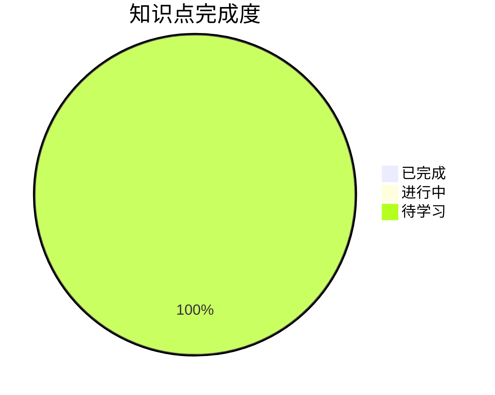

# 📊 学习进度追踪

## 整体进度

## 详细进度

### 1. 用定义
- [ ] ε-N 定义理解
- [ ] 定义证明极限
> ⚠️ 卷面上不考，了解即可

### 2. 用性质
- [ ] 唯一性
- [ ] 有界性
- [ ] 保号性
> ⚠️ 保号性注意与函数极限的区别

### 3. 用四则运算规则
- [ ] 加减乘除规则
- [ ] 有理分式型极限
- [ ] 根式有理化

### 4. 用海涅定理
- [ ] 海涅定理内容
- [ ] 数列与函数极限的联系
> 🔗 桥梁作用

### 5. 用夹逼准则
- [ ] 夹逼准则定理
- [ ] 放缩技巧
- [ ] n 项和极限
> ⭐⭐⭐⭐⭐ 重点

### 6. 用单调有界准则
- [ ] 单调有界准则
- [ ] 递推数列求极限
- [ ] 数学归纳法证明
> ⭐⭐⭐⭐⭐ 重点

### 7. 收敛速度问题
- [ ] 收敛阶概念
- [ ] 速度比较
> 了解即可

### 8. 求极限与证明
- [ ] 综合题型
- [ ] 大题训练
> 📌 命题高峰

## 复习记录

| 日期 | 内容 | 掌握程度 | 备注 |
|------|------|----------|------|
| - | - | - | - |

## 错题记录

| 日期 | 题目 | 错误类型 | 归因 |
|------|------|----------|------|
| - | - | - | - |

## 下一步计划

1. [ ] 完成 2-用性质 的学习
2. [ ] 掌握夹逼准则的放缩技巧
3. [ ] 练习单调有界准则典型题
