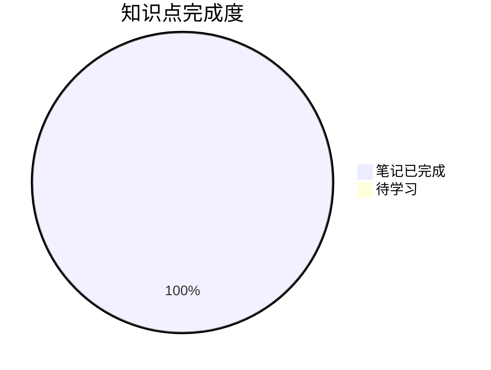

# 📊 学习进度追踪

## 整体进度

> ✅ **所有知识点笔记已创建完成！**

## 详细进度

### 0. 数列的概念 ✅ 笔记已完成
- [x] 数列的定义 ✅ (2026-03-09)
- [x] 子列 ✅ (2026-03-09)
- [x] 常见数列类型 ✅ (2026-03-09)
> 📝 笔记链接: [[0-数列的概念/README]]
> ⭐ 重点：数列的函数本质、子列发散判别法、重要数列 $(1+\frac{1}{n})^n$

### 1. 用定义 ✅ 笔记已完成
- [x] ε-N 定义理解 ✅ (2026-03-09)
- [x] 子列收敛关系 ✅ (2026-03-09)
> ⚠️ 卷面上不考，了解即可
> 📝 笔记链接: [[1-用定义/📑 索引]]
> ⭐ 重点：充分必要条件判断（ε 是否依赖于 n）

### 2. 用性质 ✅ 笔记已完成
- [x] 唯一性 ✅ (2026-03-09)
- [x] 有界性 ✅ (2026-03-09)
- [x] 保号性 ✅ (2026-03-09) ⭐⭐⭐⭐⭐
- [x] 保号性综合应用（最值问题） ✅ (2026-03-09)
> 📝 笔记链接: [[2-用性质/README]]
> ⭐ 重点：**保号性是重中之重**，脱帽法（严格不等）、戴帽法（非严格不等）

### 3. 用四则运算规则 ✅ 笔记已完成
- [x] 四则运算规则 ✅ (2026-03-09)
- [x] 极限存在性判断 ✅ (2026-03-09)
> 📝 笔记链接: [[3-用四则运算规则/README]]
> ⭐ 重点：存在±不存在=不存在，不存在±不存在=不确定

### 4. 用海涅定理 ✅ 笔记已完成
- [x] 海涅定理内容 ✅ (2026-03-09)
- [x] 数列极限转函数极限 ✅ (2026-03-09)
> 📝 笔记链接: [[4-用海涅定理/README]]
> ⭐ 重点：桥梁作用，转化后可用洛必达/泰勒/等价无穷小

### 5. 用夹逼准则 ✅ 笔记已完成
- [x] 夹逼准则定理 ✅ (2026-03-09)
> 📝 笔记链接: [[5-用夹逼准则/夹逼准则]]
> ⭐ 重点：放缩技巧，n 项和极限

### 6. 用单调有界准则 ✅ 笔记已完成
- [x] 单调有界准则 ✅ (2026-03-09)
- [x] 压缩映射原理 ✅ (2026-03-09)
> 📝 笔记链接: [[6-用单调有界准则/README]]
> ⭐ 重点：递推数列 $x_{n+1} = f(x_n)$ 的极限求法

### 7. 收敛速度问题 ✅ 笔记已完成
- [x] 收敛速度概念 ✅ (2026-03-09)
> 📝 笔记链接: [[7-收敛速度问题/README]]
> ⭐ 重点：极限定义不体现收敛速度，充分不必要条件判断

## 📊 知识点掌握统计

| 模块 | 笔记状态 | 学习状态 | 重点级别 |
|------|:--------:|:--------:|:--------:|
| 0-数列的概念 | ✅ 已完成 | 📖 待学习 | ⭐⭐⭐ |
| 1-用定义 | ✅ 已完成 | 📖 待学习 | ⭐⭐ |
| 2-用性质 | ✅ 已完成 | 📖 待学习 | ⭐⭐⭐⭐⭐ |
| 3-用四则运算规则 | ✅ 已完成 | 📖 待学习 | ⭐⭐⭐⭐ |
| 4-用海涅定理 | ✅ 已完成 | 📖 待学习 | ⭐⭐⭐⭐⭐ |
| 5-用夹逼准则 | ✅ 已完成 | 📖 待学习 | ⭐⭐⭐⭐⭐ |
| 6-用单调有界准则 | ✅ 已完成 | 📖 待学习 | ⭐⭐⭐⭐⭐ |
| 7-收敛速度问题 | ✅ 已完成 | 📖 待学习 | ⭐⭐ |

## 复习记录

| 日期 | 内容 | 掌握程度 | 备注 |
|------|------|----------|------|
| - | - | - | - |

## 错题记录

| 日期 | 题目 | 错误类型 | 归因 |
|------|------|----------|------|
| - | - | - | - |

## 下一步计划

1. [ ] 按学习路线顺序学习各模块
2. [ ] 重点掌握 **保号性** 的脱帽法/戴帽法
3. [ ] 练习海涅定理转化数列极限
4. [ ] 掌握夹逼准则的放缩技巧
5. [ ] 练习单调有界准则处理递推数列

## 考试重点提醒 ⚠️

> [!warning] 五星重点
> 1. **保号性**：脱帽法（$>$）、戴帽法（$\geqslant$）
> 2. **海涅定理**：数列极限与函数极限的桥梁
> 3. **夹逼准则**：n 项和极限
> 4. **单调有界准则**：递推数列求极限

---
*创建日期: 2026-03-09*
*更新日期: 2026-03-09*
