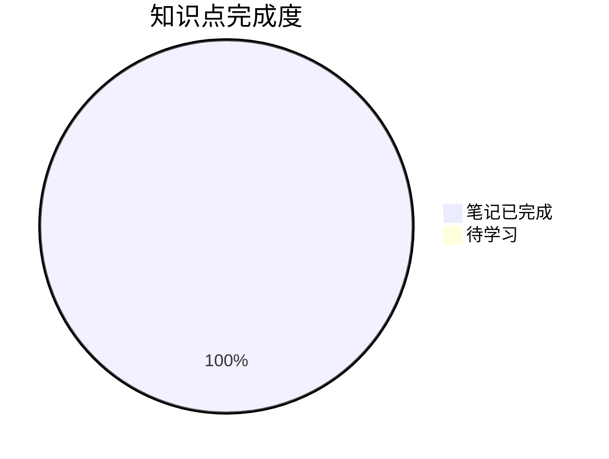

# 📊 学习进度追踪

## 整体进度

> ✅ **所有知识点笔记已创建完成！**

## 详细进度

### 0. 数列的概念 ✅ 笔记已完成
- [x] 数列的定义 ✅ (2026-03-09)
- [x] 子列 ✅ (2026-03-09)
- [x] 常见数列类型 ✅ (2026-03-09)
> 📝 笔记链接: [[0-数列的概念/README]]
> ⭐ 重点：数列的函数本质、子列发散判别法、重要数列 $(1+\frac{1}{n})^n$

### 1. 用定义 ✅ 笔记已完成
- [x] ε-N 定义理解 ✅ (2026-03-09)
- [x] 子列收敛关系 ✅ (2026-03-09)
> ⚠️ 卷面上不考，了解即可
> 📝 笔记链接: [[1-用定义/📑 索引]]
> ⭐ 重点：充分必要条件判断（ε 是否依赖于 n）

### 2. 用性质 ✅ 笔记已完成
- [x] 唯一性 ✅ (2026-03-09)
- [x] 有界性 ✅ (2026-03-09)
- [x] 保号性 ✅ (2026-03-09) ⭐⭐⭐⭐⭐
- [x] 保号性综合应用（最值问题） ✅ (2026-03-09)
> 📝 笔记链接: [[2-用性质/README]]
> ⭐ 重点：**保号性是重中之重**，脱帽法（严格不等）、戴帽法（非严格不等）

### 3. 用四则运算规则 ✅ 笔记已完成
- [x] 四则运算规则 ✅ (2026-03-09)
- [x] 极限存在性判断 ✅ (2026-03-09)
> 📝 笔记链接: [[3-用四则运算规则/README]]
> ⭐ 重点：存在±不存在=不存在，不存在±不存在=不确定

### 4. 用海涅定理 ✅ 笔记已完成
- [x] 海涅定理内容 ✅ (2026-03-09)
- [x] 数列极限转函数极限 ✅ (2026-03-09)
> 📝 笔记链接: [[4-用海涅定理/README]]
> ⭐ 重点：桥梁作用，转化后可用洛必达/泰勒/等价无穷小

### 5. 用夹逼准则 ✅ 学习完成（含重学放缩技巧）
- [x] 夹逼准则定理 ✅ (2026-03-09)
- [x] 夹逼准则习题 ✅ (2026-03-12)
> 📝 笔记链接: [[5-用夹逼准则/夹逼准则]]
> ⭐ 重点：放缩技巧，n 项和极限
> 📌 学习用时：104分钟（含习题）

### 6. 用单调有界准则 ✅ 学习完成（含习题）
- [x] 单调有界准则 ✅ (2026-03-09)
- [x] 压缩映射原理 ✅ (2026-03-09)
- [x] 单调有界准则习题 ✅ (2026-03-13)
> 📝 笔记链接: [[6-用单调有界准则/README]]
> ⭐ 重点：递推数列 $x_{n+1} = f(x_n)$ 的极限求法
> 📌 学习用时：120分钟（含全章复习）

### 7. 收敛速度问题 ✅ 笔记已完成
- [x] 收敛速度概念 ✅ (2026-03-09)
> 📝 笔记链接: [[7-收敛速度问题/README]]
> ⭐ 重点：极限定义不体现收敛速度，充分不必要条件判断

## 📊 知识点掌握统计

| 模块 | 笔记状态 | 学习状态 | 重点级别 |
|------|:--------:|:--------:|:--------:|
| 0-数列的概念 | ✅ 已完成 | ✅ 已学习 | ⭐⭐⭐ |
| 1-用定义 | ✅ 已完成 | ✅ 已学习 | ⭐⭐ |
| 2-用性质 | ✅ 已完成 | ✅ 已学习 | ⭐⭐⭐⭐⭐ |
| 3-用四则运算规则 | ✅ 已完成 | ✅ 已学习（习题已完成） | ⭐⭐⭐⭐ |
| 4-用海涅定理 | ✅ 已完成 | ✅ 已学习（习题已完成） | ⭐⭐⭐⭐⭐ |
| 5-用夹逼准则 | ✅ 已完成 | ✅ 已学习（重学+习题已完成） | ⭐⭐⭐⭐⭐ |
| 6-用单调有界准则 | ✅ 已完成 | ✅ 已学习（习题已完成） | ⭐⭐⭐⭐⭐ |
| 7-收敛速度问题 | ✅ 已完成 | 📖 待学习（了解即可） | ⭐⭐ |

## 复习记录

| 日期 | 内容 | 掌握程度 | 备注 |
|------|------|----------|------|
| 2026-03-09 | 0-数列的概念 | ✅ 已掌握 | 数列定义、子列、常见数列类型 |
| 2026-03-09 | 1-用定义 | ✅ 已掌握 | ε-N定义、子列收敛关系 |
| 2026-03-10 | 2-用性质 | ✅ 已掌握 | 唯一性、有界性、保号性（脱帽法/戴帽法） | 学习用时100分钟 |
| 2026-03-10 | 3-用四则运算规则 | 📖 知识点已学习（习题未完成） | 四则运算规则、存在性判断 |
| 2026-03-10 | 4-用海涅定理 | 📖 知识点已学习（习题未完成） | 数列极限转函数极限的桥梁 |
| 2026-03-11 | 3+4模块习题补完 | ✅ 已完成 | 完成昨日未完成习题 |
| 2026-03-12 | 5-用夹逼准则 | ✅ 已掌握 | 夹逼准则+习题（104分钟） |
| 2026-03-12 | 6-用单调有界准则 | 📖 理论已学 | 单调有界准则理论学习（2026-03-12） |
| 2026-03-12 | 函数极限复习 | ✅ 已完成 | 函数极限与连续全章复习 |
| 2026-03-12 | 错题练习10题 | ✅ 已完成 | 数列极限错题10题（95分钟） |
| 2026-03-13 | 数列极限全章复习 | ✅ 已掌握 | 0-6模块全章复习+习题（120分钟） |
| 2026-03-13 | 错题练习10题 | ✅ 已完成 | 数列极限综合错题10题（70分钟） |
| 2026-03-14 | 数列极限知识梳理+错题练习 | ✅ 已完成 | 知识梳理+错题练习（知识巩固） |
| 2026-04-03 | 数列极限复习+错题10道 | ✅ 已完成 | 复习+错题练习（100分钟） |
| 2026-05-13 | 数列极限二刷（未完成） | 🔄 进行中 | 二刷数列极限，未完成（时间不足），仍需继续 |

## 错题记录

| 日期 | 题目 | 错误类型 | 归因 |
|------|------|----------|------|
| 2026-03-11 | 错题练习10题 | - | 函数极限+数列极限错题（108分钟） |
| 2026-03-12 | 夹逼准则放缩精度问题 | 放缩过粗 | 分子有规律变化时需保留求和 |

## 学习困难点记录

| 日期 | 知识点 | 困难点 | 解决计划 |
|------|--------|--------|----------|
| 2026-03-11 | 夹逼准则 | 放缩技巧不知道怎么放缩 | 已解决 ✅ |

## 下一步计划

1. [x] **重学夹逼准则**（放缩技巧）- 已完成 ✅
2. [x] 单调有界准则习题练习 - 已完成 ✅ (2026-03-13)
3. [x] 全章复习（函数极限+数列极限）- 已完成 ✅
4. [x] 继续坚持错题练习（每天10题）✅ 进行中
5. [ ] 7-收敛速度问题（了解即可，碎片时间）
6. [ ] 进入下一章：一元函数微分学

## 考试重点提醒 ⚠️

> [!warning] 五星重点
> 1. **保号性**：脱帽法（$>$）、戴帽法（$\geqslant$）
> 2. **海涅定理**：数列极限与函数极限的桥梁
> 3. **夹逼准则**：n 项和极限
> 4. **单调有界准则**：递推数列求极限

---
*创建日期: 2026-03-09*
*更新日期: 2026-05-13*
