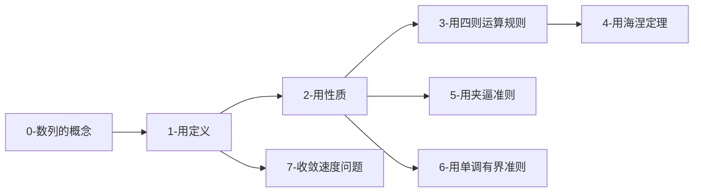

# 数列极限

> [!info] 模块概述
> 数列极限是高等数学的基础内容，与函数极限有密切联系。本章系统学习数列极限的定义、性质和计算方法。

## 📂 知识点结构

```
数列极限
├── [[0-数列的概念/README|0-数列的概念]] 📚 基础知识
│   ├── [[0-数列的概念/数列的定义|数列的定义]] ⭐⭐⭐ 整标函数
│   ├── [[0-数列的概念/子列|子列]] ⭐⭐⭐⭐ 发散判别法
│   └── [[0-数列的概念/常见数列类型|常见数列类型]] ⭐⭐⭐⭐ 等差/等比/单调/有界
│
├── [[1-用定义/📑 索引|1-用定义]] ⚠️ 卷面上不考
│   ├── [[1-用定义/ε-N定义|ε-N定义]] ⭐⭐⭐ 核心定义
│   └── [[1-用定义/子列收敛关系|子列收敛关系]] ⭐⭐⭐⭐
│
├── [[2-用性质/README|2-用性质]] 🔑 核心性质
│   ├── [[2-用性质/唯一性/唯一性|唯一性]] ⭐⭐⭐ 极限若存在则唯一
│   ├── [[2-用性质/有界性/有界性|有界性]] ⭐⭐⭐⭐ 极限存在 ⇒ 有界
│   ├── [[2-用性质/保号性/保号性|保号性]] ⭐⭐⭐⭐⭐ 脱帽法/戴帽法
│   └── [[2-用性质/保号性应用-最值问题|保号性综合应用]] - 最值问题
│
├── [[3-用四则运算规则/README|3-用四则运算规则]] ➕➖✖️➗
│   ├── [[3-用四则运算规则/四则运算规则|四则运算规则]] ⭐⭐⭐⭐
│   └── [[3-用四则运算规则/极限存在性判断|极限存在性判断]] ⭐⭐⭐⭐⭐
│
├── [[4-用海涅定理/README|4-用海涅定理]] 🔗 联系数列极限与函数极限
│   ├── [[4-用海涅定理/海涅定理|海涅定理]] ⭐⭐⭐⭐⭐ 归结原则
│   └── [[4-用海涅定理/数列极限转函数极限|数列极限转函数极限]] 可用洛必达/泰勒
│
├── [[5-用夹逼准则/夹逼准则|5-用夹逼准则]] 🔗 放缩技巧
│   └── [[5-用夹逼准则/夹逼准则|夹逼准则]] ⭐⭐⭐⭐⭐ 核心准则
│
├── [[6-用单调有界准则/README|6-用单调有界准则]] 🔗 递推数列
│   ├── [[6-用单调有界准则/单调有界准则|单调有界准则]] ⭐⭐⭐⭐⭐ 核心准则
│   └── [[6-用单调有界准则/压缩映射原理|压缩映射原理]] 🔧 数列不单调时使用
│
└── [[7-收敛速度问题/README|7-收敛速度问题]] 🔍 选择题技巧
    └── [[7-收敛速度问题/收敛速度的比较|收敛速度的比较]] ⭐ 极限定义不体现速度
```

## 🎯 学习路线



### 建议学习顺序

1. **数列的概念** → 理解数列的本质是整标函数 $x_n = f(n)$
2. **用定义** → 了解 ε-N 定义（卷面不考，但有助于理解）
3. **用性质** → 掌握三大性质（唯一性、有界性、**保号性**）
4. **用四则运算规则** → 熟练运用四则运算和存在性判断
5. **用海涅定理** → 理解数列极限与函数极限的桥梁
6. **用夹逼准则** → 掌握放缩技巧，处理 n 项和极限
7. **用单调有界准则** → 处理递推数列的极限
8. **收敛速度问题** → 了解收敛速度与充分必要条件的关系

## 📊 学习进度概览

| 模块 | 状态 | 笔记完成 | 重点程度 |
|------|:----:|:--------:|:--------:|
| 0-数列的概念 | 📝笔记已创建 | ✅ 3/3 | ⭐⭐⭐ |
| 1-用定义 | 📝笔记已创建 | ✅ 2/2 | ⭐⭐ |
| 2-用性质 | 📝笔记已创建 | ✅ 4/4 | ⭐⭐⭐⭐⭐ |
| 3-用四则运算规则 | 📝笔记已创建 | ✅ 2/2 | ⭐⭐⭐⭐ |
| 4-用海涅定理 | 📝笔记已创建 | ✅ 2/2 | ⭐⭐⭐⭐⭐ |
| 5-用夹逼准则 | 📝笔记已创建 | ✅ 1/1 | ⭐⭐⭐⭐⭐ |
| 6-用单调有界准则 | 📝笔记已创建 | ✅ 2/2 | ⭐⭐⭐⭐⭐ |
| 7-收敛速度问题 | 📝笔记已创建 | ✅ 1/1 | ⭐⭐ |

> 详细进度请查看 [[📊 学习进度]]

## 🎯 考试要点速查

### 必背公式

| 公式 | 内容 |
|------|------|
| 等差数列前 n 项和 | $S_n = \frac{n}{2}(a_1 + a_n)$ |
| 等比数列前 n 项和 | $S_n = \frac{a_1(1-r^n)}{1-r}$ ($r \neq 1$) |
| 自然数和 | $\sum_{k=1}^{n} k = \frac{n(n+1)}{2}$ |
| 平方和 | $\sum_{k=1}^{n} k^2 = \frac{n(n+1)(2n+1)}{6}$ |
| 裂项相消 | $\sum_{k=1}^{n} \frac{1}{k(k+1)} = \frac{n}{n+1}$ |
| 重要极限 | $\lim_{n \to \infty} \left(1 + \frac{1}{n}\right)^n = e$ |

### 核心定理

| 定理 | 内容 | 应用 |
|------|------|------|
| 保号性（脱帽法） | $\lim x_n > b \Rightarrow x_n > b$ | 判断项的符号 |
| 保号性（戴帽法） | $x_n \geq b \Rightarrow \lim x_n \geq b$ | 证明极限不等式 |
| 海涅定理 | 数列极限 ⇔ 函数极限 | 用洛必达/泰勒 |
| 夹逼准则 | $y_n \leq x_n \leq z_n$ 且 $y_n, z_n \to a$ ⇒ $x_n \to a$ | n 项和极限 |
| 单调有界准则 | 单调 + 有界 ⇒ 极限存在 | 递推数列 |

### 保号性记忆口诀

| 方法 | 方向 | 不等类型 | 记忆 |
|------|------|----------|------|
| **脱帽法** | 极限 → 项 | **严格** $>$ | 脱了帽子更自由 |
| **戴帽法** | 项 → 极限 | **非严格** $\geqslant$ | 戴上帽子要保守 |

## 🔗 相关模块

- [[高数-函数极限与连续]] - 函数极限
- [[高数-一元函数微分学]] - 后续应用

---
*创建日期: 2026-03-09*
*更新日期: 2026-03-09*
